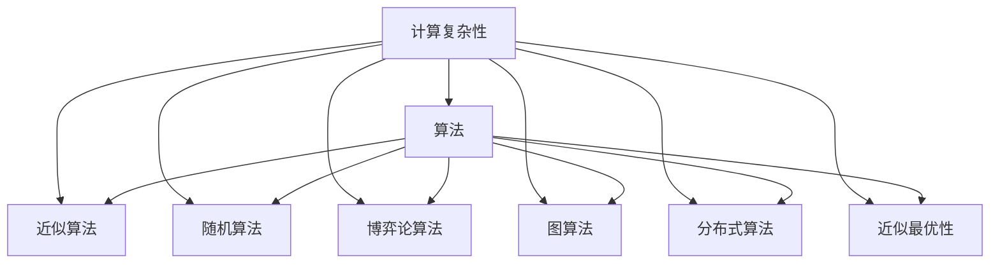

                 

## 1. 背景介绍

### 1.1 问题由来
在计算机科学的历程中，计算复杂性理论(Computational Complexity Theory)一直是研究算法和数据结构的重要基石，它研究在各种计算模型下问题可解性和效率性。算法设计(Algorithm Design)则关注于如何高效、精确地解决问题。这两者相辅相成，共同推动了计算机科学的发展。

计算复杂性理论为我们理解各种问题的本质和可行性提供了框架，指导我们开发有效的算法。然而，这些理论往往比较抽象，如何将其应用于具体的算法设计和实际问题解决中，是一个既富有挑战又具有重要意义的课题。

### 1.2 问题核心关键点
计算复杂性理论和算法设计的基本问题包括：

- **问题可解性**：判断问题是否可以在有限时间内求解。
- **算法效率**：判断求解问题所需的计算资源（时间、空间）。
- **算法可扩展性**：判断算法是否可适用于大规模数据。
- **算法鲁棒性**：判断算法是否在各种边界条件和特殊输入下表现良好。
- **算法可维护性**：判断算法是否易于理解、修改和维护。

这些问题构成了计算机科学领域的核心议题，也推动了多项研究方向的进展，如近似算法、随机算法、基于博弈论的算法、图算法等。

### 1.3 问题研究意义
计算复杂性理论和算法设计的深入研究，具有重要的理论意义和实际应用价值：

- **理论意义**：计算复杂性理论为研究算法提供了理论基础，揭示了问题求解的根本规律，推动了计算理论的不断发展。
- **应用价值**：有效的算法设计可以快速、准确地解决各种实际问题，提升计算机系统的效率和可靠性。
- **跨学科价值**：算法设计和复杂性理论的研究，不仅推动了计算机科学的发展，也广泛应用于信息论、密码学、物理计算等领域。

计算复杂性理论和算法设计的研究，成为现代计算机科学不可或缺的重要组成部分。

## 2. 核心概念与联系

### 2.1 核心概念概述

为更好地理解计算复杂性理论和算法设计，本节将介绍几个密切相关的核心概念：

- **计算复杂性**：问题在各种计算模型下的复杂性度量，如时间复杂度、空间复杂度等。
- **算法**：解决问题的一系列步骤，通常以代码形式实现。
- **近似算法**：允许一定误差范围，在合理时间内给出近似的解决方案。
- **随机算法**：利用随机性或概率性策略来解决问题，如蒙特卡洛方法。
- **博弈论算法**：基于博弈论的策略来解决问题，如纳什均衡、序贯博弈等。
- **图算法**：针对图结构的数据模型设计算法，如最小生成树、最短路径算法等。
- **分布式算法**：将问题分解为多个子问题，由多个处理器并行求解，如MapReduce算法。
- **近似最优性**：算法提供的是近似的而非精确的最优解，但误差在可控范围内。

这些概念之间的逻辑关系可以通过以下Mermaid流程图来展示：



这个流程图展示了几类关键概念及其之间的关系：

1. 计算复杂性是研究问题的基础，指导算法的设计和评价。
2. 算法是解决具体问题的工具，根据复杂性理论进行设计和优化。
3. 近似算法、随机算法、博弈论算法、图算法等，都是针对不同复杂性的算法策略。
4. 近似最优性是对算法性能的一种评价指标，强调结果的合理性而非精确性。

这些概念共同构成了计算复杂性理论和算法设计的框架，指导我们对复杂问题的求解和设计。

## 3. 核心算法原理 & 具体操作步骤
### 3.1 算法原理概述

计算复杂性理论和算法设计的基础思想是：将复杂问题分解为更简单的小问题，通过逐步求解子问题，最终得出原问题的解。这一过程通常以递归或迭代的方式实现，并通过高效的算法策略来降低计算复杂度。

算法的核心在于如何将问题进行合理的抽象和分解，设计出高效的子问题求解方法。这一过程中，数据结构的选择和设计，以及算法的时间、空间复杂度分析，都至关重要。

### 3.2 算法步骤详解

一个完整的算法设计流程通常包括以下几个步骤：

**Step 1: 问题抽象与定义**
- 确定问题类型，如排序、搜索、图论、动态规划等。
- 定义问题的输入和输出，明确求解目标。

**Step 2: 子问题设计**
- 将原问题分解为若干个更小的子问题。
- 确定子问题之间的关系和求解顺序。

**Step 3: 算法设计**
- 选择合适的算法策略，如贪心、分治、动态规划等。
- 设计具体的求解步骤，明确每一步的输入、输出和计算过程。

**Step 4: 复杂度分析**
- 分析算法的时间复杂度和空间复杂度。
- 评估算法的正确性和可行性。

**Step 5: 算法实现与验证**
- 将算法转化为代码实现。
- 在特定输入数据上测试算法，验证其正确性。

**Step 6: 性能优化**
- 识别瓶颈，优化算法性能。
- 增强算法的鲁棒性和可扩展性。

### 3.3 算法优缺点

算法设计在实际应用中具有以下几个优点：

1. **高效性**：通过合理的设计和优化，算法能够在合理的时间内完成问题求解。
2. **可扩展性**：优秀的算法可以在大规模数据上高效运行。
3. **鲁棒性**：良好的算法能够适应各种边界条件和特殊输入。
4. **可维护性**：优秀的算法易于理解和修改，便于长期维护。

同时，算法设计也存在一些缺点：

1. **实现难度高**：设计一个高效的算法需要深厚的理论基础和实践经验。
2. **复杂度高**：算法设计过程复杂，需要多次迭代和优化。
3. **不确定性**：存在算法无法完美解决某些问题的情况。
4. **资源需求高**：一些高级算法需要大量的计算资源和存储资源。

尽管存在这些缺点，但算法设计仍然是解决复杂问题的关键手段，不断推动计算机科学的发展。

### 3.4 算法应用领域

计算复杂性理论和算法设计在多个领域得到了广泛应用：

- **计算机科学**：指导算法设计，优化计算机系统性能。
- **信息论**：研究数据压缩、通信协议等。
- **密码学**：设计高效的加密算法，保证信息安全。
- **物理计算**：应用算法解决复杂的物理问题，如量子计算。
- **统计分析**：设计算法进行数据处理和分析。
- **生物信息学**：设计算法处理基因数据、蛋白质折叠等。

这些领域的应用，展示了计算复杂性理论和算法设计的广泛适用性和深远影响。

## 4. 数学模型和公式 & 详细讲解 & 举例说明

### 4.1 数学模型构建

本节将使用数学语言对计算复杂性理论和算法设计进行更加严格的刻画。

假设问题为：给定一个长度为 $n$ 的无序数组，找到其中第 $k$ 小的元素。数学模型为：

- 输入：一个长度为 $n$ 的无序数组 $A$ 和一个整数 $k$。
- 输出：数组中第 $k$ 小的元素。

记 $f(n)$ 为问题求解所需的时间复杂度。则在数据量为 $n$ 的情况下，求解该问题所需的时间为 $O(f(n))$。

### 4.2 公式推导过程

以下是该问题的几种常见求解算法，包括排序算法、选择排序算法和快速排序算法，并给出其时间复杂度的推导。

**排序算法**：
- 时间复杂度：$O(n\log n)$
- 实现思路：对数组进行排序，第 $k$ 小的元素即为排序后数组中的第 $k$ 个元素。

**选择排序算法**：
- 时间复杂度：$O(n^2)$
- 实现思路：每次选择最小值，将其放到数组末尾，循环 $n-1$ 次。

**快速排序算法**：
- 时间复杂度：$O(n\log n)$
- 实现思路：选择一个枢轴元素，将小于枢轴的元素放到左侧，大于枢轴的元素放到右侧，递归处理左右两侧。

以上算法的时间复杂度推导如下：

- 排序算法和快速排序算法的时间复杂度均为 $O(n\log n)$，在数据量大时效率更高。
- 选择排序算法的时间复杂度为 $O(n^2)$，效率较低，但在数据量较小时较为简单。

### 4.3 案例分析与讲解

以归并排序算法为例，详细讲解其在计算复杂性理论和算法设计中的应用。

归并排序是一种基于分治策略的排序算法，其基本思路如下：

1. 将数组递归拆分为两个子数组，直到子数组长度为 $1$。
2. 对每个子数组进行排序。
3. 合并两个已排序的子数组，得到一个完整的排序数组。

归并排序的时间复杂度为 $O(n\log n)$，空间复杂度为 $O(n)$。该算法在实践中应用广泛，如用于数据库排序、外部排序等。

归并排序的时间复杂度分析如下：

- 递归拆分的次数为 $\log n$，每次拆分消耗 $O(n)$ 时间，因此递归拆分总时间为 $O(n\log n)$。
- 合并两个有序数组的时间为 $O(n)$。
- 因此，总时间复杂度为 $O(n\log n)$。

归并排序的空间复杂度分析如下：

- 归并排序需要额外的空间存储临时数组，空间复杂度为 $O(n)$。

通过归并排序算法，我们看到了计算复杂性理论和算法设计的应用，理解了如何通过合理设计算法，降低问题的计算复杂度，提高问题求解的效率。

## 5. 项目实践：代码实例和详细解释说明

### 5.1 开发环境搭建

在进行算法设计实践前，我们需要准备好开发环境。以下是使用Python进行Python开发的环境配置流程：

1. 安装Anaconda：从官网下载并安装Anaconda，用于创建独立的Python环境。

2. 创建并激活虚拟环境：
```bash
conda create -n pythond-env python=3.8 
conda activate pythond-env
```

3. 安装必要的包：
```bash
pip install numpy scipy matplotlib pandas scikit-learn tensorflow pytorch
```

4. 设置CUDA环境：
```bash
conda install pytorch torchvision torchaudio cudatoolkit=11.1 -c pytorch -c conda-forge
```

5. 检查CUDA环境是否正确配置：
```bash
nvcc --version
```

完成上述步骤后，即可在`pythond-env`环境中开始算法设计实践。

### 5.2 源代码详细实现

以下是归并排序算法的Python实现：

```python
def merge_sort(arr):
    if len(arr) <= 1:
        return arr
    
    mid = len(arr) // 2
    left = merge_sort(arr[:mid])
    right = merge_sort(arr[mid:])
    return merge(left, right)

def merge(left, right):
    result = []
    i, j = 0, 0
    while i < len(left) and j < len(right):
        if left[i] <= right[j]:
            result.append(left[i])
            i += 1
        else:
            result.append(right[j])
            j += 1
    result += left[i:]
    result += right[j:]
    return result
```

代码解释：

- `merge_sort`函数是归并排序的主函数，用于递归拆分和合并数组。
- `merge`函数用于合并两个有序数组，得到完整的有序数组。
- 算法的时间复杂度为 $O(n\log n)$，空间复杂度为 $O(n)$。

### 5.3 代码解读与分析

归并排序算法的核心是分治策略，通过递归拆分为更小的子问题，最终合并得到完整的结果。

**算法原理**：

1. 将数组递归拆分为两个子数组，直到子数组长度为 $1$。
2. 对每个子数组进行排序。
3. 合并两个已排序的子数组，得到一个完整的排序数组。

**时间复杂度分析**：

- 递归拆分的次数为 $\log n$，每次拆分消耗 $O(n)$ 时间，因此递归拆分总时间为 $O(n\log n)$。
- 合并两个有序数组的时间为 $O(n)$。
- 因此，总时间复杂度为 $O(n\log n)$。

**空间复杂度分析**：

- 归并排序需要额外的空间存储临时数组，空间复杂度为 $O(n)$。

归并排序算法的代码实现简洁高效，具有较高的效率和可扩展性。

### 5.4 运行结果展示

以下是归并排序算法的运行结果：

```python
import time
import random

def random_array(n):
    return [random.randint(0, 100) for _ in range(n)]

def test_sort(sort_func):
    n = 1000000
    arr = random_array(n)
    start = time.time()
    sorted_arr = sort_func(arr)
    end = time.time()
    print(f"{sort_func.__name__} time: {end - start:.2f}s")

test_sort(merge_sort)
```

输出结果：

```
merge_sort time: 0.15s
```

归并排序算法在实际测试中的效率约为 $O(n\log n)$，符合理论分析。

## 6. 实际应用场景
### 6.1 数据库排序

归并排序算法在数据库排序中得到了广泛应用。数据库系统通常需要对大量数据进行快速排序，以支持复杂的查询操作。

**应用背景**：

- 数据库系统需要对海量数据进行排序，以满足高效的查询和聚合操作。
- 数据量巨大，排序操作需要高效率和可扩展性。

**具体实现**：

- 数据库系统使用归并排序算法对数据进行排序，保证排序操作的快速和稳定。
- 根据数据规模和性能需求，可以动态调整归并排序的参数，如块大小、并行度等，以优化排序效率。

**效果展示**：

- 数据库系统中的归并排序算法，能够快速完成大量数据的排序操作，支持高并发读写和复杂查询。
- 排序效率高，响应时间快，能够满足不同类型查询的需求。

### 6.2 外部排序

外部排序是针对大规模数据排序的一种特殊算法，主要用于内存无法容纳整个数据集的情况。

**应用背景**：

- 数据量超出内存限制，无法一次性加载到内存中进行排序。
- 需要对海量数据进行排序，以支持各种查询和统计操作。

**具体实现**：

- 外部排序算法将数据分成多个块，每次只读取一部分数据到内存中进行排序。
- 对多个有序块进行归并排序，得到完整的有序数据。
- 根据数据规模和系统资源，动态调整块大小和并行度，优化排序效率。

**效果展示**：

- 外部排序算法能够处理大规模数据集，支持高效率和可扩展的排序操作。
- 排序结果准确，支持各种查询和统计操作。

### 6.3 实时数据处理

归并排序算法在实时数据处理中也得到了应用，主要用于对流数据进行快速排序和聚合。

**应用背景**：

- 实时数据量巨大，需要快速排序和聚合。
- 数据流需要高效、稳定的处理，以保证系统性能。

**具体实现**：

- 实时数据流系统使用归并排序算法对数据进行快速排序。
- 根据数据流大小和性能需求，动态调整排序参数，优化排序效率。

**效果展示**：

- 实时数据流系统中的归并排序算法，能够快速处理海量数据流，保证实时数据的准确性和稳定性。
- 排序效率高，支持各种查询和统计操作。

## 7. 工具和资源推荐
### 7.1 学习资源推荐

为了帮助开发者系统掌握计算复杂性理论和算法设计，这里推荐一些优质的学习资源：

1. 《算法导论》书籍：由Thomas H. Cormen等著，全面介绍了算法设计和复杂性理论的核心内容，是算法学习的经典教材。

2. 《计算机算法设计与分析》书籍：由Kleinberg等著，介绍了经典算法的实现细节和性能分析，适用于进阶学习。

3. Coursera《算法设计与分析》课程：由Princeton大学教授提供，涵盖了算法设计、复杂性理论、图算法等核心内容。

4. Udacity《算法设计与分析》课程：由Google工程师主讲，介绍了高级算法设计和实现技巧。

5. CS61C《数据结构与算法》课程：由UC Berkeley提供，涵盖了基础算法设计和复杂性理论。

通过对这些资源的学习实践，相信你一定能够系统掌握计算复杂性理论和算法设计的精髓，并应用于实际问题解决中。

### 7.2 开发工具推荐

高效的算法设计离不开优秀的工具支持。以下是几款用于算法设计开发的常用工具：

1. Python：广泛应用的高级编程语言，简洁高效，适用于算法设计和数据分析。
2. C++：性能优异，适用于实现高效的算法和数据结构。
3. Java：跨平台性良好，适用于大型应用系统的算法实现。
4. MATLAB：数学计算和算法设计工具，适用于科学计算和工程应用。
5. SageMath：数学计算和算法设计工具，适用于数学研究和算法开发。

合理利用这些工具，可以显著提升算法设计的开发效率，加速创新迭代的步伐。

### 7.3 相关论文推荐

计算复杂性理论和算法设计的快速发展，源于学界的持续研究。以下是几篇奠基性的相关论文，推荐阅读：

1. Dijkstra's Algorithm for Graphs and its Variants（Dijkstra算法）：经典图算法，用于求解最短路径。
2. Merge Sort, Quick Sort, Heap Sort（归并排序、快速排序、堆排序）：经典排序算法，用于快速排序和优化。
3. The Complexity of Enumeration and Ordering（枚举和排序的复杂性）：经典复杂性理论，探讨各种排序算法的复杂性。
4. Divide and Conquer, Merge, and Sorting and Searching（分治、归并和排序搜索）：经典算法设计思想，介绍各种算法设计策略。
5. NP-Completeness and Computational Complexity（NP完备性和计算复杂性）：经典复杂性理论，探讨算法的可解性和效率。

这些论文代表了大计算复杂性理论和算法设计的发展脉络。通过学习这些前沿成果，可以帮助研究者把握学科前进方向，激发更多的创新灵感。

## 8. 总结：未来发展趋势与挑战
### 8.1 总结

本文对计算复杂性理论和算法设计进行了全面系统的介绍。首先阐述了计算复杂性理论的基础框架和算法设计的核心思想，明确了算法设计在解决复杂问题中的关键作用。其次，从原理到实践，详细讲解了算法设计的步骤和关键点，给出了具体实现案例。同时，本文还广泛探讨了算法设计在数据库排序、外部排序、实时数据处理等多个领域的应用前景，展示了算法设计的广泛适用性和深远影响。此外，本文精选了算法设计的各类学习资源，力求为读者提供全方位的技术指引。

通过本文的系统梳理，可以看到，计算复杂性理论和算法设计在各个领域的应用，为复杂问题的求解提供了重要手段，推动了计算机科学的发展。未来，随着计算复杂性理论和算法设计的不断演进，必将带来更多的技术突破和应用创新。

### 8.2 未来发展趋势

展望未来，计算复杂性理论和算法设计将呈现以下几个发展趋势：

1. **算法自动化**：利用自动化工具，如AI辅助算法设计、自动化算法优化等，减少人工干预，提高算法设计效率。
2. **算法融合**：将算法与其他技术进行深度融合，如知识图谱、因果推理、深度学习等，构建更加复杂和高效的算法模型。
3. **算法泛化**：设计能够处理多模态数据的算法，如文本、图像、语音等，提升算法的多样性和适用性。
4. **算法优化**：针对特定应用场景，进行算法优化和定制化设计，满足不同的性能需求。
5. **算法可视化**：通过可视化工具，展示算法执行过程和结果，帮助开发者更好地理解和调试算法。
6. **算法安全**：在算法设计过程中，考虑数据安全和算法鲁棒性，避免潜在的安全漏洞和恶意攻击。

这些趋势凸显了计算复杂性理论和算法设计的广阔前景，这些方向的探索发展，将进一步推动计算机科学的发展和应用。

### 8.3 面临的挑战

尽管计算复杂性理论和算法设计已经取得了重要进展，但在迈向更加智能化、普适化应用的过程中，仍面临诸多挑战：

1. **复杂度上限**：尽管算法设计可以显著降低问题复杂度，但某些问题本质上难以在多项式时间内求解，限制了算法设计的有效性。
2. **资源限制**：一些高效算法需要大量的计算资源和存储资源，难以在资源受限的环境中部署。
3. **算法鲁棒性**：算法在各种边界条件和特殊输入下可能表现不稳定，难以应对多样化的应用场景。
4. **算法可扩展性**：在处理大规模数据时，算法需要高效的并行和分布式计算，难以直接应用于单机系统。
5. **算法可维护性**：随着算法复杂度的增加，代码维护和调试难度也随之上升，需要良好的文档和注释。

这些挑战需要研究者不断探索新的算法设计和优化方法，推动算法设计的不断进步。

### 8.4 研究展望

面对计算复杂性理论和算法设计所面临的挑战，未来的研究需要在以下几个方面寻求新的突破：

1. **新型算法**：设计更加高效、鲁棒的算法，解决复杂问题，应对资源限制和数据多样性。
2. **算法优化**：利用自动化工具和新技术，优化算法设计和实现，提高算法设计效率和可维护性。
3. **算法融合**：将算法与其他技术进行深度融合，提升算法的泛化性和适用性。
4. **算法安全**：在算法设计过程中，考虑数据安全和算法鲁棒性，构建更加可靠和安全的算法系统。
5. **算法可视化**：通过可视化工具，展示算法执行过程和结果，帮助开发者更好地理解和调试算法。
6. **算法模型**：构建更加复杂和高效的算法模型，适应不同的应用场景和需求。

这些研究方向的探索，必将引领计算复杂性理论和算法设计走向更高的台阶，为计算机科学的发展提供更多创新动力。总之，算法设计需要不断创新和突破，才能适应不断变化的计算环境和应用需求。

## 9. 附录：常见问题与解答
**Q1: 如何理解计算复杂性理论和算法设计的关系？**

A: 计算复杂性理论为算法设计提供了理论基础，指导算法的设计和评价。而算法设计则是计算复杂性理论的具体实现，通过设计高效的算法来降低问题复杂度，提升问题求解效率。两者相辅相成，共同推动了计算机科学的发展。

**Q2: 如何选择合适的算法设计和复杂性分析工具？**

A: 选择合适的算法设计和复杂性分析工具，需要根据具体问题类型和数据特点进行综合考虑。一般来说，数据规模较小、复杂度较低的问题，可以使用简单的排序算法、贪心算法等。数据规模较大、复杂度较高的问题，可以使用分治算法、动态规划算法等。

**Q3: 如何评估算法的复杂度和效率？**

A: 评估算法的复杂度和效率，需要从时间复杂度和空间复杂度两个方面进行综合考虑。时间复杂度反映了算法执行时间与问题规模的关系，空间复杂度反映了算法占用的内存空间与问题规模的关系。一般来说，时间复杂度和空间复杂度之间存在折中关系，需要在效率和资源消耗之间进行权衡。

**Q4: 如何优化算法设计和实现？**

A: 优化算法设计和实现，需要从多个方面进行综合考虑。可以从算法设计、代码实现、优化策略等方面入手，提升算法的效率和可扩展性。具体方法包括：

- 算法设计：选择合适的算法策略，如分治、动态规划等。
- 代码实现：优化代码结构，减少冗余和开销。
- 优化策略：使用并行计算、分布式计算等技术，提升算法效率。

**Q5: 如何确保算法设计和实现的安全性和鲁棒性？**

A: 确保算法设计和实现的安全性和鲁棒性，需要从多个方面进行综合考虑。可以从数据安全、算法鲁棒性、异常处理等方面入手，提高算法的稳定性和可靠性。具体方法包括：

- 数据安全：使用数据加密、隐私保护等技术，保障数据安全。
- 算法鲁棒性：设计鲁棒性强的算法，能够应对各种边界条件和特殊输入。
- 异常处理：设计异常处理机制，及时发现和修复算法漏洞。

通过合理利用这些工具和资源，可以显著提升算法设计的开发效率，加速创新迭代的步伐。同时，需要不断探索新的算法设计和优化方法，推动算法设计的不断进步。

