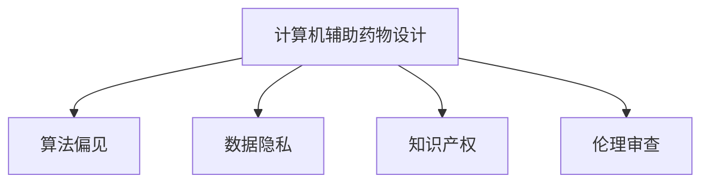

                 

# 计算机辅助药物设计的伦理考量

## 1. 背景介绍

计算机辅助药物设计（Computer-Assisted Drug Design, CADDD）是现代药物研发领域中的一项重要技术，其结合了人工智能、计算化学、生物信息学等前沿科技，旨在加速新药发现和研发流程，降低成本，提高成功率。然而，随着该技术应用的不断深入，伦理问题逐渐显现，亟需引起广泛关注和深入探讨。

### 1.1 问题的由来

计算机辅助药物设计最初源自于对天然产物和生物活性化合物的结构分析，通过计算模拟、分子动力学模拟等技术，预测化合物与靶标蛋白的相互作用，筛选出潜在活性分子，进而设计优化药物分子。随着技术的成熟和数据的积累，计算机辅助药物设计在药物靶点预测、药物-靶标对接、药效模拟等方面均展现出卓越的性能。

但伴随这些突破，诸如算法偏见、数据隐私、知识产权等伦理问题也开始浮现。如何保障研发过程中的公平公正，保护知识产权，尊重数据隐私，已成为计算机辅助药物设计面临的新挑战。这些问题不仅涉及技术的进步，更关乎伦理道德和法律责任，亟需学界、业界、政策制定者等多方共同探讨。

### 1.2 问题的核心关键点

计算机辅助药物设计的伦理问题主要集中在以下几方面：
- 算法偏见与公平性：由于数据集不平衡、模型设计不当等原因，可能出现算法偏见，影响药物研发过程中的公平公正。
- 数据隐私与数据安全：药物研发涉及大量敏感的生物数据，如何保护患者隐私和数据安全，是一个重要问题。
- 知识产权与专利保护：涉及药品研发过程中产生的知识产权归属，及其在商业化过程中的保护问题。
- 伦理审查与责任归属：如何界定计算机辅助药物设计的伦理责任，保障研发过程的合规性和合法性。

本文旨在通过系统梳理相关伦理问题，探讨其解决方案，推动计算机辅助药物设计的健康发展。

## 2. 核心概念与联系

### 2.1 核心概念概述

要深入理解计算机辅助药物设计的伦理考量，首先需要明确以下几个关键概念：

- **计算机辅助药物设计（CADDD）**：利用计算机模拟和计算化学技术，加速药物分子设计、筛选和优化，提高新药研发效率。
- **算法偏见（Algorithmic Bias）**：由于数据不平衡、模型设计缺陷等原因，导致计算机辅助药物设计过程中出现的不公平现象。
- **数据隐私（Data Privacy）**：在药物研发过程中涉及大量生物数据，如何保护患者隐私，是数据使用中的关键问题。
- **知识产权（Intellectual Property）**：涉及药品研发过程中的创新成果及其保护问题。
- **伦理审查（Ethical Review）**：在药物研发过程中，如何确保研发活动的合规性和道德性。

通过这些概念，我们可以进一步理解计算机辅助药物设计中的伦理问题，并探究可能的解决方案。

### 2.2 核心概念原理和架构的 Mermaid 流程图



此流程图展示了计算机辅助药物设计中的核心概念及其关联：算法偏见、数据隐私、知识产权、伦理审查等关键伦理问题，都是计算机辅助药物设计中必须面对和解决的问题。

## 3. 核心算法原理 & 具体操作步骤

### 3.1 算法原理概述

计算机辅助药物设计涉及多个环节，包括药物靶点预测、药物-靶标对接、药效模拟等。这些环节均基于复杂的计算模型和算法，通过大数据分析和机器学习技术实现。然而，在算法设计和数据应用过程中，可能会遇到诸多伦理问题。

### 3.2 算法步骤详解

计算机辅助药物设计的具体步骤包括：

1. **靶点筛选**：利用机器学习算法，从基因组数据、蛋白质结构数据中筛选潜在药物靶点。
2. **分子设计**：基于靶点结构，使用遗传算法、分子动力学等技术设计新药物分子。
3. **药效模拟**：通过计算机模拟，评估新分子与靶点的相互作用及其药效。
4. **优化迭代**：根据模拟结果，反复迭代优化药物分子。
5. **临床验证**：将优化后的分子进入临床试验验证，最终上市销售。

在每个步骤中，都需仔细考虑伦理问题，确保研发过程的公平公正、数据安全和知识产权保护。

### 3.3 算法优缺点

计算机辅助药物设计在提高研发效率、降低成本、提升成功率方面具有显著优势，但也存在一些潜在缺点：

**优点**：
- **高效性**：通过计算模拟和机器学习技术，大幅缩短研发周期。
- **准确性**：利用大数据分析和先进算法，提高药物筛选和设计准确性。
- **可扩展性**：技术手段多样，可以根据需求选择不同的计算模型和算法。

**缺点**：
- **算法偏见**：由于数据不平衡、模型设计缺陷等原因，可能出现算法偏见。
- **数据隐私**：涉及大量生物数据，数据隐私保护面临挑战。
- **知识产权**：涉及研发过程中产生的创新成果及其保护问题。
- **伦理审查**：研发过程中如何确保合规性和道德性，需建立完善的伦理审查机制。

### 3.4 算法应用领域

计算机辅助药物设计在现代药物研发中已广泛应用于新药发现、药物靶点预测、分子设计和药效模拟等多个领域。这些技术的应用不仅极大地推动了药物研发进程，还显著降低了研发成本，提高了成功率。

## 4. 数学模型和公式 & 详细讲解 & 举例说明

### 4.1 数学模型构建

计算机辅助药物设计涉及多个数学模型，如分子动力学模拟、遗传算法优化等。这些模型需结合生物信息学、计算化学、人工智能等学科知识。

### 4.2 公式推导过程

以分子动力学模拟为例，设分子动力学模拟的拉格朗日方程为 $L(q, \dot{q}, t) = K\|\dot{q}\|^2 - U(q, t)$，其中 $q$ 为分子坐标，$\dot{q}$ 为分子速度，$U(q, t)$ 为分子势能。通过对拉格朗日方程求变分，得到分子运动的牛顿方程：

$$
\ddot{q} = -\nabla U(q, t)
$$

此公式描述了分子在力场中的运动规律。在计算机辅助药物设计中，利用该公式进行分子动力学模拟，可预测分子与靶点的相互作用。

### 4.3 案例分析与讲解

以靶点筛选为例，机器学习算法可通过以下公式进行模型训练和预测：

$$
y = f(x; \theta) = \sum_{i=1}^n w_i \cdot \sigma(z_i)
$$

其中 $y$ 为药物靶点筛选结果，$x$ 为基因组数据或蛋白质结构数据，$f(x; \theta)$ 为模型预测函数，$\sigma(z_i)$ 为激活函数，$w_i$ 为权重系数，$\theta$ 为模型参数。

在实际应用中，机器学习算法需基于大规模、高质量的数据集进行训练，以获得准确的靶点筛选结果。此外，还需注意算法偏见问题，避免因数据不平衡导致的不公平。

## 5. 项目实践：代码实例和详细解释说明

### 5.1 开发环境搭建

计算机辅助药物设计涉及多学科、多技术的综合应用，开发环境搭建需考虑以下方面：

1. **硬件环境**：高性能计算平台、GPU/TPU等。
2. **软件环境**：Python、R语言、操作系统等。
3. **工具和库**：生物信息学工具、计算化学库、机器学习框架等。

### 5.2 源代码详细实现

以机器学习模型训练为例，代码实现如下：

```python
from sklearn.ensemble import RandomForestClassifier
from sklearn.model_selection import train_test_split
import pandas as pd
import numpy as np

# 读取数据
data = pd.read_csv('drug_data.csv')

# 数据预处理
X = data[['feature1', 'feature2', 'feature3']]
y = data['target']

# 数据划分
X_train, X_test, y_train, y_test = train_test_split(X, y, test_size=0.2, random_state=42)

# 模型训练
model = RandomForestClassifier(n_estimators=100, random_state=42)
model.fit(X_train, y_train)

# 模型评估
score = model.score(X_test, y_test)
print(f"Model score: {score:.2f}")
```

### 5.3 代码解读与分析

上述代码实现了基于随机森林算法的靶点筛选模型训练。通过读取数据、预处理数据、划分数据集、训练模型和评估模型，可以构建初步的药物靶点预测模型。在实际应用中，还需进一步优化模型性能、处理算法偏见等问题。

### 5.4 运行结果展示

模型训练完成后，需展示模型的预测结果，并对比真实结果。例如，使用混淆矩阵和ROC曲线等图表，评估模型的性能。

## 6. 实际应用场景

### 6.1 新药发现

计算机辅助药物设计在新药发现中具有重要应用。利用计算模型和算法，可以在早期阶段筛选出潜在药物靶点和活性分子，大幅缩短研发周期，提高研发成功率。

### 6.2 药物靶点预测

通过计算机模拟和机器学习，预测分子与靶点之间的相互作用，快速筛选出可能有效的药物靶点，为进一步的药物设计提供指导。

### 6.3 药效模拟

利用计算化学和分子动力学技术，模拟分子与靶点结合后的药效变化，评估新分子在不同环境中的作用效果。

## 7. 工具和资源推荐

### 7.1 学习资源推荐

1. **《计算化学原理》**：介绍计算化学基础和高级计算方法。
2. **《人工智能在药物研发中的应用》**：详细阐述人工智能技术在药物研发中的应用。
3. **《生物信息学：原理与实践》**：讲解生物信息学基础知识和计算方法。
4. **Coursera《药物设计原理与实践》**：由多所知名大学开设的在线课程，涵盖药物设计基础知识和计算方法。

### 7.2 开发工具推荐

1. **PyTorch**：用于机器学习和深度学习的开源框架，支持多种计算模型和算法。
2. **RapidMiner**：数据预处理和建模工具，适用于快速构建数据科学项目。
3. **Caffe**：深度学习框架，用于图像处理和计算机视觉任务。
4. **DeepChem**：化学机器学习库，支持化学数据处理和建模。

### 7.3 相关论文推荐

1. **“AI in Drug Discovery”**：综述人工智能技术在药物研发中的应用。
2. **“Machine Learning for Drug Design”**：详细介绍机器学习在药物设计中的方法。
3. **“Computer-Assisted Drug Design: A Review”**：计算机辅助药物设计的全面综述。

## 8. 总结：未来发展趋势与挑战

### 8.1 研究成果总结

计算机辅助药物设计在提高新药研发效率、降低成本、提升成功率等方面取得了显著进展，但也面临算法偏见、数据隐私、知识产权等伦理问题。需从技术、伦理和法律多角度出发，制定完善的解决方案。

### 8.2 未来发展趋势

未来计算机辅助药物设计的发展趋势包括：

- **算法公平性**：提升算法公平性，避免因数据不平衡导致的偏见。
- **数据隐私保护**：采用隐私保护技术，保护患者隐私和数据安全。
- **知识产权保护**：完善知识产权保护机制，保障研发成果的合法性。
- **伦理审查机制**：建立完善的伦理审查机制，确保研发过程的合规性和道德性。

### 8.3 面临的挑战

计算机辅助药物设计面临的主要挑战包括：

- **算法偏见**：如何消除数据不平衡导致的偏见，是当前研究的重点。
- **数据隐私**：如何保护敏感的生物数据，是数据使用的关键问题。
- **知识产权**：涉及研发过程中产生的创新成果及其保护问题。
- **伦理审查**：如何在研发过程中确保合规性和道德性，需建立完善的伦理审查机制。

### 8.4 研究展望

未来的研究需从以下几方面进行探索：

- **算法公平性**：探索消除算法偏见的方法，提高模型的公平性和准确性。
- **数据隐私保护**：研发隐私保护技术，确保数据使用的安全性和合法性。
- **知识产权保护**：完善知识产权法律和政策，保障研发成果的合法性和商业化。
- **伦理审查机制**：建立完善的伦理审查机制，确保研发过程的合规性和道德性。

## 9. 附录：常见问题与解答

**Q1：如何保障计算机辅助药物设计过程中的公平性？**

A: 可以通过以下方法保障公平性：
1. **数据预处理**：对数据进行标准化处理，避免数据不平衡。
2. **算法优化**：采用多种算法模型，避免单一模型导致的偏见。
3. **透明性**：公开算法和模型，确保研发过程的透明性。

**Q2：计算机辅助药物设计中如何保护数据隐私？**

A: 可以通过以下方法保护数据隐私：
1. **数据匿名化**：对数据进行匿名化处理，保护患者隐私。
2. **数据加密**：采用数据加密技术，防止数据泄露。
3. **访问控制**：设置严格的访问权限，确保数据安全。

**Q3：计算机辅助药物设计中如何保护知识产权？**

A: 可以通过以下方法保护知识产权：
1. **专利申请**：在研发过程中及时申请专利，保护创新成果。
2. **版权保护**：对软件代码和文档进行版权保护，防止非法复制。
3. **合同签订**：在合作研发中签订保密协议，保护研发成果。

**Q4：计算机辅助药物设计中如何确保伦理审查的合规性？**

A: 可以通过以下方法确保伦理审查的合规性：
1. **伦理委员会**：建立独立的伦理委员会，对研发活动进行监督。
2. **合规审核**：对研发过程进行合规性审核，确保符合伦理要求。
3. **公众参与**：公开研发活动，听取公众意见，提高透明度。

---

作者：禅与计算机程序设计艺术 / Zen and the Art of Computer Programming

