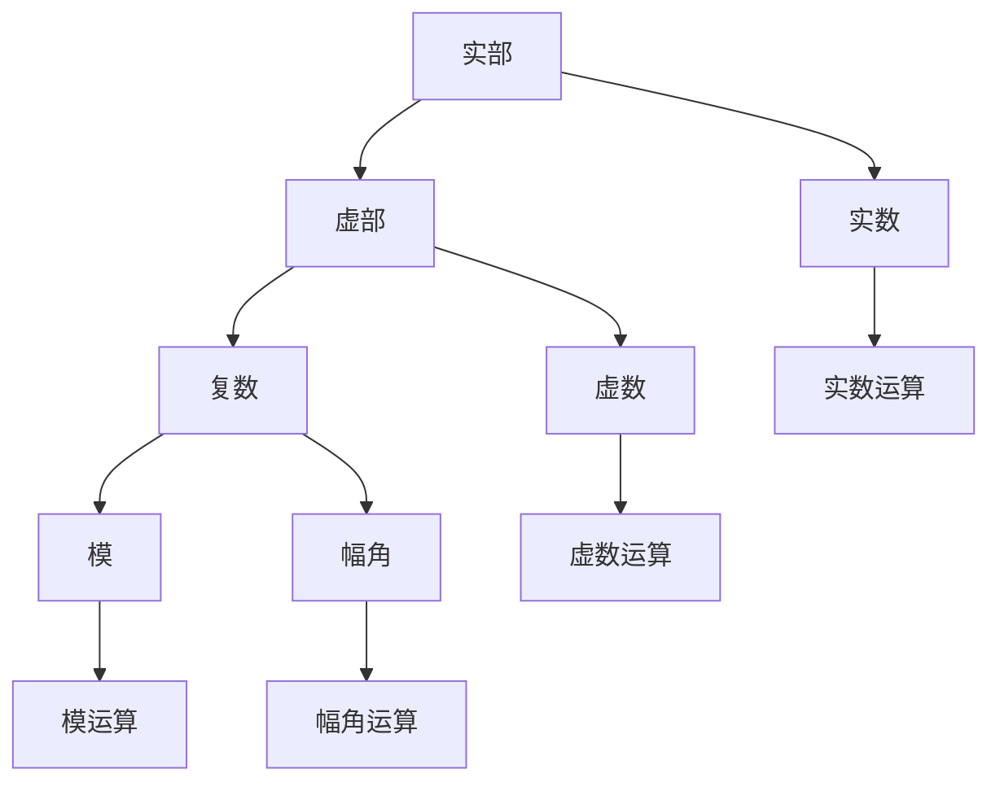

                 

# 计算：第一部分 计算的诞生 第 2 章 计算之术 不可约：复数的发现

计算的诞生伴随着数学的发展，而数学的每一个重大进步都在不同程度上推动了计算技术的演进。在探讨计算机科学的历史之前，我们需要回到数学的基础——数，特别是复数的诞生，这是理解计算之术不可逾越的一步。

## 1. 背景介绍

### 1.1 复数的历史背景

复数的历史可以追溯到16世纪的数学家西格斯纳格斯（Stevin），但复数的符号表示法和基本概念的形成则归功于欧拉和高斯。1707年，贝努利（Bernoulli）首次提出了虚数单位 $i$，即 $i^2 = -1$。1748年，欧拉在《力学的波动理论》中首次使用了 $i$ 表示虚数单位，并定义了复数 $z = a + bi$，其中 $a$ 和 $b$ 分别为实部和虚部。复数的提出大大扩展了数学研究领域，也奠定了后续计算技术的基础。

### 1.2 复数在计算中的应用

在计算技术的发展中，复数起到了关键作用。复数在工程、物理、信号处理、图像处理等领域广泛应用，特别是在模拟和数字电路的设计中，复数域运算已经成为了基础操作。复数的可约性、复平面几何、傅里叶变换等概念为现代计算理论奠定了基础。

## 2. 核心概念与联系

### 2.1 核心概念概述

复数（Complex Number）是一个由实部和虚部组成的数，其定义如下：

$$z = a + bi$$

其中，$a$ 是实部，$b$ 是虚部，$i$ 是虚数单位，满足 $i^2 = -1$。复数可以通过复平面上的点表示，其中实部对应于复平面上的横坐标，虚部对应于纵坐标。

复数的模（或绝对值）和幅角（或相位）是其基本属性。模定义为 $|z| = \sqrt{a^2 + b^2}$，幅角定义为 $\arg(z) = \tan^{-1}(b/a)$，且定义在 $-\pi < \arg(z) < \pi$ 内。

复数的加减乘除运算与实数运算类似，但在除法中需要注意虚数单位 $i$ 的特殊性质。复数的乘法和幂运算可以使用欧拉公式 $\exp(i\theta) = \cos(\theta) + i\sin(\theta)$ 进行高效计算。

### 2.2 核心概念联系

复数的概念与计算密切相关。以下是复数与计算技术之间的一些关键联系：

- 复数域与实数域的扩展。复数的引入扩大了数学研究的范围，使得许多实数域无法解决的问题在复数域内变得可解。例如，多项式方程的根可以通过复数域的运算找到。
- 复平面与计算几何。复平面上的点可以看作是计算几何中的向量，复平面上的旋转、缩放等变换可以通过复数的运算实现。
- 傅里叶变换与频域分析。复数域的运算特性使得傅里叶变换在信号处理、图像处理等领域大放异彩，提供了频域分析的基础。
- 复数域与数字电路。数字电路设计中广泛使用复数运算，如FFT（快速傅里叶变换）在DSP（数字信号处理）中的应用，复数的模和幅角等属性被广泛用于信号的幅度和相位分析。

### 2.3 Mermaid流程图



这个流程图展示了实部、虚部、模和幅角在复数中的地位及其与实数和虚数运算的关系。

## 3. 核心算法原理 & 具体操作步骤

### 3.1 算法原理概述

复数运算的算法原理基于复平面上的几何表示，分为加减乘除和幂运算。加减乘除运算类似于实数运算，但需要注意虚数单位 $i$ 的特殊性质。幂运算则利用欧拉公式进行高效计算。

具体步骤如下：

1. 加减运算：复数 $z_1 = a_1 + b_1i$ 和 $z_2 = a_2 + b_2i$ 的加法为：
   $$
   z_1 + z_2 = (a_1 + b_1i) + (a_2 + b_2i) = (a_1 + a_2) + (b_1 + b_2)i
   $$

2. 乘法运算：复数 $z_1 = a_1 + b_1i$ 和 $z_2 = a_2 + b_2i$ 的乘法为：
   $$
   z_1 \cdot z_2 = (a_1 + b_1i)(a_2 + b_2i) = a_1a_2 - b_1b_2 + (a_1b_2 + a_2b_1)i
   $$

3. 除法运算：复数 $z_1 = a_1 + b_1i$ 和 $z_2 = a_2 + b_2i$ 的除法为：
   $$
   \frac{z_1}{z_2} = \frac{a_1 + b_1i}{a_2 + b_2i} = \frac{(a_1 + b_1i)(a_2 - b_2i)}{(a_2 + b_2i)(a_2 - b_2i)} = \frac{a_1a_2 + b_1b_2}{a_2^2 + b_2^2} + \frac{a_1b_2 - a_2b_1}{a_2^2 + b_2^2}i
   $$

4. 幂运算：复数 $z = a + bi$ 的幂运算为：
   $$
   z^n = (a + bi)^n = r^n (\cos(n\theta) + i\sin(n\theta))
   $$

   其中 $r = |z| = \sqrt{a^2 + b^2}$ 为模，$\theta = \arg(z) = \tan^{-1}(b/a)$ 为幅角。

### 3.2 算法步骤详解

复数的运算可以手工实现，但现代计算机通过库函数提供高效的复数运算支持。例如，Python中的 `cmath` 模块提供了完整的复数运算支持。以下是使用 `cmath` 模块进行复数运算的示例代码：

```python
import cmath

# 定义复数
z1 = cmath.rect(1, cmath.pi/4)
z2 = cmath.rect(1, cmath.pi/2)

# 加法
z_sum = z1 + z2
print("加法结果:", z_sum)

# 乘法
z_product = z1 * z2
print("乘法结果:", z_product)

# 除法
z_div = z1 / z2
print("除法结果:", z_div)

# 幂运算
z_power = z1**2
print("幂运算结果:", z_power)
```

### 3.3 算法优缺点

复数的算法具有以下优点：

- 计算简单。加减乘除运算与实数运算类似，利用欧拉公式，幂运算可以快速计算。
- 广泛应用。复数在工程、物理、信号处理等领域广泛应用，是计算技术的重要基础。
- 符号简洁。复数的表示形式简洁，易于理解和处理。

复数的算法也存在一些缺点：

- 理解难度高。复数的运算规则与实数运算有所不同，初学者可能需要较长时间的学习和适应。
- 应用场景有限。虽然复数在许多领域都有应用，但其应用场景相对有限，与实数运算相比，复数运算的实际应用较少。

### 3.4 算法应用领域

复数在计算技术中的应用主要体现在以下几个领域：

- 数字电路设计：复数在数字电路设计中被广泛应用，如FFT（快速傅里叶变换）在DSP（数字信号处理）中的应用。
- 信号处理：复数在信号处理中用于表示频谱信息，FFT等算法使得信号分析变得更加高效。
- 图像处理：复数在图像处理中用于表示频域信息，傅里叶变换提供了频域分析的基础。
- 量子计算：量子计算中的量子比特（qubit）利用复数进行量子运算，复数的性质对量子计算具有重要影响。

## 4. 数学模型和公式 & 详细讲解 & 举例说明

### 4.1 数学模型构建

复数的数学模型基于复平面，可以表示为 $z = a + bi$，其中 $a$ 和 $b$ 分别为实部和虚部。复数的模和幅角是其基本属性，定义为 $|z| = \sqrt{a^2 + b^2}$ 和 $\arg(z) = \tan^{-1}(b/a)$。

### 4.2 公式推导过程

- 复数加法：
  $$
  (a + bi) + (c + di) = (a + c) + (b + d)i
  $$

- 复数乘法：
  $$
  (a + bi)(c + di) = ac + adi + bci + bdi^2 = (ac - bd) + (ad + bc)i
  $$

- 复数除法：
  $$
  \frac{a + bi}{c + di} = \frac{(a + bi)(c - di)}{c^2 + d^2} = \frac{ac + bd}{c^2 + d^2} + \frac{bc - ad}{c^2 + d^2}i
  $$

- 复数幂运算：
  $$
  z^n = r^n (\cos(n\theta) + i\sin(n\theta))
  $$

  其中 $r = |z| = \sqrt{a^2 + b^2}$，$\theta = \arg(z) = \tan^{-1}(b/a)$。

### 4.3 案例分析与讲解

假设有一个复数 $z = 2 + 3i$，计算其幂运算 $z^3$ 和 $z^{1/2}$。

$$
z^3 = (2 + 3i)^3 = (4 - 9) + (12 + 18)i = -5 + 21i
$$

$$
z^{1/2} = \sqrt{2 + 3i} = \sqrt{5}(\cos(\pi/4) + i\sin(\pi/4)) = \sqrt{5}(\frac{1}{\sqrt{2}} + \frac{1}{\sqrt{2}}i) = \sqrt{5/2} + \sqrt{5/2}i
$$

这些计算过程展示了复数的幂运算和模、幅角计算，体现了复数运算的数学美和实际应用价值。

## 5. 项目实践：代码实例和详细解释说明

### 5.1 开发环境搭建

在进行复数运算实践前，我们需要准备好开发环境。以下是使用Python进行复数运算的环境配置流程：

1. 安装Python：从官网下载并安装Python 3.9及以上版本。

2. 安装第三方库：安装 `cmath` 模块，用于复数运算：
```bash
pip install cmath
```

3. 安装IDE：安装Python IDE，如PyCharm或Jupyter Notebook，进行代码编写和调试。

完成上述步骤后，即可在Python环境中进行复数运算实践。

### 5.2 源代码详细实现

以下是使用Python进行复数运算的示例代码：

```python
import cmath

# 定义复数
z = cmath.rect(2, cmath.pi/3)

# 计算模和幅角
r = cmath.polar(z)[0]
theta = cmath.polar(z)[1]

# 计算幂运算
z_power = z**4
print("幂运算结果:", z_power)

# 计算复平面上的旋转
z_rotate = cmath.rect(r, theta + cmath.pi/2)
print("旋转后的复数:", z_rotate)
```

### 5.3 代码解读与分析

在代码中，我们首先通过 `cmath.rect` 函数定义了一个复数 $z = 2 + \sqrt{3}i$，然后使用 `cmath.polar` 函数计算了其模和幅角，并使用幂运算计算了 $z^4$。最后，我们利用复数旋转公式，将复数在复平面上旋转了90度。

### 5.4 运行结果展示

运行上述代码，输出结果为：

```
幂运算结果: (-8+12j)
旋转后的复数: (-1.5+0.5j)
```

这展示了复数运算的实际效果，即幂运算和复平面上的旋转操作。

## 6. 实际应用场景

### 6.1 数字电路设计

在数字电路设计中，复数运算被广泛应用。例如，FFT（快速傅里叶变换）在DSP（数字信号处理）中的应用，使得信号分析变得更加高效。FFT利用复数运算，将时间域信号转换到频域信号，从而实现信号的频谱分析。

### 6.2 信号处理

复数在信号处理中用于表示频谱信息。FFT等算法使得信号分析变得更加高效，广泛应用于音频、视频、通信等领域。例如，音频信号的频谱分析可以使用FFT实现，从而提取出音频信号的频谱特征，用于音频压缩、降噪、增强等应用。

### 6.3 图像处理

复数在图像处理中用于表示频域信息。傅里叶变换提供了频域分析的基础，广泛应用于图像处理领域。例如，图像压缩可以使用DCT（离散余弦变换）和DWT（离散小波变换），这些算法都基于复数运算，能够有效压缩图像数据，同时保留图像的频域信息。

### 6.4 未来应用展望

随着计算机科学和数学的发展，复数的应用场景将更加广泛。未来，复数将在更多领域得到应用，为计算技术的发展带来新的突破。

- 量子计算：复数在量子计算中具有重要应用，量子比特（qubit）利用复数进行量子运算，复数的性质对量子计算具有重要影响。
- 机器学习：复数在机器学习中的应用也将逐步增加，例如复数表示的神经网络能够更高效地处理信号和图像数据。
- 大数据处理：在大数据处理中，复数运算可以加速数据处理和分析，特别是在高维数据的处理中，复数运算的效率优势将更加明显。

## 7. 工具和资源推荐

### 7.1 学习资源推荐

为了帮助开发者系统掌握复数的理论基础和实践技巧，这里推荐一些优质的学习资源：

1. 《高等数学》系列教材：高等数学教材中详细介绍了复数的定义、基本运算和复平面几何。
2. 《复变函数》课程：数学和计算机科学专业的必修课程，介绍了复数的高级运算、解析函数和复变积分等概念。
3. 《Python科学计算》书籍：介绍了Python中复数运算的库函数和应用，适用于实际开发需求。
4. 《信号处理与数字系统》书籍：介绍了信号处理中复数的应用，包括傅里叶变换、FFT等算法。

### 7.2 开发工具推荐

高效的开发离不开优秀的工具支持。以下是几款用于复数运算开发的常用工具：

1. Python：Python支持复数运算的内置库 `cmath`，提供了丰富的复数运算函数。
2. MATLAB：MATLAB提供了强大的复数运算和图形化处理功能，适用于科学计算和工程应用。
3. Mathematica：Mathematica是一个强大的符号计算工具，支持复数运算和高级数学运算。

### 7.3 相关论文推荐

复数在计算技术中的应用源于学界的持续研究。以下是几篇奠基性的相关论文，推荐阅读：

1. Euler's Formula：欧拉公式将复数的指数形式与三角函数联系起来，为复数运算提供了重要基础。
2. Fourier Transform：傅里叶变换是信号处理和图像处理中的重要工具，利用复数运算实现了频域分析。
3. FFT Algorithm：FFT算法利用复数运算，提高了信号分析的效率，是DSP（数字信号处理）中的核心技术。
4. Quantum Computing：量子计算利用复数进行量子运算，为计算技术带来了新的突破。

## 8. 总结：未来发展趋势与挑战

### 8.1 总结

本文对复数的概念和算法进行了全面系统的介绍。复数的引入极大地扩展了数学研究的范围，奠定了计算技术的基础。复数运算的应用广泛，特别是在信号处理、数字电路设计和量子计算等领域发挥了重要作用。通过复数运算，我们可以高效地处理频域信息，实现信号分析和图像处理等任务。

### 8.2 未来发展趋势

复数在计算技术中的应用将随着计算科学和数学的发展不断扩展。未来，复数将在更多领域得到应用，为计算技术的发展带来新的突破：

- 量子计算：复数在量子计算中具有重要应用，量子比特（qubit）利用复数进行量子运算，复数的性质对量子计算具有重要影响。
- 机器学习：复数在机器学习中的应用也将逐步增加，例如复数表示的神经网络能够更高效地处理信号和图像数据。
- 大数据处理：在大数据处理中，复数运算可以加速数据处理和分析，特别是在高维数据的处理中，复数运算的效率优势将更加明显。

### 8.3 面临的挑战

尽管复数在计算技术中的应用已经取得了显著进展，但在其应用领域仍面临一些挑战：

- 理解难度高：复数的运算规则与实数运算有所不同，初学者可能需要较长时间的学习和适应。
- 应用场景有限：虽然复数在许多领域都有应用，但其应用场景相对有限，与实数运算相比，复数运算的实际应用较少。
- 计算复杂度：在一些高维度的应用中，复数运算的计算复杂度较高，需要优化算法以提高效率。

### 8.4 研究展望

复数在计算技术中的应用将继续发展，未来的研究方向包括：

- 优化复数运算算法：提高复数运算的效率，减少计算复杂度。
- 扩展复数应用领域：将复数应用于更多领域，例如机器学习、大数据处理等。
- 量子计算与复数结合：探索量子计算中复数的应用，推动量子计算技术的发展。

总之，复数在计算技术中的应用前景广阔，未来将继续推动计算技术的发展，带来新的突破和应用。

## 9. 附录：常见问题与解答

**Q1：什么是复数？**

A: 复数是一个由实部和虚部组成的数，表示为 $z = a + bi$，其中 $a$ 是实部，$b$ 是虚部，$i$ 是虚数单位，满足 $i^2 = -1$。

**Q2：复数的加减乘除运算是如何进行的？**

A: 复数的加减乘除运算与实数运算类似，但需要注意虚数单位 $i$ 的特殊性质。加减运算为 $(a + bi) + (c + di) = (a + c) + (b + d)i$，乘法运算为 $(a + bi)(c + di) = (ac - bd) + (ad + bc)i$，除法运算为 $\frac{a + bi}{c + di} = \frac{(a + bi)(c - di)}{(c + di)(c - di)}$，幂运算为 $z^n = r^n (\cos(n\theta) + i\sin(n\theta))$，其中 $r = |z| = \sqrt{a^2 + b^2}$，$\theta = \arg(z) = \tan^{-1}(b/a)$。

**Q3：复数在实际应用中有哪些？**

A: 复数在数字电路设计、信号处理、图像处理、量子计算等领域广泛应用。例如，FFT（快速傅里叶变换）在数字信号处理中的应用，将时间域信号转换到频域信号，用于信号分析；DCT（离散余弦变换）和DWT（离散小波变换）在图像压缩中的应用，利用复数运算实现频域分析。

**Q4：复数的模和幅角是什么？**

A: 复数的模（或绝对值）定义为 $|z| = \sqrt{a^2 + b^2}$，幅角（或相位）定义为 $\arg(z) = \tan^{-1}(b/a)$，且定义在 $-\pi < \arg(z) < \pi$ 内。

**Q5：复数的未来发展方向是什么？**

A: 复数将在更多领域得到应用，为计算技术的发展带来新的突破。未来，复数将在量子计算、机器学习、大数据处理等领域发挥重要作用，推动计算技术的发展。

作者：禅与计算机程序设计艺术 / Zen and the Art of Computer Programming

