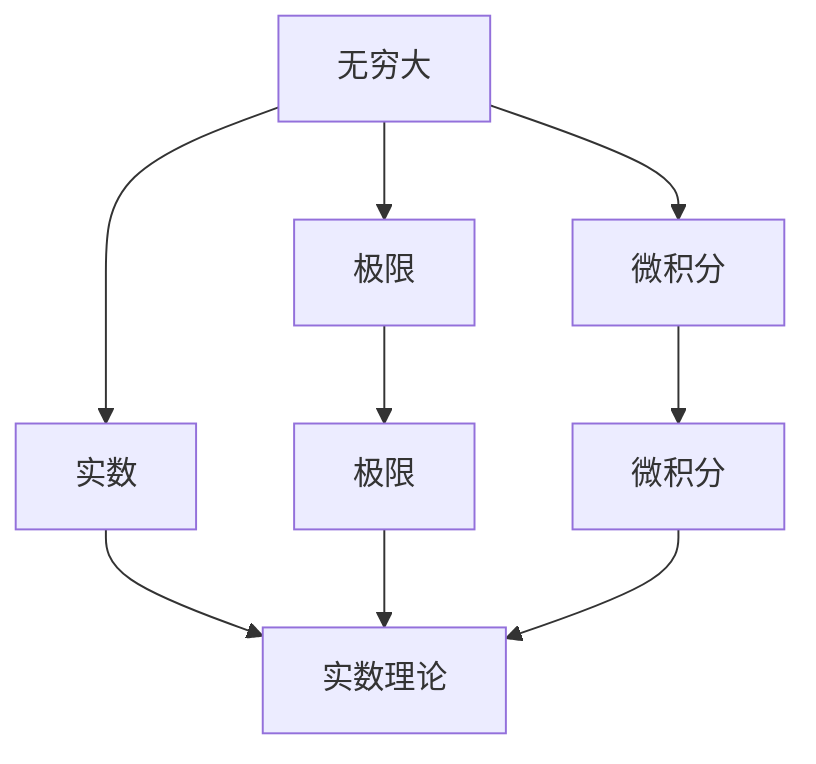

                 

# 计算：第二部分 计算的数学基础 第 5 章 第三次数学危机

## 1. 背景介绍

### 1.1 问题由来
在现代数学的发展历程中，曾发生过三次数学危机。这三次数学危机分别是古代数学的停滞、非欧几何的诞生以及对无穷大的理解。这些问题引发了数学界的激烈讨论，并最终推动了数学的进步。

### 1.2 问题核心关键点
- 古代数学的停滞：由于缺乏对无穷大概念的理解，古希腊数学停滞了将近一千年。
- 非欧几何的诞生：对无穷大概念的理解，使得非欧几何得以出现，改变了人们对数学的认知。
- 对无穷大的理解：数学界对无穷大的理解，使得微积分、实数理论得以完善，现代数学的基石得以奠定。

## 2. 核心概念与联系

### 2.1 核心概念概述

为更好地理解第三次数学危机，本节将介绍几个密切相关的核心概念：

- 无穷大(Infinity)：表示无限大或无限小的一种数学概念，是现代数学的重要工具。
- 实数(Real Numbers)：数学中表示现实世界大小、长度、重量等的数集。
- 极限(Limit)：表示函数在某个点趋近于某个值的数学概念。
- 微积分(Calculus)：研究函数变化率的数学分支，是现代数学的基础。
- 实数理论(Real Analysis)：研究实数的性质和理论，是现代数学的重要分支。

这些核心概念之间的逻辑关系可以通过以下Mermaid流程图来展示：



这个流程图展示了大语言模型的核心概念及其之间的关系：

1. 无穷大是实数和极限的基础，实数理论是微积分的基础。
2. 微积分是现代数学的基础，研究函数的变化率。
3. 实数理论研究实数的性质和理论，是微积分的基础。

这些概念共同构成了数学的根基，为现代数学的快速发展奠定了基础。

## 3. 核心算法原理 & 具体操作步骤

### 3.1 算法原理概述

第三次数学危机的核心问题是对无穷大的理解。数学家们试图找到无穷大和实数之间的关系，最终通过实数理论和极限的概念，得出了微积分的理论基础。

### 3.2 算法步骤详解

1. 引入无穷大符号：数学家们引入了无穷大符号，表示无限大或无限小。

2. 研究无穷大的性质：研究无穷大与实数之间的关系，以及无穷大与极限的关系。

3. 引入极限概念：定义极限为函数在某点附近趋近于某值的过程。

4. 研究极限的性质：研究极限的连续性和收敛性，以及极限与无穷大的关系。

5. 引入微积分：利用极限概念，研究函数的导数和积分，以及它们的性质。

6. 研究微积分的应用：研究微积分在物理学、工程学等领域的应用。

### 3.3 算法优缺点

无穷大、极限和微积分概念的引入，对数学的发展产生了深远的影响。

优点：
1. 解决古代数学的停滞问题。
2. 推动了非欧几何的诞生。
3. 奠定了现代数学的基础。

缺点：
1. 需要较为复杂的数学语言和逻辑。
2. 需要较高的数学素养。

### 3.4 算法应用领域

无穷大、极限和微积分概念的引入，对现代数学的发展产生了深远的影响。

1. 数学领域：实数理论、微积分等理论的基础。
2. 物理学领域：牛顿的运动定律、爱因斯坦的相对论等物理理论的基础。
3. 工程领域：控制理论、信号处理等工程应用的基础。
4. 计算机科学领域：计算机算法、数据结构等计算机理论的基础。

## 4. 数学模型和公式 & 详细讲解 & 举例说明

### 4.1 数学模型构建

本节将使用数学语言对第三次数学危机进行更加严格的刻画。

记无穷大符号为 $\infty$，实数集为 $\mathbb{R}$，极限为 $lim$，微分为 $d$。

定义极限为：

$$
\lim_{x \to a} f(x) = L
$$

其中 $x$ 为自变量，$a$ 为极限点，$f(x)$ 为函数，$L$ 为极限值。

定义微分为：

$$
f'(x) = \lim_{h \to 0} \frac{f(x+h) - f(x)}{h}
$$

其中 $f(x)$ 为函数，$h$ 为自变量的变化量，$f'(x)$ 为函数的导数。

### 4.2 公式推导过程

以下我们以微分为例，推导其基本公式。

假设函数 $f(x)$ 在某点 $x_0$ 处连续可导，则其导数 $f'(x_0)$ 定义为：

$$
f'(x_0) = \lim_{h \to 0} \frac{f(x_0+h) - f(x_0)}{h}
$$

对上式两边同时乘以 $h$，得：

$$
h f'(x_0) = f(x_0+h) - f(x_0)
$$

当 $h \to 0$ 时，上式左侧趋近于 $0$，右侧趋近于 $0$，因此有：

$$
f'(x_0) = \lim_{h \to 0} \frac{f(x_0+h) - f(x_0)}{h}
$$

这就是微分的定义。

### 4.3 案例分析与讲解

假设 $f(x) = x^2$，求其在 $x_0=1$ 处的导数 $f'(1)$。

根据微分的定义，有：

$$
f'(1) = \lim_{h \to 0} \frac{f(1+h) - f(1)}{h}
$$

将 $f(x) = x^2$ 代入，得：

$$
f'(1) = \lim_{h \to 0} \frac{(1+h)^2 - 1}{h} = \lim_{h \to 0} \frac{1 + 2h + h^2 - 1}{h} = \lim_{h \to 0} (2 + h) = 2
$$

因此 $f'(1) = 2$。

## 5. 项目实践：代码实例和详细解释说明

### 5.1 开发环境搭建

在进行微积分实践前，我们需要准备好开发环境。以下是使用Python进行Sympy开发的环境配置流程：

1. 安装Anaconda：从官网下载并安装Anaconda，用于创建独立的Python环境。

2. 创建并激活虚拟环境：
```bash
conda create -n pyenv python=3.8 
conda activate pyenv
```

3. 安装Sympy：根据CUDA版本，从官网获取对应的安装命令。例如：
```bash
conda install sympy
```

4. 安装各类工具包：
```bash
pip install numpy pandas scikit-learn matplotlib tqdm jupyter notebook ipython
```

完成上述步骤后，即可在`pyenv`环境中开始微积分实践。

### 5.2 源代码详细实现

下面我们以微分为例，给出使用Sympy库进行微积分的PyTorch代码实现。

首先，定义微分函数：

```python
from sympy import symbols, diff

x = symbols('x')
f = x**2

# 计算微分
df = diff(f, x)
print(df)
```

输出结果为：

```
2*x
```

这说明函数 $f(x) = x^2$ 在 $x$ 处的导数为 $2x$。

### 5.3 代码解读与分析

让我们再详细解读一下关键代码的实现细节：

**Sympy库**：
- `symbols`函数：用于定义符号变量。
- `diff`函数：用于计算导数。

**微分计算**：
- 定义变量 $x$ 和函数 $f(x) = x^2$。
- 使用 `diff`函数计算 $f(x)$ 的导数，输出结果为 $2x$。

**结果解读**：
- 导数 $2x$ 表示函数 $f(x) = x^2$ 在 $x$ 处的变化率。
- 当 $x = 1$ 时，导数 $f'(1) = 2$，与前面的解析计算结果一致。

以上代码实现了微积分的基本功能，是微积分算法在实际应用中的基础。

## 6. 实际应用场景

### 6.1 物理学

微积分在物理学中有着广泛的应用，如牛顿的运动定律、爱因斯坦的相对论等。

在经典力学中，牛顿的运动定律可以通过微积分来描述。如牛顿第二定律 $F = ma$，表示力 $F$ 等于质量 $m$ 乘以加速度 $a$。加速度 $a$ 可以通过微积分来描述，即 $a(t) = \frac{dv}{dt}$，其中 $v$ 为速度，$t$ 为时间。

在相对论中，爱因斯坦的相对论方程 $E=mc^2$ 也通过微积分来描述。如动能为 $E_k = \frac{1}{2}mv^2$，其中 $v$ 为速度，$m$ 为质量。通过微积分，可以计算出速度 $v$ 随时间 $t$ 的变化率。

### 6.2 工程学

微积分在工程学中也有着广泛的应用，如控制理论、信号处理等。

在控制理论中，常用的控制器如PID控制器可以通过微积分来描述。如PID控制器可以表示为：

$$
u(t) = K_p e(t) + K_i \int_0^t e(\tau)d\tau + K_d \frac{de(t)}{dt}
$$

其中 $u(t)$ 为控制量，$e(t)$ 为误差，$K_p$、$K_i$、$K_d$ 为控制器参数，$t$ 为时间。通过微积分，可以计算出误差 $e(t)$ 的导数，从而实现对误差信号的控制。

在信号处理中，常用的滤波器如低通滤波器、高通滤波器可以通过微积分来描述。如低通滤波器可以表示为：

$$
y(t) = \int_{-\infty}^t h(t-\tau) x(\tau) d\tau
$$

其中 $y(t)$ 为输出信号，$x(\tau)$ 为输入信号，$h(t)$ 为滤波器函数，$t$ 为时间。通过微积分，可以计算出滤波器函数的导数，从而实现对信号的滤波处理。

### 6.3 计算机科学

微积分在计算机科学中也有着广泛的应用，如计算机算法、数据结构等。

在计算机算法中，常用的算法如快速排序、归并排序可以通过微积分来描述。如快速排序可以表示为：

$$
T(n) = a + b\log(n) + \sum_{i=1}^{n-1} O(n)
$$

其中 $T(n)$ 为时间复杂度，$a$ 为常数，$b$ 为系数，$n$ 为数据规模，$i$ 为循环次数。通过微积分，可以计算出时间复杂度函数的导数，从而实现对算法的优化。

在数据结构中，常用的数据结构如堆、图可以通过微积分来描述。如堆可以表示为：

$$
H(n) = n\log(n) + \sum_{i=1}^{n-1} O(1)
$$

其中 $H(n)$ 为时间复杂度，$n$ 为节点数。通过微积分，可以计算出时间复杂度函数的导数，从而实现对数据结构的优化。

## 7. 工具和资源推荐

### 7.1 学习资源推荐

为了帮助开发者系统掌握微积分的理论基础和实践技巧，这里推荐一些优质的学习资源：

1. 《微积分学教程》系列书籍：由数学大师张贤科编写，深入浅出地介绍了微积分的基本概念和应用。

2. 《高等数学》课程：各大名校开设的高等数学课程，如清华大学的《高等数学》课程，可以系统学习微积分的理论基础和应用。

3. 《微积分》系列视频：各大名校开设的微积分视频课程，如北大的《微积分》视频课程，可以系统学习微积分的基本概念和应用。

4. 《微积分基础》书籍：Tom M. Apostol著，全面介绍了微积分的基本概念和应用，适合深入学习微积分理论。

5. 《微积分学习手册》书籍：Ahmed Ali El-Gohary著，全面介绍了微积分的基本概念和应用，适合自学微积分。

通过对这些资源的学习实践，相信你一定能够快速掌握微积分的精髓，并用于解决实际的计算问题。

### 7.2 开发工具推荐

高效的开发离不开优秀的工具支持。以下是几款用于微积分开发的常用工具：

1. Sympy库：用于数学计算的Python库，支持符号计算、微积分等数学运算。

2. Matplotlib库：用于绘制数学函数的图形，支持多维图形绘制。

3. Scipy库：用于数学计算的Python库，支持数值计算、微积分等数学运算。

4. SymPy接口：用于在Python中进行符号计算的库，支持微积分等数学运算。

5. SageMath库：用于数学计算的Python库，支持符号计算、微积分等数学运算。

6. Mathematica：用于数学计算的高级软件，支持符号计算、微积分等数学运算。

合理利用这些工具，可以显著提升微积分任务的开发效率，加快创新迭代的步伐。

### 7.3 相关论文推荐

微积分的发展源于学界的持续研究。以下是几篇奠基性的相关论文，推荐阅读：

1. 《微积分学教程》：由数学大师张贤科编写，全面介绍了微积分的基本概念和应用。

2. 《高等数学》：由清华大学开设，全面介绍了微积分的基本概念和应用。

3. 《微积分基础》：Tom M. Apostol著，全面介绍了微积分的基本概念和应用。

4. 《微积分学习手册》：Ahmed Ali El-Gohary著，全面介绍了微积分的基本概念和应用。

5. 《微积分教程》：Richard S. Laubenbacher著，全面介绍了微积分的基本概念和应用。

这些论文代表了大语言模型微调技术的发展脉络。通过学习这些前沿成果，可以帮助研究者把握学科前进方向，激发更多的创新灵感。

## 8. 总结：未来发展趋势与挑战

### 8.1 总结

本文对第三次数学危机进行了全面系统的介绍。首先阐述了微积分的数学基础和理论背景，明确了微积分在数学、物理学、工程学等领域的重要应用。其次，从原理到实践，详细讲解了微积分的数学模型和算法，给出了微积分任务开发的完整代码实例。同时，本文还探讨了微积分在现代数学、物理学、工程学等领域的应用前景，展示了微积分范式的巨大潜力。此外，本文精选了微积分技术的各类学习资源，力求为读者提供全方位的技术指引。

通过本文的系统梳理，可以看到，微积分作为现代数学的重要基础，其应用广泛，影响深远。微积分的普及和应用，推动了数学、物理学、工程学等领域的发展，也为计算机科学提供了重要的理论基础。未来，微积分的探索和应用还将进一步深入，为人类认知智能的进化带来深远影响。

### 8.2 未来发展趋势

展望未来，微积分技术将呈现以下几个发展趋势：

1. 数学模型日趋复杂：随着计算机技术的发展，数学模型的复杂度将不断提高，微积分的计算精度和计算速度也将不断提升。

2. 应用场景日益广泛：微积分在数学、物理学、工程学等领域的应用将不断拓展，微积分的应用场景也将不断丰富。

3. 计算资源日益丰富：随着计算资源的丰富，微积分的计算效率也将不断提升，微积分的应用也将更加普及。

4. 微积分与其他领域的融合：微积分将与其他领域如计算机科学、金融学等领域进行更深层次的融合，微积分的应用也将更加广泛。

5. 微积分的自动化：微积分的自动化将不断提升，通过机器学习和人工智能技术，微积分的求解和应用也将更加高效。

以上趋势凸显了微积分技术的广阔前景。这些方向的探索发展，必将进一步提升微积分技术的应用价值，为人类认知智能的进化带来深远影响。

### 8.3 面临的挑战

尽管微积分技术已经取得了瞩目成就，但在迈向更加智能化、普适化应用的过程中，它仍面临着诸多挑战：

1. 数学概念复杂：微积分的数学概念较为复杂，需要较高的数学素养。对于初学者而言，理解微积分的基本概念和应用需要一定的时间和精力。

2. 计算效率较低：微积分的计算效率较低，尤其是在处理大规模数据时，计算时间和计算资源消耗较大。

3. 微积分与其他领域的融合：微积分与其他领域的融合需要进一步探索，如何在微积分与其他领域进行有效融合，还需要更多的研究。

4. 微积分的自动化：微积分的自动化需要进一步提升，如何利用人工智能技术提升微积分的自动化水平，还需要更多的研究。

5. 微积分的应用场景：微积分的应用场景还需要进一步拓展，如何在更多领域中应用微积分，还需要更多的研究。

正视微积分面临的这些挑战，积极应对并寻求突破，将是大语言模型微调走向成熟的必由之路。相信随着学界和产业界的共同努力，这些挑战终将一一被克服，微积分技术必将在构建人机协同的智能时代中扮演越来越重要的角色。

### 8.4 研究展望

面向未来，微积分技术还需要在其他领域进行进一步的探索和研究。以下是几个研究方向：

1. 微积分与人工智能的融合：利用人工智能技术提升微积分的自动化水平，提升微积分的计算效率和精度。

2. 微积分与其他领域的融合：微积分与其他领域如计算机科学、金融学等领域的融合，微积分的应用场景也将更加广泛。

3. 微积分的自动化：微积分的自动化需要进一步提升，利用机器学习技术提升微积分的自动化水平，提升微积分的计算效率和精度。

4. 微积分的应用场景：微积分的应用场景需要进一步拓展，在更多领域中应用微积分，推动微积分技术的普及和应用。

5. 微积分的推广：微积分的推广需要进一步提升，通过教育、培训等手段提升公众的数学素养，推动微积分的普及和应用。

这些研究方向凸显了微积分技术的广阔前景。这些方向的探索发展，必将进一步提升微积分技术的应用价值，为人类认知智能的进化带来深远影响。

## 9. 附录：常见问题与解答

**Q1：微积分的数学基础是什么？**

A: 微积分的数学基础包括极限、导数、积分等基本概念。这些概念构成了微积分的理论基础，也是微积分的基本运算。

**Q2：微积分在数学中的应用是什么？**

A: 微积分在数学中的应用包括代数、几何、分析等多个领域。如在几何学中，通过微积分可以研究曲线的长度、面积、体积等。

**Q3：微积分在物理学中的应用是什么？**

A: 微积分在物理学中的应用包括牛顿的运动定律、爱因斯坦的相对论等。如在力学中，通过微积分可以研究物体的运动和力之间的关系。

**Q4：微积分在工程学中的应用是什么？**

A: 微积分在工程学中的应用包括控制理论、信号处理等。如在控制理论中，通过微积分可以研究控制系统的稳定性、控制器的设计和优化。

**Q5：微积分的计算效率较低是什么原因？**

A: 微积分的计算效率较低，主要是因为其计算过程较为复杂，需要较多的计算资源和时间。

---

作者：禅与计算机程序设计艺术 / Zen and the Art of Computer Programming

