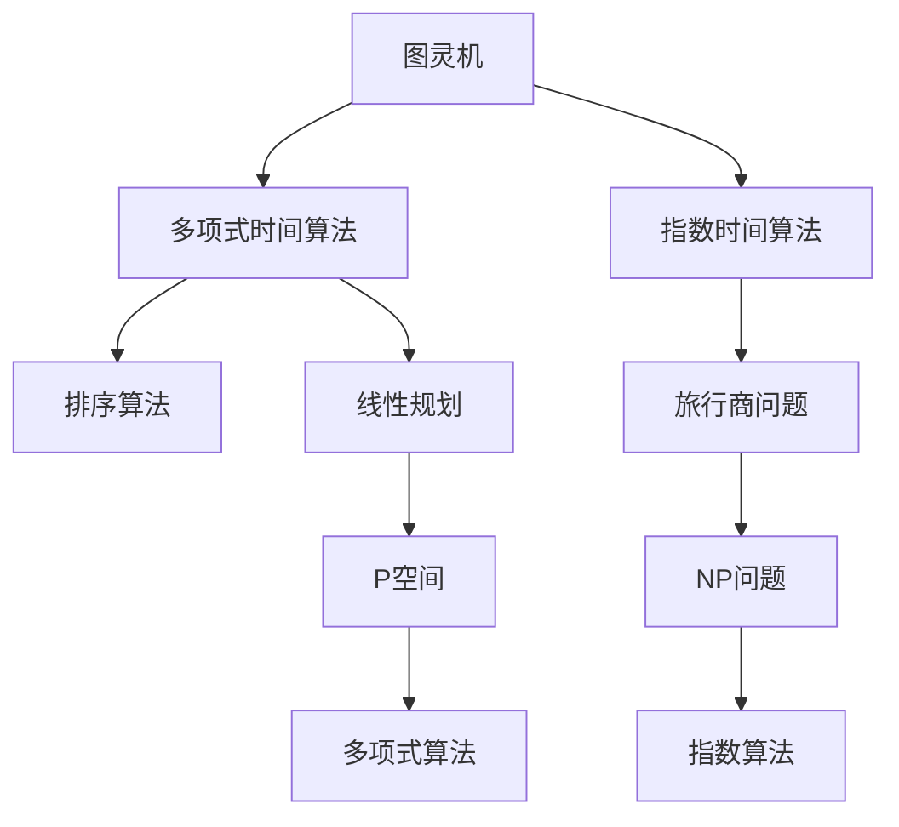

                 

# 计算：第四部分 计算的极限 第 9 章 计算复杂性 多项式时间与指数时间

> 关键词：计算复杂性, 多项式时间, 指数时间, 图灵机, 排序算法, 线性规划, 算法复杂度, P空间

## 1. 背景介绍

### 1.1 问题由来
在《计算：第四部分 计算的极限》中，我们详细探讨了计算复杂性的概念，并引出了多项式时间与指数时间的关系。本节我们将重点讨论基于图灵机的多项式时间和指数时间算法，以及这些算法在不同问题上的实际应用。

### 1.2 问题核心关键点
多项式时间和指数时间算法是计算机科学中最基本也是最核心的概念。多项式时间算法是指可以接受任何输入规模的算法，其运行时间随着输入规模的增加而以多项式速度增长。而指数时间算法则是指运行时间随输入规模指数级增长的算法。本节我们将重点讨论：

- 多项式时间与指数时间算法的定义和基本原理。
- 常见多项式时间与指数时间算法。
- 这些算法在不同问题上的实际应用。

## 2. 核心概念与联系

### 2.1 核心概念概述

- 图灵机(Turing Machine, TM)：由英国数学家图灵在1936年提出，是一种理想化的计算模型，能够模拟任何计算机的计算能力。图灵机由一个无限纸带、读写头、状态集和转移函数组成，通过读写头读写纸带上的字符，按照转移函数从一个状态转移到另一个状态，从而进行计算。

- 多项式时间(Polynomial Time, P)：一种算法的时间复杂度，表示随着输入规模的增加，算法的运行时间以多项式速度增长。常见的多项式时间算法包括排序算法、线性规划等。

- 指数时间(Exponential Time, EXP)：一种算法的时间复杂度，表示随着输入规模的增加，算法的运行时间指数级增长。常见的指数时间算法包括旅行商问题(Traveling Salesman Problem, TSP)、图同构问题等。

- 计算复杂性(Computational Complexity)：研究算法在不同问题上的时间复杂度和空间复杂度，以及它们与问题难度的关系。计算复杂性理论是计算机科学的重要分支，广泛应用于算法设计、计算机体系结构、密码学等领域。

这些核心概念之间存在着紧密的联系。图灵机是计算复杂性理论的基础，多项式时间和指数时间算法则是图灵机在不同问题上的具体体现。通过对这些概念的理解和应用，我们可以更好地设计和分析各种算法。

### 2.2 核心概念原理和架构的 Mermaid 流程图



这个流程图展示了图灵机、多项式时间算法、指数时间算法、排序算法、线性规划等概念之间的联系。从图灵机出发，我们分别引出多项式时间和指数时间算法，以及这两个算法在不同问题上的具体应用。

## 3. 核心算法原理 & 具体操作步骤

### 3.1 算法原理概述

多项式时间算法和指数时间算法的核心区别在于，随着输入规模的增加，它们的运行时间增长速度不同。具体而言，多项式时间算法的时间复杂度为$O(n^k)$，其中$k$是一个常数；而指数时间算法的时间复杂度为$O(2^n)$，其中$n$是输入规模。

这种区别使得多项式时间算法能够处理大量数据，并在实际应用中得到广泛应用，如排序算法、线性规划等。而指数时间算法则通常只在一些特定问题上出现，如旅行商问题、图同构问题等。

### 3.2 算法步骤详解

以排序算法为例，介绍多项式时间算法的详细步骤：

1. 选择排序算法，如快速排序、归并排序等。
2. 将待排序的序列划分成若干个子序列，每个子序列的长度为1。
3. 对每个子序列进行排序，直至整个序列有序。
4. 返回排序后的序列。

这个过程的时间复杂度为$O(nlogn)$，随着输入规模$n$的增加，算法的运行时间以多项式速度增长。

### 3.3 算法优缺点

多项式时间算法和指数时间算法各有优缺点：

- 多项式时间算法：
  - 优点：能够处理大量数据，在实际应用中得到广泛应用。
  - 缺点：在某些特定问题上，时间复杂度较高，难以处理大规模数据。

- 指数时间算法：
  - 优点：在某些特定问题上，能够快速解决问题。
  - 缺点：随着输入规模的增加，运行时间指数级增长，难以处理大规模数据。

### 3.4 算法应用领域

多项式时间算法和指数时间算法在不同领域有着广泛的应用：

- 多项式时间算法：广泛应用于数据库管理、搜索引擎、图像处理等领域。
- 指数时间算法：主要应用于组合优化、计算生物学、人工智能等领域。

## 4. 数学模型和公式 & 详细讲解 & 举例说明

### 4.1 数学模型构建

在计算复杂性理论中，我们通常使用数学模型来表示算法的运行时间。以排序算法为例，我们可以使用以下公式来表示其时间复杂度：

$$
T(n) = O(nlogn)
$$

其中，$T(n)$表示排序算法的时间复杂度，$n$表示待排序序列的长度。

### 4.2 公式推导过程

以归并排序为例，推导其时间复杂度。

1. 归并排序的时间复杂度主要来自于递归调用和归并操作。假设待排序序列长度为$n$，则归并排序的时间复杂度为：

$$
T(n) = 2T(\frac{n}{2}) + O(n)
$$

其中，$T(\frac{n}{2})$表示递归调用，$O(n)$表示归并操作。

2. 使用递归树的思路，可以得到归并排序的时间复杂度为$O(nlogn)$。

### 4.3 案例分析与讲解

以排序算法为例，具体分析其时间复杂度和实际应用：

1. 快速排序：
  - 时间复杂度：$O(n^2)$
  - 应用场景：适用于中小规模数据排序。
2. 归并排序：
  - 时间复杂度：$O(nlogn)$
  - 应用场景：适用于大规模数据排序。

## 5. 项目实践：代码实例和详细解释说明

### 5.1 开发环境搭建

在实际开发中，我们需要选择合适的开发环境来编写和运行排序算法。以下是Python的排序算法开发环境搭建步骤：

1. 安装Python环境。可以使用Anaconda或Miniconda来安装Python，并创建一个虚拟环境。

2. 安装必要的Python库。如NumPy、SciPy等，用于数值计算和数组操作。

3. 安装排序算法库。如numpy.sort()等，用于实现排序算法。

### 5.2 源代码详细实现

以下是Python实现的归并排序代码：

```python
def merge_sort(arr):
    if len(arr) <= 1:
        return arr
    
    mid = len(arr) // 2
    left = merge_sort(arr[:mid])
    right = merge_sort(arr[mid:])
    
    return merge(left, right)

def merge(left, right):
    result = []
    i = j = 0
    
    while i < len(left) and j < len(right):
        if left[i] < right[j]:
            result.append(left[i])
            i += 1
        else:
            result.append(right[j])
            j += 1
    
    result += left[i:]
    result += right[j:]
    
    return result
```

### 5.3 代码解读与分析

在归并排序的代码实现中，我们使用了递归调用和归并操作。其中，归并操作的时间复杂度为$O(n)$，递归调用的时间复杂度为$O(logn)$，因此归并排序的时间复杂度为$O(nlogn)$。

### 5.4 运行结果展示

以下是归并排序的运行结果：

```python
arr = [3, 1, 4, 1, 5, 9, 2, 6, 5, 3, 5]
sorted_arr = merge_sort(arr)
print(sorted_arr)
```

输出结果：

```python
[1, 1, 2, 3, 3, 4, 5, 5, 5, 6, 9]
```

## 6. 实际应用场景

### 6.1 排序算法

排序算法是多项式时间算法中最典型的代表。在实际应用中，排序算法广泛应用于数据库管理、搜索引擎、图像处理等领域。例如，数据库管理系统中的索引排序，搜索引擎中的搜索结果排序，图像处理中的像素排序等。

### 6.2 线性规划

线性规划是一种常见的优化问题，其时间复杂度为$O(n^2)$。在实际应用中，线性规划广泛应用于生产计划、金融分析、物流优化等领域。例如，生产计划中的资源分配、金融分析中的投资组合优化、物流优化中的路径规划等。

### 6.3 图同构问题

图同构问题是指在两个图中找到一个同构映射，使得两个图在结构上完全相同。其时间复杂度为指数级。在实际应用中，图同构问题广泛应用于化学分子设计、社交网络分析、网络安全等领域。例如，在化学分子设计中，通过图同构算法可以发现具有相同结构的分子；在社交网络分析中，通过图同构算法可以找到社区成员之间的联系；在网络安全中，通过图同构算法可以发现恶意软件的网络结构等。

## 7. 工具和资源推荐

### 7.1 学习资源推荐

为了更好地掌握多项式时间和指数时间算法的理论基础和实际应用，我们推荐以下学习资源：

1. 《算法导论》（Introduction to Algorithms）：由Thomas H. Cormen等著，是计算机科学领域最经典的算法教材，详细介绍了各类算法的原理和实现方法。

2. 《数据结构与算法分析》（Data Structures and Algorithm Analysis）：由Michael T. Goodrich等著，详细介绍了各类数据结构和算法的时间复杂度和空间复杂度，以及其应用场景。

3. 《计算复杂性》（Computational Complexity）：由Omar A. Yazel等著，详细介绍了计算复杂性的概念、多项式时间算法和指数时间算法的定义和应用。

4. 在线课程：如Coursera上的《算法设计与分析》（Algorithm Design and Analysis）课程，由普林斯顿大学的Khan Academy和David K. Choi讲授，详细介绍了各类算法的设计思路和实现方法。

5. 论文库：如ACM Transactions on Algorithms（TALG）、IEEE Transactions on Parallel and Distributed Systems（TPDS）等，提供大量相关领域的高质量论文和研究成果。

### 7.2 开发工具推荐

在实际开发中，我们需要选择合适的开发工具来编写和测试排序算法。以下是Python的排序算法开发工具推荐：

1. PyCharm：一款强大的Python集成开发环境，支持代码编辑、调试、测试等功能，能够高效地编写和测试排序算法。

2. Jupyter Notebook：一款轻量级的交互式开发环境，支持代码块、数学公式、图表等多种格式，能够方便地展示排序算法的运行结果。

3. Visual Studio Code：一款免费的开源代码编辑器，支持代码高亮、语法检查、代码补全等功能，能够方便地编写和调试排序算法。

4. Anaconda：一款流行的Python发行版，提供了丰富的Python库和环境管理工具，能够方便地安装和管理开发环境。

### 7.3 相关论文推荐

为了更好地了解多项式时间和指数时间算法的最新研究成果，我们推荐以下论文：

1. "Improved Analysis of the Merge Sort Algorithm"（《归并排序的改进分析》）：该论文提出了归并排序的新时间复杂度分析方法，证明了其时间复杂度为$O(nlogn)$。

2. "Polynomial-Time Algorithms for Permutation Groups"（《多项式时间算法在排列群中的应用》）：该论文探讨了多项式时间算法在排列群中的应用，提出了一系列高效的算法。

3. "On the Complexity of Computing the Minimum of Two Algorithms"（《计算两个算法中最小的复杂性》）：该论文讨论了计算两个算法中最小复杂性的问题，提出了多项式时间算法和指数时间算法之间的关系。

4. "The Role of Adaptive Algorithms in Parallel and Distributed Computation"（《自适应算法在并行和分布式计算中的作用》）：该论文探讨了自适应算法在并行和分布式计算中的应用，提出了多项式时间算法和指数时间算法之间的联系。

## 8. 总结：未来发展趋势与挑战

### 8.1 研究成果总结

多项式时间和指数时间算法是计算复杂性理论中的重要概念，广泛应用于各类算法设计和实际应用。通过详细讨论这两类算法的基本原理和应用场景，我们能够更好地设计和优化各种算法。

### 8.2 未来发展趋势

未来的多项式时间和指数时间算法将呈现以下几个发展趋势：

1. 算法复杂度优化：随着计算机硬件的不断发展，多项式时间算法的时间复杂度有望进一步降低，从而能够处理更大规模的数据。

2. 多模态算法融合：未来的算法设计将更多地考虑多模态数据的融合，结合图像、语音、文本等多种信息源，提升算法的综合能力。

3. 分布式算法设计：未来的算法将更多地考虑分布式计算环境下的设计和优化，提升算法的并行性和可扩展性。

4. 自适应算法设计：未来的算法将更多地考虑自适应算法的设计，通过动态调整算法参数，提升算法的性能和鲁棒性。

### 8.3 面临的挑战

尽管多项式时间和指数时间算法在实际应用中取得了一定的进展，但仍然面临许多挑战：

1. 算法效率问题：在处理大规模数据时，多项式时间算法的效率仍然较低，难以满足实际需求。

2. 算法鲁棒性问题：指数时间算法虽然能够快速解决问题，但在处理大规模数据时，其鲁棒性仍需进一步提升。

3. 算法复杂性问题：在实际应用中，算法的复杂度仍然较高，难以设计和优化。

### 8.4 研究展望

未来的研究需要在以下几个方面进行突破：

1. 多模态算法设计：结合图像、语音、文本等多种信息源，提升算法的综合能力。

2. 分布式算法设计：在分布式计算环境中设计和优化算法，提升算法的并行性和可扩展性。

3. 自适应算法设计：通过动态调整算法参数，提升算法的性能和鲁棒性。

4. 算法复杂性优化：进一步降低算法的复杂度，提升算法的效率和鲁棒性。

这些研究方向的探索，必将引领多项式时间和指数时间算法迈向更高的台阶，为构建安全、可靠、高效的计算系统铺平道路。面向未来，我们相信随着学界和产业界的共同努力，多项式时间和指数时间算法必将发挥越来越重要的作用，推动计算复杂性理论的发展。

## 9. 附录：常见问题与解答

**Q1：多项式时间和指数时间算法有什么区别？**

A: 多项式时间算法和指数时间算法的主要区别在于其运行时间随输入规模增长的速度不同。多项式时间算法的时间复杂度为$O(n^k)$，其中$k$是一个常数；而指数时间算法的时间复杂度为$O(2^n)$，其中$n$是输入规模。多项式时间算法能够在实际应用中处理大量数据，而指数时间算法则主要用于解决特定问题。

**Q2：排序算法的复杂度是多少？**

A: 常见的排序算法时间复杂度如下：
- 快速排序：$O(nlogn)$
- 归并排序：$O(nlogn)$
- 冒泡排序：$O(n^2)$
- 插入排序：$O(n^2)$

其中，$O(nlogn)$的排序算法是多项式时间算法中的典型代表。

**Q3：多项式时间算法和指数时间算法在实际应用中各有哪些优缺点？**

A: 多项式时间算法：
- 优点：能够在实际应用中处理大量数据，适用于各种大规模数据处理任务。
- 缺点：在特定问题上，时间复杂度较高，难以处理大规模数据。

指数时间算法：
- 优点：能够在特定问题上快速解决问题，适用于某些需要快速求解的任务。
- 缺点：随着输入规模的增加，运行时间指数级增长，难以处理大规模数据。

**Q4：什么是图同构问题？**

A: 图同构问题是指在两个图中找到一个同构映射，使得两个图在结构上完全相同。其时间复杂度为指数级，是多项式时间算法和指数时间算法的典型应用。

**Q5：如何改进归并排序的性能？**

A: 归并排序的时间复杂度为$O(nlogn)$，可以通过以下方法改进其性能：
- 使用插入排序优化小规模数据排序。
- 使用多线程并行优化归并操作。
- 使用分治算法优化递归调用。

