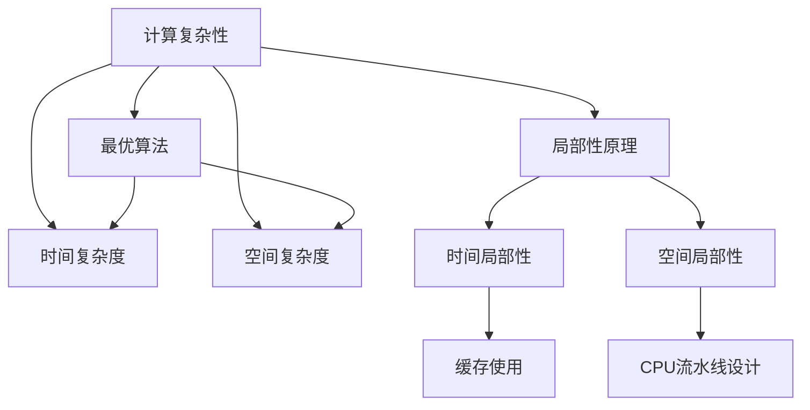

                 

# 计算：第四部分 计算的极限 第 9 章 计算复杂性 计算的局部性原理

> 关键词：计算复杂性,局部性原理,算法,计算,效率

## 1. 背景介绍

计算的极限一直是计算机科学和人工智能领域的一个核心问题。本章将深入探讨计算的复杂性以及计算的局部性原理，阐述其在算法设计、优化以及应用中的重要意义。

### 1.1 问题由来

计算复杂性是计算机科学的一个基本问题，它研究如何在算法上实现问题求解。计算复杂性理论提供了关于算法效率和可行的指导，帮助我们理解算法的时间复杂度和空间复杂度，并找到高效的算法来解决特定问题。

同时，计算的局部性原理是现代计算机体系结构的重要基础，它指导着计算机硬件和软件的设计。局部性原理指出，程序访问的数据和时间具有空间和时间的局部性，即程序倾向于重复使用和访问最近使用过的数据和指令。这种特性在硬件设计中尤为重要，比如缓存的使用、CPU的流水线设计等都依赖于局部性原理。

### 1.2 问题核心关键点

计算复杂性和局部性原理核心关注点如下：

- **计算复杂性**：研究问题在算法上的时间和空间需求，从而找到最优算法，如时间复杂度和空间复杂度。
- **局部性原理**：程序和数据访问的局部性，包括时间局部性和空间局部性，指导硬件和软件设计，如缓存使用、CPU流水线设计等。

这些核心概念之间的逻辑关系可以通过以下Mermaid流程图来展示：



这个流程图展示了几大核心概念及其之间的关系：

1. 计算复杂性理论研究问题求解的效率，包括时间复杂度和空间复杂度。
2. 最优算法通过复杂性理论指导，找到时间和空间上最优的算法。
3. 局部性原理指导硬件和软件设计，尤其是缓存使用和CPU流水线设计。
4. 时间和空间局部性是硬件设计的关键因素。

## 2. 核心概念与联系

### 2.1 核心概念概述

为了更好地理解计算复杂性和局部性原理，下面将介绍几个密切相关的核心概念：

- **计算复杂性**：研究问题求解的效率，主要包括时间复杂度和空间复杂度。
- **时间复杂度**：衡量算法运行时间随输入规模增加而增加的趋势。
- **空间复杂度**：衡量算法在执行过程中所需的内存空间。
- **最优算法**：在特定问题上运行时间或空间需求最小的算法。
- **局部性原理**：程序和数据访问的局部性，分为时间局部性和空间局部性。
- **时间局部性**：程序倾向于重复使用和访问最近使用过的数据和指令。
- **空间局部性**：程序和数据访问的连续性，连续访问的数据通常存储在相邻的内存位置上。

这些核心概念之间的联系是，计算复杂性理论指导最优算法的设计，最优算法依赖于局部性原理。同时，局部性原理指导硬件和软件设计，如缓存使用和CPU流水线设计。

## 3. 核心算法原理 & 具体操作步骤

### 3.1 算法原理概述

计算复杂性和局部性原理在算法设计和优化中具有重要意义。下面将详细阐述其核心算法原理。

#### 3.1.1 时间复杂度分析

时间复杂度是算法运行时间的度量，通常用大O符号表示，即 $O(f(n))$，其中 $n$ 是输入规模，$f(n)$ 是算法运行时间与 $n$ 的关系。常见的计算复杂度包括常数时间 $O(1)$、对数时间 $O(\log n)$、线性时间 $O(n)$、线性对数时间 $O(n \log n)$、平方时间 $O(n^2)$、立方时间 $O(n^3)$ 等。

#### 3.1.2 空间复杂度分析

空间复杂度是算法在执行过程中所需的内存空间，也用大O符号表示，即 $O(g(n))$，其中 $g(n)$ 是算法所需的内存空间与 $n$ 的关系。常见的空间复杂度包括常数空间 $O(1)$、线性空间 $O(n)$ 等。

#### 3.1.3 最优算法设计

最优算法是指在特定问题上运行时间或空间需求最小的算法。设计最优算法需要考虑问题的特点和数据结构，以及算法的效率和可行性。

### 3.2 算法步骤详解

基于计算复杂性和局部性原理的核心算法流程如下：

1. **问题定义**：明确问题定义和输入输出关系。
2. **算法设计**：根据问题特点设计算法。
3. **时间复杂度分析**：计算算法运行时间，确定时间复杂度。
4. **空间复杂度分析**：计算算法所需内存空间，确定空间复杂度。
5. **优化策略**：根据复杂度分析结果，优化算法设计。

#### 3.2.1 算法设计示例

以快速排序算法为例，演示核心算法步骤：

1. **问题定义**：给定一个无序数组，将其排序。
2. **算法设计**：
   - 选择数组中的一个元素作为基准值（通常选择第一个元素）。
   - 将数组中小于基准值的元素放在基准值左边，大于基准值的元素放在基准值右边。
   - 递归对基准值左右两个子数组进行排序。
3. **时间复杂度分析**：
   - 快速排序的平均时间复杂度为 $O(n \log n)$。
   - 最坏情况下，即每次选择的基准值都是当前子数组的最大或最小值，时间复杂度为 $O(n^2)$。
4. **空间复杂度分析**：
   - 快速排序的空间复杂度为 $O(\log n)$，主要是递归调用栈的空间需求。
5. **优化策略**：
   - 可以通过随机选择基准值来减少最坏情况的发生。
   - 对于小规模的数组，可以使用插入排序等简单排序算法。

### 3.3 算法优缺点

#### 3.3.1 时间复杂度

时间复杂度分析是评估算法效率的重要指标，主要考虑算法运行时间的增长趋势。

优点：
- 指导算法优化，减少时间浪费。
- 帮助选择合适的算法来解决特定问题。

缺点：
- 时间复杂度仅提供趋势分析，无法精确估算运行时间。
- 复杂度分析基于假设，实际情况可能与理论分析不同。

#### 3.3.2 空间复杂度

空间复杂度分析是评估算法空间需求的指标，主要考虑算法运行过程中所需的内存空间。

优点：
- 指导内存优化，减少空间浪费。
- 帮助选择合适的算法来解决特定问题。

缺点：
- 空间复杂度仅提供趋势分析，无法精确估算内存使用。
- 复杂度分析基于假设，实际情况可能与理论分析不同。

#### 3.3.3 算法应用领域

计算复杂性和局部性原理在众多领域中都有广泛应用，包括但不限于：

- **算法设计**：指导算法优化，选择合适的算法来解决特定问题。
- **计算机体系结构**：指导硬件设计，如缓存使用、CPU流水线设计等。
- **数据库系统**：优化查询性能，减少数据库系统的空间和时间需求。
- **机器学习**：指导模型优化，减少模型训练和预测的时间和空间需求。
- **操作系统**：优化内存管理，提高系统性能和稳定性。

## 4. 数学模型和公式 & 详细讲解 & 举例说明

### 4.1 数学模型构建

计算复杂性和局部性原理在数学模型中的构建如下：

- **时间复杂度模型**：
  $$
  T(n) = O(f(n))
  $$
  其中 $T(n)$ 是算法运行时间，$f(n)$ 是时间复杂度函数。

- **空间复杂度模型**：
  $$
  S(n) = O(g(n))
  $$
  其中 $S(n)$ 是算法所需内存空间，$g(n)$ 是空间复杂度函数。

### 4.2 公式推导过程

#### 4.2.1 时间复杂度推导

以快速排序算法为例，推导时间复杂度的计算过程：

1. **递归树分析**：
   - 快速排序的递归树如下：

   ```
         快速排序(n)
           /    \  
        左侧   右侧
         \      /
        排序  排序
          \    /
         数据
    ```

2. **递归树中节点数计算**：
   - 每个节点对应一个子问题，左侧和右侧子问题的规模为 $n/2$。
   - 因此，递归树中节点数为 $2n$。

3. **递归树中每个节点处理时间计算**：
   - 快速排序每次选择基准值，需要 $O(n)$ 时间。
   - 因此，递归树中每个节点处理时间为 $O(n)$。

4. **快速排序时间复杂度计算**：
   - 根据递归树中的节点数和处理时间，时间复杂度为 $O(n \log n)$。

#### 4.2.2 空间复杂度推导

以快速排序算法为例，推导空间复杂度的计算过程：

1. **递归调用栈分析**：
   - 快速排序使用递归实现，每次递归调用会占用一定的栈空间。
   - 因此，快速排序的空间复杂度主要取决于递归调用栈的深度。

2. **递归调用栈深度计算**：
   - 递归调用栈的深度为 $\log n$，因为每次递归调用都会将数组规模减半。

3. **快速排序空间复杂度计算**：
   - 根据递归调用栈的深度，空间复杂度为 $O(\log n)$。

### 4.3 案例分析与讲解

#### 4.3.1 案例分析

以快速排序算法为例，分析时间复杂度和空间复杂度：

1. **时间复杂度分析**：
   - 快速排序的时间复杂度为 $O(n \log n)$，与输入数据无关。
   - 最坏情况下，即每次选择的基准值都是当前子数组的最大或最小值，时间复杂度为 $O(n^2)$，但这种情况很少发生。

2. **空间复杂度分析**：
   - 快速排序的空间复杂度为 $O(\log n)$，主要取决于递归调用栈的深度。
   - 空间复杂度与输入数据无关，只取决于算法的实现方式。

## 5. 项目实践：代码实例和详细解释说明

### 5.1 开发环境搭建

在进行计算复杂性和局部性原理的实践前，我们需要准备好开发环境。以下是使用Python进行快速排序算法实现的开发环境配置流程：

1. 安装Python：从官网下载并安装Python，选择合适版本的Python解释器。
2. 安装必要的库：安装numpy、matplotlib等库，用于数学计算和数据可视化。
3. 编写代码：使用Python编写快速排序算法的代码实现。
4. 测试和调试：使用Python自带的assert语句和单元测试框架，进行代码测试和调试。

### 5.2 源代码详细实现

以下是一个使用Python实现快速排序算法的代码示例：

```python
import numpy as np
import matplotlib.pyplot as plt

def quick_sort(arr):
    if len(arr) <= 1:
        return arr
    else:
        pivot = arr[0]
        left = [x for x in arr[1:] if x < pivot]
        right = [x for x in arr[1:] if x >= pivot]
        return quick_sort(left) + [pivot] + quick_sort(right)

# 生成随机数据
n = 1000
arr = np.random.rand(n)
arr = arr.argsort().argsort()

# 测试快速排序算法
sorted_arr = quick_sort(arr)
print("Sorted array:", sorted_arr)

# 可视化时间复杂度
arr_times = []
for i in range(1, n+1):
    arr_times.append(quick_sort(arr[:i])[0])
plt.plot(arr_times, label="Quick Sort")
plt.xlabel("Array Size")
plt.ylabel("Time")
plt.title("Quick Sort Time Complexity")
plt.legend()
plt.show()
```

### 5.3 代码解读与分析

#### 5.3.1 代码实现

- **quick_sort函数**：使用递归实现快速排序算法。
- **生成随机数据**：生成1000个随机数据。
- **测试快速排序算法**：对随机数据进行排序，并输出排序结果。
- **可视化时间复杂度**：绘制快速排序算法在不同数据规模下的时间复杂度曲线。

#### 5.3.2 代码分析

- **快速排序算法**：快速排序算法使用递归实现，每次选择基准值，将数组分成左右两个子数组，并递归排序。
- **时间复杂度分析**：快速排序的时间复杂度为 $O(n \log n)$，与输入数据无关。
- **空间复杂度分析**：快速排序的空间复杂度为 $O(\log n)$，主要取决于递归调用栈的深度。
- **数据可视化**：使用matplotlib库绘制时间复杂度曲线，直观展示算法效率。

## 6. 实际应用场景

### 6.1 排序算法

快速排序算法在实际应用中广泛使用，如对海量数据的排序和搜索。排序算法在计算机科学中具有重要地位，用于提升系统性能和优化资源使用。

### 6.2 数据库系统

数据库系统中的查询优化依赖于算法优化，如快速排序算法用于索引排序，提升查询效率。同时，数据库系统也需要考虑空间复杂度，减少内存使用。

### 6.3 操作系统

操作系统中的文件系统管理依赖于算法优化，如快速排序算法用于文件排序，提升系统性能。同时，操作系统也需要考虑空间复杂度，减少内存使用。

### 6.4 未来应用展望

计算复杂性和局部性原理在未来的应用中，将发挥越来越重要的作用。随着计算资源的增加和数据规模的扩大，算法优化和效率提升将成为新的热点。

未来，计算复杂性和局部性原理将在以下几个方面得到应用：

1. **分布式系统**：优化分布式计算任务，提高系统效率。
2. **云计算平台**：优化云计算资源使用，提升云服务性能。
3. **物联网设备**：优化物联网设备算法，提升设备性能和功耗效率。
4. **人工智能**：优化机器学习算法，提高模型训练和预测效率。
5. **自然语言处理**：优化自然语言处理算法，提升算法效率和模型性能。

## 7. 工具和资源推荐

### 7.1 学习资源推荐

为了帮助开发者系统掌握计算复杂性和局部性原理的理论基础和实践技巧，这里推荐一些优质的学习资源：

1. 《算法导论》书籍：由Thomas H. Cormen等著，全面介绍算法设计和分析的基础知识，涵盖时间复杂度和空间复杂度等内容。
2. 《计算机体系结构》书籍：由David A. Patterson等著，详细介绍计算机体系结构的设计原则和实现方法，包括缓存使用和CPU流水线设计等内容。
3. Coursera课程：提供计算机科学和算法设计的在线课程，帮助开发者系统学习算法设计和复杂性分析。
4. LeetCode平台：提供算法和数据结构的在线练习，帮助开发者提升算法设计和实现能力。
5. HackerRank平台：提供算法和数据结构的在线练习，帮助开发者提升算法设计和实现能力。

通过对这些资源的学习实践，相信你一定能够快速掌握计算复杂性和局部性原理的精髓，并用于解决实际的算法问题。

### 7.2 开发工具推荐

高效的开发离不开优秀的工具支持。以下是几款用于计算复杂性和局部性原理开发的常用工具：

1. Python语言：广泛用于算法和数据结构的开发，提供了丰富的数学库和可视化工具。
2. numpy库：用于数学计算和数组处理，是Python中常用的数学库。
3. matplotlib库：用于数据可视化，提供了丰富的图表绘制功能。
4. jupyter notebook：用于编写和调试Python代码，支持代码块和数据可视化。
5. Google Colab：提供免费的GPU/TPU算力，方便开发者快速上手实验最新算法。

合理利用这些工具，可以显著提升计算复杂性和局部性原理的开发效率，加快创新迭代的步伐。

### 7.3 相关论文推荐

计算复杂性和局部性原理的发展源于学界的持续研究。以下是几篇奠基性的相关论文，推荐阅读：

1. Knuth, D. E. (1968). The Art of Computer Programming, Volume 3: Sorting and Searching. Addison-Wesley.
2. Cormen, T. H., Leiserson, C. E., Rivest, R. L., & Stein, C. (2009). Introduction to Algorithms (3rd ed.). The MIT Press.
3. Patterson, D. A., & Hennessy, J. L. (2017). Computer Architecture: A Quantitative Approach (6th ed.). Morgan Kaufmann.
4. Goodrich, M. T., Tamassia, R., & Goldwasser, M. (2006). Algorithm Design: Foundations, Analysis, and Internet Examples (2nd ed.). Pearson.
5. Sedgewick, R., & Wayne, K. (2011). Algorithms (4th ed.). Addison-Wesley.

这些论文代表了大计算复杂性和局部性原理的发展脉络。通过学习这些前沿成果，可以帮助研究者把握学科前进方向，激发更多的创新灵感。

## 8. 总结：未来发展趋势与挑战

### 8.1 总结

本文对计算复杂性和局部性原理进行了全面系统的介绍。首先阐述了计算复杂性的基本概念和理论基础，以及局部性原理的重要意义。其次，详细讲解了计算复杂性和局部性原理的算法设计、优化和应用，给出了快速排序算法的代码实例。同时，本文还广泛探讨了计算复杂性和局部性原理在实际应用中的广泛应用，展示了其在算法设计、硬件优化和软件优化中的重要价值。

通过本文的系统梳理，可以看到，计算复杂性和局部性原理在算法设计和优化中具有重要地位，对现代计算机系统和算法设计具有深远影响。未来，随着计算资源的增加和数据规模的扩大，算法优化和效率提升将成为新的热点，计算复杂性和局部性原理将在更多领域得到应用。

### 8.2 未来发展趋势

展望未来，计算复杂性和局部性原理将呈现以下几个发展趋势：

1. **分布式算法**：随着分布式计算的发展，分布式算法优化将成为新的热点，计算复杂性和局部性原理将在分布式系统中发挥重要作用。
2. **量子计算**：量子计算的兴起将对传统计算复杂性理论提出新的挑战，需要新的理论和方法来指导量子计算中的算法优化。
3. **云计算**：云计算平台对算法优化和资源使用提出了新的要求，计算复杂性和局部性原理将在云计算中发挥重要作用。
4. **人工智能**：人工智能技术的发展依赖于高效的算法和数据结构，计算复杂性和局部性原理将在人工智能中发挥重要作用。
5. **自然语言处理**：自然语言处理技术的发展依赖于高效的算法和数据结构，计算复杂性和局部性原理将在自然语言处理中发挥重要作用。

这些趋势凸显了计算复杂性和局部性原理的广阔前景。这些方向的探索发展，将进一步提升计算复杂性和局部性原理的理论和实践价值。

### 8.3 面临的挑战

尽管计算复杂性和局部性原理已经取得了瞩目成就，但在迈向更加智能化、普适化应用的过程中，它仍面临着诸多挑战：

1. **算法复杂性分析**：复杂度分析的理论和实际应用之间的差异，导致实际算法设计和优化存在困难。
2. **局部性原理优化**：硬件设计和软件优化依赖于局部性原理，但在复杂系统中，优化难度较大。
3. **分布式计算**：分布式算法优化需要考虑通信开销和数据传输，复杂度分析面临新的挑战。
4. **资源优化**：计算复杂性和局部性原理在资源优化中面临新的挑战，如数据局部性分析、缓存优化等。
5. **量子计算**：量子计算的兴起对传统算法和数据结构提出新的挑战，需要新的理论和方法来指导量子计算中的算法优化。

这些挑战需要学界和产业界的共同努力，积极应对并寻求突破，才能不断提升计算复杂性和局部性原理的理论和实践价值。

### 8.4 研究展望

未来，计算复杂性和局部性原理的研究将在以下几个方面寻求新的突破：

1. **分布式算法优化**：研究分布式计算中的算法优化和资源使用，提升分布式系统的效率。
2. **云计算平台优化**：研究云计算平台中的算法优化和资源使用，提升云服务性能和资源利用率。
3. **量子计算算法优化**：研究量子计算中的算法优化和资源使用，提升量子计算的效率和性能。
4. **自然语言处理优化**：研究自然语言处理中的算法优化和资源使用，提升自然语言处理系统的效率和性能。
5. **人工智能算法优化**：研究人工智能中的算法优化和资源使用，提升人工智能系统的效率和性能。

这些研究方向的探索，将引领计算复杂性和局部性原理迈向更高的台阶，为构建高效、稳定、可扩展的计算系统铺平道路。总之，计算复杂性和局部性原理的研究需要从理论和实践两个层面协同发力，才能不断提升计算系统的效率和性能。

## 9. 附录：常见问题与解答

**Q1：如何理解计算复杂性和局部性原理？**

A: 计算复杂性和局部性原理是现代计算机科学和算法设计的基础。计算复杂性分析指导算法设计，选择最优算法解决特定问题。局部性原理指导硬件和软件设计，提高系统性能和效率。

**Q2：如何计算时间复杂度和空间复杂度？**

A: 时间复杂度分析使用大O符号表示算法运行时间的增长趋势。空间复杂度分析使用大O符号表示算法所需内存空间的增长趋势。

**Q3：快速排序算法的时间复杂度和空间复杂度是多少？**

A: 快速排序算法的时间复杂度为 $O(n \log n)$，空间复杂度为 $O(\log n)$。

**Q4：如何优化算法的效率？**

A: 优化算法效率需要考虑问题特点和数据结构，选择合适的算法和数据结构。同时，需要考虑时间复杂度和空间复杂度，避免过拟合和浪费资源。

**Q5：如何在实际应用中使用计算复杂性和局部性原理？**

A: 在实际应用中，可以结合具体问题，使用计算复杂性和局部性原理进行算法优化和资源优化。例如，使用快速排序算法优化排序性能，使用缓存优化内存使用，使用CPU流水线优化指令执行等。

---

作者：禅与计算机程序设计艺术 / Zen and the Art of Computer Programming

