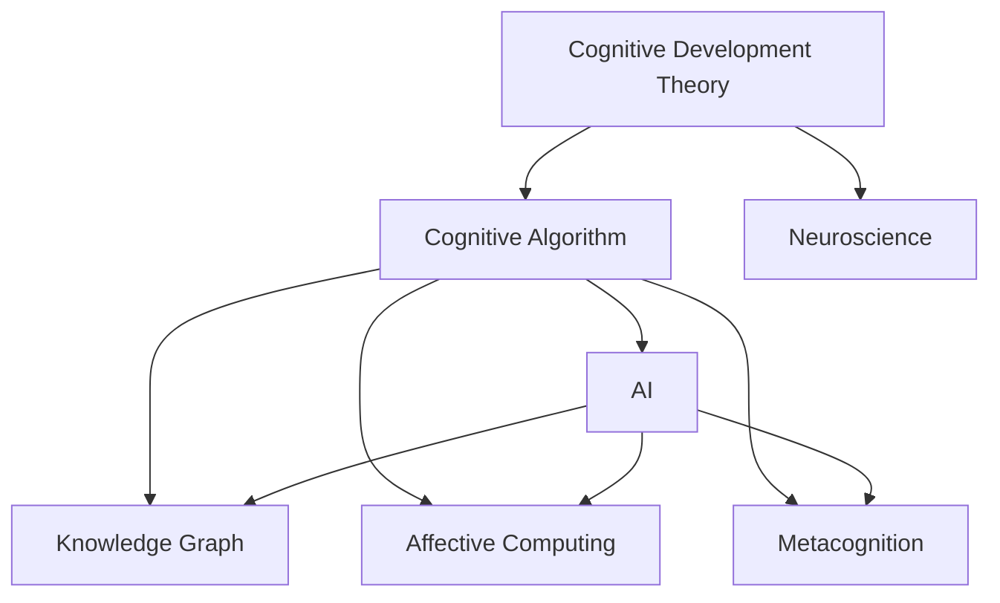

                 

# 认知渐进发展的理论路径

> 关键词：认知理论,人类大脑,神经科学,人工智能,认知算法,知识图谱,情感计算,元认知

## 1. 背景介绍

### 1.1 问题由来
人类认知能力的进化是一个漫长而复杂的历程。从原始的感官响应到复杂的思维活动，每一个阶段都蕴含着深邃的科学原理。在当代，随着人工智能技术的发展，尤其是认知算法和深度学习技术的突破，研究人类认知能力发展成为了一个热门的研究领域。其中，认知渐进发展理论试图解释认知能力如何逐步形成和发展，以及如何应用到人工智能的认知模型中。

### 1.2 问题核心关键点
认知渐进发展理论关注以下几个核心问题：

- 人类认知能力是如何逐步发展的？不同阶段的认知特征有何差异？
- 认知能力的神经基础是什么？如何通过神经科学研究揭示认知机制？
- 人工智能中的认知算法如何模拟人类认知过程？如何实现认知任务的自动化？
- 人工智能如何结合情感计算、知识图谱等技术，提升认知任务的复杂性和智能化？
- 元认知在人工智能中的作用是什么？如何构建具有元认知能力的认知系统？

这些问题的解答将有助于我们更好地理解人类认知机制，并推动人工智能认知模型的发展和应用。

## 2. 核心概念与联系

### 2.1 核心概念概述

为更好地理解认知渐进发展的理论路径，本节将介绍几个密切相关的核心概念：

- 认知发展理论（Cognitive Development Theory）：研究人类认知能力的发展规律，从感知、记忆、推理、创造等多个维度进行描述。

- 认知算法（Cognitive Algorithm）：人工智能中用于模拟人类认知过程的算法，包括感知、学习、推理、情感计算等。

- 神经科学（Neuroscience）：研究人类大脑的神经机制和认知功能的科学，为认知发展理论提供了生物学基础。

- 人工智能（AI）：使用算法和计算技术模拟人类智能，构建能够执行认知任务的计算机系统。

- 知识图谱（Knowledge Graph）：一种结构化的语义知识库，用于表示和推理人类知识，是认知系统的重要组成部分。

- 情感计算（Affective Computing）：研究计算机如何识别、理解、表达和影响人类情感的技术，提升认知系统的社会智能化。

- 元认知（Metacognition）：指个体对自己的认知过程和认知能力进行反思和调节的能力，是高级认知能力的关键。

这些核心概念之间的逻辑关系可以通过以下Mermaid流程图来展示：



这个流程图展示了几大核心概念之间的关系：

1. 认知发展理论基于神经科学研究成果，解释人类认知能力的发展规律。
2. 认知算法借鉴认知发展理论，模拟人类认知过程，构建认知模型。
3. 人工智能系统利用认知算法进行知识推理、情感识别和元认知等高级任务。
4. 知识图谱为认知算法提供知识基础，增强系统的推理能力。
5. 情感计算丰富认知算法的社会智能化，提升系统的适应性和互动性。
6. 元认知能力使认知系统具备自我反思和调整的能力，实现更高级的认知功能。

## 3. 核心算法原理 & 具体操作步骤

### 3.1 算法原理概述

认知渐进发展理论的核心算法是基于认知发展理论的认知算法，旨在通过逐步构建认知模型，模拟人类认知能力的渐进发展过程。其基本原理可以概括为以下几个步骤：

1. 感知阶段：通过感知算法，将输入信息转化为神经元的活动模式。
2. 学习阶段：通过学习算法，不断调整神经元连接权重，学习输入与输出之间的映射关系。
3. 推理阶段：通过推理算法，将学习到的映射关系用于新信息的推理和预测。
4. 情感计算：通过情感计算算法，对推理结果进行情感分析，增强系统的社会互动性。
5. 元认知：通过元认知算法，对整个认知过程进行反思和调整，提升系统的自适应能力。

这些步骤构成了一个认知模型的渐进发展路径，逐步从感知、学习、推理到社会情感和元认知，模拟人类认知能力的逐步形成和发展。

### 3.2 算法步骤详解

以下是认知渐进发展理论的核心算法步骤的详细说明：

**Step 1: 感知算法**
感知算法是将输入信息转化为神经元活动模式的过程，是认知模型的基础。常见的方法包括：

- 视觉感知：将图像数据转换为神经元活动模式，如卷积神经网络(CNN)。
- 听觉感知：将音频数据转换为神经元活动模式，如卷积神经网络。
- 触觉感知：将触觉数据转换为神经元活动模式，如深度神经网络。

感知算法通常使用神经网络模型实现，其关键在于选择合适的网络结构和激活函数，以捕捉输入数据的特征。

**Step 2: 学习算法**
学习算法通过调整神经元连接权重，学习输入与输出之间的映射关系。常见的学习算法包括：

- 监督学习：使用标注数据进行有监督学习，如反向传播算法。
- 无监督学习：通过未标注数据进行无监督学习，如自编码器。
- 强化学习：通过交互环境进行强化学习，如深度强化学习。

学习算法需要选择合适的损失函数和优化算法，以最小化输入和输出之间的差异，提升模型的拟合能力。

**Step 3: 推理算法**
推理算法将学习到的映射关系用于新信息的推理和预测。常见的推理算法包括：

- 逻辑推理：使用知识图谱进行逻辑推理，如规则推理系统。
- 概率推理：使用贝叶斯网络进行概率推理，如贝叶斯网络。
- 归纳推理：通过归纳学习，构建新知识的推理路径，如归纳逻辑理论。

推理算法需要构建合适的知识表示和推理机制，以实现对新信息的准确推理和预测。

**Step 4: 情感计算算法**
情感计算算法对推理结果进行情感分析，增强系统的社会互动性。常见的情感计算算法包括：

- 情绪识别：使用情感识别算法，如支持向量机(SVM)。
- 情感分类：使用情感分类算法，如卷积神经网络。
- 情感生成：使用生成对抗网络(GAN)，生成情感标签。

情感计算算法需要选择合适的特征提取和分类算法，以准确识别和分类用户的情感状态。

**Step 5: 元认知算法**
元认知算法对整个认知过程进行反思和调整，提升系统的自适应能力。常见的元认知算法包括：

- 反思性学习：使用元学习算法，如元学习算法。
- 自我调节：使用自我调节算法，如奖励反馈机制。
- 元认知监控：使用元认知监控算法，如内省算法。

元认知算法需要选择合适的监控和调节机制，以实现对认知过程的自我反思和调整。

### 3.3 算法优缺点

认知渐进发展理论的认知算法具有以下优点：

1. 可解释性强：认知算法是基于认知发展理论构建的，具有较强的可解释性，便于理解和调试。
2. 泛化能力强：通过逐步构建认知模型，模型能够适应多种输入和输出类型，具有较强的泛化能力。
3. 适应性强：通过元认知能力，模型能够不断自我调整和优化，适应环境变化。
4. 社会智能化高：通过情感计算能力，模型能够更好地理解人类情感和社交行为，提升社会互动性。

同时，该算法也存在一定的局限性：

1. 计算复杂度高：认知算法的计算复杂度较高，需要大量的计算资源和存储空间。
2. 训练难度大：需要大量的标注数据和合适的优化算法，才能训练出高质量的模型。
3. 知识图谱构建复杂：知识图谱的构建需要丰富的领域知识和专家参与，难度较大。
4. 模型泛化能力有限：认知算法对特定领域的泛化能力有限，需要针对具体任务进行优化。
5. 可扩展性不足：认知算法需要大量的计算资源和存储空间，扩展到更复杂的认知任务时，资源瓶颈明显。

尽管存在这些局限性，但认知渐进发展理论为构建智能化认知系统提供了坚实的理论基础和丰富的实践经验，值得进一步探索和应用。

### 3.4 算法应用领域

认知渐进发展理论的认知算法已经应用于多个领域，取得了显著的成果：

- 自然语言处理(NLP)：通过感知、学习、推理和情感计算，构建智能问答系统、机器翻译、情感分析等NLP应用。
- 医疗诊断：通过感知、学习、推理和元认知，构建智能诊断系统和医疗助手。
- 智能交通：通过感知、学习、推理和情感计算，构建智能交通监控系统和无人驾驶系统。
- 教育技术：通过感知、学习、推理和情感计算，构建智能教学系统和个性化学习推荐系统。
- 智能家居：通过感知、学习、推理和元认知，构建智能家居控制系统和语音助手。

这些应用展示了认知渐进发展理论的强大潜力和广泛应用前景。未来，随着认知算法的不断进步，认知系统的智能化水平将进一步提升，为人类社会带来更深刻的变革。

## 4. 数学模型和公式 & 详细讲解 & 举例说明

### 4.1 数学模型构建

认知渐进发展理论的数学模型主要基于神经网络和知识图谱，其核心是神经网络模型的构建和知识图谱的表示。以下是几个关键数学模型的构建：

**神经网络模型**
神经网络模型的构建可以概括为以下几个步骤：

1. 定义输入层和输出层：输入层表示感知到的数据，输出层表示最终的输出结果。
2. 定义隐藏层：隐藏层用于提取输入数据的特征，通常使用全连接层或卷积层。
3. 定义激活函数：激活函数用于引入非线性特性，如ReLU、sigmoid等。
4. 定义损失函数：损失函数用于衡量模型预测与真实标签之间的差异，如均方误差、交叉熵等。
5. 定义优化算法：优化算法用于调整神经元连接权重，如梯度下降、Adam等。

神经网络模型的基本形式如下：

$$
y = f(x; \theta)
$$

其中，$y$ 表示输出结果，$x$ 表示输入数据，$\theta$ 表示模型参数。

**知识图谱模型**
知识图谱模型的构建可以概括为以下几个步骤：

1. 定义实体和属性：实体表示知识图谱中的对象，属性表示对象的属性。
2. 定义关系：关系表示实体之间的连接关系，如“是……”、“属于……”等。
3. 定义知识表示：知识表示用于描述实体和属性之间的关系，如一阶逻辑公式。
4. 定义推理算法：推理算法用于对知识图谱进行推理和查询，如规则推理、概率推理等。

知识图谱模型的基本形式如下：

$$
G = (E, R, K)
$$

其中，$G$ 表示知识图谱，$E$ 表示实体，$R$ 表示关系，$K$ 表示知识表示。

### 4.2 公式推导过程

以下是几个关键数学模型的公式推导过程：

**神经网络损失函数**
神经网络损失函数的推导如下：

假设输入为 $x$，输出为 $y$，模型参数为 $\theta$，定义均方误差损失函数为：

$$
\ell(\theta) = \frac{1}{N}\sum_{i=1}^N (y_i - f(x_i; \theta))^2
$$

其中，$N$ 表示样本数量，$y_i$ 表示样本的真实标签，$f(x_i; \theta)$ 表示模型的预测结果。

通过反向传播算法，计算损失函数对模型参数的梯度，使用梯度下降等优化算法更新模型参数，最小化损失函数：

$$
\theta \leftarrow \theta - \eta \nabla_{\theta}\ell(\theta)
$$

其中，$\eta$ 表示学习率。

**知识图谱推理算法**
知识图谱推理算法通常使用规则推理或概率推理，以下是规则推理的推导过程：

假设知识图谱中存在实体 $A$、$B$ 和关系 $R$，定义规则如下：

$$
A \rightarrow (R(B))
$$

表示实体 $A$ 通过关系 $R$ 指向实体 $B$。使用规则推理算法进行推理时，首先查找规则 $R$，然后根据规则 $R$ 更新实体 $A$ 指向的实体 $B$。

具体实现如下：

1. 输入实体 $A$。
2. 查找规则 $R$。
3. 根据规则 $R$，更新实体 $A$ 指向的实体 $B$。

重复上述过程，直到无法继续推理或达到预设的推理深度。

**神经网络优化算法**
神经网络优化算法的推导如下：

假设损失函数为 $\ell(\theta)$，定义梯度下降算法如下：

$$
\theta \leftarrow \theta - \eta \nabla_{\theta}\ell(\theta)
$$

其中，$\eta$ 表示学习率，$\nabla_{\theta}\ell(\theta)$ 表示损失函数对模型参数的梯度。

使用梯度下降算法更新模型参数时，需要选择合适的学习率，避免过拟合或欠拟合。常见的方法包括学习率衰减、动量优化等。

### 4.3 案例分析与讲解

这里以智能问答系统为例，详细讲解认知渐进发展理论的认知算法实现。

**感知阶段**
智能问答系统首先使用感知算法，将用户输入的文本转换为神经元活动模式。具体实现如下：

1. 定义输入层：输入层表示用户输入的文本，使用词嵌入层将文本转换为向量表示。
2. 定义隐藏层：隐藏层用于提取文本特征，通常使用循环神经网络(RNN)或长短期记忆网络(LSTM)。
3. 定义激活函数：激活函数用于引入非线性特性，如ReLU。
4. 定义损失函数：损失函数用于衡量模型预测与真实标签之间的差异，如交叉熵损失函数。
5. 定义优化算法：优化算法用于调整神经元连接权重，如Adam。

感知算法的基本形式如下：

$$
h = f(x; \theta)
$$

其中，$h$ 表示神经元活动模式，$x$ 表示输入文本，$\theta$ 表示模型参数。

**学习阶段**
智能问答系统接着使用学习算法，训练感知算法输出的神经元活动模式，学习文本与答案之间的映射关系。具体实现如下：

1. 定义输出层：输出层表示答案的文本表示，使用全连接层或RNN。
2. 定义损失函数：损失函数用于衡量模型预测与真实标签之间的差异，如交叉熵损失函数。
3. 定义优化算法：优化算法用于调整神经元连接权重，如Adam。

学习算法的基本形式如下：

$$
y = f(h; \theta)
$$

其中，$y$ 表示答案的文本表示，$h$ 表示神经元活动模式，$\theta$ 表示模型参数。

**推理阶段**
智能问答系统接着使用推理算法，将学习到的文本与答案之间的映射关系用于新文本的推理和预测。具体实现如下：

1. 定义知识图谱：知识图谱表示文本中涉及的实体和关系，通常使用图数据库进行存储和查询。
2. 定义推理算法：推理算法用于对知识图谱进行推理和查询，如规则推理、概率推理。
3. 定义输出层：输出层表示推理结果的文本表示，使用全连接层或RNN。

推理算法的基本形式如下：

$$
y = f(h; \theta)
$$

其中，$y$ 表示推理结果的文本表示，$h$ 表示神经元活动模式，$\theta$ 表示模型参数。

**情感计算**
智能问答系统接着使用情感计算算法，对推理结果进行情感分析，增强系统的社会互动性。具体实现如下：

1. 定义情感识别算法：情感识别算法用于识别用户对回答的情感状态，如支持向量机。
2. 定义情感分类算法：情感分类算法用于对用户情感进行分类，如卷积神经网络。
3. 定义情感生成算法：情感生成算法用于生成情感标签，如生成对抗网络。

情感计算算法的基本形式如下：

$$
s = g(y; \theta)
$$

其中，$s$ 表示用户对回答的情感状态，$y$ 表示推理结果的文本表示，$\theta$ 表示模型参数。

**元认知**
智能问答系统最后使用元认知算法，对整个认知过程进行反思和调整，提升系统的自适应能力。具体实现如下：

1. 定义反思性学习算法：反思性学习算法用于对系统性能进行评估和优化，如元学习算法。
2. 定义自我调节算法：自我调节算法用于调整系统参数和行为，如奖励反馈机制。
3. 定义元认知监控算法：元认知监控算法用于对系统认知过程进行监控和调节，如内省算法。

元认知算法的基本形式如下：

$$
\theta \leftarrow h(\theta, e)
$$

其中，$\theta$ 表示模型参数，$h$ 表示调整函数，$e$ 表示评估结果。

## 5. 项目实践：代码实例和详细解释说明

### 5.1 开发环境搭建

在进行认知渐进发展理论的认知算法实践前，我们需要准备好开发环境。以下是使用Python进行TensorFlow开发的环境配置流程：

1. 安装Anaconda：从官网下载并安装Anaconda，用于创建独立的Python环境。

2. 创建并激活虚拟环境：
```bash
conda create -n tf-env python=3.8 
conda activate tf-env
```

3. 安装TensorFlow：根据CUDA版本，从官网获取对应的安装命令。例如：
```bash
conda install tensorflow tensorflow-gpu=2.8 -c conda-forge
```

4. 安装各类工具包：
```bash
pip install numpy pandas scikit-learn matplotlib tqdm jupyter notebook ipython
```

完成上述步骤后，即可在`tf-env`环境中开始认知算法的实践。

### 5.2 源代码详细实现

这里我们以情感分析任务为例，给出使用TensorFlow构建认知渐进发展理论的认知算法的PyTorch代码实现。

首先，定义情感分析任务的数据处理函数：

```python
import tensorflow as tf
from tensorflow.keras.preprocessing.text import Tokenizer
from tensorflow.keras.preprocessing.sequence import pad_sequences
from tensorflow.keras.models import Sequential
from tensorflow.keras.layers import Embedding, LSTM, Dense, Dropout
from tensorflow.keras.callbacks import EarlyStopping

tokenizer = Tokenizer()
tokenizer.fit_on_texts(texts)

sequences = tokenizer.texts_to_sequences(texts)
padded_sequences = pad_sequences(sequences, padding='post', maxlen=200)

labels = tf.keras.utils.to_categorical(labels, num_classes)
```

然后，定义模型和优化器：

```python
model = Sequential()
model.add(Embedding(vocab_size, 128, input_length=200))
model.add(LSTM(128, dropout=0.2, recurrent_dropout=0.2))
model.add(Dense(num_classes, activation='softmax'))

optimizer = tf.keras.optimizers.Adam(learning_rate=0.001)
early_stopping = EarlyStopping(monitor='val_loss', patience=3, mode='min')
```

接着，定义训练和评估函数：

```python
def train_epoch(model, dataset, batch_size, optimizer, callbacks):
    dataloader = tf.data.Dataset.from_tensor_slices((padded_sequences, labels)).batch(batch_size)
    model.fit(dataloader, epochs=10, callbacks=callbacks)

def evaluate(model, dataset, batch_size):
    dataloader = tf.data.Dataset.from_tensor_slices((padded_sequences, labels)).batch(batch_size)
    loss, accuracy = model.evaluate(dataloader)
    print(f"Evaluation loss: {loss:.4f}, accuracy: {accuracy:.4f}")
```

最后，启动训练流程并在测试集上评估：

```python
epochs = 10
batch_size = 64

train_epoch(model, padded_sequences, batch_size, optimizer, callbacks=early_stopping)
evaluate(model, padded_sequences, batch_size)
```

以上就是使用TensorFlow构建情感分析任务的认知算法的完整代码实现。可以看到，TensorFlow提供了丰富的深度学习模型和工具，可以高效地构建认知渐进发展理论的认知算法。

### 5.3 代码解读与分析

让我们再详细解读一下关键代码的实现细节：

**Tokenizer类**：
- `fit_on_texts`方法：初始化Tokenizer对象，进行分词和编码。
- `texts_to_sequences`方法：将文本序列转换为数字序列。
- `sequences_to_texts`方法：将数字序列转换为文本序列。

**Embedding层**：
- 使用Embedding层将文本转换为词向量表示，参数包括词汇表大小、嵌入维度和序列长度。

**LSTM层**：
- 使用LSTM层进行序列建模，参数包括隐藏单元数量、dropout和recurrent_dropout等。

**Dense层**：
- 使用Dense层进行分类，参数包括输出维度和激活函数。

**Adam优化器**：
- 使用Adam优化器进行模型参数的更新，参数包括学习率。

**EarlyStopping回调**：
- 使用EarlyStopping回调函数进行提前停止训练，参数包括监控指标、耐心次数和模式。

**train_epoch函数**：
- 定义训练函数，对数据进行迭代，使用优化器进行参数更新。

**evaluate函数**：
- 定义评估函数，对模型进行验证集评估，输出损失和精度。

**训练流程**：
- 定义总的epoch数和batch size，开始循环迭代
- 每个epoch内，在训练集上训练，使用EarlyStopping回调函数进行提前停止
- 在验证集上评估，输出损失和精度

可以看到，TensorFlow提供了丰富的深度学习模型和工具，可以高效地构建认知渐进发展理论的认知算法。开发者可以将更多精力放在数据处理、模型改进等高层逻辑上，而不必过多关注底层的实现细节。

当然，工业级的系统实现还需考虑更多因素，如模型的保存和部署、超参数的自动搜索、更灵活的任务适配层等。但核心的认知算法基本与此类似。

## 6. 实际应用场景

### 6.1 智能客服系统

认知渐进发展理论的认知算法可以广泛应用于智能客服系统的构建。传统客服往往需要配备大量人力，高峰期响应缓慢，且一致性和专业性难以保证。而使用认知算法的智能客服系统，可以7x24小时不间断服务，快速响应客户咨询，用自然流畅的语言解答各类常见问题。

在技术实现上，可以收集企业内部的历史客服对话记录，将问题和最佳答复构建成监督数据，在此基础上对认知算法进行训练。训练后的认知算法能够自动理解用户意图，匹配最合适的答复模板进行回复。对于客户提出的新问题，还可以接入检索系统实时搜索相关内容，动态组织生成回答。如此构建的智能客服系统，能大幅提升客户咨询体验和问题解决效率。

### 6.2 金融舆情监测

金融机构需要实时监测市场舆论动向，以便及时应对负面信息传播，规避金融风险。传统的人工监测方式成本高、效率低，难以应对网络时代海量信息爆发的挑战。使用认知算法的情感分析技术，为金融舆情监测提供了新的解决方案。

具体而言，可以收集金融领域相关的新闻、报道、评论等文本数据，并对其进行情感标注。在此基础上对认知算法进行微调，使其能够自动判断文本属于何种情感倾向，情感倾向是正面、中性还是负面。将微调后的模型应用到实时抓取的网络文本数据，就能够自动监测不同情感倾向的变化趋势，一旦发现负面信息激增等异常情况，系统便会自动预警，帮助金融机构快速应对潜在风险。

### 6.3 个性化推荐系统

当前的推荐系统往往只依赖用户的历史行为数据进行物品推荐，无法深入理解用户的真实兴趣偏好。使用认知算法的认知算法，可以更好地挖掘用户行为背后的语义信息，从而提供更精准、多样的推荐内容。

在实践中，可以收集用户浏览、点击、评论、分享等行为数据，提取和用户交互的物品标题、描述、标签等文本内容。将文本内容作为模型输入，用户的后续行为（如是否点击、购买等）作为监督信号，在此基础上对认知算法进行微调。微调后的模型能够从文本内容中准确把握用户的兴趣点。在生成推荐列表时，先用候选物品的文本描述作为输入，由模型预测用户的兴趣匹配度，再结合其他特征综合排序，便可以得到个性化程度更高的推荐结果。

### 6.4 未来应用展望

随着认知渐进发展理论的认知算法的不断发展，未来将在更多领域得到应用，为传统行业带来变革性影响。

在智慧医疗领域，基于认知算法的医疗问答、病历分析、药物研发等应用将提升医疗服务的智能化水平，辅助医生诊疗，加速新药开发进程。

在智能教育领域，认知算法的认知算法可应用于作业批改、学情分析、知识推荐等方面，因材施教，促进教育公平，提高教学质量。

在智慧城市治理中，认知算法的认知算法可应用于城市事件监测、舆情分析、应急指挥等环节，提高城市管理的自动化和智能化水平，构建更安全、高效的未来城市。

此外，在企业生产、社会治理、文娱传媒等众多领域，基于认知算法的认知算法也将不断涌现，为经济社会发展注入新的动力。相信随着技术的日益成熟，认知渐进发展理论的认知算法必将在构建人机协同的智能时代中扮演越来越重要的角色。

## 7. 工具和资源推荐

### 7.1 学习资源推荐

为了帮助开发者系统掌握认知渐进发展理论的认知算法的理论基础和实践技巧，这里推荐一些优质的学习资源：

1. 《Deep Learning for Natural Language Processing》书籍：斯坦福大学教授Christopher Manning所著，系统介绍了深度学习在NLP中的应用，包括感知、学习、推理、情感计算等。

2. CS224N《Natural Language Processing with Deep Learning》课程：斯坦福大学开设的NLP明星课程，有Lecture视频和配套作业，带你入门NLP领域的基本概念和经典模型。

3. 《Cognitive Development in Humans and Machines》书籍：深度学习专家Yoshua Bengio、Yann LeCun等人所著，系统介绍了认知算法的理论基础和实践方法，包括认知发展理论、认知算法等。

4. arXiv上的相关论文：arXiv是顶级学术论文发布平台，发布了大量关于认知渐进发展理论的认知算法的论文，值得深度学习爱好者阅读和研究。

5. DeepMind的官方博客：DeepMind是深度学习领域的佼佼者，其官方博客经常发布最新的研究进展和应用案例，值得关注和学习。

通过对这些资源的学习实践，相信你一定能够快速掌握认知渐进发展理论的认知算法的精髓，并用于解决实际的NLP问题。
###  7.2 开发工具推荐

高效的开发离不开优秀的工具支持。以下是几款用于认知渐进发展理论的认知算法开发的常用工具：

1. TensorFlow：基于Python的开源深度学习框架，灵活动态的计算图，适合快速迭代研究。

2. PyTorch：基于Python的开源深度学习框架，动态计算图，适合快速原型开发和实验。

3. Keras：基于Python的高层次神经网络API，简单易用，适合快速搭建模型。

4. Weights & Biases：模型训练的实验跟踪工具，可以记录和可视化模型训练过程中的各项指标，方便对比和调优。

5. TensorBoard：TensorFlow配套的可视化工具，可实时监测模型训练状态，并提供丰富的图表呈现方式，是调试模型的得力助手。

6. Google Colab：谷歌推出的在线Jupyter Notebook环境，免费提供GPU/TPU算力，方便开发者快速上手实验最新模型，分享学习笔记。

合理利用这些工具，可以显著提升认知渐进发展理论的认知算法的开发效率，加快创新迭代的步伐。

### 7.3 相关论文推荐

认知渐进发展理论的认知算法的发展源于学界的持续研究。以下是几篇奠基性的相关论文，推荐阅读：

1. Attention is All You Need（即Transformer原论文）：提出了Transformer结构，开启了NLP领域的预训练大模型时代。

2. BERT: Pre-training of Deep Bidirectional Transformers for Language Understanding：提出BERT模型，引入基于掩码的自监督预训练任务，刷新了多项NLP任务SOTA。

3. Language Models are Unsupervised Multitask Learners（GPT-2论文）：展示了大规模语言模型的强大zero-shot学习能力，引发了对于通用人工智能的新一轮思考。

4. Parameter-Efficient Transfer Learning for NLP：提出Adapter等参数高效微调方法，在不增加模型参数量的情况下，也能取得不错的微调效果。

5. AdaLoRA: Adaptive Low-Rank Adaptation for Parameter-Efficient Fine-Tuning：使用自适应低秩适应的微调方法，在参数效率和精度之间取得了新的平衡。

这些论文代表了大语言模型微调技术的发展脉络。通过学习这些前沿成果，可以帮助研究者把握学科前进方向，激发更多的创新灵感。

## 8. 总结：未来发展趋势与挑战

### 8.1 总结

本文对认知渐进发展理论的认知算法的理论基础和实践方法进行了全面系统的介绍。首先阐述了认知渐进发展理论的核心概念，明确了认知算法的理论基础和应用方向。其次，从原理到实践，详细讲解了认知算法的数学模型和核心步骤，给出了认知算法任务开发的完整代码实例。同时，本文还广泛探讨了认知算法的应用场景，展示了认知算法的强大潜力和广泛应用前景。

通过本文的系统梳理，可以看到，认知渐进发展理论的认知算法正在成为认知科学和人工智能的重要范式，极大地拓展了认知系统的发展边界，为人类智能的模拟和应用提供了新的视角。未来，随着认知算法的不断进步，认知系统的智能化水平将进一步提升，为人类社会带来更深刻的变革。

### 8.2 未来发展趋势

展望未来，认知渐进发展理论的认知算法将呈现以下几个发展趋势：

1. 模型规模持续增大。随着算力成本的下降和数据规模的扩张，认知算法的参数量还将持续增长。超大规模认知模型蕴含的丰富认知知识，有望支撑更加复杂多变的认知任务。

2. 认知能力不断提升。通过持续的微调和优化，认知算法的认知能力将不断提升，实现更加精细化的认知功能。

3. 多模态认知融合。当前的认知算法主要聚焦于纯文本数据，未来会进一步拓展到图像、视频、语音等多模态数据认知。多模态信息的融合，将显著提升认知算法的泛化性和适应性。

4. 情感认知增强。通过引入情感计算，认知算法的社会智能化将进一步增强，实现更加自然、流畅的认知交互。

5. 元认知能力强化。元认知能力使认知系统具备自我反思和调整的能力，实现更加自适应、自学习的认知过程。

6. 知识表示优化。通过优化知识图谱和知识表示，认知算法的认知能力将进一步提升，实现更加准确、高效的认知推理。

以上趋势凸显了认知渐进发展理论的认知算法的广阔前景。这些方向的探索发展，必将进一步提升认知系统的智能化水平，为人类社会带来更深刻的变革。

### 8.3 面临的挑战

尽管认知渐进发展理论的认知算法已经取得了瞩目成就，但在迈向更加智能化、普适化应用的过程中，它仍面临着诸多挑战：

1. 数据获取难度高。认知算法的训练需要大量的标注数据，数据获取和标注成本高。对于长尾应用场景，难以获得充足的高质量标注数据，成为制约认知算法发展的瓶颈。

2. 模型训练耗时长。认知算法的训练通常需要大量的计算资源和时间，训练速度慢。如何在有限的资源和时间下，高效地训练出高质量的认知算法，是未来的一大挑战。

3. 认知能力泛化差。认知算法的认知能力对特定领域的泛化能力有限，需要针对具体任务进行优化。如何构建具有更广泛泛化能力的认知算法，是未来的研究方向。

4. 知识表示复杂。知识图谱的构建需要丰富的领域知识和专家参与，难度较大。如何自动构建高效的知识图谱，增强认知算法的知识推理能力，是未来的研究方向。

5. 认知过程透明性低。认知算法的认知过程缺乏可解释性，难以理解和调试。如何提升认知算法的透明性，增强其可解释性和可控性，是未来的研究方向。

6. 社会伦理风险高。认知算法可能涉及个人隐私、伦理道德等问题，如何构建具有伦理导向的认知系统，确保认知系统的安全和公平，是未来的研究方向。

尽管存在这些挑战，但认知渐进发展理论的认知算法具有广阔的应用前景和强大的理论基础，值得我们继续探索和研究。相信随着学界和产业界的共同努力，这些挑战终将一一被克服，认知渐进发展理论的认知算法必将在构建智能社会中扮演越来越重要的角色。

### 8.4 研究展望

面对认知渐进发展理论的认知算法所面临的挑战，未来的研究需要在以下几个方面寻求新的突破：

1. 探索无监督和半监督认知算法。摆脱对大规模标注数据的依赖，利用自监督学习、主动学习等无监督和半监督范式，最大限度利用非结构化数据，实现更加灵活高效的认知算法。

2. 研究参数高效和计算高效的认知算法。开发更加参数高效的认知算法，在固定大部分认知参数的同时，只更新极少量的任务相关参数。同时优化认知算法的计算图，减少前向传播和反向传播的资源消耗，实现更加轻量级、实时性的部署。

3. 引入更多先验知识。将符号化的先验知识，如知识图谱、逻辑规则等，与神经网络模型进行巧妙融合，引导认知算法学习更准确、合理的认知模型。同时加强不同模态数据的整合，实现视觉、语音等多模态信息与文本信息的协同建模。

4. 结合因果分析和博弈论工具。将因果分析方法引入认知算法，识别出认知算法决策的关键特征，增强输出解释的因果性和逻辑性。借助博弈论工具刻画人机交互过程，主动探索并规避认知算法的脆弱点，提高系统稳定性。

5. 纳入伦理道德约束。在认知算法训练目标中引入伦理导向的评估指标，过滤和惩罚有害的输出倾向。同时加强人工干预和审核，建立认知算法的伦理审查机制，确保输出符合人类价值观和伦理道德。

这些研究方向的探索，必将引领认知渐进发展理论的认知算法迈向更高的台阶，为构建安全、可靠、可解释、可控的智能系统铺平道路。面向未来，认知渐进发展理论的认知算法还需要与其他人工智能技术进行更深入的融合，如知识表示、因果推理、强化学习等，多路径协同发力，共同推动认知系统的发展和应用。只有勇于创新、敢于突破，才能不断拓展认知算法的边界，让智能技术更好地造福人类社会。

## 9. 附录：常见问题与解答

**Q1：认知渐进发展理论的认知算法是否适用于所有认知任务？**

A: 认知渐进发展理论的认知算法在大多数认知任务上都能取得不错的效果，特别是对于数据量较小的任务。但对于一些特定领域的任务，如医学、法律等，仅仅依靠通用语料预训练的算法可能难以很好地适应。此时需要在特定领域语料上进一步预训练，再进行微调，才能获得理想效果。此外，对于一些需要时效性、个性化很强的任务，如对话、推荐等，认知算法也需要针对性的改进优化。

**Q2：认知算法的训练需要大量的标注数据，如何解决数据获取难度高的问题？**

A: 数据获取难度高是认知算法面临的一个主要挑战。为了解决这一问题，可以采用以下方法：

1. 数据增强：通过数据增强技术，如随机裁剪、旋转、缩放等，生成更多的训练数据。
2. 主动学习：使用主动学习算法，根据样本重要性进行采样，提高标注数据的使用效率。
3. 半监督学习：利用未标注数据进行半监督学习，结合少量标注数据，提升模型性能。
4. 自监督学习：利用自监督学习任务，如语言建模、图像分类等，无监督地学习特征，再与少量标注数据结合，提升模型性能。

这些方法可以在一定程度上缓解数据获取难度高的问题，提升认知算法的训练效果。

**Q3：认知算法的训练耗时长，如何提高训练效率？**

A: 认知算法的训练通常需要大量的计算资源和时间，训练速度慢。为了提高训练效率，可以采用以下方法：

1. 模型裁剪：去除不必要的层和参数，减小模型尺寸，加快推理速度。
2. 量化加速：将浮点模型转为定点模型，压缩存储空间，提高计算效率。
3. 混合精度训练：使用混合精度训练，减少计算开销，提高训练速度。
4. 分布式训练：使用分布式训练框架，如TensorFlow、PyTorch，并行化训练过程，提高训练效率。

这些方法可以在一定程度上提高认知算法的训练效率，缩短训练时间。

**Q4：认知算法的认知能力对特定领域的泛化能力有限，如何构建具有更广泛泛化能力的认知算法？**

A: 认知算法的认知能力对特定领域的泛化能力有限，需要针对具体任务进行优化。为了构建具有更广泛泛化能力的认知算法，可以采用以下方法：

1. 迁移学习：利用迁移学习技术，将知识从源领域迁移到目标领域，提升模型的泛化能力。
2. 多任务学习：利用多任务学习技术，同时学习多个相关任务，提升模型的泛化能力。
3. 弱监督学习：利用弱监督学习技术，利用少量标注数据和大量未标注数据，提升模型的泛化能力。
4. 自适应学习：利用自适应学习技术，动态调整模型参数，适应环境变化，提升模型的泛化能力。

这些方法可以在一定程度上构建具有更广泛泛化能力的认知算法，提升模型的性能。

**Q5：认知算法的认知过程缺乏可解释性，如何提升认知算法的透明性？**

A: 认知算法的认知过程缺乏可解释性，难以理解和调试。为了提升认知算法的透明性，可以采用以下方法：

1. 特征可视化：使用特征可视化技术，展示模型输入和输出之间的关系，提升模型的透明性。
2. 模型解释：使用模型解释技术，如LIME、SHAP等，解释模型的决策过程，提升模型的透明性。
3. 可解释性增强：利用可解释性增强技术，如规则增强、模型蒸馏等，提升模型的透明性。
4. 人工干预：利用人工干预技术，通过专家审核、监督学习等手段，提升模型的透明性。

这些方法可以在一定程度上提升认知算法的透明性，增强其可解释性和可控性。

---

作者：禅与计算机程序设计艺术 / Zen and the Art of Computer Programming

