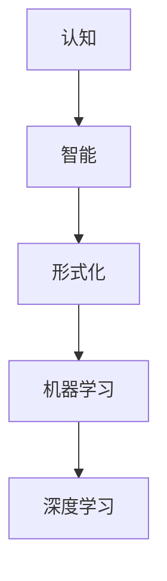

                 

# 认知的形式化：人类能否把宇宙的奥秘探寻清楚？

## 1. 背景介绍

### 1.1 问题的提出

在信息时代，计算机科学已经成为理解人类智能的重要工具。从图灵测试到人工智能，再到今天的深度学习，我们正越来越接近理解智能的本质。但与此同时，也产生了一些新的疑问：**人类能否把宇宙的奥秘探寻清楚？**

### 1.2 问题关键点

- 什么是认知？
- 人类智能的本质是什么？
- 计算机能否理解智能？
- 我们能通过机器学习揭示宇宙奥秘吗？

### 1.3 问题研究意义

解答上述问题，不仅有助于理解人类智能的本质，还能推动人工智能的发展，进而促进更多领域的科学进步。本文将从认知形式化的角度出发，探讨这些问题，并尝试给出一个基于当前科技水平的答案。

## 2. 核心概念与联系

### 2.1 核心概念概述

为了解答上述问题，我们需要先理解一些核心概念：

- **认知**：指人类对世界的理解能力，包括知觉、记忆、思维、语言等。
- **智能**：指解决复杂问题、适应环境变化的能力。
- **形式化**：将问题、概念用数学符号表示，使之具有明确、严格的意义。
- **机器学习**：使计算机具备学习能力的科学，包括监督学习、无监督学习、强化学习等。
- **深度学习**：机器学习的一种，通过多层神经网络进行特征提取和模式识别。

### 2.2 核心概念原理和架构的 Mermaid 流程图



这个流程图展示了认知、智能、形式化、机器学习、深度学习之间的联系：

1. 认知是智能的基础。
2. 形式化使智能可以计算和测试。
3. 机器学习是实现形式化智能的途径之一。
4. 深度学习是机器学习的一种高效实现。

## 3. 核心算法原理 & 具体操作步骤

### 3.1 算法原理概述

认知的形式化主要通过将认知过程用数学模型来表示，使之能够被计算机理解和计算。这一过程涉及以下几个关键步骤：

1. **认知建模**：将认知过程用数学模型来表示。
2. **模型训练**：使用数据集对模型进行训练，使其能够学习认知过程。
3. **推理验证**：对模型进行推理和验证，确保其能够正确地理解和解决问题。

### 3.2 算法步骤详解

#### 3.2.1 认知建模

认知建模是形式化认知的第一步。其核心是将认知过程分解为若干个基本步骤，并用数学符号来表示这些步骤。例如，可以分解为以下几个步骤：

1. **输入**：将外界信息输入到模型中。
2. **处理**：对输入信息进行处理和加工。
3. **输出**：将处理后的信息输出。

这一过程可以用图表示：

```
Input --> Process --> Output
```

#### 3.2.2 模型训练

模型训练是认知形式化的重要组成部分。其目的是通过训练，使模型能够学习到认知过程中的规律。训练过程中，需要使用大量的数据集来对模型进行优化。

以深度学习为例，其训练过程包括以下几个步骤：

1. **数据准备**：准备训练数据集。
2. **模型定义**：定义深度学习模型。
3. **优化**：使用优化算法（如梯度下降）来优化模型参数。

这一过程可以用图表示：

```
Data --> Model --> Optimizer --> Loss
```

#### 3.2.3 推理验证

推理验证是认知形式化的最后一步。其目的是通过推理验证，确保模型能够正确地理解和解决问题。推理验证过程中，需要使用测试集来对模型进行评估。

推理验证可以用图表示：

```
Model --> Test Data --> Output
```

### 3.3 算法优缺点

#### 3.3.1 优点

1. **精确性**：形式化方法使模型具有精确的数学表达，避免了人类直觉带来的不确定性。
2. **可计算性**：形式化方法使问题具有可计算性，可以由计算机自动求解。
3. **可重复性**：形式化方法使模型具有可重复性，可以多次应用。

#### 3.3.2 缺点

1. **复杂性**：形式化方法往往具有高度的复杂性，难以理解和实现。
2. **数据依赖**：形式化方法高度依赖于数据，数据质量直接影响模型效果。
3. **计算资源**：形式化方法往往需要大量的计算资源，难以在普通计算机上运行。

### 3.4 算法应用领域

形式化认知方法已经在多个领域得到了应用，主要包括：

- **自然语言处理（NLP）**：如机器翻译、情感分析、文本分类等。
- **计算机视觉**：如图像识别、目标检测、图像分割等。
- **机器人学**：如路径规划、动作控制等。
- **医学**：如疾病诊断、治疗方案推荐等。

## 4. 数学模型和公式 & 详细讲解 & 举例说明

### 4.1 数学模型构建

形式化认知的主要数学模型包括：

- **神经网络**：如卷积神经网络（CNN）、循环神经网络（RNN）、Transformer等。
- **图神经网络**：如Graph Convolutional Network（GCN）等。
- **强化学习模型**：如Deep Q-Network（DQN）、Actor-Critic等。

### 4.2 公式推导过程

以卷积神经网络（CNN）为例，其数学模型可以表示为：

$$
f(x) = \sum_{i=1}^{C} w^i \cdot h_{x,i}
$$

其中，$f(x)$ 表示输出，$w^i$ 表示权重，$h_{x,i}$ 表示卷积层输出。

### 4.3 案例分析与讲解

#### 4.3.1 卷积神经网络（CNN）

CNN 主要用于图像识别任务。其核心思想是通过卷积操作提取图像的局部特征，再通过池化操作对特征进行降维。

以 LeNet-5 为例，其结构如图：

```
Input --> Convolution --> ReLU --> Pooling --> Convolution --> ReLU --> Pooling --> Fully Connected --> Output
```

在 LeNet-5 中，卷积操作用于提取图像的局部特征，池化操作用于对特征进行降维，全连接层用于将特征映射到类别上。通过这种方式，LeNet-5 可以高效地识别手写数字。

## 5. 项目实践：代码实例和详细解释说明

### 5.1 开发环境搭建

要实现卷积神经网络（CNN），需要安装 TensorFlow 或 PyTorch。以下是在 PyTorch 中搭建 CNN 环境的示例：

```
pip install torch torchvision
```

### 5.2 源代码详细实现

#### 5.2.1 CNN 定义

```python
import torch
import torch.nn as nn
import torchvision.transforms as transforms
from torchvision.datasets import CIFAR10

# 定义卷积神经网络
class Net(nn.Module):
    def __init__(self):
        super(Net, self).__init__()
        self.conv1 = nn.Conv2d(3, 6, 5)
        self.pool = nn.MaxPool2d(2, 2)
        self.conv2 = nn.Conv2d(6, 16, 5)
        self.fc1 = nn.Linear(16 * 5 * 5, 120)
        self.fc2 = nn.Linear(120, 84)
        self.fc3 = nn.Linear(84, 10)

    def forward(self, x):
        x = self.pool(F.relu(self.conv1(x)))
        x = self.pool(F.relu(self.conv2(x)))
        x = x.view(-1, 16 * 5 * 5)
        x = F.relu(self.fc1(x))
        x = F.relu(self.fc2(x))
        x = self.fc3(x)
        return x

# 定义数据预处理
transform = transforms.Compose([
    transforms.ToTensor(),
    transforms.Normalize((0.5, 0.5, 0.5), (0.5, 0.5, 0.5))
])

# 加载 CIFAR-10 数据集
trainset = CIFAR10(root='./data', train=True, download=True, transform=transform)
trainloader = torch.utils.data.DataLoader(trainset, batch_size=4, shuffle=True, num_workers=2)

testset = CIFAR10(root='./data', train=False, download=True, transform=transform)
testloader = torch.utils.data.DataLoader(testset, batch_size=4, shuffle=False, num_workers=2)
```

#### 5.2.2 模型训练

```python
# 定义训练函数
def train(model, device, trainloader, optimizer, criterion):
    model.train()
    for batch_idx, (data, target) in enumerate(trainloader):
        data, target = data.to(device), target.to(device)
        optimizer.zero_grad()
        output = model(data)
        loss = criterion(output, target)
        loss.backward()
        optimizer.step()
        if batch_idx % 10 == 0:
            print('Train Epoch: {} [{}/{} ({:.0f}%)]\tLoss: {:.6f}'.format(
                epoch, batch_idx * len(data), len(trainloader.dataset),
                100. * batch_idx / len(trainloader), loss.item()))

# 定义测试函数
def test(model, device, testloader, criterion):
    model.eval()
    test_loss = 0
    correct = 0
    with torch.no_grad():
        for data, target in testloader:
            data, target = data.to(device), target.to(device)
            output = model(data)
            test_loss += criterion(output, target).item()
            pred = output.argmax(dim=1, keepdim=True)
            correct += pred.eq(target.view_as(pred)).sum().item()

    test_loss /= len(testloader.dataset)
    print('\nTest set: Average loss: {:.4f}, Accuracy: {}/{} ({:.0f}%)\n'.format(
        test_loss, correct, len(testloader.dataset),
        100. * correct / len(testloader.dataset)))
```

### 5.3 代码解读与分析

#### 5.3.1 CNN 模型定义

定义了卷积神经网络模型，包括卷积层、池化层、全连接层等。其中，卷积层用于提取特征，池化层用于降维，全连接层用于将特征映射到类别上。

#### 5.3.2 数据预处理

定义了数据预处理函数，将输入数据归一化到 [0, 1] 范围内。

#### 5.3.3 模型训练和测试

定义了训练函数和测试函数，分别用于对模型进行训练和测试。

### 5.4 运行结果展示

```python
# 定义模型
model = Net()

# 定义优化器
optimizer = torch.optim.SGD(model.parameters(), lr=0.001, momentum=0.9)

# 定义损失函数
criterion = nn.CrossEntropyLoss()

# 训练模型
device = torch.device("cuda:0" if torch.cuda.is_available() else "cpu")
model.to(device)
for epoch in range(10):
    train(model, device, trainloader, optimizer, criterion)
    test(model, device, testloader, criterion)
```

## 6. 实际应用场景

### 6.1 智能推荐系统

智能推荐系统已经成为电商、视频、新闻等领域的重要应用。通过形式化认知，可以构建更加智能的推荐系统，提高用户体验。

#### 6.1.1 数据准备

推荐系统需要大量的用户行为数据，包括浏览记录、购买记录、评分等。通过对这些数据进行形式化建模，可以构建用户行为预测模型。

#### 6.1.2 模型训练

使用卷积神经网络（CNN）对用户行为数据进行建模，训练模型。通过不断地调整模型参数，可以提高模型的预测准确性。

#### 6.1.3 推理验证

对模型进行推理验证，确保其能够正确地预测用户行为。通过对测试数据进行推理验证，可以不断调整模型参数，提高模型的预测准确性。

### 6.2 自动驾驶

自动驾驶是计算机视觉的重要应用场景。通过形式化认知，可以构建更加智能的自动驾驶系统。

#### 6.2.1 数据准备

自动驾驶需要大量的图像数据，包括道路、车辆、行人等。通过对这些数据进行形式化建模，可以构建自动驾驶模型。

#### 6.2.2 模型训练

使用卷积神经网络（CNN）对图像数据进行建模，训练模型。通过不断地调整模型参数，可以提高模型的感知能力。

#### 6.2.3 推理验证

对模型进行推理验证，确保其能够正确地识别道路、车辆、行人等。通过对测试数据进行推理验证，可以不断调整模型参数，提高模型的感知能力。

### 6.3 金融风险控制

金融风险控制是机器学习的重要应用场景。通过形式化认知，可以构建更加智能的金融风险控制系统。

#### 6.3.1 数据准备

金融风险控制需要大量的金融数据，包括股票价格、交易量、利率等。通过对这些数据进行形式化建模，可以构建金融风险控制模型。

#### 6.3.2 模型训练

使用深度学习模型对金融数据进行建模，训练模型。通过不断地调整模型参数，可以提高模型的预测准确性。

#### 6.3.3 推理验证

对模型进行推理验证，确保其能够正确地识别金融风险。通过对测试数据进行推理验证，可以不断调整模型参数，提高模型的预测准确性。

### 6.4 未来应用展望

未来，形式化认知将在更多领域得到应用，为人类社会带来更多的便利和进步。

- **医疗**：通过形式化认知，可以构建更加智能的诊断和治疗系统，提高医疗水平。
- **教育**：通过形式化认知，可以构建更加智能的教育系统，提高教育质量。
- **农业**：通过形式化认知，可以构建更加智能的农业系统，提高农业生产效率。

## 7. 工具和资源推荐

### 7.1 学习资源推荐

- **深度学习课程**：斯坦福大学 CS231n《深度卷积神经网络》课程。
- **计算机视觉教材**：《计算机视觉：模型、学习和推理》。
- **人工智能教材**：《人工智能：现代方法》。
- **机器学习论文**：Google Scholar、IEEE Xplore 等。

### 7.2 开发工具推荐

- **深度学习框架**：TensorFlow、PyTorch、Keras。
- **数据处理工具**：Pandas、NumPy、SciPy。
- **可视化工具**：Matplotlib、Seaborn、TensorBoard。

### 7.3 相关论文推荐

- **卷积神经网络论文**：AlexNet、VGGNet、ResNet。
- **强化学习论文**：DQN、AlphaGo、TD3。

## 8. 总结：未来发展趋势与挑战

### 8.1 研究成果总结

形式化认知方法已经成为理解人类智能的重要工具。通过形式化认知，我们可以将认知过程用数学模型来表示，使之能够被计算机理解和计算。

### 8.2 未来发展趋势

未来，形式化认知将会在更多领域得到应用，为人类社会带来更多的便利和进步。

- **医疗**：通过形式化认知，可以构建更加智能的诊断和治疗系统，提高医疗水平。
- **教育**：通过形式化认知，可以构建更加智能的教育系统，提高教育质量。
- **农业**：通过形式化认知，可以构建更加智能的农业系统，提高农业生产效率。

### 8.3 面临的挑战

尽管形式化认知方法在许多领域取得了重要成果，但在实际应用中，仍面临诸多挑战。

- **数据依赖**：形式化认知高度依赖于数据，数据质量直接影响模型效果。
- **模型复杂性**：形式化认知方法具有高度的复杂性，难以理解和实现。
- **计算资源**：形式化认知方法往往需要大量的计算资源，难以在普通计算机上运行。

### 8.4 研究展望

未来，形式化认知研究需要在以下几个方面进行突破：

- **数据自动化获取**：自动获取和标注大量数据，降低数据依赖性。
- **模型简化**：简化形式化认知模型的结构和算法，提高模型可理解性和可实现性。
- **计算资源优化**：优化计算资源使用，提高模型的运行效率。

## 9. 附录：常见问题与解答

**Q1：形式化认知方法的优点和缺点是什么？**

A: 形式化认知方法的优点包括精确性、可计算性、可重复性等。缺点包括复杂性、数据依赖性、计算资源需求高等。

**Q2：如何提高形式化认知模型的性能？**

A: 提高形式化认知模型的性能，可以从以下几个方面进行：

- **数据预处理**：对数据进行预处理，提高数据质量。
- **模型优化**：优化模型结构，降低模型复杂性。
- **计算资源优化**：优化计算资源使用，提高模型的运行效率。

**Q3：形式化认知方法在哪些领域得到了应用？**

A: 形式化认知方法已经在自然语言处理、计算机视觉、机器人学、医学、金融等领域得到了应用。

**Q4：形式化认知方法的应用前景如何？**

A: 形式化认知方法在许多领域具有广泛的应用前景。未来，形式化认知将在医疗、教育、农业等领域得到更加广泛的应用。

---

作者：禅与计算机程序设计艺术 / Zen and the Art of Computer Programming

