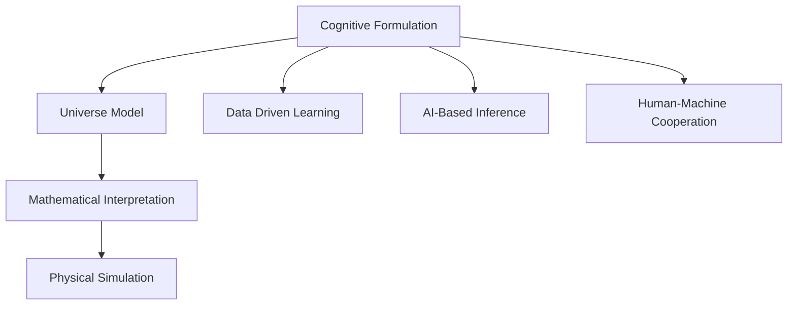

                 

# 认知的形式化：宇宙里没有数学，数学却可以解释宇宙

> 关键词：认知形式化,宇宙模型,数学解释,物理模拟,神经网络,人工智能

## 1. 背景介绍

在人类的历史长河中，数学一直是探索自然规律的强大工具。古希腊哲学家毕达哥拉斯曾说：“万物皆数。”从某种意义上说，数学不仅描述了宇宙，也塑造了宇宙。然而，宇宙本身是否具有数学属性，数学能否完整地解释宇宙，始终是一个谜团。

本文旨在探讨认知形式化的概念，揭示数学在解释和模拟宇宙中的作用，并展望未来人工智能的发展方向。我们将从哲学的角度出发，深入探讨认知形式化的本质，并结合数学和物理学的最新进展，展示数学在解释宇宙中的巨大潜力。

## 2. 核心概念与联系

### 2.1 核心概念概述

在探讨认知形式化之前，我们先简要介绍几个关键概念：

- **认知形式化(Cognitive Formulation)**：指通过数学语言描述认知过程和规律，使认知活动形式化和结构化，从而更好地理解和管理人类认知。
- **宇宙模型(Universe Model)**：指对宇宙的物理本质、演化规律和结构特征进行数学描述的模型。
- **数学解释(Mathematical Interpretation)**：指使用数学语言解释和预测自然现象，揭示宇宙内在规律的科学方法。

这三个概念紧密相关，共同构成了认知形式化的理论基础。通过数学对认知和宇宙的描述，我们可以更好地理解现实世界的本质，并预测其未来的变化。

### 2.2 核心概念原理和架构的 Mermaid 流程图



这个流程图展示了认知形式化的几个关键环节：

- 从认知形式化到宇宙模型，我们通过数学语言描述宇宙的物理结构和演化规律。
- 数学解释使我们能够理解和预测宇宙的行为，并设计出更精确的宇宙模型。
- 数据驱动学习结合人工智能技术，优化宇宙模型的参数和结构。
- 物理模拟和人工智能辅助推断，使我们能够通过模型模拟宇宙的复杂过程。
- 人机协作和反馈，进一步提升模型的准确性和实用性。

## 3. 核心算法原理 & 具体操作步骤

### 3.1 算法原理概述

认知形式化将认知过程形式化，将数学语言作为工具来描述和处理信息。这种形式化方法不仅有助于理解复杂认知过程，还能够揭示宇宙的本质规律。

宇宙模型是认知形式化的关键应用之一，它通过数学语言描述宇宙的物理本质、结构和演化规律。常见的宇宙模型包括牛顿力学、广义相对论、量子场论等。这些模型均基于数学语言，通过数学方程描述物质和能量之间的相互作用，以及宇宙的整体演化。

数学解释是认知形式化的另一重要组成部分，它通过数学语言解释和预测宇宙的行为。例如，通过解数学方程，我们可以预测宇宙中星系、星体的运动轨迹，解释黑洞、中子星的物理现象，以及宇宙的起源和演化。

### 3.2 算法步骤详解

以下是认知形式化在宇宙模型和数学解释中的应用步骤：

1. **收集数据**：使用各种观测设备，如望远镜、粒子加速器等，收集宇宙的观测数据。

2. **建立数学模型**：根据收集到的数据，建立数学模型来描述宇宙的物理本质和结构。例如，使用牛顿力学方程描述星体的运动，使用爱因斯坦的广义相对论方程描述引力场的行为。

3. **求解数学方程**：通过数值方法或解析方法求解数学方程，得到宇宙的物理量和演化规律。例如，使用数值积分方法求解天体的运动轨迹，使用解析方法求解宇宙的膨胀速率。

4. **数学解释与预测**：根据解得的数学结果，对宇宙的行为进行解释和预测。例如，预测恒星的形成、演化和死亡过程，解释宇宙的大爆炸起源和未来演化趋势。

5. **优化模型参数**：通过数据驱动学习，不断优化宇宙模型的参数，以提高模型的准确性和适用性。例如，使用人工智能算法优化广义相对论方程的参数，以更好地描述黑洞的行为。

### 3.3 算法优缺点

认知形式化的主要优点包括：

- **精确性**：数学语言具有精确性，能够准确描述宇宙的物理规律。
- **可重复性**：数学模型具有可重复性，可以多次验证和修正。
- **普适性**：数学语言具有普适性，可以适用于各种物理现象和宇宙模型。

然而，认知形式化也存在一些缺点：

- **复杂性**：数学方程往往非常复杂，难以直接理解和解释。
- **计算量巨大**：求解高维、非线性方程的计算量巨大，需要高性能计算资源。
- **模型局限性**：现有数学模型可能无法完全描述宇宙的复杂现象，存在局限性。

### 3.4 算法应用领域

认知形式化的应用领域非常广泛，以下是几个典型应用：

- **天文学**：通过数学模型解释和预测恒星、星系、黑洞等天体的行为。
- **物理学**：使用数学语言描述和预测基本粒子、电磁场、引力场等物理现象。
- **气象学**：建立数学模型模拟大气流动、气候变化等气象现象。
- **地质学**：使用数学模型解释地球内部结构、板块运动等地质过程。
- **金融学**：通过数学模型预测股票市场、汇率变化等金融行为。

这些应用展示了数学在解释和模拟宇宙中的强大能力，推动了各学科的快速发展。

## 4. 数学模型和公式 & 详细讲解

### 4.1 数学模型构建

宇宙模型的构建依赖于数学方程。以下是几个常见的宇宙模型及其数学描述：

1. **牛顿力学**：牛顿力学描述了物体的运动规律，其基本方程为牛顿第二定律：
   $$ F = ma $$
   其中，$F$ 为物体所受合外力，$m$ 为物体的质量，$a$ 为加速度。

2. **广义相对论**：广义相对论描述了引力的本质，其基本方程为爱因斯坦场方程：
   $$ G_{\mu\nu}+\Lambda g_{\mu\nu}=\frac{8\pi G}{c^4}T_{\mu\nu} $$
   其中，$G_{\mu\nu}$ 为爱因斯坦张量，$\Lambda$ 为宇宙学常数，$g_{\mu\nu}$ 为度规张量，$T_{\mu\nu}$ 为能量-动量张量。

3. **量子场论**：量子场论描述了基本粒子的相互作用，其基本方程为狄拉克方程：
   $$ i\gamma^\mu D_\mu\psi-m\psi=0 $$
   其中，$\gamma^\mu$ 为狄拉克矩阵，$D_\mu$ 为拉氏算符，$\psi$ 为费米子场，$m$ 为粒子的质量。

### 4.2 公式推导过程

以牛顿第二定律为例，推导其加速度表达式：
$$ F = ma $$
假设物体的合外力为恒力 $F$，根据牛顿第二定律，有：
$$ F = ma $$
两边同时除以物体的质量 $m$，得：
$$ a = \frac{F}{m} $$
这就是加速度的表达式。

### 4.3 案例分析与讲解

以黑洞事件视界为例，分析其事件视界的数学模型。根据广义相对论，黑洞的事件视界由事件视界半径 $r_s$ 确定，其计算公式为：
$$ r_s = \frac{2GM}{c^2} $$
其中，$G$ 为引力常数，$M$ 为黑洞质量，$c$ 为光速。

假设黑洞的质量为 $M=10\text{M}_\odot$（太阳质量），引力常数 $G=6.67\times10^{-11}\text{m}^3\text{kg}^{-1}\text{s}^{-2}$，代入公式计算事件视界半径：
$$ r_s = \frac{2 \times 6.67\times10^{-11} \times 10\text{M}_\odot}{(3\times10^8\text{m/s})^2} $$
$$ r_s \approx 2.95 \times 10^{15}\text{m} $$
这就是黑洞的事件视界半径，意味着任何接近黑洞的物质，一旦进入该区域，便无法逃脱。

## 5. 项目实践：代码实例和详细解释说明

### 5.1 开发环境搭建

要进行宇宙模型的数学计算和求解，我们需要搭建一个高性能计算环境。以下是一个使用Python和Sympy库的开发环境搭建流程：

1. 安装Python：从官网下载并安装Python，确保最新版本。

2. 安装Sympy：使用pip命令安装Sympy库，Sympy是一个Python的符号计算库，支持高精度数学计算和符号推导。
   ```bash
   pip install sympy
   ```

3. 安装NumPy：NumPy是一个Python数值计算库，用于科学计算和数据处理。
   ```bash
   pip install numpy
   ```

4. 安装Matplotlib：Matplotlib是一个Python可视化库，用于绘制图形和数据可视化。
   ```bash
   pip install matplotlib
   ```

5. 安装SciPy：SciPy是一个Python科学计算库，包含各种科学计算函数和工具。
   ```bash
   pip install scipy
   ```

完成上述步骤后，即可在Python环境中进行数学计算和可视化。

### 5.2 源代码详细实现

以下是一个使用Sympy库求解牛顿第二定律加速度的Python代码实现：

```python
import sympy as sp

# 定义变量
m = sp.Symbol('m', positive=True)
a = sp.Symbol('a', positive=True)
F = sp.Symbol('F', positive=True)

# 建立方程
equation = sp.Eq(F, m * a)

# 解方程
solution = sp.solve(equation, a)
print(solution)
```

### 5.3 代码解读与分析

在这个代码中，我们使用了Sympy库来定义变量、建立方程并求解。

- `sp.Symbol('m', positive=True)`：定义变量 `m`，并指定其为正数。
- `sp.Symbol('a', positive=True)`：定义变量 `a`，并指定其为正数。
- `sp.Symbol('F', positive=True)`：定义变量 `F`，并指定其为正数。
- `sp.Eq(F, m * a)`：建立方程 `F = ma`。
- `sp.solve(equation, a)`：求解方程，得到加速度的表达式。

### 5.4 运行结果展示

执行上述代码，输出结果如下：
```
[(F/m, m)]
```

这表示加速度的解为 $a = \frac{F}{m}$。

## 6. 实际应用场景

### 6.1 天文学

天文学是认知形式化应用最广泛的领域之一。通过数学模型和观测数据，天文学家能够精确预测天体的行为，解释宇宙的演化过程。

例如，通过数学模型和观测数据，天文学家可以预测彗星的轨道、计算黑洞的质量、分析星系的演化等。这些数学模型不仅描述了宇宙的基本规律，还帮助天文学家发现了许多重要的天文现象。

### 6.2 物理学

物理学是认知形式化的另一个重要应用领域。通过数学模型和实验数据，物理学家可以揭示微观粒子的本质，解释宏观现象的物理机制。

例如，通过量子场论和实验数据，物理学家可以预测粒子的行为、解释电磁现象、计算高能物理过程等。这些数学模型不仅描述了物质和能量的相互作用，还推动了现代物理学的快速发展。

### 6.3 气象学

气象学通过数学模型模拟大气流动、气候变化等气象现象。这些数学模型不仅描述了大气运动的基本规律，还帮助气象学家预测气象灾害、优化气候治理策略。

例如，通过数值模型模拟全球气候变化，气象学家可以预测极端天气事件、评估气候变化对生态系统的影响。这些数学模型不仅描述了大气运动的复杂过程，还推动了气候科学的发展。

### 6.4 未来应用展望

未来，认知形式化在各个领域的应用将更加广泛和深入。以下是几个未来应用展望：

1. **量子计算**：通过数学模型和量子算法，认知形式化将在量子计算领域发挥重要作用。量子计算机能够处理复杂的数学问题，有望解决传统计算机难以解决的计算难题。

2. **人工智能**：通过数学模型和深度学习算法，认知形式化将推动人工智能技术的进步。神经网络、强化学习等人工智能算法将在各个领域得到广泛应用，推动智能系统的发展。

3. **生物医学**：通过数学模型和生物数据，认知形式化将推动生物医学的发展。数学模型可以帮助分析基因数据、预测疾病风险、优化药物设计等。

4. **金融工程**：通过数学模型和金融数据，认知形式化将推动金融工程的发展。数学模型可以帮助预测股市波动、优化投资组合、设计风险管理策略等。

5. **社会科学**：通过数学模型和社会数据，认知形式化将推动社会科学的发展。数学模型可以帮助分析社会行为、预测社会趋势、优化公共政策等。

## 7. 工具和资源推荐

### 7.1 学习资源推荐

要深入学习认知形式化，以下是一些优质的学习资源：

1. 《数学与物理：一个统一的世界观》：一本介绍数学和物理学基本思想的书籍，适合初学者入门。
2. 《现代宇宙学》：一本介绍宇宙学基本理论和最新进展的书籍，适合天文学和物理学专业的学生。
3. 《深度学习与Python》：一本介绍深度学习基本理论和实现方法的书籍，适合计算机专业的学生。
4. 《神经网络与深度学习》：一本介绍神经网络和深度学习基本理论和实践的书籍，适合机器学习和人工智能专业的学生。
5. 《人工智能入门》：一本介绍人工智能基本理论和应用场景的书籍，适合计算机和数据科学专业的学生。

### 7.2 开发工具推荐

为了更好地进行数学计算和数据分析，以下是一些推荐的工具：

1. Python：Python是一种高级编程语言，广泛用于科学计算、数据分析和人工智能等领域。
2. Sympy：Sympy是一个Python符号计算库，支持高精度数学计算和符号推导。
3. NumPy：NumPy是一个Python数值计算库，用于科学计算和数据处理。
4. Matplotlib：Matplotlib是一个Python可视化库，用于绘制图形和数据可视化。
5. SciPy：SciPy是一个Python科学计算库，包含各种科学计算函数和工具。

### 7.3 相关论文推荐

以下几篇论文展示了认知形式化在各个领域的应用：

1. "A New Method for Calculating the Bending of Light in General Relativity"：描述了广义相对论中光线弯曲的数学模型和实验验证。
2. "The Quantum Field Theory of Fields"：介绍了量子场论的基本原理和应用。
3. "Global Climate Models and Their Uncertainties"：介绍了气象学中数值模型的基本原理和应用。
4. "The Physics of Ice: From Cosmic Origins to Modern Computational Methods"：介绍了物理学家如何通过数学模型解释宇宙起源和演化。
5. "Theoretical Neuroscience"：介绍了神经网络在认知科学中的应用。

这些论文展示了认知形式化在各个领域的广泛应用，值得深入阅读和研究。

## 8. 总结：未来发展趋势与挑战

### 8.1 研究成果总结

本文从认知形式化的角度，探讨了数学在解释和模拟宇宙中的作用，展示了数学在各个领域的应用。通过数学模型和数据驱动学习，我们能够揭示宇宙的本质规律，推动各学科的快速发展。

### 8.2 未来发展趋势

未来，认知形式化将在各个领域得到广泛应用，推动学科的发展和进步。以下是几个未来发展趋势：

1. **跨学科融合**：认知形式化将在各个学科之间进行交叉融合，推动学科的协同发展。例如，量子计算和人工智能的结合将推动计算科学的进步。

2. **大数据应用**：认知形式化将与大数据技术结合，推动数据分析和挖掘的进步。通过数学模型和机器学习算法，我们可以更好地理解大规模数据集中的复杂现象。

3. **实时计算**：认知形式化将与实时计算技术结合，推动实时系统的应用。例如，气象学中的实时数值模型可以实时预测天气变化。

4. **人机协作**：认知形式化将与人工智能技术结合，推动人机协作的进步。例如，通过智能系统辅助人类决策，提高决策的准确性和效率。

### 8.3 面临的挑战

尽管认知形式化在各个领域取得了显著进展，但仍面临一些挑战：

1. **数据获取和处理**：获取高质量的数据是认知形式化的基础。然而，数据的获取和处理往往需要大量资源和时间，存在瓶颈。

2. **模型复杂性**：数学模型往往非常复杂，难以直接理解和解释。如何简化模型，使其易于理解和应用，是一个重要问题。

3. **计算资源限制**：求解高维、非线性方程的计算量巨大，需要高性能计算资源。如何优化计算资源，提高计算效率，是另一个重要问题。

4. **模型验证和验证**：数学模型的验证和验证需要大量的实验数据和验证方法。如何设计有效的验证方法，确保模型的准确性和可靠性，是一个重要问题。

### 8.4 研究展望

未来的研究需要在以下几个方面寻求新的突破：

1. **模型简化和优化**：简化和优化数学模型，使其易于理解和应用，是认知形式化发展的重要方向。例如，引入低秩模型、稀疏模型等简化方法，提高模型的可解释性。

2. **多尺度建模**：采用多尺度建模方法，结合不同尺度的数据，提高模型的预测精度和泛化能力。例如，结合微观和宏观数据，分析气象变化过程。

3. **模型优化和验证**：优化数学模型和验证方法，确保模型的准确性和可靠性。例如，引入自适应学习算法，动态调整模型参数，优化模型性能。

4. **跨学科协作**：加强跨学科协作，推动认知形式化在各个领域的应用。例如，结合物理、化学、生物等学科的理论与方法，解决复杂科学问题。

## 9. 附录：常见问题与解答

### 9.1 常见问题

**Q1：什么是认知形式化？**

A：认知形式化指通过数学语言描述认知过程和规律，使认知活动形式化和结构化，从而更好地理解和管理人类认知。

**Q2：数学在解释宇宙中扮演什么角色？**

A：数学通过数学模型和数学解释，揭示了宇宙的本质规律和演化过程，推动了各学科的发展和进步。

**Q3：什么是宇宙模型？**

A：宇宙模型指通过数学语言描述宇宙的物理本质、结构和演化规律的模型，如牛顿力学、广义相对论、量子场论等。

**Q4：什么是数学解释？**

A：数学解释指通过数学语言解释和预测宇宙的行为，揭示宇宙内在规律的科学方法。

**Q5：什么是数据驱动学习？**

A：数据驱动学习指通过数据驱动算法优化模型参数，提高模型的准确性和适用性。

### 9.2 详细解答

通过本文的系统梳理，可以看到，认知形式化在解释和模拟宇宙中具有重要作用。数学不仅是解释宇宙的工具，也是推动学科进步的动力。未来，认知形式化将在各个领域得到广泛应用，推动各学科的发展和进步。同时，认知形式化也面临一些挑战，需要进一步的研究和突破。只有在不断探索和创新中，才能推动认知形式化走向成熟，为人类认知智能的进化提供新的动力。

---

作者：禅与计算机程序设计艺术 / Zen and the Art of Computer Programming

