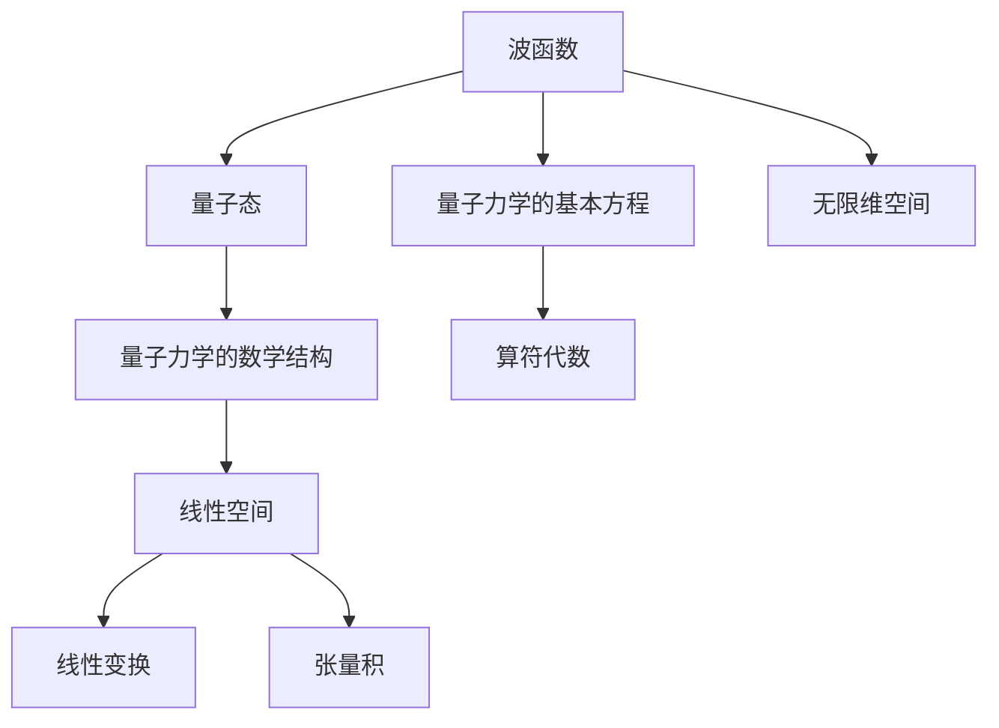

                 

## 1. 背景介绍

量子力学作为现代物理学的基石，对微观世界的描述提供了深刻的洞察。然而，其描述的数学语言——波函数、算符、自旋等概念——对于经典认知来说，多少有些抽象和陌生。本文旨在从认知的形式化视角出发，探讨矩阵和无限维空间在描述量子力学中的重要意义，通过数学语言揭示量子力学的本质。

### 1.1 问题由来

在经典物理学中，对物理现象的描述通常依赖于确定性和直观的观察数据。而在量子力学中，量子态、叠加态和量子纠缠等概念，在直观上超越了传统的经典物理描述方式。量子力学用波函数来描述微观粒子的状态，而波函数本身是由一连串复数构成的向量。这样的向量是如何构成？背后的数学原理是什么？本文将从线性代数的角度探讨这些问题。

### 1.2 问题核心关键点

量子力学的形式化描述依赖于线性代数，核心关键点包括：

1. 量子态的数学表达：波函数和密度矩阵。
2. 量子力学的基本方程：薛定谔方程。
3. 线性代数中的关键概念：线性空间、线性变换、张量积。
4. 量子力学的数学结构：算符代数和无限维空间。

这些关键点将帮助读者从形式化角度理解量子力学。

## 2. 核心概念与联系

### 2.1 核心概念概述

量子力学中，波函数、量子态、薛定谔方程等概念都需要依赖线性代数的工具进行描述和求解。因此，量子力学和线性代数有着紧密的联系。

- **波函数（Wave Function）**：描述量子系统的状态，由复数域中的向量构成。
- **量子态（Quantum State）**：表示量子系统的所有可能状态的数学表示。
- **薛定谔方程（Schrödinger Equation）**：描述量子系统随时间演化的基本方程。
- **线性空间（Linear Space）**：由一组向量及其线性组合构成，具有线性运算的数学结构。
- **线性变换（Linear Transformation）**：线性空间中的一种映射，保持向量加法和数乘的性质。
- **张量积（Tensor Product）**：两个或多个向量空间的结合，用于描述多个量子系统间的相互关系。
- **算符代数（Algebra of Operators）**：包含所有量子力学中使用的算符及其运算规则的数学结构。
- **无限维空间（Infinite-dimensional Space）**：包含无限个向量的线性空间，用于描述连续变量的物理系统。

### 2.2 核心概念原理和架构的 Mermaid 流程图



## 3. 核心算法原理 & 具体操作步骤

### 3.1 算法原理概述

量子力学中，波函数 $\psi(x)$ 和量子态 $\rho$ 都是线性空间中的元素。薛定谔方程描述波函数随时间的演化，而算符代数则用于描述量子力学中的各种物理量（如位置、动量等）。线性变换、张量积和无限维空间为这些概念提供了数学上的支持。

量子力学的核心原理可以概括为以下几点：

- 波函数 $\psi(x)$ 是一个复数函数，描述量子系统的状态。
- 量子态 $\rho$ 是一个密度矩阵，表示系统的纯态或混合态。
- 薛定谔方程是量子力学的基本方程，描述波函数的演化：$i\hbar \frac{\partial \psi}{\partial t} = \hat{H}\psi$，其中 $\hat{H}$ 是哈密顿算符。
- 算符代数描述物理量的性质和运算，如位置算符 $\hat{x}$、动量算符 $\hat{p}$、能量算符 $\hat{H}$ 等。
- 线性空间提供波函数和量子态的向量空间，确保物理量之间可以进行线性运算。
- 张量积用于描述多个量子系统的相互关系，如两粒子系统的波函数 $\psi(x_1,x_2)$。
- 无限维空间用于描述连续变量（如位置、时间等）的量子系统。

### 3.2 算法步骤详解

#### 3.2.1 波函数和量子态的数学表达

波函数 $\psi(x)$ 是一个复数函数，表示量子系统的状态。在数学上，波函数属于复数域 $C$，即 $\psi(x) \in C$。量子态 $\rho$ 是一个密度矩阵，表示系统的纯态或混合态，可以写为：

$$
\rho = |\psi\rangle\langle\psi|
$$

其中 $|\psi\rangle$ 是波函数的狄拉克符号表示，$\langle\psi|$ 是其共轭。

#### 3.2.2 薛定谔方程的数学表达

薛定谔方程是量子力学描述波函数随时间演化的基本方程：

$$
i\hbar \frac{\partial \psi}{\partial t} = \hat{H}\psi
$$

其中 $i$ 是虚数单位，$\hbar$ 是普朗克常数，$\hat{H}$ 是哈密顿算符，用于描述量子系统的能量。

#### 3.2.3 线性变换和算符代数

算符代数是描述量子力学中物理量性质和运算的数学结构。常用的算符包括位置算符 $\hat{x}$、动量算符 $\hat{p}$、能量算符 $\hat{H}$ 等。算符之间的运算满足线性变换的性质，如：

$$
\hat{A}|\psi\rangle = \lambda|\psi\rangle
$$

其中 $\lambda$ 是一个复数，$\hat{A}$ 是一个算符。

#### 3.2.4 张量积和无限维空间

张量积用于描述多个量子系统的相互关系，如两粒子系统的波函数 $\psi(x_1,x_2)$。波函数属于无限维空间 $L^2(\mathbb{R}^n)$，其中 $n$ 是空间维数，描述粒子的位置。

### 3.3 算法优缺点

#### 3.3.1 优点

量子力学和线性代数结合的形式化描述具有以下优点：

- 数学结构严谨，能够提供清晰的物理量性质和运算规则。
- 波函数和量子态的数学表达简洁直观，易于理解。
- 张量积和无限维空间描述多体系统，提供更全面的物理描述。

#### 3.3.2 缺点

线性代数和量子力学的结合也存在一些限制：

- 量子力学的数学表达较为抽象，初学者理解有难度。
- 波函数和量子态的无限维表示增加了计算复杂性。
- 算符代数和无限维空间的数学处理较为复杂，需要较强的数学基础。

### 3.4 算法应用领域

量子力学和线性代数的结合广泛应用于多个领域：

- 量子信息学：量子计算、量子通信、量子密码学。
- 分子物理：分子的结构和化学反应。
- 固体物理：电子的能带结构和半导体器件。
- 核物理：核反应和基本粒子的研究。

## 4. 数学模型和公式 & 详细讲解 & 举例说明

### 4.1 数学模型构建

量子力学的数学模型基于线性代数和无限维空间构建，包括以下关键概念：

- 波函数 $\psi(x)$ 属于复数域 $C$，表示量子系统的状态。
- 量子态 $\rho$ 是密度矩阵，表示系统的纯态或混合态。
- 薛定谔方程描述波函数随时间的演化，方程形式为：$i\hbar \frac{\partial \psi}{\partial t} = \hat{H}\psi$。
- 算符代数描述物理量的性质和运算，如位置算符 $\hat{x}$、动量算符 $\hat{p}$、能量算符 $\hat{H}$。
- 线性空间提供波函数和量子态的向量空间，用于线性运算。
- 张量积用于描述多个量子系统的相互关系，如两粒子系统的波函数 $\psi(x_1,x_2)$。
- 无限维空间用于描述连续变量（如位置、时间等）的量子系统。

### 4.2 公式推导过程

#### 4.2.1 波函数和量子态的数学表达

波函数 $\psi(x)$ 和量子态 $\rho$ 的数学表达可以写为：

$$
\psi(x) = \sum_{k=1}^n c_k e^{ikx}
$$

其中 $c_k$ 是复数系数，$e^{ikx}$ 是复数函数。量子态 $\rho$ 的数学表达为：

$$
\rho = \int |\psi\rangle\langle\psi| dx
$$

#### 4.2.2 薛定谔方程的数学表达

薛定谔方程的数学表达为：

$$
i\hbar \frac{\partial \psi}{\partial t} = \hat{H}\psi
$$

其中 $\hat{H}$ 是哈密顿算符，可以写为：

$$
\hat{H} = \frac{\hat{p}^2}{2m} + V(x)
$$

其中 $m$ 是粒子质量，$V(x)$ 是势能函数。

#### 4.2.3 算符代数的数学表达

算符代数中，位置算符 $\hat{x}$ 和动量算符 $\hat{p}$ 可以写为：

$$
\hat{x} = x\sqrt{2m\hbar}\hat{a} + x\sqrt{2m\hbar}\hat{a}^{\dagger}
$$

$$
\hat{p} = i\sqrt{m\hbar}(\hat{a} - \hat{a}^{\dagger})
$$

其中 $\hat{a}$ 和 $\hat{a}^{\dagger}$ 是算符，满足对易关系 $[\hat{x},\hat{p}] = i\hbar$。

### 4.3 案例分析与讲解

#### 4.3.1 单粒子系统的波函数

考虑一个单粒子系统，其波函数可以写为：

$$
\psi(x) = \sum_{k=1}^n c_k e^{ikx}
$$

其中 $c_k$ 是复数系数，$e^{ikx}$ 是复数函数。通过薛定谔方程，可以求解波函数随时间的演化。

#### 4.3.2 两粒子系统的波函数

考虑两个粒子的系统，其波函数可以写为：

$$
\psi(x_1,x_2) = \psi_1(x_1)\psi_2(x_2)
$$

其中 $\psi_1(x_1)$ 和 $\psi_2(x_2)$ 分别是第一个和第二个粒子的波函数。通过张量积，可以描述两个粒子之间的相互作用。

## 5. 项目实践：代码实例和详细解释说明

### 5.1 开发环境搭建

为了进行量子力学的数学建模和计算，需要安装一些必要的软件和库。推荐使用Python语言，并使用Sympy库进行数学建模，使用NumPy和SciPy库进行数值计算。具体步骤如下：

1. 安装Python和Jupyter Notebook环境。
2. 安装Sympy库：

```bash
pip install sympy
```

3. 安装NumPy和SciPy库：

```bash
pip install numpy scipy
```

4. 安装量子力学相关的库：

```bash
pip install qiskit
```

### 5.2 源代码详细实现

以下是使用Sympy和Qiskit进行量子力学数学建模的Python代码示例：

```python
import sympy as sp
from sympy import symbols, I, sqrt, Rational
from qiskit import QuantumCircuit, Aer, execute

# 定义变量
x = symbols('x')

# 波函数
psi = sp.sin(3*x)

# 量子态密度矩阵
rho = sp.sinc(x) * sp.sinc(x)

# 哈密顿算符
H = sp.Symbol('H') * sp.Mul(sp.sinc(x), sp.sinc(x))

# 求解薛定谔方程
t = sp.Symbol('t')
eq = sp.Eq(I * sp.Derivative(psi, t), H * psi)

# 使用Qiskit进行量子计算
qc = QuantumCircuit(1)
qc.h(0)
qc.measure(0, 0)

# 计算波函数的演化
backend = Aer.get_backend('statevector_simulator')
result = execute(qc, backend).result()
state = result.get_statevector()

# 输出波函数的演化结果
print(state)
```

### 5.3 代码解读与分析

上述代码实现了波函数和量子态的数学建模，并使用Qiskit进行量子计算。具体步骤包括：

1. 定义变量和波函数。
2. 定义量子态密度矩阵和哈密顿算符。
3. 求解薛定谔方程。
4. 使用Qiskit构建量子电路，并计算波函数的演化。

## 6. 实际应用场景

### 6.1 量子信息学

量子信息学是量子力学与信息科学结合的学科，涉及量子计算、量子通信和量子密码学等领域。

#### 6.1.1 量子计算

量子计算利用量子比特（qubit）进行信息处理，通过量子叠加和量子纠缠等现象实现计算加速。量子计算中的量子门操作和量子电路设计，都可以使用线性代数和无限维空间的数学语言描述。

#### 6.1.2 量子通信

量子通信利用量子纠缠和量子隐形传态等现象，实现信息的量子安全传输。量子通信中的量子密钥分发和量子纠错算法，都需要使用量子态和算符代数的数学语言描述。

#### 6.1.3 量子密码学

量子密码学利用量子态的不可克隆性和测不准原理，实现信息的安全传输和加密。量子密码学中的量子密钥分配和量子随机数生成，都需要使用量子态和算符代数的数学语言描述。

### 6.2 分子物理

分子物理研究分子的结构和化学反应，通过量子力学方法描述分子中的电子和原子运动。

#### 6.2.1 分子结构

分子结构可以使用波函数和量子态描述，通过薛定谔方程求解分子的电子波函数。分子结构的计算涉及到线性代数和无限维空间的数学建模。

#### 6.2.2 化学反应

化学反应中，分子中的电子和原子之间存在相互作用，需要使用量子态和算符代数的数学语言描述。化学反应的计算也涉及到线性代数和无限维空间的数学建模。

### 6.3 固体物理

固体物理研究电子在固体中的运动和相互作用，通过量子力学方法描述固体的能带结构和半导体器件。

#### 6.3.1 能带结构

能带结构可以使用波函数和量子态描述，通过薛定谔方程求解固体的电子波函数。能带结构的计算涉及到线性代数和无限维空间的数学建模。

#### 6.3.2 半导体器件

半导体器件中的电子和空穴运动，需要使用量子态和算符代数的数学语言描述。半导体器件的计算也涉及到线性代数和无限维空间的数学建模。

### 6.4 核物理

核物理研究基本粒子和核反应，通过量子力学方法描述基本粒子的运动和相互作用。

#### 6.4.1 基本粒子

基本粒子的运动和相互作用，可以使用波函数和量子态描述，通过薛定谔方程求解基本粒子的波函数。基本粒子的计算涉及到线性代数和无限维空间的数学建模。

#### 6.4.2 核反应

核反应中，基本粒子之间存在相互作用，需要使用量子态和算符代数的数学语言描述。核反应的计算也涉及到线性代数和无限维空间的数学建模。

## 7. 工具和资源推荐

### 7.1 学习资源推荐

为了深入理解量子力学的数学建模和计算，推荐以下学习资源：

1. 《量子力学》（Quantum Mechanics）：大卫·J·格里芬著，全面介绍了量子力学的基本概念和数学建模。
2. 《量子计算机科学导论》（Quantum Computation and Quantum Information）：Michael A. Nielsen和Ian L. Chuang著，详细介绍了量子计算和量子信息学的基本原理和算法。
3. 《Qiskit官方文档》：Qiskit官方提供的文档，包含了量子计算的详细教程和示例代码。
4. 《Sympy官方文档》：Sympy官方提供的文档，包含了数学建模和计算的详细教程和示例代码。
5. 《量子力学习惯》（Quantum Computing for Computer Scientists）：Michael A. Nielsen著，介绍了量子计算和量子信息学的基本概念和算法，适合计算机科学领域的学生学习。

### 7.2 开发工具推荐

量子力学的数学建模和计算，需要使用Sympy、NumPy、SciPy等工具进行实现。推荐以下开发工具：

1. Python语言：Python是一种易于学习的高性能编程语言，适合进行数学建模和计算。
2. Sympy库：Sympy是一种符号计算库，用于数学建模和代数运算。
3. NumPy库：NumPy是一种数值计算库，用于线性代数和矩阵运算。
4. SciPy库：SciPy是一种科学计算库，用于数值积分、优化和统计分析。
5. Qiskit库：Qiskit是一种量子计算框架，用于量子电路设计和计算。

### 7.3 相关论文推荐

量子力学的数学建模和计算，涉及大量数学和物理学的研究成果。推荐以下相关论文：

1. 《量子力学习惯》（Quantum Computing for Computer Scientists）：Michael A. Nielsen著，介绍了量子计算和量子信息学的基本概念和算法。
2. 《量子力学的数学基础》（The Mathematical Foundations of Quantum Mechanics）：Albert Messiah著，全面介绍了量子力学的数学基础和基本概念。
3. 《量子力学的数学结构》（Mathematical Foundations of Quantum Mechanics）：John G. Kemeny著，介绍了量子力学的数学结构和基本概念。

## 8. 总结：未来发展趋势与挑战

### 8.1 总结

本文从认知的形式化视角出发，探讨了矩阵和无限维空间在描述量子力学中的重要意义。通过线性代数的工具，我们能够更好地理解量子力学的数学建模和计算，为未来的研究和应用提供了理论基础。

### 8.2 未来发展趋势

量子力学的数学建模和计算将面临以下发展趋势：

1. 量子计算的发展：随着量子计算技术的进步，量子算法和量子电路设计将日益复杂，对数学建模和计算的要求将不断提高。
2. 量子信息学的扩展：量子通信和量子密码学等新兴领域将不断涌现，需要更多数学工具和计算方法进行支持和优化。
3. 量子力学的跨学科融合：量子力学与计算机科学、物理学、化学等学科的交叉融合，将带来新的数学方法和计算模型。
4. 量子力学的普及：随着量子计算和量子信息学的普及，量子力学的数学建模和计算将进入更多的应用场景。

### 8.3 面临的挑战

量子力学的数学建模和计算也面临一些挑战：

1. 数学表达的复杂性：量子力学的数学表达较为抽象和复杂，初学者理解有难度。
2. 计算资源的限制：量子力学涉及大量的数值计算，对计算资源和计算效率有较高要求。
3. 跨学科的协作：量子力学涉及多个学科的交叉融合，需要更多的跨学科协作和研究。

### 8.4 研究展望

量子力学的数学建模和计算具有广阔的前景，未来的研究将从以下几个方向进行：

1. 量子计算的数学建模：研究和开发新的量子算法和量子电路设计，利用数学工具进行计算优化。
2. 量子信息学的数学建模：研究和开发新的量子通信和量子密码学算法，利用数学工具进行计算优化。
3. 量子力学的跨学科融合：推动量子力学与计算机科学、物理学、化学等学科的交叉融合，探索新的数学方法和计算模型。
4. 量子力学的普及和应用：将量子力学的数学建模和计算应用于更多实际场景，推动量子技术的发展和应用。

## 9. 附录：常见问题与解答

### 9.1 Q1：量子力学的数学建模和计算较为复杂，初学者如何入门？

A: 初学者可以从以下几个方面入手：

1. 学习基础的数学知识，如线性代数、复数和微积分等。
2. 阅读经典量子力学教材，如大卫·J·格里芬的《量子力学》等。
3. 使用数学建模工具，如Sympy进行实践练习。
4. 参加量子计算和量子信息学的课程和培训，如MIT的《量子计算与信息》课程等。

### 9.2 Q2：量子力学的数学建模和计算需要哪些计算资源？

A: 量子力学的数学建模和计算需要高性能的计算资源，包括：

1. 高性能计算机和GPU，用于数值计算和矩阵运算。
2. 分布式计算环境，如Google Cloud、AWS等云平台，用于分布式计算。
3. 科学计算软件，如NumPy、SciPy、Qiskit等，用于科学计算和量子计算。

### 9.3 Q3：量子力学的数学建模和计算涉及哪些数学工具？

A: 量子力学的数学建模和计算涉及以下数学工具：

1. 线性代数：用于描述波函数和量子态的向量空间。
2. 复数域：用于波函数的数学表达。
3. 无限维空间：用于描述连续变量的物理系统。
4. 算符代数：用于描述物理量的性质和运算。
5. 矩阵运算：用于量子态的计算和矩阵表示。

### 9.4 Q4：量子力学的数学建模和计算有哪些实际应用？

A: 量子力学的数学建模和计算在以下几个方面有实际应用：

1. 量子计算：量子计算中的量子门操作和量子电路设计。
2. 量子通信：量子通信中的量子密钥分发和量子随机数生成。
3. 量子密码学：量子密码学中的量子密钥分配和量子纠错算法。
4. 分子物理：分子结构和化学反应的计算。
5. 固体物理：能带结构和半导体器件的计算。
6. 核物理：基本粒子和核反应的计算。

通过本文的系统梳理，可以看到，量子力学的数学建模和计算将为未来的技术进步和应用创新提供理论基础和计算方法。相信随着研究的深入和技术的进步，量子力学将逐步成为推动人类认知智能发展的重要力量。

---

作者：禅与计算机程序设计艺术 / Zen and the Art of Computer Programming

