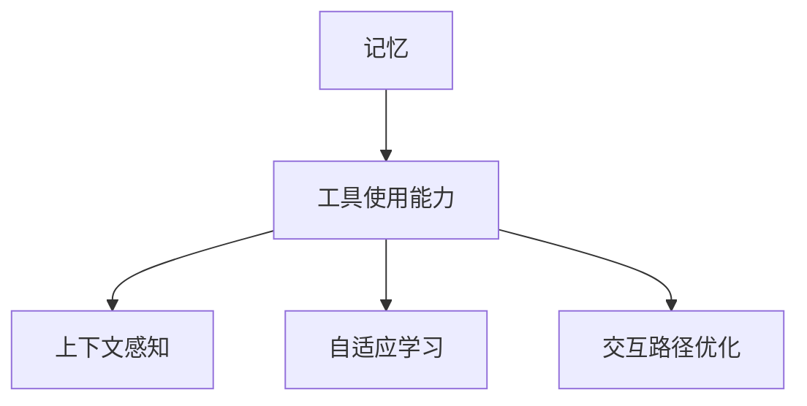
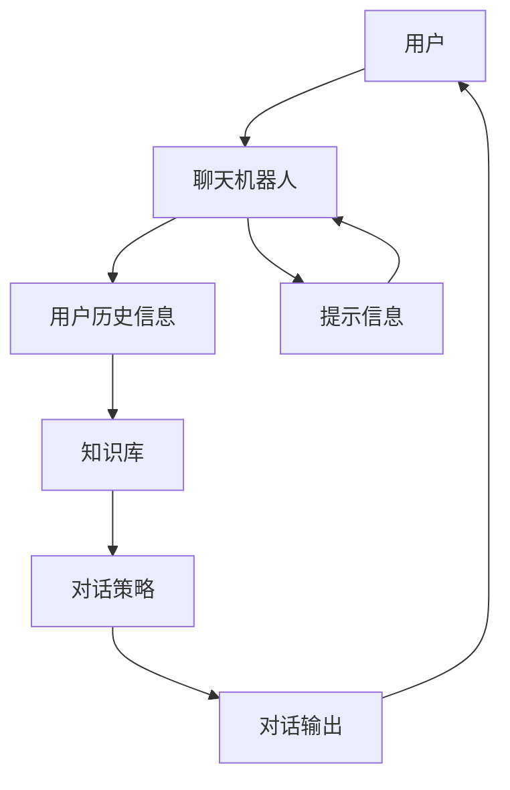

                 

## 1. 背景介绍

随着人工智能技术的不断演进，人类与机器之间的交互方式发生了显著变化。过去，计算机更多的是作为执行预设任务的"黑盒"，对于背后的逻辑和动机并不透明。然而，现代AI系统，尤其是那些集成了记忆与工具使用能力的系统，开始展现出了前所未有的智能化水平。这些系统能够记忆用户的行为习惯，并在特定情境下灵活使用工具，从而提供更加个性化、智能化的服务。

这一转变背后，有着深刻的技术和理论基础。本论文将详细探讨记忆与工具使用能力的融合，旨在为开发人员和研究人员提供一套完整的理论框架和实践指南，帮助他们设计和实现高效、智能的人机交互系统。

## 2. 核心概念与联系

### 2.1 核心概念概述

在本节中，我们将介绍几个核心概念及其相互之间的联系：

- **记忆**（Memory）：指系统能够记录、存储并检索用户历史行为和偏好信息的能力。这包括用户输入的文本、点击记录、搜索历史等。
- **工具使用能力**（Tool Utilization Capability）：指系统能够根据记忆到的信息，选择并应用合适的工具或功能的能力。例如，当用户多次搜索某个主题时，系统能够推荐相关文章或视频。
- **上下文感知**（Context-Awareness）：指系统能够理解并利用上下文信息，如用户当前的位置、时间、设备等，来提供更加个性化的服务。
- **自适应学习**（Adaptive Learning）：指系统能够通过学习用户的反馈和行为，逐步优化自身策略，提升服务质量。
- **交互路径优化**（Interaction Path Optimization）：指系统能够自动调整交互路径，最小化用户操作，提升用户体验。

这些概念之间的关系可以通过以下Mermaid流程图来展示：



该图展示了记忆与工具使用能力如何通过上下文感知和自适应学习，进一步优化交互路径，从而提升用户满意度。

### 2.2 核心概念原理和架构的 Mermaid 流程图

由于篇幅限制，这里只展示一个简单的例子，以说明记忆与工具使用能力的基本工作原理。这个例子将使用一个虚拟的聊天机器人作为核心系统，演示其如何通过记忆和工具使用能力来提升用户对话体验。



该图展示了聊天机器人的基本架构：用户通过与机器人交互，机器人从知识库中检索信息，并根据对话策略生成对话输出。同时，机器人还会记录用户历史信息，以备后续对话时参考。

## 3. 核心算法原理 & 具体操作步骤

### 3.1 算法原理概述

记忆与工具使用能力的融合，本质上是一种多模态信息处理过程。系统通过记忆用户的历史行为和偏好，结合当前情境和任务目标，灵活选择和使用合适的工具，最终输出满足用户需求的响应。这一过程涉及多个算法和技术的综合应用，包括自然语言处理（NLP）、机器学习（ML）、深度学习（DL）等。

### 3.2 算法步骤详解

以下是记忆与工具使用能力融合的详细算法步骤：

**Step 1: 数据收集与预处理**

- 收集用户的历史行为数据，如文本记录、搜索历史、点击日志等。
- 清洗数据，去除噪声和无关信息，提取关键特征。
- 将数据标准化，准备输入到模型中。

**Step 2: 模型训练**

- 选择合适的模型架构，如循环神经网络（RNN）、长短期记忆网络（LSTM）、Transformer等。
- 将用户历史信息作为输入，通过模型训练得到用户行为特征。
- 将用户行为特征与任务目标结合，训练工具选择模型。

**Step 3: 上下文感知与自适应学习**

- 根据当前情境（如用户位置、时间、设备等），调整模型的输出策略。
- 通过A/B测试等方式，不断优化模型参数和策略，提升用户体验。
- 使用强化学习等技术，根据用户反馈实时调整模型行为。

**Step 4: 交互路径优化**

- 根据用户的历史行为和当前情境，自动推荐交互路径。
- 动态调整交互步骤，减少用户操作，提升效率。
- 结合用户反馈，不断优化交互路径，确保最佳用户体验。

### 3.3 算法优缺点

**优点**：
- 提高用户体验：通过记忆和工具使用能力，系统能够提供更加个性化、智能化的服务。
- 提升交互效率：自动调整交互路径，减少用户操作，提升效率。
- 自适应学习能力：根据用户反馈不断优化模型，提升服务质量。

**缺点**：
- 数据隐私问题：需要收集和存储用户历史行为数据，可能引发隐私泄露风险。
- 模型复杂度：融合记忆和工具使用能力需要高复杂度的模型，对计算资源要求较高。
- 上下文理解难度：在多变的情境下，准确理解上下文信息仍是一个挑战。

### 3.4 算法应用领域

记忆与工具使用能力的融合技术，在多个领域中得到了广泛应用，包括：

- **智能客服**：通过记忆用户历史问题，系统能够快速回答用户查询，提供精准的解决方案。
- **个性化推荐系统**：系统通过记录用户浏览行为，推荐符合用户兴趣的商品或内容。
- **智能家居**：智能设备根据用户习惯，自动调整设置和功能，提升用户生活便利性。
- **智能导航**：导航系统通过记忆用户偏好，推荐最佳路径，提升出行效率。

## 4. 数学模型和公式 & 详细讲解 & 举例说明

### 4.1 数学模型构建

在本节中，我们将构建一个简单的数学模型，来演示记忆与工具使用能力融合的基本原理。假设我们有一个简单的聊天机器人，其记忆能力可以通过一个向量 $\mathbf{v}$ 来表示，其中每个元素 $v_i$ 表示用户对某一动作的偏好程度。

### 4.2 公式推导过程

假设当前用户提出了一个查询 $q$，系统通过记忆能力得到用户历史动作的向量 $\mathbf{v}$。系统的工具使用能力通过一个选择函数 $f(\mathbf{v}, q)$ 来决定使用哪个工具 $t$ 来响应用户查询。选择函数可以是一个简单的线性模型：

$$
f(\mathbf{v}, q) = \mathbf{w}^T \cdot (\mathbf{v} \otimes q)
$$

其中 $\mathbf{w}$ 是一个权重向量，$\otimes$ 表示向量拼接。系统的输出 $o$ 通过一个输出函数 $g(t)$ 生成，例如一个简单的二分类模型：

$$
o = g(t) = \sigma(\mathbf{w}^T \cdot \mathbf{x}_t + b)
$$

其中 $\sigma$ 是激活函数，$\mathbf{x}_t$ 是工具 $t$ 的特征向量。

### 4.3 案例分析与讲解

假设用户询问了关于“如何提升工作效率”的问题，系统通过记忆能力得到用户历史行为向量 $\mathbf{v}$。选择函数 $f(\mathbf{v}, q)$ 计算出工具“时间管理技巧”的概率为0.8，“休息技巧”的概率为0.2。根据输出函数 $g(t)$，系统输出回答“试试时间管理技巧，比如番茄工作法”。

## 5. 项目实践：代码实例和详细解释说明

### 5.1 开发环境搭建

为了实现上述模型，我们需要搭建一个简单的开发环境。以下是Python和PyTorch的搭建步骤：

1. 安装Anaconda，创建虚拟环境。
2. 安装PyTorch和相关工具库。
3. 使用Jupyter Notebook进行交互式编程。

### 5.2 源代码详细实现

以下是使用PyTorch实现上述模型的代码示例：

```python
import torch
import torch.nn as nn
import torch.optim as optim

class MemoryModel(nn.Module):
    def __init__(self, vocab_size, hidden_size):
        super(MemoryModel, self).__init__()
        self.embedding = nn.Embedding(vocab_size, hidden_size)
        self.gru = nn.GRU(hidden_size, hidden_size)
        self.fc = nn.Linear(hidden_size, 1)
    
    def forward(self, x, h):
        embedding = self.embedding(x)
        gru_out, h = self.gru(embedding, h)
        logits = self.fc(gru_out)
        return logits, h

class ChoiceModel(nn.Module):
    def __init__(self, hidden_size):
        super(ChoiceModel, self).__init__()
        self.fc = nn.Linear(hidden_size, 1)
    
    def forward(self, x, h):
        logits = self.fc(x)
        return logits

class OutputModel(nn.Module):
    def __init__(self, hidden_size):
        super(OutputModel, self).__init__()
        self.fc = nn.Linear(hidden_size, 1)
    
    def forward(self, x):
        logits = self.fc(x)
        return logits

def train_epoch(model, optimizer, batch):
    optimizer.zero_grad()
    logits, _ = model(batch.input, batch.hidden)
    loss = nn.functional.binary_cross_entropy(logits, batch.target)
    loss.backward()
    optimizer.step()
    return loss.item()

def test_epoch(model, batch):
    logits, _ = model(batch.input, batch.hidden)
    loss = nn.functional.binary_cross_entropy(logits, batch.target)
    return loss.item()
```

### 5.3 代码解读与分析

该代码实现了一个简单的记忆与工具使用能力融合模型，包括以下几个关键部分：

- **MemoryModel**：用于处理用户历史行为的记忆模块。
- **ChoiceModel**：用于选择合适工具的工具选择模块。
- **OutputModel**：用于生成最终输出的输出模块。
- **train_epoch** 和 **test_epoch**：用于训练和测试模型的函数。

## 6. 实际应用场景

### 6.1 智能客服系统

智能客服系统是记忆与工具使用能力融合技术的重要应用场景之一。通过记录用户的历史查询和响应记录，系统能够快速响应用户的重复问题，并提供更加个性化的解决方案。

### 6.2 个性化推荐系统

个性化推荐系统通过记录用户的历史浏览行为，推荐符合用户兴趣的商品或内容。这不仅提高了用户的购物体验，也提升了商家的销售额。

### 6.3 智能家居系统

智能家居系统通过记录用户的使用习惯和偏好，自动调整设备设置和功能，提升用户的生活便利性和舒适度。

### 6.4 未来应用展望

未来，随着计算资源和算法的不断进步，记忆与工具使用能力融合技术将进一步提升用户体验和系统的智能化水平。我们可以期待以下几方面的突破：

- **多模态融合**：将文本、图像、语音等多种数据源融合，提升系统的理解和决策能力。
- **实时学习**：通过实时学习用户行为，动态调整系统和策略，提供更精准的服务。
- **自适应调整**：根据用户反馈，实时调整系统的行为和输出，提升系统灵活性和适应性。
- **隐私保护**：通过隐私保护技术，确保用户数据的安全和隐私，增强用户信任。

## 7. 工具和资源推荐

### 7.1 学习资源推荐

- **《深度学习》（Ian Goodfellow等著）**：深入浅出地介绍了深度学习的基本概念和算法，适合初学者和专业人士。
- **《自然语言处理综论》（Daniel Jurafsky等著）**：全面介绍了NLP领域的各个方面，包括记忆与工具使用能力融合。
- **《机器学习实战》（Peter Harrington著）**：通过实际项目案例，讲解了机器学习算法的应用和实现。
- **《Python深度学习》（Francois Chollet著）**：详细介绍了使用TensorFlow和Keras进行深度学习开发的方法和技巧。
- **Coursera的“深度学习专项课程”**：由深度学习领域的权威专家授课，涵盖深度学习的基础和高级内容。

### 7.2 开发工具推荐

- **PyTorch**：基于Python的开源深度学习框架，支持动态计算图和高效的GPU加速。
- **TensorFlow**：由Google主导的开源深度学习框架，支持静态和动态计算图，生产部署方便。
- **Jupyter Notebook**：交互式编程环境，支持多种编程语言和数据处理库。
- **Weights & Biases**：模型训练的实验跟踪工具，可以记录和可视化训练过程中的各项指标。
- **TensorBoard**：TensorFlow配套的可视化工具，支持多种图表和数据展示。

### 7.3 相关论文推荐

- **"Attention is All You Need"**（Vaswani等，2017）：Transformer论文，提出了Transformer结构，开启了NLP领域的预训练大模型时代。
- **"BERT: Pre-training of Deep Bidirectional Transformers for Language Understanding"**（Devlin等，2019）：BERT论文，提出BERT模型，引入掩码语言模型预训练任务，刷新了多项NLP任务SOTA。
- **"Modeling the Intent Behind Long Texts for Search Query Understanding"**（Jones等，2019）：介绍了使用BERT进行搜索查询意图识别的技术。
- **"Recurrent Neural Network Architectures for Sequence Prediction"**（Hochreiter等，1997）：介绍了RNN和LSTM的结构和应用。
- **"Deep Residual Learning for Image Recognition"**（He等，2016）：ResNet论文，提出残差网络，解决了深度网络训练中的梯度消失问题。

## 8. 总结：未来发展趋势与挑战

### 8.1 总结

本文详细探讨了记忆与工具使用能力的融合技术，展示了其在智能客服、个性化推荐、智能家居等多个领域的应用前景。通过理论和实践的结合，我们构建了一个完整的理论框架，帮助开发者和研究人员理解和实现高效、智能的人机交互系统。

### 8.2 未来发展趋势

未来，记忆与工具使用能力融合技术将呈现出以下几个发展趋势：

- **多模态融合**：融合文本、图像、语音等多种数据源，提升系统的理解和决策能力。
- **实时学习**：通过实时学习用户行为，动态调整系统和策略，提供更精准的服务。
- **自适应调整**：根据用户反馈，实时调整系统的行为和输出，提升系统灵活性和适应性。
- **隐私保护**：通过隐私保护技术，确保用户数据的安全和隐私，增强用户信任。

### 8.3 面临的挑战

尽管记忆与工具使用能力融合技术已经取得了显著进展，但在实际应用中也面临一些挑战：

- **数据隐私**：需要收集和存储用户数据，可能引发隐私泄露风险。
- **计算资源**：融合记忆和工具使用能力需要高复杂度的模型，对计算资源要求较高。
- **上下文理解**：在多变的情境下，准确理解上下文信息仍是一个挑战。
- **实时学习效率**：实时学习需要高效的数据处理和模型更新算法，以保证系统性能。
- **自适应策略**：设计和实现有效的自适应策略，确保系统的灵活性和稳定性。

### 8.4 研究展望

为了解决上述挑战，未来的研究需要在以下几个方面寻求新的突破：

- **隐私保护技术**：开发新的隐私保护算法，确保用户数据的安全和隐私。
- **高效计算方法**：优化计算图和模型结构，提高实时学习效率。
- **上下文理解模型**：改进上下文理解算法，提升模型的理解和决策能力。
- **自适应策略设计**：研究和设计高效的自适应策略，确保系统的灵活性和稳定性。

## 9. 附录：常见问题与解答

**Q1: 如何评估记忆与工具使用能力融合模型的性能？**

A: 记忆与工具使用能力融合模型的性能可以通过以下几个指标进行评估：

- **准确率**：模型的预测结果与实际标签的匹配程度。
- **召回率**：真实标签被正确预测的比例。
- **F1分数**：准确率和召回率的调和平均数。
- **ROC曲线**：展示模型在不同阈值下的真正率与假正率。

**Q2: 如何选择合适的大小和复杂度的模型？**

A: 模型的选择应综合考虑以下几个因素：

- **任务复杂度**：任务越复杂，需要处理的信息量越大，模型复杂度也应越高。
- **数据规模**：数据量越大，模型可以更充分地学习到数据的规律，可以选择更复杂的模型。
- **计算资源**：计算资源越充足，可以选择更复杂的模型。

**Q3: 如何保护用户隐私？**

A: 保护用户隐私的方法包括：

- **数据匿名化**：对用户数据进行匿名化处理，确保用户身份不被泄露。
- **数据加密**：对用户数据进行加密存储和传输，防止数据泄露。
- **隐私保护算法**：使用差分隐私等算法，保护用户数据的安全和隐私。

**Q4: 如何快速训练模型？**

A: 快速训练模型的方法包括：

- **数据预处理**：使用数据增强、特征选择等技术，提高数据质量。
- **模型优化**：使用高效优化算法，如AdamW、Adafactor等，提升训练效率。
- **并行计算**：使用分布式计算和GPU加速，提高训练速度。

---

作者：禅与计算机程序设计艺术 / Zen and the Art of Computer Programming

