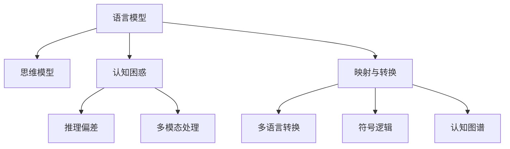

                 

# 语言与思维的区别：大模型的认知困惑

## 1. 背景介绍

### 1.1 问题由来

在人工智能（AI）领域，语言模型与思维模型的研究一直是热门话题。随着深度学习和大模型的不断演进，语言模型（Language Model, LM）在自然语言处理（Natural Language Processing, NLP）中的应用越来越广泛。无论是预训练语言模型（Pre-trained Language Model, PLM）如BERT、GPT、T5，还是基于语言模型的微调（Fine-tuning）方法，都在各类NLP任务中取得了显著的成果。

然而，在这些语言模型和微调技术背后，隐藏着一个重要的认知鸿沟：语言模型与思维模型的区别。这一区别不仅涉及技术层面，更触及了认知科学和人工智能哲学的核心问题。本文将深入探讨这一区别，并分析大语言模型在认知层面的困惑和挑战。

### 1.2 问题核心关键点

理解语言与思维的区别，对于构建高效、智能的语言模型至关重要。具体来说，这一核心关键点包括：

- **语言与思维的起源和本质**：语言是思维的工具，还是思维的表达？语言模型能否完全模拟人类的思维过程？
- **语言模型与思维模型的差异**：语言模型的推理机制与人类思维的逻辑是否相同？如何衡量语言模型的智能水平？
- **大模型的认知困惑**：在实际应用中，大语言模型面临哪些认知上的挑战？如何克服这些挑战？

## 2. 核心概念与联系

### 2.1 核心概念概述

为了深入探讨语言与思维的区别，本节将介绍几个相关核心概念：

- **语言模型**：指通过学习语言数据，能够预测文本序列的概率分布的模型。语言模型能够生成自然流畅的文本，但无法像人类一样进行深入的逻辑推理和批判性思维。

- **思维模型**：指模拟人类思维过程的模型，能够进行逻辑推理、问题解决、抽象思维等复杂认知活动。思维模型通常采用符号逻辑、认知图谱等方法，与语言模型有所不同。

- **语言与思维的映射**：指将语言模型生成的文本转化为认知模型，或者将认知模型的推理结果转化为自然语言的过程。这一过程需要克服语言与思维之间的鸿沟，实现更为精确的映射。

- **认知困惑**：指在大语言模型应用于复杂认知任务时，模型推理过程与人类认知逻辑之间的差异和困惑。认知困惑包括推理逻辑的偏差、对多模态数据的处理等。

这些概念之间的逻辑关系可以通过以下Mermaid流程图来展示：



这个流程图展示了语言模型与思维模型之间的联系和差异，以及认知困惑的具体表现形式。

## 3. 核心算法原理 & 具体操作步骤
### 3.1 算法原理概述

大语言模型基于深度神经网络，通过大量无标签文本数据进行预训练，学习到语言的分布规律和语义知识。在微调过程中，通过有标签数据，对模型进行任务特定的优化，使其能够完成特定的NLP任务。

然而，大语言模型的认知过程与人类思维存在根本差异。语言模型依赖于概率统计，通过最大化似然来生成文本，缺乏主动推理和逻辑判断能力。而思维模型则依赖于符号逻辑和规则，能够进行更复杂的认知活动。

### 3.2 算法步骤详解

基于大语言模型的认知困惑，可以将其微调过程分为以下几个关键步骤：

**Step 1: 准备预训练模型和数据集**
- 选择合适的预训练语言模型，如BERT、GPT等。
- 收集下游任务的数据集，包括训练集、验证集和测试集。

**Step 2: 添加任务适配层**
- 设计合适的任务适配层，如分类器、解码器等。
- 选择适合的损失函数，如交叉熵、均方误差等。

**Step 3: 设置微调超参数**
- 选择合适的优化算法及其参数，如AdamW、SGD等。
- 设置学习率、批大小、迭代轮数等超参数。

**Step 4: 执行梯度训练**
- 将训练集数据分批次输入模型，前向传播计算损失函数。
- 反向传播计算参数梯度，根据设定的优化算法和学习率更新模型参数。
- 周期性在验证集上评估模型性能，根据性能指标决定是否触发Early Stopping。
- 重复上述步骤直至满足预设的迭代轮数或Early Stopping条件。

**Step 5: 测试和部署**
- 在测试集上评估微调后模型，对比微调前后的精度提升。
- 使用微调后的模型对新样本进行推理预测，集成到实际的应用系统中。

### 3.3 算法优缺点

大语言模型微调具有以下优点：

1. **高效性**：仅需要少量标注数据，即可快速优化模型性能。
2. **通用性**：适用于各种NLP任务，如分类、匹配、生成等。
3. **可扩展性**：可以通过预训练模型进行任务微调，快速适应新任务。

同时，也存在一些局限：

1. **认知偏差**：模型可能继承预训练数据中的偏见和错误信息。
2. **推理能力不足**：缺乏主动推理和逻辑判断能力。
3. **数据依赖**：微调效果很大程度上依赖于标注数据的质量和数量。
4. **计算成本高**：需要大量的计算资源进行预训练和微调。

### 3.4 算法应用领域

大语言模型微调在多个领域得到广泛应用，包括但不限于：

- **智能客服**：构建7x24小时不间断的智能客服系统，快速响应客户咨询。
- **金融舆情监测**：实时监测金融市场舆论动向，规避金融风险。
- **个性化推荐**：根据用户行为和兴趣，提供精准、多样化的推荐内容。
- **问答系统**：自动回答用户问题，如智能助理、知识图谱等。

## 4. 数学模型和公式 & 详细讲解 & 举例说明

### 4.1 数学模型构建

大语言模型的数学模型通常基于概率图模型（Probabilistic Graphical Model, PG）或神经网络模型（Neural Network Model, NN）。

以神经网络模型为例，假设输入为 $x$，输出为 $y$，模型参数为 $\theta$，则模型的预测概率为：

$$
p(y|x,\theta) = \sigma(Wx + b)
$$

其中 $W$ 和 $b$ 为模型的权重和偏置，$\sigma$ 为激活函数。

在微调过程中，目标是最小化经验风险：

$$
\mathcal{L}(\theta) = -\frac{1}{N}\sum_{i=1}^N \log p(y_i|x_i,\theta)
$$

### 4.2 公式推导过程

以分类任务为例，假设模型输出为 $y_{pred}$，真实标签为 $y_{true}$，则交叉熵损失函数为：

$$
\mathcal{L}(\theta) = -\frac{1}{N}\sum_{i=1}^N \log \frac{e^{y_{pred} \cdot \log p(y_{pred}|x_i,\theta)}}{\sum_j e^{y_j \cdot \log p(y_j|x_i,\theta)}}
$$

推导过程如下：

1. 定义对数似然函数：

$$
\log p(y|x,\theta) = y \log p(y|x,\theta) + (1-y) \log (1-p(y|x,\theta))
$$

2. 将对数似然函数代入经验风险公式：

$$
\mathcal{L}(\theta) = -\frac{1}{N}\sum_{i=1}^N \log \frac{p(y_i|x_i,\theta)}{1-p(y_i|x_i,\theta)}
$$

3. 使用softmax函数进行概率归一化：

$$
\log p(y_i|x_i,\theta) = y_i \log p(y_i|x_i,\theta) + (1-y_i) \log (1-p(y_i|x_i,\theta))
$$

4. 结合softmax函数和交叉熵公式，得到最终的交叉熵损失函数。

### 4.3 案例分析与讲解

以BERT模型为例，其微调过程如下：

1. 将文本数据转换为BERT模型的输入格式。
2. 使用BERT模型进行特征提取，得到上下文向量。
3. 设计合适的任务适配层，如分类器。
4. 选择适合的损失函数，如交叉熵。
5. 使用AdamW优化器进行梯度训练。
6. 在验证集上评估模型性能，进行早停。
7. 在测试集上评估最终模型。

## 5. 项目实践：代码实例和详细解释说明
### 5.1 开发环境搭建

在进行微调实践前，需要准备Python开发环境，具体步骤如下：

1. 安装Anaconda，创建一个新的虚拟环境。
2. 安装PyTorch、Transformers等深度学习库。
3. 安装必要的依赖包，如Numpy、Pandas、Scikit-learn等。
4. 设置环境变量，确保Python环境正确。

### 5.2 源代码详细实现

以BERT模型微调为例，代码实现如下：

```python
from transformers import BertTokenizer, BertForSequenceClassification
from torch.utils.data import DataLoader
from torch.optim import AdamW
from sklearn.metrics import accuracy_score

# 加载预训练模型和分词器
model = BertForSequenceClassification.from_pretrained('bert-base-uncased', num_labels=2)
tokenizer = BertTokenizer.from_pretrained('bert-base-uncased')

# 准备训练数据和验证数据
train_data = ...
val_data = ...

# 定义训练函数
def train_epoch(model, data_loader, optimizer):
    model.train()
    for batch in data_loader:
        inputs = tokenizer(batch[0], return_tensors='pt')
        labels = batch[1]
        outputs = model(**inputs)
        loss = outputs.loss
        optimizer.zero_grad()
        loss.backward()
        optimizer.step()

# 训练模型
optimizer = AdamW(model.parameters(), lr=2e-5)
train_loader = DataLoader(train_data, batch_size=32)
val_loader = DataLoader(val_data, batch_size=32)

for epoch in range(3):
    train_epoch(model, train_loader, optimizer)
    val_loss = val_loader.dataset.loss(model, val_loader.dataset)
    print(f"Epoch {epoch+1}, val_loss={val_loss:.4f}")

# 评估模型
test_data = ...
test_loader = DataLoader(test_data, batch_size=32)
model.eval()
with torch.no_grad():
    test_loss = 0
    for batch in test_loader:
        inputs = tokenizer(batch[0], return_tensors='pt')
        labels = batch[1]
        outputs = model(**inputs)
        test_loss += outputs.loss.item()
    test_loss /= len(test_loader.dataset)
print(f"Test Loss: {test_loss:.4f}")
```

### 5.3 代码解读与分析

**BERTForSequenceClassification**：用于序列分类任务，继承自BertModel，包含任务适配层。

**tokenizer**：分词器，将文本转换为BERT模型所需的输入格式。

**DataLoader**：数据加载器，用于将数据集分批次加载到模型中。

**AdamW**：优化器，用于更新模型参数。

**train_epoch**：训练函数，进行单批次训练。

**val_loader**：验证集加载器，用于在验证集上评估模型。

**test_loader**：测试集加载器，用于在测试集上评估模型。

### 5.4 运行结果展示

训练过程中，可以通过可视化的工具，如TensorBoard，实时监控模型训练状态和性能指标。

## 6. 实际应用场景
### 6.4 未来应用展望

大语言模型微调在各类实际应用场景中展现出了巨大的潜力。未来，随着模型的不断进步，可以预见其在更多领域得到广泛应用：

- **医疗诊断**：利用大语言模型进行症状识别、病历分析等，辅助医生诊疗。
- **法律咨询**：通过微调，构建智能法律咨询系统，快速解答法律问题。
- **金融分析**：利用大语言模型进行市场情绪分析、风险评估等，支持投资决策。
- **智能家居**：构建智能语音助手，进行语音控制和自然语言交互。

## 7. 工具和资源推荐
### 7.1 学习资源推荐

1. 《深度学习》书籍：Ian Goodfellow、Yoshua Bengio和Aaron Courville合著的经典教材，涵盖了深度学习的各个方面。
2. CS224N《深度学习自然语言处理》课程：斯坦福大学开设的NLP明星课程，涵盖深度学习、Transformer、BERT等前沿技术。
3. 《Transformers》书籍：Jacob Devlin等著，介绍了Transformer模型和其变体的实现。
4. HuggingFace官方文档：提供了大量预训练模型和微调样例，是学习大语言模型的重要资源。
5. CLUE开源项目：提供了一系列中文NLP数据集和微调baseline，促进中文NLP技术发展。

### 7.2 开发工具推荐

1. PyTorch：开源深度学习框架，灵活易用，适合快速迭代研究。
2. TensorFlow：由Google开发的深度学习框架，适用于大规模工程应用。
3. Transformers库：HuggingFace开发的NLP工具库，提供了大量预训练模型和微调方法。
4. Weights & Biases：实验跟踪工具，记录和可视化模型训练过程，方便调试。
5. TensorBoard：可视化工具，监控模型训练状态，提供丰富的图表。

### 7.3 相关论文推荐

1. Attention is All You Need：提出Transformer模型，开启了大语言模型的预训练范式。
2. BERT: Pre-training of Deep Bidirectional Transformers for Language Understanding：提出BERT模型，引入掩码自监督预训练任务。
3. Language Models are Unsupervised Multitask Learners：展示了大语言模型的零样本学习能力。
4. Parameter-Efficient Transfer Learning for NLP：提出 Adapter等参数高效微调方法。
5. AdaLoRA: Adaptive Low-Rank Adaptation for Parameter-Efficient Fine-Tuning：使用自适应低秩适应的微调方法，提高模型效率。

## 8. 总结：未来发展趋势与挑战
### 8.1 研究成果总结

大语言模型微调在NLP领域取得了显著的成果，但在语言与思维的认知鸿沟方面仍面临诸多挑战。本文通过分析这一鸿沟，深入探讨了认知困惑及其解决方案，为后续研究提供了方向。

### 8.2 未来发展趋势

未来，大语言模型微调将在以下几个方面继续发展：

1. **多模态融合**：结合视觉、语音等多模态数据，提升模型的全面理解能力。
2. **知识图谱融合**：将知识图谱与语言模型结合，提升模型的知识整合能力。
3. **可解释性提升**：增强模型的可解释性，提高模型的可信度和应用价值。
4. **伦理与安全性**：加强模型伦理导向，保障模型输出符合人类价值观和伦理道德。
5. **跨领域迁移**：提高模型的跨领域迁移能力，适应更广泛的任务场景。

### 8.3 面临的挑战

尽管大语言模型微调取得了显著的进展，但仍面临以下挑战：

1. **数据依赖**：微调效果很大程度上依赖于高质量标注数据，获取成本高。
2. **推理偏差**：模型的推理过程可能存在偏差，难以达到人类推理的标准。
3. **认知局限**：模型缺乏主动推理和逻辑判断能力，难以处理复杂认知任务。
4. **计算成本高**：预训练和微调需要大量的计算资源，制约了模型的普及。

### 8.4 研究展望

未来，需要在以下几个方面进行深入研究：

1. **认知模型的研究**：探索更接近人类认知的模型，提升模型的智能水平。
2. **认知与语言映射**：研究认知模型与语言模型的映射方法，提升映射的准确性。
3. **多模态认知模型**：结合多模态数据，构建更为全面、复杂的认知模型。
4. **伦理与安全**：加强模型伦理导向，保障模型输出的可信度和安全性。

## 9. 附录：常见问题与解答

**Q1：大语言模型与认知模型的区别是什么？**

A: 大语言模型依赖于概率统计，通过最大化似然生成文本，缺乏主动推理和逻辑判断能力。认知模型则依赖于符号逻辑和规则，能够进行更复杂的认知活动。

**Q2：大语言模型的推理机制与人类思维有何不同？**

A: 大语言模型的推理机制依赖于概率统计和上下文信息，缺乏主动推理和逻辑判断能力。人类思维则依赖于符号逻辑和规则，能够进行更加灵活和深层次的推理。

**Q3：如何评估大语言模型的智能水平？**

A: 评估大语言模型的智能水平可以从多个方面入手，如推理准确性、泛化能力、可解释性等。同时，需要结合实际应用场景，综合评估模型的效果。

**Q4：大语言模型在实际应用中面临哪些认知挑战？**

A: 大语言模型在实际应用中面临的主要认知挑战包括推理偏差、多模态处理、逻辑判断能力不足等。这些问题需要通过模型改进和算法优化来解决。

**Q5：大语言模型如何与认知模型结合？**

A: 大语言模型与认知模型结合的关键在于构建认知模型与语言模型的映射关系，使认知模型能够处理自然语言输入。同时，需要通过多模态数据融合、知识图谱整合等方法，提升模型的全面理解能力。

---

作者：禅与计算机程序设计艺术 / Zen and the Art of Computer Programming

