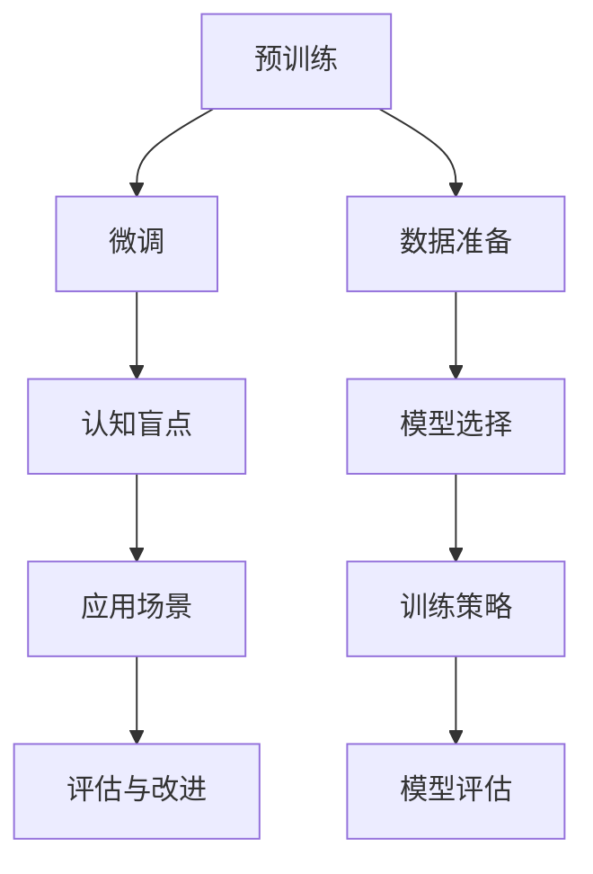

                 

# 语言与思维：大模型的认知盲点

## 1. 背景介绍

随着深度学习技术的迅猛发展，大模型在自然语言处理（NLP）领域取得了显著的进展。例如，基于Transformer架构的BERT、GPT-3等大语言模型，已经在诸如问答、翻译、情感分析等任务中展示了强大的能力。然而，尽管这些模型在许多任务上表现出色，但它们并非没有局限性。

### 1.1 问题由来

大语言模型在各种NLP任务上展示出卓越性能的同时，也逐渐暴露出一些认知盲点，这些盲点可能会限制其应用场景和可信度。这些问题主要集中在理解复杂语言结构、保持常识知识的一致性、处理长序列推理以及实现安全的知识传递等方面。以下将系统地探讨这些认知盲点及其潜在的影响。

### 1.2 问题核心关键点

本文将围绕以下几个核心问题进行探讨：
- 大模型的认知盲点包括哪些方面？
- 这些盲点如何影响模型的应用效果？
- 目前的研究和实践如何应对这些盲点？
- 未来如何进一步优化大模型的认知能力？

## 2. 核心概念与联系

### 2.1 核心概念概述

为了深入理解大模型的认知盲点，首先需要明确一些关键概念：

- **大语言模型（Large Language Models, LLMs）**：基于深度学习技术训练的庞大模型，如BERT、GPT等，能够处理复杂的自然语言任务。
- **预训练（Pre-training）**：在大规模无标注数据上进行的自监督训练过程，用于学习语言的一般性规律。
- **微调（Fine-tuning）**：在预训练模型基础上，使用下游任务的少量标注数据进行有监督训练，优化模型特定任务的能力。
- **认知盲点（Cognitive Blindspots）**：模型在执行某些特定任务时，存在固有的理解能力不足或偏差，导致模型在某些领域或任务上表现不佳。

这些概念之间存在紧密联系。预训练模型通过学习大量的语言数据，掌握了通用的语言结构和模式。微调则是在特定任务上进一步优化模型，但在这个过程中，模型可能会受到数据偏差、训练方法等因素的影响，产生认知盲点。

### 2.2 核心概念原理和架构的 Mermaid 流程图



这个流程图展示了预训练、微调、认知盲点、应用场景、评估与改进之间的联系。预训练阶段通过大规模无标签数据学习语言规律，微调阶段则在特定任务上进一步优化模型。然而，在微调过程中，模型可能会产生认知盲点，需要通过应用场景进行检验，并不断改进。

## 3. 核心算法原理 & 具体操作步骤

### 3.1 算法原理概述

大模型的认知盲点主要体现在以下几个方面：

1. **理解复杂语言结构**：大模型在处理长句子或复杂文本时，往往难以完全理解其结构，这会影响模型在诸如长文本生成、复杂逻辑推理等任务上的表现。
2. **常识知识的一致性**：模型可能会在不同情境下表现出不一致的常识性知识，这会降低模型在需要应用常识知识的任务（如医学、法律等）上的可信度。
3. **长序列推理**：模型在处理长序列数据时，可能难以维持语境的一致性，导致推理结果的可靠性降低。
4. **安全的知识传递**：模型在传递知识时可能存在安全漏洞，导致有害信息的传播，这对实际应用场景（如医疗、金融等）构成潜在风险。

### 3.2 算法步骤详解

针对上述认知盲点，可以采取以下步骤：

**Step 1: 数据预处理**
- 清洗并准备高质量的标注数据，避免数据偏差对模型造成误导。
- 使用数据增强技术扩充数据集，提高模型的泛化能力。

**Step 2: 模型选择与初始化**
- 选择合适的预训练模型，并进行必要的微调。
- 确定微调目标，如调整模型的上下文理解能力、逻辑推理能力等。

**Step 3: 训练与优化**
- 设计合适的训练策略，如调整学习率、增加正则化等。
- 评估模型性能，根据评估结果调整训练策略。

**Step 4: 模型评估与改进**
- 在实际应用场景中检验模型性能，发现认知盲点。
- 根据应用场景反馈，优化模型结构和训练策略。

### 3.3 算法优缺点

大模型在解决NLP问题时具有以下优点：
- **高效性**：能够处理大规模文本数据，提升自动化水平。
- **泛化能力**：能够通过微调适应多种下游任务。

同时，也存在以下缺点：
- **认知盲点**：处理复杂语言结构和长序列推理时表现不佳。
- **一致性问题**：在不同应用场景下表现不一致，缺乏一致的常识性知识。
- **安全风险**：存在知识传递的安全漏洞，可能传播有害信息。

### 3.4 算法应用领域

尽管存在认知盲点，大模型在许多领域仍显示出巨大的潜力：

- **自动文本生成**：适用于小说、诗歌等创意文本创作。
- **问答系统**：适用于医疗、金融等专业领域的知识查询。
- **机器翻译**：能够处理复杂句法和语义结构的文本翻译。
- **情感分析**：用于社交媒体情感监测、舆情分析等。

## 4. 数学模型和公式 & 详细讲解 & 举例说明

### 4.1 数学模型构建

以BERT为例，其预训练模型的数学模型可以表示为：

$$
\mathcal{L} = -\sum_{i=1}^{n} y_i \log p(x_i) + (1-y_i) \log (1-p(x_i))
$$

其中，$x_i$ 是输入的文本向量，$y_i$ 是文本对应的标签，$p(x_i)$ 是模型对文本的预测概率。在微调过程中，目标是在保留预训练模型权重的前提下，优化模型在特定任务上的性能。

### 4.2 公式推导过程

对于微调任务，如情感分类，可以定义一个二元分类损失函数：

$$
\mathcal{L} = -\sum_{i=1}^{N} \left[y_i \log p(x_i|y_i) + (1-y_i) \log (1-p(x_i|y_i))\right]
$$

其中，$N$ 是样本数量，$x_i$ 是输入的文本向量，$y_i$ 是文本的情感标签，$p(x_i|y_i)$ 是模型在给定情感标签下对文本的预测概率。

在训练过程中，通过反向传播计算梯度，并使用梯度下降等优化算法更新模型参数。

### 4.3 案例分析与讲解

以医疗问答系统为例，假设模型在预训练时没有接触过医学知识，在微调过程中，可以通过以下步骤提升其医疗知识：

1. 收集医学领域的问答对，准备标注数据集。
2. 在BERT模型的基础上添加医学领域的特定层。
3. 定义医学领域的损失函数，并使用医学领域的标注数据进行微调。
4. 在实际应用中，通过模型推理得到病人的症状和可能的诊断，提供医疗建议。

## 5. 项目实践：代码实例和详细解释说明

### 5.1 开发环境搭建

使用Python和PyTorch搭建环境：

1. 安装Python 3.8及以上版本。
2. 安装Anaconda，创建虚拟环境。
3. 安装PyTorch、Numpy、Pandas等库。
4. 安装BERT模型和相关库。

### 5.2 源代码详细实现

以下是一个简单的示例，使用BERT模型进行情感分类任务的微调：

```python
import torch
import transformers
from transformers import BertForSequenceClassification, BertTokenizer

# 加载预训练的BERT模型和tokenizer
model = BertForSequenceClassification.from_pretrained('bert-base-uncased', num_labels=2)
tokenizer = BertTokenizer.from_pretrained('bert-base-uncased')

# 准备训练数据
inputs = tokenizer('The movie was great!', return_tensors='pt')
labels = torch.tensor([1])

# 定义损失函数和优化器
criterion = torch.nn.CrossEntropyLoss()
optimizer = torch.optim.AdamW(model.parameters(), lr=1e-5)

# 训练模型
for epoch in range(5):
    model.train()
    optimizer.zero_grad()
    outputs = model(**inputs, labels=labels)
    loss = outputs.loss
    loss.backward()
    optimizer.step()
    print(f'Epoch {epoch+1}, Loss: {loss.item()}')

# 评估模型
model.eval()
with torch.no_grad():
    outputs = model(**inputs)
    logits = outputs.logits
    predicted_label = logits.argmax(dim=1).item()
    print(f'Prediction: {predicted_label}')
```

### 5.3 代码解读与分析

上述代码实现了一个简单的情感分类模型微调过程：

- 首先，加载BERT模型和tokenizer。
- 准备训练数据，包括输入文本和对应的标签。
- 定义损失函数和优化器，进行模型训练。
- 在训练过程中，通过反向传播更新模型参数。
- 在训练完成后，使用评估数据集评估模型性能。

## 6. 实际应用场景

### 6.1 智能客服系统

大模型在智能客服系统中的应用可以显著提升服务质量和用户体验。例如，通过微调模型，使其能够理解客户提出的问题，并给出相应的答案。这不仅可以提高客服响应速度，还能提供更加个性化和准确的解决方案。

### 6.2 金融舆情监测

在金融领域，大模型可以通过微调进行舆情监测，帮助金融机构及时了解市场动态和用户情感。通过分析社交媒体和新闻报道，模型可以识别出潜在的风险信号，为决策提供支持。

### 6.3 个性化推荐系统

个性化推荐系统可以利用大模型进行用户行为分析，推荐适合用户的商品或内容。通过微调模型，使其能够更好地理解用户偏好，提供更加个性化的推荐服务。

## 7. 工具和资源推荐

### 7.1 学习资源推荐

1. 《Deep Learning with PyTorch》：介绍如何使用PyTorch进行深度学习开发，包含微调模型的相关内容。
2. 《Natural Language Processing with Transformers》：介绍Transformer架构及其应用，适合对大模型微调感兴趣的用户。
3. 《Courses for Deep Learning Specialization》：由Coursera提供，涵盖深度学习各个方面的课程，包括NLP和大模型的微调。
4. 《Kaggle Datasets》：提供大量NLP数据集，适合进行模型训练和微调。
5. 《Hugging Face Blog》：提供丰富的NLP相关博文和案例，适合学习大模型的微调技术。

### 7.2 开发工具推荐

1. PyTorch：适合进行深度学习和模型微调，支持动态计算图。
2. TensorFlow：适合大规模模型训练和生产部署，支持分布式训练。
3. Weights & Biases：模型训练跟踪工具，可以帮助监控和调试模型。
4. TensorBoard：可视化工具，适合展示模型训练过程中的各项指标。
5. Jupyter Notebook：用于编写和分享NLP代码和研究论文。

### 7.3 相关论文推荐

1. "BERT: Pre-training of Deep Bidirectional Transformers for Language Understanding"：BERT模型的研究论文，介绍了其在NLP任务上的预训练和微调过程。
2. "Attention is All You Need"：Transformer架构的原始论文，介绍自注意力机制在大模型中的应用。
3. "Imagen: Training an Instruction-Tuned Multimodal Model from Scratch"：介绍如何使用自监督学习训练大模型，适合了解参数高效微调方法。
4. "AdaLoRA: Adaptive Low-Rank Adaptation for Parameter-Efficient Fine-Tuning"：介绍一种参数高效微调方法，适合提升模型推理效率。
5. "Decision-Making Complexity of NLP Models"：探讨大模型在决策复杂性上的表现，适合了解模型推理能力。

## 8. 总结：未来发展趋势与挑战

### 8.1 研究成果总结

大模型微调技术已经取得显著进展，但在处理复杂语言结构和长序列推理方面仍存在挑战。未来需要在模型设计和训练策略上进行更多探索。

### 8.2 未来发展趋势

1. **多模态融合**：结合文本、图像、音频等多种数据源，提升模型的综合能力。
2. **增强常识知识**：通过引入外部知识库，提升模型在常识性知识的应用能力。
3. **参数高效微调**：优化模型结构和训练策略，减少过拟合风险。
4. **安全性与可解释性**：提高模型的安全性，增强其可解释性，提升用户信任。

### 8.3 面临的挑战

1. **数据偏差**：标注数据可能存在偏差，影响模型的公正性。
2. **模型复杂性**：大规模模型的训练和推理过程复杂，需要优化计算资源。
3. **伦理与安全**：模型可能传播有害信息，需要加强监管和伦理考虑。
4. **隐私保护**：处理敏感数据时需要确保用户隐私安全。

### 8.4 研究展望

未来，大模型微调技术需要在数据、算法和应用场景上进行更多探索，提升模型的认知能力，推动NLP技术在各个领域的广泛应用。

## 9. 附录：常见问题与解答

**Q1: 大模型微调是否适用于所有NLP任务？**

A: 大模型在许多NLP任务上表现出色，但某些任务可能对模型的理解能力要求更高，如医学、法律等，需要进行额外的预训练和微调。

**Q2: 如何避免数据偏差？**

A: 收集高质量、多样化的标注数据，并进行数据增强和正则化处理，减少数据偏差对模型的影响。

**Q3: 如何提高模型的安全性？**

A: 在模型训练和部署过程中，引入数据脱敏、访问控制等安全措施，确保模型的输出符合伦理标准。

**Q4: 如何提升模型的可解释性？**

A: 使用可解释性工具和可视化方法，分析模型推理过程，解释其决策依据。

**Q5: 大模型的未来发展方向是什么？**

A: 未来的大模型将更加智能化和通用化，结合多模态数据和常识知识，提升模型的综合应用能力。

---

作者：禅与计算机程序设计艺术 / Zen and the Art of Computer Programming

