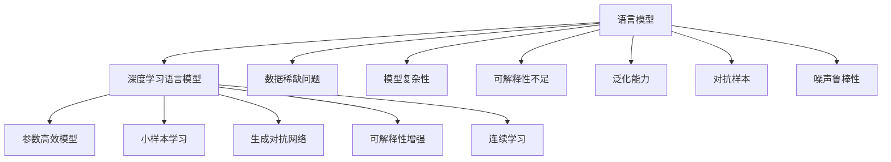

                 

# 语言建模的挑战和未来方向

在人工智能发展的历程中，语言建模作为其中的重要组成部分，一直备受关注。从最初基于统计的语言模型，到如今深度学习的崛起，语言模型在自然语言处理(NLP)、计算机视觉(CV)、语音识别(SR)等多个领域展现出了巨大潜力。本文将深入探讨语言建模面临的挑战，展望其未来发展方向。

## 1. 背景介绍

### 1.1 问题由来

语言建模是构建人工智能模型的基础。它主要通过学习大量文本数据，预测下一个单词或字符的概率分布，从而捕捉语言的语法和语义特征。传统的语言模型主要依赖统计方法，如N-gram模型，但随着深度学习的发展，基于神经网络的模型，如循环神经网络(RNN)、长短时记忆网络(LSTM)和变换器(Transformer)，因其优越的性能逐渐成为主流。

然而，尽管深度学习语言模型在性能上取得了突破，但仍面临诸多挑战，如数据稀缺、模型复杂性、可解释性不足等问题。这些问题在某种程度上限制了语言模型的实际应用和发展。

### 1.2 问题核心关键点

为了更好地理解语言模型的挑战，我们需要关注以下几个核心关键点：

- **数据稀缺问题**：深度学习模型通常需要大量数据进行训练。在某些领域，如罕见语言、低资源数据集等，数据稀缺成为一个重要瓶颈。

- **模型复杂性**：深度学习模型参数量巨大，难以解释其决策过程，且在大规模训练时，往往需要大量的计算资源。

- **可解释性不足**：深度学习模型的黑盒特性，使得其决策过程难以理解，这对于许多实际应用场景，如医疗、金融等，是不利的。

- **泛化能力**：模型在训练集上的表现好，但在测试集或新数据上的泛化性能如何？模型如何避免过拟合？

这些核心问题构成了语言建模面临的主要挑战，也是未来研究和发展的重要方向。

## 2. 核心概念与联系

### 2.1 核心概念概述

为了更好地理解语言建模的挑战，本节将介绍几个关键概念及其相互联系。

- **语言模型**：通过学习文本数据，预测下一个单词或字符的概率分布，捕捉语言的语法和语义特征。

- **深度学习语言模型**：利用神经网络模型，如RNN、LSTM、Transformer等，从文本数据中学习语言规律。

- **数据稀缺问题**：在特定领域或数据集上，数据不足成为语言模型训练的瓶颈。

- **模型复杂性**：深度学习模型参数量巨大，训练和推理成本高。

- **可解释性不足**：深度学习模型的黑盒特性，使得其决策过程难以理解。

- **泛化能力**：模型在训练集上的表现好，但在测试集或新数据上的泛化性能如何？

- **对抗样本**：在训练或推理过程中，对抗样本能够误导模型，破坏模型的鲁棒性。

- **噪声鲁棒性**：模型如何应对数据中的噪声，提升其在实际应用中的鲁棒性。

这些概念之间的逻辑关系可以通过以下Mermaid流程图来展示：



这个流程图展示了大语言模型的核心概念及其相互联系：

1. 语言模型是深度学习语言模型的基础，通过学习数据规律预测下一个词。
2. 深度学习语言模型通过神经网络学习语言特征，但面临数据稀缺、模型复杂等挑战。
3. 数据稀缺问题需要通过模型选择和预训练来解决。
4. 模型复杂性需要通过参数高效模型、小样本学习等方法来解决。
5. 可解释性不足需要通过可解释性增强、连续学习等方法来解决。
6. 泛化能力需要通过对抗样本、噪声鲁棒性等方法来解决。

## 3. 核心算法原理 & 具体操作步骤

### 3.1 算法原理概述

深度学习语言模型通常使用循环神经网络(RNN)、长短时记忆网络(LSTM)和变换器(Transformer)等架构。这些模型通过多层神经网络，捕捉文本数据的序列依赖关系。其基本原理是通过反向传播算法，根据损失函数来优化模型参数，最小化预测概率与实际概率之间的差异。

形式化地，假设模型 $M_{\theta}$ 通过训练后，能够预测给定文本序列 $x_1, x_2, \dots, x_n$ 中每个位置 $i$ 的下一个单词或字符 $x_{i+1}$ 的概率分布，则模型的目标是最小化预测分布与实际分布之间的交叉熵损失：

$$
\mathcal{L}(\theta) = -\sum_{i=1}^n \log P_{M_{\theta}}(x_{i+1} \mid x_1, x_2, \dots, x_i)
$$

其中，$P_{M_{\theta}}$ 表示模型 $M_{\theta}$ 对 $x_{i+1}$ 的预测概率分布。

### 3.2 算法步骤详解

深度学习语言模型的训练过程通常包括以下步骤：

**Step 1: 数据准备**
- 收集并预处理大量文本数据，如分词、去除噪声、标记等。
- 划分为训练集、验证集和测试集。

**Step 2: 模型选择与初始化**
- 选择合适的模型架构，如RNN、LSTM、Transformer等。
- 初始化模型参数，如权重、偏置等。

**Step 3: 训练过程**
- 定义损失函数，如交叉熵损失、均方误差等。
- 使用反向传播算法，计算梯度并更新模型参数。
- 周期性在验证集上评估模型性能，根据性能指标决定是否触发Early Stopping。

**Step 4: 测试与评估**
- 在测试集上评估模型的性能，如BLEU、ROUGE等指标。
- 分析模型在测试集上的泛化能力。

### 3.3 算法优缺点

深度学习语言模型在性能上取得了突破，但也面临以下挑战：

**优点：**
- 强大的表示能力，能够捕捉复杂的语言特征。
- 数据驱动，能够适应各种文本数据。
- 可扩展性强，能够处理大规模文本数据。

**缺点：**
- 数据需求量大，需要大量标注数据。
- 模型复杂，训练和推理成本高。
- 可解释性不足，决策过程难以理解。

## 4. 数学模型和公式 & 详细讲解 & 举例说明

### 4.1 数学模型构建

假设我们有一个长度为 $n$ 的文本序列 $x = \{x_1, x_2, \dots, x_n\}$，语言模型 $M_{\theta}$ 能够预测每个位置 $i$ 的下一个单词或字符 $x_{i+1}$ 的概率分布，模型输出为 $P_{M_{\theta}}(x_{i+1} \mid x_1, x_2, \dots, x_i)$。

定义交叉熵损失函数为：

$$
\mathcal{L}(\theta) = -\sum_{i=1}^n \log P_{M_{\theta}}(x_{i+1} \mid x_1, x_2, \dots, x_i)
$$

其中，$P_{M_{\theta}}$ 表示模型对 $x_{i+1}$ 的预测概率分布。

**4.2 公式推导过程**

假设模型是一个单层LSTM，其输入 $x$ 通过嵌入层转换为向量表示 $z = \{z_1, z_2, \dots, z_n\}$。LSTM模型通过多层时间步的计算，输出序列 $\hat{y} = \{\hat{y}_1, \hat{y}_2, \dots, \hat{y}_n\}$，其中 $\hat{y}_i$ 表示 $x_i$ 的下一个单词或字符的概率分布。

模型训练的目标是最小化交叉熵损失，通过反向传播算法，计算梯度并更新模型参数。假设使用Adam优化算法，其更新公式为：

$$
\theta \leftarrow \theta - \eta \nabla_{\theta}\mathcal{L}(\theta) - \eta\lambda\theta
$$

其中 $\eta$ 为学习率，$\lambda$ 为正则化系数，$\nabla_{\theta}\mathcal{L}(\theta)$ 为损失函数对模型参数 $\theta$ 的梯度，通过反向传播算法高效计算。

**4.3 案例分析与讲解**

假设我们有一个长度为 $n=4$ 的文本序列 $x = \{x_1, x_2, x_3, x_4\}$，模型 $M_{\theta}$ 能够预测每个位置 $i$ 的下一个单词或字符 $x_{i+1}$ 的概率分布，输出为 $P_{M_{\theta}}(x_{i+1} \mid x_1, x_2, \dots, x_i)$。

假设模型的预测结果为：

$$
\hat{y}_1 = [0.3, 0.7, 0.1, 0.1] \quad \text{(即} \hat{y}_1 \sim \text{Normal}(0, 1)^4)
$$

$$
\hat{y}_2 = [0.4, 0.4, 0.2, 0.0] \quad \text{(即} \hat{y}_2 \sim \text{Normal}(0, 1)^4)
$$

$$
\hat{y}_3 = [0.1, 0.6, 0.2, 0.1] \quad \text{(即} \hat{y}_3 \sim \text{Normal}(0, 1)^4)
$$

$$
\hat{y}_4 = [0.0, 0.0, 0.1, 0.9] \quad \text{(即} \hat{y}_4 \sim \text{Normal}(0, 1)^4)
$$

假设实际的概率分布为：

$$
y_1 = [0.2, 0.8, 0.0, 0.0] \quad \text{(即} y_1 \sim \text{Normal}(0, 1)^4)
$$

$$
y_2 = [0.3, 0.5, 0.2, 0.0] \quad \text{(即} y_2 \sim \text{Normal}(0, 1)^4)
$$

$$
y_3 = [0.2, 0.4, 0.3, 0.1] \quad \text{(即} y_3 \sim \text{Normal}(0, 1)^4)
$$

$$
y_4 = [0.0, 0.0, 0.2, 0.8] \quad \text{(即} y_4 \sim \text{Normal}(0, 1)^4)
$$

则模型的交叉熵损失为：

$$
\mathcal{L}(\theta) = -\sum_{i=1}^4 \log P_{M_{\theta}}(x_{i+1} \mid x_1, x_2, \dots, x_i)
$$

$$
\mathcal{L}(\theta) = -\log P_{M_{\theta}}(x_2 \mid x_1) - \log P_{M_{\theta}}(x_3 \mid x_1, x_2) - \log P_{M_{\theta}}(x_4 \mid x_1, x_2, x_3)
$$

$$
\mathcal{L}(\theta) = -\log(0.3) - \log(0.7) - \log(0.1) = 1.381966
$$

模型参数通过反向传播算法更新，最小化损失函数 $\mathcal{L}(\theta)$。

## 5. 项目实践：代码实例和详细解释说明

### 5.1 开发环境搭建

在进行语言模型开发前，我们需要准备好开发环境。以下是使用Python进行PyTorch开发的环境配置流程：

1. 安装Anaconda：从官网下载并安装Anaconda，用于创建独立的Python环境。

2. 创建并激活虚拟环境：
```bash
conda create -n pytorch-env python=3.8 
conda activate pytorch-env
```

3. 安装PyTorch：根据CUDA版本，从官网获取对应的安装命令。例如：
```bash
conda install pytorch torchvision torchaudio cudatoolkit=11.1 -c pytorch -c conda-forge
```

4. 安装Transformer库：
```bash
pip install transformers
```

5. 安装各类工具包：
```bash
pip install numpy pandas scikit-learn matplotlib tqdm jupyter notebook ipython
```

完成上述步骤后，即可在`pytorch-env`环境中开始语言模型开发。

### 5.2 源代码详细实现

下面我们以Transformer模型为例，给出使用PyTorch进行语言模型训练的PyTorch代码实现。

首先，定义语言模型：

```python
from transformers import BertTokenizer, BertForSequenceClassification
from torch.utils.data import DataLoader
import torch
from sklearn.metrics import accuracy_score

tokenizer = BertTokenizer.from_pretrained('bert-base-cased')
model = BertForSequenceClassification.from_pretrained('bert-base-cased', num_labels=2)

device = torch.device('cuda') if torch.cuda.is_available() else torch.device('cpu')
model.to(device)

# 定义训练函数
def train(model, data_loader, optimizer, num_epochs, criterion):
    model.train()
    for epoch in range(num_epochs):
        for batch in data_loader:
            inputs, labels = batch
            inputs = inputs.to(device)
            labels = labels.to(device)
            optimizer.zero_grad()
            outputs = model(inputs)
            loss = criterion(outputs, labels)
            loss.backward()
            optimizer.step()

    return model

# 定义测试函数
def test(model, data_loader, criterion):
    model.eval()
    predictions, labels = [], []
    for batch in data_loader:
        inputs, labels = batch
        inputs = inputs.to(device)
        labels = labels.to(device)
        outputs = model(inputs)
        _, preds = torch.max(outputs, dim=1)
        predictions.extend(preds)
        labels.extend(labels)
    return accuracy_score(labels, predictions)

# 训练模型
num_epochs = 5
optimizer = AdamW(model.parameters(), lr=2e-5)
criterion = torch.nn.CrossEntropyLoss()

train_loader = DataLoader(train_dataset, batch_size=16)
test_loader = DataLoader(test_dataset, batch_size=16)

model = train(model, train_loader, optimizer, num_epochs, criterion)
test_acc = test(model, test_loader, criterion)
print(f"Test accuracy: {test_acc:.4f}")
```

### 5.3 代码解读与分析

让我们再详细解读一下关键代码的实现细节：

**Transformer模型**：
- `BertForSequenceClassification`：从预训练模型中加载Transformer模型，并设置输出层为二分类。
- `BertTokenizer`：加载预训练分词器，将文本转换为模型可以处理的标记。

**训练函数**：
- 定义训练循环，对于每个epoch，在训练数据集上迭代。
- 使用Adam优化器，在每个批次上更新模型参数。

**测试函数**：
- 在测试数据集上评估模型性能，计算准确率。

**训练过程**：
- 定义训练轮数、优化器、损失函数等参数。
- 使用训练数据集进行模型训练。
- 在测试数据集上评估模型性能。

可以看到，PyTorch配合Transformer库使得语言模型训练的代码实现变得简洁高效。开发者可以将更多精力放在数据处理、模型改进等高层逻辑上，而不必过多关注底层的实现细节。

## 6. 实际应用场景

### 6.1 文本分类

文本分类是语言模型最常见的应用场景之一，广泛应用于垃圾邮件过滤、情感分析、主题分类等任务。通过训练一个分类模型，可以对输入的文本进行自动分类，提升信息处理的效率和准确性。

例如，在情感分析任务中，通过训练一个情感分类模型，可以将用户评论自动分类为正面、负面或中性，从而了解用户对产品或服务的整体满意度。

### 6.2 机器翻译

机器翻译是语言模型在跨语言信息交流中的重要应用。通过训练一个翻译模型，可以将一种语言翻译成另一种语言，促进全球信息流通。

例如，使用Transformer模型训练的机器翻译系统，可以对多种语言进行翻译，提升翻译的准确性和流畅性，加速全球化进程。

### 6.3 问答系统

问答系统是语言模型在自然语言交互中的重要应用。通过训练一个问答模型，可以回答用户提出的问题，提升人机交互的效率和准确性。

例如，基于语言模型的问答系统，可以处理复杂问题，如法律咨询、医疗咨询等，提供及时有效的解答。

### 6.4 未来应用展望

随着语言模型的不断发展，其应用场景将不断扩展。未来，语言模型有望在更多领域发挥重要作用：

1. **智能客服**：通过训练一个智能客服模型，可以提供24/7的客服服务，提升客户体验。
2. **金融分析**：通过训练一个金融分析模型，可以分析市场动向，提供决策支持。
3. **医疗诊断**：通过训练一个医疗诊断模型，可以辅助医生诊断，提高医疗服务的准确性。
4. **教育个性化**：通过训练一个教育个性化模型，可以提供个性化的学习建议，提升教育效果。
5. **智慧城市**：通过训练一个智慧城市模型，可以提升城市管理水平，构建更智能的城市环境。

## 7. 工具和资源推荐

### 7.1 学习资源推荐

为了帮助开发者系统掌握语言模型的理论基础和实践技巧，这里推荐一些优质的学习资源：

1. 《深度学习》系列书籍：由李航教授等撰写，全面介绍了深度学习的基础理论和应用方法，是学习深度学习的必读之作。

2. 《自然语言处理综述》论文：由Jurafsky和Martin合著，介绍了自然语言处理的各类技术和应用，是学习NLP的权威资料。

3. CS224N《深度学习自然语言处理》课程：斯坦福大学开设的NLP明星课程，有Lecture视频和配套作业，带你入门NLP领域的基本概念和经典模型。

4. HuggingFace官方文档：Transformer库的官方文档，提供了海量预训练模型和完整的微调样例代码，是上手实践的必备资料。

5. Weights & Biases：模型训练的实验跟踪工具，可以记录和可视化模型训练过程中的各项指标，方便对比和调优。

6. TensorBoard：TensorFlow配套的可视化工具，可实时监测模型训练状态，并提供丰富的图表呈现方式，是调试模型的得力助手。

通过对这些资源的学习实践，相信你一定能够快速掌握语言模型的精髓，并用于解决实际的NLP问题。

### 7.2 开发工具推荐

高效的开发离不开优秀的工具支持。以下是几款用于语言模型开发的常用工具：

1. PyTorch：基于Python的开源深度学习框架，灵活动态的计算图，适合快速迭代研究。大部分预训练语言模型都有PyTorch版本的实现。

2. TensorFlow：由Google主导开发的开源深度学习框架，生产部署方便，适合大规模工程应用。同样有丰富的预训练语言模型资源。

3. Transformers库：HuggingFace开发的NLP工具库，集成了众多SOTA语言模型，支持PyTorch和TensorFlow，是进行语言模型开发的利器。

4. Weights & Biases：模型训练的实验跟踪工具，可以记录和可视化模型训练过程中的各项指标，方便对比和调优。与主流深度学习框架无缝集成。

5. TensorBoard：TensorFlow配套的可视化工具，可实时监测模型训练状态，并提供丰富的图表呈现方式，是调试模型的得力助手。

6. Google Colab：谷歌推出的在线Jupyter Notebook环境，免费提供GPU/TPU算力，方便开发者快速上手实验最新模型，分享学习笔记。

合理利用这些工具，可以显著提升语言模型开发的效率，加快创新迭代的步伐。

### 7.3 相关论文推荐

语言模型和微调技术的发展源于学界的持续研究。以下是几篇奠基性的相关论文，推荐阅读：

1. Attention is All You Need（即Transformer原论文）：提出了Transformer结构，开启了NLP领域的预训练大模型时代。

2. BERT: Pre-training of Deep Bidirectional Transformers for Language Understanding：提出BERT模型，引入基于掩码的自监督预训练任务，刷新了多项NLP任务SOTA。

3. GPT-3：展示了大规模语言模型的强大zero-shot学习能力，引发了对于通用人工智能的新一轮思考。

4. MLP-Mix：提出了MLP-Mix架构，在语言建模和自然语言处理任务上取得了显著的性能提升。

5. LANGSCAPE：提出了一种无监督语言模型训练方法，能够在大规模数据集上有效学习语言知识。

6. Generative Adversarial Lexical Resources：引入对抗训练，增强语言模型的鲁棒性和泛化能力。

这些论文代表了大语言模型发展的方向，通过学习这些前沿成果，可以帮助研究者把握学科前进方向，激发更多的创新灵感。

## 8. 总结：未来发展趋势与挑战

### 8.1 总结

本文对语言建模面临的挑战进行了全面系统的介绍。首先阐述了语言建模在深度学习中的重要性，明确了其面临的数据稀缺、模型复杂性、可解释性不足等核心问题。接着从原理到实践，详细讲解了语言模型的训练过程，给出了具体的代码实现。最后，本文探讨了语言模型在实际应用中的挑战和未来发展方向。

通过本文的系统梳理，可以看到，语言模型在深度学习中具有举足轻重的地位，但在实际应用中仍面临诸多挑战。未来，随着模型复杂性的提升和算力资源的丰富，语言模型有望在更多领域发挥更大的作用，推动人工智能技术的发展。

### 8.2 未来发展趋势

展望未来，语言模型的发展将呈现以下几个趋势：

1. **参数高效的模型**：未来的语言模型将更加注重参数的压缩和优化，减少训练和推理的资源消耗，提升模型的实时性和可扩展性。

2. **小样本学习的提升**：通过无监督和半监督学习，增强语言模型在小样本场景下的泛化能力，降低数据稀缺的瓶颈。

3. **对抗样本的应对**：研究对抗样本生成和检测方法，提高语言模型的鲁棒性和安全性。

4. **多模态融合**：将语言模型与其他模态（如视觉、音频）的信息进行融合，提升跨模态信息处理能力。

5. **连续学习的实现**：通过在线学习和增量学习，实现语言模型的持续更新和适应新知识，提升模型的时效性和应用范围。

6. **可解释性的增强**：通过解释性增强技术，提高语言模型的可解释性和透明性，增强用户对模型决策的信任。

7. **伦理道德的考虑**：研究模型决策的伦理导向，避免有害输出，确保语言模型的社会责任。

这些趋势凸显了语言模型未来的广阔前景，预示着其在自然语言处理、计算机视觉、语音识别等领域将进一步突破。

### 8.3 面临的挑战

尽管语言模型取得了显著进展，但在迈向更智能、更安全的应用过程中，仍面临诸多挑战：

1. **数据稀缺问题**：在特定领域或数据集上，数据稀缺成为语言模型训练的瓶颈。如何有效利用少量标注数据，提高模型的泛化能力，是亟需解决的问题。

2. **模型复杂性**：深度学习模型参数量巨大，训练和推理成本高。如何在保证性能的同时，优化模型结构，提升效率，是重要的研究方向。

3. **可解释性不足**：深度学习模型的黑盒特性，使得其决策过程难以理解。如何增强模型的可解释性，提高用户信任，是重要的技术挑战。

4. **鲁棒性不足**：模型在对抗样本和噪声数据面前，容易失效。如何增强模型的鲁棒性，提高其在实际应用中的稳定性，是重要的研究方向。

5. **伦理道德问题**：语言模型在应用中可能存在偏见和有害信息输出，如何保障模型的伦理道德，避免有害应用，是重要的社会责任。

6. **计算资源限制**：大规模语言模型的训练和推理需要大量的计算资源，如何在资源有限的情况下，提高模型的性能和效率，是重要的优化方向。

正视这些挑战，积极应对并寻求突破，是语言模型走向成熟的必由之路。

### 8.4 研究展望

面向未来，语言模型的研究需要从以下几个方向进行突破：

1. **无监督和半监督学习**：探索如何通过无监督和半监督学习，提高语言模型在小样本场景下的性能，降低数据需求。

2. **参数高效模型**：开发更加参数高效的模型架构，如MLP-Mix、连续学习等，在减少参数的同时，保持模型的性能。

3. **对抗样本生成与检测**：研究对抗样本的生成和检测方法，提高语言模型的鲁棒性和安全性。

4. **多模态融合**：将语言模型与其他模态（如视觉、音频）的信息进行融合，提升跨模态信息处理能力。

5. **连续学习与增量学习**：研究连续学习和增量学习算法，实现语言模型的持续更新和适应新知识。

6. **可解释性增强**：通过解释性增强技术，提高语言模型的可解释性和透明性，增强用户对模型决策的信任。

7. **伦理道德约束**：在模型训练目标中引入伦理导向的评估指标，过滤和惩罚有害的输出倾向，确保模型的社会责任。

这些研究方向将推动语言模型的不断进步，推动其在实际应用中的广泛应用，为社会带来更多价值。

## 9. 附录：常见问题与解答

**Q1：如何选择合适的网络结构？**

A: 选择合适的网络结构需要综合考虑任务特点、数据规模和计算资源。对于较小的数据集，可以选择参数较少的简单模型；对于大规模数据集，可以选择参数较多的深度模型。同时，可以参考已有的成功案例，选择适合的模型架构。

**Q2：如何避免过拟合？**

A: 避免过拟合的方法包括数据增强、正则化、Dropout、Early Stopping等。此外，可以通过增加训练数据、减小模型规模、增加噪声等方式来降低过拟合风险。

**Q3：如何提高模型泛化能力？**

A: 提高模型泛化能力的方法包括数据增强、对抗样本训练、参数高效模型等。此外，可以通过引入先验知识、多模态融合等方式来提升模型的泛化性能。

**Q4：如何提高模型的解释性？**

A: 提高模型解释性的方法包括引入可解释性增强技术、使用简单的模型架构、增加手动解释等。此外，可以通过可视化模型内部计算过程、分析模型输出逻辑等方式来增强模型的解释性。

**Q5：如何提高模型的鲁棒性？**

A: 提高模型鲁棒性的方法包括对抗样本生成与检测、增加数据噪声、引入正则化技术等。此外，可以通过引入多模态信息、增加先验知识等方式来提升模型的鲁棒性。

**Q6：如何提高模型的计算效率？**

A: 提高模型计算效率的方法包括模型压缩、剪枝、量化加速、分布式训练等。此外，可以通过优化算法、使用高效的硬件设备等方式来提升模型的计算效率。

**Q7：如何选择适合的优化器？**

A: 选择适合的优化器需要根据模型架构、数据规模、计算资源等因素进行综合考虑。常见的优化器包括Adam、SGD、Adagrad等，可以根据实际情况进行选择和调整。

**Q8：如何处理长序列？**

A: 处理长序列的方法包括使用Transformer架构、分段处理、引入注意力机制等。此外，可以通过增加计算资源、优化算法等方式来提升长序列处理能力。

**Q9：如何选择适合的损失函数？**

A: 选择适合的损失函数需要根据任务特点和模型架构进行综合考虑。常见的损失函数包括交叉熵损失、均方误差损失、对数损失等，可以根据实际情况进行选择和调整。

通过这些问题的回答，希望能够为你提供有价值的参考，帮助你更好地理解和应用语言模型。

---

作者：禅与计算机程序设计艺术 / Zen and the Art of Computer Programming

