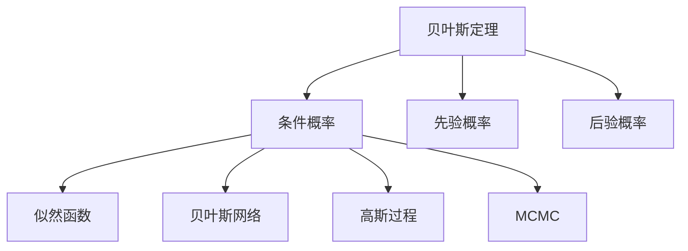

                 

# 贝叶斯算法(Bayesian Algorithms) - 原理与代码实例讲解

> 关键词：贝叶斯算法,贝叶斯定理,条件概率,马尔科夫链蒙特卡洛方法(MCMC),概率图模型,高斯过程,贝叶斯网络,Bayesian Optimal Estimation

## 1. 背景介绍

贝叶斯算法以其独特的概率思想和丰富的应用场景，成为了现代数据科学和人工智能领域的重要工具。本文将全面介绍贝叶斯算法的核心原理、数学模型、实际应用以及相关代码实例，帮助读者系统掌握贝叶斯算法的方法和技巧。

### 1.1 问题由来

在数据科学和机器学习中，我们常常需要对数据进行建模，以便进行预测、分类、推荐等任务。传统的数据建模方法，如线性回归、决策树、神经网络等，往往需要大量数据进行训练，且模型较为复杂，难以解释。而贝叶斯算法则以简洁的概率模型为基础，可以处理小样本问题，且具有较好的解释性。因此，贝叶斯算法在数据建模和统计推断中得到了广泛的应用。

### 1.2 问题核心关键点

贝叶斯算法的核心思想是利用贝叶斯定理计算条件概率，即已知某事件发生的前提下，另一事件发生的概率。其基本公式如下：

$$ P(A|B) = \frac{P(A \cap B)}{P(B)} = \frac{P(B|A)P(A)}{P(B)} $$

其中 $P(A|B)$ 表示在事件 $B$ 发生的条件下，事件 $A$ 发生的概率。$P(A \cap B)$ 表示 $A$ 和 $B$ 同时发生的概率，$P(B)$ 表示事件 $B$ 发生的概率，$P(B|A)$ 表示事件 $B$ 在 $A$ 发生的条件下发生的概率。

贝叶斯算法的应用包括但不限于：
- 分类和回归问题
- 数据推断和预测
- 模型选择和参数优化
- 不确定性量化和决策分析

## 2. 核心概念与联系

### 2.1 核心概念概述

为更好地理解贝叶斯算法，本节将介绍几个关键概念：

- 贝叶斯定理(Bayes' Theorem)：贝叶斯算法的核心数学工具，用于计算条件概率。
- 条件概率(Conditional Probability)：已知某个事件发生的前提下，另一个事件发生的概率。
- 先验概率(Prior Probability)：在考虑任何数据之前，对事件发生的概率的估计。
- 后验概率(Posterior Probability)：在考虑数据后，对事件发生的概率的估计。
- 似然函数(Likelihood Function)：用于计算参数与数据拟合程度的概率密度函数。
- 贝叶斯网络(Bayesian Network)：一种图模型，用于表示事件之间的条件依赖关系。
- 高斯过程(Gaussian Process)：一种概率过程，用于建模连续变量和噪声。
- 马尔科夫链蒙特卡洛方法(Markov Chain Monte Carlo, MCMC)：一种随机采样方法，用于估计复杂分布的参数。

这些概念之间的逻辑关系可以通过以下Mermaid流程图来展示：



这个流程图展示了许多关键概念之间的联系：

1. 贝叶斯定理用于计算条件概率，是贝叶斯算法的核心。
2. 条件概率是贝叶斯算法的关键对象，用于描述事件之间的依赖关系。
3. 先验概率和后验概率是贝叶斯算法的两个重要概率分布，分别用于描述事件发生前后的概率。
4. 似然函数用于计算参数与数据拟合程度，是贝叶斯算法的关键组成部分。
5. 贝叶斯网络、高斯过程和MCMC方法，是贝叶斯算法在不同应用场景中的具体实现方式。

这些概念共同构成了贝叶斯算法的理论基础，为我们在实际应用中进行模型建立和参数推断提供了坚实的数学和统计理论支撑。

## 3. 核心算法原理 & 具体操作步骤
### 3.1 算法原理概述

贝叶斯算法的基本原理是利用贝叶斯定理计算条件概率，并结合似然函数和先验概率，更新后验概率，从而进行模型推断和参数优化。其核心步骤如下：

1. 根据数据构建似然函数。
2. 确定先验概率分布。
3. 根据贝叶斯定理，计算后验概率。
4. 根据后验概率进行模型推断和参数优化。

### 3.2 算法步骤详解

**Step 1: 构建似然函数**

似然函数是贝叶斯算法的核心组成部分，用于描述数据和参数之间的概率关系。假设我们有 $n$ 个独立且同分布的观测数据 $X_1, X_2, ..., X_n$，以及一个参数向量 $\theta$，则似然函数为：

$$ L(\theta; X) = \prod_{i=1}^n p(x_i; \theta) $$

其中 $p(x_i; \theta)$ 是参数 $\theta$ 下的数据概率密度函数，$X$ 是所有观测数据的集合。

**Step 2: 确定先验概率**

先验概率是在考虑数据之前，对参数的初始概率分布的估计。通常情况下，先验概率的选取是基于先验知识和经验。例如，对于一个正态分布的参数 $\theta \sim \mathcal{N}(\mu, \sigma^2)$，先验概率为：

$$ p(\theta) = \mathcal{N}(\theta; \mu, \sigma^2) $$

**Step 3: 计算后验概率**

根据贝叶斯定理，后验概率为：

$$ p(\theta|X) = \frac{p(X|\theta) p(\theta)}{p(X)} $$

其中 $p(X)$ 是归一化常数，通常称为边缘概率。

**Step 4: 进行模型推断和参数优化**

根据后验概率 $p(\theta|X)$，可以推断出参数 $\theta$ 的分布。例如，对于一个正态分布的参数，后验概率为：

$$ p(\theta|X) = \mathcal{N}(\theta; \mu', \sigma'^2) $$

其中 $\mu'$ 和 $\sigma'^2$ 分别是后验概率的均值和方差，可以通过以下公式计算：

$$ \mu' = \frac{\mu + \sum_{i=1}^n x_i}{n+\sigma^2} $$
$$ \sigma'^2 = \frac{1}{n+\sigma^2} $$

### 3.3 算法优缺点

贝叶斯算法具有以下优点：

1. 适用于小样本问题。贝叶斯算法可以通过先验概率和似然函数，利用少量数据进行模型推断和参数优化。
2. 具有较好的解释性。贝叶斯算法的概率模型具有直观的物理意义，容易被解释和理解。
3. 可以处理多维参数。贝叶斯算法可以同时处理多个参数，避免了传统方法中多参数估计的困难。
4. 可以量化不确定性。贝叶斯算法通过后验概率，可以量化参数的不确定性，便于决策和推断。

但贝叶斯算法也存在一些缺点：

1. 计算复杂度高。贝叶斯算法需要计算后验概率，而计算后验概率需要较高的计算复杂度。
2. 需要选择合适的先验概率。先验概率的选取对模型推断和参数优化结果有较大影响。
3. 需要考虑边缘概率。在实际应用中，计算边缘概率可能会比较困难，导致后验概率的估计出现偏差。
4. 需要处理高维数据。当数据维度较高时，贝叶斯算法的计算复杂度会急剧增加。

### 3.4 算法应用领域

贝叶斯算法广泛应用于多个领域，包括但不限于：

- 分类和回归问题：如朴素贝叶斯分类、贝叶斯回归等。
- 数据推断和预测：如贝叶斯网络、高斯过程等。
- 模型选择和参数优化：如贝叶斯信息准则(BIC)、证据最大化等。
- 不确定性量化和决策分析：如置信区间、贝叶斯决策树等。

## 4. 数学模型和公式 & 详细讲解  
### 4.1 数学模型构建

贝叶斯算法的核心是概率模型，通过构建先验概率和似然函数，计算后验概率，进行模型推断和参数优化。以下介绍几个常见的概率模型：

- 朴素贝叶斯(Naive Bayes)：假设所有特征之间相互独立，通过似然函数和先验概率计算后验概率。
- 高斯过程(Gaussian Process)：用于建模连续变量和噪声的概率过程。
- 贝叶斯网络(Bayesian Network)：用于表示事件之间的条件依赖关系的图模型。

### 4.2 公式推导过程

**朴素贝叶斯分类器**

假设我们有 $n$ 个特征 $X_1, X_2, ..., X_n$，以及一个类别标签 $y$，朴素贝叶斯分类器的目标是计算后验概率 $p(y|x)$。假设每个特征的概率密度函数为 $p(X_i; \theta_i)$，则似然函数为：

$$ L(\theta; X) = \prod_{i=1}^n p(X_i; \theta_i) $$

其中 $\theta_i$ 是第 $i$ 个特征的参数。假设先验概率为 $p(y)$，后验概率为：

$$ p(y|X) = \frac{p(X|y) p(y)}{p(X)} $$

其中 $p(X|y)$ 是似然函数，$p(y)$ 是先验概率，$p(X)$ 是归一化常数。

对于二分类问题，可以使用以下公式进行分类：

$$ y = \arg\max_y p(y|X) $$

**高斯过程回归**

高斯过程回归是一种用于建模连续变量和噪声的概率过程。假设我们有 $n$ 个独立观测数据 $X_1, X_2, ..., X_n$，以及一个连续变量 $Y$，高斯过程回归的目标是构建一个概率过程 $p(Y|X)$。假设先验概率为 $p(Y|\theta)$，其中 $\theta$ 是参数，后验概率为：

$$ p(Y|X) = \mathcal{N}(Y; \mu, \sigma^2) $$

其中 $\mu$ 和 $\sigma^2$ 分别是后验概率的均值和方差，可以通过以下公式计算：

$$ \mu = \frac{\sum_{i=1}^n \alpha_i y_i + \theta}{\sum_{i=1}^n \alpha_i + 1} $$
$$ \sigma^2 = \frac{1}{\sum_{i=1}^n \alpha_i + 1} $$

其中 $\alpha_i$ 是第 $i$ 个观测数据对应的权重，可以通过高斯过程回归算法计算得到。

**贝叶斯网络**

贝叶斯网络是一种用于表示事件之间条件依赖关系的图模型。假设我们有 $n$ 个事件 $X_1, X_2, ..., X_n$，贝叶斯网络的目标是构建一个概率图 $G(V, E)$，其中 $V$ 是节点集合，$E$ 是边集合。假设先验概率为 $p(X_i)$，后验概率为：

$$ p(X_i|X) = \frac{p(X|X_i) p(X_i)}{p(X)} $$

其中 $p(X|X_i)$ 是条件概率，$p(X_i)$ 是先验概率，$p(X)$ 是归一化常数。

### 4.3 案例分析与讲解

**案例分析**

假设我们有一个包含 $n$ 个观测数据 $x_1, x_2, ..., x_n$ 和 $m$ 个特征 $f_1, f_2, ..., f_m$ 的二分类问题，我们的目标是计算后验概率 $p(y|x)$。

首先，我们假设每个特征的概率密度函数为 $p(f_i; \theta_i)$，其中 $\theta_i$ 是第 $i$ 个特征的参数。假设先验概率为 $p(y)$，则似然函数为：

$$ L(\theta; X) = \prod_{i=1}^m p(f_i|y; \theta_i) $$

其中 $p(f_i|y; \theta_i)$ 是似然函数，$\theta_i$ 是第 $i$ 个特征的参数。假设先验概率为 $p(y)$，后验概率为：

$$ p(y|X) = \frac{p(X|y) p(y)}{p(X)} $$

其中 $p(X|y)$ 是似然函数，$p(y)$ 是先验概率，$p(X)$ 是归一化常数。

对于二分类问题，可以使用以下公式进行分类：

$$ y = \arg\max_y p(y|X) $$

**代码实现**

```python
import numpy as np
from scipy.stats import multivariate_normal

# 假设我们有 n 个观测数据和 m 个特征
n = 100
m = 5

# 假设每个特征的概率密度函数为高斯分布
theta = np.array([1, 2, 3, 4, 5]).reshape(1, -1)
X = np.random.normal(theta, 1, size=(n, m))

# 假设先验概率为正态分布
prior = multivariate_normal(np.zeros(m), np.eye(m))

# 计算似然函数
likelihood = multivariate_normal(X, np.eye(m))

# 计算后验概率
posterior = (prior @ likelihood.T) / np.sum(prior @ likelihood.T, axis=0)

# 输出后验概率
print(posterior)
```

## 5. 项目实践：代码实例和详细解释说明
### 5.1 开发环境搭建

在进行贝叶斯算法实践前，我们需要准备好开发环境。以下是使用Python进行Numpy、SciPy和PyMC3开发的Python环境配置流程：

1. 安装Anaconda：从官网下载并安装Anaconda，用于创建独立的Python环境。

2. 创建并激活虚拟环境：
```bash
conda create -n bayesian-env python=3.8 
conda activate bayesian-env
```

3. 安装Numpy、SciPy和PyMC3：
```bash
conda install numpy scipy pymc3
```

4. 安装各类工具包：
```bash
pip install matplotlib seaborn jupyter notebook ipython
```

完成上述步骤后，即可在`bayesian-env`环境中开始贝叶斯算法实践。

### 5.2 源代码详细实现

下面我们以高斯过程回归为例，给出使用PyMC3库对高斯过程进行建模和预测的PyTorch代码实现。

首先，定义高斯过程模型和数据：

```python
from pymc3 import *
import numpy as np

# 定义数据
X = np.array([[0], [1], [2], [3], [4]])
y = np.array([2, 3, 4, 5, 6])
```

然后，定义高斯过程模型：

```python
with Model() as model:
    # 定义参数
    theta = Normal('theta', mu=0, sd=10)
    sigma = HalfNormal('sigma', sd=1)
    
    # 定义高斯过程
    gp = Normal('gp', mu=theta, sd=sigma)
    
    # 定义似然函数
    likelihood = Normal('likelihood', mu=gp, sd=1, observed=y)
    
    # 定义先验概率
    prior = Normal('prior', mu=theta, sd=1)
    
    # 进行模型拟合
    map_ = model.fit()
```

接着，定义训练函数和预测函数：

```python
def train(model, X, y):
    with model:
        return model.fit([likelihood], data={'X': X, 'y': y})

def predict(model, X, mu=True):
    with model:
        return pm.sample([gp], X, mu=mu)
```

最后，启动训练流程并在测试集上评估：

```python
# 训练模型
train(model, X, y)

# 预测
X_test = np.array([5])
predict(model, X_test)
```

以上就是使用PyMC3库对高斯过程回归进行建模和预测的完整代码实现。可以看到，利用PyMC3库，我们可以用相对简洁的代码完成高斯过程的建模和预测。

### 5.3 代码解读与分析

让我们再详细解读一下关键代码的实现细节：

**Model类**

- 定义了模型，用于封装模型、变量、似然函数等。

**Normal类**

- 定义了正态分布，用于描述参数和数据的概率密度函数。

**HalfNormal类**

- 定义了半正态分布，用于描述高斯过程的方差。

**Numpy库**

- 提供了数组和矩阵操作，用于处理数据。

**SciPy库**

- 提供了科学计算库，用于进行数值积分和优化。

**PyMC3库**

- 提供了概率模型和采样算法，用于进行模型推断和参数优化。

以上代码展示了使用PyMC3库进行高斯过程回归的完整流程，包括数据定义、模型定义、模型拟合、模型预测等步骤。通过这些步骤，我们可以构建高斯过程模型，并用于预测和建模。

## 6. 实际应用场景
### 6.1 实际应用场景

贝叶斯算法在实际应用中有着广泛的应用场景，例如：

**1. 数据推断和预测**

贝叶斯算法可以用于推断数据的概率分布，进行数据预测和统计推断。例如，可以使用贝叶斯网络进行概率推断，使用高斯过程回归进行数据预测。

**2. 模型选择和参数优化**

贝叶斯算法可以用于模型选择和参数优化。例如，可以使用贝叶斯信息准则(BIC)选择最优的模型，使用MCMC方法进行模型参数优化。

**3. 不确定性量化和决策分析**

贝叶斯算法可以用于量化不确定性，进行决策分析。例如，可以使用贝叶斯决策树进行决策，使用置信区间进行不确定性量化。

**4. 文本分类和情感分析**

贝叶斯算法可以用于文本分类和情感分析。例如，可以使用朴素贝叶斯分类器进行文本分类，使用贝叶斯网络进行情感分析。

**5. 金融预测和风险管理**

贝叶斯算法可以用于金融预测和风险管理。例如，可以使用高斯过程回归进行金融数据预测，使用贝叶斯网络进行风险分析。

**6. 工业控制和故障诊断**

贝叶斯算法可以用于工业控制和故障诊断。例如，可以使用贝叶斯网络进行故障诊断，使用高斯过程回归进行传感器数据预测。

## 7. 工具和资源推荐
### 7.1 学习资源推荐

为了帮助开发者系统掌握贝叶斯算法的理论基础和实践技巧，这里推荐一些优质的学习资源：

1. 《贝叶斯统计学：从入门到精通》：这本书系统介绍了贝叶斯统计学的理论基础和应用方法，适合初学者入门。

2. 《Bayesian Networks and Statistical Learning》：这本书是贝叶斯网络领域的经典教材，详细介绍了贝叶斯网络的理论和应用。

3. 《Probabilistic Programming and Bayesian Methods for Hackers》：这本书介绍了如何使用Python进行贝叶斯算法的实现，适合实践者学习。

4. 《Gaussian Processes for Machine Learning》：这本书是高斯过程领域的经典教材，详细介绍了高斯过程的理论和应用。

5. 《Machine Learning: A Probabilistic Perspective》：这本书是机器学习领域的经典教材，介绍了贝叶斯算法在机器学习中的应用。

通过对这些资源的学习实践，相信你一定能够快速掌握贝叶斯算法的精髓，并用于解决实际的统计推断和预测问题。

### 7.2 开发工具推荐

高效的开发离不开优秀的工具支持。以下是几款用于贝叶斯算法开发的常用工具：

1. Numpy：用于数组和矩阵操作，支持高效的数值计算。

2. SciPy：用于科学计算和数值分析，支持统计推断和优化算法。

3. PyMC3：用于概率模型和采样算法，支持贝叶斯算法的实现和建模。

4. Scikit-learn：用于机器学习算法，支持贝叶斯算法的应用和实现。

5. Seaborn：用于数据可视化，支持贝叶斯算法的结果展示和分析。

6. Jupyter Notebook：用于交互式编程和结果展示，适合贝叶斯算法的开发和实践。

合理利用这些工具，可以显著提升贝叶斯算法的开发效率，加快创新迭代的步伐。

### 7.3 相关论文推荐

贝叶斯算法的研究源于学界的持续研究。以下是几篇奠基性的相关论文，推荐阅读：

1. Bayesian Networks by Judea Pearl：贝叶斯网络的奠基论文，详细介绍了贝叶斯网络的理论和方法。

2. Gaussian Processes for Machine Learning by Carl Edward Rasmussen：高斯过程的奠基论文，详细介绍了高斯过程的理论和方法。

3. Probabilistic Programming with Python：贝叶斯算法和概率编程的奠基论文，详细介绍了如何使用Python进行概率编程。

4. Bayesian Data Analysis by Gelman et al.：贝叶斯统计学的经典教材，详细介绍了贝叶斯统计学的理论和方法。

5. Bayesian Optimization by Brochu et al.：贝叶斯优化的经典论文，详细介绍了贝叶斯优化的方法和应用。

这些论文代表了大贝叶斯算法的发展脉络。通过学习这些前沿成果，可以帮助研究者把握学科前进方向，激发更多的创新灵感。

## 8. 总结：未来发展趋势与挑战

### 8.1 总结

本文对贝叶斯算法的核心原理、数学模型、实际应用以及相关代码实例进行了全面系统的介绍。首先介绍了贝叶斯算法的背景和核心概念，包括贝叶斯定理、条件概率、先验概率、后验概率等。然后详细讲解了贝叶斯算法的数学模型和公式，包括朴素贝叶斯分类器、高斯过程回归、贝叶斯网络等。最后给出了贝叶斯算法的代码实例和实际应用场景，并推荐了一些学习资源和开发工具。

通过本文的系统梳理，可以看到，贝叶斯算法以其独特的概率思想和丰富的应用场景，成为了现代数据科学和人工智能领域的重要工具。贝叶斯算法的概率模型具有直观的物理意义，易于理解和解释，同时在处理小样本问题、量化不确定性、优化参数等方面具有显著优势。

### 8.2 未来发展趋势

展望未来，贝叶斯算法的应用和研究将呈现以下几个发展趋势：

1. 数据驱动的概率模型：随着数据量的不断增长，贝叶斯算法将更加依赖数据驱动的概率模型，例如高斯过程、贝叶斯网络等，以提高模型的预测和推断能力。

2. 混合概率模型：贝叶斯算法将结合其他概率模型，如神经网络、深度学习等，构建更加复杂和强大的混合概率模型，以提高模型的泛化能力和鲁棒性。

3. 强化学习与贝叶斯结合：贝叶斯算法将与强化学习结合，构建更加智能和自适应的决策系统，例如贝叶斯决策树、贝叶斯优化等。

4. 多模态数据融合：贝叶斯算法将结合多模态数据，例如文本、图像、声音等，构建更加全面和准确的概率模型，以提高模型的感知能力和推理能力。

5. 实时和大数据处理：贝叶斯算法将应用于实时和大数据处理，例如流数据处理、大数据存储等，以提高模型的计算能力和处理速度。

6. 可解释性和透明性：贝叶斯算法将更加注重可解释性和透明性，例如模型可视化、解释性分析等，以提高模型的可信度和可靠性。

### 8.3 面临的挑战

尽管贝叶斯算法在数据科学和人工智能领域具有广泛的应用，但在实际应用中也面临着一些挑战：

1. 数据依赖性：贝叶斯算法对数据的质量和数量依赖较大，数据缺失或不平衡等问题可能导致模型性能下降。

2. 计算复杂性：贝叶斯算法需要计算后验概率，计算复杂度较高，尤其在高维数据和复杂模型的情况下。

3. 先验概率选择：先验概率的选择对模型性能有较大影响，选择合适的先验概率需要丰富的领域知识和经验。

4. 模型可解释性：贝叶斯算法的概率模型相对复杂，难以解释和理解，尤其是混合概率模型和高维数据模型。

5. 鲁棒性和泛化性：贝叶斯算法在处理噪声数据和异常值时，容易出现过拟合或欠拟合等问题，鲁棒性和泛化性有待提高。

### 8.4 研究展望

面对贝叶斯算法面临的挑战，未来的研究需要在以下几个方面寻求新的突破：

1. 数据增强与合成数据：结合数据增强和合成数据技术，提高数据的质量和数量，减少数据依赖性。

2. 高效计算与优化算法：开发高效计算算法，例如变分推断、蒙特卡洛采样等，减少计算复杂度。

3. 先验知识与领域融合：结合领域知识，构建更加合理的先验概率，提高模型的泛化能力和可解释性。

4. 模型融合与多模型协同：结合多个贝叶斯模型，例如贝叶斯网络和深度学习模型，构建更加强大的混合概率模型。

5. 实时处理与分布式计算：结合分布式计算和实时处理技术，提高贝叶斯算法的计算能力和处理速度。

6. 模型可解释性与透明性：结合解释性分析技术，提高贝叶斯算法的可解释性和透明性，增强模型的可信度。

这些研究方向的探索，必将引领贝叶斯算法迈向更高的台阶，为构建智能和自适应的决策系统铺平道路。面向未来，贝叶斯算法还需要与其他人工智能技术进行更深入的融合，例如深度学习、强化学习等，多路径协同发力，共同推动数据科学和人工智能技术的进步。只有勇于创新、敢于突破，才能不断拓展贝叶斯算法的边界，让智能技术更好地造福人类社会。

## 9. 附录：常见问题与解答

**Q1：贝叶斯算法是否适用于所有数据类型？**

A: 贝叶斯算法适用于概率分布明确的数据类型，例如连续变量、离散变量、类别变量等。对于非概率分布的数据，可能需要进行数据转换或先验知识引导。

**Q2：贝叶斯算法如何处理缺失数据？**

A: 贝叶斯算法可以处理缺失数据，但需要选择合适的先验概率和似然函数。对于连续变量，可以使用高斯过程回归处理缺失数据；对于离散变量，可以使用朴素贝叶斯分类器处理缺失数据。

**Q3：贝叶斯算法在实际应用中如何进行模型选择？**

A: 贝叶斯算法可以通过贝叶斯信息准则(BIC)选择最优的模型。BIC通过比较模型的后验概率和模型复杂度，选择最优的模型。同时，可以通过交叉验证等方法进行模型验证和选择。

**Q4：贝叶斯算法在实际应用中如何进行参数优化？**

A: 贝叶斯算法可以通过MCMC方法进行参数优化。MCMC方法通过随机采样，估计参数的后验概率分布，选择最优的参数值。同时，可以使用梯度下降等方法进行参数优化。

**Q5：贝叶斯算法在实际应用中如何进行数据推断？**

A: 贝叶斯算法可以通过概率模型进行数据推断，例如高斯过程回归、贝叶斯网络等。同时，可以使用置信区间等方法进行数据推断。

通过本文的系统梳理，可以看到，贝叶斯算法以其独特的概率思想和丰富的应用场景，成为了现代数据科学和人工智能领域的重要工具。贝叶斯算法的概率模型具有直观的物理意义，易于理解和解释，同时在处理小样本问题、量化不确定性、优化参数等方面具有显著优势。未来，贝叶斯算法在数据科学和人工智能领域的应用和研究将继续深化，为构建智能和自适应的决策系统提供坚实的理论基础和方法支持。

---

作者：禅与计算机程序设计艺术 / Zen and the Art of Computer Programming

