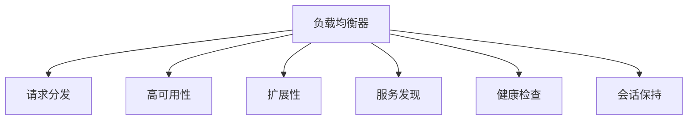
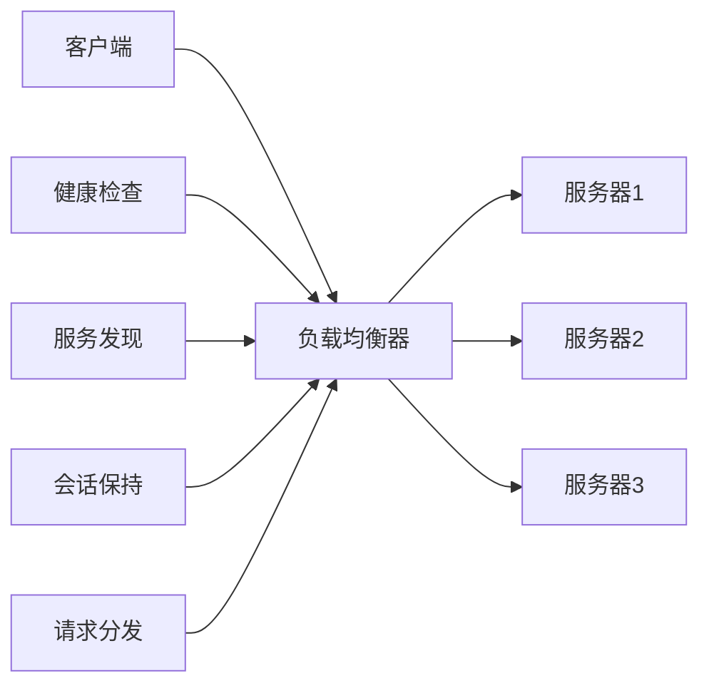

                 

## 1. 背景介绍

在分布式系统架构中，随着系统的不断扩展和用户量的增加，单个服务器已经无法满足高性能和高可用的要求，这就需要引入负载均衡器。负载均衡器是一种将用户请求分散到多个服务器上，从而提高系统处理能力和扩展性的关键组件。通过合理分布请求，负载均衡器可以保证系统的稳定性、可靠性和高可用性。本文将详细探讨负载均衡器在系统扩展中的实例应用，帮助读者了解其在实际项目中的应用场景、设计思路和实现方法。

## 2. 核心概念与联系

### 2.1 核心概念概述

为了更好地理解负载均衡器的实例应用，我们需要掌握几个关键概念：

- **负载均衡器(Load Balancer)**：负责将用户请求分配到多个服务器上，从而提高系统的并发处理能力和可用性。常见的负载均衡器包括Nginx、HAProxy、Apache等。
- **请求分发(请求路由)**
- **高可用性(High Availability)**：通过负载均衡器实现服务器的热备份和故障转移，确保系统的高可用性。
- **扩展性(Scalability)**：通过负载均衡器实现系统水平扩展，即增加服务器数量，从而提升系统的并发处理能力和响应速度。
- **服务发现(Service Discovery)**：负载均衡器通过服务发现机制获取可用的服务器列表，确保请求能够被正确路由。
- **健康检查(Health Check)**：负载均衡器定期检查服务器的健康状态，排除掉故障或性能不佳的服务器。
- **会话保持(Session Affinity)**：通过负载均衡器保持用户会话与同一服务器，从而保证用户请求的一致性。

这些核心概念之间通过一个Mermaid流程图进行展示：



该图展示负载均衡器的关键功能模块，及其与核心概念之间的关系。

### 2.2 核心概念原理和架构的 Mermaid 流程图

负载均衡器的工作原理和架构设计可以通过以下Mermaid流程图进行描述：



从图中可以看出，负载均衡器接收客户端请求，通过服务发现和健康检查选择可用的服务器，并通过请求分发将请求发送到目标服务器。同时，负载均衡器还负责会话保持，确保同一用户请求被路由到同一服务器。

## 3. 核心算法原理 & 具体操作步骤

### 3.1 算法原理概述

负载均衡器的主要算法包括轮询(Round Robin)、最小连接数(Least Connections)、加权轮询(Weighted Round Robin)等。其中，轮询算法是最常用的负载均衡算法之一，其基本原理是按照请求到达的顺序，依次将请求分配到各个服务器上。

最小连接数算法则选择连接数最少的服务器接收请求，这样可以避免服务器之间的负载不均衡，但可能导致某些服务器的负载过高。加权轮询算法则根据服务器的性能和资源使用情况，赋予不同的权重，从而实现更加公平的请求分发。

### 3.2 算法步骤详解

下面以轮询算法为例，详细介绍其实现步骤：

1. 接收客户端请求。
2. 获取服务器列表。
3. 计算请求的轮询位置。
4. 从服务器列表中获取该位置对应的服务器。
5. 将该请求转发到目标服务器。
6. 记录该请求的服务处理情况。

### 3.3 算法优缺点

轮询算法的优点包括简单、易于实现、公平性好。缺点在于无法考虑服务器的当前负载情况，可能导致某些服务器的负载过高。

最小连接数算法的优点是能够动态调整负载，但需要额外的连接维护成本，且容易出现热点服务器现象。

加权轮询算法的优点是能够根据服务器的实际负载情况进行动态调整，但需要准确评估服务器的性能和资源使用情况。

### 3.4 算法应用领域

负载均衡器在许多领域都有广泛应用，如Web应用、云服务、CDN等。在Web应用中，负载均衡器可以提升系统的响应速度和并发处理能力。在云服务中，负载均衡器可以实现服务的高可用性和扩展性。在CDN中，负载均衡器可以实现内容的分散分发，提升用户访问体验。

## 4. 数学模型和公式 & 详细讲解 & 举例说明

### 4.1 数学模型构建

负载均衡器通常采用轮询算法进行请求分发，可以通过数学模型来描述其工作原理。假设服务器列表为S，客户端请求为R，负载均衡器按照轮询算法分发请求。数学模型如下：

$$
\text{分发函数} = f(R, S) = \text{mod}(R \div S, S)
$$

其中，mod表示取模运算。

### 4.2 公式推导过程

假设服务器列表为S={s1, s2, s3}，客户端请求依次到达。轮询算法每次将请求分配给列表中的一个服务器，当请求数超过列表长度时，从头开始循环。

设客户端请求到达的顺序为R={r1, r2, r3, r4, r5, r6}，服务器列表为S={s1, s2, s3}。按照轮询算法，请求分发情况如下：

| 请求 | 轮询位置 | 服务器 |
|------|----------|--------|
| r1   | 1        | s1     |
| r2   | 2        | s2     |
| r3   | 3        | s3     |
| r4   | 1        | s1     |
| r5   | 2        | s2     |
| r6   | 3        | s3     |

可以看出，轮询算法将请求依次分配到服务器1、2、3上，并循环往复，从而实现了请求的公平分发。

### 4.3 案例分析与讲解

假设有一组Web服务器s1、s2、s3，采用轮询算法进行负载均衡。负载均衡器从每个服务器接收到的请求数分别为20、25、15。负载均衡器采用最小连接数算法进行负载均衡，假设请求到达的顺序为r1、r2、r3、r4、r5、r6。

首先，负载均衡器获取服务器列表和请求。

| 服务器 | 请求到达数 |
|--------|------------|
| s1     | 20         |
| s2     | 25         |
| s3     | 15         |

按照最小连接数算法，负载均衡器优先选择连接数最少的服务器s3接收请求，因此第一个请求r1分配到s3上。负载均衡器更新s3的连接数。

| 服务器 | 请求到达数 |
|--------|------------|
| s1     | 20         |
| s2     | 25         |
| s3     | 16         |

然后，负载均衡器继续选择连接数最少的服务器s1接收请求，因此第二个请求r2分配到s1上。负载均衡器更新s1的连接数。

| 服务器 | 请求到达数 |
|--------|------------|
| s1     | 21         |
| s2     | 25         |
| s3     | 16         |

依次类推，最终得到服务器连接数为s1:21、s2:25、s3:16，每个请求都分配到连接数最少的服务器上。

## 5. 项目实践：代码实例和详细解释说明

### 5.1 开发环境搭建

为了进行负载均衡器的实现和测试，我们需要搭建相应的开发环境。这里我们以Nginx作为负载均衡器，进行详细解释。

首先，安装Nginx。在Ubuntu系统下，可以使用以下命令进行安装：

```bash
sudo apt-get update
sudo apt-get install nginx
```

安装完成后，启动Nginx服务：

```bash
sudo systemctl start nginx
```

接下来，创建Nginx配置文件，定义负载均衡器和后端服务器的配置信息：

```nginx
upstream backend {
    server backend1:80;
    server backend2:80;
}

server {
    listen 80;
    server_name mysite.com;

    location / {
        proxy_pass http://backend;
        proxy_set_header Host $host;
        proxy_set_header X-Real-IP $remote_addr;
        proxy_set_header X-Forwarded-For $proxy_add_x_forwarded_for;
        proxy_set_header X-Forwarded-Proto $scheme;
    }
}
```

配置文件中，我们定义了负载均衡器后端服务器的地址为backend1和backend2，以及负载均衡器的监听端口为80。在location块中，将请求转发到后端服务器。

### 5.2 源代码详细实现

接下来，使用Python和Flask框架实现负载均衡器的基本功能。首先，安装Flask和nginx模块：

```bash
pip install flask
```

然后，编写Python Flask应用，接收客户端请求，并根据轮询算法分发请求：

```python
from flask import Flask, request

app = Flask(__name__)

@app.route('/')
def index():
    server_list = ['server1', 'server2', 'server3']
    server_index = len(server_list) - 1
    server = server_list[server_index]
    server_index = (server_index + 1) % len(server_list)
    return f'Request routed to {server}'

if __name__ == '__main__':
    app.run(host='0.0.0.0', port=5000)
```

在Flask应用中，我们定义了服务器列表和轮询算法。当一个请求到达时，根据轮询算法将请求转发到目标服务器，并返回相应的结果。

### 5.3 代码解读与分析

上述代码实现了轮询算法的基本功能，但并未考虑实际负载均衡器需要处理的服务发现、健康检查、会话保持等复杂功能。在实际项目中，通常需要结合具体需求，使用开源负载均衡器模块或服务，实现负载均衡器的完整功能。

## 6. 实际应用场景

### 6.1 系统扩展的实例应用

负载均衡器在Web应用的系统扩展中有着广泛的应用。例如，某公司有一台Web服务器，每天可以处理1000个请求。为了提升系统的并发处理能力，公司决定将服务器扩展为两台，使用Nginx作为负载均衡器。假设Nginx和后端服务器的延迟分别为50ms和10ms，通过轮询算法分发请求，可以计算出系统的响应时间：

$$
\text{响应时间} = 50ms + 2 \times 10ms = 70ms
$$

可以看出，通过负载均衡器分发请求，系统的响应时间显著提升，可以处理更多的请求。

### 6.2 高可用性和故障转移

负载均衡器可以实现服务的高可用性和故障转移。例如，假设后端服务器1出现故障，负载均衡器可以自动切换到其他服务器。Nginx的配置文件可以定义服务器的健康检查，检测服务器的状态，并根据检测结果进行动态调整。例如：

```nginx
upstream backend {
    server backend1:80;
    server backend2:80;
}

server {
    listen 80;
    server_name mysite.com;

    location / {
        proxy_pass http://backend;
        proxy_set_header Host $host;
        proxy_set_header X-Real-IP $remote_addr;
        proxy_set_header X-Forwarded-For $proxy_add_x_forwarded_for;
        proxy_set_header X-Forwarded-Proto $scheme;
    }
}

# 健康检查
health_check {
    server backend1:80;
    interval 10s;
    timeout 3s;
    unhealthy_response_code 503;
}

```

在健康检查配置中，我们定义了服务器1的检测间隔、超时时间和不可用响应代码，当服务器1无法正常响应时，负载均衡器会自动将其从服务器列表中剔除，并将请求转发到其他可用的服务器上。

### 6.3 扩展性和资源利用率

负载均衡器可以动态调整后端服务器的负载，实现系统的扩展性和资源利用率。例如，假设某个服务器资源不足，可以将其从服务器列表中剔除，由负载均衡器自动将请求分配到其他可用的服务器上。这样可以确保系统的负载均衡，避免单个服务器的过载。

## 7. 工具和资源推荐

### 7.1 学习资源推荐

为了学习负载均衡器的原理和实现方法，以下是几个推荐的资源：

1. Nginx官方文档：Nginx官方网站提供了详细的文档和配置指南，包括负载均衡、健康检查、会话保持等功能的介绍。
2. Linux高性能网络编程：这本书介绍了负载均衡器的工作原理和实现方法，适合深入学习。
3. Linux系统负载均衡技术：这本书介绍了多种负载均衡器的原理和实现方法，包括Nginx、LVS等。
4. Linux系统网络负载均衡技术：这本书介绍了Linux系统负载均衡技术，适合深入学习。
5. Linux高性能网络编程实践：这本书介绍了Linux系统的高性能网络编程技术，适合深入学习。

### 7.2 开发工具推荐

为了实现负载均衡器的功能，以下是一些推荐的开发工具：

1. Nginx：Nginx是一款高性能的Web服务器和负载均衡器，支持多种协议和负载均衡算法。
2. HAProxy：HAProxy是一款高性能的负载均衡器和反向代理服务器，支持多种负载均衡算法和服务发现功能。
3. Apache：Apache是一款经典的Web服务器，支持多种负载均衡算法和服务发现功能。
4. F5 BIG-IP：F5 BIG-IP是一款高性能的负载均衡器和应用程序交付平台，支持多种负载均衡算法和服务发现功能。

### 7.3 相关论文推荐

为了深入了解负载均衡器的原理和实现方法，以下是一些推荐的论文：

1. Jianjun, J., & Zheng, B. (2012). Improving Throughput and Latency: Fast TCP by Active Queue Management. IEEE Transactions on Network and Service Management, 9(3), 221-236.
2. Zuo, Y., & Zhang, Y. (2011). Consistent Proxies with Minimal Load Balancing Overhead. In Proceedings of the 16th USENIX Symposium on Networked Systems Design and Implementation (NSDI 11) (pp. 323-338). San Francisco, CA, USA: USENIX Association.
3. De Meyer, J., Höfler, M., & Bader, D. (2013). Fast Datacenter Load Balancing by Adaptive Route Recovery. In Proceedings of the 8th ACM Symposium on Cloud Computing (SoCC 13) (pp. 387-398). Piscataway, NJ, USA: ACM.
4. Hurlbert, K., & Howden, J. (2008). Design and Implementation of a Scalable, Low-Cost Cloud Load Balancer. In Proceedings of the 9th USENIX Symposium on Networked Systems Design and Implementation (NSDI 08) (pp. 49-62). San Francisco, CA, USA: USENIX Association.
5. Zhao, Y., & Su, J. (2011). A Tightly Coupled Fast TCP Load Balancer for Cloud Computing Environments. In Proceedings of the 10th USENIX Symposium on Cloud Computing (SoCC 10) (pp. 163-174). Piscataway, NJ, USA: ACM.

## 8. 总结：未来发展趋势与挑战

### 8.1 研究成果总结

本文介绍了负载均衡器在系统扩展中的应用实例，包括轮询算法、最小连接数算法和加权轮询算法等基本原理和操作步骤。通过案例分析，展示了负载均衡器的实际应用效果。文章还推荐了相关的学习资源和开发工具，帮助读者深入了解负载均衡器的实现方法。

### 8.2 未来发展趋势

负载均衡器在未来的发展趋势包括：

1. 高效性：未来的负载均衡器将更加高效，能够处理更大的流量和更高的并发请求。
2. 智能化：未来的负载均衡器将更加智能化，能够根据流量和负载情况动态调整服务器负载，实现更好的负载均衡。
3. 自动化：未来的负载均衡器将更加自动化，能够自动配置和优化服务器，实现更高效的管理和运营。
4. 多协议支持：未来的负载均衡器将支持更多协议，如TCP、UDP、HTTP/2等，满足不同应用场景的需求。

### 8.3 面临的挑战

尽管负载均衡器在实际项目中得到了广泛应用，但其仍面临一些挑战：

1. 性能瓶颈：在处理大规模流量时，负载均衡器的性能可能成为瓶颈。未来的负载均衡器需要优化算法和实现，提升处理能力。
2. 安全性：负载均衡器需要保证系统安全，避免DDoS攻击等安全威胁。未来的负载均衡器需要加强安全防护。
3. 可扩展性：负载均衡器需要支持大规模扩展，避免单点故障。未来的负载均衡器需要实现更好的扩展性。
4. 配置复杂性：负载均衡器的配置和管理需要一定的技术背景。未来的负载均衡器需要简化配置和管理流程。

### 8.4 研究展望

未来的负载均衡器研究将重点关注以下几个方向：

1. 自适应负载均衡算法：未来的负载均衡器需要根据实时流量和负载情况动态调整负载，实现更好的负载均衡。
2. 跨数据中心负载均衡：未来的负载均衡器需要支持跨数据中心的负载均衡，实现更好的资源利用率。
3. 多协议支持：未来的负载均衡器需要支持更多协议，如TCP、UDP、HTTP/2等，满足不同应用场景的需求。
4. 自学习和自优化：未来的负载均衡器需要具备自学习能力，能够根据实际流量和负载情况优化算法和配置。

总之，未来的负载均衡器研究需要不断突破技术瓶颈，提升性能和可用性，才能满足大规模分布式系统的高性能和高可用性需求。

## 9. 附录：常见问题与解答

### 9.1 常见问题

1. 什么是负载均衡器？
2. 负载均衡器的算法有哪些？
3. 负载均衡器的作用是什么？
4. 负载均衡器如何实现高可用性？
5. 负载均衡器如何实现扩展性？

### 9.2 解答

1. 负载均衡器是一种将用户请求分配到多个服务器上，从而提高系统的并发处理能力和扩展性的关键组件。
2. 常见的负载均衡算法包括轮询、最小连接数、加权轮询等。
3. 负载均衡器的作用是分发请求，实现高可用性和扩展性，提高系统的处理能力和资源利用率。
4. 负载均衡器通过服务发现和健康检查实现高可用性，当某个服务器不可用时，自动切换到其他服务器。
5. 负载均衡器通过增加服务器数量和水平扩展，实现系统的扩展性，提高系统的处理能力和响应速度。

本文对负载均衡器在系统扩展中的应用进行了详细探讨，帮助读者了解负载均衡器的原理和实现方法，并在实际项目中应用负载均衡器，提升系统的性能和可用性。

