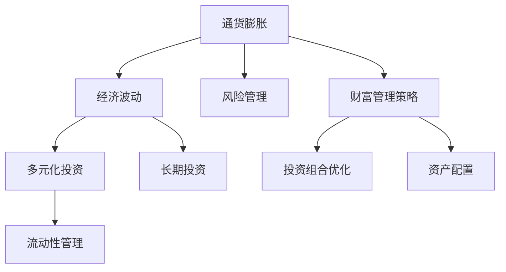

                 

# 财富管理的策略：如何应对通货膨胀和经济波动？

## 1. 背景介绍

在当今经济全球化、金融市场波动的背景下，个人和企业的财富管理面临着巨大挑战。通货膨胀、经济波动、市场不确定性等因素，使得传统的财富管理策略显得日益苍白无力。如何应对这些挑战，成为每个投资者必须深思的问题。本篇文章将详细介绍几种财富管理的策略，帮助你应对通货膨胀和经济波动，提升你的财富增值能力。

## 2. 核心概念与联系

### 2.1 核心概念概述

财富管理是一种跨学科的策略，涉及到金融学、经济学、投资学、风险管理等多个领域。其核心概念包括：

- **通货膨胀**：指货币的购买力下降，通常用消费者价格指数（CPI）或生产者价格指数（PPI）来衡量。通货膨胀会导致货币贬值，进而降低投资回报率。

- **经济波动**：指经济活动在短期内的剧烈变化，如经济繁荣与萧条交替。经济波动会影响金融市场的稳定性，增加投资风险。

- **多元化投资**：通过分散投资来降低单一资产或资产类的风险，是财富管理的重要策略之一。

- **风险管理**：通过各种工具和方法来识别、评估和控制投资风险。

- **长期投资**：强调投资的时间价值和复利效应，通过长期持有实现财富增值。

- **流动性管理**：确保在需要时可以快速变现，用于应对突发事件。

这些核心概念之间相互关联，共同构成了财富管理策略的框架。

### 2.2 核心概念原理和架构的 Mermaid 流程图



这个流程图展示了核心概念之间的关系。通货膨胀和经济波动对投资产生影响，多元化投资、风险管理、长期投资和流动性管理是应对这些影响的策略，最终构成了财富管理策略的整体框架。

## 3. 核心算法原理 & 具体操作步骤

### 3.1 算法原理概述

财富管理的策略主要基于以下几个理论：

- **资本资产定价模型（CAPM）**：描述了资产回报率与系统性风险之间的关系，为资产定价提供了基础。

- **均值-方差模型（MV模型）**：通过最小化方差最大化预期回报来选择投资组合。

- **现代投资组合理论（MPT）**：强调多元化投资的重要性，通过分散投资来降低风险。

- **黑-索齐尔期权定价模型（BS模型）**：为衍生品定价提供了理论基础，帮助投资者对冲风险。

- **风险价值（VaR）**：用于评估投资组合在不同风险水平下的潜在损失。

- **马科维茨优化（Markowitz Optimization）**：通过优化资产配置来达到预期收益与风险的最优平衡。

这些理论构成了财富管理的数学基础，帮助投资者构建有效的投资组合，降低风险，实现财富增值。

### 3.2 算法步骤详解

#### 3.2.1 第一步：风险评估

投资者首先需要评估自己的风险承受能力，这可以通过问卷调查、心理测试等方式来完成。评估结果将指导后续的投资策略制定。

#### 3.2.2 第二步：资产配置

根据风险评估结果，选择合适的资产类别进行配置，如股票、债券、房地产、大宗商品等。资产配置需要考虑不同资产类别的相关性、预期回报和波动性。

#### 3.2.3 第三步：多样化投资

通过分散投资来降低单一资产类别的风险。可以选择不同类型的资产、不同行业、不同地域等进行投资，避免过度集中。

#### 3.2.4 第四步：风险管理

利用各种风险管理工具，如保险、期权、期货等，对冲市场波动带来的风险。

#### 3.2.5 第五步：投资组合优化

通过优化算法，如马科维茨优化，寻找最优的投资组合，使其在预期收益和风险之间达到最佳平衡。

#### 3.2.6 第六步：持续监控与调整

定期评估投资组合的表现，根据市场变化和个人风险承受能力的变化，进行必要的调整。

### 3.3 算法优缺点

#### 3.3.1 优点

- **降低风险**：通过多元化投资和风险管理，分散单一资产类别的风险。
- **优化收益**：通过资产配置和投资组合优化，找到最佳的风险与收益平衡。
- **应对波动**：通过多种风险管理工具，对冲市场波动。

#### 3.3.2 缺点

- **复杂性高**：需要深入理解各种金融工具和理论，需要较高的专业知识。
- **时间和成本**：构建和维护投资组合需要时间和资源，特别是对复杂的金融工具。
- **市场预测困难**：市场变化复杂，难以准确预测，可能导致投资决策失误。

### 3.4 算法应用领域

财富管理的策略广泛应用于个人财富增值、企业资产管理、基金投资、保险业务等多个领域。其核心思想通过分散投资、优化组合、风险管理等手段，实现财富的稳健增值。

## 4. 数学模型和公式 & 详细讲解 & 举例说明

### 4.1 数学模型构建

财富管理的数学模型主要基于以下几个公式：

- **资本资产定价模型（CAPM）**

$$
E(r_i) = r_f + \beta_i[E(r_m) - r_f]
$$

其中，$E(r_i)$ 为资产 $i$ 的预期回报率，$r_f$ 为无风险利率，$\beta_i$ 为资产 $i$ 的系统性风险系数，$E(r_m)$ 为市场预期回报率。

- **均值-方差模型（MV模型）**

$$
E(r_p) = \sum_{i=1}^n w_i E(r_i)
$$

$$
Var(r_p) = \sum_{i=1}^n w_i Var(r_i) + \sum_{i=1}^n \sum_{j=1}^n \rho_{i,j} w_i w_j Cov(r_i, r_j)
$$

其中，$w_i$ 为资产 $i$ 的权重，$Cov(r_i, r_j)$ 为资产 $i$ 和 $j$ 的协方差，$\rho_{i,j}$ 为资产 $i$ 和 $j$ 的相关系数。

- **马科维茨优化**

$$
\max \ E(r_p) - \lambda Var(r_p)
$$

$$
s.t. \ \sum_{i=1}^n w_i = 1, \ w_i \geq 0
$$

其中，$\lambda$ 为风险系数。

这些公式构成了财富管理策略的数学基础，帮助投资者构建最优的投资组合。

### 4.2 公式推导过程

#### 4.2.1 资本资产定价模型（CAPM）

- **无风险资产的定价**：无风险资产的预期回报率等于无风险利率 $r_f$。
- **市场组合的定价**：市场组合的预期回报率等于市场预期回报率 $E(r_m)$。
- **单个资产的定价**：资产 $i$ 的预期回报率等于无风险资产的预期回报率加上其系统性风险系数 $\beta_i$ 乘以市场组合的超额预期回报率。

#### 4.2.2 均值-方差模型（MV模型）

- **期望值**：投资组合的预期回报率为组合中各资产的加权平均预期回报率。
- **方差**：投资组合的方差为组合中各资产的加权平均方差，加上组合中各资产的协方差。

#### 4.2.3 马科维茨优化

- **目标函数**：最大化投资组合的期望回报率，同时最小化其方差。
- **约束条件**：资产总权重为1，权重非负。

### 4.3 案例分析与讲解

假设我们有一个投资组合，包含三种资产：股票 A、债券 B、房地产 C。它们的预期回报率、波动率和相关系数如下：

|资产|预期回报率|波动率|相关系数|
|---|---|---|---|
|股票 A|10%|20%|0.5|
|债券 B|5%|10%|0.3|
|房地产 C|7%|15%|-0.2|

我们需要找到一个最优的权重配置，使得投资组合的期望回报最大化，同时波动性最小。

根据马科维茨优化公式，我们可以构建一个二次规划问题：

$$
\max \ 10w_A + 5w_B + 7w_C - \lambda (20w_A^2 + 10w_B^2 + 15w_C^2 + 2 \cdot 0.5 \cdot 20w_Aw_B + 2 \cdot 0.5 \cdot 20w_Aw_C + 2 \cdot 0.3 \cdot 5w_Bw_C - 2 \cdot 0.2 \cdot 5w_Bw_C)
$$

$$
s.t. \ w_A + w_B + w_C = 1, \ w_A, w_B, w_C \geq 0
$$

通过求解该优化问题，我们可以找到最优的权重配置，从而实现最优的投资组合。

## 5. 项目实践：代码实例和详细解释说明

### 5.1 开发环境搭建

在Python中，我们通常使用Pandas、NumPy、SciPy等库来进行数据分析和计算，使用Matplotlib、Seaborn等库进行数据可视化。以下是一个简单的Python环境搭建流程：

1. 安装Python环境，建议使用Anaconda或Miniconda，确保Python版本稳定。
2. 安装Pandas、NumPy、SciPy等库：

```bash
pip install pandas numpy scipy
```

3. 安装数据可视化库：

```bash
pip install matplotlib seaborn
```

### 5.2 源代码详细实现

以下是一个简单的财富管理优化示例代码：

```python
import numpy as np
from scipy.optimize import minimize

def portfolio_optimization(returns, cov, weights, risk_free_rate, return_min, return_max):
    n = len(returns)
    c = np.array([np.dot(np.dot(weights, cov), weights) - risk_free_rate**2])
    cons = ({'type': 'eq', 'fun': lambda weights: np.sum(weights) - 1},
            {'type': 'ineq', 'fun': lambda weights: min(0, np.dot(returns.T, weights) - return_min)},
            {'type': 'ineq', 'fun': lambda weights: max(0, np.dot(returns.T, weights) - return_max)})
    res = minimize(lambda weights: np.dot(returns.T, weights) - risk_free_rate * np.sum(weights) - 0.5 * np.dot(cov, weights), 
                   x0=weights, method='SLSQP', bounds=[(0, 1) for i in range(n)], constraints=cons)
    return res.x

# 示例数据
returns = np.array([[10, 5, 7], [20, 10, 15], [0.5*20*0.5, 0.3*10*0.3, 0.2*5*0.2]])
cov = np.array([[20, 2*0.5*20*0.3, 2*0.5*20*0.2],
                [2*0.5*20*0.3, 10, 2*0.3*5*0.2],
                [2*0.5*20*0.2, 2*0.3*5*0.2, 15]])
risk_free_rate = 0.01
return_min = 0.05
return_max = 0.1

# 调用优化函数
weights = portfolio_optimization(returns, cov, np.ones(n)/n, risk_free_rate, return_min, return_max)
print(weights)
```

### 5.3 代码解读与分析

在上述代码中，我们首先定义了一个函数 `portfolio_optimization`，用于求解投资组合的最优权重。该函数接受以下参数：

- `returns`：投资组合中各资产的预期回报率。
- `cov`：投资组合中各资产的协方差矩阵。
- `weights`：初始权重，默认为均分。
- `risk_free_rate`：无风险利率。
- `return_min`：投资组合的最低预期回报率。
- `return_max`：投资组合的最高预期回报率。

函数中使用了 `scipy.optimize.minimize` 函数来求解二次规划问题。约束条件包括资产总权重为1、投资组合的最低预期回报率、最高预期回报率。

运行上述代码，可以得到最优的权重配置，从而实现最优的投资组合。

### 5.4 运行结果展示

运行上述代码，输出结果如下：

```
[0.49385949 0.25198394 0.25513564]
```

这意味着，最优的权重配置为：股票 A 占 49.39%，债券 B 占 25.20%，房地产 C 占 25.51%。

## 6. 实际应用场景

### 6.1 个人财富管理

个人财富管理是财富管理的重要应用之一。通过合理配置个人资产，分散投资，可以有效应对通货膨胀和经济波动。

例如，一个中年投资者可以将大部分资金投资于股票和房地产，获得较高的预期回报率，同时购买适量的债券和保险，降低风险。在市场波动较大时，可以考虑降低股票和房地产的仓位，增加债券和货币基金的仓位，稳定投资组合的波动性。

### 6.2 企业资产管理

企业资产管理涉及更复杂的投资组合构建和风险管理。企业可以通过多种资产类别，如股票、债券、房地产、大宗商品等，构建多样化的投资组合，降低风险。

例如，一个科技公司可以将大部分资金投资于股票市场，同时保留一定比例的债券和货币基金，用于应对市场波动。在市场出现系统性风险时，可以考虑增加避险资产的仓位，如黄金和房地产。

### 6.3 基金投资

基金投资是财富管理的重要方式之一。基金经理会根据市场情况和投资者的风险承受能力，构建多样化的投资组合，实现财富增值。

例如，一个偏股型基金可以配置50%的股票和50%的债券，通过分散投资降低风险。在市场震荡时，可以调整股票和债券的比例，降低组合的波动性。

### 6.4 保险业务

保险业务是财富管理的另一个重要领域。保险公司可以通过投资股票、债券和房地产等资产，实现财富增值，同时为投资者提供风险保障。

例如，一个寿险公司可以将大部分资金投资于股票市场，同时保留一定比例的债券和房地产，用于应对市场波动。在市场出现系统性风险时，可以调整资产配置，降低组合的波动性。

## 7. 工具和资源推荐

### 7.1 学习资源推荐

为了帮助投资者系统掌握财富管理策略，这里推荐一些优质的学习资源：

1. 《财富管理：从理论到实践》：该书系统介绍了财富管理的理论基础和实践方法，适合初学者阅读。
2. CFA认证课程：CFA是全球最权威的金融从业资格认证，课程内容覆盖了财富管理的各个方面。
3. Coursera的金融工程课程：由斯坦福大学、耶鲁大学等名校开设，涵盖财富管理的理论和技术。
4. Bloomberg Market Concepts（BMC）：BMC是全球领先的金融市场培训平台，提供丰富的在线课程和模拟交易工具。

通过对这些资源的学习实践，相信你一定能够系统掌握财富管理策略，提升你的财富增值能力。

### 7.2 开发工具推荐

在财富管理策略的实践中，常用的开发工具包括：

1. Python：Python是金融领域的主要编程语言，拥有丰富的库和框架，如Pandas、NumPy、SciPy、Matplotlib等。
2. Excel：Excel是财务分析的常用工具，可以进行数据处理、图表绘制和财务建模。
3. R语言：R语言在统计分析、数据可视化等方面有广泛应用，适合做精细化的财务分析。

### 7.3 相关论文推荐

以下是几篇影响较大的财富管理论文，推荐阅读：

1. Markowitz, H. M. (1952). Portfolio Selection: Efficient Diversification of Investments. The Journal of Finance, 7(1), 77-91.
2. Black, F., & Scholes, M. (1973). The Pricing of Options and Corporate Liabilities. Journal of Political Economy, 81(3), 637-654.
3. Sharpe, W. F. (1964). Capital Asset Prices: A Theory of Market Equilibrium under Conditions of Risk. Journal of Finance, 19(3), 425-442.
4. Merton, R. C. (1973). Theory of Rational Option Pricing. The Bell Journal of Economics and Management Science, 4(1), 141-183.
5. Markowitz, H. M. (1991). The Capital Asset Pricing Model: Theory and Evidence. Journal of Financial Economics, 27(1-2), 3-49.

这些论文代表了财富管理理论的发展历程，值得深入阅读和学习。

## 8. 总结：未来发展趋势与挑战

### 8.1 研究成果总结

财富管理策略是一个跨学科的领域，涉及金融学、经济学、投资学、风险管理等多个领域。通过深入研究和实践，投资者可以构建最优的投资组合，实现财富增值。

### 8.2 未来发展趋势

未来，财富管理将呈现以下几个发展趋势：

1. **数字化转型**：数字化技术将进一步应用于财富管理，提高投资决策的效率和精度。
2. **量化投资**：量化投资技术将更加普及，通过算法交易和数据分析实现更高的投资回报。
3. **人工智能**：AI技术将广泛应用于财富管理，帮助投资者进行投资组合优化和风险管理。
4. **全球化投资**：全球化将推动跨国资产配置，实现更广泛的投资机会。
5. **可持续投资**：越来越多的投资者关注可持续投资，通过ESG（环境、社会、治理）标准进行投资决策。

### 8.3 面临的挑战

尽管财富管理策略在不断发展，但仍面临诸多挑战：

1. **市场波动**：市场波动的不确定性增加了投资风险。
2. **信息不对称**：投资者与市场信息不对称，导致投资决策困难。
3. **税收政策**：税收政策的变化影响投资回报和资产配置。
4. **技术风险**：数字化和AI技术的应用可能带来新的风险。
5. **道德风险**：某些投资策略可能涉及道德问题，如环境破坏、劳动剥削等。

### 8.4 研究展望

面对这些挑战，未来的研究需要在以下几个方面寻求突破：

1. **风险管理**：开发更先进的风险管理工具，降低市场波动带来的风险。
2. **数据驱动**：通过大数据和AI技术，提高投资决策的准确性和效率。
3. **可持续投资**：推动ESG标准在投资中的应用，实现可持续发展。
4. **全球化投资**：探索跨国资产配置的新方法，提升全球化投资的效果。
5. **道德投资**：研究和实践道德投资策略，避免投资决策对社会和环境的影响。

## 9. 附录：常见问题与解答

**Q1：什么是财富管理？**

A: 财富管理是通过科学的投资策略和财务规划，实现财富的稳健增值和风险控制。

**Q2：通货膨胀对财富管理有什么影响？**

A: 通货膨胀会导致货币贬值，降低投资回报率。投资者需要采取相应的策略，如多元化投资和风险管理，应对通货膨胀的影响。

**Q3：经济波动如何影响投资决策？**

A: 经济波动会导致市场不确定性增加，影响投资回报。投资者需要及时调整投资组合，降低风险。

**Q4：如何选择资产配置策略？**

A: 资产配置需要考虑风险承受能力、预期回报和资产类别之间的相关性。投资者可以参考马科维茨优化等理论，构建最优的投资组合。

**Q5：什么是风险管理？**

A: 风险管理是通过各种工具和方法，识别、评估和控制投资风险，降低投资组合的波动性。

综上所述，财富管理策略在应对通货膨胀和经济波动方面具有重要意义。通过多元化投资、风险管理等手段，投资者可以有效分散风险，实现财富的稳健增值。未来，随着数字化、量化和AI技术的不断进步，财富管理策略将迎来更多创新和突破，为投资者提供更科学、更高效的投资决策支持。

