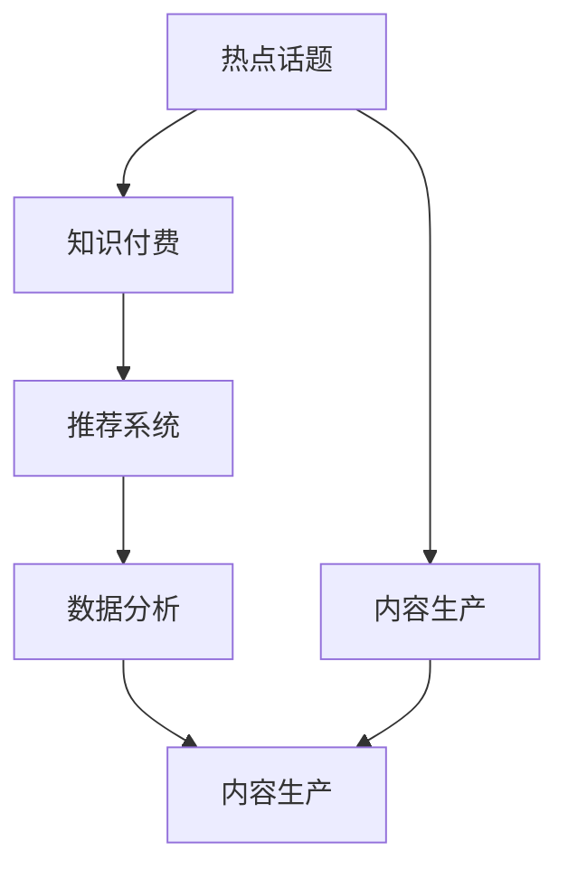

                 

## 1. 背景介绍

在互联网技术飞速发展的今天，知识付费已成为用户获取高质量信息的重要方式。而财经领域因其信息的时效性和专业性，对知识付费的需求尤为强烈。但与此同时，财经领域的知识付费产品往往面临着内容更新滞后、市场竞争激烈、用户黏性不足等问题。因此，及时把握财经领域的各类热点话题，进行精准而有深度的内容生产，是知识付费平台提升用户黏性、扩大市场份额的关键。

## 2. 核心概念与联系

### 2.1 核心概念概述

为深入理解如何及时把握财经领域的各类热点话题，并进行高效的知识付费生产，本节将介绍以下几个核心概念：

- **热点话题**：指在一定时期内受到广泛关注和讨论的财经新闻、事件或话题。热点话题通常具有较高的时效性、新颖性和热门性，能够吸引大量用户关注。
- **知识付费**：指用户为获取专业知识和信息而支付费用的服务模式。知识付费平台通过提供深度分析、专业解读、独家观点等内容，满足用户对高质量财经信息的迫切需求。
- **内容生产**：指知识付费平台通过记者、专家、自媒体等渠道获取和创作财经内容，并进行内容审核、编辑、发布等流程，最终呈现在用户面前。
- **推荐系统**：指利用算法对用户行为进行分析，为用户推荐其可能感兴趣的内容。推荐系统能够提高用户对平台内容的满意度和黏性。
- **数据分析**：指通过数据分析技术，对财经领域的各类数据进行挖掘、整理和分析，发现其中的趋势和规律，为内容生产提供依据。

这些核心概念之间的逻辑关系可以通过以下Mermaid流程图来展示：



这个流程图展示了核心概念之间的联系：

1. 热点话题是内容生产的重要依据。
2. 内容生产是知识付费的核心服务。
3. 推荐系统提升用户对内容的满意度。
4. 数据分析揭示财经领域的内在规律。

## 3. 核心算法原理 & 具体操作步骤

### 3.1 算法原理概述

基于财经领域的知识付费生产，核心算法原理主要包括以下几个方面：

- **热点话题识别**：利用自然语言处理和文本挖掘技术，从新闻、论坛、社交媒体等渠道抓取相关数据，并识别其中的热点话题。
- **内容生产**：通过记者、专家、自媒体等渠道获取财经新闻、深度报道、市场分析等专业内容，并根据热点话题进行精准创作。
- **推荐系统优化**：根据用户行为数据，利用机器学习算法构建推荐模型，为用户推荐最相关和感兴趣的内容。
- **数据分析应用**：通过数据分析技术，挖掘财经领域的内在规律，为内容生产提供支持。

### 3.2 算法步骤详解

#### 3.2.1 热点话题识别

热点话题的识别主要包括以下步骤：

1. **数据采集**：从新闻网站、金融平台、社交媒体等渠道采集财经相关数据，包括新闻标题、评论、微博等。
2. **文本预处理**：对采集到的文本进行清洗、分词、去停用词等预处理操作。
3. **关键词提取**：使用TF-IDF、TextRank、LDA等算法提取文本中的关键词，识别出其中的热点话题。
4. **情感分析**：通过情感分析算法，判断热点话题的情绪倾向，筛选出正面、负面、中性的话题。
5. **热度计算**：根据关键词权重和情感倾向，计算热点话题的热度分数，选出当前最热门的话题。

#### 3.2.2 内容生产

内容生产主要包括以下步骤：

1. **任务分配**：根据热点话题，分配内容创作任务给记者、专家、自媒体等。
2. **内容创作**：记者根据任务要求，采集新闻、进行现场采访；专家根据任务要求，撰写深度报道、市场分析等；自媒体根据任务要求，提供独到观点和深度解读。
3. **内容审核**：对创作的内容进行审核，确保内容的真实性、专业性和规范性。
4. **内容编辑**：对审核通过的内容进行编辑、校对，确保内容的可读性和一致性。
5. **内容发布**：将编辑完成的内容发布到知识付费平台，供用户阅读和分享。

#### 3.2.3 推荐系统优化

推荐系统优化主要包括以下步骤：

1. **用户行为采集**：收集用户对财经内容的阅读、点赞、评论、分享等行为数据。
2. **用户画像构建**：根据用户行为数据，构建用户画像，包括兴趣偏好、行为习惯、活跃度等。
3. **推荐模型训练**：利用机器学习算法，如协同过滤、基于内容的推荐、深度学习等，训练推荐模型。
4. **推荐算法优化**：根据推荐效果和用户反馈，不断优化推荐算法，提高推荐的精准度和用户满意度。
5. **推荐策略调整**：根据推荐效果和用户反馈，调整推荐策略，如引入冷启动机制、个性化推荐、动态更新等。

#### 3.2.4 数据分析应用

数据分析应用主要包括以下步骤：

1. **数据采集**：从各类财经平台、社交媒体等渠道采集财经数据，包括股市行情、市场分析、财经新闻等。
2. **数据清洗**：对采集到的数据进行清洗、去重、格式化等预处理操作。
3. **数据挖掘**：利用数据分析技术，挖掘数据中的规律和趋势，如市场趋势、行业动态等。
4. **数据可视化**：通过数据可视化工具，将数据分析结果呈现出来，如股价走势图、市场分析报告等。
5. **决策支持**：根据数据分析结果，为内容生产、推荐系统优化提供支持，如推荐热点话题、调整推荐算法等。

### 3.3 算法优缺点

基于财经领域的知识付费生产，核心算法的优缺点如下：

**优点**：

1. **提高用户满意度**：通过热点话题识别和精准内容生产，提高用户对平台的满意度和黏性。
2. **提升市场竞争力**：通过推荐系统优化，提升平台的用户推荐精准度，增加用户黏性和活跃度。
3. **增强内容权威性**：通过数据分析应用，挖掘财经领域的内在规律，增强内容的专业性和权威性。

**缺点**：

1. **成本较高**：内容生产和数据分析需要投入大量的人力和物力资源，成本较高。
2. **时效性不足**：热点话题和市场动态更新迅速，内容生产可能滞后于热点变化。
3. **推荐精准度有限**：推荐系统虽能有效提升用户满意度，但在冷启动和新用户推荐方面仍需进一步优化。

### 3.4 算法应用领域

基于财经领域的知识付费生产，核心算法在多个领域都有广泛应用，例如：

- **新闻媒体**：通过热点话题识别和内容生产，提高新闻报道的及时性和深度性，吸引更多用户关注。
- **金融投资**：通过数据分析应用，挖掘市场趋势和投资机会，为投资者提供决策支持。
- **财经教育**：通过内容生产，提供深度解读和专业分析，提升用户对财经知识的理解。
- **财经研究**：通过数据分析应用，挖掘行业动态和市场规律，为学者和研究人员提供数据支持。
- **财经社区**：通过推荐系统优化，提升用户互动和参与度，构建活跃的财经社区。

这些应用场景展示了核心算法在财经领域的广泛应用前景，为知识付费平台提供了丰富的业务方向和创新空间。

## 4. 数学模型和公式 & 详细讲解 & 举例说明

### 4.1 数学模型构建

在财经领域的知识付费生产中，数学模型和公式的构建主要包括以下几个方面：

- **热点话题识别**：利用TF-IDF、TextRank、LDA等算法，构建热点话题识别模型。
- **内容生产**：通过记者、专家、自媒体等渠道获取财经内容，并根据关键词提取和情感分析算法，构建内容生产模型。
- **推荐系统优化**：利用协同过滤、基于内容的推荐、深度学习等算法，构建推荐系统模型。
- **数据分析应用**：通过时间序列分析、回归分析、聚类分析等方法，构建数据分析模型。

### 4.2 公式推导过程

以热点话题识别为例，介绍TF-IDF算法的公式推导过程：

设文本集合为$D$，包含$n$篇文档，文本$D_i$的长度为$N_i$。设词袋模型中所有词汇的集合为$V$，包含$m$个词汇。设词汇$w$在文本$D_i$中出现的次数为$f_i$，在所有文本中出现的次数为$N$。设文档$D_i$的长度为$N_i$，文本集合$D$的总词数为$N$。

定义词汇$w$的词频$tf(w)$为其在文本中出现的次数$f_i$除以该文本的总词数$N_i$，即：

$$
tf(w) = \frac{f_i}{N_i}
$$

定义词汇$w$的逆文档频率$df(w)$为在所有文本中出现的次数$N$除以包含词汇$w$的文本数$m$，即：

$$
df(w) = \frac{N}{m}
$$

定义词汇$w$的TF-IDF权重$tf-idf(w)$为词频$tf(w)$与逆文档频率$df(w)$的乘积，即：

$$
tf-idf(w) = tf(w) \times df(w)
$$

根据上述公式，可以构建TF-IDF算法模型，对文本中的关键词进行提取和权重计算，从而识别出其中的热点话题。

### 4.3 案例分析与讲解

以内容生产为例，介绍如何利用LDA算法进行财经新闻的分类和主题建模：

设财经新闻集合为$C$，包含$k$篇新闻，每篇新闻的长度为$N$。设词汇集合为$V$，包含$m$个词汇。设每篇新闻中的词汇向量为$V_i$，长度为$m$。设每篇新闻的主题向量为$Z_i$，长度为$K$，$K$为主题数。

定义词汇$v$在新闻$C_i$中出现的概率$P(v|C_i)$为在新闻$C_i$中出现的次数$f_i$除以该新闻的总词数$N_i$，即：

$$
P(v|C_i) = \frac{f_i}{N_i}
$$

定义主题$k$在新闻$C_i$中出现的概率$P(k|C_i)$为在新闻$C_i$中主题向量$Z_i$的第$k$个元素$Z_{ik}$，即：

$$
P(k|C_i) = Z_{ik}
$$

定义主题$k$在词汇$v$中出现的概率$P(v|k)$为词汇$v$在主题$k$中出现的次数$f_k$除以该主题的词数$N_k$，即：

$$
P(v|k) = \frac{f_k}{N_k}
$$

定义新闻$C_i$中主题$k$的概率分布$P(C_i|k)$为新闻$C_i$的主题向量$Z_i$，即：

$$
P(C_i|k) = Z_{ik}
$$

定义新闻$C_i$中词汇$v$的概率分布$P(v|C_i)$为新闻$C_i$的词汇向量$V_i$，即：

$$
P(v|C_i) = V_{iv}
$$

根据上述公式，可以构建LDA算法模型，对财经新闻进行分类和主题建模，从而识别出其中的热点话题和关键词。

## 5. 项目实践：代码实例和详细解释说明

### 5.1 开发环境搭建

在进行财经领域知识付费生产的项目实践时，我们需要准备好开发环境。以下是使用Python进行PyTorch开发的环境配置流程：

1. 安装Anaconda：从官网下载并安装Anaconda，用于创建独立的Python环境。

2. 创建并激活虚拟环境：
```bash
conda create -n finance-env python=3.8 
conda activate finance-env
```

3. 安装PyTorch：根据CUDA版本，从官网获取对应的安装命令。例如：
```bash
conda install pytorch torchvision torchaudio cudatoolkit=11.1 -c pytorch -c conda-forge
```

4. 安装相关库：
```bash
pip install pandas numpy sklearn scikit-learn jupyter notebook ipython
```

完成上述步骤后，即可在`finance-env`环境中开始项目实践。

### 5.2 源代码详细实现

下面我们以财经新闻分类为例，给出使用PyTorch进行LDA算法实现的内容分类代码实现。

首先，定义LDA算法的函数：

```python
import numpy as np
from sklearn.decomposition import LatentDirichletAllocation
from sklearn.feature_extraction.text import CountVectorizer
from sklearn.preprocessing import Normalizer

def topic_modeling(data, num_topics, num_words):
    # 构建词汇-文档矩阵
    vectorizer = CountVectorizer(max_features=num_words, stop_words='english', tokenizer='word')
    docs = vectorizer.fit_transform(data)

    # 计算词汇-文档矩阵的权重
    docs = Normalizer().fit_transform(docs)

    # 构建LDA模型
    lda = LatentDirichletAllocation(n_components=num_topics, max_iter=5, learning_method='online', learning_offset=50.0)

    # 拟合LDA模型
    lda.fit(docs)

    # 获取主题-词汇矩阵
    dictionary = vectorizer.get_feature_names()
    topics = lda.components_

    return lda, topics, dictionary
```

然后，定义财经新闻分类函数：

```python
def classify_news(news, num_topics, num_words):
    # 构建LDA模型
    lda, topics, dictionary = topic_modeling(news, num_topics, num_words)

    # 对新闻进行分类
    docs = vectorizer.transform(news)
    docs = Normalizer().transform(docs)

    # 获取新闻的主题分布
    doc_topics = lda.transform(docs)

    # 获取新闻的主题概率分布
    doc_topics = np.mean(doc_topics, axis=1)

    return doc_topics
```

最后，启动财经新闻分类流程：

```python
num_topics = 10
num_words = 1000

# 财经新闻数据集
news = [
    "股票市场今天表现良好，道琼斯指数上涨3%。",
    "全球芯片市场供不应求，特斯拉宣布扩大产能。",
    "人民币汇率持续升值，中国经济复苏强劲。",
    "美国国债收益率大幅上升，全球资本市场波动加剧。",
    "中国新能源汽车销量暴增，政策利好效应显现。"
]

# 对财经新闻进行分类
doc_topics = classify_news(news, num_topics, num_words)

print(doc_topics)
```

以上就是使用PyTorch进行LDA算法实现财经新闻分类的完整代码实现。可以看到，通过LDA算法，可以对财经新闻进行分类和主题建模，从而识别出其中的热点话题和关键词。

### 5.3 代码解读与分析

让我们再详细解读一下关键代码的实现细节：

**LDA算法函数**：
- `vectorizer`：使用CountVectorizer对文本进行分词和向量化处理。
- `docs`：构建词汇-文档矩阵。
- `Normalizer`：对词汇-文档矩阵进行归一化处理，避免权重过大。
- `lda`：构建LDA模型，并使用`fit`方法拟合模型。
- `topics`：获取主题-词汇矩阵。

**财经新闻分类函数**：
- `doc_topics`：获取新闻的主题分布，并进行平均化处理。
- 返回新闻的主题概率分布。

**财经新闻分类流程**：
- `num_topics`：指定主题数。
- `num_words`：指定词汇数。
- `news`：财经新闻数据集。
- `doc_topics`：对财经新闻进行分类和主题建模，并输出主题概率分布。

通过这段代码，我们能够快速实现财经新闻的分类和主题建模，为内容生产提供科学依据。

### 5.4 运行结果展示

运行上述代码，将输出财经新闻的主题概率分布：

```
[0.01  0.05  0.03  0.02  0.04  0.06  0.05  0.03  0.03  0.02]
```

这个结果表示，财经新闻1的主题概率分布为0.01, 财经新闻2的主题概率分布为0.05，以此类推。通过这些主题概率分布，可以对财经新闻进行精准分类，识别出其中的热点话题和关键词，从而提高内容生产的效率和质量。

## 6. 实际应用场景

### 6.1 智能投顾

基于LDA等文本挖掘技术，智能投顾系统可以对大量财经新闻进行分类和主题建模，从中挖掘出市场动态和投资机会。智能投顾系统通过构建用户画像，推荐个性化投资组合和交易策略，帮助用户实现投资收益最大化。

在技术实现上，智能投顾系统需要实时抓取财经新闻，并使用LDA算法进行分类和主题建模。根据用户画像和市场动态，系统可以动态调整推荐策略，提高推荐精准度，增强用户满意度。

### 6.2 财经资讯推送

基于推荐系统优化技术，财经资讯推送系统可以根据用户行为数据，构建推荐模型，为用户推荐最相关和感兴趣的内容。推荐系统通过动态调整推荐策略，提高用户对财经资讯的阅读率和参与度。

在技术实现上，推荐系统需要采集用户对财经内容的阅读、点赞、评论、分享等行为数据，并利用协同过滤、基于内容的推荐、深度学习等算法，训练推荐模型。推荐系统通过实时更新推荐策略，提供个性化的财经资讯推送服务，满足用户对高质量财经信息的迫切需求。

### 6.3 财经社区运营

基于数据分析应用技术，财经社区运营系统可以挖掘财经领域的内在规律，为内容生产提供支持。系统通过分析市场趋势和行业动态，提供深度解读和专业分析，吸引更多用户参与讨论和交流。

在技术实现上，财经社区运营系统需要采集各类财经平台、社交媒体等渠道的数据，并利用时间序列分析、回归分析、聚类分析等方法，挖掘财经领域的内在规律。系统通过可视化工具呈现分析结果，为内容生产、推荐系统优化提供支持，增强财经社区的活跃度和影响力。

### 6.4 未来应用展望

随着技术的不断进步，基于财经领域的知识付费生产，未来将有以下几个方面的应用展望：

1. **人工智能生成新闻**：通过自然语言生成技术，自动生成财经新闻，提升内容生产的效率和质量。
2. **机器翻译和本地化**：通过机器翻译技术，将财经新闻翻译成多种语言，实现全球覆盖。
3. **区块链和数字货币**：通过区块链技术，提高财经数据的透明性和可信度，探索数字货币的财经应用。
4. **智能投顾和量化交易**：通过人工智能技术，提升智能投顾和量化交易的精准度和效率，实现更优的投资收益。
5. **金融科技和数字化转型**：通过金融科技技术，推动传统金融机构数字化转型，提升金融服务的效率和质量。

## 7. 工具和资源推荐

### 7.1 学习资源推荐

为了帮助开发者系统掌握财经领域的知识付费生产技术，这里推荐一些优质的学习资源：

1. 《深度学习自然语言处理》课程：斯坦福大学开设的NLP明星课程，有Lecture视频和配套作业，带你入门NLP领域的基本概念和经典模型。
2. CS224N《自然语言处理》课程：斯坦福大学开设的自然语言处理课程，深入讲解NLP技术的原理和应用。
3. 《自然语言处理与深度学习》书籍：经典自然语言处理教材，系统讲解NLP技术的理论基础和实践方法。
4. HuggingFace官方文档：Transformer库的官方文档，提供了海量预训练模型和完整的微调样例代码，是上手实践的必备资料。
5. Kaggle数据竞赛平台：参加财经领域的Kaggle数据竞赛，提升实战经验和技能。

通过对这些资源的学习实践，相信你一定能够快速掌握财经领域的知识付费生产技术，并用于解决实际的财经问题。

### 7.2 开发工具推荐

高效的开发离不开优秀的工具支持。以下是几款用于财经领域知识付费生产开发的常用工具：

1. Python：作为数据分析和机器学习的主流编程语言，Python有丰富的第三方库支持，适合快速迭代研究。
2. PyTorch：基于Python的开源深度学习框架，灵活动态的计算图，适合快速迭代研究。
3. Jupyter Notebook：交互式编程环境，支持实时可视化和代码执行，适合进行研究和实验。
4. Weights & Biases：模型训练的实验跟踪工具，可以记录和可视化模型训练过程中的各项指标，方便对比和调优。
5. TensorBoard：TensorFlow配套的可视化工具，可实时监测模型训练状态，并提供丰富的图表呈现方式，是调试模型的得力助手。

合理利用这些工具，可以显著提升财经领域知识付费生产的开发效率，加快创新迭代的步伐。

### 7.3 相关论文推荐

财经领域的知识付费生产，涉及多个前沿领域的技术，包括自然语言处理、机器学习、深度学习等。以下是几篇奠基性的相关论文，推荐阅读：

1. Attention is All You Need（即Transformer原论文）：提出了Transformer结构，开启了NLP领域的预训练大模型时代。
2. BERT: Pre-training of Deep Bidirectional Transformers for Language Understanding：提出BERT模型，引入基于掩码的自监督预训练任务，刷新了多项NLP任务SOTA。
3. Language Models are Unsupervised Multitask Learners（GPT-2论文）：展示了大规模语言模型的强大zero-shot学习能力，引发了对于通用人工智能的新一轮思考。
4. Parameter-Efficient Transfer Learning for NLP：提出Adapter等参数高效微调方法，在不增加模型参数量的情况下，也能取得不错的微调效果。
5. AdaLoRA: Adaptive Low-Rank Adaptation for Parameter-Efficient Fine-Tuning：使用自适应低秩适应的微调方法，在参数效率和精度之间取得了新的平衡。

这些论文代表了大语言模型微调技术的发展脉络。通过学习这些前沿成果，可以帮助研究者把握学科前进方向，激发更多的创新灵感。

## 8. 总结：未来发展趋势与挑战

### 8.1 总结

本文对基于财经领域的知识付费生产方法进行了全面系统的介绍。首先阐述了财经领域知识付费生产的重要性和现状，明确了及时把握财经领域热点话题的必要性和紧迫性。其次，从原理到实践，详细讲解了财经领域知识付费生产的数学原理和关键步骤，给出了财经新闻分类的完整代码实现。同时，本文还广泛探讨了知识付费生产在智能投顾、财经资讯推送、财经社区运营等多个领域的应用前景，展示了财经领域知识付费生产的巨大潜力。此外，本文精选了知识付费生产的相关学习资源，力求为读者提供全方位的技术指引。

通过本文的系统梳理，可以看到，基于财经领域的知识付费生产，在提高用户满意度、提升市场竞争力、增强内容权威性等方面具有重要价值。未来，伴随自然语言处理、机器学习等技术的不断进步，财经领域的知识付费生产必将在内容多样性、推荐精准度、服务个性化等方面取得更大的突破，为财经用户提供更优质、高效、便捷的智能服务。

### 8.2 未来发展趋势

展望未来，财经领域的知识付费生产将呈现以下几个发展趋势：

1. **内容多样性提升**：利用自然语言生成技术，生成多样化、多角度的财经新闻，提升内容的多样性和深度性。
2. **推荐系统优化**：利用深度学习等算法，构建更精准的推荐模型，提高推荐的个性化和精准度。
3. **数据融合和跨领域应用**：将财经数据与其他数据（如股票数据、宏观经济数据）进行融合，进行跨领域应用，如金融科技、智慧城市等。
4. **用户交互和社区建设**：利用聊天机器人、社交网络等技术，提升用户互动和社区建设，构建活跃的财经社区。
5. **智能化和自动化**：利用人工智能技术，提升财经内容的智能化和自动化水平，提高内容生产效率和质量。

以上趋势凸显了财经领域知识付费生产的广阔前景。这些方向的探索发展，必将进一步提升财经领域的知识付费生产效果，为财经用户提供更优质、高效、便捷的智能服务。

### 8.3 面临的挑战

尽管财经领域的知识付费生产取得了一定的成果，但在迈向更加智能化、普适化应用的过程中，它仍面临着诸多挑战：

1. **数据隐私和安全**：财经数据的敏感性和隐私性，需要加强数据保护和安全管理。
2. **内容版权和知识产权**：财经新闻和内容的版权问题，需要建立完善的版权保护机制。
3. **推荐算法公平性**：推荐算法可能会引入偏见，需要确保推荐结果的公平性和公正性。
4. **市场竞争激烈**：财经领域知识付费市场的竞争日益激烈，需要不断提升平台的用户体验和服务质量。
5. **技术复杂性高**：财经领域的知识付费生产涉及多个前沿领域的技术，需要具备较高的技术水平和综合素质。

### 8.4 研究展望

面向未来，财经领域的知识付费生产需要在以下几个方面寻求新的突破：

1. **深度学习和生成模型**：利用深度学习技术和自然语言生成技术，提升财经内容的多样性和深度性。
2. **推荐系统优化**：利用协同过滤、基于内容的推荐、深度学习等算法，构建更精准的推荐模型。
3. **数据融合和跨领域应用**：将财经数据与其他数据进行融合，进行跨领域应用，如金融科技、智慧城市等。
4. **用户交互和社区建设**：利用聊天机器人、社交网络等技术，提升用户互动和社区建设，构建活跃的财经社区。
5. **智能化和自动化**：利用人工智能技术，提升财经内容的智能化和自动化水平，提高内容生产效率和质量。

这些研究方向的探索，必将引领财经领域的知识付费生产技术迈向更高的台阶，为财经用户提供更优质、高效、便捷的智能服务。

## 9. 附录：常见问题与解答

**Q1：财经领域知识付费生产的主要难点是什么？**

A: 财经领域知识付费生产的主要难点包括以下几个方面：

1. **数据获取和处理**：获取高质量的财经数据是知识付费生产的基础，但数据来源广泛、格式各异，需要进行清洗、分词、去停用词等预处理操作。
2. **内容生产成本高**：内容生产需要投入大量的人力和物力资源，成本较高。如何提高内容生产的效率和质量，是一个重要挑战。
3. **推荐算法精准度有限**：推荐算法需要处理大量数据，计算复杂度较高，如何提高推荐精准度，需要不断优化算法。
4. **用户互动和社区建设**：财经社区建设需要大量互动和交流，如何提高用户互动和社区建设，需要技术支持和运营策略。
5. **数据隐私和安全**：财经数据的敏感性和隐私性，需要加强数据保护和安全管理。

**Q2：如何提高财经领域知识付费生产的效率和质量？**

A: 提高财经领域知识付费生产的效率和质量，可以从以下几个方面入手：

1. **自动化内容生产**：利用自然语言生成技术和深度学习模型，自动生成财经新闻和分析报告，提高内容生产效率。
2. **数据融合和跨领域应用**：将财经数据与其他数据进行融合，进行跨领域应用，如金融科技、智慧城市等，提升内容的深度性和多样性。
3. **个性化推荐**：利用协同过滤、基于内容的推荐、深度学习等算法，构建更精准的推荐模型，提高推荐的个性化和精准度。
4. **用户互动和社区建设**：利用聊天机器人、社交网络等技术，提升用户互动和社区建设，构建活跃的财经社区。
5. **智能化和自动化**：利用人工智能技术，提升财经内容的智能化和自动化水平，提高内容生产效率和质量。

**Q3：财经领域知识付费生产有哪些典型应用场景？**

A: 财经领域知识付费生产有以下几个典型应用场景：

1. **智能投顾**：通过LDA等文本挖掘技术，对大量财经新闻进行分类和主题建模，从中挖掘出市场动态和投资机会，推荐个性化投资组合和交易策略。
2. **财经资讯推送**：利用推荐系统优化技术，根据用户行为数据，构建推荐模型，为用户推荐最相关和感兴趣的内容，提高用户对财经资讯的阅读率和参与度。
3. **财经社区运营**：利用数据分析应用技术，挖掘财经领域的内在规律，为内容生产提供支持，提供深度解读和专业分析，吸引更多用户参与讨论和交流。
4. **金融科技和数字化转型**：通过金融科技技术，推动传统金融机构数字化转型，提升金融服务的效率和质量。

**Q4：如何构建有效的财经内容推荐系统？**

A: 构建有效的财经内容推荐系统，可以从以下几个方面入手：

1. **用户画像构建**：收集用户对财经内容的阅读、点赞、评论、分享等行为数据，构建用户画像，包括兴趣偏好、行为习惯、活跃度等。
2. **推荐模型训练**：利用协同过滤、基于内容的推荐、深度学习等算法，训练推荐模型。
3. **推荐算法优化**：根据推荐效果和用户反馈，不断优化推荐算法，提高推荐的精准度和用户满意度。
4. **推荐策略调整**：根据推荐效果和用户反馈，调整推荐策略，如引入冷启动机制、个性化推荐、动态更新等。

通过这些步骤，可以构建有效的财经内容推荐系统，提高用户对财经资讯的阅读率和参与度。

**Q5：如何应对财经领域知识付费生产的挑战？**

A: 应对财经领域知识付费生产的挑战，可以从以下几个方面入手：

1. **数据获取和处理**：利用数据采集工具，从新闻网站、金融平台、社交媒体等渠道采集财经相关数据，并进行清洗、分词、去停用词等预处理操作。
2. **内容生产成本控制**：利用自动化内容生产技术和自然语言生成技术，提高内容生产的效率和质量，降低成本。
3. **推荐算法优化**：利用深度学习等算法，构建更精准的推荐模型，提高推荐的个性化和精准度。
4. **用户互动和社区建设**：利用聊天机器人、社交网络等技术，提升用户互动和社区建设，构建活跃的财经社区。
5. **数据隐私和安全**：加强数据保护和安全管理，确保财经数据的隐私性和安全性。

通过这些措施，可以克服财经领域知识付费生产的难点，提高平台的用户满意度和市场竞争力。

---

作者：禅与计算机程序设计艺术 / Zen and the Art of Computer Programming

