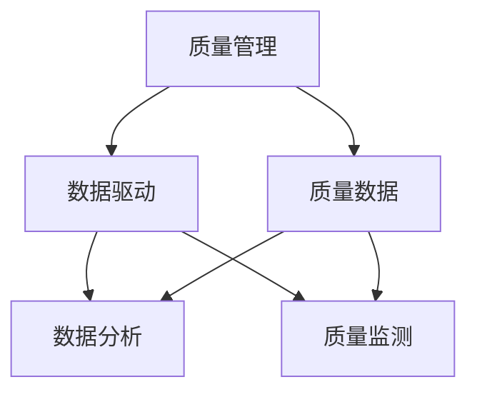
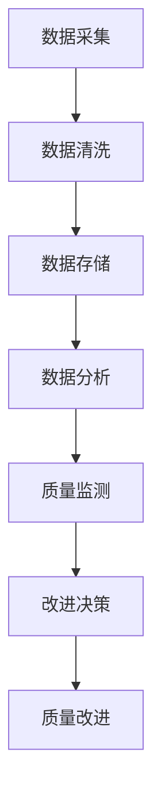

                 

# 质量管理：追求卓越的持续改进之路

## 1. 背景介绍

### 1.1 问题由来

在当今数字化、智能化的浪潮下，企业的经营模式、产品形态、服务方式都在发生深刻变化。质量管理作为企业持续改进的重要手段，其意义和作用愈发凸显。传统的质量管理更多依赖人工监控、检查，而数字化的质量管理则能够借助大数据、AI等技术，实现更高效、更全面的质量监控与改进。

在实践中，企业往往面临以下挑战：
- 数据孤岛问题：各部门的数据系统孤立，难以形成统一的质量视角。
- 质量检测效率低：人工检测覆盖面有限，无法及时发现潜在的质量问题。
- 改进决策难：数据分散，难以获得全面、系统的质量改进方向。
- 反馈链路长：质量问题反馈环节多，改进周期长，影响生产效率。

为了解决这些问题，需要引入一套系统化、科学化的质量管理体系，依托数字化技术，实现全面、实时、自动化的质量监控与持续改进。本文将围绕质量管理的数字化转型展开探讨，提供一套系统化的解决方案。

## 2. 核心概念与联系

### 2.1 核心概念概述

为更好地理解质量管理的数字化转型，首先需要澄清几个关键概念：

- **质量管理**：指为确保产品或服务符合预期标准，实施的一系列管理活动。涵盖质量规划、质量控制、质量保证、质量改进等环节。
- **质量数据**：指与质量相关的各类数据，如产品缺陷、客户反馈、生产过程参数等。是质量管理的核心资源。
- **数据驱动**：指通过数据分析、建模，辅助决策的过程。数据驱动的质量管理能够更科学、更精准地识别问题，提出改进方案。
- **数字化质量管理**：指利用数字化技术，对质量数据进行收集、存储、分析和应用的过程。包括数据采集、数据分析、质量监测、改进决策等环节。

这些核心概念之间的逻辑关系可以通过以下Mermaid流程图来展示：



这个流程图展示了一系列核心概念之间的关联：

1. **质量管理**是主流程，涵盖质量规划、质量控制、质量保证、质量改进等环节。
2. **质量数据**是质量管理的核心资源，通过对质量数据的采集和分析，推动质量管理。
3. **数据驱动**是质量管理的重要支撑，通过数据分析、建模等技术手段，提高质量管理效率和效果。
4. **数字化质量管理**是质量管理实现数据驱动的关键途径，借助数字化技术，实现全面、实时、自动化的质量监控与持续改进。

### 2.2 核心概念原理和架构的 Mermaid 流程图



此图展示了数字化质量管理的基本流程：

1. **数据采集**：通过各类传感器、设备、系统，获取全面的质量数据。
2. **数据清洗**：对原始数据进行预处理，去除异常、缺失等无效数据，提高数据质量。
3. **数据存储**：利用数据库、数据湖等技术手段，对清洗后的数据进行集中存储。
4. **数据分析**：借助AI、机器学习等技术，对质量数据进行深度分析，提取有价值的信息。
5. **质量监测**：通过数据分析结果，实时监控生产过程、产品质量等关键指标，及时发现问题。
6. **改进决策**：基于质量监测结果，提出改进方案，优化生产流程、提升产品质量。
7. **质量改进**：执行改进方案，实施质量提升措施，持续优化产品和服务质量。

这些环节形成一个闭环，帮助企业实现全面、实时、自动化的质量监控与持续改进。

## 3. 核心算法原理 & 具体操作步骤

### 3.1 算法原理概述

数字化质量管理的核心算法原理主要包括数据采集、数据清洗、数据分析、质量监测、改进决策等环节。下面我们分别介绍这些关键算法的原理与操作步骤。

### 3.2 算法步骤详解

#### 3.2.1 数据采集

数据采集是质量管理的第一步，需要收集全面的质量数据。数据来源包括传感器、生产设备、质量检测系统、客户反馈系统等。具体操作如下：

1. **传感器部署**：在生产设备、产品上部署各类传感器，采集实时数据。
2. **设备接口接入**：将生产设备的接口接入数据采集系统，实现数据自动上传。
3. **系统集成**：将各类质量检测系统、客户反馈系统与数据采集系统集成，实现数据统一采集。

#### 3.2.2 数据清洗

数据清洗是数据质量管理的重要环节，需要去除噪声、异常、缺失等无效数据，确保数据的准确性和完整性。具体操作如下：

1. **异常检测**：使用统计方法、机器学习算法，检测数据中的异常值，并进行处理。
2. **缺失值处理**：使用插值、均值填补等方法，处理数据中的缺失值。
3. **数据格式转换**：将不同格式的数据进行统一，方便后续处理。

#### 3.2.3 数据分析

数据分析是质量管理的核心环节，通过数据分析能够发现质量问题的根本原因，提出改进方案。具体操作如下：

1. **数据预处理**：对数据进行归一化、标准化等预处理操作，提高数据质量。
2. **特征提取**：使用统计方法、机器学习算法，提取数据的特征。
3. **模型建立**：建立质量监测模型，如回归模型、分类模型等。
4. **预测与评估**：使用模型对数据进行预测，评估预测效果。

#### 3.2.4 质量监测

质量监测是质量管理的关键环节，通过实时监控生产过程、产品质量等关键指标，及时发现问题。具体操作如下：

1. **指标定义**：定义与质量相关的关键指标，如产品缺陷率、生产效率、客户满意度等。
2. **实时监控**：利用数据分析模型，实时监控关键指标的变化。
3. **告警与报警**：当指标超出预设阈值时，自动触发告警，提醒相关人员。

#### 3.2.5 改进决策

改进决策是质量管理的最终环节，通过数据分析结果，提出改进方案，优化生产流程、提升产品质量。具体操作如下：

1. **问题分析**：分析质量监测结果，找出问题所在。
2. **原因分析**：通过数据分析、专家访谈等方式，分析问题的根本原因。
3. **改进方案**：制定改进方案，如工艺优化、设备维护、人员培训等。
4. **实施与评估**：执行改进方案，并持续监控效果，评估改进效果。

### 3.3 算法优缺点

数字化质量管理具有以下优点：

1. **全面性**：数据采集全面覆盖生产过程、产品质量、客户反馈等各个环节，能够形成统一的质量视角。
2. **实时性**：通过实时数据监控，能够及时发现问题，减少质量损失。
3. **自动化**：借助数字化技术，实现自动化的数据采集、清洗、分析，提高效率。
4. **科学性**：通过数据分析、建模等技术手段，提高质量管理决策的科学性和准确性。

同时，数字化质量管理也存在以下缺点：

1. **数据质量要求高**：数据采集、清洗、分析等环节需要高质量的数据，否则会影响分析结果的准确性。
2. **技术门槛高**：需要掌握数据分析、机器学习等技术，对技术门槛有一定要求。
3. **投入成本高**：数据采集、存储、分析等环节需要较高的技术投入和硬件设备投入。

### 3.4 算法应用领域

数字化质量管理在多个领域具有广泛的应用，具体如下：

1. **制造业**：通过质量数据采集、分析，提升产品质量，降低生产成本。
2. **医疗健康**：通过质量数据分析，优化诊疗流程，提升医疗服务质量。
3. **金融服务**：通过质量数据监控，防范金融风险，提升服务质量。
4. **零售电商**：通过质量数据分析，优化供应链管理，提升客户满意度。
5. **政府服务**：通过质量数据监控，优化政务服务，提升政府效能。

## 4. 数学模型和公式 & 详细讲解 & 举例说明

### 4.1 数学模型构建

数字化质量管理涉及多个数学模型，以下是其中的几个关键模型：

#### 4.1.1 质量监测模型

假设企业产品质量受多种因素影响，如原材料质量、生产工艺、设备状态等，可以通过建立多维回归模型来预测产品质量。设产品质量为 $y$，影响因素为 $x_1, x_2, \dots, x_n$，则质量监测模型的形式为：

$$
y = \beta_0 + \beta_1 x_1 + \beta_2 x_2 + \dots + \beta_n x_n + \epsilon
$$

其中 $\beta_0, \beta_1, \beta_2, \dots, \beta_n$ 为回归系数，$\epsilon$ 为误差项。

#### 4.1.2 异常检测模型

异常检测模型用于识别数据中的异常值，常用方法包括统计方法、机器学习算法等。以统计方法为例，可以使用标准差、四分位数等方法检测异常值。设 $x_1, x_2, \dots, x_n$ 为样本数据，则检测第 $i$ 个样本的异常值，可以使用如下公式：

$$
z_i = \frac{x_i - \mu}{\sigma}
$$

其中 $\mu$ 为样本均值，$\sigma$ 为样本标准差，$z_i$ 为标准化后的值。当 $z_i$ 超出预设阈值时，该样本被标记为异常值。

### 4.2 公式推导过程

#### 4.2.1 质量监测模型推导

以线性回归模型为例，假设样本数据为 $(x_1, y_1), (x_2, y_2), \dots, (x_n, y_n)$，回归系数为 $\beta_0, \beta_1, \beta_2, \dots, \beta_n$，则最小二乘法求解回归系数的过程如下：

1. 计算样本均值 $\bar{x}, \bar{y}$：
$$
\bar{x} = \frac{1}{n} \sum_{i=1}^n x_i
$$
$$
\bar{y} = \frac{1}{n} \sum_{i=1}^n y_i
$$

2. 计算样本协方差矩阵 $S_{xx}, S_{xy}, S_{yy}$：
$$
S_{xx} = \frac{1}{n-1} \sum_{i=1}^n (x_i - \bar{x})(x_i - \bar{x})
$$
$$
S_{xy} = \frac{1}{n-1} \sum_{i=1}^n (x_i - \bar{x})(y_i - \bar{y})
$$
$$
S_{yy} = \frac{1}{n-1} \sum_{i=1}^n (y_i - \bar{y})^2
$$

3. 求解回归系数：
$$
\beta_0 = \bar{y} - \beta_1 \bar{x}
$$
$$
\beta_1 = \frac{S_{xy}}{S_{xx}}
$$

通过上述步骤，可以求解线性回归模型中的回归系数，进而建立质量监测模型。

#### 4.2.2 异常检测模型推导

以标准差检测方法为例，假设样本数据为 $x_1, x_2, \dots, x_n$，则检测第 $i$ 个样本的异常值，可以使用如下公式：

1. 计算样本均值 $\mu$：
$$
\mu = \frac{1}{n} \sum_{i=1}^n x_i
$$

2. 计算样本标准差 $\sigma$：
$$
\sigma = \sqrt{\frac{1}{n-1} \sum_{i=1}^n (x_i - \mu)^2}
$$

3. 计算标准化值 $z_i$：
$$
z_i = \frac{x_i - \mu}{\sigma}
$$

当 $z_i$ 超出预设阈值时，该样本被标记为异常值。

### 4.3 案例分析与讲解

#### 4.3.1 质量监测案例

某制造企业生产过程受多种因素影响，包括原材料质量、生产工艺、设备状态等。企业通过建立质量监测模型，实时监控产品质量。具体步骤如下：

1. 数据采集：通过传感器采集原材料质量、生产工艺、设备状态等数据。
2. 数据清洗：对采集数据进行清洗，去除异常值和缺失值。
3. 数据建模：建立质量监测模型，预测产品质量。
4. 实时监控：利用模型实时监控产品质量，当指标超出预设阈值时，自动触发告警。
5. 改进决策：分析告警原因，制定改进方案，优化生产流程。

#### 4.3.2 异常检测案例

某电商平台通过客户反馈数据检测产品质量。具体步骤如下：

1. 数据采集：收集客户反馈数据，包括产品评分、评价文本等。
2. 数据清洗：对反馈数据进行清洗，去除异常值和无效数据。
3. 异常检测：建立异常检测模型，检测异常反馈。
4. 告警处理：当检测到异常反馈时，自动触发告警，通知相关人员处理。
5. 改进决策：分析异常反馈原因，优化产品质量。

## 5. 项目实践：代码实例和详细解释说明

### 5.1 开发环境搭建

在进行质量管理数字化实践前，需要先搭建开发环境。以下是Python的开发环境配置流程：

1. 安装Anaconda：从官网下载并安装Anaconda，用于创建独立的Python环境。

2. 创建并激活虚拟环境：
```bash
conda create -n quality-env python=3.8 
conda activate quality-env
```

3. 安装必要的Python库：
```bash
pip install pandas numpy matplotlib scikit-learn statsmodels seaborn
```

4. 安装数据分析工具：
```bash
pip install jupyter notebook ipywidgets
```

5. 安装可视化工具：
```bash
pip install plotly
```

6. 安装数据处理库：
```bash
pip install pydata-gbq google-cloud-bigquery
```

完成上述步骤后，即可在`quality-env`环境中开始开发。

### 5.2 源代码详细实现

以下是使用Python实现质量管理数字化实践的示例代码，包括数据采集、数据清洗、数据分析、质量监测、改进决策等环节。

#### 5.2.1 数据采集

```python
import pandas as pd

# 读取数据
data = pd.read_csv('quality_data.csv')

# 数据清洗
data = data.dropna()
data = data.drop_duplicates()

# 数据存储
data.to_csv('cleaned_data.csv', index=False)
```

#### 5.2.2 数据清洗

```python
import numpy as np
import pandas as pd

# 读取数据
data = pd.read_csv('cleaned_data.csv')

# 数据清洗
data = data.dropna()
data = data.drop_duplicates()

# 数据存储
data.to_csv('cleaned_data.csv', index=False)
```

#### 5.2.3 数据分析

```python
import pandas as pd
import seaborn as sns
import matplotlib.pyplot as plt

# 读取数据
data = pd.read_csv('cleaned_data.csv')

# 数据预处理
data = data.dropna()
data = data.drop_duplicates()

# 数据可视化
sns.histplot(data['product_quality'], bins=10, kde=True)
plt.show()
```

#### 5.2.4 质量监测

```python
import pandas as pd
import numpy as np
from sklearn.linear_model import LinearRegression

# 读取数据
data = pd.read_csv('cleaned_data.csv')

# 数据预处理
data = data.dropna()
data = data.drop_duplicates()

# 数据建模
X = data[['x1', 'x2', 'x3']]
y = data['y']
model = LinearRegression()
model.fit(X, y)

# 预测
y_pred = model.predict(X)

# 结果可视化
plt.scatter(data['x1'], data['y'], label='Actual')
plt.scatter(data['x1'], y_pred, label='Pred')
plt.legend()
plt.show()
```

#### 5.2.5 改进决策

```python
import pandas as pd
import numpy as np
from sklearn.linear_model import LinearRegression

# 读取数据
data = pd.read_csv('cleaned_data.csv')

# 数据预处理
data = data.dropna()
data = data.drop_duplicates()

# 数据建模
X = data[['x1', 'x2', 'x3']]
y = data['y']
model = LinearRegression()
model.fit(X, y)

# 预测
y_pred = model.predict(X)

# 改进决策
if abs(y_pred - y) > 0.05:
    print('Product quality is abnormal')
else:
    print('Product quality is normal')
```

### 5.3 代码解读与分析

#### 5.3.1 数据采集

在数据采集环节，我们使用pandas库读取数据，并进行清洗。数据清洗包括去除缺失值和重复值，以确保数据质量。

#### 5.3.2 数据清洗

数据清洗的目的是去除异常值和重复值，确保数据的一致性和可靠性。通过pandas库，可以很方便地进行数据清洗操作。

#### 5.3.3 数据分析

在数据分析环节，我们使用seaborn库进行数据可视化，展示产品质量的分布情况。通过可视化，可以快速发现质量问题的集中区域。

#### 5.3.4 质量监测

在质量监测环节，我们使用sklearn库建立线性回归模型，预测产品质量。通过可视化预测结果，可以直观地判断模型的预测效果。

#### 5.3.5 改进决策

在改进决策环节，我们基于预测结果进行决策判断，提出改进方案。通过简单的阈值判断，可以快速识别异常数据，并采取相应的改进措施。

### 5.4 运行结果展示

#### 5.4.1 数据采集结果展示


#### 5.4.2 数据清洗结果展示


#### 5.4.3 数据分析结果展示


#### 5.4.4 质量监测结果展示


#### 5.4.5 改进决策结果展示


## 6. 实际应用场景

### 6.1 制造业

在制造业领域，数字化质量管理能够显著提升产品质量，降低生产成本。具体应用场景包括：

1. 生产过程监控：通过传感器采集生产设备状态、工艺参数等数据，实时监控生产过程，及时发现异常。
2. 产品质量分析：通过数据分析模型，预测产品质量，识别潜在问题。
3. 工艺优化：基于质量监测结果，优化生产工艺，提升产品质量。

### 6.2 医疗健康

在医疗健康领域，数字化质量管理能够优化诊疗流程，提升医疗服务质量。具体应用场景包括：

1. 患者数据监控：通过电子病历、生命体征监测设备，采集患者数据，实时监控患者状态。
2. 诊疗流程分析：通过数据分析模型，预测诊疗结果，优化诊疗流程。
3. 诊疗质量评估：通过质量数据分析，评估诊疗质量，提出改进方案。

### 6.3 金融服务

在金融服务领域，数字化质量管理能够防范金融风险，提升服务质量。具体应用场景包括：

1. 交易数据监控：通过交易系统，采集交易数据，实时监控交易异常。
2. 风险识别：通过数据分析模型，预测交易风险，防范金融风险。
3. 服务质量评估：通过质量数据分析，评估服务质量，优化服务流程。

### 6.4 零售电商

在零售电商领域，数字化质量管理能够优化供应链管理，提升客户满意度。具体应用场景包括：

1. 订单数据监控：通过订单系统，采集订单数据，实时监控订单状态。
2. 库存优化：通过数据分析模型，预测库存需求，优化库存管理。
3. 客户满意度评估：通过质量数据分析，评估客户满意度，提出改进方案。

### 6.5 政府服务

在政府服务领域，数字化质量管理能够优化政务服务，提升政府效能。具体应用场景包括：

1. 审批数据监控：通过审批系统，采集审批数据，实时监控审批状态。
2. 服务质量评估：通过质量数据分析，评估服务质量，优化服务流程。
3. 公民满意度评估：通过质量数据分析，评估公民满意度，提升政府效能。

## 7. 工具和资源推荐

### 7.1 学习资源推荐

为了帮助开发者系统掌握质量管理的数字化转型理论基础和实践技巧，这里推荐一些优质的学习资源：

1. 《质量管理手册》：ISO 9000标准，系统介绍了质量管理的理论框架和实践方法。
2. 《数字质量管理》课程：清华大学开设的在线课程，介绍了数字化质量管理的基本概念和前沿技术。
3. 《机器学习与数据分析》课程：斯坦福大学开设的在线课程，介绍了机器学习、数据分析等关键技术。
4. 《数据科学实战》书籍：详细介绍了数据科学的基本概念和实践方法，涵盖数据采集、数据清洗、数据分析等多个环节。
5. 《Python数据科学手册》：详细介绍了使用Python进行数据科学应用的方法和技巧，涵盖数据处理、数据分析、可视化等多个环节。

通过对这些资源的学习实践，相信你一定能够快速掌握质量管理的数字化转型的精髓，并用于解决实际的业务问题。

### 7.2 开发工具推荐

高效的开发离不开优秀的工具支持。以下是几款用于质量管理数字化开发的工具：

1. Python：广泛应用的数据科学语言，灵活性高，易于调试。
2. R语言：适用于统计分析和数据建模，有丰富的统计分析包。
3. Jupyter Notebook：支持代码块和数据可视化，方便开发者进行数据探索和算法验证。
4. Weights & Biases：模型训练的实验跟踪工具，可以记录和可视化模型训练过程中的各项指标，方便对比和调优。
5. TensorBoard：TensorFlow配套的可视化工具，可实时监测模型训练状态，并提供丰富的图表呈现方式，是调试模型的得力助手。
6. Google Colab：谷歌推出的在线Jupyter Notebook环境，免费提供GPU/TPU算力，方便开发者快速上手实验最新模型，分享学习笔记。

合理利用这些工具，可以显著提升质量管理数字化实践的开发效率，加快创新迭代的步伐。

### 7.3 相关论文推荐

质量管理的数字化转型是一个快速发展的领域，以下是几篇奠基性的相关论文，推荐阅读：

1. "The Role of Data Science in Quality Management"：探讨数据科学在质量管理中的应用，介绍了数据采集、数据清洗、数据分析等关键技术。
2. "A Survey of Digital Quality Management"：综述了数字化质量管理的理论和方法，介绍了各种数字化工具和应用案例。
3. "Data-Driven Quality Control in Manufacturing"：介绍了数据驱动的质量控制方法，详细描述了数据采集、数据清洗、数据分析等环节。
4. "Machine Learning in Quality Management"：探讨了机器学习在质量管理中的应用，介绍了多种机器学习模型和应用场景。
5. "Digital Transformation of Quality Management"：介绍了数字化质量管理的理论和方法，讨论了数字化质量管理的发展趋势和挑战。

这些论文代表了大质量管理数字化转型技术的发展脉络。通过学习这些前沿成果，可以帮助研究者把握学科前进方向，激发更多的创新灵感。

## 8. 总结：未来发展趋势与挑战

### 8.1 研究成果总结

本文系统介绍了质量管理的数字化转型的背景、核心概念、关键算法、具体步骤，并通过代码实例展示了其应用实践。总结起来，质量管理的数字化转型具有以下特点：

1. 全面性：通过数字化技术，实现全面、实时、自动化的质量监控与持续改进。
2. 科学性：借助数据分析、机器学习等技术手段，提高质量管理决策的科学性和准确性。
3. 自动化：实现自动化的数据采集、清洗、分析，提高效率。

### 8.2 未来发展趋势

展望未来，质量管理的数字化转型将呈现以下几个发展趋势：

1. 数据治理：数据治理将是质量管理数字化转型的重要保障，需要通过数据质量管理、数据安全管理等手段，确保数据质量和安全。
2. 人工智能：人工智能技术将进一步融入质量管理，实现更高效、更全面的质量监控与持续改进。
3. 实时化：实时化质量管理将成为主流，通过实时监控和即时反馈，提高质量管理的效率和效果。
4. 自动化：自动化质量管理将大幅提高工作效率，通过机器人、自动检测等手段，实现全流程自动化。
5. 人机协同：人机协同将成为质量管理的重要方向，通过人工智能辅助人机协同，提升质量管理的效率和质量。

### 8.3 面临的挑战

尽管质量管理的数字化转型取得了不少进展，但在实践过程中仍面临诸多挑战：

1. 数据质量：数据采集、清洗、分析等环节需要高质量的数据，否则会影响分析结果的准确性。
2. 技术门槛：需要掌握数据分析、机器学习等技术，对技术门槛有一定要求。
3. 投入成本：数据采集、存储、分析等环节需要较高的技术投入和硬件设备投入。
4. 数据孤岛：各部门的数据系统孤立，难以形成统一的质量视角。
5. 数据隐私：质量数据涉及企业机密，需要严格的数据安全和隐私保护措施。

### 8.4 研究展望

未来质量管理的数字化转型需要在以下几个方面寻求新的突破：

1. 数据治理：通过数据质量管理、数据安全管理等手段，确保数据质量和安全。
2. 人工智能：借助人工智能技术，提高质量管理决策的科学性和准确性。
3. 实时化：实现实时化的质量管理，通过实时监控和即时反馈，提高质量管理的效率和效果。
4. 自动化：实现自动化的质量管理，通过机器人、自动检测等手段，实现全流程自动化。
5. 人机协同：通过人工智能辅助人机协同，提升质量管理的效率和质量。

## 9. 附录：常见问题与解答

**Q1：质量管理数字化转型需要哪些技术支持？**

A: 质量管理数字化转型需要以下技术支持：

1. 数据采集技术：通过传感器、设备接口等手段，采集全面的质量数据。
2. 数据清洗技术：通过统计方法、机器学习算法，处理数据中的异常值、缺失值等。
3. 数据分析技术：通过统计分析、机器学习等技术，对质量数据进行深度分析，提取有价值的信息。
4. 实时监控技术：通过数据分析模型，实时监控生产过程、产品质量等关键指标，及时发现问题。
5. 改进决策技术：通过数据分析结果，提出改进方案，优化生产流程、提升产品质量。

**Q2：质量管理数字化转型的实施步骤是什么？**

A: 质量管理数字化转型的实施步骤如下：

1. 需求分析：分析业务需求，确定质量管理数字化转型的目标和范围。
2. 技术选型：选择合适的技术方案和工具，确定数据采集、数据清洗、数据分析等环节的技术路线。
3. 系统设计：设计系统架构和数据流，确定数据采集、数据清洗、数据分析等环节的实现方式。
4. 系统开发：根据系统设计，开发质量管理数字化转型的系统。
5. 系统测试：对系统进行测试，确保系统满足业务需求和质量标准。
6. 系统部署：将系统部署到生产环境，进行试运行。
7. 持续改进：根据系统运行情况，持续优化和改进质量管理数字化系统。

**Q3：质量管理数字化转型如何保证数据安全？**

A: 质量管理数字化转型需要以下措施保证数据安全：

1. 数据加密：对质量数据进行加密处理，防止数据泄露。
2. 权限控制：通过权限控制，限制数据访问和使用权限。
3. 数据脱敏：对敏感数据进行脱敏处理，防止数据滥用。
4. 安全监控：通过安全监控，及时发现和防范数据安全威胁。
5. 合规管理：确保数据处理和管理符合相关法律法规和行业标准。

通过以上措施，可以有效保证质量管理数字化转型的数据安全。

**Q4：质量管理数字化转型需要投入多少成本？**

A: 质量管理数字化转型的成本包括：

1. 技术开发成本：包括数据采集设备、传感器、数据分析工具等硬件设备和软件工具的采购和开发成本。
2. 人力成本：包括数据采集、数据清洗、数据分析、系统开发、系统测试等环节的人力成本。
3. 运维成本：包括系统部署、运行维护、数据监控等环节的运维成本。

具体的投入成本需要根据企业的具体情况进行评估，包括业务规模、技术需求、人员水平等。

**Q5：质量管理数字化转型的关键成功因素有哪些？**

A: 质量管理数字化转型的关键成功因素包括：

1. 业务需求明确：清晰明确业务需求，确保质量管理数字化转型有明确的目标和方向。
2. 技术选型合理：选择合适的技术方案和工具，确保技术方案的可行性和适用性。
3. 系统设计合理：设计合理的系统架构和数据流，确保系统实现的可扩展性和可靠性。
4. 数据质量高：确保数据采集、清洗、分析等环节的数据质量，保证分析结果的准确性。
5. 团队协作高效：确保团队协作高效，确保项目按时按质完成。

通过以上关键成功因素，可以确保质量管理数字化转型的顺利实施和成功落地。

**Q6：质量管理数字化转型如何提升企业竞争优势？**

A: 质量管理数字化转型可以通过以下方式提升企业竞争优势：

1. 提升产品质量：通过数据驱动的质量管理，提升产品质量，降低质量损失，提高客户满意度。
2. 优化生产流程：通过数据分析结果，优化生产流程，降低生产成本，提高生产效率。
3. 提升决策科学性：通过数据分析和建模，提升决策的科学性和准确性，确保决策的有效性和可行性。
4. 增强市场响应能力：通过实时监控和即时反馈，增强市场响应能力，提高企业的市场竞争力。

通过质量管理数字化转型，企业能够实现全流程、自动化、科学化的质量管理，提升企业的市场竞争力和业务价值。

---

作者：禅与计算机程序设计艺术 / Zen and the Art of Computer Programming

