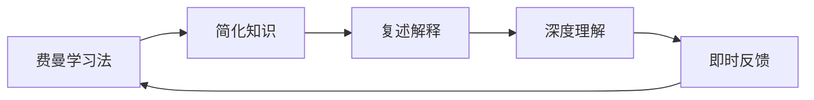

                 

# 费曼学习法的误解与真相

> 关键词：费曼学习法, 学习科学, 主动学习, 深度理解, 应用实践, 常见误解, 实际操作

## 1. 背景介绍

### 1.1 问题由来

费曼学习法（Feynman Technique）是一种基于物理学家理查德·费曼（Richard Feynman）的教学方法，旨在通过简化复杂概念，帮助人们以简洁易懂的方式学习新知识。该方法广泛应用于教育领域，尤其在提高学生的理解能力和知识掌握上表现出色。然而，随着技术的不断进步，费曼学习法也面临着一些误解和质疑。

### 1.2 问题核心关键点

费曼学习法的核心在于通过讲解和复述新知识，促进深度理解。但在实际应用中，人们常常会陷入一些常见的误解，如过度简化、过度依赖记忆、忽视反馈等。因此，有必要深入探讨费曼学习法的本质及其应用实践中的误解与真相，以更好地指导教学和学习。

## 2. 核心概念与联系

### 2.1 核心概念概述

为更好地理解费曼学习法的原理和应用，本节将介绍几个关键概念：

- **费曼学习法**：基于费曼的思考方式，将复杂知识简化为易于理解的形式，通过讲解和复述，促进学习者的深度理解和记忆。

- **主动学习**：学习者主动参与知识获取和应用的过程，而非被动接受信息。强调学习者在学习中的积极作用。

- **深度理解**：超越表面知识，深入理解概念的本质和相互关系，能够应用到实际问题和情境中。

- **简化与复述**：通过将复杂概念简化，并复述给自己或他人，促进深度理解。

- **即时反馈**：在学习过程中，通过及时反馈调整学习策略，确保学习效果。

这些概念共同构成了费曼学习法的核心理念，旨在通过主动、互动的方式，使学习者更好地掌握知识。

### 2.2 核心概念原理和架构的 Mermaid 流程图(Mermaid 流程节点中不要有括号、逗号等特殊字符)



这个流程图展示了费曼学习法的核心流程：

1. 费曼学习法从简化复杂知识开始。
2. 通过复述解释简化后的知识，促进深度理解。
3. 利用即时反馈调整学习策略，确保理解到位。
4. 重复上述步骤，直至掌握知识。

## 3. 核心算法原理 & 具体操作步骤
### 3.1 算法原理概述

费曼学习法的核心算法原理基于心理学和认知科学的理论，强调主动学习与深度理解的重要性。其核心在于通过简化复杂概念，复述解释，以及即时反馈，促进学习者深度理解和记忆知识。

### 3.2 算法步骤详解

1. **选择复杂概念**：确定需要学习的复杂概念或主题。
2. **简化概念**：将复杂概念分解为易于理解的小部分，简化表达形式。
3. **复述解释**：用自己的语言，将简化后的概念复述给他人（或自己），解释其含义和应用。
4. **及时反馈**：获取反馈，确认复述的准确性和深度理解。
5. **迭代优化**：根据反馈调整复述策略，直到掌握概念。

### 3.3 算法优缺点

**优点**：

- 主动参与：通过复述和反馈，学习者积极参与学习过程，促进深度理解。
- 简化理解：将复杂概念简化，便于理解和记忆。
- 即时调整：通过即时反馈，调整学习策略，提高学习效果。

**缺点**：

- 依赖记忆：复述和反馈的有效性依赖于学习者对概念的记忆和理解。
- 费时费力：对于特别复杂的概念，简化和复述可能需要大量时间和精力。
- 依赖反馈：缺乏合适的反馈来源或机制，难以评估复述的准确性和深度。

### 3.4 算法应用领域

费曼学习法不仅适用于学术学习和教学，还广泛应用于职业培训、语言学习、自我提升等多个领域。其核心思想可以应用于任何需要深度理解和掌握新知识的情境。

## 4. 数学模型和公式 & 详细讲解 & 举例说明

### 4.1 数学模型构建

费曼学习法的数学模型构建相对简单，主要关注于知识的简化、复述和反馈机制的设计。

### 4.2 公式推导过程

在数学上，费曼学习法的核心在于如何通过简化和复述促进深度理解。假设我们需要学习一个复杂概念 $C$，其简化后的部分为 $C_1, C_2, ..., C_n$。假设学习者在复述时表达正确与否的概率为 $p$，则总理解的概率为 $p^n$。若简化部分增加，即 $n$ 增加，则 $p^n$ 的增长更为显著。

### 4.3 案例分析与讲解

以微积分的学习为例，微积分涉及复杂的数学概念和公式，对初学者来说较难掌握。通过费曼学习法，可以将微积分简化为基本概念的复述和应用，如导数定义、积分定义等。在学习过程中，逐步增加复杂度，从简单到复杂，通过不断复述和反馈，促进深度理解。

## 5. 项目实践：代码实例和详细解释说明
### 5.1 开发环境搭建

在进行费曼学习法实践前，我们需要准备好开发环境。以下是使用Python进行开发的环境配置流程：

1. 安装Anaconda：从官网下载并安装Anaconda，用于创建独立的Python环境。

2. 创建并激活虚拟环境：
```bash
conda create -n feynman-env python=3.8 
conda activate feynman-env
```

3. 安装PyTorch：根据CUDA版本，从官网获取对应的安装命令。例如：
```bash
conda install pytorch torchvision torchaudio cudatoolkit=11.1 -c pytorch -c conda-forge
```

4. 安装TensorFlow：
```bash
pip install tensorflow
```

5. 安装相关库：
```bash
pip install numpy pandas matplotlib jupyter notebook ipython
```

完成上述步骤后，即可在`feynman-env`环境中开始费曼学习法的实践。

### 5.2 源代码详细实现

这里我们以学习微积分为例，给出使用Python进行费曼学习法实践的代码实现。

首先，定义简化后的微积分概念：

```python
import sympy as sp

# 定义微积分的基本概念
derivative = sp.Function('f')(sp.Symbol('x')).diff(sp.Symbol('x'))
integral = sp.integrate(sp.Function('f')(sp.Symbol('x')), sp.Symbol('x'))

# 简化为易于理解的形式
derivative_simplified = derivative.rewrite(sp.sin)
integral_simplified = integral.rewrite(sp.cos)
```

然后，实现复述和即时反馈机制：

```python
from sympy import symbols, Function, cos, sin

# 定义符号变量
x = symbols('x')

# 定义复述函数，接受一个复杂概念并返回简化后的复述
def explain_concept(complex_concept):
    # 简化概念
    simplified_concept = complex_concept.simplify()
    # 复述解释
    explanation = f"简单理解：{simplified_concept}"
    # 反馈机制
    feedback = input(f"请问你理解了吗？(Y/N)：")
    if feedback.lower() == 'y':
        return explanation, True
    else:
        return explanation, False

# 学习微积分的复述和反馈
complex_concept = derivative
explanation, understood = explain_concept(complex_concept)
while not understood:
    explanation, understood = explain_concept(complex_concept)
```

最后，通过循环迭代，确保学习者对微积分概念的理解。

### 5.3 代码解读与分析

让我们再详细解读一下关键代码的实现细节：

**explain_concept函数**：
- `complex_concept`：输入的复杂微积分概念。
- `simplified_concept`：对复杂概念进行简化处理。
- `explanation`：对简化后的概念进行复述解释。
- `feedback`：获取学习者的即时反馈，确认复述的准确性和深度理解。
- 若学习者理解，返回复述解释和True；否则返回复述解释和False。

**while循环**：
- 通过循环迭代，直到学习者对微积分概念有深度理解为止。

可以看到，利用Python和Sympy库，费曼学习法的实现变得简洁高效。开发者可以将更多精力放在教学逻辑的设计上，而不必过多关注底层的实现细节。

当然，实际应用中还需要考虑更多因素，如互动界面设计、用户交互逻辑、数据存储等。但核心的费曼学习法原理和步骤基本与此类似。

## 6. 实际应用场景
### 6.1 学术研究

费曼学习法在学术研究中广泛应用，特别是在科学、工程等需要深入理解复杂概念的领域。通过费曼学习法，研究者可以更好地理解理论和实验，促进科学发现和创新。

### 6.2 职业培训

在职业培训中，费曼学习法有助于提高员工的技能掌握和问题解决能力。通过简化复杂技能和知识点，并进行复述和反馈，员工能够更好地理解和应用新知识。

### 6.3 自我提升

费曼学习法同样适用于个人自我提升。学习者可以通过复述和反馈，深入理解各种技能和知识，促进自我成长。

### 6.4 未来应用展望

随着技术的发展，费曼学习法将在更多领域得到应用，为学习和教育带来新的变革。

在教育领域，费曼学习法将推动教育方式的革新，促进个性化、互动式学习的发展。通过虚拟现实、增强现实等技术，学习者可以更直观地理解和复述复杂概念。

在企业培训中，费曼学习法将提高员工的技能掌握和问题解决能力，促进知识传递和创新。

在未来，费曼学习法还将与其他技术结合，如人工智能、大数据、虚拟仿真等，为学习者提供更加丰富和互动的学习体验。

## 7. 工具和资源推荐
### 7.1 学习资源推荐

为了帮助学习者系统掌握费曼学习法的原理和实践技巧，这里推荐一些优质的学习资源：

1. 《费曼学习法：以简单之道，攻复杂之敌》：由费曼本人及其弟子所著，深入浅出地介绍了费曼学习法的核心思想和实践方法。

2. 《学习之道：美好学习与高效思维的科学》：介绍如何通过深度学习和心理策略，提高学习效率和理解力。

3. Coursera的《学习心理学》课程：斯坦福大学开设的课程，深入探讨学习心理学原理和应用。

4. 费曼学习法的在线课程和视频：如《费曼学习法：重塑学习体验》，提供实际应用的指导和案例分析。

5. GitHub上的费曼学习法项目：包含各种学习资源的代码示例和实现。

通过对这些资源的学习实践，相信你一定能够掌握费曼学习法的精髓，并将其应用于实际的学习和教学中。

### 7.2 开发工具推荐

高效的开发离不开优秀的工具支持。以下是几款用于费曼学习法开发的常用工具：

1. Jupyter Notebook：开源的交互式编程环境，支持Python、R等语言，便于编写和执行代码，并进行即时反馈。

2. GitHub：提供代码托管、版本控制和协作工具，便于团队管理和共享。

3. LaTeX：高质量的文档排版工具，适合书写和出版学术论文。

4. Visual Studio Code：轻量级的代码编辑器，支持多种编程语言和扩展，易于使用。

5. Google Colab：谷歌提供的在线Jupyter Notebook环境，免费提供GPU/TPU算力，方便学习者快速上手实验最新技术。

合理利用这些工具，可以显著提升费曼学习法的开发效率，加快创新迭代的步伐。

### 7.3 相关论文推荐

费曼学习法的应用研究源于学界的持续探索。以下是几篇奠基性的相关论文，推荐阅读：

1. Feynman Technique in Science Education: An Overview：总结了费曼学习法在科学教育中的应用和效果。

2. Learning to Teach with the Feynman Technique：探讨了费曼学习法在课堂教学中的应用和反馈机制。

3. Promoting Conceptual Understanding with the Feynman Technique：研究了费曼学习法在概念理解中的作用和效果。

这些论文代表了大模型微调技术的发展脉络。通过学习这些前沿成果，可以帮助研究者把握学科前进方向，激发更多的创新灵感。

## 8. 总结：未来发展趋势与挑战

### 8.1 总结

本文对费曼学习法的原理、操作步骤和实际应用进行了全面系统的介绍。首先阐述了费曼学习法在学术研究、职业培训、自我提升等各个领域的广泛应用，明确了其深度理解的核心价值。其次，从原理到实践，详细讲解了费曼学习法的数学模型、核心算法和操作步骤，给出了详细的代码实例。同时，本文还广泛探讨了费曼学习法在教育和职业培训等领域的实际应用前景，展示了其巨大的潜力和广泛的应用场景。

通过本文的系统梳理，可以看到，费曼学习法在促进深度理解、提高学习效率方面具有独特优势。其在学术研究、职业培训、自我提升等多个领域的广泛应用，凸显了其深厚的理论基础和实践价值。

### 8.2 未来发展趋势

展望未来，费曼学习法将呈现以下几个发展趋势：

1. 技术融合：费曼学习法将与其他教育技术，如人工智能、大数据、虚拟仿真等结合，提升学习体验和效果。

2. 个性化学习：利用人工智能和大数据分析，费曼学习法将更好地适应个体学习者的需求，提供个性化的学习方案。

3. 混合式学习：结合传统课堂教学和在线学习，费曼学习法将提供更加灵活和互动的学习方式。

4. 全球化教育：通过在线平台和开源资源，费曼学习法将促进全球教育资源的共享和交流。

5. 多样性支持：为不同学习者提供多种语言和文化背景下的学习材料和支持。

以上趋势凸显了费曼学习法在教育和培训领域的广阔前景。这些方向的探索发展，必将进一步推动学习方式的变革，为教育公平和个体发展带来新的机遇。

### 8.3 面临的挑战

尽管费曼学习法在教育和培训领域已经取得了显著成效，但在迈向更加智能化、普适化应用的过程中，仍面临以下挑战：

1. 资源依赖：费曼学习法的有效性依赖于高质量的学习材料和互动工具，获取这些资源的成本较高。

2. 适用范围：对于某些复杂的概念，简化和复述可能难以深入理解，费曼学习法的效果有限。

3. 时间成本：费曼学习法需要大量的时间和精力，对学习者和教师的要求较高。

4. 反馈机制：费曼学习法依赖于学习者的即时反馈，缺乏合适的反馈来源或机制，难以评估学习效果。

5. 差异化需求：不同学习者的需求差异较大，需要灵活调整学习策略和内容。

6. 技术融合：技术融合过程中，可能会出现新的挑战和问题，需要持续优化和学习。

这些挑战需要通过技术创新、资源整合和教育实践的不断改进，逐步克服。相信随着学界和产业界的共同努力，费曼学习法必将在构建更加智能、普适的教育和培训系统中发挥越来越重要的作用。

### 8.4 研究展望

面向未来，费曼学习法的研究方向将聚焦于以下几个方面：

1. 多模态融合：结合文字、图像、视频等多模态信息，提升学习效果和体验。

2. 实时反馈：利用人工智能和大数据分析，提供实时反馈和个性化推荐。

3. 知识图谱：构建知识图谱，促进知识的结构化和系统化学习。

4. 虚拟教师：开发虚拟教师，辅助学习者进行知识传授和问题解答。

5. 情感智能：结合情感分析和智能推荐，提升学习者的情感体验和学习效果。

这些研究方向的探索，必将引领费曼学习法走向更高的台阶，为教育和学习带来新的变革。

## 9. 附录：常见问题与解答

**Q1：费曼学习法是否适用于所有类型的学习？**

A: 费曼学习法在促进深度理解和知识掌握方面具有显著优势，但并不适用于所有类型的学习。对于某些记忆和技能为主的学习任务，如编程、写作等，费曼学习法可能效果有限。对于这些任务，其他学习方法，如刻意练习、模拟训练等，可能更为适合。

**Q2：如何利用费曼学习法进行个人自我提升？**

A: 利用费曼学习法进行自我提升，可以遵循以下步骤：
1. 选择一个需要学习的技能或知识点。
2. 简化复杂概念，将其分解为易于理解的小部分。
3. 复述解释简化后的概念，形成自己的理解。
4. 获取反馈，确认理解是否到位。
5. 根据反馈调整复述策略，重复以上步骤，直到掌握。

**Q3：费曼学习法在学术研究中如何应用？**

A: 在学术研究中，费曼学习法可以用于以下方面：
1. 理解复杂理论：通过简化和复述，深入理解理论的各个组成部分。
2. 设计实验：通过复述实验设计，理解实验目的和步骤。
3. 撰写论文：通过复述论文内容，理解论文的核心观点和方法。
4. 学术讨论：通过复述和解释学术问题，提高讨论效果。

**Q4：费曼学习法在企业培训中如何应用？**

A: 在企业培训中，费曼学习法可以用于以下方面：
1. 技能培训：通过复述和反馈，提高员工的技能掌握和问题解决能力。
2. 知识传授：将复杂概念和知识点简化，便于员工理解和应用。
3. 创新思维：通过复述和讨论，促进员工创新思维的发展。
4. 团队协作：通过复述和反馈，增强团队沟通和协作。

**Q5：费曼学习法在自我提升中需要注意哪些问题？**

A: 在自我提升中，利用费曼学习法需要注意以下问题：
1. 选择合适的学习目标：选择适合自己水平和需求的技能或知识点。
2. 简化复杂概念：将复杂概念分解为易于理解的小部分。
3. 获取及时反馈：获取反馈，确认理解是否到位。
4. 持续调整策略：根据反馈调整复述策略，确保掌握。
5. 保持耐心和坚持：费曼学习法需要大量时间和精力，保持耐心和坚持是关键。

这些问题的回答，展示了费曼学习法在学术研究、企业培训和自我提升等多个领域的实际应用方法和注意事项。通过深入理解和灵活应用，费曼学习法必将在促进深度理解和知识掌握方面发挥重要作用。

---

作者：禅与计算机程序设计艺术 / Zen and the Art of Computer Programming

