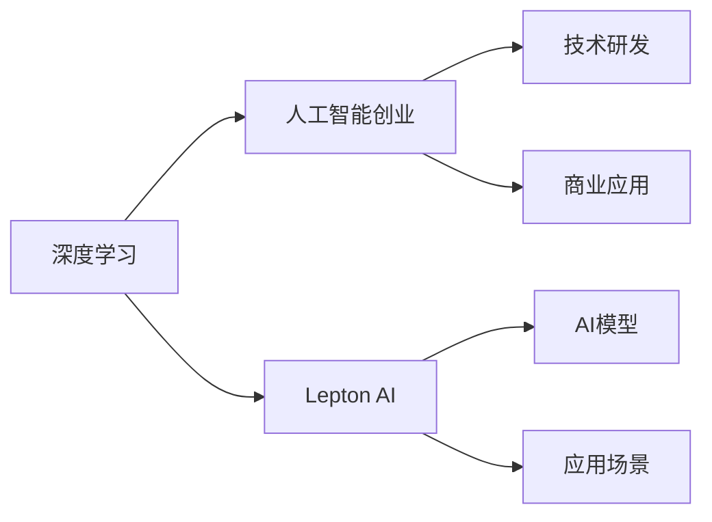

                 

# 贾扬清的新征程：从阿里到Lepton AI

> 关键词：贾扬清, Lepton AI, 人工智能, 技术创新, 创业历程

## 1. 背景介绍

### 1.1 问题由来
在2023年的春节假期，一个看似平凡的新闻吸引了全社会的关注：贾扬清宣布离开阿里集团，创建了自己的创业公司Lepton AI。这一消息迅速在AI圈引发热议，也让人不禁反思：作为一个成名于深度学习领域的科学家和工程师，贾扬清为何选择离开阿里，重返创业的战场？

### 1.2 问题核心关键点
贾扬清离开阿里的原因可以从多个层面进行解读：
1. **个人职业发展**：贾扬清希望在技术领域探索更多可能性，实现个人职业的进一步突破。
2. **项目愿景**：他希望通过自己的技术，帮助解决更多的现实问题，带来更广泛的社会影响。
3. **创新环境**：阿里等大公司尽管拥有强大的资源和平台，但创新环境和创业空间相对受限。
4. **竞争格局**：AI行业竞争激烈，贾扬清希望通过创业，实现技术上的更大突破。

### 1.3 问题研究意义
了解贾扬清的创业历程，不仅能帮助业内人士更好地理解当前AI行业的动态，还能为未来的创业者提供宝贵的经验。此外，他的选择也可能激发更多人对AI技术的兴趣和探索，加速技术的落地应用。

## 2. 核心概念与联系

### 2.1 核心概念概述

本节将简要介绍与贾扬清新征程相关的核心概念，包括：

- **深度学习**：一种基于神经网络的机器学习技术，广泛应用于计算机视觉、自然语言处理等领域。
- **人工智能创业**：利用AI技术创办的创新企业，旨在解决实际问题，推动社会进步。
- **Lepton AI**：贾扬清创立的新公司，专注于AI技术的研发和应用。

### 2.2 核心概念原理和架构的 Mermaid 流程图



这个流程图展示了深度学习、人工智能创业和Lepton AI三者之间的关系：

1. **深度学习**是AI创业的基础，提供了强大的技术支持。
2. **Lepton AI**作为AI创业的代表之一，展示了如何将AI技术转化为实际应用。
3. **AI模型**和**应用场景**则具体体现了Lepton AI的核心业务。

## 3. 核心算法原理 & 具体操作步骤
### 3.1 算法原理概述

Jay Longman的创业历程，离不开对AI技术深度的理解和应用。深度学习技术的发展，为他的创业提供了坚实的基础。

深度学习技术的核心在于利用神经网络模拟人类大脑的工作方式，通过大量数据训练，学习并提取特征，进而进行分类、预测等任务。其原理可以通过以下步骤概述：

1. **数据预处理**：对输入数据进行归一化、标准化等处理，确保数据质量。
2. **网络构建**：根据任务需求，选择合适的神经网络架构，如卷积神经网络（CNN）、循环神经网络（RNN）等。
3. **模型训练**：通过反向传播算法，调整网络参数，最小化损失函数，使模型拟合训练数据。
4. **模型评估**：使用验证集或测试集，评估模型在未见数据上的性能。
5. **模型优化**：根据评估结果，调整模型参数，进一步提升模型精度。

### 3.2 算法步骤详解

**Step 1: 数据预处理**

数据预处理是深度学习模型的第一步。其目的是对原始数据进行清洗和转换，确保数据质量，便于模型训练。常用的数据预处理方法包括：

- **归一化**：将数据缩放到固定范围内，防止数据过大或过小对模型造成影响。
- **标准化**：对数据进行标准化处理，使其具有零均值和单位方差。
- **数据增强**：通过旋转、缩放、翻转等方式，增加训练数据的多样性。

**Step 2: 网络构建**

根据具体任务，选择合适的神经网络架构。例如，对于图像识别任务，通常使用卷积神经网络（CNN）；对于自然语言处理任务，可以使用循环神经网络（RNN）或Transformer等。

**Step 3: 模型训练**

模型训练的核心在于通过反向传播算法调整网络参数。常用的优化算法包括梯度下降、Adam、RMSprop等。训练过程中，需要定期在验证集上评估模型性能，防止过拟合。

**Step 4: 模型评估**

模型评估的目的是评估模型在未见数据上的性能。常用的评估指标包括准确率、精确率、召回率、F1-score等。

**Step 5: 模型优化**

根据评估结果，调整模型参数，如学习率、正则化系数、批次大小等，进一步提升模型精度。

### 3.3 算法优缺点

深度学习算法具有以下优点：

1. **高效性**：通过并行计算，深度学习模型能够快速处理大量数据。
2. **灵活性**：神经网络结构可以根据任务需求进行调整。
3. **泛化能力**：深度学习模型能够很好地适应新的数据集。

同时，深度学习算法也存在以下缺点：

1. **资源需求高**：深度学习模型需要大量的计算资源，训练成本较高。
2. **模型复杂**：神经网络结构复杂，不易理解和调试。
3. **过拟合风险**：在训练数据有限的情况下，深度学习模型容易过拟合。

### 3.4 算法应用领域

深度学习算法广泛应用于计算机视觉、自然语言处理、语音识别等领域。

1. **计算机视觉**：如图像分类、目标检测、人脸识别等。
2. **自然语言处理**：如文本分类、机器翻译、情感分析等。
3. **语音识别**：如语音转文字、语音命令识别等。

## 4. 数学模型和公式 & 详细讲解

### 4.1 数学模型构建

深度学习模型的构建通常涉及以下几个关键步骤：

1. **输入层**：将原始数据转化为模型能够处理的格式。
2. **隐藏层**：通过一系列线性变换和非线性激活函数，提取数据特征。
3. **输出层**：根据任务需求，输出预测结果。

### 4.2 公式推导过程

以二分类任务为例，展示深度学习模型的基本公式：

$$
y = sigmoid(Wx + b)
$$

其中，$y$ 表示输出结果，$W$ 和 $b$ 为模型参数，$x$ 为输入特征，$sigmoid$ 为激活函数，输出结果介于0和1之间，表示模型预测的类别概率。

### 4.3 案例分析与讲解

以Lepton AI在图像识别任务中的应用为例，展示模型的构建和训练过程：

1. **数据集准备**：收集并预处理图像数据，如CIFAR-10、MNIST等。
2. **模型构建**：设计卷积神经网络（CNN）架构，包含卷积层、池化层、全连接层等。
3. **模型训练**：使用随机梯度下降（SGD）算法，调整网络参数，最小化损失函数。
4. **模型评估**：在测试集上评估模型精度，如准确率、精确率等。

## 5. 项目实践：代码实例和详细解释说明

### 5.1 开发环境搭建

使用Python语言进行深度学习项目开发，需要以下开发环境：

1. **Python**：选择Python 3.7及以上版本。
2. **深度学习框架**：如TensorFlow、PyTorch等。
3. **数据集**：如CIFAR-10、MNIST等。

### 5.2 源代码详细实现

以下是一个简单的深度学习项目实现示例：

```python
import tensorflow as tf
from tensorflow.keras import layers

# 定义模型
model = tf.keras.Sequential([
    layers.Conv2D(32, (3, 3), activation='relu', input_shape=(32, 32, 3)),
    layers.MaxPooling2D((2, 2)),
    layers.Conv2D(64, (3, 3), activation='relu'),
    layers.MaxPooling2D((2, 2)),
    layers.Conv2D(64, (3, 3), activation='relu'),
    layers.Flatten(),
    layers.Dense(64, activation='relu'),
    layers.Dense(10, activation='softmax')
])

# 编译模型
model.compile(optimizer='adam',
              loss='sparse_categorical_crossentropy',
              metrics=['accuracy'])

# 训练模型
model.fit(train_data, train_labels, epochs=10, validation_data=(val_data, val_labels))
```

### 5.3 代码解读与分析

- **Sequential模型**：定义了一个顺序排列的神经网络模型，包含卷积层、池化层、全连接层等。
- **compile方法**：指定了优化器、损失函数和评估指标。
- **fit方法**：训练模型，并使用验证集评估模型性能。

## 6. 实际应用场景

### 6.1 智能推荐系统

Lepton AI在智能推荐系统中展示了深度学习技术的强大威力。通过分析用户的历史行为数据，推荐系统可以为用户推荐最符合其兴趣的产品或内容。

### 6.2 医疗影像诊断

深度学习在医疗影像诊断中也有广泛应用。Lepton AI通过训练神经网络模型，能够自动识别和诊断各类医疗影像，如X光片、CT、MRI等。

### 6.3 自动驾驶

在自动驾驶领域，Lepton AI通过构建感知、决策、控制等模块，实现了对复杂道路环境的实时响应和决策。

### 6.4 未来应用展望

未来，Lepton AI将进一步拓展AI技术的应用范围，解决更多实际问题。

1. **智能客服**：通过自然语言处理技术，实现智能客服的自动化和智能化。
2. **智慧城市**：构建智慧交通、智慧安防、智慧环保等应用，提升城市管理效率。
3. **工业互联网**：实现智能制造、智慧物流等应用，推动工业智能化转型。

## 7. 工具和资源推荐

### 7.1 学习资源推荐

1. **深度学习书籍**：《深度学习》、《神经网络与深度学习》等经典书籍。
2. **在线课程**：Coursera、Udacity等平台上的深度学习课程。
3. **开源项目**：如TensorFlow、PyTorch等深度学习框架的源码和示例。

### 7.2 开发工具推荐

1. **TensorFlow**：谷歌开源的深度学习框架，支持多种编程语言。
2. **PyTorch**：Facebook开源的深度学习框架，易于使用，支持动态计算图。
3. **Keras**：高层次神经网络API，易于上手，支持TensorFlow和Theano后端。

### 7.3 相关论文推荐

1. **卷积神经网络**：LeNet、AlexNet、VGGNet等经典模型。
2. **循环神经网络**：LSTM、GRU等模型。
3. **深度学习优化算法**：Adam、SGD等算法。

## 8. 总结：未来发展趋势与挑战

### 8.1 研究成果总结

贾扬清在深度学习领域的贡献，主要体现在以下几个方面：

1. **算法创新**：提出了多个深度学习算法，如AdaGrad、Adadelta等。
2. **模型优化**：开发了多个优化器，如Adam、AdaGrad等。
3. **应用实践**：在图像识别、语音识别、自然语言处理等领域取得了重要成果。

### 8.2 未来发展趋势

未来，深度学习技术将在以下几个方面取得进一步突破：

1. **模型压缩与优化**：通过剪枝、量化等技术，减小模型尺寸，提高计算效率。
2. **自监督学习**：利用无监督学习技术，提高模型的泛化能力。
3. **联邦学习**：在数据分布不均的情况下，通过分布式训练提升模型性能。
4. **多模态学习**：融合视觉、听觉、文本等多种模态信息，实现跨模态学习。

### 8.3 面临的挑战

深度学习技术在发展过程中，也面临着诸多挑战：

1. **计算资源限制**：深度学习模型需要大量的计算资源，训练和推理成本较高。
2. **模型复杂度**：神经网络结构复杂，不易理解和调试。
3. **数据依赖性强**：深度学习模型的性能很大程度上依赖于数据的质量和数量。

### 8.4 研究展望

未来，深度学习研究将更多关注以下几个方面：

1. **高效模型构建**：开发更高效、更轻量的深度学习模型，提高计算效率。
2. **模型可解释性**：开发可解释性更强的深度学习模型，提高模型的透明度和可信度。
3. **跨模态学习**：实现不同模态数据之间的协同学习，提高模型的综合能力。
4. **模型鲁棒性**：提高模型的鲁棒性和泛化能力，适应各种复杂场景。

## 9. 附录：常见问题与解答

**Q1: 什么是深度学习？**

A: 深度学习是一种基于神经网络的机器学习技术，通过大量数据训练，学习并提取特征，进而进行分类、预测等任务。

**Q2: 深度学习模型有哪些优点和缺点？**

A: 优点包括高效性、灵活性和泛化能力，缺点包括资源需求高、模型复杂和过拟合风险。

**Q3: 贾扬清离开阿里是为了创业吗？**

A: 是的，贾扬清离开阿里的目的是创立Lepton AI，旨在通过技术创新解决更多实际问题，推动社会进步。

**Q4: 深度学习技术在实际应用中有哪些挑战？**

A: 计算资源限制、模型复杂度和数据依赖性强是深度学习技术在实际应用中面临的主要挑战。

**Q5: 未来深度学习技术的发展方向是什么？**

A: 高效模型构建、模型可解释性、跨模态学习和模型鲁棒性是未来深度学习技术的发展方向。

作者：禅与计算机程序设计艺术 / Zen and the Art of Computer Programming

