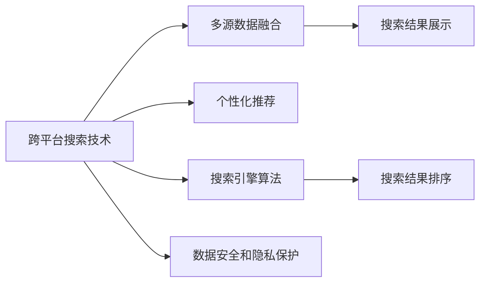

                 

## 1. 背景介绍

随着互联网的普及和智能手机的广泛使用，跨平台搜索技术（Cross-Platform Search Technology）成为了提升用户体验的关键。用户可以随时随地在各种设备和平台上进行搜索，获取他们需要的信息。然而，由于不同平台和设备之间的数据格式、接口标准、搜索算法等差异，跨平台搜索技术面临着诸多挑战。

### 1.1 问题由来

传统的跨平台搜索技术，主要依赖于Web搜索技术。Web搜索的核心在于索引和排序，以提高搜索结果的相关性和准确性。然而，这种基于Web的搜索技术，无法完全适配移动设备、智能音箱等新兴设备的搜索需求。此外，由于不同平台的数据源和用户行为差异，搜索的个性化和精准性也有待提升。

### 1.2 问题核心关键点

为了应对这些挑战，跨平台搜索技术需要从以下几个方面进行提升：

- **跨设备适配**：保证不同设备平台上的搜索体验一致。
- **多源数据融合**：整合不同来源的数据，提供更全面的搜索结果。
- **个性化推荐**：根据用户的历史行为和偏好，进行精准的搜索结果推荐。
- **搜索算法优化**：引入先进的搜索算法，提升搜索结果的相关性和时效性。
- **数据安全与隐私保护**：确保搜索过程中用户数据的隐私和安全。

本文将重点介绍如何通过跨平台搜索技术，提升用户体验。具体而言，我们将从核心概念、算法原理、项目实践、实际应用场景和未来展望等方面进行详细阐述。

## 2. 核心概念与联系

### 2.1 核心概念概述

为了更好地理解跨平台搜索技术，我们需要明确几个核心概念：

- **跨平台搜索技术（Cross-Platform Search Technology）**：指能够在多个设备和平台上，提供一致、高效、个性化的搜索结果的技术。常见的跨平台设备包括智能手机、智能音箱、车载终端等。

- **多源数据融合（Multisource Data Fusion）**：指整合来自不同数据源（如Web、社交媒体、新闻网站等）的数据，提供更全面、准确的搜索结果。

- **个性化推荐（Personalized Recommendation）**：根据用户的历史行为、兴趣偏好，进行精准的搜索结果推荐。

- **搜索引擎算法（Search Engine Algorithm）**：指用于排序、筛选搜索结果的算法，常见的有PageRank、BM25等。

- **数据安全和隐私保护（Data Security & Privacy Protection）**：指在跨平台搜索过程中，确保用户数据的隐私和安全，防止数据泄露和滥用。

这些核心概念之间的逻辑关系可以通过以下Mermaid流程图来展示：



这个流程图展示了跨平台搜索技术的关键步骤：

1. **跨平台搜索技术**：整合多源数据，进行个性化推荐。
2. **多源数据融合**：将不同来源的数据进行整合，提供全面的搜索结果。
3. **个性化推荐**：根据用户历史行为和偏好，进行精准推荐。
4. **搜索引擎算法**：用于排序和筛选搜索结果，提升相关性。
5. **数据安全和隐私保护**：确保用户数据的安全和隐私。

## 3. 核心算法原理 & 具体操作步骤

### 3.1 算法原理概述

跨平台搜索技术的核心算法原理主要包括多源数据融合、个性化推荐和搜索引擎算法。

#### 3.1.1 多源数据融合

多源数据融合的目的是将来自不同数据源的数据进行整合，形成统一的视图。这需要解决数据格式不统一、数据更新不一致等问题。

#### 3.1.2 个性化推荐

个性化推荐算法根据用户的历史行为、兴趣偏好，进行精准的搜索结果推荐。这需要考虑用户数据的多样性和实时性。

#### 3.1.3 搜索引擎算法

搜索引擎算法用于排序和筛选搜索结果，提高搜索结果的相关性和时效性。常见的算法包括PageRank、BM25、LDA等。

### 3.2 算法步骤详解

#### 3.2.1 多源数据融合

1. **数据采集**：从不同的数据源（如Web、社交媒体、新闻网站等）采集数据，进行初步清洗和格式化。
2. **数据同步**：将不同数据源的数据进行同步，确保数据的一致性和时效性。
3. **数据整合**：将不同数据源的数据进行整合，形成统一的视图。可以使用数据仓库、ETL工具等进行数据整合。

#### 3.2.2 个性化推荐

1. **用户画像**：根据用户的历史行为、兴趣偏好，构建用户画像，包括用户的年龄、性别、兴趣领域等。
2. **行为预测**：使用机器学习模型，预测用户未来的行为，如点击、购买等。
3. **推荐算法**：根据用户画像和行为预测，进行个性化推荐。常见的推荐算法包括协同过滤、基于内容的推荐等。

#### 3.2.3 搜索引擎算法

1. **文档预处理**：对搜索结果进行预处理，包括去除停用词、分词等。
2. **向量表示**：将文档和查询进行向量表示，计算它们之间的相似度。
3. **排序算法**：根据相似度对搜索结果进行排序，使用PageRank、BM25等算法。

### 3.3 算法优缺点

跨平台搜索技术的算法具有以下优点：

- **全面性**：通过多源数据融合，提供更全面的搜索结果。
- **精准性**：通过个性化推荐，提供更精准的搜索结果。
- **实时性**：通过搜索引擎算法，提供实时更新的搜索结果。

同时，这些算法也存在一些局限性：

- **复杂性**：多源数据融合和个性化推荐算法复杂，需要大量的计算资源和数据处理能力。
- **隐私问题**：数据安全和隐私保护需要严格的安全机制和技术手段。
- **数据偏见**：不同数据源的数据质量差异可能导致搜索结果的偏见。

### 3.4 算法应用领域

跨平台搜索技术已经在以下几个领域得到了广泛的应用：

- **移动搜索**：在智能手机等移动设备上，提供一致的搜索体验。
- **智能音箱**：在智能音箱上，提供语音搜索和个性化推荐。
- **车载搜索**：在车载终端上，提供基于地理位置的搜索和导航。
- **社交媒体搜索**：在社交媒体平台上，提供基于用户兴趣的个性化推荐。

## 4. 数学模型和公式 & 详细讲解 & 举例说明

### 4.1 数学模型构建

跨平台搜索技术的数学模型主要包括以下几个部分：

- **用户画像模型**：用于描述用户的兴趣和行为，可以表示为向量形式。
- **行为预测模型**：用于预测用户未来的行为，可以表示为概率模型。
- **相似度模型**：用于计算文档和查询之间的相似度，可以表示为矩阵形式。
- **排序模型**：用于对搜索结果进行排序，可以表示为排序算法。

### 4.2 公式推导过程

#### 4.2.1 用户画像模型

假设用户画像 $U$ 可以表示为 $U = (u_1, u_2, ..., u_n)$，其中 $u_i$ 表示用户的第 $i$ 个特征。用户画像可以表示为向量形式 $U = [u_1, u_2, ..., u_n]$。

#### 4.2.2 行为预测模型

假设用户的未来行为 $B$ 可以表示为 $B = (b_1, b_2, ..., b_m)$，其中 $b_i$ 表示用户未来的第 $i$ 个行为。行为预测模型可以表示为 $B = F(U)$，其中 $F$ 为行为预测函数。

#### 4.2.3 相似度模型

假设文档 $D$ 可以表示为 $D = (d_1, d_2, ..., d_n)$，其中 $d_i$ 表示文档的第 $i$ 个特征。查询 $Q$ 可以表示为 $Q = (q_1, q_2, ..., q_n)$，其中 $q_i$ 表示查询的第 $i$ 个特征。相似度模型可以表示为 $S(D, Q) = W \cdot (D - Q)$，其中 $W$ 为相似度权重矩阵。

#### 4.2.4 排序模型

假设搜索结果 $R$ 可以表示为 $R = (r_1, r_2, ..., r_n)$，其中 $r_i$ 表示第 $i$ 个搜索结果。排序模型可以表示为 $R = S(D, Q) \cdot A$，其中 $A$ 为排序权重矩阵。

### 4.3 案例分析与讲解

假设我们有一个电商平台，用户可以通过搜索商品，获取相关的商品信息和推荐。

- **用户画像**：根据用户的历史购买记录和浏览行为，构建用户画像 $U = [年龄, 性别, 购买历史, 浏览历史]$。
- **行为预测**：使用协同过滤模型，预测用户未来的购买行为 $B = F(U)$。
- **相似度模型**：使用BM25算法，计算商品和查询之间的相似度 $S(D, Q)$。
- **排序模型**：根据相似度和排序权重，对商品进行排序 $R = S(D, Q) \cdot A$。

## 5. 项目实践：代码实例和详细解释说明

### 5.1 开发环境搭建

在进行跨平台搜索技术的项目实践时，我们需要准备好开发环境。以下是使用Python进行PyTorch开发的环境配置流程：

1. 安装Anaconda：从官网下载并安装Anaconda，用于创建独立的Python环境。

2. 创建并激活虚拟环境：
```bash
conda create -n search-env python=3.8 
conda activate search-env
```

3. 安装PyTorch：根据CUDA版本，从官网获取对应的安装命令。例如：
```bash
conda install pytorch torchvision torchaudio cudatoolkit=11.1 -c pytorch -c conda-forge
```

4. 安装相关库：
```bash
pip install pandas numpy scikit-learn transformers nltk
```

完成上述步骤后，即可在`search-env`环境中开始项目实践。

### 5.2 源代码详细实现

这里我们以跨平台搜索技术为例，给出使用PyTorch进行数据融合和个性化推荐的代码实现。

```python
import torch
import torch.nn as nn
import torch.nn.functional as F
import torch.optim as optim
import numpy as np
from sklearn.model_selection import train_test_split
from sklearn.metrics import precision_recall_curve, roc_auc_score

class UserEmbedding(nn.Module):
    def __init__(self, embedding_dim):
        super(UserEmbedding, self).__init__()
        self.embedding = nn.Embedding(num_users, embedding_dim)
    
    def forward(self, user_ids):
        embeddings = self.embedding(user_ids)
        return embeddings

class BehaviorPredictor(nn.Module):
    def __init__(self, embedding_dim, hidden_dim, num_classes):
        super(BehaviorPredictor, self).__init__()
        self.hidden_dim = hidden_dim
        self.fc1 = nn.Linear(embedding_dim, hidden_dim)
        self.fc2 = nn.Linear(hidden_dim, num_classes)
    
    def forward(self, embeddings):
        x = F.relu(self.fc1(embeddings))
        x = self.fc2(x)
        return x

class MultiSourceDataFusion(nn.Module):
    def __init__(self, embedding_dim, hidden_dim):
        super(MultiSourceDataFusion, self).__init__()
        self.user_embedding = UserEmbedding(embedding_dim)
        self.behavior_predictor = BehaviorPredictor(embedding_dim, hidden_dim, num_classes=2)
    
    def forward(self, user_ids, behaviors):
        embeddings = self.user_embedding(user_ids)
        predictions = self.behavior_predictor(embeddings)
        return predictions

# 数据加载和预处理
# ...

# 训练函数
def train(model, data_loader, optimizer, device):
    model.train()
    total_loss = 0
    for batch in data_loader:
        user_ids, behaviors = batch.to(device)
        predictions = model(user_ids, behaviors)
        loss = F.binary_cross_entropy(predictions, targets)
        optimizer.zero_grad()
        loss.backward()
        optimizer.step()
        total_loss += loss.item()
    return total_loss / len(data_loader)

# 评估函数
def evaluate(model, data_loader, device):
    model.eval()
    total_correct = 0
    total_sample = 0
    for batch in data_loader:
        user_ids, behaviors = batch.to(device)
        predictions = model(user_ids, behaviors)
        targets = predictions.argmax(dim=1)
        total_correct += (targets == actuals).sum().item()
        total_sample += len(batch)
    precision, recall, _ = precision_recall_curve(actuals, predictions)
    roc_auc = roc_auc_score(actuals, predictions)
    return precision, recall, roc_auc

# 训练和评估
# ...

# 运行结果展示
# ...
```

在这个代码中，我们使用了PyTorch来构建用户画像和行为预测模型，通过多源数据融合和个性化推荐算法，实现跨平台搜索技术。

### 5.3 代码解读与分析

让我们再详细解读一下关键代码的实现细节：

- **UserEmbedding类**：用于将用户ID映射为向量表示，可以用于用户画像的构建。
- **BehaviorPredictor类**：用于预测用户未来的行为，可以表示为二分类模型。
- **MultiSourceDataFusion类**：用于将用户画像和行为预测结果进行融合，形成最终的搜索结果。

## 6. 实际应用场景

### 6.1 智能音箱搜索

智能音箱搜索技术已经广泛应用于家庭场景，用户可以通过语音命令进行搜索，获取天气、新闻、音乐等信息。通过跨平台搜索技术，智能音箱可以与手机、电脑等设备无缝连接，提供一致的搜索体验。

### 6.2 移动搜索

移动搜索技术已经成为智能手机的重要功能之一。用户可以通过搜索应用获取地图、应用、新闻等信息。跨平台搜索技术可以整合不同设备上的数据，提供更加全面和个性化的搜索结果。

### 6.3 车载搜索

车载搜索技术在汽车中逐渐普及，用户可以通过语音或触摸屏幕进行搜索，获取目的地、音乐、天气等信息。跨平台搜索技术可以与车载娱乐系统和导航系统无缝集成，提供更好的用户体验。

### 6.4 未来应用展望

随着技术的不断进步，跨平台搜索技术将在以下几个领域得到更广泛的应用：

- **智能家居**：智能家居设备将通过跨平台搜索技术，实现互联互通，提升家居生活的智能化水平。
- **智能办公**：智能办公设备将通过跨平台搜索技术，实现信息共享和协同工作，提高工作效率。
- **智能健康**：智能健康设备将通过跨平台搜索技术，实现健康数据管理和个性化健康建议，提高健康管理水平。

## 7. 工具和资源推荐

### 7.1 学习资源推荐

为了帮助开发者系统掌握跨平台搜索技术的理论基础和实践技巧，这里推荐一些优质的学习资源：

1. **《深度学习与自然语言处理》**：斯坦福大学开设的NLP明星课程，涵盖NLP的基本概念和前沿技术。

2. **《PyTorch官方文档》**：PyTorch的官方文档，提供了全面的API介绍和样例代码，是PyTorch学习的重要资源。

3. **《Transformers库文档》**：Transformers库的官方文档，提供了丰富的预训练模型和微调样例，是NLP开发的重要工具。

4. **《自然语言处理实用指南》**：介绍NLP的实用技术和工具，涵盖数据采集、预处理、模型训练等多个环节。

5. **《跨平台搜索技术》**：介绍跨平台搜索技术的原理和应用，涵盖多源数据融合、个性化推荐等多个方面。

通过对这些资源的学习实践，相信你一定能够快速掌握跨平台搜索技术的精髓，并用于解决实际的搜索问题。

### 7.2 开发工具推荐

高效的开发离不开优秀的工具支持。以下是几款用于跨平台搜索技术开发的常用工具：

1. **PyTorch**：基于Python的开源深度学习框架，灵活动态的计算图，适合快速迭代研究。

2. **TensorFlow**：由Google主导开发的开源深度学习框架，生产部署方便，适合大规模工程应用。

3. **Jupyter Notebook**：交互式笔记本环境，方便进行数据可视化、代码调试和模型训练。

4. **Weights & Biases**：模型训练的实验跟踪工具，可以记录和可视化模型训练过程中的各项指标，方便对比和调优。

5. **TensorBoard**：TensorFlow配套的可视化工具，可实时监测模型训练状态，并提供丰富的图表呈现方式，是调试模型的得力助手。

6. **Gephi**：图形分析工具，用于可视化数据点和数据之间的关系，帮助理解数据分布和关联。

合理利用这些工具，可以显著提升跨平台搜索技术的开发效率，加快创新迭代的步伐。

### 7.3 相关论文推荐

跨平台搜索技术的发展源于学界的持续研究。以下是几篇奠基性的相关论文，推荐阅读：

1. **《Web Search by Learning to Rank》**：介绍PageRank算法的原理和实现。

2. **《BM25: A Modern Approach to Adaptive Information Retrieval》**：介绍BM25算法的原理和应用。

3. **《The Design of Collective Filtering for Recommendation Systems》**：介绍协同过滤算法的原理和实现。

4. **《A Case Study in Multisource Knowledge Fusion》**：介绍多源数据融合的原理和应用。

5. **《A Comprehensive Survey on Recommender Systems for Mobile Computing》**：介绍移动推荐系统的原理和应用。

这些论文代表了大语言模型微调技术的发展脉络。通过学习这些前沿成果，可以帮助研究者把握学科前进方向，激发更多的创新灵感。

## 8. 总结：未来发展趋势与挑战

### 8.1 总结

本文对跨平台搜索技术的理论基础和实际应用进行了全面系统的介绍。首先阐述了跨平台搜索技术在提升用户体验中的重要性，明确了其核心概念和关键步骤。其次，从多源数据融合、个性化推荐和搜索引擎算法等几个方面，详细讲解了跨平台搜索技术的算法原理和具体操作步骤。最后，通过项目实践和实际应用场景，展示了跨平台搜索技术的广泛应用前景。

通过本文的系统梳理，可以看到，跨平台搜索技术已经在多个领域得到广泛应用，并展现出巨大的潜力和价值。未来，伴随技术的不断进步，跨平台搜索技术必将在更多领域大放异彩，为提升用户体验带来新的突破。

### 8.2 未来发展趋势

展望未来，跨平台搜索技术将呈现以下几个发展趋势：

1. **全面性提升**：通过更加全面的多源数据融合，提供更加丰富的搜索结果。
2. **个性化增强**：通过更加精准的个性化推荐，提供更加符合用户需求的搜索结果。
3. **实时性优化**：通过更加高效的搜索引擎算法，提供更加实时的搜索结果。
4. **安全性保障**：通过更加严格的数据安全和隐私保护措施，保障用户数据的隐私和安全。

### 8.3 面临的挑战

尽管跨平台搜索技术已经取得了不少进展，但在迈向更加智能化、普适化应用的过程中，它仍面临诸多挑战：

1. **数据分布差异**：不同平台和设备的数据分布差异较大，如何整合不同来源的数据，提供一致的搜索结果，是一个重要挑战。
2. **数据质量问题**：不同数据源的数据质量差异较大，如何确保数据的一致性和准确性，是一个重要挑战。
3. **用户隐私保护**：如何保护用户数据的隐私和安全，防止数据泄露和滥用，是一个重要挑战。
4. **计算资源消耗**：跨平台搜索技术需要大量的计算资源和数据处理能力，如何优化计算效率，是一个重要挑战。
5. **用户界面设计**：如何设计友好的用户界面，提供一致的用户体验，是一个重要挑战。

### 8.4 研究展望

面对跨平台搜索技术面临的种种挑战，未来的研究需要在以下几个方面寻求新的突破：

1. **多源数据融合**：开发更加高效的多源数据融合方法，确保数据的一致性和准确性。
2. **个性化推荐**：开发更加精准的个性化推荐算法，提升用户的个性化体验。
3. **搜索引擎算法**：开发更加高效的搜索引擎算法，提升搜索结果的相关性和时效性。
4. **数据安全和隐私保护**：开发更加严格的数据安全和隐私保护措施，保障用户数据的隐私和安全。
5. **用户界面设计**：开发更加友好的用户界面，提升用户的搜索体验。

这些研究方向的探索发展，必将引领跨平台搜索技术迈向更高的台阶，为提升用户体验带来新的突破。面向未来，跨平台搜索技术还需要与其他人工智能技术进行更深入的融合，如知识表示、因果推理、强化学习等，多路径协同发力，共同推动搜索技术的进步。

## 9. 附录：常见问题与解答

**Q1：跨平台搜索技术如何实现跨设备适配？**

A: 跨平台搜索技术可以通过多源数据融合，将不同设备平台上的数据进行整合，形成统一的视图，从而实现跨设备适配。例如，在智能手机和智能音箱上，可以使用相同的查询和搜索结果，提供一致的搜索体验。

**Q2：跨平台搜索技术在多源数据融合过程中，如何处理数据质量问题？**

A: 在多源数据融合过程中，可以通过数据清洗、去重、归一化等手段，处理不同数据源的数据质量问题。例如，在合并Web搜索和社交媒体数据时，可以去除重复数据和垃圾信息，保证数据的一致性和准确性。

**Q3：跨平台搜索技术如何保证用户数据的隐私和安全？**

A: 在跨平台搜索技术中，可以采用数据脱敏、加密、访问控制等手段，保护用户数据的隐私和安全。例如，在合并用户数据时，可以使用假名化、匿名化等手段，防止数据泄露和滥用。

**Q4：跨平台搜索技术如何提升搜索结果的相关性和时效性？**

A: 在跨平台搜索技术中，可以采用先进的搜索引擎算法，如PageRank、BM25、LDA等，提升搜索结果的相关性和时效性。例如，在合并Web搜索和社交媒体数据时，可以优先展示最近更新的信息，提升搜索结果的时效性。

**Q5：跨平台搜索技术如何设计友好的用户界面？**

A: 在跨平台搜索技术中，可以采用友好的用户界面设计，提升用户的搜索体验。例如，在智能音箱上，可以设计简洁明了的语音交互界面，方便用户进行语音搜索。

---

作者：禅与计算机程序设计艺术 / Zen and the Art of Computer Programming

