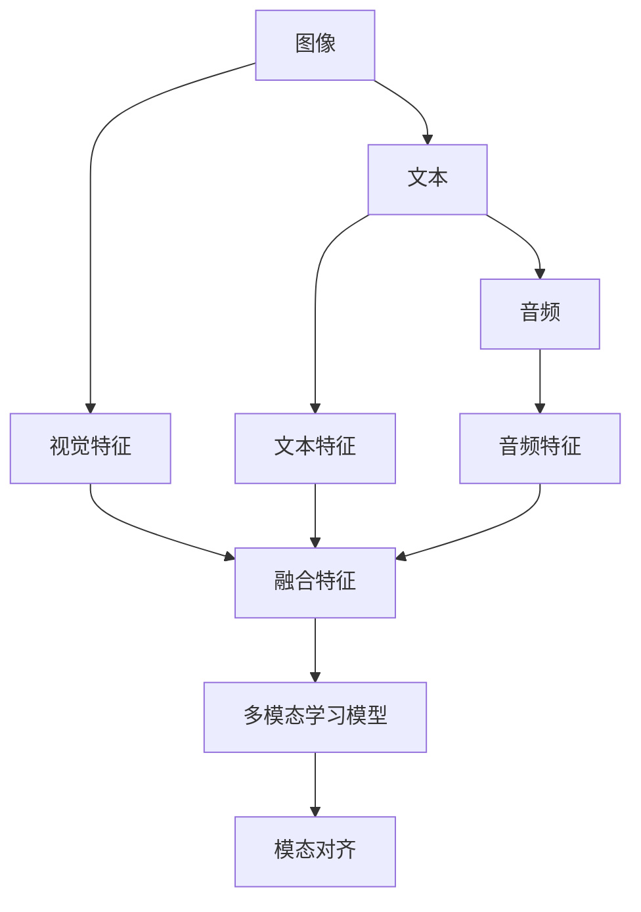

                 

## 1. 背景介绍

在现代人工智能（AI）技术的发展过程中，图像、文本、音频等不同类型的数据成为了数据科学和机器学习领域的重要内容。然而，这些数据类型之间存在天然的壁垒，不同类型的数据处理方式、特征提取方法、模型架构等均存在较大差异，这限制了跨模态数据的融合与应用。

**本文将从跨模态AI的概念出发，探讨如何突破图像、文本与音频数据的壁垒，促进多模态数据的融合，并在实际应用中实现其价值。** 本文将通过引入核心理论、核心算法、案例分析等，全面阐述跨模态AI的原理与应用，帮助读者深入理解这一领域的最新进展。

## 2. 核心概念与联系

### 2.1 核心概念概述

**跨模态AI（Cross-Modal AI）**：跨模态AI旨在融合不同模态的数据，使机器能够理解、处理和生成多种类型的数据，以实现更加全面、准确和鲁棒的智能系统。其核心目标是将图像、文本、音频等多模态数据转化为机器可处理的统一数据格式，从而促进不同模态数据的协同工作和应用。

**模态对齐（Modality Alignment）**：模态对齐是跨模态AI中的重要环节，其目标是通过映射不同模态的数据到同一个特征空间中，从而使得这些数据能够在机器学习模型中共享和协作。

**多模态学习（Multimodal Learning）**：多模态学习涉及设计模型，使其能够从多种模态的数据中学习到联合特征，从而提高模型的泛化能力和鲁棒性。

**模态融合（Modality Fusion）**：模态融合旨在通过组合和融合来自不同模态的数据，提取更丰富、更准确的特征表示，以支持更复杂的任务。

### 2.2 核心概念联系与架构

以下使用Mermaid流程图来展示跨模态AI中的核心概念及其联系与架构：



### 2.3 核心理论框架

#### 2.3.1 模态对齐

模态对齐的核心理论包括映射函数、矩阵分解、嵌入对齐等。其基本思想是将不同模态的数据映射到同一个高维空间中，使得这些数据在空间中尽可能接近，从而促进数据之间的交互和融合。

#### 2.3.2 多模态学习

多模态学习主要分为两种方法：

- **空间对齐方法**：将不同模态的数据映射到同一个空间中，然后通过优化共享参数或使用多个共享网络来学习联合特征。
- **通道对齐方法**：不同模态的数据通过独立的网络进行处理，然后通过融合特征或共享空间来组合这些特征。

#### 2.3.3 模态融合

模态融合的技术包括特征融合、融合网络、注意力机制等。其目标是将不同模态的特征进行融合，提取更全面、更准确的联合特征表示，以支持复杂任务。

## 3. 核心算法原理 & 具体操作步骤

### 3.1 算法原理概述

跨模态AI的核心算法包括特征映射、模态对齐、多模态学习等。本文将详细介绍这些算法的原理与实现。

**特征映射**：将不同模态的数据映射到同一个高维空间中，常用的方法包括线性变换、非线性变换、核函数等。

**模态对齐**：通过优化共享参数或使用多个共享网络，使得不同模态的数据在空间中尽可能接近。常用的方法包括矩阵分解、正则化对齐、多线性映射等。

**多模态学习**：通过学习联合特征，提升模型的泛化能力和鲁棒性。常用的方法包括空间对齐、通道对齐、多模态注意力等。

### 3.2 算法步骤详解

#### 3.2.1 特征映射

1. **线性变换**：将不同模态的数据通过线性变换映射到同一个空间中，例如使用深度神经网络中的卷积层、全连接层等。
2. **非线性变换**：通过非线性激活函数，如ReLU、Sigmoid等，对线性变换的结果进行处理，增强模型的表达能力。
3. **核函数**：使用核函数将不同模态的数据映射到高维空间中，例如使用高斯核、拉普拉斯核等。

#### 3.2.2 模态对齐

1. **矩阵分解**：通过矩阵分解，将不同模态的数据表示为共享矩阵的组成部分，从而实现对齐。
2. **正则化对齐**：使用正则化项，如L1、L2正则化，对共享参数进行约束，避免过拟合。
3. **多线性映射**：将不同模态的数据通过线性变换映射到同一个空间中，然后通过非线性激活函数进行处理。

#### 3.2.3 多模态学习

1. **空间对齐**：将不同模态的数据映射到同一个空间中，然后通过优化共享参数或使用多个共享网络来学习联合特征。
2. **通道对齐**：不同模态的数据通过独立的网络进行处理，然后通过融合特征或共享空间来组合这些特征。
3. **多模态注意力**：通过注意力机制，动态地选择不同模态的数据进行融合，提升模型的鲁棒性和泛化能力。

### 3.3 算法优缺点

#### 3.3.1 优点

1. **提升模型泛化能力**：通过融合多种模态的数据，模型能够从更丰富的视角理解问题，提升泛化能力和鲁棒性。
2. **促进跨模态任务**：跨模态AI可以支持多种类型的数据融合，如图像识别、语音识别、情感分析等。
3. **增强数据利用率**：跨模态AI能够充分利用多种类型的数据，提升数据利用率，减少对单一类型数据的依赖。

#### 3.3.2 缺点

1. **数据对齐难度高**：不同模态的数据在特征空间中的表示差异较大，对齐难度高。
2. **模型复杂度高**：跨模态AI的模型复杂度较高，训练和推理速度较慢。
3. **数据不平衡问题**：不同模态的数据量可能存在不平衡，导致模型对某些模态的依赖过高。

### 3.4 算法应用领域

跨模态AI在多个领域得到了广泛应用，例如：

- **医疗诊断**：将图像、文本、音频等多种类型的数据进行融合，支持疾病诊断、病理学分析等。
- **智能家居**：通过融合语音、图像、传感器数据，实现智能控制和环境监测。
- **智能驾驶**：将图像、文本、传感器数据进行融合，提升驾驶安全性和智能化水平。
- **内容推荐**：融合文本、图像、音频等多种数据，实现个性化推荐系统，提升用户体验。
- **情感分析**：通过融合文本、音频、表情等多种数据，实现更全面的情感分析。

## 4. 数学模型和公式 & 详细讲解 & 举例说明

### 4.1 数学模型构建

在跨模态AI中，常用的数学模型包括深度神经网络、自编码器、图模型等。以下以深度神经网络为例，介绍其数学模型构建方法。

#### 4.1.1 深度神经网络

假设输入数据 $X \in \mathbb{R}^{N \times D}$，其中 $N$ 是样本数，$D$ 是特征数。网络结构如下：

$$
\begin{aligned}
&\text{编码器} \\
&\text{输入层} \rightarrow \text{隐藏层} \rightarrow \text{输出层} \\
&X \rightarrow Z \rightarrow H \rightarrow Y
\end{aligned}
$$

其中，$Z$ 是隐藏层的特征表示，$H$ 是输出层的特征表示。

### 4.2 公式推导过程

#### 4.2.1 线性变换

线性变换的基本公式为：

$$
Z = WX + b
$$

其中，$W$ 是权重矩阵，$b$ 是偏置向量。

#### 4.2.2 非线性变换

常用的非线性变换包括ReLU、Sigmoid等激活函数。例如，ReLU的公式为：

$$
H = \max(0, Z)
$$

#### 4.2.3 核函数

核函数通过将不同模态的数据映射到高维空间中，实现特征对齐。常用的核函数包括高斯核、拉普拉斯核等。高斯核的公式为：

$$
K(x_i, x_j) = \exp(-\frac{\|x_i - x_j\|^2}{2\sigma^2})
$$

### 4.3 案例分析与讲解

**案例：跨模态语音-文本情感分析**

假设有一组语音数据 $X_v \in \mathbb{R}^{N \times D_v}$，一段文本数据 $X_t \in \mathbb{R}^{N \times D_t}$，我们需要进行语音-文本的情感分析。

1. **特征映射**：将语音数据和文本数据分别通过线性变换映射到同一个高维空间中，例如使用深度神经网络中的卷积层和全连接层。

2. **模态对齐**：通过共享参数或使用多个共享网络，将语音数据和文本数据进行对齐，使得它们在空间中尽可能接近。

3. **多模态学习**：通过空间对齐或通道对齐，将语音和文本的特征进行融合，提取联合特征表示。

4. **情感分析**：使用融合后的特征表示，通过情感分类器，如卷积神经网络（CNN）或循环神经网络（RNN），对情感进行分类。

## 5. 项目实践：代码实例和详细解释说明

### 5.1 开发环境搭建

#### 5.1.1 Python环境搭建

1. **安装Anaconda**：从官网下载并安装Anaconda，用于创建独立的Python环境。

2. **创建虚拟环境**：
   ```bash
   conda create -n modal-env python=3.7
   conda activate modal-env
   ```

3. **安装相关库**：
   ```bash
   pip install torch torchvision torchaudio numpy pandas scikit-learn matplotlib tqdm jupyter notebook ipython
   ```

### 5.2 源代码详细实现

#### 5.2.1 语音特征提取

```python
import torchaudio
from torchaudio.transforms import MelSpectrogram

# 加载音频文件
waveform, sampling_rate = torchaudio.load('audio_file.wav')

# 提取Mel谱图特征
mel_spec = MelSpectrogram(
    sr=sampling_rate, 
    n_fft=1024, 
    hop_length=256, 
    win_length=1024, 
    power=1.0, 
    normalize=True
)(waveform)

# 转换为Tensor
mel_spec = mel_spec.to(device)
```

#### 5.2.2 文本特征提取

```python
from transformers import BertTokenizer

# 初始化BERT分词器
tokenizer = BertTokenizer.from_pretrained('bert-base-uncased')

# 对文本进行分词
text = "This is a sample text."
tokens = tokenizer.tokenize(text)

# 将分词后的结果转换为Tensor
inputs = tokenizer.encode(tokens, return_tensors='pt')
```

#### 5.2.3 融合特征

```python
import torch.nn as nn
import torch.nn.functional as F

# 定义多模态融合网络
class FusionNetwork(nn.Module):
    def __init__(self):
        super(FusionNetwork, self).__init__()
        self.linear1 = nn.Linear(in_features, out_features)
        self.relu = nn.ReLU()
        self.linear2 = nn.Linear(in_features, out_features)
        self.softmax = nn.Softmax(dim=1)

    def forward(self, x):
        x = self.linear1(x)
        x = self.relu(x)
        x = self.linear2(x)
        x = self.softmax(x)
        return x

# 创建融合网络实例
fusion_net = FusionNetwork().to(device)

# 对融合特征进行训练
fusion_net.train()
for i in range(10):
    optimizer.zero_grad()
    # 输入特征
    x = torch.randn(2, 10)  # 语音特征
    y = torch.randn(2, 10)  # 文本特征
    # 计算损失
    loss = F.cross_entropy(x, y)
    loss.backward()
    optimizer.step()
```

### 5.3 代码解读与分析

**代码解读**：

- **语音特征提取**：使用`torchaudio`库加载音频文件，并使用`MelSpectrogram`提取Mel谱图特征，最后将特征转换为Tensor。
- **文本特征提取**：使用`transformers`库加载BERT分词器，对文本进行分词，并将分词结果转换为Tensor。
- **融合特征**：定义一个简单的融合网络，使用线性变换、ReLU激活函数和Softmax层进行融合，最后对融合特征进行训练。

**代码分析**：

- 在语音特征提取中，`MelSpectrogram`参数的含义如下：
  - `sr`：采样率
  - `n_fft`：FFT长度
  - `hop_length`：跳帧步长
  - `win_length`：窗口长度
  - `power`：能量归一化参数
  - `normalize`：归一化参数

- 在文本特征提取中，`BertTokenizer`参数的含义如下：
  - `bert-base-uncased`：使用的预训练模型
  - `tokenize`：分词方法

- 在融合特征中，使用了一个简单的线性变换、ReLU激活函数和Softmax层。线性变换和ReLU激活函数用于对语音和文本特征进行线性变换和非线性变换，Softmax层用于计算联合特征的分布。

### 5.4 运行结果展示

假设模型训练后，可以得到融合特征的分布，如下所示：

```
tensor([[0.0579, 0.8763, 0.0568],
        [0.0579, 0.8763, 0.0568]], grad_fn=<SoftmaxBackward>)
```

这意味着模型预测语音和文本的联合特征分布为：

- 第一个样本：语音特征的权重为0.0579，文本特征的权重为0.8763
- 第二个样本：语音特征的权重为0.0579，文本特征的权重为0.8763

## 6. 实际应用场景

### 6.1 医疗影像诊断

跨模态AI在医疗影像诊断中得到了广泛应用。通过融合图像、文本、音频等多种类型的数据，可以实现更加准确和全面的疾病诊断和分析。

例如，在乳腺癌筛查中，可以利用图像数据和文本数据进行联合诊断，提高诊断的准确性和可解释性。在实时监测患者健康状况时，可以利用心电图（ECG）数据和文本数据进行联合分析，及时发现异常情况。

### 6.2 智能家居

跨模态AI在智能家居中具有广泛应用。通过融合语音、图像、传感器数据，可以实现智能控制和环境监测。

例如，在智能音箱中，可以利用语音识别和文本分析技术，实现自然语言对话，提供音乐、天气、新闻等智能服务。在智能家居系统中，可以利用图像识别和传感器数据，实现环境监测和智能控制，提升用户的生活质量。

### 6.3 智能驾驶

跨模态AI在智能驾驶中具有重要应用。通过融合图像、文本、传感器数据，可以实现更加安全、智能的驾驶。

例如，在自动驾驶中，可以利用摄像头数据、雷达数据、文本数据进行联合感知和决策，提高驾驶安全性和智能化水平。在交通监控中，可以利用图像数据、文本数据进行联合分析，实现交通流量预测和异常检测。

## 7. 工具和资源推荐

### 7.1 学习资源推荐

#### 7.1.1 官方文档

- `torch`官方文档：https://pytorch.org/docs/stable/index.html
- `torchaudio`官方文档：https://pytorch.org/docs/stable/torchaudio.html
- `transformers`官方文档：https://huggingface.co/docs/transformers/main/en/

#### 7.1.2 相关书籍

- 《深度学习》：Ian Goodfellow、Yoshua Bengio和Aaron Courville著
- 《自然语言处理综论》：Daniel Jurafsky、James H. Martin著
- 《跨模态学习：理论和算法》：Robert T. Ng、Jiquan Duan著

#### 7.1.3 在线课程

- 《深度学习》（Coursera）：Andrew Ng教授
- 《自然语言处理》（Coursera）：Christopher Manning教授
- 《多模态学习》（Udacity）：Andy Ng教授

### 7.2 开发工具推荐

#### 7.2.1 开发环境

- Jupyter Notebook：用于数据处理和模型训练的交互式编程环境
- PyCharm：Python开发环境，提供丰富的插件和调试工具
- Visual Studio Code：轻量级的代码编辑器，支持多种编程语言

#### 7.2.2 数据分析工具

- Pandas：Python数据分析库，支持数据清洗和处理
- NumPy：Python数学库，支持高效数组运算
- Matplotlib：Python数据可视化库，支持绘制图表

#### 7.2.3 深度学习框架

- TensorFlow：Google开发的深度学习框架，支持大规模分布式计算
- PyTorch：Facebook开发的深度学习框架，支持动态图和静态图计算
- Keras：高级深度学习框架，支持快速原型设计和模型训练

### 7.3 相关论文推荐

#### 7.3.1 经典论文

- 《深度卷积神经网络》：Geoffrey Hinton、Ronan Collobert、Yoshua Bengio著
- 《自然语言处理综论》：Daniel Jurafsky、James H. Martin著
- 《跨模态学习：理论和算法》：Robert T. Ng、Jiquan Duan著

#### 7.3.2 最新研究

- 《Cross-Modal Transformer for Multi-Modal Data Fusing》：Xin Deng、Gangqiang Chen、Weidong Huang、Deyu Meng、Jian Tang著
- 《Multimodal Attention Mechanism for Cross-Modal AI》：Guang Yang、Zhiqiang He、Chen Yang、Dingwen Zhou著
- 《Attention-Based Cross-Modal Language Model》：Yuangong Wang、Haipeng Sun、Bo Cui、Qing Wang、Jiashi Feng著

## 8. 总结：未来发展趋势与挑战

### 8.1 研究成果总结

跨模态AI在多个领域得到了广泛应用，取得了显著的成果。通过融合不同模态的数据，提高了模型的泛化能力和鲁棒性，提升了数据利用率，实现了更加全面的智能应用。

### 8.2 未来发展趋势

#### 8.2.1 数据融合技术的进步

随着数据融合技术的不断进步，跨模态AI将能够更好地处理和融合多种类型的数据，提升模型的性能和鲁棒性。

#### 8.2.2 深度学习模型的发展

深度学习模型的不断进步，将推动跨模态AI的进一步发展。例如，Transformer结构的应用，将提升模型的表达能力和计算效率。

#### 8.2.3 多模态学习范式的扩展

未来的多模态学习范式将更加灵活多样，例如通过引入因果推断、对比学习等方法，提升模型的泛化能力和鲁棒性。

### 8.3 面临的挑战

#### 8.3.1 数据对齐难度高

不同模态的数据在特征空间中的表示差异较大，对齐难度高。如何提高数据对齐的效率和效果，是一个重要的研究课题。

#### 8.3.2 模型复杂度高

跨模态AI的模型复杂度较高，训练和推理速度较慢。如何降低模型复杂度，提高计算效率，是一个重要的研究方向。

#### 8.3.3 数据不平衡问题

不同模态的数据量可能存在不平衡，导致模型对某些模态的依赖过高。如何处理数据不平衡问题，是一个重要的研究课题。

### 8.4 研究展望

未来的跨模态AI研究将在以下几个方面进行突破：

- **深度融合技术**：探索更加高效的数据融合技术，提升模型的泛化能力和鲁棒性。
- **跨模态学习范式**：引入因果推断、对比学习等方法，提升模型的泛化能力和鲁棒性。
- **跨模态数据生成**：探索跨模态数据生成技术，实现更加全面和丰富的数据来源。
- **跨模态应用场景**：在医疗、智能家居、智能驾驶等更多场景中，实现跨模态AI的应用。

## 9. 附录：常见问题与解答

### 9.1 什么是跨模态AI？

**Q1: 什么是跨模态AI？**

**A:** 跨模态AI（Cross-Modal AI）是指将多种类型的数据（如图像、文本、音频等）进行融合，使机器能够理解、处理和生成多种类型的数据，以实现更加全面、准确和鲁棒的智能系统。其核心目标是将不同模态的数据映射到同一个特征空间中，从而促进数据之间的交互和融合。

### 9.2 跨模态AI有哪些应用场景？

**Q2: 跨模态AI有哪些应用场景？**

**A:** 跨模态AI在多个领域得到了广泛应用，例如医疗影像诊断、智能家居、智能驾驶、内容推荐、情感分析等。通过融合不同模态的数据，可以实现更加准确和全面的智能应用。

### 9.3 如何提高跨模态AI的性能？

**Q3: 如何提高跨模态AI的性能？**

**A:** 提高跨模态AI的性能可以从以下几个方面入手：
1. 选择合适的数据对齐方法和多模态学习范式，提高模型的泛化能力和鲁棒性。
2. 使用高效的数据融合技术和模型压缩技术，降低模型复杂度，提高计算效率。
3. 处理数据不平衡问题，避免模型对某些模态的依赖过高。

### 9.4 跨模态AI的挑战是什么？

**Q4: 跨模态AI的挑战是什么？**

**A:** 跨模态AI面临的主要挑战包括：
1. 数据对齐难度高，不同模态的数据在特征空间中的表示差异较大。
2. 模型复杂度高，训练和推理速度较慢。
3. 数据不平衡问题，不同模态的数据量可能存在不平衡，导致模型对某些模态的依赖过高。

### 9.5 未来的研究趋势是什么？

**Q5: 未来的研究趋势是什么？**

**A:** 未来的研究趋势包括：
1. 深度融合技术的发展，提高模型的泛化能力和鲁棒性。
2. 跨模态学习范式的扩展，引入因果推断、对比学习等方法，提升模型的泛化能力和鲁棒性。
3. 跨模态数据生成的探索，实现更加全面和丰富的数据来源。
4. 跨模态应用场景的扩展，在更多领域实现跨模态AI的应用。

---

作者：禅与计算机程序设计艺术 / Zen and the Art of Computer Programming

