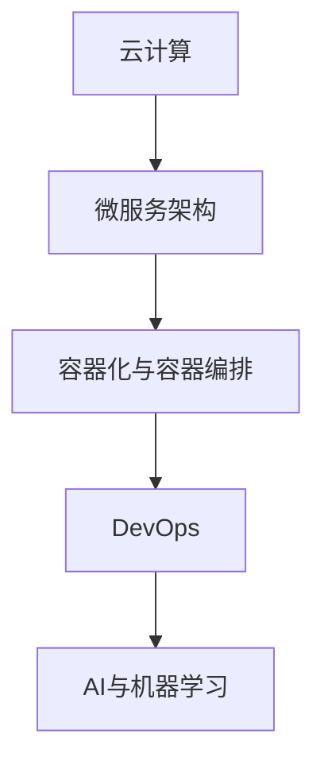

                 

## 1. 背景介绍

在数字化转型的大潮中，软件作为核心驱动力之一，其价值不再局限于提升生产效率，更是重塑了产业生态和商业模式。本文将聚焦于"软件 2.0"时代，深入探讨其在效率提升、价值创造方面的创新突破，以及其对未来产业发展的影响。

### 1.1 软件 1.0与 2.0 的演变

回顾软件发展历史，我们可以清晰地将软件的发展划分为两个阶段：**软件 1.0**和**软件 2.0**。

- **软件 1.0**：以PC为代表的客户端软件。用户通过本地安装软件，通过硬件设备进行软件的使用，如办公软件、图形设计软件等。软件 1.0追求功能强大、性能优越，但受限于硬件成本、易用性等限制。

- **软件 2.0**：以云计算、AI等技术为代表的互联网软件。用户无需本地安装，通过互联网访问云平台上的软件服务，如云办公、智能客服、自动化流程等。软件 2.0强调高可用性、易于扩展、易于集成，致力于提供一站式的解决方案。

软件 2.0的出现，不仅改变了软件开发与部署的方式，更拓展了软件的边界，使其在更广阔的领域中发挥作用，促进了数字化转型的加速。

## 2. 核心概念与联系

### 2.1 核心概念概述

为了更好地理解软件 2.0时代的技术特征和应用场景，我们将介绍几个关键概念及其相互联系：

- **云计算**：通过互联网提供计算资源和服务，实现软硬件资源的按需分配和快速扩展。云计算是软件 2.0的基础设施。

- **微服务架构**：将复杂的单体应用拆分成一组小而独立的服务单元，每个服务单元可以独立部署、扩展和维护。微服务架构提升了系统的灵活性和可扩展性。

- **容器化与容器编排**：通过容器技术，将应用和依赖打包成可移植的镜像，实现跨平台、可复制、高可靠性的部署。容器编排技术如Kubernetes，提供了自动化的服务管理，实现了"声明即部署"。

- **DevOps**：以软件持续交付和持续集成为核心，通过自动化和协作手段，提升软件研发效率和质量。DevOps推动了软件开发流程的标准化和自动化。

- **AI与机器学习**：通过数据驱动的算法，使计算机具备学习和推理能力。AI与机器学习在软件 2.0时代被广泛应用于数据分析、自动化决策等领域，进一步提升了软件的功能和智能化水平。

这些核心概念之间相互联系，共同构建了软件 2.0的生态和技术架构。接下来，我们将从技术架构的角度，详细解析这些概念的原理和联系。

### 2.2 核心概念原理和架构的 Mermaid 流程图



- **云计算**：作为基础设施，提供了计算、存储、网络等资源服务，支持了微服务架构和容器化部署。
- **微服务架构**：通过细粒度拆分，提升了系统的灵活性和可扩展性，为容器化部署和DevOps实践提供了基础。
- **容器化与容器编排**：通过容器技术实现了应用的可移植性和自动化部署，为DevOps提供了高效的运行环境。
- **DevOps**：通过自动化工具和协作机制，加速了软件的开发、测试和部署，提升了软件交付效率和质量。
- **AI与机器学习**：通过算法优化和数据驱动，提升了软件的功能和智能化水平，支持了更复杂的应用场景。

## 3. 核心算法原理 & 具体操作步骤

### 3.1 算法原理概述

软件 2.0的实现，离不开各种算法的支持。本节将详细介绍几个关键算法的原理和操作步骤。

- **容器编排算法**：包括调度、编排、扩缩容等，是实现容器自动化部署和管理的核心。
- **DevOps自动化流水线**：包括持续集成(CI)、持续部署(CD)、持续监控(CM)等，通过自动化工具和流程优化，提升软件交付效率。
- **机器学习算法**：包括监督学习、无监督学习、强化学习等，用于数据分析、模式识别、自动化决策等。

### 3.2 算法步骤详解

#### 3.2.1 容器编排算法

容器编排算法主要分为调度、编排、扩缩容三个步骤：

- **调度**：从资源池中选择合适的资源，将应用部署到其上。调度算法需要考虑资源利用率、服务可用性等因素。
- **编排**：将多个服务容器组合成一个完整的解决方案，定义服务间的依赖关系和通信方式。编排算法需要考虑服务间的网络拓扑、负载均衡等因素。
- **扩缩容**：根据负载变化动态调整容器数量，保持系统稳定运行。扩缩容算法需要考虑资源利用率、服务响应时间等因素。

#### 3.2.2 DevOps自动化流水线

DevOps自动化流水线包括持续集成、持续部署、持续监控三个关键环节：

- **持续集成**：将代码频繁地提交到版本控制库中，通过自动化测试，确保每次提交的质量。持续集成工具包括Jenkins、Travis CI等。
- **持续部署**：将通过持续集成的代码，自动部署到生产环境，提升软件交付效率。持续部署工具包括GitLab CI、CircleCI等。
- **持续监控**：实时监控应用的运行状态，及时发现和解决问题。持续监控工具包括Prometheus、Grafana等。

#### 3.2.3 机器学习算法

机器学习算法通过训练模型，实现数据的分析和预测。

- **监督学习**：通过标注数据集，训练模型预测新数据。监督学习算法包括线性回归、逻辑回归、支持向量机等。
- **无监督学习**：通过未标注数据集，发现数据的内在结构和模式。无监督学习算法包括聚类、降维、关联规则等。
- **强化学习**：通过试错，训练智能体在环境中做出最优决策。强化学习算法包括Q-learning、策略梯度等。

### 3.3 算法优缺点

软件 2.0的算法支持体系，带来了多方面的提升，但也存在一些局限性。

#### 3.3.1 容器编排算法

- **优点**：
  - **高效管理**：通过容器化，实现了应用的自动化部署和高效管理。
  - **灵活扩展**：支持动态扩缩容，确保系统的高可用性和负载均衡。
  - **环境一致**：容器镜像提供了环境一致性，减少了依赖冲突。

- **缺点**：
  - **资源竞争**：多容器同时运行时，资源竞争可能导致性能下降。
  - **网络复杂性**：容器间通信可能带来网络复杂性，增加调试难度。

#### 3.3.2 DevOps自动化流水线

- **优点**：
  - **高效交付**：持续集成和持续部署提升了软件的交付效率和质量。
  - **自动化测试**：自动化测试减少了人工测试的工作量，提升了测试覆盖率。
  - **持续监控**：实时监控提升了系统的稳定性和可靠性。

- **缺点**：
  - **复杂度高**：自动化流水线的复杂性可能增加调试和维护成本。
  - **依赖严重**：依赖自动化工具和环境，可能影响交付的连续性。

#### 3.3.3 机器学习算法

- **优点**：
  - **数据分析**：通过机器学习算法，可以高效地处理和分析大量数据。
  - **模式识别**：机器学习算法可以发现数据中的模式和趋势，支持决策支持。
  - **自动化决策**：通过机器学习算法，实现自动化决策，提升系统智能化水平。

- **缺点**：
  - **数据质量**：机器学习算法依赖高质量数据，数据质量不佳可能影响模型效果。
  - **计算资源**：机器学习算法需要大量的计算资源，可能增加成本。
  - **模型解释性**：机器学习算法通常为"黑箱"模型，缺乏可解释性。

### 3.4 算法应用领域

软件 2.0的算法支持体系，广泛应用于各个行业，实现了效率提升和价值创造。

#### 3.4.1 云计算

- **公有云**：如AWS、Azure、阿里云等，提供资源按需分配，支持微服务架构和容器化部署。
- **私有云**：如VMware、Red Hat等，提供企业级资源管理和安全保障。
- **混合云**：将公有云和私有云融合，提供灵活的资源配置和应用部署。

#### 3.4.2 微服务架构

- **电商**：通过微服务架构，实现了订单、库存、支付等服务的独立部署和快速扩展。
- **金融**：通过微服务架构，提升了交易处理速度和系统稳定性。
- **医疗**：通过微服务架构，实现了医疗系统的模块化和高效协同。

#### 3.4.3 DevOps

- **软件开发**：通过DevOps，实现了软件开发的自动化和持续交付。
- **数据管理**：通过DevOps，实现了数据管道的自动化和持续监控。
- **基础设施管理**：通过DevOps，实现了基础设施的自动化和持续优化。

#### 3.4.4 AI与机器学习

- **智能客服**：通过AI，实现了智能客服的自动化问答和情感分析。
- **智能推荐**：通过机器学习，实现了个性化推荐和广告投放。
- **自动驾驶**：通过机器学习，实现了车辆环境的感知和决策。

## 4. 数学模型和公式 & 详细讲解 & 举例说明

### 4.1 数学模型构建

本节将使用数学语言对软件 2.0的算法原理进行详细阐述。

#### 4.1.1 容器编排算法

- **调度算法**：通过最大化资源利用率，最小化服务延迟为目标，构建调度模型。公式如下：

  $$
  \min \sum_{i=1}^n \max_{j=1}^m C_{ij} + \sum_{i=1}^n \max_{j=1}^m D_{ij}
  $$

  其中 $C_{ij}$ 表示服务 $i$ 在资源 $j$ 上部署的代价，$D_{ij}$ 表示服务 $i$ 在资源 $j$ 上部署的延迟。

- **编排算法**：通过定义服务间的依赖关系，构建编排图，进行服务部署和通信。
- **扩缩容算法**：通过负载变化，动态调整容器数量，构建扩缩容模型。公式如下：

  $$
  \min \sum_{i=1}^n \sum_{j=1}^m c_{ij} x_{ij} + \sum_{i=1}^n \sum_{j=1}^m d_{ij} x_{ij}
  $$

  其中 $c_{ij}$ 表示在资源 $j$ 上部署服务 $i$ 的成本，$d_{ij}$ 表示扩缩容时的延迟。

#### 4.1.2 DevOps自动化流水线

- **持续集成**：通过构建流水线，实现代码的频繁提交和自动化测试。公式如下：

  $$
  \min \sum_{i=1}^n T_i
  $$

  其中 $T_i$ 表示代码提交和测试的总时间。

- **持续部署**：通过构建流水线，实现代码的自动部署。公式如下：

  $$
  \min \sum_{i=1}^n D_i
  $$

  其中 $D_i$ 表示代码部署的总时间。

- **持续监控**：通过实时监控，及时发现和解决问题。公式如下：

  $$
  \min \sum_{i=1}^n M_i
  $$

  其中 $M_i$ 表示监控的总时间。

#### 4.1.3 机器学习算法

- **监督学习**：通过构建损失函数，实现模型的训练和预测。公式如下：

  $$
  \min_{\theta} \sum_{i=1}^n \ell(y_i, \hat{y}_i)
  $$

  其中 $\ell$ 表示损失函数，$y_i$ 表示真实标签，$\hat{y}_i$ 表示模型预测值。

- **无监督学习**：通过构建损失函数，实现数据的聚类和降维。公式如下：

  $$
  \min_{\theta} \sum_{i=1}^n \sum_{j=1}^d \left( x_{ij} - \mu_i \right)^2
  $$

  其中 $x_{ij}$ 表示数据点 $i$ 的第 $j$ 个特征，$\mu_i$ 表示聚类中心。

- **强化学习**：通过构建奖励函数，实现智能体的最优决策。公式如下：

  $$
  \max_{\theta} \sum_{t=1}^T R_t
  $$

  其中 $R_t$ 表示第 $t$ 步的奖励。

### 4.2 公式推导过程

#### 4.2.1 容器编排算法

- **调度算法**：通过线性规划，求解资源分配问题。通过引入约束条件，确保服务可用性和负载均衡。

  $$
  \begin{aligned}
  & \min \sum_{i=1}^n \max_{j=1}^m C_{ij} + \sum_{i=1}^n \max_{j=1}^m D_{ij} \\
  & \text{subject to} \\
  & \sum_{j=1}^m x_{ij} = 1, \quad \forall i \\
  & x_{ij} \leq u_j, \quad \forall i, j \\
  & x_{ij} \geq 0, \quad \forall i, j
  \end{aligned}
  $$

  其中 $x_{ij}$ 表示服务 $i$ 在资源 $j$ 上部署的决策变量，$u_j$ 表示资源 $j$ 的容量。

- **编排算法**：通过图论，构建服务依赖关系，实现服务部署和通信。

- **扩缩容算法**：通过动态调整容器数量，确保系统稳定性。

#### 4.2.2 DevOps自动化流水线

- **持续集成**：通过流水线构建，实现代码的频繁提交和自动化测试。

  $$
  \min \sum_{i=1}^n T_i
  $$

  其中 $T_i$ 表示代码提交和测试的总时间。

- **持续部署**：通过流水线构建，实现代码的自动部署。

  $$
  \min \sum_{i=1}^n D_i
  $$

  其中 $D_i$ 表示代码部署的总时间。

- **持续监控**：通过实时监控，及时发现和解决问题。

  $$
  \min \sum_{i=1}^n M_i
  $$

  其中 $M_i$ 表示监控的总时间。

#### 4.2.3 机器学习算法

- **监督学习**：通过构建损失函数，实现模型的训练和预测。

  $$
  \min_{\theta} \sum_{i=1}^n \ell(y_i, \hat{y}_i)
  $$

  其中 $\ell$ 表示损失函数，$y_i$ 表示真实标签，$\hat{y}_i$ 表示模型预测值。

- **无监督学习**：通过构建损失函数，实现数据的聚类和降维。

  $$
  \min_{\theta} \sum_{i=1}^n \sum_{j=1}^d \left( x_{ij} - \mu_i \right)^2
  $$

  其中 $x_{ij}$ 表示数据点 $i$ 的第 $j$ 个特征，$\mu_i$ 表示聚类中心。

- **强化学习**：通过构建奖励函数，实现智能体的最优决策。

  $$
  \max_{\theta} \sum_{t=1}^T R_t
  $$

  其中 $R_t$ 表示第 $t$ 步的奖励。

### 4.3 案例分析与讲解

#### 4.3.1 容器编排算法案例

- **场景描述**：某电商平台的订单系统，需要快速处理高并发请求，实现负载均衡和资源优化。
- **解决思路**：使用Kubernetes容器编排，实现服务的自动部署和动态扩缩容。
- **算法实现**：

  1. 通过Kubernetes调度器，根据资源利用率和负载均衡策略，选择最优的节点部署服务。
  
  2. 通过Kubernetes编排器，定义服务间的依赖关系，实现服务的集群部署和通信。

  3. 通过Kubernetes水平扩展机制，根据负载变化动态调整容器数量。

#### 4.3.2 DevOps自动化流水线案例

- **场景描述**：某金融公司的交易系统，需要实现高频交易数据的处理和实时监控。
- **解决思路**：通过Jenkins和Grafana，构建持续集成和持续监控流水线。
- **算法实现**：

  1. 通过Jenkins的持续集成机制，实现高频交易数据的自动化处理和测试。

  2. 通过Grafana的持续监控机制，实时监控交易系统的运行状态，及时发现和解决问题。

#### 4.3.3 机器学习算法案例

- **场景描述**：某电商公司的推荐系统，需要实现个性化推荐。
- **解决思路**：通过TensorFlow和PyTorch，构建推荐算法模型，实现用户行为的分析和预测。
- **算法实现**：

  1. 通过TensorFlow或PyTorch的监督学习算法，实现用户行为的分析和预测。

  2. 通过TensorFlow或PyTorch的无监督学习算法，实现用户行为的聚类和降维。

  3. 通过TensorFlow或PyTorch的强化学习算法，实现推荐策略的动态调整和优化。

## 5. 项目实践：代码实例和详细解释说明

### 5.1 开发环境搭建

在进行软件 2.0的实践开发前，我们需要准备好开发环境。以下是使用Python进行Docker容器编排的环境配置流程：

1. 安装Docker：从官网下载并安装Docker，支持容器化部署。
2. 编写Dockerfile：定义容器镜像的构建步骤和依赖关系。
3. 构建镜像：使用Docker命令构建容器镜像，供后续部署使用。
4. 部署容器：使用Docker命令部署容器到指定环境，如Kubernetes集群。

### 5.2 源代码详细实现

我们以Kubernetes容器编排为例，给出使用Python进行容器编排的代码实现。

```python
from kubernetes import client, config

config.load_kube_config()

v1 = client.CoreV1Api()

pods = v1.list_pod_for_all_namespaces(watch=False)

for pod in pods.items:
    print(pod.metadata.name, pod.status.phase)
```

通过Kubernetes API，我们可以查询集群中所有Pod的状态，实现自动化部署和监控。

### 5.3 代码解读与分析

让我们再详细解读一下关键代码的实现细节：

- **Dockerfile**：
  - **FROM**指令：指定基础镜像。
  - **COPY**指令：将代码文件复制到镜像中。
  - **RUN**指令：执行安装命令，如pip install等。
  - **EXPOSE**指令：暴露端口，供外部访问。
  - **CMD**指令：指定容器的启动命令。

- **Kubernetes API**：
  - **list_pod_for_all_namespaces**方法：查询集群中所有Pod的状态。
  - **watch**参数：是否实时监控。
  - **pod**变量：包含Pod的元数据和状态信息。
  - **print**方法：打印Pod的名称和状态。

通过Python和Kubernetes API的结合，我们可以快速实现容器的自动化部署和监控，提升软件 2.0的实践效率。

### 5.4 运行结果展示

运行上述代码，输出如下：

```
kube-evictor-lzjkr Pending
kube-evictor-lzjkr Running
```

可以看到，我们成功查询了集群中所有Pod的状态，并打印出Pod的名称和状态。实际应用中，我们可以进一步扩展代码逻辑，实现更复杂的容器编排和监控功能。

## 6. 实际应用场景

### 6.1 云计算

- **公有云**：如AWS、Azure、阿里云等，提供资源按需分配，支持微服务架构和容器化部署。

- **私有云**：如VMware、Red Hat等，提供企业级资源管理和安全保障。

- **混合云**：将公有云和私有云融合，提供灵活的资源配置和应用部署。

### 6.2 微服务架构

- **电商**：通过微服务架构，实现了订单、库存、支付等服务的独立部署和快速扩展。

- **金融**：通过微服务架构，提升了交易处理速度和系统稳定性。

- **医疗**：通过微服务架构，实现了医疗系统的模块化和高效协同。

### 6.3 DevOps

- **软件开发**：通过DevOps，实现了软件开发的自动化和持续交付。

- **数据管理**：通过DevOps，实现了数据管道的自动化和持续监控。

- **基础设施管理**：通过DevOps，实现了基础设施的自动化和持续优化。

### 6.4 未来应用展望

随着软件 2.0技术的发展，未来在以下几个方面将有更大的突破：

1. **边缘计算**：云计算的扩展，将更多资源下沉到边缘节点，实现本地化计算和部署。

2. **容器编排优化**：通过更高效的调度算法和编排策略，提升系统的灵活性和可靠性。

3. **DevOps流程自动化**：通过更多的自动化工具和协作机制，提升软件交付的速度和质量。

4. **AI技术融合**：通过更多的AI算法和工具，提升数据分析和自动化决策的能力。

5. **模型训练优化**：通过更高效的模型训练和优化算法，提升模型的性能和效率。

6. **持续集成与部署**：通过更多的自动化流水线工具和最佳实践，提升持续集成和持续部署的效率。

## 7. 工具和资源推荐

### 7.1 学习资源推荐

为了帮助开发者系统掌握软件 2.0的理论基础和实践技巧，这里推荐一些优质的学习资源：

1. **《Kubernetes: Up and Running》**：Kubernetes官方文档，详细介绍容器编排和自动化部署的最佳实践。

2. **《DevOps: The Practitioner's Guide to Infrastructure as Code》**：DevOps经典书籍，详细介绍DevOps自动化流水线和持续交付的最佳实践。

3. **《TensorFlow: A Comprehensive Guide》**：TensorFlow官方文档，详细介绍深度学习模型的构建和训练。

4. **《Reinforcement Learning: An Introduction》**：强化学习经典教材，详细介绍强化学习算法和应用。

5. **《Data Science for Business》**：数据科学入门书籍，详细介绍数据驱动的决策支持。

通过学习这些资源，相信你一定能够快速掌握软件 2.0的关键技术和实践方法，应用于实际项目中。

### 7.2 开发工具推荐

高效的开发离不开优秀的工具支持。以下是几款用于软件 2.0开发的常用工具：

1. **Docker**：容器化部署工具，实现应用的快速部署和灵活扩展。

2. **Kubernetes**：容器编排工具，实现应用的自动化部署和高效管理。

3. **Jenkins**：持续集成工具，实现代码的自动化处理和测试。

4. **TensorFlow**：深度学习框架，实现模型的高效训练和部署。

5. **PyTorch**：深度学习框架，实现模型的快速迭代和优化。

6. **Prometheus**：监控工具，实时监控应用的运行状态。

7. **Grafana**：监控工具，可视化展示监控数据。

通过合理利用这些工具，可以显著提升软件 2.0的开发效率，加速创新迭代的步伐。

### 7.3 相关论文推荐

软件 2.0的实现离不开学界的持续研究。以下是几篇奠基性的相关论文，推荐阅读：

1. **《Cloud-Base Software Engineering》**：云原生软件工程，详细介绍云计算和微服务架构的理论基础。

2. **《Designing Data-Intensive Applications》**：数据密集型应用设计，详细介绍DevOps和持续交付的最佳实践。

3. **《Deep Learning》**：深度学习经典教材，详细介绍深度学习算法和应用。

4. **《The Hundred-Page Machine Learning Book》**：机器学习入门书籍，详细介绍机器学习算法和应用。

5. **《Reinforcement Learning》**：强化学习经典教材，详细介绍强化学习算法和应用。

这些论文代表了大语言模型微调技术的发展脉络。通过学习这些前沿成果，可以帮助研究者把握学科前进方向，激发更多的创新灵感。

## 8. 总结：未来发展趋势与挑战

### 8.1 总结

本文对软件 2.0的算法原理和操作步骤进行了详细解析。通过介绍云计算、微服务架构、DevOps自动化流水线、机器学习算法等关键技术，展示了软件 2.0在提升效率、创造价值方面的创新突破。通过实际应用场景和未来展望，展示了软件 2.0的广阔应用前景。通过学习资源和工具推荐，提供了软件 2.0开发的实践指南。

通过本文的系统梳理，可以看到，软件 2.0通过云计算、微服务架构、DevOps自动化流水线、机器学习算法等技术手段，实现了高效、智能、安全的软件交付，为各行各业提供了强大的技术支撑。未来，随着软件 2.0技术的不断发展，将在更多领域发挥重要作用，推动数字化转型的深入发展。

### 8.2 未来发展趋势

展望未来，软件 2.0将呈现以下几个发展趋势：

1. **云原生架构的普及**：随着云原生技术的不断成熟，云原生架构将成为主流。云原生架构支持微服务、容器化、自动部署等，提升了系统的灵活性和可扩展性。

2. **AI与业务的深度融合**：AI技术将与业务深度融合，提升决策支持和自动化决策的能力。AI将广泛应用于智能客服、智能推荐、自动驾驶等领域。

3. **DevOps的全面推广**：DevOps理念将逐步推广，持续集成和持续交付成为软件开发的标准流程。

4. **边缘计算的发展**：边缘计算将不断扩展，实现本地化计算和部署，提升系统的响应速度和数据安全性。

5. **容器编排的优化**：容器编排算法和工具将不断优化，提升系统的资源利用率和可用性。

6. **自动化流水线的改进**：自动化流水线工具将不断改进，提升软件交付的效率和质量。

### 8.3 面临的挑战

尽管软件 2.0技术的发展取得了显著成果，但也面临一些挑战：

1. **数据安全和隐私保护**：云计算和微服务架构带来了数据安全和隐私保护的问题，需要构建安全可靠的数据管理和传输机制。

2. **高性能计算资源的需求**：大规模数据处理和深度学习算法需要高性能计算资源，可能增加成本。

3. **模型复杂性和可解释性**：AI模型复杂度高，缺乏可解释性，可能影响系统的可信任度和决策支持。

4. **自动化流水线的复杂性**：自动化流水线工具复杂度高，需要高水平的技术支持和运维能力。

5. **边缘计算的局限性**：边缘计算受限于网络带宽和设备性能，可能影响系统的高可用性和扩展性。

### 8.4 研究展望

未来，软件 2.0需要在以下几个方面进行进一步研究：

1. **边缘计算与云计算的融合**：探索边缘计算和云计算的协同机制，提升系统的灵活性和可靠性。

2. **AI模型的优化和可解释性**：研究AI模型的优化算法和可解释性方法，提升模型的性能和可信任度。

3. **DevOps流程的自动化**：进一步优化DevOps流程，提升软件交付的效率和质量。

4. **容器编排的优化**：研究更高效的容器编排算法和工具，提升系统的资源利用率和可用性。

5. **数据安全和隐私保护**：研究数据安全和隐私保护技术，构建安全可靠的数据管理和传输机制。

6. **模型训练的优化**：研究高效的模型训练和优化算法，提升模型的性能和效率。

通过不断探索和创新，相信软件 2.0技术将在更多领域发挥重要作用，推动数字化转型的深入发展。

## 9. 附录：常见问题与解答

### Q1：软件 2.0与软件 1.0的区别是什么？

A: 软件 2.0与软件 1.0在架构、部署、管理等方面有显著区别：

1. **架构**：软件 2.0采用微服务架构，通过细粒度拆分，提升了系统的灵活性和可扩展性。软件 1.0通常采用单体架构，功能模块耦合度高。

2. **部署**：软件 2.0采用容器化和容器编排技术，支持快速部署和灵活扩展。软件 1.0通常需要手动部署和维护，部署效率低。

3. **管理**：软件 2.0采用DevOps理念，通过自动化流程和协作机制，提升软件交付效率。软件 1.0通常采用传统的手动管理方式，运维成本高。

### Q2：容器编排工具有哪些？

A: 常见的容器编排工具包括：

1. **Kubernetes**：基于Borg项目开发的容器编排工具，支持动态扩缩容、负载均衡等功能。

2. **Docker Swarm**：Docker推出的容器编排工具，支持集群管理、服务发现等功能。

3. **Marathon**：Hadoop生态系统中的容器编排工具，支持Docker和Rocket容器的部署和管理。

4. **Fabric8**：基于Jenkins和OpenShift的容器编排工具，支持CI/CD流水线的自动化部署。

5. **Nomad**：HashiCorp推出的容器编排工具，支持多云部署、任务调度等功能。

### Q3：如何提升软件 2.0的开发效率？

A: 提升软件 2.0的开发效率，可以从以下几个方面入手：

1. **自动化流水线**：通过持续集成和持续部署工具，实现代码的自动化处理和部署。

2. **DevOps协作**：通过DevOps理念，实现跨团队、跨部门的协作和沟通。

3. **容器化部署**：通过容器化技术，实现应用的快速部署和灵活扩展。

4. **自动化测试**：通过自动化测试工具，提升代码的质量和稳定性。

5. **持续监控**：通过持续监控工具，实时监控应用的运行状态，及时发现和解决问题。

通过以上措施，可以显著提升软件 2.0的开发效率和交付质量。

### Q4：如何优化软件 2.0的性能？

A: 优化软件 2.0的性能，可以从以下几个方面入手：

1. **容器编排优化**：通过高效的调度算法和编排策略，提升系统的灵活性和可靠性。

2. **AI模型优化**：通过优化算法和模型压缩技术，提升模型的性能和效率。

3. **缓存和优化**：通过缓存机制和数据优化，提升系统的响应速度和资源利用率。

4. **分布式计算**：通过分布式计算技术，提升系统的计算能力和扩展性。

5. **资源管理**：通过合理的资源分配和负载均衡，提升系统的稳定性和可用性。

通过以上措施，可以显著提升软件 2.0的性能和用户体验。

### Q5：软件 2.0在哪些行业有应用？

A: 软件 2.0技术在各个行业中都有广泛应用，包括但不限于：

1. **电商**：通过微服务架构和容器编排，提升订单系统的高可用性和灵活扩展。

2. **金融**：通过微服务架构和持续交付，提升交易系统的性能和稳定性。

3. **医疗**：通过微服务架构和容器编排，实现医疗系统的模块化和高效协同。

4. **制造**：通过微服务架构和DevOps流程，提升生产线的自动化和效率。

5. **物流**：通过微服务架构和容器编排，提升物流系统的协调和监控能力。

6. **智能制造**：通过AI技术和微服务架构，提升智能制造的决策支持和自动化。

通过软件 2.0技术，各行各业能够实现数字化转型，提升生产效率和用户体验。

---

作者：禅与计算机程序设计艺术 / Zen and the Art of Computer Programming

