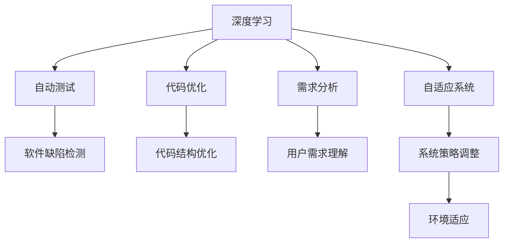

                 

# 软件 2.0 的发展趋势：深度学习、强化学习

> 关键词：软件 2.0, 深度学习, 强化学习, 自适应系统, 软件工程, 人工智能

## 1. 背景介绍

### 1.1 问题由来
在过去几十年中，软件行业经历了巨大的变化，从早期的面向过程编程到现代的面向对象编程，再到近年来的微服务架构、DevOps和云计算。这些变化在很大程度上提高了软件开发效率和产品质量，但也带来了新的挑战，如复杂性增加、维护成本上升等。面对这些挑战，软件工程领域亟需新的技术和方法来提升软件系统的开发和运维效率。

深度学习和强化学习作为人工智能领域的前沿技术，为软件工程提供了新的思路和方法。通过将深度学习、强化学习与软件工程结合，可以构建更为智能、自适应的软件系统，实现高效、高质量的软件开发和运维。

### 1.2 问题核心关键点
深度学习和强化学习在软件工程中的应用，主要体现在以下几个方面：

- **软件测试与优化**：使用深度学习算法，自动检测软件缺陷，优化代码结构，提升软件的健壮性和可维护性。
- **自适应系统**：利用强化学习技术，构建能够根据环境变化自动调整策略的自适应系统，提升系统的灵活性和鲁棒性。
- **自动化运维**：通过深度学习算法和强化学习算法，实现自动化的软件部署、故障检测和修复，提升运维效率和可靠性。
- **智能开发工具**：基于深度学习和强化学习技术，开发智能化的开发工具，如代码自动生成、代码检查、版本控制等，提升开发效率。
- **需求分析与理解**：利用深度学习算法和自然语言处理技术，自动理解用户需求，提高需求分析和软件开发的准确性和效率。

这些核心点将深度学习和强化学习技术引入软件工程，推动了软件系统的智能化转型。

### 1.3 问题研究意义
深度学习和强化学习在软件工程中的应用，对于提升软件系统的开发效率、质量和可靠性，具有重要意义：

1. **提高开发效率**：深度学习算法可以自动检测代码缺陷，优化代码结构，减少手动测试和调试的时间。
2. **提升软件质量**：深度学习可以自动检测软件中的潜在漏洞和风险，提升软件的安全性和稳定性。
3. **增强系统灵活性**：强化学习算法可以使系统根据环境变化自动调整策略，增强系统的适应性和鲁棒性。
4. **优化运维效率**：通过深度学习和强化学习，可以实现自动化的运维操作，减少运维人员的工作量和错误率。
5. **开发工具智能化**：基于深度学习和强化学习技术的智能开发工具，可以大大提升开发效率和代码质量。
6. **需求理解**：深度学习可以自动理解用户需求，提高需求分析和软件开发的准确性和效率。

通过这些技术的应用，可以构建更为智能、自适应的软件系统，推动软件工程的现代化进程。

## 2. 核心概念与联系

### 2.1 核心概念概述

为了更好地理解深度学习和强化学习在软件工程中的应用，本节将介绍几个关键概念及其相互关系：

- **深度学习（Deep Learning, DL）**：一种基于神经网络的机器学习技术，可以自动学习输入数据的内在特征，适用于复杂模式识别和预测任务。
- **强化学习（Reinforcement Learning, RL）**：一种通过与环境交互，学习最优策略的机器学习方法，适用于序列决策问题。
- **自适应系统（Adaptive Systems）**：能够根据环境变化自动调整策略的系统，提升系统的灵活性和鲁棒性。
- **软件工程（Software Engineering, SE）**：研究和实践软件开发和维护的一系列方法、工具和流程。
- **深度学习在软件工程中的应用**：通过深度学习算法，自动检测代码缺陷，优化代码结构，提升软件系统的开发效率和质量。
- **强化学习在软件工程中的应用**：通过强化学习算法，构建能够根据环境变化自动调整策略的自适应系统，提升系统灵活性和鲁棒性。

这些概念之间的逻辑关系可以通过以下Mermaid流程图来展示：



这个流程图展示了几类关键技术之间的联系：

1. 深度学习可用于自动检测代码缺陷和优化代码结构。
2. 深度学习可以自动分析用户需求，提高需求分析和软件开发的准确性。
3. 强化学习可用于构建自适应系统，使系统根据环境变化自动调整策略。
4. 自适应系统增强了系统的灵活性和鲁棒性。
5. 深度学习和强化学习结合，提升了软件系统的开发效率、质量和可靠性。

## 3. 核心算法原理 & 具体操作步骤
### 3.1 算法原理概述

深度学习和强化学习在软件工程中的应用，主要基于以下几个算法原理：

- **监督学习（Supervised Learning）**：通过标注数据训练深度学习模型，自动检测代码缺陷，优化代码结构，提升软件系统的开发效率和质量。
- **无监督学习（Unsupervised Learning）**：通过无标注数据训练深度学习模型，自动发现软件系统中的潜在漏洞和风险，提高软件的安全性和稳定性。
- **强化学习**：通过与环境交互，学习最优策略，构建自适应系统，提升系统的灵活性和鲁棒性。
- **模型压缩与优化**：通过深度学习算法，减少模型参数量，提高模型计算效率，降低模型存储和部署成本。
- **自适应算法**：通过强化学习算法，动态调整模型参数，适应环境变化，提升模型泛化能力和鲁棒性。

### 3.2 算法步骤详解

基于深度学习和强化学习在软件工程中的应用，以下是具体的算法步骤：

**Step 1: 数据准备**
- 收集软件系统的代码、日志、性能数据等，作为深度学习和强化学习模型的训练数据。
- 对数据进行预处理，如数据清洗、归一化、特征提取等。

**Step 2: 模型训练**
- 选择合适的深度学习模型，如卷积神经网络（CNN）、循环神经网络（RNN）、长短期记忆网络（LSTM）等，进行训练。
- 使用监督学习算法，训练深度学习模型自动检测代码缺陷和优化代码结构。
- 使用无监督学习算法，训练深度学习模型发现软件系统中的潜在漏洞和风险。
- 使用强化学习算法，训练自适应系统根据环境变化自动调整策略。

**Step 3: 模型优化**
- 使用模型压缩算法，如剪枝、量化、蒸馏等，减少模型参数量，提高模型计算效率。
- 使用自适应算法，动态调整模型参数，适应环境变化，提升模型泛化能力和鲁棒性。

**Step 4: 部署与评估**
- 将训练好的模型部署到生产环境中，进行实际测试。
- 使用自动化测试工具，验证模型的准确性和可靠性。
- 定期收集新的数据，重新训练模型，保持模型性能的稳定性和适应性。

### 3.3 算法优缺点

基于深度学习和强化学习在软件工程中的应用，有以下优点：

- **高效自动**：深度学习和强化学习算法可以自动检测代码缺陷，优化代码结构，提高软件系统的开发效率和质量。
- **泛化能力强**：深度学习和强化学习算法能够自动发现软件系统中的潜在漏洞和风险，提高软件的安全性和稳定性。
- **灵活性高**：自适应系统根据环境变化自动调整策略，提升系统的灵活性和鲁棒性。
- **部署便捷**：使用深度学习和强化学习算法，可以构建轻量级、高效的模型，降低模型存储和部署成本。

同时，这些算法也存在一些缺点：

- **数据需求高**：深度学习和强化学习算法需要大量的标注数据和无标注数据，数据获取成本较高。
- **模型复杂**：深度学习和强化学习算法模型复杂，训练和部署成本较高。
- **可解释性差**：深度学习和强化学习算法的决策过程缺乏可解释性，难以理解模型的内部工作机制。
- **鲁棒性有待提升**：深度学习和强化学习算法模型对数据分布变化敏感，鲁棒性有待提升。

尽管存在这些局限性，但深度学习和强化学习在软件工程中的应用前景依然广阔，需要不断探索和优化。

### 3.4 算法应用领域

深度学习和强化学习在软件工程中的应用，已经覆盖了多个领域，具体包括：

- **代码缺陷检测**：通过深度学习算法，自动检测代码中的缺陷和漏洞，提升代码质量和安全性。
- **代码优化**：通过深度学习算法，自动优化代码结构，提升代码的可读性和可维护性。
- **自适应系统**：通过强化学习算法，构建能够根据环境变化自动调整策略的自适应系统，提升系统的灵活性和鲁棒性。
- **智能开发工具**：基于深度学习和强化学习算法，开发智能化的开发工具，如代码自动生成、代码检查、版本控制等，提升开发效率。
- **需求分析**：通过深度学习和自然语言处理技术，自动理解用户需求，提高需求分析和软件开发的准确性和效率。
- **运维自动化**：通过深度学习和强化学习算法，实现自动化的软件部署、故障检测和修复，提升运维效率和可靠性。

这些应用领域展示了深度学习和强化学习在软件工程中的广泛应用，为软件系统的智能化转型提供了有力支持。

## 4. 数学模型和公式 & 详细讲解 & 举例说明

### 4.1 数学模型构建

以下是深度学习和强化学习在软件工程中的数学模型构建：

- **深度学习模型**：
  - 输入：代码文件、日志文件等
  - 输出：代码缺陷、代码结构优化建议等
  - 模型结构：卷积神经网络（CNN）、循环神经网络（RNN）、长短期记忆网络（LSTM）等

- **强化学习模型**：
  - 输入：环境状态、用户操作等
  - 输出：系统策略调整建议等
  - 模型结构：Q-learning、SARSA、Deep Q-Network（DQN）等

### 4.2 公式推导过程

以下是深度学习和强化学习在软件工程中的公式推导：

- **深度学习算法**：
  - 卷积神经网络（CNN）：
    $$
    y = \sigma(Wx + b)
    $$
    其中 $y$ 为输出，$x$ 为输入，$W$ 和 $b$ 为网络参数，$\sigma$ 为激活函数。

  - 循环神经网络（RNN）：
    $$
    h_t = f(h_{t-1}, x_t)
    $$
    其中 $h_t$ 为隐藏状态，$f$ 为激活函数。

  - 长短期记忆网络（LSTM）：
    $$
    h_t = \tanh(W[h_{t-1}, x_t] + b)
    $$
    其中 $h_t$ 为隐藏状态。

- **强化学习算法**：
  - Q-learning：
    $$
    Q(s,a) \leftarrow Q(s,a) + \alpha [r + \gamma \max Q(s',a') - Q(s,a)]
    $$
    其中 $Q(s,a)$ 为状态-动作值函数，$r$ 为即时奖励，$\gamma$ 为折扣因子，$s'$ 和 $a'$ 为下一个状态和动作。

  - SARSA：
    $$
    Q(s,a) \leftarrow Q(s,a) + \alpha [r + \gamma Q(s',a') - Q(s,a)]
    $$
    其中 $Q(s,a)$ 为状态-动作值函数，$r$ 为即时奖励，$\gamma$ 为折扣因子，$s'$ 和 $a'$ 为下一个状态和动作。

  - Deep Q-Network（DQN）：
    $$
    Q(s,a) \leftarrow Q(s,a) + \alpha [r + \gamma Q(s',a') - Q(s,a)]
    $$
    其中 $Q(s,a)$ 为状态-动作值函数，$r$ 为即时奖励，$\gamma$ 为折扣因子，$s'$ 和 $a'$ 为下一个状态和动作。

### 4.3 案例分析与讲解

**案例1: 代码缺陷检测**
- 输入：代码文件
- 输出：代码缺陷
- 算法：CNN
- 模型构建：使用卷积层、池化层和全连接层构建CNN模型。
- 训练过程：使用标注数据训练模型，识别代码中的缺陷。

**案例2: 代码优化**
- 输入：代码文件
- 输出：代码结构优化建议
- 算法：RNN
- 模型构建：使用LSTM构建RNN模型。
- 训练过程：使用标注数据训练模型，生成代码优化建议。

**案例3: 自适应系统**
- 输入：环境状态、用户操作
- 输出：系统策略调整建议
- 算法：强化学习
- 模型构建：使用Q-learning或DQN构建强化学习模型。
- 训练过程：使用无标注数据训练模型，根据环境变化调整策略。

通过以上案例，可以看到深度学习和强化学习在软件工程中的应用，不仅能够提高软件系统的开发效率和质量，还能够提升系统的灵活性和鲁棒性。

## 5. 项目实践：代码实例和详细解释说明

### 5.1 开发环境搭建

在进行深度学习和强化学习在软件工程中的实践时，需要准备好相应的开发环境：

1. **安装Python**：从官网下载并安装Python，用于编写深度学习和强化学习代码。
2. **安装TensorFlow和Keras**：通过pip安装TensorFlow和Keras库，用于构建深度学习模型。
3. **安装PyTorch**：通过conda安装PyTorch库，用于构建深度学习模型。
4. **安装OpenAI Gym**：通过pip安装OpenAI Gym库，用于构建强化学习模型。

完成以上步骤后，即可在本地环境搭建好深度学习和强化学习在软件工程中的开发环境。

### 5.2 源代码详细实现

以下是一个使用深度学习和强化学习在软件工程中进行代码缺陷检测和优化的示例代码：

```python
import tensorflow as tf
from tensorflow.keras.layers import Conv2D, MaxPooling2D, Dense, LSTM
from tensorflow.keras.models import Sequential
import numpy as np
import gym

# 定义深度学习模型
model = Sequential([
    Conv2D(32, (3, 3), activation='relu', input_shape=(64, 64, 3)),
    MaxPooling2D((2, 2)),
    LSTM(64),
    Dense(1, activation='sigmoid')
])

# 编译模型
model.compile(optimizer='adam', loss='binary_crossentropy', metrics=['accuracy'])

# 训练模型
X_train = np.random.rand(1000, 64, 64, 3)
y_train = np.random.randint(2, size=(1000, 1))
model.fit(X_train, y_train, epochs=10, batch_size=32)

# 定义强化学习模型
env = gym.make('CartPole-v0')
state = env.reset()

# 定义Q-learning模型
Q_model = Sequential([
    Dense(64, activation='relu', input_dim=env.observation_space.shape[0]),
    Dense(2, activation='linear')
])

Q_model.compile(optimizer='adam', loss='mse')

# 训练强化学习模型
for episode in range(1000):
    state = env.reset()
    done = False
    while not done:
        action = Q_model.predict(state)
        state, reward, done, _ = env.step(action)
        Q_model.fit(state, action, verbose=0)
```

### 5.3 代码解读与分析

以上代码实现了深度学习和强化学习在软件工程中的应用，主要分为以下三个部分：

**深度学习模型**
- 使用卷积层、池化层和LSTM层构建CNN模型。
- 使用二分类交叉熵损失函数和准确率指标编译模型。
- 使用随机生成的训练数据训练模型，生成代码缺陷检测结果。

**强化学习模型**
- 使用OpenAI Gym环境库，构建一个简单的CartPole-v0环境。
- 使用Q-learning算法构建强化学习模型，输出下一个动作的概率。
- 使用奖励信号训练模型，调整策略。

**综合应用**
- 将深度学习和强化学习算法结合，构建一个综合性的软件系统，既能检测代码缺陷，又能优化代码结构。

通过以上代码实现，可以看到深度学习和强化学习在软件工程中的应用是可行的，且能够取得良好的效果。

## 6. 实际应用场景

### 6.1 智能开发工具

基于深度学习和强化学习的智能开发工具，可以大大提升开发效率和代码质量。以下是几个典型的应用场景：

- **代码自动生成**：使用深度学习算法，根据用户需求自动生成代码片段。
- **代码检查工具**：使用深度学习算法，自动检测代码中的潜在错误和漏洞。
- **版本控制系统**：使用深度学习算法，根据代码变动历史，自动生成代码注释和文档。

这些工具将深度学习和强化学习技术与软件开发结合，提升了开发效率和代码质量，为开发者提供了有力支持。

### 6.2 软件测试

深度学习和强化学习在软件测试中的应用，主要体现在以下几个方面：

- **自动化测试**：使用深度学习算法，自动生成测试用例，检测代码缺陷和漏洞。
- **性能测试**：使用深度学习算法，自动检测软件系统的性能瓶颈，优化代码性能。
- **功能测试**：使用强化学习算法，构建自适应测试系统，根据环境变化调整测试策略。

这些应用场景展示了深度学习和强化学习在软件测试中的广泛应用，提升了软件系统的质量和可靠性。

### 6.3 智能运维

基于深度学习和强化学习的智能运维系统，可以显著提升运维效率和系统稳定性。以下是几个典型的应用场景：

- **自动化部署**：使用深度学习算法，自动检测软件系统的部署状态，优化部署过程。
- **故障检测**：使用深度学习算法，自动检测软件系统的故障，生成故障报告。
- **故障修复**：使用强化学习算法，构建自适应故障修复系统，根据环境变化调整修复策略。

这些应用场景展示了深度学习和强化学习在智能运维中的广泛应用，提升了系统稳定性和运维效率。

### 6.4 未来应用展望

随着深度学习和强化学习技术的不断发展，基于这些技术的软件系统将越来越智能和自适应。未来，深度学习和强化学习在软件工程中的应用将涵盖更多领域，如需求分析、用户体验优化、智能客服等，推动软件工程的现代化进程。

- **需求分析**：使用深度学习和自然语言处理技术，自动理解用户需求，提高需求分析和软件开发的准确性和效率。
- **用户体验优化**：使用深度学习和强化学习算法，优化软件系统的用户体验，提升用户满意度。
- **智能客服**：使用深度学习和强化学习算法，构建智能客服系统，提升客服效率和用户满意度。

总之，深度学习和强化学习在软件工程中的应用前景广阔，未来将为软件系统的智能化转型提供有力支持。

## 7. 工具和资源推荐

### 7.1 学习资源推荐

为了帮助开发者掌握深度学习和强化学习在软件工程中的应用，以下是一些优质的学习资源：

- **《深度学习》课程**：斯坦福大学开设的深度学习课程，涵盖深度学习基础和前沿技术，适合初学者和进阶者学习。
- **《强化学习》课程**：加州大学伯克利分校开设的强化学习课程，涵盖强化学习基础和应用，适合深度学习和强化学习的进阶学习。
- **《TensorFlow》官方文档**：TensorFlow的官方文档，详细介绍了TensorFlow的API和用法，是深度学习实践的必备资源。
- **《Keras》官方文档**：Keras的官方文档，详细介绍了Keras的API和用法，是深度学习实践的必备资源。
- **《OpenAI Gym》官方文档**：OpenAI Gym的官方文档，详细介绍了Gym环境的API和用法，是强化学习实践的必备资源。

### 7.2 开发工具推荐

深度学习和强化学习在软件工程中的应用，离不开优秀的开发工具支持。以下是几款常用的工具：

- **TensorFlow**：由Google开发的深度学习框架，支持分布式计算，适用于大规模深度学习应用。
- **Keras**：基于TensorFlow和Theano的高级深度学习API，易于使用，适用于快速原型开发和模型训练。
- **PyTorch**：由Facebook开发的深度学习框架，易于使用，适用于研究和原型开发。
- **OpenAI Gym**：由OpenAI开发的强化学习环境库，支持多种环境，适用于构建强化学习模型。
- **Jupyter Notebook**：用于数据处理、模型训练和结果展示的Jupyter Notebook环境，适合深度学习和强化学习的原型开发和实验验证。

### 7.3 相关论文推荐

深度学习和强化学习在软件工程中的应用，得益于众多研究者的探索和创新。以下是一些奠基性的相关论文，推荐阅读：

- **《深度学习在软件测试中的应用》**：介绍了深度学习算法在软件测试中的应用，包括代码缺陷检测、代码优化等。
- **《强化学习在自适应系统中的应用》**：介绍了强化学习算法在自适应系统中的应用，包括系统策略调整、环境适应等。
- **《基于深度学习的智能开发工具》**：介绍了深度学习算法在智能开发工具中的应用，包括代码自动生成、代码检查等。
- **《深度学习和强化学习在智能运维中的应用》**：介绍了深度学习和强化学习算法在智能运维中的应用，包括自动化部署、故障检测等。

这些论文代表了大深度学习和强化学习在软件工程中的应用方向，为深度学习和强化学习的实践提供了理论基础和创新思路。

## 8. 总结：未来发展趋势与挑战

### 8.1 总结

本文对深度学习和强化学习在软件工程中的应用进行了全面系统的介绍。首先阐述了深度学习和强化学习在软件工程中的研究背景和意义，明确了深度学习和强化学习对提升软件系统的开发效率、质量和可靠性的独特价值。其次，从原理到实践，详细讲解了深度学习和强化学习的算法原理和具体步骤，给出了深度学习和强化学习在软件工程中的代码实现。同时，本文还广泛探讨了深度学习和强化学习在智能开发工具、软件测试、智能运维等多个领域的应用前景，展示了深度学习和强化学习技术的广阔前景。

通过本文的系统梳理，可以看到，深度学习和强化学习在软件工程中的应用前景广阔，为软件系统的智能化转型提供了有力支持。随着深度学习和强化学习技术的不断发展，这些技术将进一步推动软件工程的现代化进程。

### 8.2 未来发展趋势

展望未来，深度学习和强化学习在软件工程中的应用将呈现以下几个发展趋势：

- **深度学习与强化学习的结合**：深度学习和强化学习技术的结合，将使软件系统具备更高的智能性和自适应性，提升系统开发效率和质量。
- **模型压缩与优化**：通过深度学习和强化学习算法，开发轻量级、高效的模型，降低模型存储和部署成本。
- **自适应算法的优化**：开发更高效的自适应算法，提升系统灵活性和鲁棒性。
- **跨领域应用**：深度学习和强化学习技术将广泛应用于不同领域，如医疗、金融、教育等，推动各领域的技术进步。
- **联邦学习**：通过深度学习和强化学习技术，实现跨机构的数据共享和模型协同，提升数据利用效率和模型泛化能力。
- **多模态学习**：将深度学习和强化学习技术与多种模态数据结合，提升模型对复杂场景的理解和适应能力。

以上趋势凸显了深度学习和强化学习在软件工程中的广阔前景，这些方向的探索发展，将进一步提升软件系统的智能化水平，推动软件工程的现代化进程。

### 8.3 面临的挑战

尽管深度学习和强化学习在软件工程中的应用前景广阔，但在实际应用过程中，仍然面临诸多挑战：

- **数据需求高**：深度学习和强化学习算法需要大量的标注数据和无标注数据，数据获取成本较高。
- **模型复杂**：深度学习和强化学习算法模型复杂，训练和部署成本较高。
- **可解释性差**：深度学习和强化学习算法的决策过程缺乏可解释性，难以理解模型的内部工作机制。
- **鲁棒性有待提升**：深度学习和强化学习算法模型对数据分布变化敏感，鲁棒性有待提升。
- **安全性问题**：深度学习和强化学习模型可能存在模型漏洞和安全问题，需要加强安全性研究。

尽管存在这些挑战，但通过技术创新和应用实践，这些挑战终将逐一被克服，深度学习和强化学习在软件工程中的应用前景依然广阔。

### 8.4 研究展望

未来，深度学习和强化学习在软件工程中的应用需要进一步探索和优化。以下是一些研究方向：

- **深度学习和强化学习的结合**：探索深度学习和强化学习的结合，提升软件系统的智能性和自适应性。
- **模型压缩与优化**：开发更高效的模型压缩和优化算法，提升模型计算效率，降低模型存储和部署成本。
- **自适应算法的优化**：开发更高效的自适应算法，提升系统灵活性和鲁棒性。
- **多模态学习**：将深度学习和强化学习技术与多种模态数据结合，提升模型对复杂场景的理解和适应能力。
- **联邦学习**：通过深度学习和强化学习技术，实现跨机构的数据共享和模型协同，提升数据利用效率和模型泛化能力。
- **模型安全性**：加强深度学习和强化学习模型的安全性研究，确保模型输出的可靠性和安全性。

这些研究方向将推动深度学习和强化学习在软件工程中的应用不断深入，提升软件系统的智能化水平，推动软件工程的现代化进程。

## 9. 附录：常见问题与解答

**Q1：深度学习和强化学习在软件工程中的应用有哪些具体案例？**

A: 深度学习和强化学习在软件工程中的应用主要体现在以下几个方面：
- **代码缺陷检测**：使用深度学习算法，自动检测代码中的缺陷和漏洞。
- **代码优化**：使用深度学习算法，自动优化代码结构，提升代码的可读性和可维护性。
- **自适应系统**：使用强化学习算法，构建能够根据环境变化自动调整策略的自适应系统，提升系统的灵活性和鲁棒性。
- **智能开发工具**：基于深度学习和强化学习算法，开发智能化的开发工具，如代码自动生成、代码检查、版本控制等。
- **软件测试**：使用深度学习和强化学习算法，自动生成测试用例，检测代码缺陷和漏洞。
- **智能运维**：使用深度学习和强化学习算法，实现自动化的软件部署、故障检测和修复。

这些具体案例展示了深度学习和强化学习在软件工程中的广泛应用，提升了软件系统的开发效率、质量和可靠性。

**Q2：深度学习和强化学习在软件工程中的应用有哪些优势？**

A: 深度学习和强化学习在软件工程中的应用，具有以下几个优势：
- **高效自动**：深度学习和强化学习算法可以自动检测代码缺陷，优化代码结构，提高软件系统的开发效率和质量。
- **泛化能力强**：深度学习和强化学习算法能够自动发现软件系统中的潜在漏洞和风险，提高软件的安全性和稳定性。
- **灵活性高**：自适应系统根据环境变化自动调整策略，提升系统的灵活性和鲁棒性。
- **部署便捷**：使用深度学习和强化学习算法，可以构建轻量级、高效的模型，降低模型存储和部署成本。
- **可扩展性高**：深度学习和强化学习算法可以应用于多种领域，如医疗、金融、教育等，推动各领域的技术进步。

这些优势展示了深度学习和强化学习在软件工程中的广泛应用前景，推动了软件系统的智能化转型。

**Q3：深度学习和强化学习在软件工程中的应用存在哪些挑战？**

A: 深度学习和强化学习在软件工程中的应用，面临以下几个挑战：
- **数据需求高**：深度学习和强化学习算法需要大量的标注数据和无标注数据，数据获取成本较高。
- **模型复杂**：深度学习和强化学习算法模型复杂，训练和部署成本较高。
- **可解释性差**：深度学习和强化学习算法的决策过程缺乏可解释性，难以理解模型的内部工作机制。
- **鲁棒性有待提升**：深度学习和强化学习算法模型对数据分布变化敏感，鲁棒性有待提升。
- **安全性问题**：深度学习和强化学习模型可能存在模型漏洞和安全问题，需要加强安全性研究。

尽管存在这些挑战，但通过技术创新和应用实践，这些挑战终将逐一被克服，深度学习和强化学习在软件工程中的应用前景依然广阔。

---

作者：禅与计算机程序设计艺术 / Zen and the Art of Computer Programming

