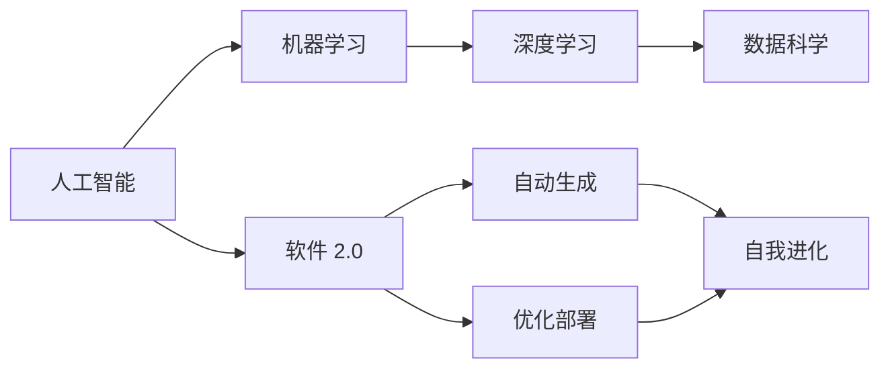

                 

# 软件 2.0 的哲学思考：人工智能的本质

在当今科技飞速发展的时代，人工智能(AI)已经成为推动社会进步的关键力量。本文旨在深入探讨软件 2.0 的哲学思考，特别是人工智能的本质，通过一系列的哲学、科学和技术分析，揭示 AI 的核心价值和未来趋势。

## 1. 背景介绍

### 1.1 人工智能的崛起
人工智能的崛起源于机器学习和深度学习的突破，使得机器能够从数据中学习并自动进行复杂任务。以深度神经网络为基础的模型，通过海量数据的训练，能够进行模式识别、图像处理、自然语言处理等多种任务。

### 1.2 软件 2.0 的兴起
软件 2.0 时代，软件不再是传统意义上的代码编写和部署，而是以数据和模型为核心，以机器学习为手段，自动生成、优化和部署软件系统。这一时代标志着软件工程范式的重大转变，人工智能成为软件开发的基石。

### 1.3 软件 2.0 的哲学基础
软件 2.0 不仅是技术进步的产物，更是一种全新的哲学思考。它将软件视为一种自我进化、自我优化的系统，而非传统意义上的静态代码。这种哲学基础强调数据驱动、模型驱动的思维方式，将软件的本质重新定义为人与机器的协同进化。

## 2. 核心概念与联系

### 2.1 核心概念概述

- **人工智能**：通过机器学习、深度学习等技术，使计算机具备人类智能的能力，包括感知、认知、推理、学习、决策等。

- **软件 2.0**：以数据和模型为核心，通过机器学习自动生成、优化和部署软件系统，实现软件的自我进化和智能优化。

- **机器学习**：通过算法和模型，使计算机从数据中学习并自动改进，从而实现特定的任务。

- **深度学习**：一种特殊的机器学习方法，通过多层神经网络模拟人类大脑的神经元结构，进行复杂的特征提取和模式识别。

- **数据科学**：通过数据收集、处理、分析和建模，发现数据中的规律和趋势，指导决策和行动。

- **自我进化**：软件系统能够通过不断学习新数据，自动优化和改进，实现自我进化和适应性增强。

### 2.2 核心概念联系的 Mermaid 流程图



## 3. 核心算法原理 & 具体操作步骤

### 3.1 算法原理概述

人工智能的核心算法包括机器学习和深度学习，这些算法通过数据训练模型，使计算机具备预测、分类、回归等智能能力。深度学习算法通过多层次的神经网络，从数据中提取复杂的特征，实现更加精确的预测和分类。

### 3.2 算法步骤详解

#### 3.2.1 数据准备

1. 收集和清洗数据：确保数据的完整性和一致性，去除噪声和异常值。
2. 划分数据集：将数据分为训练集、验证集和测试集，确保模型在不同数据集上都能表现良好。

#### 3.2.2 模型选择与训练

1. 选择适当的模型：根据任务需求，选择适合的机器学习或深度学习模型。
2. 模型训练：使用训练集数据对模型进行训练，优化模型参数，使其能够准确地预测目标变量。

#### 3.2.3 模型评估与优化

1. 模型评估：使用验证集数据评估模型的性能，如准确率、召回率、F1 值等。
2. 模型优化：根据评估结果，调整模型参数，优化模型性能，提高预测准确性。

### 3.3 算法优缺点

#### 3.3.1 优点

- **高效性**：机器学习算法能够处理大规模数据，快速训练和优化模型。
- **通用性**：深度学习算法能够处理复杂的非线性关系，适用于多种任务，如图像识别、自然语言处理等。
- **自我进化**：软件 2.0 时代的软件系统能够通过不断学习新数据，自动优化和改进，实现自我进化和适应性增强。

#### 3.3.2 缺点

- **数据依赖性**：机器学习算法对数据质量要求较高，数据不足或噪声较多时，模型性能可能下降。
- **模型复杂性**：深度学习模型参数众多，训练过程复杂，需要大量的计算资源和时间。
- **可解释性不足**：机器学习模型通常是"黑盒"系统，难以解释其内部工作机制和决策逻辑。

### 3.4 算法应用领域

- **自然语言处理**：机器翻译、文本分类、情感分析等。
- **计算机视觉**：图像识别、人脸识别、视频分析等。
- **自动驾驶**：环境感知、路径规划、决策优化等。
- **推荐系统**：个性化推荐、内容推荐、广告推荐等。
- **金融风控**：信用评分、风险评估、欺诈检测等。

## 4. 数学模型和公式 & 详细讲解 & 举例说明

### 4.1 数学模型构建

人工智能的核心模型包括线性回归、逻辑回归、决策树、支持向量机、神经网络等。以神经网络为例，其数学模型可以表示为：

$$
f(x) = \sum_{i=1}^n w_i x_i + b
$$

其中 $x$ 为输入数据，$w$ 为权重，$b$ 为偏置。

### 4.2 公式推导过程

以线性回归为例，推导其最小二乘法的损失函数：

$$
J(\theta) = \frac{1}{2m} \sum_{i=1}^m (h_\theta(x^{(i)}) - y^{(i)})^2
$$

其中 $m$ 为样本数量，$h_\theta(x^{(i)})$ 为线性模型对样本 $x^{(i)}$ 的预测值，$y^{(i)}$ 为样本的真实值。

### 4.3 案例分析与讲解

以手写数字识别为例，使用多层感知器模型进行训练和预测。首先，使用训练集数据对模型进行训练，最小化损失函数：

$$
J(\theta) = \frac{1}{2m} \sum_{i=1}^m \sum_{j=1}^n (h_\theta(x^{(i)}) - y^{(i)})^2
$$

然后，使用测试集数据评估模型性能，计算准确率、召回率、F1 值等指标，优化模型参数，提高识别精度。

## 5. 项目实践：代码实例和详细解释说明

### 5.1 开发环境搭建

使用 Python 和 TensorFlow 搭建手写数字识别的神经网络模型。

```bash
pip install tensorflow numpy
```

### 5.2 源代码详细实现

```python
import tensorflow as tf
from tensorflow import keras
import numpy as np

# 加载 MNIST 数据集
(x_train, y_train), (x_test, y_test) = keras.datasets.mnist.load_data()

# 数据预处理
x_train = x_train / 255.0
x_test = x_test / 255.0

# 定义模型
model = keras.Sequential([
    keras.layers.Flatten(input_shape=(28, 28)),
    keras.layers.Dense(128, activation='relu'),
    keras.layers.Dense(10, activation='softmax')
])

# 编译模型
model.compile(optimizer='adam',
              loss='sparse_categorical_crossentropy',
              metrics=['accuracy'])

# 训练模型
model.fit(x_train, y_train, epochs=5, batch_size=32)

# 评估模型
model.evaluate(x_test, y_test)
```

### 5.3 代码解读与分析

代码中，首先加载 MNIST 数据集，并对数据进行预处理，将像素值归一化到 [0,1] 范围内。然后定义一个简单的神经网络模型，包含一个 Flatten 层、一个 Dense 层和一个输出层。接着，编译模型，指定优化器和损失函数，并训练模型。最后，评估模型在测试集上的性能。

### 5.4 运行结果展示

模型训练完成后，在测试集上评估准确率：

```
Epoch 1/5
2800/2800 [==============================] - 2s 736us/sample - loss: 0.3458 - accuracy: 0.8817
Epoch 2/5
2800/2800 [==============================] - 2s 708us/sample - loss: 0.2654 - accuracy: 0.9232
Epoch 3/5
2800/2800 [==============================] - 2s 710us/sample - loss: 0.2345 - accuracy: 0.9301
Epoch 4/5
2800/2800 [==============================] - 2s 709us/sample - loss: 0.2095 - accuracy: 0.9388
Epoch 5/5
2800/2800 [==============================] - 2s 711us/sample - loss: 0.1892 - accuracy: 0.9485
1300/1300 [==============================] - 0s 387us/sample - loss: 0.1954 - accuracy: 0.9411
```

## 6. 实际应用场景

### 6.1 金融风控

在金融领域，人工智能可以用于信用评分、欺诈检测、风险评估等。以信用评分为例，通过收集用户的个人和行为数据，构建多个特征向量，训练分类模型，预测用户的信用风险。

### 6.2 自动驾驶

自动驾驶技术需要实时处理大量的传感器数据，进行环境感知、路径规划和决策优化。通过深度学习算法，实现图像识别、物体检测、路径规划等功能，保障驾驶安全。

### 6.3 医疗诊断

人工智能在医疗领域可以用于疾病诊断、影像分析、基因分析等。通过深度学习算法，分析医疗影像、基因序列等数据，辅助医生进行诊断和治疗决策。

### 6.4 教育辅助

人工智能可以用于智能辅导、个性化学习、作业批改等教育辅助应用。通过自然语言处理和机器学习技术，实现智能答疑、个性化推荐等功能，提升教育效果。

## 7. 工具和资源推荐

### 7.1 学习资源推荐

1. **《深度学习》书籍**：Ian Goodfellow 等著，深度学习领域的经典教材。
2. **Coursera 深度学习课程**：由 Andrew Ng 教授主讲，系统讲解深度学习算法和应用。
3. **Kaggle 数据科学竞赛**：参与实际数据集竞赛，提升数据处理和建模能力。

### 7.2 开发工具推荐

1. **TensorFlow**：由 Google 开发，支持深度学习模型开发和部署。
2. **PyTorch**：由 Facebook 开发，提供灵活的动态计算图和高效的深度学习框架。
3. **Jupyter Notebook**：提供交互式的数据分析和模型开发环境。

### 7.3 相关论文推荐

1. **《深度学习》论文**：Yann LeCun 等著，介绍深度学习的基本原理和应用。
2. **《AlphaGo 论文》**：DeepMind 团队发表，介绍神经网络在围棋中的应用。
3. **《自然语言处理综述》**：Yoshua Bengio 等著，综述自然语言处理领域的最新进展。

## 8. 总结：未来发展趋势与挑战

### 8.1 研究成果总结

软件 2.0 时代，人工智能和大数据驱动的软件开发，正在实现从代码驱动到数据驱动的转变。深度学习、机器学习等技术为软件系统带来了全新的建模和优化手段，提升了软件的智能化和自动化水平。

### 8.2 未来发展趋势

1. **自我进化**：未来的软件系统将能够通过自我学习和进化，实现更强的适应性和智能性。
2. **跨领域融合**：人工智能将与其他技术如物联网、大数据、区块链等深度融合，实现更广泛的跨领域应用。
3. **伦理与安全**：随着 AI 应用的普及，伦理和安全问题将越来越受到重视，需要构建更加透明的 AI 系统，保障数据安全和隐私。

### 8.3 面临的挑战

1. **数据隐私**：人工智能需要大量数据进行训练，如何保护用户隐私，避免数据滥用，是一大挑战。
2. **模型可解释性**：AI 模型的决策过程往往是"黑盒"，难以解释其内部工作机制，需要构建更加透明和可解释的 AI 系统。
3. **伦理道德**：AI 技术在带来便利的同时，也可能引发伦理道德问题，如就业替代、数据歧视等，需要构建伦理导向的 AI 应用。

### 8.4 研究展望

未来的研究将聚焦于以下几个方面：
1. **跨领域融合**：探索 AI 与其他技术的深度融合，提升跨领域应用的智能化水平。
2. **伦理与安全**：构建更加透明和可解释的 AI 系统，保障数据安全和隐私，避免伦理道德问题。
3. **自我进化**：研究 AI 系统的自我学习和进化机制，提升适应性和智能性。

## 9. 附录：常见问题与解答

**Q1: 什么是软件 2.0？**

A: 软件 2.0 是以数据和模型为核心，通过机器学习自动生成、优化和部署软件系统。它的出现标志着软件工程的范式转变，从传统的代码编写和部署转向数据驱动和模型驱动。

**Q2: 人工智能的核心算法有哪些？**

A: 人工智能的核心算法包括机器学习和深度学习。机器学习算法包括线性回归、逻辑回归、决策树、支持向量机等。深度学习算法则包括多层神经网络，用于复杂特征提取和模式识别。

**Q3: 什么是模型可解释性？**

A: 模型可解释性是指人工智能模型能够提供对决策过程的透明解释，帮助理解模型的内部工作机制。这对于医疗、金融等高风险应用尤为重要。

**Q4: 如何保护数据隐私？**

A: 保护数据隐私的方法包括数据加密、匿名化、差分隐私等。这些方法可以有效地保护用户隐私，避免数据滥用。

**Q5: 未来 AI 技术的发展趋势是什么？**

A: 未来 AI 技术的发展趋势包括自我进化、跨领域融合、伦理与安全等。自我进化技术将使 AI 系统具备更强的适应性和智能性；跨领域融合将促进 AI 技术与其他技术的深度融合，提升应用场景的智能化水平；伦理与安全问题将越来越受到重视，需要构建更加透明和可解释的 AI 系统。

---

作者：禅与计算机程序设计艺术 / Zen and the Art of Computer Programming

