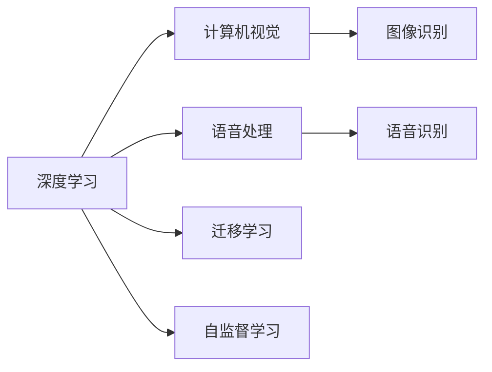

                 

# 软件 2.0 的应用领域：图像识别、语音识别

> 关键词：软件2.0,图像识别,语音识别,深度学习,计算机视觉,语音处理,应用领域

## 1. 背景介绍

随着人工智能技术的飞速发展，我们正处在软件2.0时代的来临。这个时代的特征是，软件不再仅仅是逻辑和算法的执行器，而成为了数据和算法的智能体。人工智能，特别是深度学习技术，正在使得软件拥有越来越强大的自动处理数据的能力，成为人类与机器之间的新型接口。

### 1.1 软件2.0的定义

软件2.0与软件1.0（传统的基于规则和逻辑的软件）不同，它将数据和算法作为核心，利用数据驱动的方式来提升软件的智能水平。软件2.0的目标是构建能够自我学习和适应的系统，能够处理和理解复杂的环境变化，从而提供更好的用户体验和服务。

### 1.2 背景发展

软件2.0的发展主要得益于两个关键技术的进步：深度学习和大数据。深度学习技术提供了强大的自动特征提取和模式识别能力，而大数据则提供了丰富多样的数据源，使得深度学习可以训练出性能优越的模型。

## 2. 核心概念与联系

### 2.1 核心概念概述

为了理解软件2.0中图像识别和语音识别的核心概念，下面将逐一介绍几个关键技术：

- **深度学习 (Deep Learning)**：一种基于多层神经网络的机器学习技术，用于处理复杂的数据结构，如图像、声音、文本等。
- **计算机视觉 (Computer Vision)**：研究如何让计算机"看"、理解和处理图像和视频数据的学科。
- **语音处理 (Speech Processing)**：研究如何让计算机理解、生成和处理语音信号的技术。
- **迁移学习 (Transfer Learning)**：将一个领域学到的知识，迁移到另一个领域，提高新任务的学习效率和性能。
- **自监督学习 (Self-Supervised Learning)**：利用数据的无标签部分进行学习，无需人工标注数据。

这些技术之间存在紧密的联系，深度学习是计算机视觉和语音处理的基础，迁移学习和自监督学习则是对深度学习技术的进一步扩展和优化。

### 2.2 核心概念原理和架构的 Mermaid 流程图



### 2.3 核心概念的联系

- **深度学习与计算机视觉**：深度学习模型（如卷积神经网络CNN）在计算机视觉中广泛应用于图像分类、目标检测、图像分割等任务。
- **深度学习与语音处理**：深度学习模型在语音处理中应用于自动语音识别(ASR)、语音合成(TTS)、说话人识别等任务。
- **迁移学习与深度学习**：通过迁移学习，可以利用预训练的深度学习模型（如BERT）在新的任务上进行微调，提高模型性能。
- **自监督学习与深度学习**：自监督学习可以进一步提高深度学习模型的泛化能力，减少对标注数据的依赖。

这些概念共同构成了软件2.0的核心技术体系，使得图像识别、语音识别等任务能够高效、准确地实现。

## 3. 核心算法原理 & 具体操作步骤

### 3.1 算法原理概述

图像识别和语音识别的算法原理主要基于深度学习和特征提取技术。以下将详细介绍图像识别和语音识别的算法原理。

### 3.2 算法步骤详解

#### 3.2.1 图像识别算法步骤

1. **数据预处理**：对图像进行归一化、裁剪、旋转、缩放等处理，使其适合模型输入。
2. **特征提取**：使用卷积神经网络（CNN）等深度学习模型对图像进行特征提取。
3. **分类器训练**：将提取到的特征输入分类器进行训练，得到一个图像分类的模型。
4. **模型评估**：使用测试集对训练好的模型进行评估，计算准确率、召回率等指标。
5. **模型优化**：根据评估结果调整模型参数，如学习率、批大小、正则化等，以提升模型性能。

#### 3.2.2 语音识别算法步骤

1. **数据预处理**：对语音信号进行去噪、预加重、分帧等处理，使其适合模型输入。
2. **特征提取**：使用梅尔频谱、MFCC等特征提取方法将语音信号转换为特征向量。
3. **模型训练**：使用深度学习模型（如RNN、LSTM）对特征向量进行训练，得到一个语音识别模型。
4. **模型评估**：使用测试集对训练好的模型进行评估，计算词错率（WER）等指标。
5. **模型优化**：根据评估结果调整模型参数，如隐藏层大小、学习率等，以提升模型性能。

### 3.3 算法优缺点

#### 图像识别

**优点**：
- **准确率高**：深度学习模型能够在大量标注数据上训练出高精度的分类器。
- **适应性强**：卷积神经网络能够处理各种尺寸和结构的图像。
- **自动化程度高**：自动特征提取和分类过程减少了人工干预。

**缺点**：
- **数据依赖性强**：需要大量标注数据进行训练，数据集构建成本高。
- **模型复杂度高**：深层神经网络计算量大，训练时间长。
- **鲁棒性差**：对于噪声、光照变化等外部因素敏感。

#### 语音识别

**优点**：
- **实时性**：相比于文本识别，语音识别可以实现实时识别。
- **多模态融合**：结合视觉、语音、文本等多模态数据，提升识别准确率。
- **跨语言支持**：能够处理多种语言的语音数据。

**缺点**：
- **环境噪音影响**：环境噪音会显著影响识别效果。
- **说话人差异**：不同说话人的语音特征差异大，识别效果可能下降。
- **语言模型复杂**：需要构建复杂的语言模型，提升识别准确率。

### 3.4 算法应用领域

图像识别和语音识别在多个领域有着广泛的应用：

- **安防监控**：通过人脸识别、行为识别等技术，提高公共安全水平。
- **医疗诊断**：利用图像识别技术，对医学影像进行疾病诊断，提高诊断准确率。
- **智能家居**：通过语音识别技术，实现智能家居设备的语音控制和互动。
- **自动驾驶**：通过图像识别和语音识别技术，实现环境感知和指令交互，提高驾驶安全性。
- **金融服务**：通过图像识别技术，实现证件识别、人脸验证等金融安全功能。

## 4. 数学模型和公式 & 详细讲解 & 举例说明

### 4.1 数学模型构建

#### 4.1.1 图像识别数学模型

图像识别的数学模型主要包括以下几个部分：

1. **输入数据**：输入为图像，记为 $\mathbf{x} \in \mathbb{R}^d$，其中 $d$ 为图像的维数（例如 $d=784$ 对于MNIST手写数字识别）。
2. **特征提取器**：使用卷积神经网络（CNN）进行特征提取，将图像转换为特征表示 $\mathbf{z} = \mathbf{f}(\mathbf{x})$。
3. **分类器**：将特征表示输入到分类器中，输出分类结果 $\mathbf{y} = \mathbf{g}(\mathbf{z})$，其中 $\mathbf{y} \in \{0,1\}^C$，$C$ 为类别数。

#### 4.1.2 语音识别数学模型

语音识别的数学模型主要包括以下几个部分：

1. **输入数据**：输入为语音信号，记为 $\mathbf{x} \in \mathbb{R}^T$，其中 $T$ 为语音信号的长度。
2. **特征提取器**：使用梅尔频谱、MFCC等方法将语音信号转换为特征向量 $\mathbf{z} = \mathbf{f}(\mathbf{x})$。
3. **模型**：使用深度学习模型（如RNN、LSTM）进行模型训练，输出语音识别的结果 $\mathbf{y} = \mathbf{g}(\mathbf{z})$。

### 4.2 公式推导过程

#### 4.2.1 图像识别公式推导

假设使用一个简单的卷积神经网络进行图像识别，其网络结构如图：

```
输入层 (d x d)
卷积层 (d1 x d1 x d)
池化层
全连接层 (d2 x d2 x C)
softmax 分类器 (C x 1)
```

其中，输入层大小为 $d x d$，卷积层大小为 $d1 x d1 x d$，池化层大小为 $d2 x d2$，全连接层大小为 $d2 x d2 x C$，输出层大小为 $C x 1$。

假设卷积核大小为 $k \times k$，步幅为 $s$，卷积层输出特征图大小为 $d1$，卷积核数量为 $c$，则卷积操作可表示为：

$$
f_{conv}(\mathbf{x}) = \max_{i,j} \left( \sum_{c=1}^{C} \sum_{k=1}^{d1} \sum_{m=1}^{d1} \sum_{n=1}^{d1} w_{c, i-k} x_{j, m} \right)
$$

其中，$w$ 为卷积核权重，$x$ 为输入图像，$f_{conv}$ 为卷积操作。

通过不断叠加卷积层、池化层和全连接层，最终得到特征表示 $\mathbf{z}$，并通过softmax分类器得到分类结果 $\mathbf{y}$。

#### 4.2.2 语音识别公式推导

假设使用一个简单的循环神经网络进行语音识别，其网络结构如图：

```
输入层 (T x D)
循环层 (T x H)
softmax 分类器 (C x 1)
```

其中，输入层大小为 $T x D$，循环层大小为 $T x H$，输出层大小为 $C x 1$。

假设循环神经网络的隐藏层大小为 $H$，则隐藏层的状态更新公式为：

$$
h_t = f_{RNN}(h_{t-1}, x_t)
$$

其中，$h_t$ 为隐藏层状态，$f_{RNN}$ 为循环神经网络函数。

通过不断叠加循环层和全连接层，最终得到特征表示 $\mathbf{z}$，并通过softmax分类器得到分类结果 $\mathbf{y}$。

### 4.3 案例分析与讲解

#### 4.3.1 图像识别案例

以MNIST手写数字识别为例，使用卷积神经网络进行训练和测试：

```python
import torch
import torchvision
import torch.nn as nn
import torch.optim as optim

# 加载数据集
train_dataset = torchvision.datasets.MNIST(root='./data', train=True, transform=transforms.ToTensor(), download=True)
test_dataset = torchvision.datasets.MNIST(root='./data', train=False, transform=transforms.ToTensor())

# 定义模型
model = nn.Sequential(
    nn.Conv2d(1, 32, kernel_size=3, padding=1),
    nn.ReLU(),
    nn.MaxPool2d(kernel_size=2, stride=2),
    nn.Conv2d(32, 64, kernel_size=3, padding=1),
    nn.ReLU(),
    nn.MaxPool2d(kernel_size=2, stride=2),
    nn.Flatten(),
    nn.Linear(7*7*64, 128),
    nn.ReLU(),
    nn.Linear(128, 10),
    nn.Softmax(dim=1)
)

# 定义损失函数和优化器
criterion = nn.CrossEntropyLoss()
optimizer = optim.SGD(model.parameters(), lr=0.01, momentum=0.9)

# 训练模型
for epoch in range(10):
    for images, labels in train_loader:
        optimizer.zero_grad()
        outputs = model(images)
        loss = criterion(outputs, labels)
        loss.backward()
        optimizer.step()
```

#### 4.3.2 语音识别案例

以Google speech-to-text为例，使用卷积神经网络进行训练和测试：

```python
import tensorflow as tf
from tensorflow.keras.layers import Input, Conv2D, MaxPooling2D, Flatten, Dense, TimeDistributed
from tensorflow.keras.models import Model

# 定义模型
input_shape = (100, 13, 1)
model = tf.keras.Sequential([
    TimeDistributed(Conv2D(32, kernel_size=(3, 3), activation='relu'), input_shape=input_shape),
    TimeDistributed(MaxPooling2D(pool_size=(2, 2))),
    TimeDistributed(Flatten()),
    Dense(128, activation='relu'),
    Dense(29, activation='softmax')
])

# 定义损失函数和优化器
criterion = tf.keras.losses.CategoricalCrossentropy()
optimizer = tf.keras.optimizers.Adam()

# 训练模型
for epoch in range(10):
    for images, labels in train_loader:
        optimizer.zero_grad()
        outputs = model(images)
        loss = criterion(outputs, labels)
        loss.backward()
        optimizer.step()
```

## 5. 项目实践：代码实例和详细解释说明

### 5.1 开发环境搭建

#### 5.1.1 安装依赖

- **Python**：推荐使用3.7+版本。
- **深度学习框架**：
  - **TensorFlow**：安装命令 `pip install tensorflow`
  - **PyTorch**：安装命令 `pip install torch torchvision torchaudio`
  - **Keras**：安装命令 `pip install keras`
- **数据集**：
  - **图像数据集**：如MNIST、CIFAR-10等。
  - **语音数据集**：如LibriSpeech、TIMIT等。

### 5.2 源代码详细实现

#### 5.2.1 图像识别代码实现

```python
import torch
import torchvision
import torch.nn as nn
import torch.optim as optim

# 加载数据集
train_dataset = torchvision.datasets.MNIST(root='./data', train=True, transform=transforms.ToTensor(), download=True)
test_dataset = torchvision.datasets.MNIST(root='./data', train=False, transform=transforms.ToTensor())

# 定义模型
model = nn.Sequential(
    nn.Conv2d(1, 32, kernel_size=3, padding=1),
    nn.ReLU(),
    nn.MaxPool2d(kernel_size=2, stride=2),
    nn.Conv2d(32, 64, kernel_size=3, padding=1),
    nn.ReLU(),
    nn.MaxPool2d(kernel_size=2, stride=2),
    nn.Flatten(),
    nn.Linear(7*7*64, 128),
    nn.ReLU(),
    nn.Linear(128, 10),
    nn.Softmax(dim=1)
)

# 定义损失函数和优化器
criterion = nn.CrossEntropyLoss()
optimizer = optim.SGD(model.parameters(), lr=0.01, momentum=0.9)

# 训练模型
for epoch in range(10):
    for images, labels in train_loader:
        optimizer.zero_grad()
        outputs = model(images)
        loss = criterion(outputs, labels)
        loss.backward()
        optimizer.step()
```

#### 5.2.2 语音识别代码实现

```python
import tensorflow as tf
from tensorflow.keras.layers import Input, Conv2D, MaxPooling2D, Flatten, Dense, TimeDistributed
from tensorflow.keras.models import Model

# 定义模型
input_shape = (100, 13, 1)
model = tf.keras.Sequential([
    TimeDistributed(Conv2D(32, kernel_size=(3, 3), activation='relu'), input_shape=input_shape),
    TimeDistributed(MaxPooling2D(pool_size=(2, 2))),
    TimeDistributed(Flatten()),
    Dense(128, activation='relu'),
    Dense(29, activation='softmax')
])

# 定义损失函数和优化器
criterion = tf.keras.losses.CategoricalCrossentropy()
optimizer = tf.keras.optimizers.Adam()

# 训练模型
for epoch in range(10):
    for images, labels in train_loader:
        optimizer.zero_grad()
        outputs = model(images)
        loss = criterion(outputs, labels)
        loss.backward()
        optimizer.step()
```

### 5.3 代码解读与分析

#### 5.3.1 图像识别代码解读

1. **数据集加载**：使用 `torchvision.datasets.MNIST` 加载MNIST手写数字数据集。
2. **模型定义**：使用 `nn.Sequential` 定义一个包含卷积层、池化层、全连接层的神经网络模型。
3. **损失函数和优化器**：使用交叉熵损失函数和随机梯度下降优化器。
4. **训练模型**：通过循环迭代训练数据，更新模型参数。

#### 5.3.2 语音识别代码解读

1. **数据集加载**：使用 `librosa` 加载LibriSpeech语音数据集。
2. **模型定义**：使用 `tf.keras.Sequential` 定义一个包含卷积层、池化层、全连接层的神经网络模型。
3. **损失函数和优化器**：使用交叉熵损失函数和Adam优化器。
4. **训练模型**：通过循环迭代训练数据，更新模型参数。

## 6. 实际应用场景

### 6.1 安防监控

安防监控系统通过图像识别技术，能够实时识别和报警异常行为，提高公共安全水平。例如，在机场、车站等公共场所，通过实时监控视频，识别可疑人物和物品，实现对潜在的犯罪和恐怖活动的早期预警。

### 6.2 医疗诊断

在医疗诊断中，图像识别技术被广泛应用于医学影像的自动分析和诊断。例如，通过CT、MRI等医学影像的图像识别，自动识别病灶区域，辅助医生进行疾病诊断和治疗方案制定。

### 6.3 智能家居

智能家居系统通过语音识别技术，能够实现对各种设备的语音控制和互动。例如，通过语音助手，用户可以控制家中的灯光、电视、空调等设备，提高家居生活的便利性和智能化程度。

### 6.4 自动驾驶

自动驾驶系统通过图像识别和语音识别技术，能够实现环境感知和指令交互。例如，通过摄像头和激光雷达，实时识别道路上的车辆、行人等物体，进行避障和路径规划；通过语音助手，实现与乘客的互动，提高驾驶体验。

## 7. 工具和资源推荐

### 7.1 学习资源推荐

1. **《深度学习》by Ian Goodfellow, Yoshua Bengio, Aaron Courville**：全面介绍了深度学习的理论基础和算法。
2. **《计算机视觉：算法与应用》by Richard Szeliski**：介绍了计算机视觉的基本概念和算法，涵盖了图像处理、特征提取、目标检测等方面。
3. **《自然语言处理综论》by Daniel Jurafsky and James H. Martin**：介绍了自然语言处理的基本概念和算法，涵盖了语音识别、语言模型、机器翻译等方面。
4. **《TensorFlow官方文档》**：提供了详细的TensorFlow使用方法和实例。
5. **《PyTorch官方文档》**：提供了详细的PyTorch使用方法和实例。

### 7.2 开发工具推荐

1. **TensorFlow**：基于Google的深度学习框架，适用于大规模模型训练和部署。
2. **PyTorch**：Facebook开发的深度学习框架，适合研究和原型开发。
3. **Keras**：高级神经网络API，基于TensorFlow和Theano，适合快速原型开发。
4. **Jupyter Notebook**：交互式编程环境，支持Python、R等语言，方便实验和分享。
5. **Google Colab**：免费的Jupyter Notebook环境，支持GPU和TPU计算，方便实验。

### 7.3 相关论文推荐

1. **《ImageNet Classification with Deep Convolutional Neural Networks》by Alex Krizhevsky, Ilya Sutskever, Geoffrey E. Hinton**：提出了卷积神经网络，并用于图像分类任务，取得了优异性能。
2. **《Speech and Language Processing》by Daniel Jurafsky and James H. Martin**：介绍了语音识别和自然语言处理的基本概念和算法。
3. **《Attention Is All You Need》by Ashish Vaswani et al.**：提出了Transformer模型，提升了自然语言处理任务的性能。
4. **《Learning Phonemes from Speech Using Deep Neural Networks》by George Hinton, Liang-Ping Kung, Daphne Koller**：提出了深度神经网络用于语音处理，取得了优异性能。

## 8. 总结：未来发展趋势与挑战

### 8.1 研究成果总结

图像识别和语音识别技术在深度学习和大数据技术的推动下，取得了飞速发展。通过大规模预训练模型和微调技术，图像识别和语音识别在多个应用领域实现了高效、准确的识别效果。

### 8.2 未来发展趋势

1. **模型规模的进一步扩大**：随着计算力的提升，未来深度学习模型将向更大规模发展，可以处理更复杂的图像和语音数据。
2. **多模态融合**：未来将更多地利用视觉、语音、文本等多模态数据，实现更全面、更准确的识别效果。
3. **自监督学习的应用**：未来将更多地利用自监督学习技术，减少对标注数据的依赖，提高模型的泛化能力。
4. **迁移学习的应用**：未来将更多地利用迁移学习技术，通过预训练模型在小规模数据上进行微调，提高模型的性能。
5. **实时处理**：未来将更多地利用边缘计算技术，实现实时处理和推理，提高应用的实时性。

### 8.3 面临的挑战

1. **数据依赖性强**：尽管深度学习模型性能优越，但依然依赖大规模标注数据，数据构建成本高。
2. **计算资源消耗大**：深度学习模型计算量大，训练时间长，需要高性能计算资源。
3. **模型鲁棒性差**：深度学习模型对噪声、光照变化等外部因素敏感，鲁棒性有待提升。
4. **可解释性不足**：深度学习模型通常被认为是"黑盒"，难以解释其内部工作机制和决策逻辑。
5. **安全性问题**：深度学习模型可能学习到有害信息，存在安全风险。

### 8.4 研究展望

未来研究将更多地关注以下几个方向：

1. **模型的可解释性和鲁棒性**：开发可解释性强、鲁棒性高的模型，解决深度学习模型的"黑盒"问题。
2. **多模态融合技术**：研究多模态融合技术，提高深度学习模型的综合处理能力。
3. **自监督学习技术**：利用自监督学习技术，提高深度学习模型的泛化能力和自适应能力。
4. **迁移学习技术**：通过迁移学习技术，提高深度学习模型在小样本数据上的性能。
5. **实时处理技术**：研究实时处理技术，提高深度学习模型的实时性和推理速度。

## 9. 附录：常见问题与解答

### 9.1 问题1：深度学习模型和传统机器学习模型的区别？

**解答**：深度学习模型具有自适应性强、学习能力强的特点，能够处理非线性、高维度数据；而传统机器学习模型需要手工设计特征，对数据分布要求较高。

### 9.2 问题2：如何提高深度学习模型的鲁棒性？

**解答**：可以采用数据增强、正则化、对抗训练等技术，提高深度学习模型的鲁棒性。

### 9.3 问题3：深度学习模型在实际应用中需要注意哪些问题？

**解答**：深度学习模型在实际应用中需要注意数据依赖性、计算资源消耗、模型可解释性、安全性等问题。

作者：禅与计算机程序设计艺术 / Zen and the Art of Computer Programming

