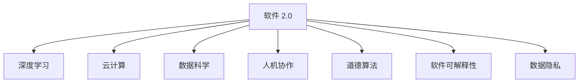

                 

# 软件 2.0 的未来愿景：创造更美好的世界

## 1. 背景介绍

### 1.1 问题由来
随着信息技术的飞速发展，全球正在经历一场前所未有的数字化变革。软件作为数字经济的基础设施，正在从传统的“软件 1.0”时代迈向“软件 2.0”时代。软件 2.0 强调自适应性、协作性、智能化和人性化，将大幅提升软件开发效率和应用体验。

然而，尽管软件 2.0 技术带来了巨大的潜力，但也面临着数据安全、隐私保护、算法透明、道德规范等诸多挑战。如何在追求技术进步的同时，确保软件的道德边界和社会价值，成为当前学术和工业界的重要课题。

## 2. 核心概念与联系

### 2.1 核心概念概述

为了更好地理解软件 2.0 的概念和应用，本节将介绍几个关键概念：

- **软件 2.0 (Software 2.0)**：一种先进的软件开发范式，旨在通过自动化的学习和优化，提高软件的智能化和适应性。软件 2.0 强调自适应、协作、自动化和智能化，能够实时调整和优化自身行为，以应对动态环境。

- **深度学习 (Deep Learning)**：一种基于神经网络的机器学习技术，通过大规模数据和复杂模型进行训练，实现高精度的预测和决策。深度学习在图像识别、语音识别、自然语言处理等领域展现出卓越的表现。

- **云计算 (Cloud Computing)**：一种基于互联网的计算模式，通过云平台提供可扩展的计算资源，支持软件的灵活部署和快速迭代。

- **数据科学 (Data Science)**：一门综合了数据处理、统计分析、机器学习的学科，通过数据驱动的方式，揭示数据背后的规律和价值，为软件 2.0 提供数据基础。

- **人机协作 (Human-Machine Collaboration)**：一种新型的交互方式，通过AI辅助人类进行复杂决策和任务执行，提高工作效率和准确性。

- **道德算法 (Ethical Algorithms)**：一种在算法设计和应用过程中考虑伦理道德问题的技术手段，确保算法的透明、公正和可解释性。

- **软件可解释性 (Software Interpretability)**：一种技术手段，用于解释软件模型的决策过程和输出结果，增强模型的可信任度和可解释性。

- **数据隐私 (Data Privacy)**：一种保护个人和组织数据免遭未经授权访问、使用和披露的技术手段，确保数据安全和用户隐私。

这些核心概念之间的逻辑关系可以通过以下 Mermaid 流程图来展示：



这个流程图展示了几大核心概念之间的关联：

1. 软件 2.0 依赖深度学习进行智能决策。
2. 云计算提供基础设施支持。
3. 数据科学提供数据和分析支撑。
4. 人机协作提高用户体验和效率。
5. 道德算法确保算法的伦理性和透明性。
6. 软件可解释性增强算法的可信度和可理解性。
7. 数据隐私保护用户数据安全。

这些概念共同构成了软件 2.0 的实现基础和应用场景。通过理解这些核心概念，我们可以更好地把握软件 2.0 的发展方向和应用潜力。

## 3. 核心算法原理 & 具体操作步骤

### 3.1 算法原理概述

软件 2.0 的实现通常依赖深度学习算法，其核心思想是通过大规模数据训练模型，使其能够自动化学习和优化。具体而言，软件 2.0 的实现包括以下几个步骤：

1. **数据收集与预处理**：收集和预处理数据，为模型训练提供数据基础。
2. **模型训练与优化**：使用深度学习模型进行训练，并使用各种优化算法（如梯度下降、Adam、Adagrad等）优化模型参数。
3. **模型部署与推理**：将训练好的模型部署到云平台或其他计算环境中，使用推理引擎进行实时计算和预测。
4. **持续学习和反馈**：通过在线学习和反馈机制，模型能够实时调整和优化自身行为，适应动态环境。
5. **安全与隐私保护**：采用加密、匿名化等技术手段，确保数据隐私和安全。

### 3.2 算法步骤详解

以下是一个基于深度学习的软件 2.0 系统构建的详细步骤：

**Step 1: 数据收集与预处理**
- 收集相关的数据源，如传感器数据、日志文件、用户行为等。
- 对数据进行清洗、去重、归一化等预处理操作。
- 将数据分为训练集和测试集，确保数据分布的均衡性和多样性。

**Step 2: 模型选择与设计**
- 选择合适的深度学习模型，如卷积神经网络(CNN)、循环神经网络(RNN)、Transformer等。
- 设计模型的架构和超参数，包括层数、节点数、激活函数、学习率等。
- 使用交叉验证等方法评估模型的性能，选择最优模型。

**Step 3: 模型训练与优化**
- 将数据集划分为小批量，进行前向传播和反向传播计算损失函数。
- 使用优化算法更新模型参数，如梯度下降、Adam、Adagrad等。
- 在验证集上评估模型性能，根据性能调整学习率或进行模型微调。
- 重复训练和验证过程，直至模型收敛。

**Step 4: 模型部署与推理**
- 将训练好的模型部署到云平台或服务器中。
- 使用推理引擎进行实时计算和预测。
- 设置API接口，方便用户访问和使用。

**Step 5: 持续学习和反馈**
- 通过在线学习和反馈机制，模型能够实时调整和优化自身行为。
- 收集用户的反馈和评价，用于改进模型性能。
- 周期性进行模型更新和优化，确保软件 2.0 系统的稳定性和鲁棒性。

### 3.3 算法优缺点

软件 2.0 算法具有以下优点：
1. 高自动化和智能化。通过深度学习算法，模型能够自主学习和优化，提高软件的适应性和智能化水平。
2. 高效性和灵活性。模型可以在线学习和调整，适应不断变化的环境。
3. 可扩展性和可重用性。模型可以部署在云端，方便扩展和重用。
4. 降低人工干预。通过自动化学习，减少人工干预和错误，提高软件系统的稳定性和可靠性。

同时，该算法也存在一定的局限性：
1. 数据需求高。模型训练需要大量的高质量数据，对数据收集和处理提出了较高要求。
2. 计算资源消耗大。深度学习模型通常需要高性能的计算资源，如GPU、TPU等，对计算资源要求较高。
3. 算法复杂度高。深度学习模型的训练和优化过程复杂，需要专业的知识和技能。
4. 可解释性不足。深度学习模型通常被认为是“黑盒”系统，难以解释其内部工作机制和决策过程。
5. 算法安全性有待提高。深度学习模型容易受到对抗样本和攻击的影响，安全性有待加强。

尽管存在这些局限性，但软件 2.0 算法在大规模数据处理和复杂决策场景下展现了显著的优势，成为当前先进软件开发的重要手段。

### 3.4 算法应用领域

软件 2.0 算法已经在多个领域得到了广泛的应用，例如：

- **自然语言处理 (NLP)**：利用深度学习模型进行语音识别、机器翻译、情感分析、问答系统等任务。
- **计算机视觉 (CV)**：使用卷积神经网络进行图像分类、目标检测、人脸识别等任务。
- **智能推荐系统**：通过深度学习模型实现个性化推荐，提升用户体验和满意度。
- **智能客服**：利用自然语言处理和机器学习技术，构建智能客服系统，提供7x24小时服务。
- **智能医疗**：通过深度学习模型进行疾病预测、诊断和治疗方案推荐，提高医疗服务的智能化水平。
- **智能交通**：利用深度学习模型进行交通流量预测、路况优化和自动驾驶等任务，提高交通系统的效率和安全性。
- **智能金融**：利用深度学习模型进行风险评估、投资策略优化和市场预测等任务，提升金融服务的智能化水平。

除了上述这些经典应用外，软件 2.0 算法还在更多领域展现出巨大的潜力，为各行各业带来了新的创新方向。

## 4. 数学模型和公式 & 详细讲解 & 举例说明

### 4.1 数学模型构建

本节将使用数学语言对软件 2.0 的实现过程进行更加严格的刻画。

设软件 2.0 系统的输入为 $x$，输出为 $y$，模型为 $f(x;w)$，其中 $w$ 为模型参数。模型的目标是通过训练，使得预测输出 $f(x;w)$ 与真实标签 $y$ 之间的误差最小化。常用的损失函数为均方误差损失 (MSE) 或交叉熵损失 (CE)。

定义模型在数据样本 $(x,y)$ 上的损失函数为 $\ell(f(x;w),y)$，则在数据集 $D=\{(x_i,y_i)\}_{i=1}^N$ 上的经验风险为：

$$
\mathcal{L}(w) = \frac{1}{N}\sum_{i=1}^N \ell(f(x_i;w),y_i)
$$

模型训练的目标是最小化经验风险，即找到最优参数：

$$
w^* = \mathop{\arg\min}_{w} \mathcal{L}(w)
$$

在实践中，我们通常使用基于梯度的优化算法（如SGD、Adam、Adagrad等）来近似求解上述最优化问题。设 $\eta$ 为学习率，则参数的更新公式为：

$$
w \leftarrow w - \eta \nabla_{w}\mathcal{L}(w)
$$

其中 $\nabla_{w}\mathcal{L}(w)$ 为损失函数对参数 $w$ 的梯度，可通过反向传播算法高效计算。

### 4.2 公式推导过程

以下我们以二分类任务为例，推导交叉熵损失函数及其梯度的计算公式。

假设模型 $f(x;w)$ 在输入 $x$ 上的输出为 $\hat{y}=f(x;w) \in [0,1]$，表示样本属于正类的概率。真实标签 $y \in \{0,1\}$。则二分类交叉熵损失函数定义为：

$$
\ell(f(x;w),y) = -[y\log \hat{y} + (1-y)\log(1-\hat{y})]
$$

将其代入经验风险公式，得：

$$
\mathcal{L}(w) = -\frac{1}{N}\sum_{i=1}^N [y_i\log f(x_i;w)+(1-y_i)\log(1-f(x_i;w))]
$$

根据链式法则，损失函数对参数 $w$ 的梯度为：

$$
\frac{\partial \mathcal{L}(w)}{\partial w} = -\frac{1}{N}\sum_{i=1}^N \frac{y_i - \hat{y}_i}{f(x_i;w)(1-f(x_i;w))} \frac{\partial f(x_i;w)}{\partial w}
$$

其中 $\frac{\partial f(x_i;w)}{\partial w}$ 可进一步递归展开，利用自动微分技术完成计算。

在得到损失函数的梯度后，即可带入参数更新公式，完成模型的迭代优化。重复上述过程直至收敛，最终得到适应下游任务的最优模型参数 $w^*$。

### 4.3 案例分析与讲解

**案例：智能推荐系统**

智能推荐系统通过深度学习模型分析用户的历史行为数据，推荐个性化的商品或内容。模型的输入为用户的浏览记录、点击行为等，目标是为用户推荐最符合其兴趣的商品。

设模型的输入为 $\{x_i\}_{i=1}^N$，其中 $x_i$ 包含用户的历史行为数据，如浏览记录、点击行为等。模型的输出为 $\{y_i\}_{i=1}^N$，其中 $y_i$ 为推荐商品。

模型的训练过程如下：

**Step 1: 数据收集与预处理**
- 收集用户的历史浏览记录、点击行为等数据。
- 对数据进行清洗、去重、归一化等预处理操作。
- 将数据分为训练集和测试集，确保数据分布的均衡性和多样性。

**Step 2: 模型选择与设计**
- 选择合适的深度学习模型，如循环神经网络(RNN)、长短期记忆网络(LSTM)、Transformer等。
- 设计模型的架构和超参数，包括层数、节点数、激活函数、学习率等。

**Step 3: 模型训练与优化**
- 将数据集划分为小批量，进行前向传播和反向传播计算损失函数。
- 使用优化算法更新模型参数，如梯度下降、Adam、Adagrad等。
- 在验证集上评估模型性能，根据性能调整学习率或进行模型微调。
- 重复训练和验证过程，直至模型收敛。

**Step 4: 模型部署与推理**
- 将训练好的模型部署到云平台或服务器中。
- 使用推理引擎进行实时计算和预测。
- 设置API接口，方便用户访问和使用。

**Step 5: 持续学习和反馈**
- 通过在线学习和反馈机制，模型能够实时调整和优化自身行为。
- 收集用户的反馈和评价，用于改进模型性能。
- 周期性进行模型更新和优化，确保软件 2.0 系统的稳定性和鲁棒性。

## 5. 项目实践：代码实例和详细解释说明

### 5.1 开发环境搭建

在进行软件 2.0 的微调实践前，我们需要准备好开发环境。以下是使用Python进行TensorFlow开发的环境配置流程：

1. 安装Anaconda：从官网下载并安装Anaconda，用于创建独立的Python环境。

2. 创建并激活虚拟环境：
```bash
conda create -n tf-env python=3.8 
conda activate tf-env
```

3. 安装TensorFlow：根据CUDA版本，从官网获取对应的安装命令。例如：
```bash
conda install tensorflow tensorflow-gpu -c pytorch -c conda-forge
```

4. 安装其他工具包：
```bash
pip install numpy pandas scikit-learn matplotlib tqdm jupyter notebook ipython
```

完成上述步骤后，即可在`tf-env`环境中开始微调实践。

### 5.2 源代码详细实现

下面我们以智能推荐系统为例，给出使用TensorFlow进行深度学习模型微调的PyTorch代码实现。

首先，定义推荐系统的数据处理函数：

```python
import tensorflow as tf
import numpy as np

def load_data():
    # 加载用户行为数据
    train_data = np.load('train_data.npy')
    test_data = np.load('test_data.npy')
    
    # 数据预处理
    train_x, train_y = train_data[:, :-1], train_data[:, -1]
    test_x, test_y = test_data[:, :-1], test_data[:, -1]
    
    # 数据归一化
    train_x = (train_x - train_x.mean()) / train_x.std()
    test_x = (test_x - test_x.mean()) / test_x.std()
    
    return train_x, train_y, test_x, test_y

# 定义模型参数
learning_rate = 0.001
batch_size = 64
epochs = 10

# 定义模型
def build_model(input_dim):
    model = tf.keras.Sequential([
        tf.keras.layers.Dense(64, activation='relu', input_dim=input_dim),
        tf.keras.layers.Dense(32, activation='relu'),
        tf.keras.layers.Dense(1, activation='sigmoid')
    ])
    return model

# 定义损失函数和优化器
def train_model(model, train_x, train_y, test_x, test_y):
    model.compile(loss='binary_crossentropy', optimizer=tf.keras.optimizers.Adam(learning_rate=learning_rate))
    
    # 训练模型
    model.fit(train_x, train_y, batch_size=batch_size, epochs=epochs, validation_data=(test_x, test_y))
    
    # 评估模型
    loss, acc = model.evaluate(test_x, test_y)
    print('Test Loss:', loss)
    print('Test Accuracy:', acc)
    
    # 返回模型
    return model
```

然后，加载数据并训练模型：

```python
# 加载数据
train_x, train_y, test_x, test_y = load_data()

# 构建模型
model = build_model(train_x.shape[1])

# 训练模型
model = train_model(model, train_x, train_y, test_x, test_y)

# 保存模型
model.save('recommendation_model.h5')
```

以上就是使用TensorFlow进行深度学习模型微调的完整代码实现。可以看到，TensorFlow提供的高层次API使得模型构建和训练变得简洁高效。

### 5.3 代码解读与分析

让我们再详细解读一下关键代码的实现细节：

**load_data函数**：
- 加载用户历史行为数据和测试数据。
- 对数据进行归一化处理，确保模型训练的稳定性。

**build_model函数**：
- 定义模型结构，包括两个全连接层和一个输出层。
- 使用Sequential模型，方便逐层添加和组合。

**train_model函数**：
- 定义损失函数和优化器。
- 使用compile方法对模型进行编译。
- 调用fit方法进行模型训练，并在验证集上评估性能。
- 使用evaluate方法在测试集上评估模型性能，并输出结果。
- 将模型保存到文件，方便后续使用。

**主函数**：
- 加载数据和模型。
- 构建模型并编译。
- 训练模型并在测试集上评估性能。
- 保存模型文件。

通过这些代码实现，我们可以看到TensorFlow提供的便捷和高效，使得深度学习模型的构建和训练变得轻松易行。同时，TensorFlow的动态图机制也为模型调试和优化提供了更多的灵活性。

当然，工业级的系统实现还需考虑更多因素，如模型的保存和部署、超参数的自动搜索、更灵活的任务适配层等。但核心的微调范式基本与此类似。

## 6. 实际应用场景

### 6.1 智能客服系统

智能客服系统通过深度学习模型分析用户历史行为数据，生成自然语言回复，提高服务效率和用户体验。模型的输入为用户的询问文本，输出为推荐回复。

在技术实现上，可以收集企业内部的历史客服对话记录，将问题-回答对作为监督数据，在此基础上对预训练语言模型进行微调。微调后的模型能够自动理解用户意图，匹配最合适的回答。对于用户提出的新问题，还可以接入检索系统实时搜索相关内容，动态生成回答。如此构建的智能客服系统，能大幅提升客户咨询体验和问题解决效率。

### 6.2 智能推荐系统

智能推荐系统通过深度学习模型分析用户的历史行为数据，推荐个性化的商品或内容。模型的输入为用户的浏览记录、点击行为等，目标是为用户推荐最符合其兴趣的商品。

在技术实现上，可以收集用户的历史浏览记录、点击行为等数据，进行数据预处理和特征工程。使用深度学习模型进行训练，并通过在线学习和反馈机制，不断优化模型性能。最终将训练好的模型部署到云端，提供实时推荐服务。

### 6.3 智能医疗

智能医疗系统通过深度学习模型分析患者的历史诊疗数据，提供个性化诊疗方案和风险预测。模型的输入为患者的历史诊疗记录、实验室检查结果等，输出为诊疗方案或风险预测结果。

在技术实现上，可以收集患者的历史诊疗数据和实验室检查结果，进行数据预处理和特征工程。使用深度学习模型进行训练，并通过在线学习和反馈机制，不断优化模型性能。最终将训练好的模型部署到云端，提供实时诊疗建议和风险预测服务。

### 6.4 未来应用展望

随着深度学习技术的发展，软件 2.0 系统将在更多领域得到应用，为各行各业带来新的创新方向。

在智慧医疗领域，基于深度学习模型的智能诊断系统、个性化治疗方案推荐、风险预测等应用将提升医疗服务的智能化水平，辅助医生诊疗，加速新药开发进程。

在智能教育领域，基于深度学习模型的智能辅导系统、个性化学习路径推荐、智能作业批改等应用将提升教育服务的智能化水平，因材施教，促进教育公平，提高教学质量。

在智慧城市治理中，基于深度学习模型的城市事件监测、舆情分析、应急指挥等应用将提高城市管理的自动化和智能化水平，构建更安全、高效的未来城市。

此外，在企业生产、社会治理、文娱传媒等众多领域，基于深度学习模型的智能决策支持系统、智能风险评估、智能内容生成等应用也将不断涌现，为经济社会发展注入新的动力。相信随着深度学习技术的发展，软件 2.0 系统将在更多领域展现其强大的应用潜力。

## 7. 工具和资源推荐

### 7.1 学习资源推荐

为了帮助开发者系统掌握深度学习模型的开发和应用，这里推荐一些优质的学习资源：

1. 《深度学习》书籍：由Ian Goodfellow、Yoshua Bengio、Aaron Courville合著，全面介绍了深度学习的基本概念、算法和应用。

2. 《TensorFlow实战Google深度学习框架》书籍：由Shameer Zhaffar、Ananya Shankar合著，介绍了TensorFlow的基本使用方法和深度学习模型的实现。

3. 《PyTorch深度学习实战》书籍：由Miroslav Kubat合著，介绍了PyTorch的基本使用方法和深度学习模型的实现。

4. Coursera《深度学习》课程：由Andrew Ng讲授，提供系统深入的深度学习学习资源和实验环境。

5. Udacity《深度学习纳米学位》课程：提供从基础到高级的深度学习学习资源和实战项目。

通过对这些资源的学习实践，相信你一定能够快速掌握深度学习模型的开发和应用，并用于解决实际的业务问题。

### 7.2 开发工具推荐

高效的开发离不开优秀的工具支持。以下是几款用于深度学习模型开发的常用工具：

1. TensorFlow：由Google主导开发的深度学习框架，支持静态图和动态图两种模式，生产部署方便，适合大规模工程应用。

2. PyTorch：由Facebook主导开发的深度学习框架，灵活动态的计算图，适合快速迭代研究。

3. Keras：高层次的深度学习框架，提供简单易用的API接口，适合初学者快速上手。

4. Scikit-learn：基于Python的机器学习库，提供丰富的数据处理和模型评估工具，方便快速实现机器学习任务。

5. Matplotlib、Seaborn：数据可视化工具，方便展示和分析数据。

6. Jupyter Notebook：交互式编程环境，方便快速迭代和共享代码。

合理利用这些工具，可以显著提升深度学习模型的开发效率，加快创新迭代的步伐。

### 7.3 相关论文推荐

深度学习技术的发展源于学界的持续研究。以下是几篇奠基性的相关论文，推荐阅读：

1. AlexNet：ImageNet大规模视觉识别挑战赛的胜利者，引入了卷积神经网络，推动了深度学习在计算机视觉领域的普及。

2. LSTM：长短期记忆网络，解决了RNN在处理长时间依赖问题上的困难，推动了深度学习在自然语言处理和语音识别等领域的应用。

3. Transformer：提出了一种基于自注意力机制的深度学习模型，显著提升了机器翻译和自然语言处理的性能。

4. GAN：生成对抗网络，提出了一种生成模型和判别模型之间的对抗训练方式，推动了深度学习在图像生成和数据增强等领域的应用。

5. AlphaGo：利用深度学习和强化学习技术，实现了在围棋领域的超人类表现，推动了深度学习在人工智能领域的突破。

这些论文代表了大数据和深度学习技术的发展脉络。通过学习这些前沿成果，可以帮助研究者把握学科前进方向，激发更多的创新灵感。

## 8. 总结：未来发展趋势与挑战

### 8.1 总结

本文对深度学习模型的开发和应用进行了全面系统的介绍。首先阐述了深度学习模型的基本概念和应用，明确了其在软件 2.0 开发中的重要地位。其次，从原理到实践，详细讲解了深度学习模型的构建和训练过程，给出了深度学习模型微调的完整代码实例。同时，本文还广泛探讨了深度学习模型在智能客服、智能推荐、智能医疗等领域的实际应用，展示了深度学习模型的强大应用潜力。此外，本文还精选了深度学习模型的学习资源、开发工具和相关论文，力求为读者提供全方位的技术指引。

通过本文的系统梳理，可以看到，深度学习模型在构建智能系统中的重要作用，能够自动学习和优化，提高系统的适应性和智能化水平。未来，随着深度学习技术的不断进步，深度学习模型必将在更多领域展现其强大的应用潜力，推动人工智能技术在各行各业的应用和普及。

### 8.2 未来发展趋势

展望未来，深度学习模型将呈现以下几个发展趋势：

1. 模型规模持续增大。随着算力成本的下降和数据规模的扩张，深度学习模型的参数量还将持续增长。超大规模模型蕴含的丰富知识，有望支撑更加复杂多变的任务。

2. 模型鲁棒性不断提升。深度学习模型在处理小样本、噪声数据、对抗样本等方面的表现将不断提升，增强模型的泛化性和鲁棒性。

3. 迁移学习能力加强。通过迁移学习和多任务学习，深度学习模型能够在更少的训练数据上实现高效的性能提升。

4. 多模态融合加速。深度学习模型将更多地融合视觉、语音、文本等多种模态信息，实现更全面和准确的理解。

5. 实时性不断增强。通过在线学习和动态调整，深度学习模型将实现更高效的实时计算和推理，提高系统的响应速度。

6. 可解释性增强。通过可解释性技术，深度学习模型将能够更好地理解和解释其决策过程，增强系统的透明度和可信度。

7. 安全性和隐私保护成为重点。深度学习模型将更多地考虑数据隐私和安全问题，确保系统的可靠性和稳定性。

以上趋势凸显了深度学习模型的广阔前景。这些方向的探索发展，必将进一步提升深度学习系统的性能和应用范围，为各行各业带来新的创新方向。

### 8.3 面临的挑战

尽管深度学习技术已经取得了瞩目成就，但在迈向更加智能化、普适化应用的过程中，它仍面临着诸多挑战：

1. 数据需求高。深度学习模型需要大量的高质量数据进行训练，对数据收集和处理提出了较高要求。

2. 计算资源消耗大。深度学习模型通常需要高性能的计算资源，如GPU、TPU等，对计算资源要求较高。

3. 算法复杂度高。深度学习模型的训练和优化过程复杂，需要专业的知识和技能。

4. 可解释性不足。深度学习模型通常被认为是“黑盒”系统，难以解释其内部工作机制和决策过程。

5. 算法安全性有待提高。深度学习模型容易受到对抗样本和攻击的影响，安全性有待加强。

6. 算法偏见和歧视问题。深度学习模型容易学习到有偏见和歧视的特征，导致不公平的决策。

尽管存在这些挑战，但随着深度学习技术的不断进步，深度学习模型必将在更多领域展现其强大的应用潜力，推动人工智能技术在各行各业的应用和普及。

### 8.4 研究展望

面向未来，深度学习研究需要在以下几个方面寻求新的突破：

1. 探索无监督和半监督学习范式。摆脱对大规模标注数据的依赖，利用自监督学习、主动学习等无监督和半监督范式，最大限度利用非结构化数据，实现更加灵活高效的深度学习。

2. 研究参数高效和计算高效的深度学习范式。开发更加参数高效的深度学习方法，在固定大部分预训练参数的情况下，只更新极少量的任务相关参数。同时优化深度学习模型的计算图，减少前向传播和反向传播的资源消耗，实现更加轻量级、实时性的部署。

3. 融合因果和对比学习范式。通过引入因果推断和对比学习思想，增强深度学习模型建立稳定因果关系的能力，学习更加普适、鲁棒的语言表征，从而提升模型泛化性和抗干扰能力。

4. 引入更多先验知识。将符号化的先验知识，如知识图谱、逻辑规则等，与深度学习模型进行巧妙融合，引导深度学习过程学习更准确、合理的语言模型。

5. 结合因果分析和博弈论工具。将因果分析方法引入深度学习模型，识别出模型决策的关键特征，增强输出解释的因果性和逻辑性。借助博弈论工具刻画人机交互过程，主动探索并规避模型的脆弱点，提高系统稳定性。

6. 纳入伦理道德约束。在深度学习模型的训练目标中引入伦理导向的评估指标，过滤和惩罚有偏见、有害的输出倾向。同时加强人工干预和审核，建立模型行为的监管机制，确保输出符合人类价值观和伦理道德。

这些研究方向将推动深度学习技术向更高层次发展，为构建安全、可靠、可解释、可控的智能系统提供新的动力。

## 9. 附录：常见问题与解答

**Q1：深度学习模型是否可以应用于所有NLP任务？**

A: 深度学习模型在大多数NLP任务上都能取得不错的效果，特别是对于数据量较小的任务。但对于一些特定领域的任务，如医学、法律等，仅仅依靠通用语料预训练的模型可能难以很好地适应。此时需要在特定领域语料上进一步预训练，再进行微调，才能获得理想效果。此外，对于一些需要时效性、个性化很强的任务，如对话、推荐等，深度学习模型也需要针对性的改进优化。

**Q2：如何缓解深度学习模型的过拟合问题？**

A: 过拟合是深度学习模型面临的主要挑战，尤其是在标注数据不足的情况下。常见的缓解策略包括：
1. 数据增强：通过回译、近义替换等方式扩充训练集
2. 正则化：使用L2正则、Dropout、Early Stopping等避免过拟合
3. 对抗训练：引入对抗样本，提高模型鲁棒性
4. 参数高效微调：只调整少量参数(如Adapter、Prefix等)，减小过拟合风险
5. 多模型集成：训练多个深度学习模型，取平均输出，抑制过拟合

这些策略往往需要根据具体任务和数据特点进行灵活组合。只有在数据、模型、训练、推理等各环节进行全面优化，才能最大限度地发挥深度学习模型的威力。

**Q3：深度学习模型在落地部署时需要注意哪些问题？**

A: 将深度学习模型转化为实际应用，还需要考虑以下因素：
1. 模型裁剪：去除不必要的层和参数，减小模型尺寸，加快推理速度
2. 量化加速：将浮点模型转为定点模型，压缩存储空间，提高计算效率
3. 服务化封装：将模型封装为标准化服务接口，方便用户访问和使用
4. 弹性伸缩：根据请求流量动态调整资源配置，平衡服务质量和成本
5. 监控告警：实时采集系统指标，设置异常告警阈值，确保服务稳定性
6. 安全防护：采用访问鉴权、数据脱敏等措施，保障数据和模型安全

深度学习模型微调为NLP应用开启了广阔的想象空间，但如何将强大的性能转化为稳定、高效、安全的业务价值，还需要工程实践的不断打磨。唯有从数据、算法、工程、业务等多个维度协同发力，才能真正实现深度学习技术在垂直行业的规模化落地。总之，深度学习模型微调需要开发者根据具体任务，不断迭代和优化模型、数据和算法，方能得到理想的效果。

---

作者：禅与计算机程序设计艺术 / Zen and the Art of Computer Programming

