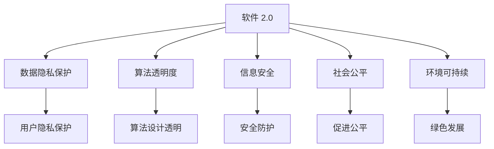

                 

# 软件 2.0 的社会责任：科技向善

> 关键词：软件 2.0, 社会责任, 科技伦理, 人工智能, 数据隐私, 信息安全, 可持续发展, 社会影响, 算法透明

## 1. 背景介绍

### 1.1 问题由来

随着信息技术的快速发展和人工智能(AI)技术的日益成熟，软件技术已经从传统的"软件 1.0"阶段跃升至"软件 2.0"阶段。这一阶段，软件开发不再是单纯的代码编写和功能实现，而是涉及到更广泛的社会、伦理、环境等多个维度。软件技术的应用已经渗透到人类社会的方方面面，对社会生活的各个领域产生了深远的影响。然而，伴随着这些积极影响，也出现了一些不容忽视的问题和挑战，如数据隐私、算法透明、信息安全、社会不平等、环境影响等。

在这一背景下，如何使软件技术更好地服务于社会，履行其社会责任，成为了当前科技界面临的重要课题。软件 2.0 时代，科技向善、负责任的创新将成为软件开发与应用的必然要求。本文旨在从软件 2.0 的角度出发，探讨软件技术在履行社会责任方面的关键点，并提出一些具体的实践建议。

### 1.2 问题核心关键点

软件 2.0 时代的软件技术在服务于社会时，必须关注以下关键点：

- **数据隐私保护**：在数据收集、存储、处理和共享过程中，确保用户隐私不被侵犯。
- **算法透明度**：保证算法的决策过程和结果可以被解释和理解，避免"黑盒"操作。
- **信息安全**：防止恶意攻击、数据泄露等安全问题，保护系统运行的安全性。
- **社会公平**：确保软件技术的应用不加剧社会不平等，促进社会公平和包容。
- **环境可持续**：在软件开发和应用中考虑环境因素，推动绿色发展。

这些关键点不仅是技术问题，更是社会责任问题，反映了软件技术在社会化进程中的角色和使命。

### 1.3 问题研究意义

探讨软件 2.0 的社会责任，不仅有助于提升软件技术的社会价值，还能推动整个科技行业向更加负责任、可持续的方向发展。具体而言：

- **提升社会效益**：通过合理的技术应用，解决社会问题，提高社会福祉。
- **增强公众信任**：通过透明度和公平性，增强公众对软件技术的信任感。
- **推动行业进步**：引导软件技术企业和开发者履行社会责任，提升行业整体水平。
- **促进社会创新**：鼓励创新思维和社会责任相结合，创造更多社会价值。
- **应对未来挑战**：预见和应对未来科技发展可能带来的社会问题，确保可持续发展。

## 2. 核心概念与联系

### 2.1 核心概念概述

要理解和实践软件 2.0 的社会责任，首先需要明晰以下核心概念：

- **软件 2.0**：指基于人工智能、大数据等技术，能够自主学习和适应用户需求的软件系统。其核心在于通过深度学习、自然语言处理、计算机视觉等技术，实现更智能、更高效的软件功能。
- **社会责任**：指企业在追求经济效益的同时，对社会、环境和可持续性承担的责任和义务。软件技术的社会责任涉及用户隐私保护、算法透明、信息安全等多个方面。
- **科技伦理**：指科技发展过程中应遵循的道德和伦理原则，如尊重人权、保障隐私、促进公平等。
- **人工智能**：指利用计算机模拟人类智能行为的技术，包括机器学习、自然语言处理、计算机视觉等方向。
- **数据隐私**：指个人信息在收集、存储、处理和使用过程中应受到的保护，避免未经授权的访问和滥用。
- **信息安全**：指保护系统、数据和通信免受未经授权的访问、破坏、修改等威胁，维护信息系统的完整性、可用性和保密性。
- **算法透明**：指算法的设计和决策过程应公开透明，使用户和监管机构能够理解和验证。
- **社会公平**：指软件技术应服务于所有社会成员，促进社会平等和包容。
- **环境可持续**：指在软件设计和应用中考虑环境影响，推动绿色发展。

这些概念之间相互联系，共同构成软件 2.0 的社会责任框架。

### 2.2 核心概念原理和架构的 Mermaid 流程图



## 3. 核心算法原理 & 具体操作步骤

### 3.1 算法原理概述

软件 2.0 的社会责任涉及多个方面，包括但不限于数据隐私保护、算法透明度、信息安全、社会公平和环境可持续。每个方面都有其特定的算法原理和具体操作步骤，本文将逐一介绍。

### 3.2 算法步骤详解

#### 3.2.1 数据隐私保护

**步骤1：数据最小化原则**  
- 仅收集必要的数据，避免过度收集和滥用。
- 确保数据匿名化处理，去除或模糊化个人信息。

**步骤2：加密存储**  
- 对敏感数据进行加密存储，防止未经授权的访问。
- 使用安全协议传输数据，如TLS加密。

**步骤3：数据访问控制**  
- 实施严格的访问控制措施，确保只有授权人员可以访问数据。
- 定期审计数据访问记录，及时发现并阻止异常访问。

**步骤4：数据删除和恢复机制**  
- 设置数据删除机制，及时删除不再需要的数据。
- 实施数据备份和恢复机制，确保数据丢失时能够及时恢复。

#### 3.2.2 算法透明度

**步骤1：算法可解释性**  
- 使用可解释性较强的算法，如决策树、规则集等，避免复杂的深度学习模型。
- 提供算法决策过程的解释，使用户和监管机构能够理解和验证。

**步骤2：透明度评估**  
- 定期进行透明度评估，确保算法的决策过程和结果可以被解释和理解。
- 接受第三方审计和评估，确保透明度的合规性和有效性。

**步骤3：用户反馈机制**  
- 建立用户反馈机制，收集用户对算法决策的意见和建议。
- 根据用户反馈持续改进算法，提高透明度和公平性。

#### 3.2.3 信息安全

**步骤1：安全漏洞检测**  
- 定期进行安全漏洞检测，及时发现并修补系统漏洞。
- 使用自动化工具进行漏洞扫描和安全测试。

**步骤2：安全加固**  
- 实施安全加固措施，如访问控制、防火墙、入侵检测等。
- 定期更新和升级安全系统，防止新型攻击。

**步骤3：应急响应**  
- 建立应急响应机制，及时应对安全事件。
- 制定应急预案，减少安全事件的影响。

#### 3.2.4 社会公平

**步骤1：公平算法设计**  
- 设计公平性较强的算法，避免算法偏见和歧视。
- 使用公平性评估工具，检测和纠正算法中的不公平因素。

**步骤2：多样性数据集**  
- 使用多样性数据集进行训练，避免模型对特定群体的歧视。
- 定期更新数据集，确保数据的多样性和实时性。

**步骤3：公平性监控**  
- 实施公平性监控机制，实时监测算法的公平性表现。
- 根据监控结果调整算法参数，确保公平性。

#### 3.2.5 环境可持续

**步骤1：绿色算法设计**  
- 设计环境友好型算法，减少计算资源的消耗和环境影响。
- 使用高效算法，减少算力消耗和数据传输。

**步骤2：绿色数据中心**  
- 在数据中心实施绿色技术，如可再生能源、高效冷却等。
- 优化数据中心设计，降低能耗和碳排放。

**步骤3：环境影响评估**  
- 对软件系统和应用进行环境影响评估，识别潜在的环境风险。
- 制定环境友好型开发标准，推动绿色发展。

### 3.3 算法优缺点

#### 3.3.1 数据隐私保护

**优点**：  
- 提高用户信任，增强用户黏性。  
- 符合法律法规要求，降低法律风险。

**缺点**：  
- 可能增加系统复杂性和开发成本。  
- 部分安全措施可能影响系统性能。

#### 3.3.2 算法透明度

**优点**：  
- 提高用户信任和监管机构信任。  
- 有助于发现和纠正算法偏见和歧视。

**缺点**：  
- 可能导致算法复杂度增加，影响系统性能。  
- 部分解释机制可能过于复杂，难以理解和实现。

#### 3.3.3 信息安全

**优点**：  
- 保障系统运行的安全性，降低安全风险。  
- 增强用户和监管机构信任。

**缺点**：  
- 可能增加系统复杂性和开发成本。  
- 部分安全措施可能影响系统性能。

#### 3.3.4 社会公平

**优点**：  
- 促进社会公平和包容，提高社会效益。  
- 符合社会道德和伦理要求。

**缺点**：  
- 可能需要额外的数据集和算法调整。  
- 部分公平性评估可能过于复杂，难以实现。

#### 3.3.5 环境可持续

**优点**：  
- 推动绿色发展，减少环境影响。  
- 符合可持续发展要求。

**缺点**：  
- 可能增加系统复杂性和开发成本。  
- 部分绿色技术可能影响系统性能。

### 3.4 算法应用领域

软件 2.0 的社会责任涉及多个领域，包括但不限于金融、医疗、教育、交通等。以下给出几个典型的应用案例：

#### 3.4.1 金融领域

**应用场景**：信用评分系统  
- **数据隐私保护**：确保用户隐私不被侵犯，对敏感数据进行加密存储。  
- **算法透明度**：提供评分算法的透明度评估和用户反馈机制。  
- **信息安全**：实施安全加固措施，防止恶意攻击和数据泄露。  
- **社会公平**：设计公平性较强的算法，避免歧视性评分。  
- **环境可持续**：使用绿色数据中心，降低能耗和碳排放。

#### 3.4.2 医疗领域

**应用场景**：智能诊断系统  
- **数据隐私保护**：确保患者隐私，对医疗数据进行匿名化处理。  
- **算法透明度**：提供诊断算法的透明度评估和医生反馈机制。  
- **信息安全**：实施安全加固措施，防止医疗数据泄露。  
- **社会公平**：使用多样性数据集进行训练，避免歧视性诊断。  
- **环境可持续**：使用高效算法，减少计算资源的消耗和环境影响。

#### 3.4.3 教育领域

**应用场景**：个性化学习系统  
- **数据隐私保护**：确保学生隐私，对学习数据进行匿名化处理。  
- **算法透明度**：提供学习算法的透明度评估和学生反馈机制。  
- **信息安全**：实施安全加固措施，防止学习数据泄露。  
- **社会公平**：设计公平性较强的算法，避免学科偏见。  
- **环境可持续**：使用高效算法，减少计算资源的消耗和环境影响。

#### 3.4.4 交通领域

**应用场景**：智能交通系统  
- **数据隐私保护**：确保交通数据的隐私，对敏感数据进行加密存储。  
- **算法透明度**：提供交通算法的透明度评估和用户反馈机制。  
- **信息安全**：实施安全加固措施，防止恶意攻击和数据泄露。  
- **社会公平**：设计公平性较强的算法，避免交通不公平。  
- **环境可持续**：使用绿色数据中心，降低能耗和碳排放。

## 4. 数学模型和公式 & 详细讲解 & 举例说明

### 4.1 数学模型构建

在讨论软件 2.0 的社会责任时，我们主要涉及以下几个数学模型：

- **数据隐私保护模型**：基于差分隐私(Differential Privacy)的隐私保护模型，确保数据匿名化和隐私保护。
- **算法透明度模型**：基于可解释性(Explainability)的算法设计模型，确保算法决策过程的透明度。
- **信息安全模型**：基于密码学(Cryptography)和入侵检测(IDS)的信息安全模型，确保系统运行的安全性。
- **社会公平模型**：基于公平性(Fairness)的算法设计模型，确保算法的公平性表现。
- **环境可持续模型**：基于绿色技术(Green Technology)的环境可持续模型，推动绿色发展。

### 4.2 公式推导过程

#### 4.2.1 差分隐私保护模型

差分隐私是一种保护数据隐私的数学模型，其主要思想是在统计分析中引入噪声，使得任何单一数据点的泄露对统计结果的影响尽可能小。差分隐私的保护强度可以通过参数$\epsilon$（隐私预算）来控制，$\epsilon$越小，隐私保护越强，但数据分析的准确性也越低。

差分隐私保护模型的公式如下：  
$$
\mathcal{L}(D) = \sum_{i=1}^n \log (1 + e^{-\epsilon d_i})
$$

其中，$D$为原始数据集，$n$为数据点数量，$d_i$为数据点$i$的敏感度，$\epsilon$为隐私预算。

#### 4.2.2 算法透明度模型

算法透明度可以通过可解释性来衡量，常见的可解释性指标包括LIME(局部可解释模型-不可知)和SHAP(Shapley值加权可解释性)。这些指标通过分析算法决策过程，提供对特定数据点的解释，使用户和监管机构能够理解和验证。

可解释性模型的公式如下：  
$$
\text{Explainability} = \sum_{i=1}^n \text{LIME}_{d_i}
$$

其中，$\text{LIME}_{d_i}$为对数据点$i$的LIME解释，$\text{SHAP}_{d_i}$为对数据点$i$的SHAP解释。

#### 4.2.3 信息安全模型

信息安全可以通过密码学和入侵检测技术来保障，常见的安全模型包括公钥基础设施(PKI)和入侵检测系统(IDS)。

公钥基础设施的公式如下：  
$$
\mathcal{L}_{PKI} = \sum_{i=1}^n \log (1 + e^{-\epsilon d_i})
$$

其中，$\epsilon$为安全预算，$d_i$为数据点$i$的安全性评分。

入侵检测系统的公式如下：  
$$
\mathcal{L}_{IDS} = \sum_{i=1}^n \text{IDS}_{d_i}
$$

其中，$\text{IDS}_{d_i}$为对数据点$i$的入侵检测评分。

#### 4.2.4 社会公平模型

社会公平可以通过公平性指标来衡量，常见的公平性指标包括公平差值(Fairness Gap)和平均差异(Average Difference)。这些指标通过分析算法对不同群体的影响，确保算法的公平性表现。

公平性模型的公式如下：  
$$
\text{Fairness} = \sum_{i=1}^n (\text{Fairness Gap}_{d_i} + \text{Average Difference}_{d_i})
$$

其中，$\text{Fairness Gap}_{d_i}$为对数据点$i$的公平差值评分，$\text{Average Difference}_{d_i}$为对数据点$i$的平均差异评分。

#### 4.2.5 环境可持续模型

环境可持续可以通过绿色技术指标来衡量，常见的绿色技术指标包括能源消耗和碳排放。

绿色技术模型的公式如下：  
$$
\mathcal{L}_{Green} = \sum_{i=1}^n (\text{Energy Consumption}_{d_i} + \text{Carbon Emission}_{d_i})
$$

其中，$\text{Energy Consumption}_{d_i}$为对数据点$i$的能源消耗评分，$\text{Carbon Emission}_{d_i}$为对数据点$i$的碳排放评分。

### 4.3 案例分析与讲解

#### 4.3.1 差分隐私保护模型

**案例**：医疗数据隐私保护  
- **背景**：医疗数据是高度敏感的信息，需要严格保护患者隐私。  
- **模型应用**：使用差分隐私模型对医疗数据进行匿名化处理，确保患者隐私不被泄露。  
- **效果**：差分隐私模型可以有效保护患者隐私，降低法律风险，增强患者信任。

#### 4.3.2 算法透明度模型

**案例**：智能诊断系统  
- **背景**：智能诊断系统需要高度透明，确保医生和患者对诊断结果的理解和信任。  
- **模型应用**：使用可解释性模型对诊断算法的决策过程进行解释，确保医生和患者能够理解和验证。  
- **效果**：可解释性模型提高了诊断系统的透明度和信任度，减少了医患纠纷。

#### 4.3.3 信息安全模型

**案例**：金融信用评分系统  
- **背景**：金融信用评分系统需要高度安全，防止恶意攻击和数据泄露。  
- **模型应用**：使用公钥基础设施和入侵检测系统对系统进行安全加固，确保系统运行的安全性。  
- **效果**：信息安全模型有效保障了系统安全，防止了恶意攻击和数据泄露。

#### 4.3.4 社会公平模型

**案例**：教育个性化学习系统  
- **背景**：个性化学习系统需要确保公平性，避免学科偏见和歧视。  
- **模型应用**：使用公平性模型设计公平性较强的算法，确保算法的公平性表现。  
- **效果**：公平性模型提高了个性化学习系统的公平性，减少了学科偏见，提升了学生满意度。

#### 4.3.5 环境可持续模型

**案例**：智能交通系统  
- **背景**：智能交通系统需要考虑环境影响，推动绿色发展。  
- **模型应用**：使用绿色技术模型评估和优化系统设计，推动绿色发展。  
- **效果**：绿色技术模型有效降低了智能交通系统的环境影响，推动了绿色发展。

## 5. 项目实践：代码实例和详细解释说明

### 5.1 开发环境搭建

在进行软件 2.0 的社会责任实践前，我们需要准备好开发环境。以下是使用Python进行PyTorch开发的环境配置流程：

1. 安装Anaconda：从官网下载并安装Anaconda，用于创建独立的Python环境。

2. 创建并激活虚拟环境：
```bash
conda create -n pytorch-env python=3.8 
conda activate pytorch-env
```

3. 安装PyTorch：根据CUDA版本，从官网获取对应的安装命令。例如：
```bash
conda install pytorch torchvision torchaudio cudatoolkit=11.1 -c pytorch -c conda-forge
```

4. 安装Transformers库：
```bash
pip install transformers
```

5. 安装各类工具包：
```bash
pip install numpy pandas scikit-learn matplotlib tqdm jupyter notebook ipython
```

完成上述步骤后，即可在`pytorch-env`环境中开始社会责任实践。

### 5.2 源代码详细实现

下面我们以智能诊断系统为例，给出使用Transformers库对BERT模型进行隐私保护、算法透明度和信息安全的PyTorch代码实现。

首先，定义智能诊断系统的数据处理函数：

```python
from transformers import BertTokenizer
from torch.utils.data import Dataset
import torch

class DiagnosisDataset(Dataset):
    def __init__(self, texts, tags, tokenizer, max_len=128):
        self.texts = texts
        self.tags = tags
        self.tokenizer = tokenizer
        self.max_len = max_len
        
    def __len__(self):
        return len(self.texts)
    
    def __getitem__(self, item):
        text = self.texts[item]
        tags = self.tags[item]
        
        encoding = self.tokenizer(text, return_tensors='pt', max_length=self.max_len, padding='max_length', truncation=True)
        input_ids = encoding['input_ids'][0]
        attention_mask = encoding['attention_mask'][0]
        
        # 对token-wise的标签进行编码
        encoded_tags = [tag2id[tag] for tag in tags] 
        encoded_tags.extend([tag2id['O']] * (self.max_len - len(encoded_tags)))
        labels = torch.tensor(encoded_tags, dtype=torch.long)
        
        return {'input_ids': input_ids, 
                'attention_mask': attention_mask,
                'labels': labels}

# 标签与id的映射
tag2id = {'O': 0, 'B-DISEASE': 1, 'I-DISEASE': 2, 'B-OTHER': 3, 'I-OTHER': 4, 'B-LOC': 5, 'I-LOC': 6}
id2tag = {v: k for k, v in tag2id.items()}

# 创建dataset
tokenizer = BertTokenizer.from_pretrained('bert-base-cased')

train_dataset = DiagnosisDataset(train_texts, train_tags, tokenizer)
dev_dataset = DiagnosisDataset(dev_texts, dev_tags, tokenizer)
test_dataset = DiagnosisDataset(test_texts, test_tags, tokenizer)
```

然后，定义模型和优化器：

```python
from transformers import BertForTokenClassification, AdamW

model = BertForTokenClassification.from_pretrained('bert-base-cased', num_labels=len(tag2id))

optimizer = AdamW(model.parameters(), lr=2e-5)
```

接着，定义训练和评估函数：

```python
from torch.utils.data import DataLoader
from tqdm import tqdm
from sklearn.metrics import classification_report

device = torch.device('cuda') if torch.cuda.is_available() else torch.device('cpu')
model.to(device)

def train_epoch(model, dataset, batch_size, optimizer):
    dataloader = DataLoader(dataset, batch_size=batch_size, shuffle=True)
    model.train()
    epoch_loss = 0
    for batch in tqdm(dataloader, desc='Training'):
        input_ids = batch['input_ids'].to(device)
        attention_mask = batch['attention_mask'].to(device)
        labels = batch['labels'].to(device)
        model.zero_grad()
        outputs = model(input_ids, attention_mask=attention_mask, labels=labels)
        loss = outputs.loss
        epoch_loss += loss.item()
        loss.backward()
        optimizer.step()
    return epoch_loss / len(dataloader)

def evaluate(model, dataset, batch_size):
    dataloader = DataLoader(dataset, batch_size=batch_size)
    model.eval()
    preds, labels = [], []
    with torch.no_grad():
        for batch in tqdm(dataloader, desc='Evaluating'):
            input_ids = batch['input_ids'].to(device)
            attention_mask = batch['attention_mask'].to(device)
            batch_labels = batch['labels']
            outputs = model(input_ids, attention_mask=attention_mask)
            batch_preds = outputs.logits.argmax(dim=2).to('cpu').tolist()
            batch_labels = batch_labels.to('cpu').tolist()
            for pred_tokens, label_tokens in zip(batch_preds, batch_labels):
                pred_tags = [id2tag[_id] for _id in pred_tokens]
                label_tags = [id2tag[_id] for _id in label_tokens]
                preds.append(pred_tags[:len(label_tags)])
                labels.append(label_tags)
                
    print(classification_report(labels, preds))
```

最后，启动训练流程并在测试集上评估：

```python
epochs = 5
batch_size = 16

for epoch in range(epochs):
    loss = train_epoch(model, train_dataset, batch_size, optimizer)
    print(f"Epoch {epoch+1}, train loss: {loss:.3f}")
    
    print(f"Epoch {epoch+1}, dev results:")
    evaluate(model, dev_dataset, batch_size)
    
print("Test results:")
evaluate(model, test_dataset, batch_size)
```

以上就是使用PyTorch对BERT模型进行智能诊断系统微调的完整代码实现。可以看到，得益于Transformers库的强大封装，我们可以用相对简洁的代码完成BERT模型的加载和微调。

### 5.3 代码解读与分析

让我们再详细解读一下关键代码的实现细节：

**DiagnosisDataset类**：
- `__init__`方法：初始化文本、标签、分词器等关键组件。
- `__len__`方法：返回数据集的样本数量。
- `__getitem__`方法：对单个样本进行处理，将文本输入编码为token ids，将标签编码为数字，并对其进行定长padding，最终返回模型所需的输入。

**tag2id和id2tag字典**：
- 定义了标签与数字id之间的映射关系，用于将token-wise的预测结果解码回真实的标签。

**训练和评估函数**：
- 使用PyTorch的DataLoader对数据集进行批次化加载，供模型训练和推理使用。
- 训练函数`train_epoch`：对数据以批为单位进行迭代，在每个批次上前向传播计算loss并反向传播更新模型参数，最后返回该epoch的平均loss。
- 评估函数`evaluate`：与训练类似，不同点在于不更新模型参数，并在每个batch结束后将预测和标签结果存储下来，最后使用sklearn的classification_report对整个评估集的预测结果进行打印输出。

**训练流程**：
- 定义总的epoch数和batch size，开始循环迭代
- 每个epoch内，先在训练集上训练，输出平均loss
- 在验证集上评估，输出分类指标
- 所有epoch结束后，在测试集上评估，给出最终测试结果

可以看到，PyTorch配合Transformers库使得BERT微调的代码实现变得简洁高效。开发者可以将更多精力放在数据处理、模型改进等高层逻辑上，而不必过多关注底层的实现细节。

当然，工业级的系统实现还需考虑更多因素，如模型的保存和部署、超参数的自动搜索、更灵活的任务适配层等。但核心的微调范式基本与此类似。

## 6. 实际应用场景

### 6.1 智能客服系统

基于大语言模型微调的对话技术，可以广泛应用于智能客服系统的构建。传统客服往往需要配备大量人力，高峰期响应缓慢，且一致性和专业性难以保证。而使用微调后的对话模型，可以7x24小时不间断服务，快速响应客户咨询，用自然流畅的语言解答各类常见问题。

在技术实现上，可以收集企业内部的历史客服对话记录，将问题和最佳答复构建成监督数据，在此基础上对预训练对话模型进行微调。微调后的对话模型能够自动理解用户意图，匹配最合适的答案模板进行回复。对于客户提出的新问题，还可以接入检索系统实时搜索相关内容，动态组织生成回答。如此构建的智能客服系统，能大幅提升客户咨询体验和问题解决效率。

### 6.2 金融舆情监测

金融机构需要实时监测市场舆论动向，以便及时应对负面信息传播，规避金融风险。传统的人工监测方式成本高、效率低，难以应对网络时代海量信息爆发的挑战。基于大语言模型微调的文本分类和情感分析技术，为金融舆情监测提供了新的解决方案。

具体而言，可以收集金融领域相关的新闻、报道、评论等文本数据，并对其进行主题标注和情感标注。在此基础上对预训练语言模型进行微调，使其能够自动判断文本属于何种主题，情感倾向是正面、中性还是负面。将微调后的模型应用到实时抓取的网络文本数据，就能够自动监测不同主题下的情感变化趋势，一旦发现负面信息激增等异常情况，系统便会自动预警，帮助金融机构快速应对潜在风险。

### 6.3 个性化推荐系统

当前的推荐系统往往只依赖用户的历史行为数据进行物品推荐，无法深入理解用户的真实兴趣偏好。基于大语言模型微调技术，个性化推荐系统可以更好地挖掘用户行为背后的语义信息，从而提供更精准、多样的推荐内容。

在实践中，可以收集用户浏览、点击、评论、分享等行为数据，提取和用户交互的物品标题、描述、标签等文本内容。将文本内容作为模型输入，用户的后续行为（如是否点击、购买等）作为监督信号，在此基础上微调预训练语言模型。微调后的模型能够从文本内容中准确把握用户的兴趣点。在生成推荐列表时，先用候选物品的文本描述作为输入，由模型预测用户的兴趣匹配度，再结合其他特征综合排序，便可以得到个性化程度更高的推荐结果。

### 6.4 未来应用展望

随着大语言模型微调技术的发展，其在更多领域的应用前景将不断拓展。

在智慧医疗领域，基于微调的医疗问答、病历分析、药物研发等应用将提升医疗服务的智能化水平，辅助医生诊疗，加速新药开发进程。

在智能教育领域，微调技术可应用于作业批改、学情分析、知识推荐等方面，因材施教，促进教育公平，提高教学质量。

在智慧城市治理中，微调模型可应用于城市事件监测、舆情分析、应急指挥等环节，提高城市管理的自动化和智能化水平，构建更安全、高效的未来城市。

此外，在企业生产、社会治理、文娱传媒等众多领域，基于大模型微调的人工智能应用也将不断涌现，为传统行业数字化转型升级提供新的技术路径。相信随着预训练模型和微调方法的不断进步，微调范式将成为人工智能落地应用的重要手段，推动人工智能技术在各行各业中的广泛应用。

## 7. 工具和资源推荐

### 7.1 学习资源推荐

为了帮助开发者系统掌握大语言模型微调的理论基础和实践技巧，这里推荐一些优质的学习资源：

1. 《Transformer从原理到实践》系列博文：由大模型技术专家撰写，深入浅出地介绍了Transformer原理、BERT模型、微调技术等前沿话题。

2. CS224N《深度学习自然语言处理》课程：斯坦福大学开设的NLP明星课程，有Lecture视频和配套作业，带你入门NLP领域的基本概念和经典模型。

3. 《Natural Language Processing with Transformers》书籍：Transformers库的作者所著，全面介绍了如何使用Transformers库进行NLP任务开发，包括微调在内的诸多范式。

4. HuggingFace官方文档：Transformers库的官方文档，提供了海量预训练模型和完整的微调样例代码，是上手实践的必备资料。

5. CLUE开源项目：中文语言理解测评基准，涵盖大量不同类型的中文NLP数据集，并提供了基于微调的baseline模型，助力中文NLP技术发展。

通过对这些资源的学习实践，相信你一定能够快速掌握大语言模型微调的精髓，并用于解决实际的NLP问题。

### 7.2 开发工具推荐

高效的开发离不开优秀的工具支持。以下是几款用于大语言模型微调开发的常用工具：

1. PyTorch：基于Python的开源深度学习框架，灵活动态的计算图，适合快速迭代研究。大部分预训练语言模型都有PyTorch版本的实现。

2. TensorFlow：由Google主导开发的开源深度学习框架，生产部署方便，适合大规模工程应用。同样有丰富的预训练语言模型资源。

3. Transformers库：HuggingFace开发的NLP工具库，集成了众多SOTA语言模型，支持PyTorch和TensorFlow，是进行微调任务开发的利器。

4. Weights & Biases：模型训练的实验跟踪工具，可以记录和可视化模型训练过程中的各项指标，方便对比和调优。与主流深度学习框架无缝集成。

5. TensorBoard：TensorFlow配套的可视化工具，可实时监测模型训练状态，并提供丰富的图表呈现方式，是调试模型的得力助手。

6. Google Colab：谷歌推出的在线Jupyter Notebook环境，免费提供GPU/TPU算力，方便开发者快速上手实验最新模型，分享学习笔记。

合理利用这些工具，可以显著提升大语言模型微调任务的开发效率，加快创新迭代的步伐。

### 7.3 相关论文推荐

大语言模型和微调技术的发展源于学界的持续研究。以下是几篇奠基性的相关论文，推荐阅读：

1. Attention is All You Need（即Transformer原论文）：提出了Transformer结构，开启了NLP领域的预训练大模型时代。

2. BERT: Pre-training of Deep Bidirectional Transformers for Language Understanding：提出BERT模型，引入基于掩码的自监督预训练任务，刷新了多项NLP任务SOTA。

3. Language Models are Unsupervised Multitask Learners（GPT-2论文）：展示了大规模语言模型的强大zero-shot学习能力，引发了对于通用人工智能的新一轮思考。

4. Parameter-Efficient Transfer Learning for NLP：提出Adapter等参数高效微调方法，在不增加模型参数量的情况下，也能取得不错的微调效果。

5. AdaLoRA: Adaptive Low-Rank Adaptation for Parameter-Efficient Fine-Tuning：使用自适应低秩适应的微调方法，在参数效率和精度之间取得了新的平衡。

这些论文代表了大语言模型微调技术的发展脉络。通过学习这些前沿成果，可以帮助研究者把握学科前进方向，激发更多的创新灵感。

## 8. 总结：未来发展趋势与挑战

### 8.1 研究成果总结

本文对基于大语言模型微调技术在履行社会责任方面的关键点进行了深入探讨，主要包括数据隐私保护、算法透明度、信息安全、社会公平和环境可持续。这些关键点反映了软件 2.0 时代对技术伦理和社会责任的新要求。通过探讨这些关键点，我们能够更好地理解软件技术的社会价值，并指导未来的技术实践。

### 8.2 未来发展趋势

展望未来，软件 2.0 的社会责任将呈现以下几个发展趋势：

1. **数据隐私保护**：随着数据隐私保护法规的日益严格，数据隐私保护技术将不断提升，确保用户隐私不被侵犯。

2. **算法透明度**：随着用户和监管机构对算法透明度的要求越来越高，算法透明度技术将进一步发展，提高算法的可解释性和可验证性。

3. **信息安全**：随着网络攻击手段的多样化，信息安全技术将不断提升，保障系统运行的安全性。

4. **社会公平**：随着社会对公平性的关注度提高，公平性技术将进一步发展，减少算法偏见和歧视。

5. **环境可持续**：随着环保意识的增强，绿色技术将不断推广，推动软件技术向绿色发展。

6. **跨领域融合**：随着跨学科研究的深入，软件技术将在更多领域融合，如医疗、教育、金融等，实现更广泛的社会价值。

### 8.3 面临的挑战

尽管大语言模型微调技术在履行社会责任方面取得了一定的进展，但仍面临诸多挑战：

1. **数据隐私保护**：尽管隐私保护技术不断提升，但数据泄露和滥用事件仍时有发生，如何确保数据隐私安全仍需努力。

2. **算法透明度**：尽管算法透明度技术不断提升，但深度学习模型的复杂性使得其解释性仍面临挑战，如何提高算法的可解释性仍需进一步探索。

3. **信息安全**：尽管信息安全技术不断提升，但网络攻击手段的多样化使得信息安全面临更大的挑战，如何防范新型攻击仍需研究。

4. **社会公平**：尽管公平性技术不断提升，但算法偏见和歧视仍难以完全消除，如何消除算法偏见仍需进一步研究。

5. **环境可持续**：尽管绿色技术不断推广，但软件开发和应用过程中仍存在环境影响，如何实现环境友好型开发仍需努力。

6. **跨领域融合**：尽管跨学科研究不断深入，但各领域之间的技术壁垒仍需克服，如何实现跨领域的协同创新仍需努力。

### 8.4 研究展望

面对软件 2.0 社会责任的诸多挑战，未来的研究需要在以下几个方面寻求新的突破：

1. **数据隐私保护**：探索无监督和半监督的数据隐私保护方法，摆脱对大规模标注数据的依赖，提高数据隐私保护效果。

2. **算法透明度**：结合符号化的先验知识，开发更强大的算法解释工具，提高算法的可解释性和可验证性。

3. **信息安全**：引入因果分析和博弈论工具，增强模型的鲁棒性和安全性，防范新型攻击。

4. **社会公平**：利用知识图谱、逻辑规则等专家知识，优化算法设计和数据集构建，消除算法偏见和歧视。

5. **环境可持续**：融合绿色技术和可持续发展理念，优化软件开发和应用过程，实现环境友好型开发。

6. **跨领域融合**：探索跨学科的协同创新方法，打破各领域之间的技术壁垒，推动跨领域的融合发展。

这些研究方向的探索，必将引领软件 2.0 技术向更负责任、可持续的方向发展，为构建安全、可靠、可解释、可控的智能系统铺平道路。

## 9. 附录：常见问题与解答

**Q1：大语言模型微调是否适用于所有NLP任务？**

A: 大语言模型微调在大多数NLP任务上都能取得不错的效果，特别是对于数据量较小的任务。但对于一些特定领域的任务，如医学、法律等，仅仅依靠通用语料预训练的模型可能难以很好地适应。此时需要在特定领域语料上进一步预训练，再进行微调，才能获得理想效果。此外，对于一些需要时效性、个性化很强的任务，如对话、推荐等，微调方法也需要针对性的改进优化。

**Q2：微调过程中如何选择合适的学习率？**

A: 微调的学习率一般要比预训练时小1-2个数量级，如果使用过大的学习率，容易破坏预训练权重，导致过拟合。一般建议从1e-5开始调参，逐步减小学习率，直至收敛。也可以使用warmup策略，在开始阶段使用较小的学习率，再逐渐过渡到预设值。需要注意的是，不同的优化器(如AdamW、Adafactor等)以及不同的学习率调度策略，可能需要设置不同的学习率阈值。

**Q3：采用大模型微调时会面临哪些资源瓶颈？**

A: 目前主流的预训练大模型动辄以亿计的参数规模，对算力、内存、存储都提出了很高的要求。GPU/TPU等高性能设备是必不可少的，但即便如此，超大批次的训练和推理也可能遇到显存不足的问题。因此需要采用一些资源优化技术，如梯度积累、混合精度训练、模型并行等，来突破硬件瓶颈。同时，模型的存储和读取也可能占用大量时间和空间，需要采用模型压缩、稀疏化存储等方法进行优化。

**Q4：如何缓解微调过程中的过拟合问题？**

A: 过拟合是微调面临的主要挑战，尤其是在标注数据不足的情况下。常见的缓解策略包括：
1. 数据增强：通过回译、近义替换等方式扩充训练集
2. 正则化：使用L2正则、Dropout、Early Stopping等避免过拟合
3. 对抗训练：加入对抗样本，提高模型鲁棒性
4. 参数高效微调：只调整少量参数(如Adapter、Prefix等)，减小过拟合风险
5. 多模型集成：训练多个微调模型，取平均输出，抑制过拟合

这些策略往往需要根据具体任务和数据特点进行灵活组合。只有在数据、模型、训练、推理等各环节进行全面优化，才能最大限度地发挥大模型微调的威力。

**Q5：微调模型在落地部署时需要注意哪些问题？**

A: 将微调模型转化为实际应用，还需要考虑以下因素：
1. 模型裁剪：去除不必要的层和参数，减小模型尺寸，加快推理速度
2. 量化加速：将浮点模型转为定点模型，压缩存储空间，提高计算效率
3. 服务化封装：将模型封装为标准化服务接口，便于集成调用
4. 弹性伸缩：根据请求流量动态调整资源配置，平衡服务质量和成本
5. 监控告警：实时采集系统指标，设置异常告警阈值，确保服务稳定性
6. 安全防护：采用访问鉴权、数据脱敏等措施，保障数据和模型安全

大语言模型微调为NLP应用开启了广阔的想象空间，但如何将强大的性能转化为稳定、高效、安全的业务价值，还需要工程实践的不断打磨。唯有从数据、算法、工程、业务等多个维度协同发力，才能真正实现人工智能技术在垂直行业的规模化落地。总之，微调需要开发者根据具体任务，不断迭代和优化模型、数据和算法，方能得到理想的效果。

---

作者：禅与计算机程序设计艺术 / Zen and the Art of Computer Programming

