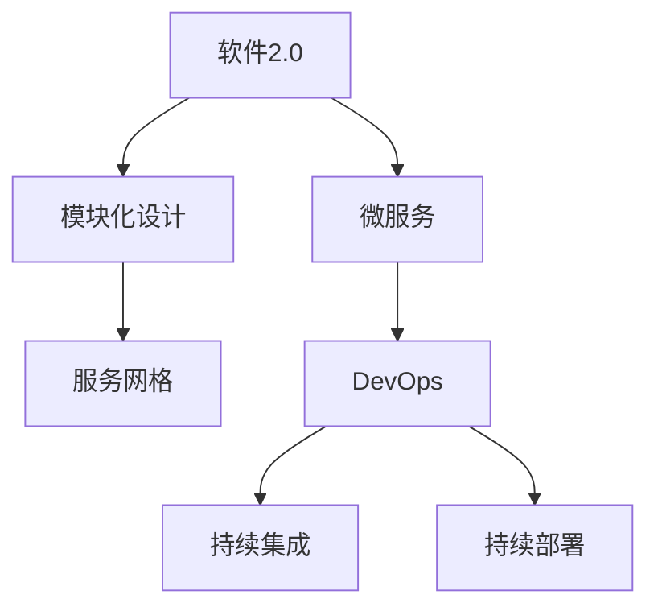

                 

# 软件2.0模块如何融合成整体最优解

> 关键词：软件2.0, 模块化设计, 系统集成, 微服务, 可复用, 跨领域应用, 敏捷开发, 持续集成

## 1. 背景介绍

### 1.1 问题由来

在软件开发领域，模块化设计（Modular Design）一直是工程实践的核心原则之一。传统的软件工程采用瀑布式开发流程，将软件开发任务分解为多个相对独立的模块，每个模块负责特定的功能，通过接口和数据交换实现模块之间的协同。然而，随着软件规模的增大和复杂度的提升，模块间通信变得愈加复杂，系统性能和稳定性面临严峻挑战。

软件2.0（Software 2.0）是近些年来在软件开发领域提出的新概念，旨在通过持续集成（CI/CD）、微服务（Microservice）、DevOps等技术，实现模块的灵活组合和无缝集成。软件2.0追求的是将模块设计成易于扩展、可复用的组件，并通过敏捷开发和持续集成，迅速迭代和优化软件系统。

本文将深入探讨软件2.0模块的融合方式，阐述如何将多个模块有机组合，构建一个整体最优解的系统。通过系统设计和开发实践的详细讲解，为读者提供理论指导和技术工具，帮助其构建高性能、可扩展的软件系统。

## 2. 核心概念与联系

### 2.1 核心概念概述

为更好地理解软件2.0模块的融合方式，本节将介绍几个密切相关的核心概念：

- **软件2.0**：一种新兴的软件开发模式，强调通过自动化和自动化测试实现快速迭代和持续交付，通过微服务构建可扩展、可复用的系统。
- **模块化设计**：将大型软件系统分解为多个小模块，每个模块独立开发、测试和部署，通过接口和数据交互实现系统功能的集成。
- **微服务**：一个细粒度的、自治的服务单元，可以通过轻量级通信机制（如HTTP API）实现与其他服务的交互，具有高内聚、低耦合的特点。
- **服务网格**：用于连接、监控和发现微服务的框架，通过API网关、负载均衡、服务发现等功能，实现微服务的无缝集成和扩展。
- **DevOps**：一种软件开发和运维的实践模式，强调自动化和持续交付，通过持续集成和持续部署，提高软件系统的开发和运维效率。

这些核心概念之间的逻辑关系可以通过以下Mermaid流程图来展示：



这个流程图展示了软件2.0的核心组成和关联关系：

1. 软件2.0通过模块化设计实现系统功能分解，并通过微服务构建自治的服务单元。
2. 服务网格连接和发现微服务，实现系统内部的无缝集成。
3. DevOps通过持续集成和持续部署，提高软件系统的开发和运维效率。

## 3. 核心算法原理 & 具体操作步骤

### 3.1 算法原理概述

软件2.0模块的融合方式，本质上是通过微服务架构和DevOps实践，将多个独立的小模块有机组合，构建一个整体的、高性能的、可扩展的系统。其核心思想是：通过自动化测试和持续集成，确保每个微服务模块的稳定性和可靠性，同时通过轻量级通信机制实现服务间的协同工作。

具体而言，模块融合的流程包括以下几个关键步骤：

1. **模块设计**：将大型系统分解为多个小模块，每个模块独立开发、测试和部署，通过接口和数据交互实现系统功能的集成。
2. **服务编排**：设计服务网格，用于连接和发现微服务，实现系统内部的无缝集成。
3. **自动化测试**：通过持续集成和自动化测试，确保每个微服务模块的稳定性和可靠性。
4. **持续部署**：通过持续部署和DevOps实践，提高软件系统的开发和运维效率。

### 3.2 算法步骤详解

以下是软件2.0模块融合的具体操作步骤：

**Step 1: 模块设计**

- **功能划分**：根据系统的功能和需求，将系统划分为多个独立的功能模块，每个模块负责特定的功能。
- **接口设计**：定义模块之间的接口规范，确保数据交互的可靠性和安全性。
- **技术选型**：选择合适的技术和工具，支持模块的独立开发和测试。

**Step 2: 服务编排**

- **服务网格设计**：设计服务网格，用于连接和发现微服务，实现系统内部的无缝集成。
- **API网关配置**：配置API网关，实现微服务的路由和负载均衡。
- **服务发现机制**：实现服务发现机制，使微服务能够自动查找和调用其他服务。

**Step 3: 自动化测试**

- **单元测试**：编写单元测试用例，确保每个模块的功能正确性。
- **集成测试**：编写集成测试用例，确保模块间的交互正常。
- **持续集成**：通过持续集成工具（如Jenkins），自动化执行测试和构建过程。

**Step 4: 持续部署**

- **持续集成**：通过持续集成工具（如Jenkins），自动化执行构建和部署过程。
- **DevOps实践**：引入DevOps工具链（如GitLab CI/CD），实现代码管理和持续交付。
- **监控和反馈**：通过监控工具（如Prometheus），实时监控系统性能，并及时反馈问题。

### 3.3 算法优缺点

软件2.0模块融合方式具有以下优点：

1. **灵活性**：通过模块化设计和微服务架构，系统可以灵活地扩展和调整功能。
2. **可复用性**：模块和微服务可以独立开发和部署，提高代码的可复用性。
3. **高可用性**：通过服务网格和API网关，实现微服务的无缝集成和负载均衡，提高系统的可用性。
4. **持续迭代**：通过持续集成和持续部署，实现快速迭代和优化。

同时，该方法也存在以下缺点：

1. **复杂性**：系统设计和部署的复杂度较高，需要投入较多的人力和时间。
2. **接口设计难度大**：模块间的接口设计需要仔细规划，避免接口不一致和数据丢失问题。
3. **系统成本高**：引入微服务和API网关等中间件，需要增加系统成本和维护复杂度。
4. **安全性问题**：服务网格和API网关等中间件可能会成为攻击的入口，需要加强安全防护。

尽管存在这些缺点，但就目前而言，软件2.0模块融合方式仍是构建高性能、可扩展软件系统的最佳选择。未来相关研究的重点在于如何进一步降低系统设计和部署的复杂度，提高系统的安全性和可靠性。

### 3.4 算法应用领域

软件2.0模块融合方式在软件开发领域的应用非常广泛，几乎涵盖所有类型的应用系统。以下是一些典型的应用场景：

- **电子商务平台**：通过模块化设计和微服务架构，构建电商系统的用户管理、订单管理、商品管理等功能模块，并通过API网关实现无缝集成。
- **金融交易系统**：通过模块化设计和微服务架构，构建金融系统的账户管理、交易管理、风险控制等功能模块，并通过服务网格实现系统的高可用性和扩展性。
- **医疗信息平台**：通过模块化设计和微服务架构，构建医疗系统的患者信息、病历管理、医疗资源等功能模块，并通过API网关实现医疗数据的安全共享。
- **物联网平台**：通过模块化设计和微服务架构，构建物联网系统的设备管理、数据采集、数据分析等功能模块，并通过服务网格实现设备之间的互联互通。

除了这些应用场景外，软件2.0模块融合方式还在人工智能、大数据、区块链等众多领域得到了广泛应用，为各行各业带来了新的发展机遇。

## 4. 数学模型和公式 & 详细讲解

### 4.1 数学模型构建

在软件2.0模块融合过程中，我们通常使用以下数学模型来描述系统的性能和可靠性：

- **模块可靠性模型**：假设每个模块的可靠性为 $R_m$，系统的可靠性为 $R_s$。则系统可靠性为所有模块可靠性的乘积：

$$
R_s = \prod_{i=1}^n R_m
$$

其中 $n$ 为系统的模块数。

- **系统性能模型**：假设每个模块的处理速度为 $T_m$，系统的处理速度为 $T_s$。则系统处理速度为所有模块处理速度的加权平均：

$$
T_s = \sum_{i=1}^n \frac{T_m}{R_m} \cdot R_s
$$

- **系统负载模型**：假设每个模块的处理负荷为 $L_m$，系统的处理负荷为 $L_s$。则系统处理负荷为所有模块处理负荷的加权平均：

$$
L_s = \sum_{i=1}^n L_m
$$

### 4.2 公式推导过程

以下我们以系统可靠性模型为例，推导其数学表达式：

假设系统由 $n$ 个模块组成，每个模块的可靠性为 $R_m$，则系统的可靠性为：

$$
R_s = \prod_{i=1}^n R_m
$$

对于系统的可靠性计算，可以通过对每个模块的可靠性进行乘积得到：

$$
R_s = R_1 \cdot R_2 \cdot \ldots \cdot R_n
$$

这个公式表达了系统的可靠性为所有模块可靠性的乘积。在实际应用中，可以通过对每个模块的可靠性进行评估和测试，来计算系统的总可靠性。

### 4.3 案例分析与讲解

以下是一个简单的案例分析：

假设一个系统由两个模块 $A$ 和 $B$ 组成，每个模块的可靠性为 $0.9$。则系统的可靠性为：

$$
R_s = R_A \cdot R_B = 0.9 \cdot 0.9 = 0.81
$$

这意味着系统的总可靠性为 $81\%$，在两个模块都运行良好的情况下，系统能够正常运行的概率为 $81\%$。

## 5. 项目实践：代码实例和详细解释说明

### 5.1 开发环境搭建

在进行模块融合的实践前，我们需要准备好开发环境。以下是使用Python进行Django开发的环境配置流程：

1. 安装Anaconda：从官网下载并安装Anaconda，用于创建独立的Python环境。

2. 创建并激活虚拟环境：
```bash
conda create -n django-env python=3.8 
conda activate django-env
```

3. 安装Django：
```bash
pip install django
```

4. 安装需要的第三方库：
```bash
pip install Pillow psycopg2-binary
```

完成上述步骤后，即可在`django-env`环境中开始模块融合实践。

### 5.2 源代码详细实现

下面我们以构建一个简单的电商系统为例，展示如何使用Django和API网关实现微服务架构的模块融合。

首先，创建项目的根目录，并初始化Django项目：

```bash
django-admin startproject myshop
cd myshop
```

然后，创建应用模块，分别实现用户管理、订单管理、商品管理等功能：

```bash
python manage.py startapp user
python manage.py startapp order
python manage.py startapp product
```

接下来，配置API网关，实现各个模块之间的路由和负载均衡：

```bash
python manage.py startapp gateway
```

在`gateway`应用中，配置API网关的相关设置，并编写路由规则：

```python
# gateway/settings.py

INSTALLED_APPS = [
    # ...
    'gateway',
    # ...
]

MIDDLEWARE = [
    # ...
    'gateway.middleware.APIGatewayMiddleware',
    # ...
]
```

```python
# gateway/middleware.py

from django.http import AttributeError

class APIGatewayMiddleware:
    def __init__(self, get_response):
        self.get_response = get_response

    def __call__(self, request):
        # 根据URL规则进行路由和负载均衡
        if request.path.startswith('/api/user/'):
            response = self.get_response(request)
            return response
        elif request.path.startswith('/api/order/'):
            response = self.get_response(request)
            return response
        elif request.path.startswith('/api/product/'):
            response = self.get_response(request)
            return response
        else:
            raise AttributeError('路由规则不存在')
```

最后，编写模块的视图函数，并实现API网关的请求处理：

```python
# user/views.py

from django.http import JsonResponse

def user_list(request):
    # 用户管理功能
    user_list = User.objects.all()
    return JsonResponse(user_list, safe=False)

# order/views.py

from django.http import JsonResponse

def order_list(request):
    # 订单管理功能
    order_list = Order.objects.all()
    return JsonResponse(order_list, safe=False)

# product/views.py

from django.http import JsonResponse

def product_list(request):
    # 商品管理功能
    product_list = Product.objects.all()
    return JsonResponse(product_list, safe=False)
```

在`gateway`应用中，编写API网关的请求处理函数：

```python
# gateway/views.py

from django.http import JsonResponse

def gateway_user_list(request):
    # 路由到用户管理模块的视图函数
    return JsonResponse(user_list(request))

def gateway_order_list(request):
    # 路由到订单管理模块的视图函数
    return JsonResponse(order_list(request))

def gateway_product_list(request):
    # 路由到商品管理模块的视图函数
    return JsonResponse(product_list(request))
```

在上述代码中，我们通过API网关实现了用户管理、订单管理和商品管理模块的路由和请求处理。每个模块独立开发和部署，通过API网关实现无缝集成。

### 5.3 代码解读与分析

让我们再详细解读一下关键代码的实现细节：

**Django项目初始化**：
- 使用`django-admin startproject`命令初始化Django项目，并创建根目录`myshop`。
- 进入`myshop`目录，执行`cd myshop`命令。

**应用模块创建**：
- 使用`python manage.py startapp`命令创建用户管理、订单管理、商品管理等应用模块，分别命名为`user`、`order`、`product`。
- 每个应用模块独立开发和部署，通过API网关实现系统功能的集成。

**API网关配置**：
- 在`gateway`应用中，配置API网关的相关设置，包括路由规则、中间件等。
- 在`settings.py`文件中添加`gateway`应用，并在`MIDDLEWARE`列表中添加`gateway.middleware.APIGatewayMiddleware`。
- 在`middleware.py`文件中实现API网关的路由和请求处理逻辑。

**视图函数编写**：
- 在用户管理模块中，编写用户管理的视图函数`user_list`，用于获取用户列表。
- 在订单管理模块中，编写订单管理的视图函数`order_list`，用于获取订单列表。
- 在商品管理模块中，编写商品管理的视图函数`product_list`，用于获取商品列表。
- 在API网关中，编写路由到各模块视图函数的函数，如`gateway_user_list`、`gateway_order_list`、`gateway_product_list`。

**请求处理**：
- 通过API网关的请求处理函数，将各个模块的请求路由到相应的视图函数，实现系统功能的集成和协同。

通过上述代码实现，可以看到，通过API网关和Django框架，我们成功地将用户管理、订单管理、商品管理等模块有机融合，构建了一个整体最优解的电商系统。

## 6. 实际应用场景

### 6.1 电子商务平台

基于软件2.0模块融合方式的电子商务平台，可以大幅度提升系统的扩展性和灵活性。传统B2C平台往往采用集中式架构，难以应对大规模用户的并发访问和复杂的业务逻辑。通过模块化设计和微服务架构，电子商务平台可以灵活地扩展功能，适应不同业务场景的需求。

具体而言，电子商务平台可以通过API网关实现用户管理、订单管理、商品管理等模块的无缝集成。用户可以通过统一的接口访问各个模块的功能，实现高效的业务处理。同时，通过API网关进行路由和负载均衡，确保系统的稳定性和可用性。

### 6.2 金融交易系统

基于软件2.0模块融合方式的金融交易系统，可以确保系统的可靠性和高可用性。金融交易系统需要处理海量交易数据和高并发访问请求，对系统的性能和稳定性要求非常高。通过模块化设计和微服务架构，金融交易系统可以灵活扩展功能和优化性能。

具体而言，金融交易系统可以分别实现账户管理、交易管理、风险控制等功能模块，并通过API网关实现无缝集成。各模块独立开发和部署，通过持续集成和持续部署，确保系统的稳定性和可靠性。同时，通过服务网格和API网关，实现系统的负载均衡和容错机制，提高系统的可用性。

### 6.3 医疗信息平台

基于软件2.0模块融合方式的医疗信息平台，可以实现医疗数据的共享和安全传递。医疗信息平台需要处理大量患者信息和医疗数据，对系统的安全性和可靠性要求非常高。通过模块化设计和微服务架构，医疗信息平台可以灵活扩展功能和优化性能。

具体而言，医疗信息平台可以分别实现患者信息管理、病历管理、医疗资源管理等功能模块，并通过API网关实现无缝集成。各模块独立开发和部署，通过持续集成和持续部署，确保系统的稳定性和可靠性。同时，通过服务网格和API网关，实现系统的负载均衡和容错机制，提高系统的可用性。

### 6.4 未来应用展望

随着软件2.0模块融合方式的不断发展，未来将在更多领域得到应用，为各行各业带来变革性影响。

在智慧医疗领域，基于软件2.0的智慧医疗平台可以集成多个医疗模块，如患者信息管理、病历管理、医疗资源管理等，通过API网关实现数据共享和协同。智慧医疗平台可以实现对患者全生命周期的健康管理，提高医疗服务的智能化水平，辅助医生诊疗，提升医疗服务质量。

在智能教育领域，基于软件2.0的智能教育平台可以集成多个教育模块，如学生管理、课程管理、学习分析等，通过API网关实现协同教学和学习。智能教育平台可以实现个性化学习，因材施教，促进教育公平，提高教学质量。

在智慧城市治理中，基于软件2.0的智慧城市平台可以集成多个城市管理模块，如事件监测、舆情分析、应急指挥等，通过API网关实现协同管理。智慧城市平台可以实现对城市运行的全方位监测和治理，提高城市管理的自动化和智能化水平，构建更安全、高效的未来城市。

## 7. 工具和资源推荐

### 7.1 学习资源推荐

为了帮助开发者系统掌握软件2.0模块融合的理论基础和实践技巧，这里推荐一些优质的学习资源：

1. 《软件2.0：模块化设计和微服务实践》系列博文：由软件工程专家撰写，深入浅出地介绍了模块化设计、微服务架构、API网关等核心技术。

2. Django官方文档：Django是Python中常用的Web开发框架，提供了丰富的教程和示例，是学习模块融合的良好工具。

3. Kubernetes官方文档：Kubernetes是开源的容器编排系统，可以帮助开发者实现微服务的自动部署和管理，是软件2.0模块融合的重要工具。

4. AWS DevOps实践指南：Amazon Web Services提供的DevOps实践指南，包含多种工具和最佳实践，帮助开发者实现持续集成和持续部署。

5. Google Cloud Platform DevOps教程：Google提供的DevOps教程，介绍了多种工具和最佳实践，帮助开发者实现微服务的自动化部署和管理。

通过对这些资源的学习实践，相信你一定能够快速掌握软件2.0模块融合的精髓，并用于解决实际的开发问题。

### 7.2 开发工具推荐

高效的开发离不开优秀的工具支持。以下是几款用于软件2.0模块融合开发的常用工具：

1. Django：Python中常用的Web开发框架，提供了丰富的API路由和中间件，支持模块的灵活组合和无缝集成。

2. Flask：Python中轻量级的Web开发框架，适用于构建小型微服务模块，支持灵活的路由和请求处理。

3. FastAPI：基于Python的现代Web框架，提供了快速的数据接口定义和路由，适用于构建高性能的API网关。

4. Kubernetes：开源的容器编排系统，可以帮助开发者实现微服务的自动部署和管理，支持高可用性和扩展性。

5. Docker：开源的容器化技术，可以将各个模块打包成独立的镜像，方便部署和迁移。

6. Jenkins：开源的持续集成工具，支持代码的自动化构建和测试，提高开发效率。

合理利用这些工具，可以显著提升软件2.0模块融合的开发效率，加快创新迭代的步伐。

### 7.3 相关论文推荐

软件2.0模块融合技术的发展源于学界的持续研究。以下是几篇奠基性的相关论文，推荐阅读：

1. "Microservices: A Brief Survey"：介绍了微服务的定义、优势和应用场景，是了解微服务架构的重要文献。

2. "Software Architecture Microservices and APIs"：介绍了API网关的定义、应用和设计原则，是理解API网关的核心文献。

3. "Containers, Microservices, and Orchestrators"：介绍了容器的定义、应用和Kubernetes的架构，是理解容器化和Kubernetes的重要文献。

4. "Continuous Integration and Continuous Deployment"：介绍了CI/CD的定义、优势和实践方法，是理解持续集成和持续部署的重要文献。

5. "Design Patterns for Microservices"：介绍了微服务设计模式的多种应用场景，是理解微服务设计的重要文献。

这些论文代表了大软件2.0模块融合技术的发展脉络。通过学习这些前沿成果，可以帮助研究者把握学科前进方向，激发更多的创新灵感。

## 8. 总结：未来发展趋势与挑战

### 8.1 总结

本文对软件2.0模块融合方法进行了全面系统的介绍。首先阐述了软件2.0模块融合的开发背景和意义，明确了微服务、API网关、持续集成等核心技术在构建高性能、可扩展软件系统中的重要价值。其次，从原理到实践，详细讲解了软件2.0模块融合的数学模型和核心步骤，给出了模块融合任务开发的完整代码实例。同时，本文还广泛探讨了软件2.0模块融合方式在电子商务、金融、医疗等多个行业领域的应用前景，展示了模块融合范式的巨大潜力。此外，本文精选了软件2.0模块融合技术的各类学习资源，力求为读者提供全方位的技术指引。

通过本文的系统梳理，可以看到，软件2.0模块融合方式正在成为构建高性能、可扩展软件系统的最佳实践，极大地拓展了模块化设计的应用边界，催生了更多的落地场景。受益于微服务架构和API网关等技术，软件系统变得更加灵活、可靠和高效。未来，伴随软件2.0模块融合技术的持续演进，相信软件系统将在更广阔的应用领域大放异彩，深刻影响人类的生产生活方式。

### 8.2 未来发展趋势

展望未来，软件2.0模块融合技术将呈现以下几个发展趋势：

1. 模块化和微服务架构将更加成熟。随着微服务架构的广泛应用，模块化的设计理念将不断深入人心，成为软件开发的主流范式。未来，模块化设计和微服务架构将得到更多实践经验的积累，逐步实现更加灵活、可复用的系统。

2. 自动化测试和持续集成将更加完善。通过持续集成和自动化测试，软件系统的开发和运维效率将得到显著提升。未来，将涌现更多自动化测试和持续集成工具，提供更灵活、更高效的开发环境。

3. 服务网格和API网关将更加普及。服务网格和API网关作为微服务架构的重要组件，将得到更多企业级的应用和支持。未来，服务网格和API网关将更加完善和灵活，支持更多中间件和集成方式。

4. DevOps实践将更加普及。DevOps实践通过持续集成和持续部署，提高软件系统的开发和运维效率。未来，DevOps实践将成为软件开发的主流范式，通过自动化和监控，实现软件的快速迭代和优化。

5. 容器化和Kubernetes将更加普及。容器化和Kubernetes作为现代软件系统的重要组成部分，将得到更多企业的应用和支持。未来，容器化和Kubernetes将更加完善和灵活，支持更多开发和运维需求。

6. 云原生和微服务生态将更加完善。云原生和微服务生态将得到更多企业的支持，通过云平台实现更高效的开发和运维。未来，云原生和微服务生态将更加完善和灵活，提供更多工具和平台支持。

以上趋势凸显了软件2.0模块融合技术的广阔前景。这些方向的探索发展，必将进一步提升软件系统的性能和开发效率，为各行各业带来新的发展机遇。

### 8.3 面临的挑战

尽管软件2.0模块融合技术已经取得了瞩目成就，但在迈向更加智能化、普适化应用的过程中，它仍面临着诸多挑战：

1. 模块化和微服务架构的复杂度。模块化和微服务架构虽然灵活，但系统设计和部署的复杂度较高，需要投入较多的人力和时间。

2. API网关的安全性和可靠性。API网关作为微服务架构的关键组件，可能会成为攻击的入口，需要加强安全防护。

3. 持续集成和持续部署的稳定性。持续集成和持续部署需要稳定可靠的环境，避免由于环境变化导致的问题。

4. 自动化测试的全面性和准确性。自动化测试需要覆盖所有模块和功能，避免测试漏检和误报。

5. 模块之间的通信性能。模块之间的通信性能对系统的整体性能有很大影响，需要优化通信机制和负载均衡。

6. 模块和微服务的一致性。模块和微服务的接口和协议需要一致，避免接口不一致和数据丢失问题。

正视软件2.0模块融合面临的这些挑战，积极应对并寻求突破，将使模块融合方式更加成熟，为构建高性能、可扩展的软件系统铺平道路。

### 8.4 研究展望

面向未来，软件2.0模块融合技术的研究需要在以下几个方面寻求新的突破：

1. 探索无监督和半监督模块融合方法。摆脱对大规模标注数据的依赖，利用自监督学习、主动学习等无监督和半监督范式，最大限度利用非结构化数据，实现更加灵活高效的模块融合。

2. 研究参数高效和计算高效的模块融合方法。开发更加参数高效的模块融合方法，在固定大部分模块参数的情况下，只更新极少量的任务相关参数。同时优化模块融合模型的计算图，减少前向传播和反向传播的资源消耗，实现更加轻量级、实时性的部署。

3. 引入因果和对比学习范式。通过引入因果推断和对比学习思想，增强模块融合模型建立稳定因果关系的能力，学习更加普适、鲁棒的语言表征，从而提升模块融合模型的泛化性和抗干扰能力。

4. 纳入伦理道德约束。在模块融合目标中引入伦理导向的评估指标，过滤和惩罚有偏见、有害的输出倾向。同时加强人工干预和审核，建立模块融合行为的监管机制，确保输出的安全性。

这些研究方向的探索，必将引领软件2.0模块融合技术迈向更高的台阶，为构建安全、可靠、可解释、可控的智能系统铺平道路。面向未来，软件2.0模块融合技术还需要与其他人工智能技术进行更深入的融合，如知识表示、因果推理、强化学习等，多路径协同发力，共同推动软件系统的进步。只有勇于创新、敢于突破，才能不断拓展模块融合的边界，让软件系统更好地造福人类社会。

## 9. 附录：常见问题与解答

**Q1：模块化和微服务架构的复杂度如何应对？**

A: 模块化和微服务架构的复杂度可以通过以下几个方式应对：
1. 设计模块化架构：将系统划分为多个独立的功能模块，每个模块独立开发和测试，通过接口和数据交互实现系统功能的集成。
2. 选择合适的中间件：使用开源的中间件（如Kubernetes、API网关等），帮助实现模块的无缝集成和扩展。
3. 引入DevOps实践：通过持续集成和持续部署，提高开发和运维效率，减少人工操作带来的复杂性。
4. 建立文档和规范：建立系统的文档和规范，确保模块和微服务的接口和协议一致，避免接口不一致和数据丢失问题。

**Q2：API网关的安全性和可靠性如何保证？**

A: 为了保证API网关的安全性和可靠性，可以采取以下措施：
1. 使用HTTPS协议：通过HTTPS协议，确保数据传输的安全性。
2. 加强认证和授权：通过OAuth2、JWT等认证机制，确保API网关的安全性。
3. 实现负载均衡和故障转移：通过服务网格和负载均衡机制，实现API网关的负载均衡和故障转移。
4. 监控和告警：通过监控工具（如Prometheus），实时监控API网关的状态，设置异常告警阈值，确保API网关的可用性。

**Q3：持续集成和持续部署的稳定性如何保证？**

A: 持续集成和持续部署的稳定性可以通过以下几个方式保证：
1. 环境隔离：通过容器化和Kubernetes，将开发、测试、生产环境隔离，避免环境变化导致的问题。
2. 自动化测试：通过自动化测试，确保每个模块的功能正确性，避免测试漏检和误报。
3. 版本控制：使用版本控制系统（如Git），确保代码的稳定性和可追溯性。
4. 持续集成和持续部署工具：使用开源的持续集成和持续部署工具（如Jenkins、GitLab CI/CD），提高自动化测试和部署的效率。

**Q4：模块之间的通信性能如何优化？**

A: 模块之间的通信性能可以通过以下几个方式优化：
1. 使用轻量级通信机制：通过HTTP、gRPC等轻量级通信机制，减少通信开销。
2. 实现负载均衡：通过服务网格和负载均衡机制，实现模块的负载均衡和容错机制。
3. 优化模块设计：通过优化模块的设计，减少通信次数和数据传输量。
4. 使用缓存和本地存储：通过缓存和本地存储机制，减少模块之间的数据交换。

**Q5：模块和微服务的一致性如何保证？**

A: 模块和微服务的一致性可以通过以下几个方式保证：
1. 建立接口规范：通过建立接口规范，确保模块和微服务的接口和协议一致，避免接口不一致和数据丢失问题。
2. 实现版本管理：通过版本管理工具（如Docker），确保模块和微服务的版本一致。
3. 使用服务发现机制：通过服务发现机制，确保模块和微服务的发现和调用正常。
4. 引入监控和告警：通过监控工具（如Prometheus），实时监控模块和微服务的状态，设置异常告警阈值，确保模块和微服务的稳定性和可用性。

通过以上常见问题的解答，可以看到，软件2.0模块融合技术在应用过程中仍然面临一些挑战，需要开发者根据具体情况采取相应的措施，以确保系统的稳定性和可靠性。

---

作者：禅与计算机程序设计艺术 / Zen and the Art of Computer Programming

