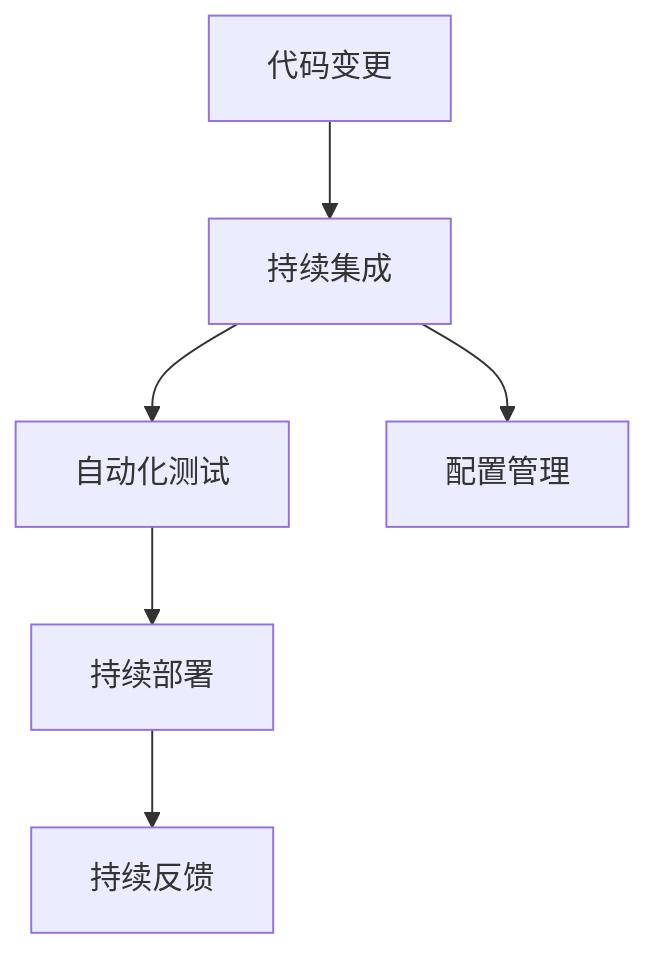

                 

# 软件2.0的持续集成与持续部署策略

> 关键词：持续集成(Continuous Integration, CI), 持续部署(Continuous Deployment, CD), DevOps, 自动化测试, 配置管理, 持续反馈

## 1. 背景介绍

### 1.1 问题由来
在传统软件开发模式中，开发者常常需要手把手将代码合并到主分支，然后进行手动测试和部署。这种手动流程存在诸多问题：

1. 版本冲突：多人协作时，代码版本控制混乱，难以合并。
2. 重复劳动：重复编写测试代码，耗时费力。
3. 错误延迟：代码质量参差不齐，集成后才发现问题，造成返工。
4. 沟通不畅：代码修改通知不及时，团队协作效率低下。
5. 部署缓慢：手动部署效率低，难以满足快速发布需求。

这些问题限制了软件开发的效率和质量，无法适应现代高频率发布、快速迭代的DevOps环境。因此，亟需引入更加高效、自动化的软件开发模式，即持续集成与持续部署。

### 1.2 问题核心关键点
持续集成(Continuous Integration, CI)与持续部署(Continuous Deployment, CD)的核心理念，是通过自动化工具链将软件开发生命周期的各个环节紧密衔接起来，确保代码质量、减少重复劳动、提升协作效率、加速发布周期。

具体而言，CI/CD的实现方式主要包括：
1. 代码变更自动化合并：通过Git等版本控制工具，实时监控代码变更，自动进行代码合并。
2. 自动化测试：对变更后的代码进行单元测试、集成测试、功能测试等，确保代码质量。
3. 配置管理：自动化处理环境配置、依赖安装等，确保一致性。
4. 自动化部署：将测试通过的代码自动部署到生产环境，发布新版本。
5. 持续反馈：通过日志、监控工具，实时收集代码运行情况，持续优化开发流程。

本文将详细介绍CI/CD的实现原理、具体操作步骤、优缺点及应用场景，并通过实际代码实例展示CI/CD的实践细节，最后总结未来趋势和面临的挑战。

## 2. 核心概念与联系

### 2.1 核心概念概述

为更好地理解CI/CD的核心概念及其关系，本节将介绍几个关键概念：

- **持续集成(Continuous Integration, CI)**：指频繁地将代码变更合并到主分支，并自动执行自动化测试流程。目的是通过频繁的合并和测试，尽早发现并解决集成问题，减少代码冲突和重复工作。

- **持续部署(Continuous Deployment, CD)**：指将通过测试的代码自动部署到生产环境的过程。目的是通过自动化的部署流程，快速、可靠地发布新功能，提升发布效率。

- **DevOps**：一种综合软件开发(Dev)和运维(Ops)的工作模式，强调团队协作、自动化、持续反馈。DevOps通过CI/CD实践，实现了从开发到运维的全程自动化。

- **自动化测试(Automatic Testing)**：指使用工具自动执行测试用例，对代码进行测试的过程。目的是通过自动化测试，确保代码质量，提升发布速度。

- **配置管理(Configuration Management)**：指自动化处理环境配置、依赖安装等，确保各个环境的一致性。目的是通过配置管理，简化部署过程，减少环境差异带来的问题。

- **持续反馈(Continuous Feedback)**：指通过日志、监控工具，实时收集代码运行情况，持续优化开发流程。目的是通过持续反馈，发现问题，及时调整。

这些核心概念之间的逻辑关系可以通过以下Mermaid流程图来展示：



这个流程图展示了这个生命周期中各个环节的衔接关系：

1. 代码变更触发CI过程。
2. CI执行自动化测试，并配置管理。
3. 测试通过后触发CD，自动部署到生产环境。
4. 持续反馈机制实时收集并优化整个过程。

## 3. 核心算法原理 & 具体操作步骤
### 3.1 算法原理概述

CI/CD的核心思想是自动化，通过一系列自动化工具和脚本，将软件的开发生命周期各个环节自动化衔接起来。其基本流程包括：

1. 代码变更监控：通过Git等版本控制工具，实时监控代码变更，并触发CI流程。
2. 自动化测试执行：对变更后的代码执行自动化测试，包括单元测试、集成测试、功能测试等。
3. 配置管理处理：自动处理环境配置、依赖安装等，确保一致性。
4. 自动化部署：将测试通过的代码自动部署到生产环境。
5. 持续反馈收集：通过日志、监控工具，实时收集代码运行情况，持续优化开发流程。

### 3.2 算法步骤详解

以下详细介绍CI/CD的基本操作流程：

**Step 1: 准备开发环境**

- **安装Git**：Git是最流行的版本控制工具，用于管理和追踪代码变更。
```bash
sudo apt-get update
sudo apt-get install git
```

- **配置Git**：初始化Git仓库，设置远程仓库地址。
```bash
git init
git remote add origin <remote-repo>
```

- **安装CI/CD工具**：安装Jenkins、Travis CI、GitLab CI等CI/CD工具，搭建CI/CD系统。
```bash
sudo apt-get install jenkins
```

**Step 2: 配置CI/CD系统**

- **安装插件**：为CI/CD工具安装必要的插件，如Git插件、Maven插件等。
- **配置脚本**：编写CI/CD脚本，定义CI/CD的工作流程。
```groovy
pipeline {
    agent any
    stages {
        stage('Build') {
            steps {
                sh 'mvn install'
            }
        }
        stage('Test') {
            steps {
                sh 'mvn test'
            }
        }
        stage('Deploy') {
            steps {
                sh 'mvn package'
                sh 'mvn deploy'
            }
        }
    }
}
```

- **启动CI/CD系统**：启动CI/CD系统，定时轮询Git仓库，触发CI流程。
```bash
sudo service jenkins start
```

**Step 3: 执行CI/CD流程**

- **代码变更**：开发者在本地修改代码，提交到Git仓库。
- **CI触发**：CI系统检测到代码变更，自动触发CI流程。
- **测试执行**：执行自动化测试脚本，检查代码质量。
- **反馈收集**：通过日志、监控工具，收集测试结果，并生成报告。
- **决策判断**：根据测试结果，自动部署或拒绝部署。

**Step 4: 自动化部署**

- **环境准备**：自动处理环境配置、依赖安装等。
- **代码部署**：将测试通过的代码自动部署到生产环境。
- **反馈循环**：持续收集部署后的日志和监控数据，持续优化部署过程。

### 3.3 算法优缺点

持续集成与持续部署具有以下优点：

1. **提高代码质量**：频繁的合并和测试，及早发现并解决集成问题，确保代码质量。
2. **减少重复劳动**：自动化执行测试和部署，减少手动操作，提升效率。
3. **提升协作效率**：自动化流程确保代码一致性，减少团队协作中的沟通成本。
4. **加快发布周期**：自动化的部署流程，提升发布速度和频率。
5. **持续反馈优化**：实时收集反馈信息，持续优化开发流程。

但同时也存在一些缺点：

1. **工具链复杂**：需要配置和管理多个CI/CD工具和插件。
2. **环境配置复杂**：不同环境配置不一致，可能导致部署问题。
3. **依赖管理困难**：不同项目之间的依赖关系复杂，可能引发版本冲突。
4. **调试困难**：自动化流程中可能存在隐藏问题，调试较为困难。
5. **成本较高**：配置和管理自动化工具链需要一定的时间和资源投入。

## 4. 数学模型和公式 & 详细讲解 & 举例说明

### 4.1 数学模型构建

本节将使用数学语言对CI/CD的过程进行严格刻画。

记代码变更事件为 $E$，持续集成流水线为 $P$，自动化测试为 $T$，配置管理为 $C$，持续部署为 $D$，持续反馈为 $F$。

设 $E$ 在时间 $t$ 发生，触发 CI 流程，流水线 $P$ 执行测试 $T$ 和配置管理 $C$，若测试通过，则部署 $D$，收集反馈 $F$。数学模型如下：

$$
\begin{aligned}
    E(t) &= \text{触发代码变更事件} \\
    P(t) &= \text{执行持续集成流程} \\
    T(t) &= \text{执行自动化测试} \\
    C(t) &= \text{执行配置管理} \\
    D(t) &= \text{执行持续部署} \\
    F(t) &= \text{收集持续反馈}
\end{aligned}
$$

### 4.2 公式推导过程

以下推导CI/CD系统中关键事件的顺序：

**Step 1: 代码变更事件 $E$**

- 代码变更 $E$ 触发CI流程 $P$。
$$
E(t) \rightarrow P(t)
$$

**Step 2: 持续集成流程 $P$**

- 执行自动化测试 $T$ 和配置管理 $C$。
$$
P(t) \rightarrow T(t), C(t)
$$

**Step 3: 自动化测试 $T$**

- 测试通过则触发部署 $D$。
$$
T(t) \rightarrow D(t)
$$

**Step 4: 持续部署 $D$**

- 收集反馈 $F$。
$$
D(t) \rightarrow F(t)
$$

**Step 5: 持续反馈 $F$**

- 根据反馈信息，持续优化CI/CD流程。
$$
F(t) \rightarrow \text{持续优化}
$$

### 4.3 案例分析与讲解

以下以Maven项目为例，展示如何使用Jenkins实现CI/CD。

**Step 1: 安装Jenkins**

- **安装Jenkins**：在服务器上安装Jenkins，创建Jenkins用户。
```bash
sudo apt-get install jenkins
sudo jenkins install-plugins hudson-modeljob
```

- **配置Jenkins**：启动Jenkins，配置系统参数，如JDK、Maven等。

**Step 2: 创建Jenkins项目**

- **配置源代码管理**：将Git仓库与Jenkins项目连接。
```groovy
pipeline {
    agent any
    stages {
        stage('Build') {
            steps {
                withCredentials([usernamePassword('git', 'your-email', 'your-password')]) {
                    sh 'mvn install'
                }
            }
        }
        stage('Test') {
            steps {
                sh 'mvn test'
            }
        }
        stage('Deploy') {
            steps {
                sh 'mvn package'
                sh 'mvn deploy'
            }
        }
    }
}
```

- **配置CI/CD脚本**：编写Jenkins脚本，定义CI/CD流程。

**Step 3: 启动Jenkins流程**

- **触发CI流程**：将本地代码变更推送到Git仓库，Jenkins自动触发CI流程。
- **执行测试**：执行Maven测试，检查代码质量。
- **收集反馈**：通过日志、监控工具，收集测试结果，并生成报告。
- **部署代码**：将测试通过的代码自动部署到生产环境。
- **持续优化**：根据反馈信息，持续优化CI/CD流程。

## 5. 项目实践：代码实例和详细解释说明
### 5.1 开发环境搭建

在进行CI/CD实践前，我们需要准备好开发环境。以下是使用Jenkins进行CI/CD开发的环境配置流程：

1. **安装Jenkins**：在服务器上安装Jenkins，配置系统参数。
```bash
sudo apt-get update
sudo apt-get install jenkins
```

2. **配置Jenkins**：启动Jenkins，配置系统参数，如JDK、Maven等。
```bash
sudo systemctl start jenkins
```

3. **创建Jenkins用户**：为Jenkins用户设置密码，并创建Jenkins项目。

4. **安装插件**：为Jenkins项目安装必要的插件，如Git插件、Maven插件等。
```bash
sudo apt-get install jenkins-plugins
```

完成上述步骤后，即可在服务器上搭建CI/CD系统。

### 5.2 源代码详细实现

下面我们以Maven项目为例，给出使用Jenkins实现CI/CD的PyTorch代码实现。

首先，定义Maven项目的CI/CD脚本：

```groovy
pipeline {
    agent any
    stages {
        stage('Build') {
            steps {
                withCredentials([usernamePassword('git', 'your-email', 'your-password')]) {
                    sh 'mvn install'
                }
            }
        }
        stage('Test') {
            steps {
                sh 'mvn test'
            }
        }
        stage('Deploy') {
            steps {
                sh 'mvn package'
                sh 'mvn deploy'
            }
        }
    }
}
```

然后，定义Jenkins项目：

```bash
sudo nano /etc/apt/sources.list
sudo apt-get update
sudo apt-get install jenkins
sudo systemctl start jenkins
sudo systemctl enable jenkins
```

最后，启动Jenkins流程：

```bash
sudo jenkins systemctl start
```

### 5.3 代码解读与分析

让我们再详细解读一下关键代码的实现细节：

**Jenkins项目定义**：
- **stage 'Build'**：执行Maven安装，构建项目。
- **stage 'Test'**：执行Maven测试，检查代码质量。
- **stage 'Deploy'**：执行Maven打包和部署，将代码发布到生产环境。

**Jenkins插件配置**：
- **Git插件**：将Git仓库与Jenkins项目连接。
- **Maven插件**：配置Maven环境，自动执行Maven任务。

**Jenkins脚本编写**：
- **withCredentials**：设置Git用户的凭证。
- **sh**：执行shell命令，如Maven任务。

通过Jenkins的配置和管理，我们可以实现Maven项目的持续集成和持续部署。开发者只需要将本地代码推送到Git仓库，Jenkins自动触发CI流程，执行测试和部署，大大提升了开发效率和代码质量。

当然，工业级的系统实现还需考虑更多因素，如多项目管理、分布式构建、多环境部署等。但核心的CI/CD流程基本与此类似。

## 6. 实际应用场景

### 6.1 软件开发

持续集成与持续部署在软件开发中得到了广泛应用。传统的开发流程中，开发者需要手动合并代码、手动测试、手动部署，耗时费力。引入CI/CD后，自动化流程大大提升了开发效率和代码质量。

**具体实现**：
- **代码变更监控**：使用Git监控代码变更。
- **自动化测试**：执行单元测试、集成测试、功能测试等。
- **自动化部署**：将测试通过的代码自动部署到生产环境。
- **持续反馈**：通过日志、监控工具，收集代码运行情况，持续优化开发流程。

### 6.2 持续交付

持续交付与持续部署类似，但强调了发布前的自动化测试和质量保证。在持续交付流程中，通过自动化测试和部署，确保每次发布的新版本都稳定可靠。

**具体实现**：
- **代码变更监控**：使用Git监控代码变更。
- **自动化测试**：执行单元测试、集成测试、功能测试等。
- **自动化部署**：将测试通过的代码自动部署到生产环境。
- **持续反馈**：通过日志、监控工具，收集代码运行情况，持续优化开发流程。

### 6.3 云计算平台

在云计算平台中，持续集成与持续部署同样重要。通过CI/CD流程，确保新功能和应用的快速发布和部署，提升云平台的服务质量和用户体验。

**具体实现**：
- **代码变更监控**：使用Git监控代码变更。
- **自动化测试**：执行单元测试、集成测试、功能测试等。
- **自动化部署**：将测试通过的代码自动部署到云平台。
- **持续反馈**：通过日志、监控工具，收集代码运行情况，持续优化部署流程。

## 7. 工具和资源推荐
### 7.1 学习资源推荐

为了帮助开发者系统掌握CI/CD的理论基础和实践技巧，这里推荐一些优质的学习资源：

1. **《Continuous Integration: From Principles to Practice》**：从原理到实践，全面介绍了CI/CD的实现方法，推荐阅读。
2. **《The DevOps Handbook》**：全面介绍了DevOps的实践和工具，涵盖CI/CD在内的诸多方面，建议阅读。
3. **《Continuous Integration: A Practical Introduction》**：实用的CI/CD入门指南，涵盖具体工具和实践方法，推荐学习。
4. **《Mastering Jenkins: How to Build, Test, Deploy and Automate with Confidence》**：详细讲解Jenkins的配置和管理方法，建议阅读。
5. **《CI/CD for Docker Containers》**：讲解如何使用CI/CD实现Docker容器的自动化部署和管理，建议学习。

通过对这些资源的学习实践，相信你一定能够快速掌握CI/CD的精髓，并用于解决实际的开发问题。

### 7.2 开发工具推荐

高效的开发离不开优秀的工具支持。以下是几款用于CI/CD开发的常用工具：

1. **Jenkins**：最流行的开源CI/CD工具，功能丰富，支持多语言、多平台。
2. **GitLab CI**：集成在GitLab中的CI/CD工具，支持持续交付、测试、部署。
3. **Travis CI**：基于云的CI/CD工具，支持多种编程语言，易于配置。
4. **Jenkins Pipeline**：Jenkins的插件，支持流水线脚本编写，易于实现复杂流程。
5. **CircleCI**：基于云的CI/CD工具，支持持续交付、测试、部署。
6. **Docker**：容器化技术，支持自动构建和部署，提高部署效率。

合理利用这些工具，可以显著提升CI/CD任务的开发效率，加快创新迭代的步伐。

### 7.3 相关论文推荐

CI/CD技术的发展源于学界的持续研究。以下是几篇奠基性的相关论文，推荐阅读：

1. **Continuous Integration: Overview and Survey**：回顾了CI/CD的发展历程和实践方法，推荐阅读。
2. **Continuous Integration: A Survey**：全面介绍了CI/CD的应用场景和技术实现，建议阅读。
3. **The DevOps Handbook**：全面介绍了DevOps的实践和工具，涵盖CI/CD在内的诸多方面，建议阅读。
4. **CI/CD for Docker Containers**：讲解了如何使用CI/CD实现Docker容器的自动化部署和管理，建议学习。
5. **Continuous Deployment in Practice**：介绍了持续部署的实现方法和最佳实践，建议阅读。

这些论文代表了大语言模型微调技术的发展脉络。通过学习这些前沿成果，可以帮助研究者把握学科前进方向，激发更多的创新灵感。

## 8. 总结：未来发展趋势与挑战

### 8.1 总结

本文对持续集成与持续部署的实现原理、具体操作步骤、优缺点及应用场景进行了全面系统的介绍。首先阐述了CI/CD的理论基础和基本流程，明确了CI/CD在提升开发效率和代码质量方面的独特价值。其次，从原理到实践，详细讲解了CI/CD的数学模型和具体操作步骤，给出了CI/CD任务开发的完整代码实例。同时，本文还广泛探讨了CI/CD在软件开发、持续交付、云计算平台等多个领域的应用前景，展示了CI/CD范式的巨大潜力。此外，本文精选了CI/CD技术的各类学习资源，力求为读者提供全方位的技术指引。

通过本文的系统梳理，可以看到，持续集成与持续部署技术正在成为软件开发的重要范式，极大地拓展了软件开发的效率和质量，催生了更多的落地场景。受益于自动化工具链和自动化测试的支撑，CI/CD方法在从开发到运维的各个环节中，都实现了全面的自动化，为软件开发带来了革命性变革。未来，伴随持续集成与持续交付的不断发展，软件开发的自动化程度将进一步提升，进一步缩短开发周期，提升软件质量。

### 8.2 未来发展趋势

展望未来，持续集成与持续部署技术将呈现以下几个发展趋势：

1. **工具链多样化**：未来的CI/CD工具链将更加多样化，涵盖更多开源工具和商业解决方案，满足不同企业的具体需求。

2. **云化趋势明显**：越来越多的CI/CD流程将基于云平台实现，支持弹性扩展、自动扩缩容等功能。

3. **自动化测试提升**：自动化测试将覆盖更多测试场景，从单元测试到端到端测试，提升代码质量。

4. **持续反馈机制完善**：通过大数据分析、机器学习等技术，提升持续反馈的准确性和实时性。

5. **持续交付成熟**：持续交付将更加关注用户反馈，实现快速迭代、快速交付。

6. **DevOps文化普及**：DevOps文化将进一步普及，提升企业内部的协作效率和开发效率。

以上趋势凸显了CI/CD技术的广阔前景。这些方向的探索发展，必将进一步提升软件开发和交付的效率和质量，为软件开发和企业运营带来深刻变革。

### 8.3 面临的挑战

尽管持续集成与持续部署技术已经取得了瞩目成就，但在迈向更加智能化、普适化应用的过程中，它仍面临诸多挑战：

1. **工具链复杂性**：随着工具链的复杂度增加，维护和配置难度也将增加。

2. **环境一致性**：不同环境配置不一致，可能导致部署问题。

3. **依赖管理困难**：不同项目之间的依赖关系复杂，可能引发版本冲突。

4. **调试困难**：自动化流程中可能存在隐藏问题，调试较为困难。

5. **成本较高**：配置和管理自动化工具链需要一定的时间和资源投入。

6. **安全问题**：自动化流程中可能存在安全隐患，需要加强安全防护。

7. **用户接受度**：部分团队可能对CI/CD接受度不高，需要更多教育和引导。

正视CI/CD面临的这些挑战，积极应对并寻求突破，将使CI/CD技术不断完善，进一步提升软件开发和交付的效率和质量。

### 8.4 研究展望

面对CI/CD面临的种种挑战，未来的研究需要在以下几个方面寻求新的突破：

1. **工具链简化**：开发更易用、易配置的CI/CD工具，降低使用门槛。

2. **环境一致性**：采用容器化技术，简化环境配置，提高环境一致性。

3. **依赖管理优化**：开发更智能的依赖管理工具，减少版本冲突。

4. **调试机制完善**：引入更智能的调试工具，提升自动化流程的可靠性。

5. **成本降低**：优化工具链配置，降低维护成本。

6. **安全防护加强**：引入更严格的安全防护机制，确保自动化流程的安全性。

7. **用户接受度提升**：通过教育和培训，提升团队对CI/CD的接受度和使用率。

这些研究方向的探索，必将引领CI/CD技术迈向更高的台阶，为软件开发和交付带来更深远的影响。

## 9. 附录：常见问题与解答

**Q1: 持续集成与持续部署的优缺点是什么？**

A: 持续集成与持续部署具有以下优点：
- 提高代码质量：频繁的合并和测试，及早发现并解决集成问题。
- 减少重复劳动：自动化执行测试和部署，减少手动操作。
- 提升协作效率：自动化流程确保代码一致性，减少团队协作中的沟通成本。
- 加快发布周期：自动化的部署流程，提升发布速度和频率。
- 持续反馈优化：实时收集反馈信息，持续优化开发流程。

但同时也存在一些缺点：
- 工具链复杂：需要配置和管理多个CI/CD工具和插件。
- 环境配置复杂：不同环境配置不一致，可能导致部署问题。
- 依赖管理困难：不同项目之间的依赖关系复杂，可能引发版本冲突。
- 调试困难：自动化流程中可能存在隐藏问题，调试较为困难。
- 成本较高：配置和管理自动化工具链需要一定的时间和资源投入。

**Q2: 如何选择合适的持续集成和持续部署工具？**

A: 选择CI/CD工具应考虑以下因素：
- 项目规模：选择能够满足项目规模的工具，如小项目可以选择简单的工具，大项目则需要功能丰富的工具。
- 团队需求：选择易用、易配置的工具，降低使用门槛。
- 技术栈：选择支持常用技术栈的工具，如Maven、Docker等。
- 云平台：选择支持云平台部署的工具，实现弹性扩展、自动扩缩容。
- 安全性：选择具有良好安全防护机制的工具，保障数据和代码的安全性。

**Q3: 如何优化持续集成和持续部署流程？**

A: 优化CI/CD流程应考虑以下方法：
- 简化工具链：采用容器化技术，简化环境配置，提高环境一致性。
- 依赖管理优化：开发更智能的依赖管理工具，减少版本冲突。
- 调试机制完善：引入更智能的调试工具，提升自动化流程的可靠性。
- 成本降低：优化工具链配置，降低维护成本。
- 安全防护加强：引入更严格的安全防护机制，确保自动化流程的安全性。

通过这些方法，可以不断优化CI/CD流程，提升软件开发和交付的效率和质量。

**Q4: 持续集成与持续部署的未来趋势是什么？**

A: 持续集成与持续部署技术将呈现以下发展趋势：
- 工具链多样化：未来的CI/CD工具链将更加多样化，涵盖更多开源工具和商业解决方案。
- 云化趋势明显：越来越多的CI/CD流程将基于云平台实现，支持弹性扩展、自动扩缩容。
- 自动化测试提升：自动化测试将覆盖更多测试场景，从单元测试到端到端测试，提升代码质量。
- 持续反馈机制完善：通过大数据分析、机器学习等技术，提升持续反馈的准确性和实时性。
- 持续交付成熟：持续交付将更加关注用户反馈，实现快速迭代、快速交付。
- DevOps文化普及：DevOps文化将进一步普及，提升企业内部的协作效率和开发效率。

以上趋势凸显了CI/CD技术的广阔前景，这些方向的探索发展，必将进一步提升软件开发和交付的效率和质量。

**Q5: 持续集成与持续部署的未来展望是什么？**

A: 持续集成与持续部署技术将不断成熟，未来展望如下：
- 工具链简化：开发更易用、易配置的CI/CD工具，降低使用门槛。
- 环境一致性：采用容器化技术，简化环境配置，提高环境一致性。
- 依赖管理优化：开发更智能的依赖管理工具，减少版本冲突。
- 调试机制完善：引入更智能的调试工具，提升自动化流程的可靠性。
- 成本降低：优化工具链配置，降低维护成本。
- 安全防护加强：引入更严格的安全防护机制，确保自动化流程的安全性。
- 用户接受度提升：通过教育和培训，提升团队对CI/CD的接受度和使用率。

这些研究方向的探索，必将引领CI/CD技术迈向更高的台阶，为软件开发和交付带来更深远的影响。

---

作者：禅与计算机程序设计艺术 / Zen and the Art of Computer Programming

