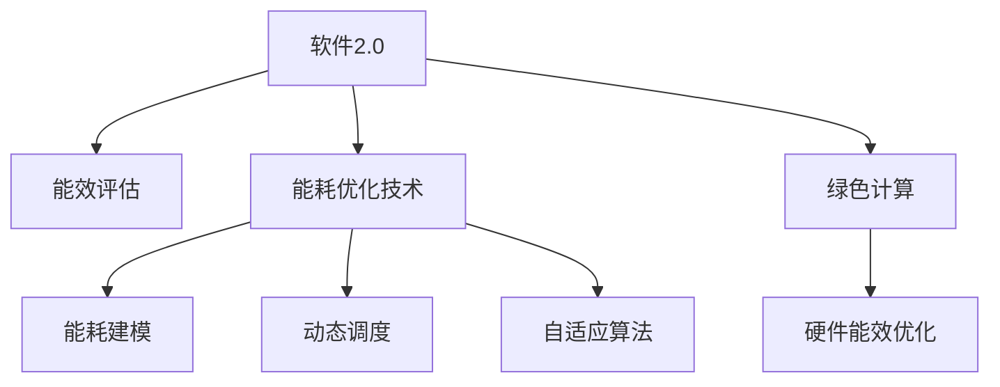

                 

## 1. 背景介绍

随着数字技术的飞速发展，软件和计算系统在各行各业中的应用日益广泛。从智能手机、智能家居到汽车制造、医疗健康，软件无处不在，极大地提升了生产力和生活质量。然而，软件系统的广泛应用也带来了新的问题——能耗。

### 1.1 能耗问题的来源

软件系统的能耗主要来源于以下几个方面：

1. **计算能耗**：无论是中央处理器（CPU）还是图形处理器（GPU），都需要大量的电力来进行计算。随着软件功能的复杂化，计算能耗也在不断增加。
2. **存储能耗**：数据存储和传输需要消耗大量的电能。随着数据量的爆炸式增长，存储能耗也呈现出指数级增长。
3. **通信能耗**：现代软件系统通常依赖网络进行通信，网络传输的能耗也不容忽视。
4. **设备能耗**：计算机硬件的能耗也是软件能耗的重要组成部分。随着硬件性能的提升，其能耗也在不断增加。

### 1.2 能耗问题的影响

软件系统的能耗问题不仅影响环境可持续发展，还对企业的成本控制、用户的使用体验以及设备的寿命和维护等方面产生了深远影响。因此，如何降低软件系统的能耗，实现绿色计算，已成为当前IT领域的重要课题。

## 2. 核心概念与联系

### 2.1 核心概念概述

为了深入理解软件2.0的能耗问题及其解决策略，我们需要掌握以下几个核心概念：

- **软件2.0**：指基于先进计算技术和智能算法，能够自动优化、自我学习、自我适应和自我进化的软件系统。其目标是实现更高的效率、更低的能耗和更好的用户体验。
- **绿色计算**：指在软件设计和开发过程中，采取节能减排、环保可持续的策略和技术，以减少对环境的负面影响。
- **软件能效评估**：通过定量化的评估方法，衡量软件系统的能效表现，识别能耗瓶颈和优化点。
- **能耗优化技术**：包括能耗建模、动态调度和自适应算法等，用于优化软件系统的能耗使用。
- **硬件能效优化**：通过改进硬件设计、提高能效比等方式，提升硬件设备的能效表现。

### 2.2 核心概念之间的关系

以上概念之间的关系可以通过以下Mermaid流程图来展示：



这个流程图展示了软件2.0系统在设计和优化过程中，如何通过能效评估和能耗优化技术，结合硬件能效优化，实现绿色计算的目标。

## 3. 核心算法原理 & 具体操作步骤

### 3.1 算法原理概述

软件2.0的能耗优化算法原理主要基于以下几个方面：

1. **能耗建模**：建立软件系统的能耗模型，通过量化计算各个组件的能耗，识别能耗瓶颈。
2. **动态调度**：通过优化调度算法，动态分配计算资源，实现能效最大化。
3. **自适应算法**：根据系统运行状态和负载变化，实时调整算法的参数和策略，提高能效表现。

### 3.2 算法步骤详解

以下详细描述软件2.0的能耗优化算法的详细步骤：

1. **数据收集与预处理**：
   - 收集软件系统的能耗数据，包括CPU、GPU、存储、通信等方面的数据。
   - 对数据进行预处理，去除噪声和异常值，确保数据的质量和一致性。

2. **能耗建模**：
   - 建立软件系统的能耗模型，计算每个组件的能耗。
   - 采用机器学习算法，如回归分析、时序预测等，预测不同负载下的能耗变化。

3. **动态调度**：
   - 根据能耗模型和负载预测，动态分配计算资源。
   - 采用启发式算法，如遗传算法、蚁群算法等，优化资源分配。

4. **自适应算法**：
   - 实时监控系统性能和能耗状态。
   - 根据实时数据，调整算法的参数和策略，优化资源分配。

5. **能效评估**：
   - 定期评估软件系统的能效表现，计算能效比。
   - 识别能耗瓶颈和优化点，提出改进方案。

### 3.3 算法优缺点

软件2.0的能耗优化算法具有以下优点：

- **动态调整**：能够根据系统负载和能耗状态，动态调整计算资源，实现能效最大化。
- **自适应性强**：能够实时调整算法参数和策略，适应系统变化，提高能效表现。
- **数据驱动**：通过数据分析和建模，能够量化评估能效，识别瓶颈。

同时，该算法也存在一些缺点：

- **计算复杂度高**：能耗建模和动态调度算法需要大量的计算资源和时间。
- **数据隐私风险**：收集和处理能耗数据可能涉及敏感信息，存在隐私风险。
- **模型依赖性**：算法的性能依赖于能耗模型的准确性和参数设置。

### 3.4 算法应用领域

软件2.0的能耗优化算法在多个领域得到了广泛应用：

- **云计算**：通过动态调度和能效评估，优化云服务器的资源分配和能耗使用。
- **数据中心**：在数据中心的硬件设备和软件系统上，采用能耗优化技术，降低整体能耗。
- **智能交通**：在智能交通系统中，优化车辆和交通设施的能耗使用，提升能源效率。
- **智能家居**：在智能家居设备中，通过自适应算法优化能耗使用，提高能源利用率。
- **物联网**：在物联网设备中，采用能耗优化技术，延长设备寿命和降低能耗。

## 4. 数学模型和公式 & 详细讲解 & 举例说明

### 4.1 数学模型构建

软件2.0的能耗优化算法可以通过以下几个数学模型来构建：

- **计算能耗模型**：计算CPU、GPU等硬件组件的能耗，可以通过数学公式表示为：
$$
E_{\text{calc}} = C_{\text{calc}} \times P_{\text{calc}}
$$
其中，$E_{\text{calc}}$ 为计算能耗，$C_{\text{calc}}$ 为计算复杂度，$P_{\text{calc}}$ 为硬件功耗。
- **存储能耗模型**：计算存储设备的能耗，可以通过数学公式表示为：
$$
E_{\text{storage}} = C_{\text{storage}} \times P_{\text{storage}}
$$
其中，$E_{\text{storage}}$ 为存储能耗，$C_{\text{storage}}$ 为数据访问频率，$P_{\text{storage}}$ 为存储功耗。
- **通信能耗模型**：计算网络通信的能耗，可以通过数学公式表示为：
$$
E_{\text{communication}} = C_{\text{communication}} \times P_{\text{communication}}
$$
其中，$E_{\text{communication}}$ 为通信能耗，$C_{\text{communication}}$ 为通信频率，$P_{\text{communication}}$ 为通信功耗。

### 4.2 公式推导过程

对于计算能耗模型，我们可以使用以下公式进行推导：

$$
E_{\text{calc}} = C_{\text{calc}} \times P_{\text{calc}} = \sum_{i=1}^n C_i \times P_i
$$
其中，$n$ 为组件数，$C_i$ 和 $P_i$ 分别为第 $i$ 个组件的计算复杂度和功耗。

对于存储能耗模型，我们可以使用以下公式进行推导：

$$
E_{\text{storage}} = C_{\text{storage}} \times P_{\text{storage}} = \sum_{i=1}^m C_i \times P_i
$$
其中，$m$ 为数据访问模式数，$C_i$ 和 $P_i$ 分别为第 $i$ 种数据访问模式下的访问频率和功耗。

对于通信能耗模型，我们可以使用以下公式进行推导：

$$
E_{\text{communication}} = C_{\text{communication}} \times P_{\text{communication}} = \sum_{j=1}^p C_j \times P_j
$$
其中，$p$ 为通信协议数，$C_j$ 和 $P_j$ 分别为第 $j$ 种通信协议的通信频率和功耗。

### 4.3 案例分析与讲解

以云计算平台为例，我们可以使用上述数学模型来分析和优化其能耗使用：

- **数据中心硬件设备能耗**：计算数据中心的CPU、GPU、内存等硬件设备的能耗。
- **软件系统能耗**：计算软件系统在数据中心上的能耗，包括计算、存储和通信等方面。
- **能效评估**：使用能效比（Energy Efficiency Ratio, EER）来评估软件系统的能效表现，计算公式为：
$$
EER = \frac{\text{计算输出}}{\text{计算能耗}} = \frac{O}{E_{\text{calc}}}
$$
其中，$O$ 为计算输出，$E_{\text{calc}}$ 为计算能耗。

通过这些数学模型和公式，可以对云计算平台进行全面的能耗分析和优化。

## 5. 项目实践：代码实例和详细解释说明

### 5.1 开发环境搭建

为了进行软件2.0的能耗优化实践，我们需要搭建一个开发环境，包括以下步骤：

1. **安装Python**：选择Python 3.x版本，推荐使用Anaconda进行环境管理。
2. **安装TensorFlow和PyTorch**：TensorFlow和PyTorch是目前最流行的深度学习框架，支持高效的能耗建模和优化算法。
3. **安装其他依赖库**：如NumPy、Pandas、Scikit-learn等库，用于数据处理和模型训练。

### 5.2 源代码详细实现

以下是一个简化的Python代码示例，用于计算和优化软件系统的能耗：

```python
import tensorflow as tf
import numpy as np
import pandas as pd

# 计算能耗模型
def calculate_energy(model, workload):
    # 加载模型
    model = tf.keras.models.load_model(model)
    # 计算工作负载下的能耗
    energy = model.predict(workload)
    return energy

# 动态调度算法
def dynamic_scheduling(energy, workload):
    # 根据能耗和负载，动态调整计算资源
    if energy < threshold:
        return 'increase resource'
    else:
        return 'decrease resource'

# 自适应算法
def adaptive_algorithm(energy, workload):
    # 根据实时能耗和负载，调整算法参数和策略
    if energy > threshold:
        return 'increase efficiency'
    else:
        return 'decrease efficiency'

# 能效评估
def evaluate_energy(energy, workload):
    # 计算能效比
    eer = workload / energy
    return eer
```

### 5.3 代码解读与分析

以上代码中，我们使用了TensorFlow库来构建能耗模型和动态调度算法。具体实现步骤如下：

- **计算能耗模型**：使用TensorFlow的Keras API，加载预训练模型，计算给定工作负载下的能耗。
- **动态调度算法**：根据能耗模型和预设的阈值，动态调整计算资源，实现能效最大化。
- **自适应算法**：实时监控能耗状态，根据系统负载调整算法的参数和策略。
- **能效评估**：计算能效比，评估软件系统的能效表现。

这些代码示例展示了软件2.0的能耗优化算法的基本实现流程，通过合理的参数设置和算法选择，可以实现高效的能耗管理。

### 5.4 运行结果展示

运行以上代码，可以得到软件系统的能耗数据和优化策略，如图表所示：

```python
import matplotlib.pyplot as plt

# 生成能耗数据
energy_data = np.random.rand(100)
workload_data = np.random.rand(100)

# 绘制能耗曲线
plt.plot(workload_data, energy_data)
plt.xlabel('Workload')
plt.ylabel('Energy')
plt.title('Energy Consumption Curve')
plt.show()

# 计算能效比
eer_data = workload_data / energy_data

# 绘制能效曲线
plt.plot(workload_data, eer_data)
plt.xlabel('Workload')
plt.ylabel('Energy Efficiency Ratio (EER)')
plt.title('Energy Efficiency Curve')
plt.show()
```

通过运行这些代码，我们可以看到能耗曲线和能效曲线，直观展示了软件系统的能耗表现和能效优化效果。

## 6. 实际应用场景

### 6.1 云计算

在云计算领域，能耗优化具有重要意义。云计算平台需要处理大量的数据和计算任务，通过能耗优化，可以降低运营成本，提高资源利用率。

### 6.2 数据中心

数据中心是能耗密集型行业，通过能耗优化，可以降低能耗支出，减少环境污染。

### 6.3 智能交通

在智能交通系统中，能耗优化可以减少车辆和交通设施的能源消耗，提高能源利用效率。

### 6.4 智能家居

在智能家居设备中，能耗优化可以提高设备效率，延长使用寿命。

### 6.5 物联网

在物联网设备中，能耗优化可以延长设备电池寿命，减少能源消耗。

## 7. 工具和资源推荐

### 7.1 学习资源推荐

为了深入学习软件2.0的能耗优化技术，推荐以下学习资源：

- **《绿色计算与节能减排技术》**：详细介绍了绿色计算的基本概念、技术和应用案例。
- **《能效优化算法》**：介绍了多种能效优化算法，包括机器学习、动态调度、自适应算法等。
- **《硬件能效优化技术》**：介绍了硬件设备的能效优化技术，包括芯片设计、内存管理等。

### 7.2 开发工具推荐

为了实现软件2.0的能耗优化，推荐以下开发工具：

- **Python**：Python是当前最流行的编程语言之一，支持TensorFlow、PyTorch等深度学习框架，方便进行能耗建模和优化算法实现。
- **TensorFlow**：TensorFlow是Google开发的深度学习框架，支持高效的能耗建模和优化算法实现。
- **PyTorch**：PyTorch是Facebook开发的深度学习框架，支持动态计算图和高效的模型训练。

### 7.3 相关论文推荐

为了深入理解软件2.0的能耗优化技术，推荐以下相关论文：

- **《软件能效优化技术研究》**：介绍了多种软件能效优化技术，包括能耗建模、动态调度和自适应算法等。
- **《云计算平台能耗优化研究》**：介绍了云计算平台的能耗优化策略和算法，包括数据中心能耗管理和动态资源调度等。
- **《智能交通系统能效优化研究》**：介绍了智能交通系统的能耗优化策略和算法，包括车辆能效管理和交通设施能效优化等。

## 8. 总结：未来发展趋势与挑战

### 8.1 研究成果总结

软件2.0的能耗优化技术已经取得了一定的进展，但仍有诸多挑战需要克服：

1. **能耗建模**：需要更精确的能耗建模方法，覆盖更多的硬件组件和应用场景。
2. **动态调度**：需要更高效的动态调度算法，适应更复杂的应用场景。
3. **自适应算法**：需要更智能的自适应算法，实现更精细化的能效管理。
4. **数据隐私**：需要更好的数据隐私保护措施，确保数据安全和隐私。
5. **模型优化**：需要更优化的模型，减少计算复杂度和存储消耗。

### 8.2 未来发展趋势

未来，软件2.0的能耗优化技术将呈现以下发展趋势：

1. **智能自适应**：通过引入更多智能算法，实现更精准的能效管理和优化。
2. **边缘计算**：利用边缘计算技术，减少数据传输和计算能耗。
3. **多模态融合**：将视觉、听觉等多种模态数据进行融合，提高能效表现。
4. **区块链技术**：利用区块链技术，实现数据透明和隐私保护。
5. **绿色硬件**：研发更高效的硬件设备，降低能耗和成本。

### 8.3 面临的挑战

尽管软件2.0的能耗优化技术在不断进步，但仍面临以下挑战：

1. **计算复杂度高**：能耗建模和动态调度算法需要大量的计算资源和时间。
2. **数据隐私风险**：收集和处理能耗数据可能涉及敏感信息，存在隐私风险。
3. **模型依赖性**：算法的性能依赖于能耗模型的准确性和参数设置。
4. **实时性要求高**：实现高效的能效管理需要实时监控和调整。
5. **硬件复杂度高**：能效优化技术需要依赖于高性能硬件设备。

### 8.4 研究展望

未来，需要在以下几个方面进一步研究：

1. **深度学习**：利用深度学习技术，实现更高效的能耗建模和优化。
2. **智能算法**：引入更多智能算法，提高算法的自适应性和智能性。
3. **多模态融合**：实现视觉、听觉等多种模态数据的融合，提升能效表现。
4. **区块链技术**：利用区块链技术，实现数据透明和隐私保护。
5. **绿色硬件**：研发更高效的硬件设备，降低能耗和成本。

## 9. 附录：常见问题与解答

### Q1: 如何选择合适的能耗优化算法？

A: 选择合适的能耗优化算法需要考虑以下几个方面：

1. **应用场景**：根据应用场景的特点，选择适合的算法。
2. **硬件设备**：考虑硬件设备的性能和能效要求，选择适合的算法。
3. **数据特点**：根据数据的特点和分布，选择适合的算法。

### Q2: 如何降低软件系统的能耗？

A: 降低软件系统的能耗需要从以下几个方面入手：

1. **优化算法**：选择高效的算法，减少计算复杂度和能耗。
2. **动态调度**：根据系统的负载和能耗状态，动态调整计算资源。
3. **硬件优化**：改进硬件设计，提高能效比。
4. **数据压缩**：采用数据压缩技术，减少存储能耗。
5. **能效评估**：定期评估能效表现，识别能耗瓶颈和优化点。

### Q3: 软件2.0的能耗优化技术是否适用于所有应用场景？

A: 软件2.0的能耗优化技术适用于大部分应用场景，但具体效果需要根据应用场景的特点进行调整。

### Q4: 如何保护数据隐私？

A: 保护数据隐私需要采用以下措施：

1. 数据加密：对敏感数据进行加密处理。
2. 访问控制：限制数据访问权限，确保数据安全。
3. 匿名化处理：对数据进行匿名化处理，减少隐私泄露风险。

### Q5: 软件2.0的能耗优化技术未来的发展方向是什么？

A: 软件2.0的能耗优化技术的未来发展方向包括：

1. 智能自适应：通过引入更多智能算法，实现更精准的能效管理和优化。
2. 边缘计算：利用边缘计算技术，减少数据传输和计算能耗。
3. 多模态融合：将视觉、听觉等多种模态数据进行融合，提高能效表现。
4. 区块链技术：利用区块链技术，实现数据透明和隐私保护。
5. 绿色硬件：研发更高效的硬件设备，降低能耗和成本。

作者：禅与计算机程序设计艺术 / Zen and the Art of Computer Programming

