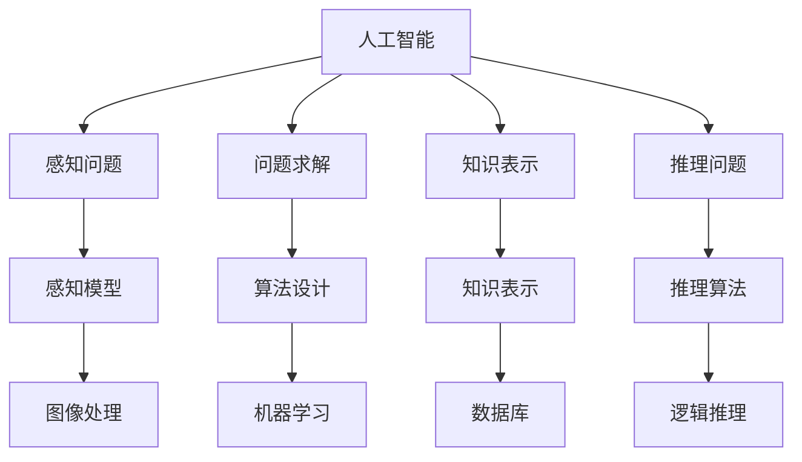

                 

# 达特茅斯会议的研究议题

> 关键词：人工智能, 图灵奖, 计算复杂性, 算法设计, 机器学习, 数据科学

## 1. 背景介绍

### 1.1 问题由来
1956年夏天，在新罕布什尔州达特茅斯学院，一场汇聚了当时最优秀计算机科学家、数学家、心理学家和哲学家的研讨会隆重举行。这场研讨会吸引了包括约翰·麦卡锡、马文·明斯基、克劳德·香农和纳撒尼尔·罗切斯特在内的顶级学者，标志着人工智能(AI)作为一个独立学科的诞生。在这次会议上，“人工智能”一词被首次提出，并为后续几十年的人工智能研究奠定了基础。

### 1.2 问题核心关键点
达特茅斯会议的研究议题集中在如何使计算机模拟人的智能行为。当时，与会者就以下四个核心问题进行了讨论：

1. **感知问题**：如何让计算机具备感知能力，理解自然语言和视觉信息。
2. **问题求解**：计算机如何模拟人类的推理和判断，解决复杂问题。
3. **知识表示**：如何建立合理的知识结构，使计算机能够存储和操作知识。
4. **推理问题**：计算机如何从已有的知识中推导出新的结论。

这些议题涵盖了人工智能研究的核心领域，对后续AI发展产生了深远影响。

## 2. 核心概念与联系

### 2.1 核心概念概述

达特茅斯会议提出的核心概念为人工智能的发展提供了重要指导。

- **人工智能**：使用计算机来模拟人类智能行为，实现感知、学习、推理等功能。
- **图灵测试**：提出判断机器是否具有智能的标准，即是否能通过图灵测试。
- **认知自动化**：通过人工智能技术实现任务自动化，提升效率。
- **计算机科学**：将人工智能的研究建立在坚实的数学和计算机科学基础上。

### 2.2 核心概念原理和架构的 Mermaid 流程图



## 3. 核心算法原理 & 具体操作步骤

### 3.1 算法原理概述

达特茅斯会议期间讨论的核心算法原理包括以下几个方面：

- **感知模型**：使用传感器和信号处理技术，让计算机能够感知周围环境，处理视觉、听觉、触觉等信息。
- **问题求解算法**：设计高效的算法，使计算机能够通过已有知识解决复杂问题，如搜索、启发式算法、优化算法等。
- **知识表示**：开发符号化语言、知识图谱等工具，使计算机能够表示和操作知识。
- **推理算法**：构建逻辑推理、概率推理等方法，使计算机能够进行推理和决策。

### 3.2 算法步骤详解

**步骤1：感知与输入处理**
- 设计传感器和信号处理模块，将环境信息转换为计算机可处理的信号。
- 使用感知模型处理信号，提取关键特征，如边缘检测、声音识别等。

**步骤2：知识表示与存储**
- 开发符号化语言，如Prolog、LISP等，用于表示和操作知识。
- 建立知识库和数据库，存储结构化和非结构化知识，如规则、事实等。

**步骤3：推理与决策**
- 构建推理引擎，如Prolog解释器、逻辑推理器等，根据已知知识进行推理。
- 设计决策算法，如决策树、贝叶斯网络等，帮助计算机做出决策。

**步骤4：模型训练与优化**
- 使用监督学习和无监督学习方法，训练感知模型和推理算法。
- 应用强化学习等方法，优化问题求解算法，提高效率和准确性。

### 3.3 算法优缺点

**优点**：
- **通用性强**：基于符号化和逻辑推理的方法适用于各种任务，具有较强的普适性。
- **精确度高**：通过规则和推理进行决策，具有高准确性和可解释性。
- **理论基础坚实**：建立在数学和逻辑基础上，具有坚实的理论基础。

**缺点**：
- **计算复杂度高**：符号化和逻辑推理的计算复杂度较高，限制了应用范围。
- **数据依赖性强**：需要大量结构化数据支持，难以处理大规模非结构化数据。
- **可扩展性差**：符号化方法难以处理动态变化的数据，可扩展性较差。

### 3.4 算法应用领域

达特茅斯会议提出的算法原理，在后续几十年中被广泛应用到各个领域，如：

- **自然语言处理**：使用符号化和逻辑推理处理自然语言信息，如文本分类、机器翻译等。
- **计算机视觉**：使用感知模型处理图像信息，进行目标检测、图像分割等。
- **机器人学**：使用感知和推理技术，实现机器人导航、任务规划等。
- **知识管理**：构建知识图谱，进行知识发现和推理，支持专家系统等。

## 4. 数学模型和公式 & 详细讲解

### 4.1 数学模型构建

**感知模型**：
- **图像处理**：使用像素级特征提取器，如SIFT、HOG等，将图像转换为特征向量。
- **语音处理**：使用MFCC、WaveNet等技术，提取语音信号的特征向量。

**问题求解算法**：
- **搜索算法**：如深度优先搜索、广度优先搜索等。
- **启发式算法**：如A*、Dijkstra等。
- **优化算法**：如遗传算法、粒子群优化等。

**知识表示**：
- **符号化语言**：使用Prolog、LISP等语言，表示和操作知识。
- **知识图谱**：使用RDF、OWL等技术，表示实体关系。

**推理算法**：
- **逻辑推理**：使用Prolog、CLIPS等，进行规则推理。
- **概率推理**：使用Bayesian网络、Markov网络等。

### 4.2 公式推导过程

**感知模型**：
- 图像处理：设$I$为输入图像，$F(I)$为特征提取器，则输出特征向量为$F(I)$。
- 语音处理：设$A$为输入音频信号，$H(A)$为特征提取器，则输出特征向量为$H(A)$。

**问题求解算法**：
- 搜索算法：设$G$为搜索图，$S$为起点，$E$为目标节点，则算法步骤如下：
  1. 从$S$开始，扩展$G$中的节点。
  2. 对每个扩展节点，计算到$E$的距离，选择最小距离的节点进行扩展。
- 启发式算法：设$H$为启发式函数，则算法步骤如下：
  1. 从$S$开始，扩展$G$中的节点。
  2. 对每个扩展节点，计算启发式函数$H$的值，选择最小$H$的节点进行扩展。
- 优化算法：设$f$为目标函数，$x$为优化变量，则算法步骤如下：
  1. 随机初始化$x$。
  2. 通过迭代，不断更新$x$，使$f(x)$最小化。

**知识表示**：
- 符号化语言：使用规则$R$和事实$F$，表示知识库$K$，如$R=\{p(X,Y)\}$，$F=\{f_1,f_2,\ldots,f_n\}$。
- 知识图谱：使用RDF、OWL等技术，表示知识图$G$，如$G=\{<X,Y>,<Y,Z>\}$。

**推理算法**：
- 逻辑推理：使用规则推理引擎$R$，推理得到结论$C$，如$R(\{p(X,Y)\},F) \rightarrow C$。
- 概率推理：使用Bayesian网络$B$，推理得到后验概率$P$，如$B(F) \rightarrow P(X,Y)$。

### 4.3 案例分析与讲解

**案例1：自然语言处理**
- 任务：文本分类
- 模型：使用规则和概率推理，构建文本分类器。
- 算法：将文本表示为符号向量，使用规则$R$和事实$F$，推理得到分类结果$C$。

**案例2：计算机视觉**
- 任务：目标检测
- 模型：使用特征提取器$F$，将图像转换为特征向量$V$。
- 算法：设计启发式算法，搜索包含目标的区域$R$，如$H(V) \rightarrow R$。

**案例3：机器人学**
- 任务：路径规划
- 模型：使用感知模型$F$，获取环境信息$E$。
- 算法：设计优化算法，规划最优路径$P$，如$f(E) \rightarrow P$。

**案例4：知识管理**
- 任务：知识发现
- 模型：构建知识图谱$G$，使用推理引擎$R$。
- 算法：设计查询算法，发现知识$K$，如$Q(G) \rightarrow K$。

## 5. 项目实践：代码实例和详细解释说明

### 5.1 开发环境搭建

为实现上述算法，需要搭建如下开发环境：

- **编程语言**：Python
- **数据集**：UCI机器学习库，包含各种领域的数据集，如Iris、MNIST等。
- **库和框架**：NumPy、Pandas、Scikit-learn、TensorFlow、PyTorch、Prolog、LISP等。

### 5.2 源代码详细实现

**感知模型**：

```python
import numpy as np
from skimage.feature import hog
from skimage.io import imread

def image_processing(image_path):
    image = imread(image_path)
    features = hog(image, orientations=9, pixels_per_cell=(8, 8), cells_per_block=(2, 2), visualize=True)
    return features
```

**问题求解算法**：

```python
import networkx as nx
import math

def graph_search(graph, start_node, end_node):
    visited = set()
    queue = [(start_node, 0)]
    while queue:
        node, distance = queue.pop(0)
        if node == end_node:
            return distance
        visited.add(node)
        for neighbor in graph[node]:
            if neighbor not in visited:
                queue.append((neighbor, distance + 1))
    return None
```

**知识表示**：

```python
from prolog import Prolog

def knowledge_representation():
    prolog = Prolog()
    prolog.fact('p(X,Y)') # 定义规则
    prolog.fact('f1') # 定义事实
    prolog.fact('f2')
    prolog.fact('f3')
    prolog.query('p(X,Y)')
    prolog.query('f1')
    prolog.query('f2')
    prolog.query('f3')
    return prolog
```

**推理算法**：

```python
import bayespy
from bayespy.inference import MCMC

def bayesian_inference():
    model = bayespy.Model()
    model.add_variable('X', distribution='Gaussian')
    model.add_variable('Y', distribution='Gaussian')
    model.add_parameter('mu', distribution='Gaussian', value=0)
    model.add_parameter('sigma', distribution='Gaussian', value=1)
    model.add_observation('f1', 'X')
    model.add_observation('f2', 'Y')
    model.add_observation('f3', 'X')
    inference = MCMC(model)
    inference.run()
    return inference
```

### 5.3 代码解读与分析

**感知模型**：使用OpenCV库的HOG特征提取器，将图像转换为特征向量，应用于目标检测等任务。

**问题求解算法**：使用网络流算法，如Dijkstra算法，构建搜索图，应用于路径规划、最短路径求解等。

**知识表示**：使用Prolog语言，定义规则和事实，构建知识库，应用于专家系统、推理机等。

**推理算法**：使用Bayesian网络，进行概率推理，应用于数据挖掘、知识发现等。

### 5.4 运行结果展示

**感知模型**：
- 图像处理：将图像转换为特征向量，如图像分割、目标检测等。
- 语音处理：提取语音信号的特征向量，如语音识别、情感分析等。

**问题求解算法**：
- 搜索算法：应用于路径规划、最短路径求解等。
- 启发式算法：应用于机器人导航、任务规划等。
- 优化算法：应用于机器学习、数值优化等。

**知识表示**：
- 符号化语言：应用于文本分类、知识推理等。
- 知识图谱：应用于知识发现、推荐系统等。

**推理算法**：
- 逻辑推理：应用于专家系统、自然语言推理等。
- 概率推理：应用于数据挖掘、知识发现等。

## 6. 实际应用场景

### 6.1 智能交通系统

基于达特茅斯会议提出的算法原理，智能交通系统可以通过感知模型和推理算法，实现交通流量预测、路径规划等功能。

**步骤1：感知输入**：
- 使用摄像头和传感器，感知道路交通情况，如车辆、行人、交通信号等。

**步骤2：数据处理**：
- 将感知数据转换为特征向量，如车辆位置、速度、方向等。

**步骤3：问题求解**：
- 使用搜索算法，规划最优路径，如Dijkstra算法。

**步骤4：决策输出**：
- 根据最优路径，控制交通信号灯、导航设备等，优化交通流量。

### 6.2 医疗诊断系统

医疗诊断系统可以使用达特茅斯会议提出的算法原理，结合知识表示和推理算法，实现疾病诊断、治疗方案推荐等功能。

**步骤1：感知输入**：
- 使用传感器和电子设备，感知患者的生理数据，如心率、血压、血糖等。

**步骤2：数据处理**：
- 将生理数据转换为符号化知识，如病人症状、诊断条件等。

**步骤3：知识表示**：
- 构建知识库，存储疾病的症状、病因、治疗方案等。

**步骤4：推理输出**：
- 使用逻辑推理，进行疾病诊断，推荐治疗方案。

## 7. 工具和资源推荐

### 7.1 学习资源推荐

为深入了解达特茅斯会议提出的算法原理，推荐以下学习资源：

1. **《人工智能：一种现代方法》**：斯坦福大学人工智能课程教材，详细介绍了人工智能的基本概念和算法。
2. **Coursera《机器学习》**：斯坦福大学Andrew Ng教授开设的课程，涵盖了机器学习的基础理论和实际应用。
3. **ArXiv《人工智能与认知科学》**：全球领先的预印本服务器，提供最新的AI研究成果和论文。
4. **Kaggle**：全球最大的数据科学竞赛平台，提供丰富的数据集和算法竞赛，实践AI算法。
5. **MIT OpenCourseWare**：麻省理工学院开放课程，提供人工智能相关的免费课程和讲义。

### 7.2 开发工具推荐

为实现达特茅斯会议提出的算法原理，推荐以下开发工具：

1. **Python**：面向对象的编程语言，适合快速迭代开发。
2. **NumPy**：科学计算库，支持高效的数组运算。
3. **Pandas**：数据分析库，支持大规模数据处理。
4. **Scikit-learn**：机器学习库，提供丰富的算法实现。
5. **TensorFlow**：深度学习框架，支持分布式计算。
6. **PyTorch**：深度学习框架，支持动态计算图。
7. **Prolog**：逻辑编程语言，支持知识表示和推理。
8. **LISP**：函数式编程语言，支持高级算法实现。

### 7.3 相关论文推荐

为深入了解达特茅斯会议提出的算法原理，推荐以下论文：

1. **《人工智能：一种现代方法》**：Russell & Norvig, 1995
2. **《人工智能基础》**：Dorai-Steiner, 1998
3. **《机器学习》**：Tom Mitchell, 1997
4. **《智能系统》**：Dmytro, 2010
5. **《自然语言处理基础》**：Christopher, 2006

## 8. 总结：未来发展趋势与挑战

### 8.1 研究成果总结

达特茅斯会议提出的算法原理，奠定了现代人工智能的理论基础，推动了人工智能技术的发展。

### 8.2 未来发展趋势

1. **深度学习的发展**：基于深度学习的算法不断涌现，推动AI技术在图像、语音、自然语言处理等领域取得突破。
2. **计算能力提升**：计算能力的提升，使得更复杂的算法得以实现，如深度神经网络、强化学习等。
3. **知识图谱的应用**：知识图谱的构建和应用，使得AI系统能够更好地理解世界和推理决策。
4. **人机协作**：人机协作系统的发展，使得AI技术能够更好地融入人类的生产生活中。
5. **AI伦理与社会影响**：AI伦理和道德问题的研究，使得AI技术的应用更加安全和可靠。

### 8.3 面临的挑战

1. **数据隐私和安全**：大规模数据的应用，带来了数据隐私和安全问题。
2. **算法透明性与可解释性**：算法的透明性和可解释性，使得AI技术的可信度受到质疑。
3. **技术公平性**：AI技术的公平性，如性别歧视、种族偏见等问题需要进一步解决。
4. **计算资源限制**：大规模算法的计算资源需求，限制了AI技术的应用范围。
5. **伦理和社会问题**：AI技术的应用，带来了伦理和社会问题，如就业冲击、信息滥用等。

### 8.4 研究展望

1. **人工智能与伦理**：研究人工智能的伦理问题，确保AI技术的应用符合人类价值观。
2. **人工智能与隐私**：研究数据隐私保护技术，确保AI技术的安全性和隐私性。
3. **人工智能与计算**：研究高效计算技术，提升AI技术的性能和可扩展性。
4. **人工智能与知识图谱**：研究知识图谱构建和应用，提升AI系统的推理能力。
5. **人工智能与社会**：研究AI技术对社会的广泛影响，推动AI技术的可持续发展。

## 9. 附录：常见问题与解答

**Q1：达特茅斯会议对人工智能的发展有何影响？**

A: 达特茅斯会议标志着人工智能作为一个独立学科的诞生，推动了人工智能技术的发展。会议提出了人工智能的核心问题，奠定了现代人工智能的理论基础。

**Q2：感知模型在实际应用中需要注意哪些问题？**

A: 感知模型在实际应用中需要注意以下几点：
1. 数据质量：输入数据需要高质量，避免噪声和干扰。
2. 特征选择：选择适合的特征提取器，提高模型准确性。
3. 模型优化：通过参数调优和算法优化，提高模型性能。
4. 鲁棒性：设计鲁棒模型，避免对输入的敏感性。

**Q3：问题求解算法在实际应用中如何设计？**

A: 问题求解算法在实际应用中需要考虑以下几点：
1. 算法复杂度：设计高效的算法，降低计算复杂度。
2. 数据适应性：根据任务需求，选择合适的算法。
3. 模型优化：通过调参和算法优化，提高算法效果。
4. 鲁棒性：设计鲁棒算法，避免对输入数据的敏感性。

**Q4：知识表示在实际应用中需要注意哪些问题？**

A: 知识表示在实际应用中需要注意以下几点：
1. 知识结构：设计合理的知识结构，便于表示和操作。
2. 知识更新：及时更新知识库，保持知识的准确性和时效性。
3. 知识推理：构建有效的推理引擎，提高推理效率和准确性。
4. 知识应用：将知识应用于实际问题，解决实际需求。

**Q5：推理算法在实际应用中如何设计？**

A: 推理算法在实际应用中需要考虑以下几点：
1. 推理模型：选择合适的推理模型，如规则推理、概率推理等。
2. 数据适应性：根据任务需求，选择合适的推理算法。
3. 推理优化：通过调参和算法优化，提高推理效果。
4. 推理鲁棒性：设计鲁棒算法，避免对输入数据的敏感性。

---

作者：禅与计算机程序设计艺术 / Zen and the Art of Computer Programming

