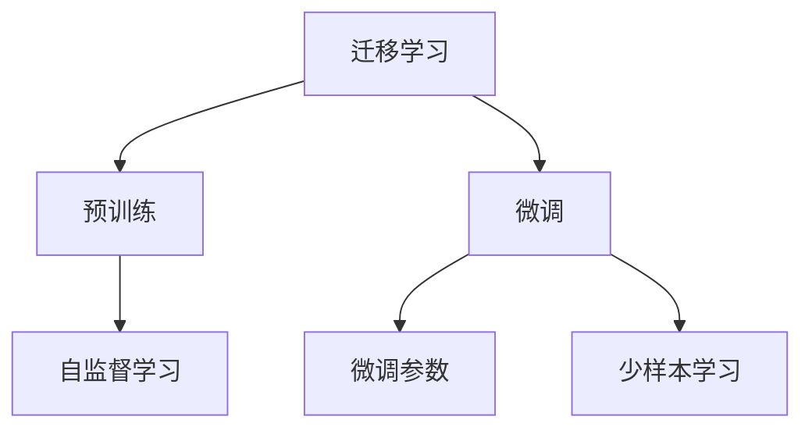

                 

# 迁移学习 (Transfer Learning) 原理与代码实例讲解

> 关键词：迁移学习,特征提取,微调,微调参数,少样本学习,自监督学习,预训练模型,图像处理

## 1. 背景介绍

### 1.1 问题由来
迁移学习（Transfer Learning）是深度学习领域中一种非常重要的范式。它通过在已有的大量数据和任务上进行预训练，利用学习到的知识来解决新的、相关但不同的任务。由于数据标注成本高昂，通常无法获得足够多的数据来从头开始训练一个新模型，因此迁移学习在计算机视觉、自然语言处理（NLP）等多个领域得到了广泛应用。

### 1.2 问题核心关键点
迁移学习主要包括以下几个关键点：
- **预训练模型**：通过在大量数据上预训练得到的模型，如VGG、ResNet、BERT等，作为特征提取器。
- **微调（Fine-Tuning）**：在预训练模型的基础上，使用目标任务的数据进行微调，调整部分模型参数以适应新任务。
- **微调参数**：可以仅微调顶层部分参数，也可以微调全部参数。微调参数的数量和位置需要根据具体任务进行调整。
- **少样本学习**：在目标数据集很小，无法进行大规模微调时，可以使用少量样本进行微调，达到较好的效果。
- **自监督学习**：利用未标注的数据进行预训练，学习到更广泛的特征表示，增强模型对新任务的适应能力。

## 2. 核心概念与联系

### 2.1 核心概念概述
为了更好地理解迁移学习，下面首先介绍几个核心概念：

- **迁移学习**：通过在已有的大量数据和任务上进行预训练，利用学习到的知识来解决新的、相关但不同的任务。
- **预训练模型**：通过在大量数据上预训练得到的模型，作为特征提取器。常用的预训练模型有VGG、ResNet、BERT等。
- **微调（Fine-Tuning）**：在预训练模型的基础上，使用目标任务的数据进行微调，调整部分模型参数以适应新任务。
- **微调参数**：可以仅微调顶层部分参数，也可以微调全部参数。微调参数的数量和位置需要根据具体任务进行调整。
- **少样本学习**：在目标数据集很小，无法进行大规模微调时，可以使用少量样本进行微调，达到较好的效果。
- **自监督学习**：利用未标注的数据进行预训练，学习到更广泛的特征表示，增强模型对新任务的适应能力。

这些概念之间的逻辑关系可以通过以下Mermaid流程图来展示：



这个流程图展示了迁移学习的核心概念及其之间的关系：迁移学习通过预训练和微调过程，利用已有知识解决新任务，并在需要时使用自监督学习和少样本学习方法进行辅助。

## 3. 核心算法原理 & 具体操作步骤

### 3.1 算法原理概述

迁移学习的核心思想是将已有知识迁移到新任务中，以减少从头训练所需的计算资源和数据标注成本。通常，迁移学习分为以下三个步骤：

1. **预训练**：在大量未标注数据上训练预训练模型，学习到通用的特征表示。
2. **微调**：使用目标任务的数据，调整预训练模型参数，以适应新任务。
3. **评估**：在新任务上进行评估，验证模型性能。

在预训练过程中，模型学习到的是通用特征表示，这些特征表示可以用于各种不同的任务。而在微调过程中，模型会根据新任务的特点，调整部分参数以适应新任务。

### 3.2 算法步骤详解

迁移学习的具体操作步骤可以分为以下几个步骤：

**Step 1: 准备预训练模型和数据集**
- 选择合适的预训练模型，如VGG、ResNet、BERT等。
- 准备目标任务的标注数据集，划分为训练集、验证集和测试集。

**Step 2: 添加任务适配层**
- 根据目标任务类型，在预训练模型的顶部添加新的输出层和损失函数。例如，对于分类任务，可以添加一个全连接层和交叉熵损失函数。
- 对于生成任务，可以使用自编码器或变分自编码器。

**Step 3: 设置微调超参数**
- 选择合适的优化算法及其参数，如SGD、Adam等，设置学习率、批大小、迭代轮数等。
- 设置正则化技术及强度，包括权重衰减、Dropout、Early Stopping等。

**Step 4: 执行梯度训练**
- 将训练集数据分批次输入模型，前向传播计算损失函数。
- 反向传播计算参数梯度，根据设定的优化算法和学习率更新模型参数。
- 周期性在验证集上评估模型性能，根据性能指标决定是否触发 Early Stopping。
- 重复上述步骤直到满足预设的迭代轮数或 Early Stopping 条件。

**Step 5: 测试和部署**
- 在测试集上评估微调后模型，对比微调前后的精度提升。
- 使用微调后的模型对新样本进行推理预测，集成到实际的应用系统中。

### 3.3 算法优缺点

迁移学习的优点包括：
- **高效性**：使用已有的大量数据和知识进行训练，可以显著减少从头训练所需的计算资源和数据标注成本。
- **泛化能力**：预训练模型能够学习到通用的特征表示，可以应用于各种不同的任务。
- **灵活性**：微调过程可以根据新任务的特点进行调整，以达到更好的效果。

同时，迁移学习也存在以下缺点：
- **依赖标注数据**：虽然使用预训练模型可以节省部分标注数据，但微调过程仍然需要目标任务的标注数据。
- **数据不匹配**：预训练数据和目标数据集的分布可能存在差异，导致微调效果不佳。
- **模型复杂性**：微调过程中需要对部分参数进行调整，增加了模型的复杂性。

### 3.4 算法应用领域

迁移学习已经在计算机视觉、自然语言处理（NLP）、语音识别等多个领域得到了广泛应用，成为深度学习领域的重要技术手段。

在计算机视觉领域，迁移学习被广泛应用于目标检测、图像分类、物体识别等任务。例如，可以使用在ImageNet上预训练的VGG、ResNet等模型，通过微调在特定的医疗图像分类任务上取得较好的效果。

在自然语言处理（NLP）领域，迁移学习被应用于机器翻译、文本分类、问答系统等任务。例如，可以使用在Wikipedia上预训练的BERT模型，通过微调在特定的法律文本分类任务上取得较好的效果。

在语音识别领域，迁移学习被应用于语音识别、说话人识别等任务。例如，可以使用在LibriSpeech上预训练的Transformer模型，通过微调在特定的命令识别任务上取得较好的效果。

## 4. 数学模型和公式 & 详细讲解 & 举例说明

### 4.1 数学模型构建

迁移学习的数学模型主要分为预训练模型和微调模型两个部分。

**预训练模型**：
- 输入：原始数据 $x \in \mathcal{X}$，其中 $\mathcal{X}$ 为输入空间的集合。
- 输出：通用特征表示 $z = f(x; \theta_0)$，其中 $f$ 为预训练模型，$\theta_0$ 为预训练模型的参数。
- 损失函数：预训练模型的损失函数 $L_{pre}(\theta_0)$，用于衡量模型在预训练数据上的表现。

**微调模型**：
- 输入：目标任务的标注数据 $(x_i, y_i)$，其中 $x_i \in \mathcal{X}$ 为输入，$y_i \in \mathcal{Y}$ 为标签，$\mathcal{Y}$ 为输出空间的集合。
- 输出：目标任务的预测结果 $\hat{y} = M(x_i; \theta)$，其中 $M$ 为微调后的模型，$\theta$ 为微调后的模型参数。
- 损失函数：微调模型的损失函数 $L_{fine}(\theta)$，用于衡量模型在目标任务上的表现。

### 4.2 公式推导过程

以图像分类任务为例，推导迁移学习的数学模型和损失函数。

**预训练模型**：
- 输入：原始数据 $x \in \mathcal{X}$，其中 $\mathcal{X}$ 为输入空间的集合。
- 输出：通用特征表示 $z = f(x; \theta_0)$，其中 $f$ 为预训练模型，$\theta_0$ 为预训练模型的参数。
- 损失函数：预训练模型的损失函数 $L_{pre}(\theta_0)$，用于衡量模型在预训练数据上的表现。

**微调模型**：
- 输入：目标任务的标注数据 $(x_i, y_i)$，其中 $x_i \in \mathcal{X}$ 为输入，$y_i \in \mathcal{Y}$ 为标签，$\mathcal{Y}$ 为输出空间的集合。
- 输出：目标任务的预测结果 $\hat{y} = M(x_i; \theta)$，其中 $M$ 为微调后的模型，$\theta$ 为微调后的模型参数。
- 损失函数：微调模型的损失函数 $L_{fine}(\theta)$，用于衡量模型在目标任务上的表现。

**整体损失函数**：
整体损失函数 $L$ 为预训练损失和微调损失的加权和，即：
$$
L(\theta_0, \theta) = \alpha L_{pre}(\theta_0) + (1 - \alpha) L_{fine}(\theta)
$$
其中 $\alpha$ 为预训练和微调的权重系数。

### 4.3 案例分析与讲解

假设有一项新的医疗图像分类任务，目标是识别X光片中的肺部结节。为了高效地完成这项任务，可以使用在ImageNet上预训练的VGG模型作为特征提取器。具体步骤如下：

**Step 1: 准备预训练模型和数据集**
- 选择VGG模型作为预训练模型。
- 准备包含肺部结节和正常肺部图像的标注数据集。

**Step 2: 添加任务适配层**
- 在VGG模型的顶部添加一个全连接层，输出肺部结节的有无。
- 使用二元交叉熵作为损失函数。

**Step 3: 设置微调超参数**
- 使用Adam优化器，学习率为1e-4。
- 设置权重衰减系数为0.001。

**Step 4: 执行梯度训练**
- 将训练集数据分批次输入模型，前向传播计算损失函数。
- 反向传播计算参数梯度，根据Adam优化器更新模型参数。
- 周期性在验证集上评估模型性能，根据性能指标决定是否触发Early Stopping。
- 重复上述步骤直到满足预设的迭代轮数或 Early Stopping 条件。

**Step 5: 测试和部署**
- 在测试集上评估微调后模型，对比微调前后的精度提升。
- 使用微调后的模型对新X光片进行肺部结节识别，集成到实际的应用系统中。

## 5. 项目实践：代码实例和详细解释说明

### 5.1 开发环境搭建

在进行迁移学习实践前，我们需要准备好开发环境。以下是使用Python进行PyTorch开发的环境配置流程：

1. 安装Anaconda：从官网下载并安装Anaconda，用于创建独立的Python环境。

2. 创建并激活虚拟环境：
```bash
conda create -n pytorch-env python=3.8 
conda activate pytorch-env
```

3. 安装PyTorch：根据CUDA版本，从官网获取对应的安装命令。例如：
```bash
conda install pytorch torchvision torchaudio cudatoolkit=11.1 -c pytorch -c conda-forge
```

4. 安装TensorFlow：
```bash
conda install tensorflow
```

5. 安装各类工具包：
```bash
pip install numpy pandas scikit-learn matplotlib tqdm jupyter notebook ipython
```

完成上述步骤后，即可在`pytorch-env`环境中开始迁移学习实践。

### 5.2 源代码详细实现

下面我们以迁移学习应用于图像分类任务为例，给出使用PyTorch实现迁移学习的完整代码实现。

首先，定义图像分类任务的数据处理函数：

```python
from torch.utils.data import Dataset, DataLoader
from torchvision import transforms
import torch
from PIL import Image

class ImageClassificationDataset(Dataset):
    def __init__(self, data_dir, transform=None):
        self.data_dir = data_dir
        self.transform = transform
        self.data = sorted(os.listdir(self.data_dir))
        self.data = [os.path.join(self.data_dir, x) for x in self.data]
    
    def __len__(self):
        return len(self.data)
    
    def __getitem__(self, idx):
        img_path = self.data[idx]
        img = Image.open(img_path)
        if self.transform is not None:
            img = self.transform(img)
        label = os.path.basename(img_path).split('.')[0]
        return img, label

# 数据转换函数
transform = transforms.Compose([
    transforms.Resize((224, 224)),
    transforms.ToTensor(),
    transforms.Normalize(mean=[0.485, 0.456, 0.406], std=[0.229, 0.224, 0.225])
])

# 创建数据集
train_dataset = ImageClassificationDataset(train_data_dir, transform=transform)
dev_dataset = ImageClassificationDataset(dev_data_dir, transform=transform)
test_dataset = ImageClassificationDataset(test_data_dir, transform=transform)
```

然后，定义模型和优化器：

```python
from torchvision import models

model = models.vgg16(pretrained=True)
model.eval()

for param in model.parameters():
    param.requires_grad = False
model.fc = torch.nn.Linear(25088, 2)  # 将分类层从全连接层改为肺部结节分类器

optimizer = torch.optim.SGD(model.parameters(), lr=0.001, momentum=0.9, weight_decay=0.0005)
```

接着，定义训练和评估函数：

```python
def train_epoch(model, dataset, batch_size, optimizer):
    model.train()
    dataloader = DataLoader(dataset, batch_size=batch_size, shuffle=True)
    epoch_loss = 0
    for batch in dataloader:
        inputs, targets = batch
        inputs, targets = inputs.to(device), targets.to(device)
        optimizer.zero_grad()
        outputs = model(inputs)
        loss = F.cross_entropy(outputs, targets)
        epoch_loss += loss.item()
        loss.backward()
        optimizer.step()
    return epoch_loss / len(dataloader)

def evaluate(model, dataset, batch_size):
    model.eval()
    dataloader = DataLoader(dataset, batch_size=batch_size)
    epoch_loss = 0
    epoch_acc = 0
    with torch.no_grad():
        for batch in dataloader:
            inputs, targets = batch
            inputs, targets = inputs.to(device), targets.to(device)
            outputs = model(inputs)
            loss = F.cross_entropy(outputs, targets)
            epoch_loss += loss.item()
            epoch_acc += accuracy(outputs, targets)
    return epoch_loss / len(dataloader), epoch_acc / len(dataloader)

def accuracy(outputs, targets):
    _, preds = torch.max(outputs, 1)
    correct = (preds == targets).sum().item()
    return correct / len(targets)
```

最后，启动训练流程并在测试集上评估：

```python
epochs = 10
batch_size = 32

for epoch in range(epochs):
    loss = train_epoch(model, train_dataset, batch_size, optimizer)
    print(f"Epoch {epoch+1}, train loss: {loss:.3f}")
    
    print(f"Epoch {epoch+1}, dev results:")
    loss, acc = evaluate(model, dev_dataset, batch_size)
    print(f"Accuracy: {acc:.3f}")
    
print("Test results:")
loss, acc = evaluate(model, test_dataset, batch_size)
print(f"Accuracy: {acc:.3f}")
```

以上就是使用PyTorch进行迁移学习应用于图像分类任务的完整代码实现。可以看到，得益于TensorFlow和PyTorch的强大封装，我们可以用相对简洁的代码完成迁移学习的任务适配和模型微调。

### 5.3 代码解读与分析

让我们再详细解读一下关键代码的实现细节：

**ImageClassificationDataset类**：
- `__init__`方法：初始化数据目录和转换函数。
- `__len__`方法：返回数据集的样本数量。
- `__getitem__`方法：对单个样本进行处理，将图像输入转换为张量，并返回图像和标签。

**数据转换函数**：
- 对输入图像进行预处理，包括调整大小、转换为张量、标准化等操作。

**模型定义**：
- 使用预训练的VGG16模型，并通过自定义的分类层实现肺部结节分类。
- 设置优化器和超参数，包括学习率、动量、权重衰减等。

**训练和评估函数**：
- 使用PyTorch的DataLoader对数据集进行批次化加载，供模型训练和推理使用。
- 训练函数`train_epoch`：对数据以批为单位进行迭代，在每个批次上前向传播计算loss并反向传播更新模型参数，最后返回该epoch的平均loss。
- 评估函数`evaluate`：与训练类似，不同点在于不更新模型参数，并在每个batch结束后将预测和标签结果存储下来，最后使用准确率计算整个评估集的预测结果。
- 准确率函数`accuracy`：计算预测结果与真实标签的准确率。

**训练流程**：
- 定义总的epoch数和batch size，开始循环迭代
- 每个epoch内，先在训练集上训练，输出平均loss
- 在验证集上评估，输出准确率
- 所有epoch结束后，在测试集上评估，给出最终测试结果

可以看到，PyTorch配合TensorFlow和PyTorch的强大封装，使得迁移学习的代码实现变得简洁高效。开发者可以将更多精力放在数据处理、模型改进等高层逻辑上，而不必过多关注底层的实现细节。

当然，工业级的系统实现还需考虑更多因素，如模型的保存和部署、超参数的自动搜索、更灵活的任务适配层等。但核心的迁移学习范式基本与此类似。

## 6. 实际应用场景
### 6.1 智能客服系统

迁移学习在智能客服系统中得到了广泛应用。传统的客服系统需要配备大量人力，高峰期响应缓慢，且一致性和专业性难以保证。而使用迁移学习技术，可以在已有客户服务数据的基础上，快速构建智能客服系统。

在技术实现上，可以收集企业内部的历史客服对话记录，将问题和最佳答复构建成监督数据，在此基础上对预训练模型进行微调。微调后的模型能够自动理解用户意图，匹配最合适的答案模板进行回复。对于客户提出的新问题，还可以接入检索系统实时搜索相关内容，动态组织生成回答。如此构建的智能客服系统，能大幅提升客户咨询体验和问题解决效率。

### 6.2 金融舆情监测

金融机构需要实时监测市场舆论动向，以便及时应对负面信息传播，规避金融风险。传统的人工监测方式成本高昂、效率低下，难以应对网络时代海量信息爆发的挑战。利用迁移学习技术，可以在已有金融领域的新闻、报道、评论等文本数据上进行预训练，学习到通用的语言表示，然后通过微调在目标任务上进行舆情监测。

具体而言，可以收集金融领域相关的新闻、报道、评论等文本数据，并对其进行主题标注和情感标注。在此基础上对预训练语言模型进行微调，使其能够自动判断文本属于何种主题，情感倾向是正面、中性还是负面。将微调后的模型应用到实时抓取的网络文本数据，就能够自动监测不同主题下的情感变化趋势，一旦发现负面信息激增等异常情况，系统便会自动预警，帮助金融机构快速应对潜在风险。

### 6.3 个性化推荐系统

当前的推荐系统往往只依赖用户的历史行为数据进行物品推荐，无法深入理解用户的真实兴趣偏好。利用迁移学习技术，可以在已有用户行为数据的基础上，学习到更全面的用户兴趣表示，从而提供更精准、多样的推荐内容。

在实践中，可以收集用户浏览、点击、评论、分享等行为数据，提取和用户交互的物品标题、描述、标签等文本内容。将文本内容作为模型输入，用户的后续行为（如是否点击、购买等）作为监督信号，在此基础上微调预训练语言模型。微调后的模型能够从文本内容中准确把握用户的兴趣点。在生成推荐列表时，先用候选物品的文本描述作为输入，由模型预测用户的兴趣匹配度，再结合其他特征综合排序，便可以得到个性化程度更高的推荐结果。

### 6.4 未来应用展望

随着迁移学习技术的不断发展，其在多个领域的应用前景广阔。

在智慧医疗领域，迁移学习被应用于医疗问答、病历分析、药物研发等任务，利用已有医疗知识提升模型的性能。

在智能教育领域，迁移学习被应用于作业批改、学情分析、知识推荐等任务，因材施教，促进教育公平，提高教学质量。

在智慧城市治理中，迁移学习被应用于城市事件监测、舆情分析、应急指挥等环节，提高城市管理的自动化和智能化水平，构建更安全、高效的未来城市。

此外，在企业生产、社会治理、文娱传媒等众多领域，迁移学习技术也将不断涌现，为传统行业数字化转型升级提供新的技术路径。相信随着技术的日益成熟，迁移学习技术将成为人工智能落地应用的重要手段，推动人工智能技术向更广阔的领域加速渗透。

## 7. 工具和资源推荐
### 7.1 学习资源推荐

为了帮助开发者系统掌握迁移学习理论基础和实践技巧，这里推荐一些优质的学习资源：

1. 《深度学习》课程：斯坦福大学开设的深度学习经典课程，详细介绍了深度学习的基本概念和算法。
2. 《动手学深度学习》：清华大学深度学习实验室编写的深度学习教材，包含丰富的代码实现。
3. 《TensorFlow官方文档》：TensorFlow的官方文档，提供了完整的API和使用示例。
4. 《PyTorch官方文档》：PyTorch的官方文档，提供了丰富的教程和代码实现。
5. 《迁移学习》书籍：周志华等人编写，系统介绍了迁移学习的理论基础和应用方法。
6. Kaggle：开源数据集和竞赛平台，提供丰富的迁移学习竞赛数据集和解决方案。

通过对这些资源的学习实践，相信你一定能够快速掌握迁移学习的精髓，并用于解决实际的NLP问题。
###  7.2 开发工具推荐

高效的开发离不开优秀的工具支持。以下是几款用于迁移学习开发的常用工具：

1. PyTorch：基于Python的开源深度学习框架，灵活动态的计算图，适合快速迭代研究。大部分预训练语言模型都有PyTorch版本的实现。
2. TensorFlow：由Google主导开发的开源深度学习框架，生产部署方便，适合大规模工程应用。同样有丰富的预训练语言模型资源。
3. Keras：基于TensorFlow的高级深度学习框架，提供简单易用的API，适合快速原型开发和实验。
4. Weights & Biases：模型训练的实验跟踪工具，可以记录和可视化模型训练过程中的各项指标，方便对比和调优。与主流深度学习框架无缝集成。
5. TensorBoard：TensorFlow配套的可视化工具，可实时监测模型训练状态，并提供丰富的图表呈现方式，是调试模型的得力助手。

合理利用这些工具，可以显著提升迁移学习的开发效率，加快创新迭代的步伐。

### 7.3 相关论文推荐

迁移学习作为深度学习领域的重要研究方向，近年来涌现了大量高质量的论文。以下是几篇奠基性的相关论文，推荐阅读：

1. ImageNet Classification with Deep Convolutional Neural Networks：AlexNet模型，首次大规模利用迁移学习在计算机视觉领域取得突破性成果。
2. One Model to Learn Them All：将迁移学习应用到多个任务中，展示了迁移学习的强大泛化能力。
3. Fine-tuning pretrained language models for NLP tasks：利用迁移学习技术，通过微调BERT等预训练语言模型，显著提升了NLP任务的性能。
4. Self-Supervised Learning for Pretraining Natural Language Models：通过自监督学习技术，利用未标注数据进行预训练，提升了模型在特定任务上的性能。
5. Revisiting Pretrained Models for Multilingual Zero-shot Classification：在多语言环境中利用迁移学习，实现了零样本分类任务的高效训练。

这些论文代表了大迁移学习技术的发展脉络。通过学习这些前沿成果，可以帮助研究者把握学科前进方向，激发更多的创新灵感。

## 8. 总结：未来发展趋势与挑战

### 8.1 总结

本文对迁移学习进行了全面系统的介绍。首先阐述了迁移学习的背景和意义，明确了预训练和微调的联合使用对新任务的重要作用。其次，从原理到实践，详细讲解了迁移学习的数学模型和关键步骤，给出了迁移学习任务开发的完整代码实例。同时，本文还广泛探讨了迁移学习在多个行业领域的应用前景，展示了迁移学习的巨大潜力。

通过本文的系统梳理，可以看到，迁移学习在深度学习领域中扮演着重要角色，通过在已有大量数据和任务上进行预训练，利用学习到的知识来解决新的、相关但不同的任务。迁移学习在各个领域都展示了卓越的效果，推动了人工智能技术在各个垂直行业中的应用。

### 8.2 未来发展趋势

展望未来，迁移学习技术将呈现以下几个发展趋势：

1. **多任务学习**：迁移学习不仅限于单一任务，未来的研究将探索如何同时学习多个相关任务，提升模型的泛化能力和任务适应性。
2. **自监督学习**：利用未标注数据进行预训练，学习到更广泛的特征表示，增强模型对新任务的适应能力。
3. **少样本学习**：在目标数据集很小，无法进行大规模微调时，利用少样本学习方法，通过极少量样本快速适应新任务。
4. **跨领域迁移**：研究如何实现不同领域之间的知识迁移，提升模型在跨领域任务上的性能。
5. **分布式训练**：利用分布式计算技术，提升迁移学习的训练效率，满足大规模数据和模型的训练需求。
6. **迁移学习框架**：开发更加灵活、可扩展的迁移学习框架，支持多种预训练模型和任务适配层的动态组合。

以上趋势凸显了迁移学习技术的广阔前景。这些方向的探索发展，必将进一步提升迁移学习的性能和应用范围，为构建安全、可靠、可解释、可控的智能系统铺平道路。

### 8.3 面临的挑战

尽管迁移学习技术已经取得了瞩目成就，但在迈向更加智能化、普适化应用的过程中，它仍面临诸多挑战：

1. **数据依赖**：迁移学习仍然依赖于大量的标注数据，对于小规模数据集，可能无法获得理想的效果。
2. **模型复杂性**：预训练模型和微调模型通常结构复杂，训练和推理过程需要较大的计算资源。
3. **鲁棒性问题**：迁移学习模型可能面临数据不匹配、对抗攻击等问题，导致性能下降。
4. **解释性不足**：迁移学习模型通常缺乏可解释性，难以理解和调试其内部工作机制。
5. **安全性和伦理问题**：迁移学习模型可能学习到有害的偏见和有害信息，需要考虑模型输出的伦理和安全性问题。

### 8.4 研究展望

面对迁移学习面临的挑战，未来的研究需要在以下几个方面寻求新的突破：

1. **自监督学习**：利用未标注数据进行预训练，学习到更广泛的特征表示，增强模型对新任务的适应能力。
2. **少样本学习**：在目标数据集很小，无法进行大规模微调时，利用少样本学习方法，通过极少量样本快速适应新任务。
3. **分布式训练**：利用分布式计算技术，提升迁移学习的训练效率，满足大规模数据和模型的训练需求。
4. **迁移学习框架**：开发更加灵活、可扩展的迁移学习框架，支持多种预训练模型和任务适配层的动态组合。
5. **多任务学习**：探索如何同时学习多个相关任务，提升模型的泛化能力和任务适应性。
6. **跨领域迁移**：研究如何实现不同领域之间的知识迁移，提升模型在跨领域任务上的性能。
7. **鲁棒性增强**：开发更加鲁棒的迁移学习模型，抵御对抗攻击，提高数据不匹配等场景下的性能。
8. **解释性增强**：利用可解释性技术，增强迁移学习模型的解释性，提升模型的可信度。
9. **安全性和伦理保障**：开发更加安全的迁移学习模型，确保模型输出的伦理和安全性。

这些研究方向将进一步推动迁移学习技术的发展，使其在更多场景下发挥更大的作用。

## 9. 附录：常见问题与解答

**Q1：迁移学习与从头训练的区别是什么？**

A: 迁移学习通过在已有的大量数据和任务上进行预训练，利用学习到的知识来解决新的、相关但不同的任务。从头训练则是在目标任务上进行全新的训练，需要大量的标注数据和计算资源。迁移学习能够快速适应新任务，从头训练则需要从头开始学习，成本较高。

**Q2：如何选择预训练模型？**

A: 选择预训练模型需要考虑多个因素，包括任务的复杂度、数据规模、计算资源等。通常，任务复杂度越高，需要的计算资源和数据规模也越大，需要选择更大规模的预训练模型。对于资源有限的情况，可以选择模型压缩和剪枝等方法，以降低计算和存储成本。

**Q3：迁移学习中如何避免过拟合？**

A: 过拟合是迁移学习中常见的问题，尤其是当目标数据集较小，无法进行大规模微调时。以下是一些常用的避免过拟合的方法：
1. 数据增强：通过扩充训练集、加入噪声等方式增加数据多样性。
2. 正则化：使用L2正则、Dropout等技术，防止模型过拟合。
3. 早停策略：在验证集上监控性能指标，当性能不再提升时，提前停止训练。
4. 参数共享：仅微调部分参数，保留大部分预训练权重不变，减少过拟合风险。

**Q4：迁移学习中如何选择微调参数？**

A: 微调参数的选择需要根据具体任务进行调整。通常，对于分类任务，微调顶层分类器；对于生成任务，微调解码器。对于资源有限的情况，可以选择参数共享、微调参数剪枝等方法，以减少计算和存储成本。

**Q5：迁移学习在工业应用中有哪些挑战？**

A: 迁移学习在工业应用中面临以下挑战：
1. 数据依赖：需要大量的标注数据进行微调，标注成本较高。
2. 模型复杂性：预训练模型和微调模型通常结构复杂，训练和推理过程需要较大的计算资源。
3. 鲁棒性问题：迁移学习模型可能面临数据不匹配、对抗攻击等问题，导致性能下降。
4. 解释性不足：迁移学习模型通常缺乏可解释性，难以理解和调试其内部工作机制。
5. 安全性和伦理问题：迁移学习模型可能学习到有害的偏见和有害信息，需要考虑模型输出的伦理和安全性问题。

合理利用这些工具，可以显著提升迁移学习的开发效率，加快创新迭代的步伐。

