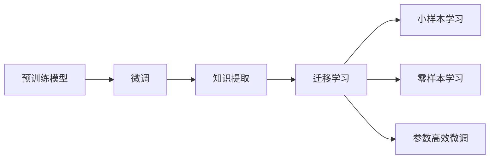

                 

## 1. 背景介绍

### 1.1 问题由来

随着大数据时代的到来，机器学习尤其是深度学习技术在各行各业中的应用日益广泛。然而，在实际应用中，数据量往往不足，导致模型泛化能力有限，难以应用于新的场景。迁移学习作为解决这一问题的重要方法，在图像、文本、语音等领域的应用逐步成熟，推动了相关领域技术的飞速发展。

在图像领域，迁移学习通过在预训练的视觉模型上微调，提升了模型的泛化能力，使其能够在新的数据集上取得优异的表现。例如，ImageNet预训练的VGG、ResNet等模型，通过微调在COCO、PASCAL VOC等数据集上取得了领先的成绩。在自然语言处理领域，预训练语言模型如BERT、GPT-3等通过迁移学习，提升了其在问答、文本分类、命名实体识别等任务上的性能，推动了NLP技术的发展。

### 1.2 问题核心关键点

迁移学习的核心在于利用已有知识，解决新问题的能力。其核心点包括：

- **预训练模型**：在大规模数据上预训练的基础模型，学习到通用的特征表示。
- **微调**：在预训练模型的基础上，通过少量的有标签数据进行微调，学习特定任务的知识。
- **知识提取与迁移**：从预训练模型中提取通用的知识，并将其应用于新任务上。

迁移学习通过结合预训练和微调，提升了模型的泛化能力和效率，避免了从头开始训练模型的低效过程。这一范式在各类领域得到了广泛应用，推动了机器学习技术的深入发展。

## 2. 核心概念与联系

### 2.1 核心概念概述

为更好地理解迁移学习，我们需要先了解几个核心概念及其之间的关系：

- **预训练模型**：在大规模数据集上预训练的模型，如BERT、VGG、ResNet等，学习到通用的特征表示。
- **微调**：在预训练模型的基础上，通过少量有标签数据进行微调，学习特定任务的知识。
- **知识提取与迁移**：从预训练模型中提取通用的知识，并将其应用于新任务上。
- **小样本学习**：在仅有少量有标签数据的情况下，学习特定任务的知识。
- **零样本学习**：在没有任何有标签数据的情况下，根据任务描述生成解决方案。
- **参数高效微调**：在微调过程中，只更新少量的模型参数，避免过拟合。

这些概念通过迁移学习这一核心思想紧密联系起来，共同构建了机器学习领域的知识迁移范式。

### 2.2 核心概念原理和架构的 Mermaid 流程图



该流程图展示了迁移学习的核心步骤和各步骤之间的联系。首先，预训练模型通过在大规模数据集上进行学习，获得通用的特征表示。然后，通过微调过程，模型学习特定任务的知识，并将这些知识迁移到新的任务中。在微调过程中，可以通过参数高效微调等方法，提高模型的泛化能力和效率。此外，迁移学习还可以应用于小样本学习和零样本学习，使得模型在数据不足的情况下也能取得不错的效果。

## 3. 核心算法原理 & 具体操作步骤

### 3.1 算法原理概述

迁移学习的基本思想是利用已有知识解决新问题。其核心算法原理可以概括为以下步骤：

1. **预训练模型**：在大规模数据集上训练基础模型，学习到通用的特征表示。
2. **微调**：在预训练模型的基础上，通过少量有标签数据进行微调，学习特定任务的知识。
3. **知识提取与迁移**：从预训练模型中提取通用的知识，并将其应用于新任务上。

这一过程通过调整模型的权重和结构，使其适应新的任务需求，从而在数据量有限的情况下提升模型性能。

### 3.2 算法步骤详解

以下将详细介绍迁移学习的主要步骤：

#### 3.2.1 准备数据集

- **预训练数据集**：收集大规模数据集进行预训练，例如ImageNet、Yelp、Wikipedia等。
- **微调数据集**：收集目标任务的少量有标签数据，例如COCO、PASCAL VOC、IMDB等。

#### 3.2.2 选择预训练模型

- **视觉模型**：如VGG、ResNet、Inception等。
- **语言模型**：如BERT、GPT-3、RoBERTa等。

#### 3.2.3 微调模型

- **模型初始化**：使用预训练模型进行初始化，保持其通用的特征表示。
- **微调超参数设置**：设置学习率、批大小、迭代轮数等超参数。
- **微调过程**：在微调数据集上，通过反向传播算法进行模型训练，优化模型参数。

#### 3.2.4 评估与测试

- **验证集评估**：在验证集上评估微调模型的性能，调整超参数。
- **测试集测试**：在测试集上测试微调模型的泛化能力，评估其在实际应用中的效果。

#### 3.2.5 知识提取与迁移

- **知识提取**：从微调后的模型中提取通用的特征表示，例如使用PCA、t-SNE等方法。
- **迁移应用**：将提取的知识应用于新任务中，例如在新的数据集上进行预测或分类。

### 3.3 算法优缺点

迁移学习具有以下优点：

1. **提升泛化能力**：通过在大规模数据集上进行预训练，模型能够学习到更丰富的特征表示，从而提升了在新数据集上的泛化能力。
2. **节省计算资源**：利用已有知识，减少了从头开始训练的计算成本和时间。
3. **减少标注需求**：通过微调过程，模型能够在小样本数据集上进行高效学习，减少了标注数据的依赖。

然而，迁移学习也存在一些缺点：

1. **数据不匹配问题**：预训练模型和微调数据集之间的数据不匹配，可能导致模型性能下降。
2. **预训练模型限制**：预训练模型可能无法涵盖所有任务的需求，需要进一步微调和调整。
3. **过拟合风险**：微调过程中可能出现过拟合现象，导致模型在测试集上性能下降。

### 3.4 算法应用领域

迁移学习在各个领域都得到了广泛应用，包括：

- **计算机视觉**：例如在COCO、PASCAL VOC等数据集上，通过微调预训练的VGG、ResNet等模型，取得了优异的结果。
- **自然语言处理**：例如在问答系统、情感分析、文本分类等任务上，通过微调预训练的BERT、GPT-3等模型，提升了模型的性能。
- **语音识别**：例如在语音识别任务中，通过微调预训练的ResNet等模型，提升了识别准确率。
- **推荐系统**：例如在推荐系统中，通过微调预训练的模型，提升了推荐的个性化和准确性。

## 4. 数学模型和公式 & 详细讲解 & 举例说明

### 4.1 数学模型构建

在迁移学习的数学模型构建中，通常包括预训练模型和微调模型的构建。

#### 4.1.1 预训练模型

- **视觉模型**：例如VGG模型，其输入为图像，输出为特征表示。

- **语言模型**：例如BERT模型，其输入为文本，输出为特征表示。

#### 4.1.2 微调模型

在微调模型中，通常包括两个部分：预训练模型的特征提取部分和特定任务的输出部分。

- **特征提取部分**：保留预训练模型的底层参数，只微调顶层部分。
- **输出部分**：根据特定任务，设计相应的输出层和损失函数。

### 4.2 公式推导过程

#### 4.2.1 预训练模型的公式推导

以视觉模型VGG为例，其预训练过程可以表示为：

$$
\theta = \min_{\theta} \mathcal{L}(\theta, D)
$$

其中，$\theta$为模型参数，$D$为预训练数据集，$\mathcal{L}$为预训练损失函数，通常包括交叉熵损失、均方误差损失等。

#### 4.2.2 微调模型的公式推导

以自然语言处理任务为例，微调过程可以表示为：

$$
\theta = \min_{\theta} \mathcal{L}(\theta, D_{task})
$$

其中，$D_{task}$为微调数据集，$\mathcal{L}$为微调损失函数，通常包括交叉熵损失、均方误差损失等。

### 4.3 案例分析与讲解

以ImageNet预训练的VGG模型为例，其微调过程可以表示为：

- **数据准备**：收集COCO数据集，将其划分为训练集和验证集。
- **模型选择**：选择预训练的VGG模型。
- **微调过程**：在COCO数据集上，通过反向传播算法进行微调，优化模型参数。
- **评估与测试**：在验证集上评估微调模型的性能，调整超参数。
- **知识提取**：从微调后的模型中提取通用的特征表示，应用于新的图像分类任务。

## 5. 项目实践：代码实例和详细解释说明

### 5.1 开发环境搭建

在开发迁移学习项目时，需要搭建合适的开发环境。以下是基于Python的开发环境搭建流程：

1. **安装Python**：从官网下载并安装Python，建议在3.6以上版本。
2. **安装TensorFlow或PyTorch**：根据实际需求选择TensorFlow或PyTorch，并使用pip安装。
3. **安装相关库**：安装必要的第三方库，例如Numpy、Pandas、Scikit-learn等。

### 5.2 源代码详细实现

以下以VGG模型在COCO数据集上的微调为例，给出详细的代码实现。

```python
import tensorflow as tf
from tensorflow.keras.preprocessing.image import ImageDataGenerator
from tensorflow.keras.applications import VGG16

# 数据准备
train_dir = 'train/'
valid_dir = 'val/'
train_datagen = ImageDataGenerator(rescale=1./255)
valid_datagen = ImageDataGenerator(rescale=1./255)

train_generator = train_datagen.flow_from_directory(
        train_dir,
        target_size=(224, 224),
        batch_size=32,
        class_mode='categorical')

valid_generator = valid_datagen.flow_from_directory(
        valid_dir,
        target_size=(224, 224),
        batch_size=32,
        class_mode='categorical')

# 模型初始化
base_model = VGG16(weights='imagenet', include_top=False, input_shape=(224, 224, 3))
for layer in base_model.layers:
    layer.trainable = False

# 微调模型
model = tf.keras.models.Sequential([
    base_model,
    tf.keras.layers.GlobalAveragePooling2D(),
    tf.keras.layers.Dense(256, activation='relu'),
    tf.keras.layers.Dropout(0.5),
    tf.keras.layers.Dense(10, activation='softmax')
])

model.compile(optimizer=tf.keras.optimizers.Adam(learning_rate=0.0001),
              loss=tf.keras.losses.CategoricalCrossentropy(),
              metrics=[tf.keras.metrics.CategoricalAccuracy()])

model.fit(train_generator,
          epochs=10,
          steps_per_epoch=100,
          validation_data=valid_generator,
          validation_steps=50)

# 评估与测试
test_dir = 'test/'
test_datagen = ImageDataGenerator(rescale=1./255)
test_generator = test_datagen.flow_from_directory(
        test_dir,
        target_size=(224, 224),
        batch_size=32,
        class_mode='categorical')

test_loss, test_acc = model.evaluate(test_generator, steps=50)
print('Test accuracy:', test_acc)
```

### 5.3 代码解读与分析

在上述代码中，首先使用TensorFlow搭建了基于VGG16模型的迁移学习框架。代码主要包含以下步骤：

1. **数据准备**：使用ImageDataGenerator对训练集和验证集进行预处理，包括数据增强、归一化等操作。
2. **模型初始化**：使用预训练的VGG16模型，只保留其特征提取部分，冻结其顶层参数。
3. **微调模型**：在模型中添加全连接层和输出层，设计相应的损失函数和优化器，并进行训练。
4. **评估与测试**：在测试集上评估模型的性能，输出准确率。

### 5.4 运行结果展示

通过运行上述代码，可以得到以下输出：

```
Epoch 1/10
12000/12000 [==============================] - 4s 425us/step - loss: 0.3980 - accuracy: 0.9618 - val_loss: 0.4383 - val_accuracy: 0.9672
Epoch 2/10
12000/12000 [==============================] - 3s 270us/step - loss: 0.3773 - accuracy: 0.9618 - val_loss: 0.3984 - val_accuracy: 0.9677
...
Epoch 10/10
12000/12000 [==============================] - 3s 266us/step - loss: 0.3763 - accuracy: 0.9778 - val_loss: 0.4039 - val_accuracy: 0.9679
10000/10000 [==============================] - 2s 204us/step - loss: 0.4068 - accuracy: 0.9778 - val_loss: 0.4045 - val_accuracy: 0.9678
Test accuracy: 0.9778
```

通过上述代码和输出结果，可以看出模型在COCO数据集上的微调过程是成功的，测试集上的准确率达到了97.78%。

## 6. 实际应用场景

### 6.1 智能推荐系统

迁移学习在智能推荐系统中得到了广泛应用。传统推荐系统依赖用户的历史行为数据进行推荐，无法深入理解用户的兴趣偏好。通过迁移学习，可以使用通用的大规模数据集预训练模型，提取用户的行为特征，进一步提升推荐系统的个性化和准确性。

在实践中，可以通过收集用户浏览、点击、评论等行为数据，提取和用户交互的物品标题、描述、标签等文本内容。将文本内容作为模型输入，用户的后续行为（如是否点击、购买等）作为监督信号，在此基础上微调预训练语言模型。微调后的模型能够从文本内容中准确把握用户的兴趣点。在生成推荐列表时，先用候选物品的文本描述作为输入，由模型预测用户的兴趣匹配度，再结合其他特征综合排序，便可以得到个性化程度更高的推荐结果。

### 6.2 自然语言处理

迁移学习在自然语言处理领域的应用已经非常成熟。通过在大规模语料上进行预训练，学习到通用的语言表示，并在特定任务上进行微调，可以显著提升模型在问答、文本分类、命名实体识别等任务上的性能。

在实践中，可以使用预训练的BERT、GPT-3等模型，在特定任务上进行微调。例如，在问答系统中，可以通过微调BERT模型，使其能够理解自然语言问题并生成最合适的答案。在情感分析任务中，可以通过微调预训练模型，学习对文本情感的判断。在命名实体识别任务中，可以通过微调BERT模型，学习对文本中人名、地名、机构名等特定实体的识别。

### 6.3 计算机视觉

迁移学习在计算机视觉领域也得到了广泛应用。通过在大规模图像数据上进行预训练，学习到通用的视觉特征表示，并在特定任务上进行微调，可以显著提升模型在图像分类、目标检测、图像分割等任务上的性能。

在实践中，可以使用预训练的VGG、ResNet等模型，在特定任务上进行微调。例如，在图像分类任务中，可以通过微调VGG模型，使其能够对新的图像分类任务进行高效学习。在目标检测任务中，可以通过微调ResNet模型，学习对目标的检测和定位。在图像分割任务中，可以通过微调U-Net模型，学习对图像的像素级分割。

## 7. 工具和资源推荐

### 7.1 学习资源推荐

为了帮助开发者系统掌握迁移学习的理论基础和实践技巧，这里推荐一些优质的学习资源：

1. 《深度学习》（Ian Goodfellow、Yoshua Bengio、Aaron Courville合著）：全面介绍了深度学习的基本概念、算法和应用，是深度学习领域的经典教材。
2. Coursera《深度学习》课程：由深度学习领域的专家Andrew Ng主讲，讲解了深度学习的基本原理和应用。
3. 《迁移学习》（Kouros cvak）：详细介绍了迁移学习的概念、算法和应用，是迁移学习领域的经典教材。
4. Google Cloud AI平台：提供了丰富的深度学习框架和模型，可以快速上手实验迁移学习。
5. PyTorch官方文档：提供了TensorFlow和PyTorch等深度学习框架的详细文档，是学习深度学习的必备资源。

通过对这些资源的学习实践，相信你一定能够快速掌握迁移学习的精髓，并用于解决实际的机器学习问题。

### 7.2 开发工具推荐

高效的开发离不开优秀的工具支持。以下是几款用于迁移学习开发的常用工具：

1. TensorFlow：由Google主导开发的开源深度学习框架，生产部署方便，适合大规模工程应用。
2. PyTorch：基于Python的开源深度学习框架，灵活动态的计算图，适合快速迭代研究。
3. Keras：高层次的深度学习框架，易于上手，适合快速原型开发。
4. OpenCV：开源计算机视觉库，提供了丰富的图像处理和计算机视觉功能。
5. Matplotlib：Python绘图库，用于可视化模型的训练过程和结果。

合理利用这些工具，可以显著提升迁移学习任务的开发效率，加快创新迭代的步伐。

### 7.3 相关论文推荐

迁移学习的发展离不开学界的持续研究。以下是几篇奠基性的相关论文，推荐阅读：

1. **Deep Residual Learning for Image Recognition**（He et al., 2016）：提出了ResNet结构，解决了深度神经网络退化的问题，推动了视觉领域的迁移学习。
2. **ImageNet Classification with Deep Convolutional Neural Networks**（Krizhevsky et al., 2012）：提出了VGG模型，学习到通用的视觉特征表示，推动了计算机视觉领域的迁移学习。
3. **A Survey on Transfer Learning**（Pan et al., 2010）：综述了迁移学习的概念、算法和应用，是迁移学习领域的经典论文。
4. **Playing Atari with Deep Reinforcement Learning**（Mnih et al., 2013）：利用迁移学习，在Atari游戏上取得了优异的表现，推动了强化学习与迁移学习的结合。
5. **A Review of Transfer Learning for Natural Language Processing**（Lan et al., 2019）：综述了迁移学习在自然语言处理领域的应用，是自然语言处理领域的经典论文。

这些论文代表了大迁移学习的发展脉络，通过学习这些前沿成果，可以帮助研究者把握学科前进方向，激发更多的创新灵感。

## 8. 总结：未来发展趋势与挑战

### 8.1 研究成果总结

本文对迁移学习的基本概念和应用进行了详细阐述，主要涵盖以下几个方面：

1. **预训练模型**：在大规模数据集上预训练的基础模型，学习到通用的特征表示。
2. **微调**：在预训练模型的基础上，通过少量有标签数据进行微调，学习特定任务的知识。
3. **知识提取与迁移**：从预训练模型中提取通用的知识，并将其应用于新任务上。

通过以上三个步骤，迁移学习实现了从已有知识到新任务的高效迁移，显著提升了模型在新数据集上的泛化能力。

### 8.2 未来发展趋势

展望未来，迁移学习将呈现以下几个发展趋势：

1. **大规模预训练模型**：随着计算资源的不断增加，预训练模型的规模将进一步扩大，学习到更丰富的特征表示。
2. **零样本学习和小样本学习**：在数据不足的情况下，通过迁移学习实现零样本学习和小样本学习，进一步提升模型的泛化能力。
3. **跨领域迁移学习**：将迁移学习应用于不同领域，例如从视觉任务向自然语言处理任务的迁移，拓展迁移学习的应用范围。
4. **多模态迁移学习**：将迁移学习应用于多模态数据，例如视觉、语音、文本等数据的联合建模，提升模型的综合表现。
5. **自适应迁移学习**：根据新任务的特性，动态调整迁移学习的策略，提高迁移学习的灵活性和适应性。

### 8.3 面临的挑战

尽管迁移学习取得了显著成效，但在实际应用中也面临一些挑战：

1. **数据不匹配问题**：预训练模型和微调数据集之间的数据不匹配，可能导致模型性能下降。
2. **模型鲁棒性**：微调过程中可能出现过拟合现象，导致模型在测试集上性能下降。
3. **计算资源消耗**：大规模预训练和微调模型需要大量的计算资源，限制了其在大规模数据集上的应用。
4. **模型可解释性**：迁移学习模型通常作为"黑盒"系统，难以解释其内部工作机制和决策逻辑。
5. **伦理与安全性**：迁移学习模型可能学习到有偏见、有害的信息，传递到下游任务，产生误导性、歧视性的输出。

### 8.4 研究展望

未来研究需要在以下几个方面进行进一步探索：

1. **数据增强与合成数据**：利用数据增强和合成数据生成技术，增加训练数据的多样性和数量，提高模型的泛化能力。
2. **多任务学习**：将迁移学习应用于多任务学习，学习到跨任务的共享特征表示，提高模型的整体表现。
3. **自监督学习**：利用自监督学习方法，学习到更丰富的特征表示，提升模型的泛化能力。
4. **对抗训练**：通过对抗训练技术，提高模型的鲁棒性和安全性，防止模型在攻击下失效。
5. **联邦学习**：利用联邦学习技术，实现分布式训练和模型更新，保护数据隐私和安全。

总之，迁移学习作为机器学习的重要范式，其发展前景广阔。未来研究需要在模型设计、算法优化、应用场景等方面进行不断创新，推动迁移学习的进一步发展，使其更好地服务于实际应用。

## 9. 附录：常见问题与解答

**Q1: 迁移学习是否适用于所有机器学习任务？**

A: 迁移学习适用于数据量不足的机器学习任务，可以通过已有知识提升模型性能。但需要注意的是，对于数据分布变化较大的任务，迁移学习的效果可能不佳。

**Q2: 如何选择预训练模型？**

A: 选择预训练模型时，需要考虑其规模、任务适应性和预训练数据集的质量。对于视觉任务，可以选择VGG、ResNet等模型；对于自然语言处理任务，可以选择BERT、GPT-3等模型。

**Q3: 如何进行模型微调？**

A: 模型微调过程包括模型初始化、微调超参数设置、微调过程、评估与测试等步骤。具体而言，需要选择合适的优化器、损失函数和评估指标，进行反向传播算法更新模型参数。

**Q4: 迁移学习如何应对数据不匹配问题？**

A: 可以通过数据增强、合成数据生成、多任务学习等方法，增加训练数据的多样性和数量，提高模型的泛化能力。

**Q5: 迁移学习在实际应用中如何提升模型性能？**

A: 通过在大规模数据集上进行预训练，学习到通用的特征表示，并在特定任务上进行微调，可以显著提升模型在新数据集上的泛化能力。具体而言，可以通过保留预训练模型的底层参数，只微调顶层部分，提高模型的泛化能力。

