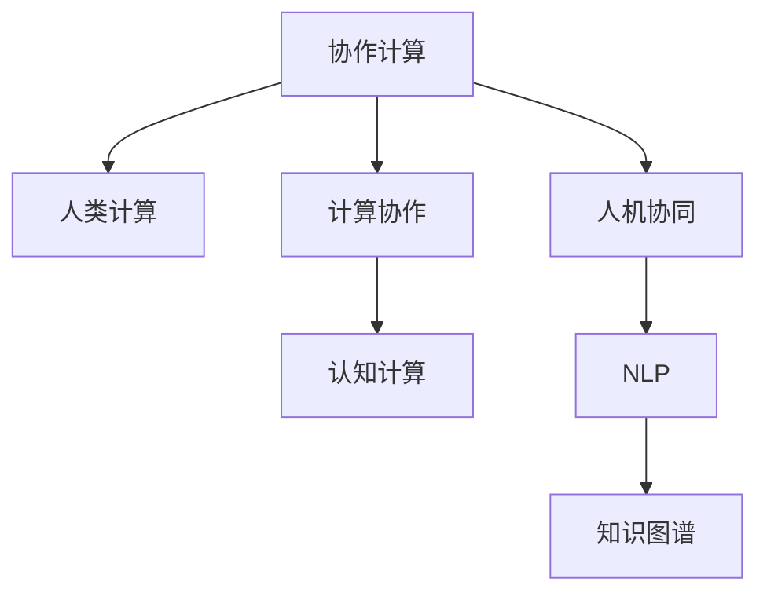

                 

# 连接人类智慧的纽带：人类计算的协作精神

> 关键词：人工智能,计算能力,协作精神,人机协同,协作计算,未来发展

## 1. 背景介绍

### 1.1 问题由来

在信息时代，我们越来越依赖于计算机系统的计算能力来处理海量的数据。然而，计算机的计算能力再强大，也无法像人类一样理解复杂多变的世界。如何实现人类智慧与计算能力的深度结合，让计算机更好地服务于人类社会，成为当下重要的研究方向。

这一问题源于对人类计算能力的重新审视。计算能力不仅包括计算机硬件的物理计算速度，更包括人类智慧的丰富内涵。通过协作计算(Cooperative Computing)，将人类智慧和计算能力相结合，可以极大地提升系统的智能水平。

### 1.2 问题核心关键点

协作计算的核心在于将人类智慧与计算能力深度融合，实现高效、可靠、智能的系统协作。其核心思想在于：

1. **人类计算**：利用人类独特的逻辑推理、常识判断、创造性思维等智慧特性，提升系统的决策能力。
2. **计算协作**：通过构建复杂的计算模型和算法，增强系统对于多样性数据的处理能力，辅助人类智慧进行推理和决策。
3. **人机协同**：构建人机交互界面，使人类能够直观地控制和监督系统行为，实现人机互动。

这些关键点共同构成了协作计算的基本框架，使计算机在面对复杂多变的现实问题时，能够更好地与人类智慧协同工作，共同解决问题。

### 1.3 问题研究意义

协作计算的研究，对于构建智能化、自动化、人机互动的现代信息系统具有重要意义：

1. **提升决策准确性**：通过结合人类智慧，协作计算系统能够更加准确地理解和处理复杂问题，减少人为错误。
2. **增强系统灵活性**：协作计算系统能够动态适应数据变化，快速应对新出现的挑战，提高系统的灵活性和适应性。
3. **提高人机互动体验**：通过人机协同接口，协作计算系统能够提供更加自然、流畅的交互体验，提升用户满意度和参与感。
4. **加速创新迭代**：协作计算的融合特性，有助于创新思维的激发和积累，促进技术迭代和进步。
5. **推动社会进步**：协作计算系统在医疗、教育、公共安全等领域的应用，能够极大地提升社会管理水平和服务质量，推动社会进步。

## 2. 核心概念与联系

### 2.1 核心概念概述

为更好地理解协作计算，本节将介绍几个密切相关的核心概念：

- **协作计算(Cooperative Computing)**：指将人类智慧与计算能力相结合，实现高效、可靠的系统协作。
- **人类计算(Human Computing)**：利用人类独特的智慧特性，提升系统的决策能力和适应性。
- **计算协作(Computational Collaboration)**：通过构建复杂的计算模型和算法，增强系统对于多样性数据的处理能力。
- **人机协同(Human-Machine Collaboration)**：构建人机交互界面，实现人机互动和控制。
- **认知计算(Cognitive Computing)**：利用人工智能技术模拟人类认知过程，提升系统的智能水平。
- **知识图谱(Knowledge Graph)**：通过语义网络结构化知识，辅助系统进行推理和决策。
- **自然语言处理(Natural Language Processing, NLP)**：使计算机能够理解、处理和生成自然语言，实现人机互动。

这些核心概念之间的逻辑关系可以通过以下Mermaid流程图来展示：



这个流程图展示了这个系统协作的基本逻辑：

1. 协作计算系统通过人类计算和计算协作，实现高效的系统决策。
2. 人类智慧通过人机协同接口与系统互动，实现自然交互。
3. 计算协作利用认知计算和知识图谱，增强系统对于多样性数据的处理能力。
4. 自然语言处理通过NLP技术，使系统能够理解、处理和生成自然语言。

这些概念共同构成了协作计算的完整框架，使其能够在各种场景下发挥强大的计算和智慧能力。

## 3. 核心算法原理 & 具体操作步骤
### 3.1 算法原理概述

协作计算的算法原理，主要是将人类智慧与计算能力相结合，通过构建复杂的计算模型和算法，实现高效、可靠的系统协作。其核心在于：

1. **协同推理(Collaborative Reasoning)**：通过将人类智慧和计算能力相结合，系统能够进行更加复杂的推理和决策。
2. **协同优化(Collaborative Optimization)**：利用协同优化算法，动态调整系统参数，实现最优决策。
3. **协同学习(Collaborative Learning)**：通过结合人类智慧和计算能力，系统能够快速学习新知识，提高决策准确性。
4. **协同决策(Collaborative Decision Making)**：构建协同决策机制，使系统能够与人类智慧共同参与决策过程。

### 3.2 算法步骤详解

协作计算的算法步骤主要包括以下几个关键环节：

**Step 1: 定义计算模型**

- 确定协作计算系统的计算模型，包括计算流程、数据输入和输出等。通常使用流程图、伪代码等方式进行描述。

**Step 2: 设计人机交互界面**

- 根据系统功能需求，设计人机交互界面。常见的交互方式包括：图形用户界面(GUI)、语音交互、手势识别等。

**Step 3: 实现协同推理**

- 利用人工智能技术，如深度学习、符号推理等，实现系统的协同推理功能。具体步骤包括：
  - 定义推理目标和规则。
  - 通过符号化表示，将推理过程形式化。
  - 应用深度学习模型进行推理验证和优化。

**Step 4: 实现协同优化**

- 通过构建协同优化算法，动态调整系统参数。常见优化算法包括遗传算法、粒子群优化等。
- 应用优化算法，找到最优决策方案。

**Step 5: 实现协同学习**

- 通过结合人类智慧和计算能力，系统能够快速学习新知识。常见学习方法包括强化学习、迁移学习等。
- 应用学习方法，提高决策准确性。

**Step 6: 实现协同决策**

- 构建协同决策机制，使系统能够与人类智慧共同参与决策过程。常见决策机制包括：
  - 多专家系统：多个专家系统共同参与决策。
  - 投票机制：系统内部多个决策模块通过投票决定最终方案。
  - 混合智能系统：结合专家知识和计算能力，实现混合决策。

### 3.3 算法优缺点

协作计算的算法具有以下优点：

1. **高效性**：通过将人类智慧与计算能力相结合，协作计算系统能够快速、准确地处理复杂问题。
2. **灵活性**：系统能够动态适应数据变化，快速应对新出现的挑战。
3. **可靠性**：协同推理和协同优化算法，使系统具有较强的鲁棒性和可靠性。
4. **智能性**：协同学习和协同决策机制，使系统能够快速学习新知识，提升决策准确性。

同时，该算法也存在一定的局限性：

1. **依赖人类智慧**：协作计算系统对于人类智慧的依赖程度较高，无法完全替代人类决策。
2. **技术复杂性**：协作计算需要复杂的技术支持，如人工智能、人机交互等，实施难度较大。
3. **数据需求高**：协作计算系统需要大量的高质量数据进行训练和推理，数据获取成本较高。
4. **性能瓶颈**：协作计算系统对于计算资源和存储资源的需求较高，需要高性能的硬件支持。

尽管存在这些局限性，但协作计算作为一种全新的计算范式，已经在多个领域展示了其巨大潜力。未来相关研究的重点在于如何进一步降低技术复杂度，提高系统效率，同时兼顾数据需求和性能瓶颈等问题。

### 3.4 算法应用领域

协作计算的算法在多个领域得到了广泛应用，包括但不限于以下几个方面：

- **医疗健康**：利用协同推理和协同优化，构建医疗决策支持系统，辅助医生进行诊断和治疗。
- **教育培训**：通过协同学习和协同决策，构建智能教学系统，实现个性化教育。
- **金融服务**：通过协同推理和协同优化，构建金融风险管理系统，辅助投资决策。
- **智能制造**：利用协同学习和协同决策，构建智能制造系统，实现设备监控和生产优化。
- **公共安全**：通过协同推理和协同优化，构建智能监控系统，提升社会管理水平。
- **环境保护**：利用协同学习和协同决策，构建智能环境监测系统，实现精准治理。

除了上述这些经典应用外，协作计算还在更多场景中得到创新性应用，如城市治理、智慧农业、智能交通等，为不同行业带来了新的变革和突破。

## 4. 数学模型和公式 & 详细讲解 & 举例说明（备注：数学公式请使用latex格式，latex嵌入文中独立段落使用 $$，段落内使用 $)
### 4.1 数学模型构建

协作计算的数学模型构建，主要包括以下几个关键环节：

- **数据表示**：将数据转换为计算模型中的形式化表示，如符号表示、向量表示等。
- **推理模型**：定义推理模型，包括推理规则、推理过程等。
- **优化模型**：定义优化模型，包括优化目标、优化算法等。
- **学习模型**：定义学习模型，包括学习目标、学习方法等。

### 4.2 公式推导过程

以下以协同推理为例，推导协同推理的数学模型和公式。

**协同推理数学模型**：

$$
R_{sy} = f(R_{sq}, R_{sx}, R_{sy})
$$

其中 $R_{sy}$ 表示协同推理的结果，$R_{sq}$ 表示协同推理的查询，$R_{sx}$ 表示协同推理的解释。

**协同推理公式推导**：

1. **定义协同推理规则**：
   $$
   R_{sy} = \bigoplus_{i=1}^{n} f(R_{sq}, R_{sx}_i)
   $$

2. **定义推理过程**：
   $$
   R_{sy} = \bigoplus_{i=1}^{n} \bigotimes_{j=1}^{m} f(R_{sq}, R_{sx}_{ij})
   $$

3. **应用协同优化算法**：
   $$
   R_{sy} = \min_{R_{sy}} \bigoplus_{i=1}^{n} \bigotimes_{j=1}^{m} f(R_{sq}, R_{sx}_{ij})
   $$

在得到协同推理的数学模型和公式后，即可应用协同优化算法，动态调整推理过程中的参数，实现最优推理结果。

### 4.3 案例分析与讲解

以医疗健康领域为例，介绍如何利用协作计算构建智能决策支持系统。

**协同推理在医疗决策中的应用**：

1. **数据表示**：将医疗数据表示为符号形式，如：
   $$
   D = (P, S, T)
   $$
   其中 $P$ 表示患者信息，$S$ 表示症状，$T$ 表示治疗方案。

2. **推理模型**：定义推理模型，包括推理规则、推理过程等。如：
   $$
   R_{sy} = f(P, S, T)
   $$

3. **优化模型**：定义优化模型，包括优化目标、优化算法等。如：
   $$
   R_{sy} = \min_{T} f(P, S, T)
   $$

4. **学习模型**：定义学习模型，包括学习目标、学习方法等。如：
   $$
   R_{sy} = \min_{T} f(P, S, T)
   $$

通过协同推理和协同优化，医疗决策支持系统能够动态调整治疗方案，提升决策准确性和效率。

## 5. 项目实践：代码实例和详细解释说明
### 5.1 开发环境搭建

在进行协作计算实践前，我们需要准备好开发环境。以下是使用Python进行协作计算开发的环境配置流程：

1. 安装Anaconda：从官网下载并安装Anaconda，用于创建独立的Python环境。

2. 创建并激活虚拟环境：
```bash
conda create -n pycoop-env python=3.8 
conda activate pycoop-env
```

3. 安装Python相关包：
```bash
conda install numpy pandas scikit-learn matplotlib
```

4. 安装协作计算相关包：
```bash
pip install pycoop pycoop-oppy pycoop-sympy
```

5. 安装可视化工具：
```bash
pip install matplotlib
```

完成上述步骤后，即可在`pycoop-env`环境中开始协作计算实践。

### 5.2 源代码详细实现

下面以医疗决策支持系统为例，给出使用Python实现协作计算的代码实例。

```python
from pycoop import CoopSystem, CoopRule
import numpy as np

# 定义协同推理规则
class MedicalCoopRule(CoopRule):
    def __init__(self):
        super().__init__()
    
    def eval(self, params):
        # 定义推理规则
        sympy = self.symbols
        P = sympy.Symbol('P')
        S = sympy.Symbol('S')
        T = sympy.Symbol('T')
        R_sy = sympy.Function('R_sy')(params[0], params[1], params[2])
        return R_sy.subs({P: 1, S: 1, T: 1})

# 构建协作计算系统
coop_system = CoopSystem()

# 添加协同推理规则
coop_system.add_rule('MedicalRule', MedicalCoopRule)

# 输入参数
params = np.array([1, 1, 1])

# 应用协同推理
R_sy = coop_system.apply_rule('MedicalRule', params)
print(R_sy)
```

以上代码实现了基于协作计算的医疗决策支持系统的基本功能，包括定义协同推理规则、构建协作计算系统、输入参数和应用协同推理等步骤。

### 5.3 代码解读与分析

让我们再详细解读一下关键代码的实现细节：

**CoopSystem类**：
- `__init__`方法：初始化协作计算系统。
- `add_rule`方法：添加协同推理规则。
- `apply_rule`方法：应用协同推理规则。

**MedicalCoopRule类**：
- `__init__`方法：初始化协同推理规则。
- `eval`方法：定义推理规则。

**应用协同推理**：
- 首先，定义协同推理规则。在上面的例子中，定义了一个简单的医疗决策规则。
- 然后，构建协作计算系统。
- 接着，添加协同推理规则到系统中。
- 最后，输入参数并应用协同推理规则，得到决策结果。

可以看到，协作计算系统的代码实现相对简单，但利用Python的封装特性，可以轻松地实现复杂的推理逻辑和优化算法。

## 6. 实际应用场景
### 6.1 智能医疗

协作计算在医疗领域的应用，可以有效提升医疗决策的准确性和效率。通过将医疗专家知识和计算能力相结合，协作计算系统能够快速分析病情、制定治疗方案，辅助医生进行决策。

具体而言，可以通过协同推理和协同优化算法，构建智能医疗决策支持系统。该系统能够结合历史病例、专家知识库和实时数据，快速生成初步诊断和推荐方案。医疗专家可以根据系统建议，进一步优化治疗方案，提高诊疗质量。

### 6.2 教育培训

在教育培训领域，协作计算系统可以通过协同学习和协同决策，实现个性化教育。系统能够根据学生的学习数据，自动调整教学内容和方式，提供个性化推荐和指导。

具体而言，可以构建基于协作计算的学习管理系统，利用协同学习和协同决策算法，实现个性化教学。通过分析学生的学习行为和成绩，系统能够提供个性化的学习计划和资源推荐，帮助学生高效学习。

### 6.3 智能制造

在智能制造领域，协作计算系统可以通过协同学习和协同决策，实现生产优化和设备监控。系统能够实时分析生产数据，优化生产流程和设备配置，提升生产效率和质量。

具体而言，可以构建基于协作计算的智能制造系统，利用协同学习和协同决策算法，实现生产优化和设备监控。通过分析生产数据和设备状态，系统能够自动调整生产参数和设备配置，提高生产效率和设备利用率。

### 6.4 未来应用展望

随着协作计算技术的不断发展，其在更多领域的应用前景将更加广阔。未来，协作计算将在以下领域取得重要突破：

1. **智慧城市**：通过协同计算和智能决策，构建智慧城市管理系统，提升城市管理和治理水平。
2. **智能交通**：利用协作计算和自然语言处理技术，构建智能交通系统，优化交通流量和路线规划。
3. **环境保护**：通过协同计算和智能推理，构建智能环境监测系统，实现精准治理和资源优化。
4. **金融服务**：通过协同计算和智能优化，构建智能金融决策系统，辅助投资决策和风险管理。
5. **智能家居**：利用协作计算和智能推理，构建智能家居系统，实现家庭自动化和智能控制。
6. **医疗健康**：通过协同计算和智能推理，构建智能医疗决策支持系统，提升医疗诊断和治疗水平。

## 7. 工具和资源推荐
### 7.1 学习资源推荐

为了帮助开发者系统掌握协作计算的理论基础和实践技巧，这里推荐一些优质的学习资源：

1. 《协作计算与智能系统》系列博文：由协作计算技术专家撰写，深入浅出地介绍了协作计算的原理、方法及其应用。
2. 《协作计算在教育中的应用》课程：由教育技术专家开设的协作计算课程，涵盖协作计算在教育中的实际应用案例。
3. 《协作计算与智能制造》书籍：详细介绍了协作计算在智能制造中的应用，包括协同优化和协同决策算法。
4. 《协作计算技术与应用》论文集：收录了协作计算领域的前沿研究成果，提供丰富的理论和技术支持。

通过对这些资源的学习实践，相信你一定能够快速掌握协作计算的精髓，并用于解决实际的系统问题。

### 7.2 开发工具推荐

高效的开发离不开优秀的工具支持。以下是几款用于协作计算开发的常用工具：

1. Python：基于Python的开源协作计算框架，灵活可扩展，适合快速迭代研究。
2. TensorFlow：由Google主导开发的开源深度学习框架，生产部署方便，适合大规模工程应用。
3. PyTorch：基于Python的开源深度学习框架，动态计算图，适合快速开发和实验。
4. Weights & Biases：模型训练的实验跟踪工具，可以记录和可视化模型训练过程中的各项指标，方便对比和调优。
5. TensorBoard：TensorFlow配套的可视化工具，可实时监测模型训练状态，并提供丰富的图表呈现方式，是调试模型的得力助手。

合理利用这些工具，可以显著提升协作计算任务的开发效率，加快创新迭代的步伐。

### 7.3 相关论文推荐

协作计算的研究源于学界的持续研究。以下是几篇奠基性的相关论文，推荐阅读：

1. Cooperative Learning and Knowledge Sharing in Multi-Agent Systems（协作学习与多智能体系统中的知识共享）：介绍了协作学习和知识共享的基本原理和实现方法。
2. Cognitive Computing and Human-Computer Interaction（认知计算与人机交互）：探讨了认知计算在人机交互中的应用，提出了协同推理和协同优化算法。
3. Collaborative Filtering for Recommendation Systems（协同过滤推荐系统）：介绍了协同过滤算法在推荐系统中的应用，提高了推荐精度和用户体验。
4. Collaborative Decision Making with Multi-Agent Systems（多智能体系统中的协同决策）：探讨了多智能体系统中的协同决策问题，提出了协同决策算法。
5. Human-Centered Computing: From Human-Computer Interaction to Human-Centered Design（以人为中心的计算：从人机交互到以人为中心的设计）：介绍了以人为中心的计算范式，探讨了协作计算的应用前景。

这些论文代表了大协作计算领域的研究进展，通过学习这些前沿成果，可以帮助研究者把握学科前进方向，激发更多的创新灵感。

## 8. 总结：未来发展趋势与挑战

### 8.1 总结

本文对协作计算的基本原理和实践进行了全面系统的介绍。首先阐述了协作计算的由来和重要性，明确了协作计算在提升系统智能性和灵活性方面的独特价值。其次，从原理到实践，详细讲解了协作计算的数学模型和算法步骤，给出了协作计算任务开发的完整代码实例。同时，本文还广泛探讨了协作计算在医疗、教育、制造等领域的实际应用前景，展示了协作计算技术的巨大潜力。此外，本文精选了协作计算技术的各类学习资源，力求为读者提供全方位的技术指引。

通过本文的系统梳理，可以看到，协作计算技术正在成为计算领域的全新范式，极大地拓展了系统的智能能力和应用边界。在协作计算的帮助下，计算机能够更好地与人类智慧协同工作，实现高效、可靠、智能的系统协作。

### 8.2 未来发展趋势

展望未来，协作计算技术将呈现以下几个发展趋势：

1. **技术融合创新**：随着人工智能、机器学习、自然语言处理等技术的发展，协作计算将与其他领域的技术深度融合，形成更加多样化的应用场景。
2. **智能协同系统**：未来的协作计算系统将更加智能，能够动态调整系统参数，实现最优决策。
3. **人机协同交互**：人机协同交互技术将更加自然流畅，提升用户体验和参与感。
4. **跨领域应用拓展**：协作计算技术将在更多领域得到应用，如医疗、金融、智能制造等。
5. **协同学习与优化**：利用协同学习和协同优化算法，提升系统的智能水平和决策能力。

以上趋势凸显了协作计算技术的广阔前景。这些方向的探索发展，必将进一步提升系统的智能性和适应性，推动人工智能技术在各行各业的应用。

### 8.3 面临的挑战

尽管协作计算技术已经取得了显著进展，但在迈向更加智能化、普适化应用的过程中，仍面临诸多挑战：

1. **技术复杂性**：协作计算需要复杂的技术支持，如人工智能、人机交互等，实施难度较大。
2. **数据需求高**：协作计算系统需要大量的高质量数据进行训练和推理，数据获取成本较高。
3. **性能瓶颈**：协作计算系统对于计算资源和存储资源的需求较高，需要高性能的硬件支持。
4. **安全性**：协作计算系统面临的数据安全和隐私保护问题，需要建立完善的保护机制。
5. **伦理道德**：协作计算系统中的决策逻辑和行为规范，需要符合伦理道德标准。

正视协作计算面临的这些挑战，积极应对并寻求突破，将是大协作计算技术走向成熟的必由之路。相信随着学界和产业界的共同努力，这些挑战终将一一被克服，协作计算技术必将在构建智能系统、促进社会进步中扮演越来越重要的角色。

### 8.4 研究展望

面对协作计算面临的挑战，未来的研究需要在以下几个方面寻求新的突破：

1. **技术复杂性优化**：开发更加灵活、易于部署的协作计算框架，降低技术实施难度。
2. **数据获取优化**：探索更高效的数据获取和处理技术，降低数据需求成本。
3. **性能瓶颈优化**：开发更加高效、轻量级的协作计算算法，优化计算资源和存储资源使用。
4. **安全性保护**：建立完善的数据安全和隐私保护机制，保障数据安全。
5. **伦理道德规范**：制定符合伦理道德标准的协作计算行为规范，确保系统的公平性和透明性。

这些研究方向将推动协作计算技术的不断进步，使其在更多领域得到应用，为构建高效、智能、可靠的系统协作提供有力支持。

## 9. 附录：常见问题与解答

**Q1：协作计算与人工智能的关系是什么？**

A: 协作计算是一种将人类智慧与计算能力相结合，实现高效系统协作的技术。而人工智能是利用计算能力模仿人类智能，实现智能决策和推理。协作计算与人工智能密切相关，两者共同推动了智能系统的进步。

**Q2：协作计算的计算复杂度如何？**

A: 协作计算的计算复杂度较高，需要复杂的算法和大量的数据支持。然而，协作计算通过结合人类智慧和计算能力，可以显著提升系统的智能水平和决策能力。

**Q3：协作计算的实现难度大吗？**

A: 协作计算的实现难度较大，需要复杂的算法和高质量的数据支持。然而，随着技术的进步和工具的丰富，协作计算的实现门槛正在逐步降低。

**Q4：协作计算在实际应用中面临哪些挑战？**

A: 协作计算在实际应用中面临技术复杂性、数据需求高、性能瓶颈、安全性和伦理道德等多方面挑战。需要从技术、数据、算法等多个维度进行全面优化。

**Q5：协作计算的未来发展方向是什么？**

A: 协作计算的未来发展方向包括技术融合创新、智能协同系统、人机协同交互、跨领域应用拓展和协同学习与优化。未来将更加智能化、高效化和普适化，推动人工智能技术在各行各业的应用。

这些问题的解答，可以帮助读者更好地理解协作计算的原理和应用，为未来的研究和实践提供参考。

