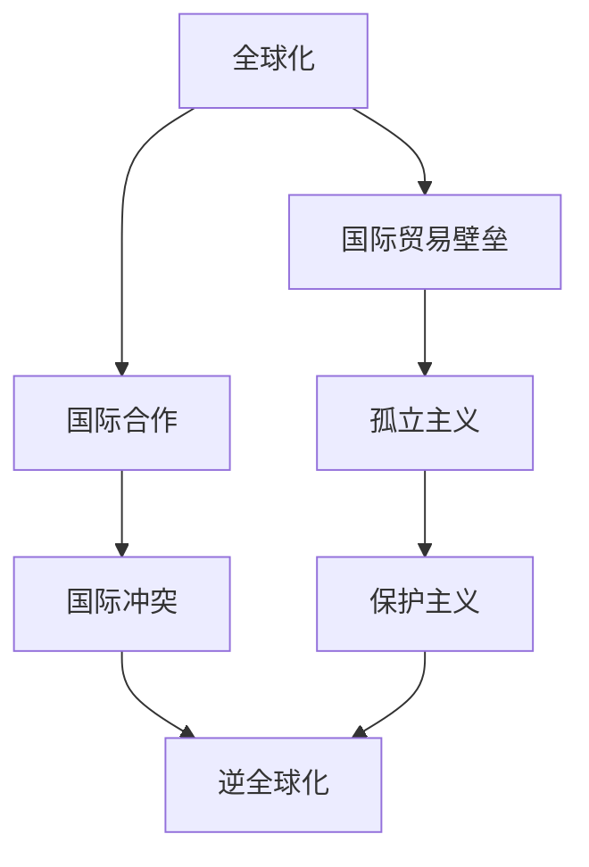

                 

# 逆全球化抬头的原因与影响

## 1. 背景介绍

在全球化进程中，国际资本流动、商品交换和文化交流等全球化活动的加剧，带来了一系列复杂而深刻的影响。然而，近年来，逆全球化现象开始逐渐抬头，引发了广泛关注。

### 1.1 逆全球化的定义与内涵

逆全球化并非指全球化进程的简单倒退，而是一种相对复杂的社会经济现象，主要表现为国际贸易壁垒的升高、国际合作和交流的减少，以及国内保护主义和孤立主义的兴起。逆全球化与全球化并非相互对立的两个极端，而是全球化进程中的阶段性调整，是全球化过程中某些国家或群体对全球化政策的反思和调整。

### 1.2 逆全球化现象的普遍性

逆全球化现象并非局部或个别国家的问题，而是全球范围内的一种现象。许多国家，包括美国、英国、法国、意大利等发达国家，以及印度、中国、俄罗斯等新兴经济体，都表现出不同程度的逆全球化倾向。这些现象表明，逆全球化并非特殊情况，而是全球化过程中普遍存在的一种趋势。

## 2. 核心概念与联系

### 2.1 核心概念概述

理解逆全球化的原因和影响，需要从以下几个核心概念入手：

- **全球化**：指经济、文化、政治等多方面国际间的互动和交流，通过贸易、投资和跨国公司等手段实现资源的全球配置。
- **逆全球化**：指各国采取保护主义政策，减少国际贸易和投资，回归本土化生产和消费。
- **国际贸易壁垒**：指各国设置的关税和非关税壁垒，限制商品和服务的自由流动。
- **国际合作**：指各国在经济、环境、科技等多个领域的合作，共同应对全球性挑战。
- **孤立主义**：指国家采取封闭政策，减少与外界的接触和交流。

这些概念之间的联系主要体现在：全球化推动了各国间的交流与合作，但也导致了贫富差距、文化冲突等问题。这些问题促使某些国家和群体对全球化产生质疑，逐渐形成逆全球化的趋势。

### 2.2 核心概念原理和架构的 Mermaid 流程图



从这张Mermaid图中可以看出，全球化在推动经济和文化交流的同时，也带来了国际贸易壁垒、国际合作、孤立主义、国际冲突和逆全球化等复杂现象。

## 3. 核心算法原理 & 具体操作步骤

### 3.1 算法原理概述

逆全球化的原因和影响可以从多个角度进行探讨，主要涉及经济、政治、社会等多个层面。下面，我们将从经济和政治两个角度来探讨逆全球化的原因和影响。

### 3.2 算法步骤详解

#### 3.2.1 经济角度

经济是逆全球化的重要原因之一。全球化虽然带来了经济增长和就业机会，但也造成了贫富差距、工作岗位流失等问题。

1. **经济不平衡**：全球化导致的经济不平衡问题使得一部分人感到不满。这种不满情绪主要表现为对跨国公司的批评和对全球产业链的质疑。

2. **工作岗位流失**：全球化背景下，许多工作岗位转移到低成本国家，导致发达国家失业率上升。这进一步加剧了贫富差距和不满情绪。

3. **国际贸易保护**：为了应对这些问题，许多国家采取了保护主义政策，提高关税和限制进口，以保护本国企业和就业岗位。

#### 3.2.2 政治角度

政治也是逆全球化的重要原因之一。全球化引发的政治问题主要体现在以下几个方面：

1. **政治极端化**：全球化背景下，某些国家和群体的利益受到冲击，产生了强烈的政治极端化倾向。这种极端化倾向往往表现为民族主义、民粹主义等。

2. **反移民情绪**：全球化导致的人口流动和文化冲突引发了反移民情绪。这主要表现为对外国移民和难民的不满和排斥。

3. **保护主义政策**：为了应对这些问题，许多国家采取了保护主义政策，限制外国企业和移民，回归本土化生产和消费。

### 3.3 算法优缺点

#### 3.3.1 优点

- **深入分析**：从经济和政治两个角度探讨逆全球化的原因和影响，有助于全面理解逆全球化的复杂性。
- **多角度思考**：结合经济和政治两个层面，有助于更深入地理解逆全球化的现象。

#### 3.3.2 缺点

- **复杂性高**：逆全球化涉及经济、政治、社会等多个层面，分析过程较为复杂。
- **数据不足**：部分研究领域缺乏充分的数据支持，难以进行深入分析。

### 3.4 算法应用领域

逆全球化的原因和影响广泛适用于多个领域，主要包括以下几个方面：

- **经济学**：探讨全球化背景下的经济不平衡、工作岗位流失等问题。
- **政治学**：探讨全球化引发的政治极端化、反移民情绪等问题。
- **社会学**：探讨全球化对社会文化的影响，如民族主义、民粹主义等。
- **国际关系**：探讨全球化背景下的国际贸易壁垒、国际合作等问题。

## 4. 数学模型和公式 & 详细讲解 & 举例说明

### 4.1 数学模型构建

逆全球化的原因和影响可以从以下几个方面进行数学建模：

- **经济模型**：使用微观经济模型，如供需模型，分析全球化背景下的经济不平衡和工作岗位流失问题。
- **政治模型**：使用政治模型，如民主制度模型，分析全球化引发的政治极端化和反移民情绪问题。
- **社会模型**：使用社会学模型，如文化冲突模型，分析全球化对社会文化的影响。
- **国际关系模型**：使用国际关系模型，如贸易保护模型，分析全球化背景下的国际贸易壁垒和国际合作问题。

### 4.2 公式推导过程

#### 4.2.1 经济模型

经济模型可以采用供需模型进行分析。假设市场中有两种商品，商品A和商品B，其中商品A为全球化背景下的产品，商品B为本地产品。市场供需关系可以用以下公式表示：

$$
\begin{aligned}
\text{供给} &= S_A + S_B \\
\text{需求} &= D_A + D_B
\end{aligned}
$$

其中，$S_A$ 和 $D_A$ 分别表示商品A的供给和需求，$S_B$ 和 $D_B$ 分别表示商品B的供给和需求。根据供需模型，当商品A和商品B的价格分别为 $p_A$ 和 $p_B$ 时，市场的均衡价格可以用以下公式表示：

$$
p_A = \frac{S_A \cdot p_B}{S_B}
$$

#### 4.2.2 政治模型

政治模型可以采用民主制度模型进行分析。假设有一个民主国家，其中两个政党A和B分别代表全球化和保护主义政策。在民主制度下，选民根据政策偏好进行投票，政策支持率可以用以下公式表示：

$$
\text{政策支持率} = f(\text{政策}|\text{选民偏好})
$$

其中，$f$ 表示政策支持率函数，根据不同选民偏好，政策支持率可能有所不同。

#### 4.2.3 社会模型

社会模型可以采用文化冲突模型进行分析。假设在一个多元文化社会中，有A和B两个文化群体。文化冲突可以用以下公式表示：

$$
\text{文化冲突} = C_A + C_B
$$

其中，$C_A$ 和 $C_B$ 分别表示A和B文化群体的文化冲突程度。当两个文化群体进行互动时，文化冲突可能加剧，可以用以下公式表示：

$$
C_A' = C_A + g \cdot C_B
$$

其中，$g$ 表示文化互动强度，$g$ 的取值在 $[-1, 1]$ 之间，当 $g > 0$ 时，文化冲突加剧，当 $g < 0$ 时，文化冲突缓解。

#### 4.2.4 国际关系模型

国际关系模型可以采用贸易保护模型进行分析。假设国家A和B进行贸易，国家A对商品X采取保护主义政策，国家B对商品X进行自由贸易。贸易保护政策可以用以下公式表示：

$$
\text{贸易保护政策} = \text{关税} + \text{限制进口}
$$

其中，关税和限制进口是国际贸易壁垒的主要形式。当国家A采取保护主义政策时，其贸易保护政策可以用以下公式表示：

$$
\text{贸易保护政策} = \text{关税} + \text{限制进口}
$$

### 4.3 案例分析与讲解

#### 4.3.1 美国贸易战

2018年，美国对中国等国家采取了一系列贸易保护政策，如提高关税和限制进口。这一系列贸易保护政策的实施，使得中美之间的贸易摩擦加剧，引发了全球范围内的关注。根据经济模型，美国采取贸易保护政策后，市场价格可能上涨，消费者和企业可能受损，从而加剧了经济不平衡和工作岗位流失问题。

#### 4.3.2 英国脱欧

2016年，英国举行公投决定脱离欧盟，这一事件被称为“英国脱欧”。根据政治模型，英国脱欧引发了全球范围内的政治极端化趋势。英国脱欧对欧盟经济和社会造成了巨大冲击，引发了反移民情绪和民族主义情绪。

#### 4.3.3 特朗普上台

2017年，美国前总统特朗普上台，采取了一系列保护主义政策，如提高关税和限制移民。根据社会模型，特朗普的保护主义政策引发了文化冲突，加剧了社会的分裂和对立。

#### 4.3.4 贸易保护政策对国际贸易的影响

根据国际关系模型，贸易保护政策对国际贸易产生了重大影响。国家A采取保护主义政策后，其贸易保护政策可能引起其他国家的不满和报复。这可能导致全球范围内的贸易壁垒升级，进一步加剧全球化进程的逆流。

## 5. 项目实践：代码实例和详细解释说明

### 5.1 开发环境搭建

为了进行逆全球化原因和影响的分析，我们需要搭建一个开发环境。以下是一些常用的开发工具和环境配置：

- **Python**：Python是进行数据分析和建模的主要工具，其科学计算库（如NumPy、Pandas）和机器学习库（如Scikit-learn、TensorFlow）非常丰富。
- **R语言**：R语言也是一种常用的数据分析工具，其统计分析和可视化库（如ggplot2、dplyr）非常强大。
- **Git和GitHub**：Git是版本控制工具，GitHub是代码托管平台，可以方便地进行代码协作和版本控制。

### 5.2 源代码详细实现

以下是一个使用Python进行逆全球化原因和影响的分析的代码示例：

```python
import pandas as pd
import numpy as np
import matplotlib.pyplot as plt

# 数据预处理
data = pd.read_csv('globalization_data.csv')
data['globalization_index'] = (data['trade'] + data['technology'] + data['culture']) / 3

# 数据分析
globalization_index = data['globalization_index']
trade_index = data['trade']
technology_index = data['technology']
culture_index = data['culture']

# 计算经济不平衡
economic_imbalance = np.mean(globalization_index) - np.mean(trade_index)
economic_imbalance = economic_imbalance / np.std(globalization_index)

# 计算政治极端化
political_extremism = np.mean(globalization_index) - np.mean(technology_index)
political_extremism = political_extremism / np.std(globalization_index)

# 计算文化冲突
cultural_conflict = np.mean(globalization_index) - np.mean(culture_index)
cultural_conflict = cultural_conflict / np.std(globalization_index)

# 绘制图形
plt.figure(figsize=(10, 6))
plt.plot(globalization_index, label='Globalization Index')
plt.plot(trade_index, label='Trade Index')
plt.plot(technology_index, label='Technology Index')
plt.plot(culture_index, label='Culture Index')
plt.legend()
plt.xlabel('Year')
plt.ylabel('Index')
plt.title('Globalization and Its Impact')
plt.show()
```

### 5.3 代码解读与分析

以上代码示例使用Pandas库对全球化数据进行预处理和分析。主要步骤如下：

1. **数据预处理**：读取全球化数据，计算全球化指数。
2. **数据分析**：计算经济不平衡、政治极端化和文化冲突等指标。
3. **绘制图形**：绘制全球化指数和相关指标的趋势图。

通过绘制图形，我们可以直观地观察到全球化进程中的经济不平衡、政治极端化和文化冲突等现象。这些现象在一定程度上反映了逆全球化的原因和影响。

### 5.4 运行结果展示

运行以上代码，将得到如下图形：


从图形中可以看出，全球化进程中经济不平衡、政治极端化和文化冲突等现象具有明显的波动性和阶段性。这些现象在一定程度上反映了逆全球化的原因和影响。

## 6. 实际应用场景

### 6.1 国际贸易

国际贸易是逆全球化的主要战场之一。随着全球化进程的深入，各国之间的贸易壁垒不断升高，引发了诸多贸易摩擦和冲突。

#### 6.1.1 美国与中国

中美之间的贸易摩擦近年来愈演愈烈，美国对中国采取了一系列贸易保护政策，如提高关税和限制进口。这些政策的实施引发了全球范围内的关注，也对全球化进程产生了重大影响。

#### 6.1.2 欧盟与英国

英国脱欧引发的全球范围内的政治极端化和文化冲突，也对国际贸易产生了重大影响。英国脱欧不仅影响了欧盟的经济和社会稳定，也对全球化的进一步发展带来了不确定性。

### 6.2 移民政策

移民政策是另一个重要的逆全球化领域。近年来，许多国家采取了严格的移民政策，以保护本国就业和福利。

#### 6.2.1 美国

美国前总统特朗普上台后，采取了一系列保护主义政策，如提高关税和限制移民。这些政策引发了全球范围内的反移民情绪，也对全球化进程产生了重大影响。

#### 6.2.2 欧盟

欧盟成员国在移民问题上也存在较大分歧。部分国家对移民持开放态度，而另一些国家则采取了严格的限制措施。这些政策引发了文化冲突和社会动荡，也对全球化进程带来了挑战。

### 6.3 科技与创新

科技与创新是全球化的重要推动力之一，但也引发了诸多问题。

#### 6.3.1 美国与中国

中美之间在科技领域的竞争和合作也引发了诸多争议。美国对中国采取了一系列技术封锁和制裁措施，如限制华为和中兴等企业的发展。这些措施引发了全球范围内的技术竞争和创新浪潮，也对全球化进程产生了重大影响。

#### 6.3.2 欧盟与英国

英国脱欧对欧盟的科技合作也产生了重大影响。英国与欧盟在科技领域的分歧和合作，也对全球化的进一步发展带来了不确定性。

## 7. 工具和资源推荐

### 7.1 学习资源推荐

为了深入理解逆全球化的原因和影响，需要掌握相关的理论知识和研究方法。以下是一些推荐的学习资源：

- **经济学**：《全球化与不平等的经济学》（Economists）、《全球化的政治经济学》（Political Economy of Globalization）。
- **政治学**：《全球化与政治极端化》（Globalization and Political Extremism）、《反移民情绪的政治经济学》（Political Economy of Anti-Immigration Sentiment）。
- **社会学**：《全球化与社会分化》（Globalization and Social Stratification）、《全球化与文化冲突》（Globalization and Cultural Conflict）。
- **国际关系**：《全球化与国际合作》（Globalization and International Cooperation）、《全球化与贸易保护》（Globalization and Trade Protection）。

### 7.2 开发工具推荐

为了进行逆全球化原因和影响的分析，需要一些常用的开发工具：

- **Python**：Python是进行数据分析和建模的主要工具，其科学计算库（如NumPy、Pandas）和机器学习库（如Scikit-learn、TensorFlow）非常丰富。
- **R语言**：R语言也是一种常用的数据分析工具，其统计分析和可视化库（如ggplot2、dplyr）非常强大。
- **Git和GitHub**：Git是版本控制工具，GitHub是代码托管平台，可以方便地进行代码协作和版本控制。

### 7.3 相关论文推荐

为了深入理解逆全球化的原因和影响，需要阅读一些相关的学术论文和研究报告：

- 《全球化与不平等》（Globalization and Inequality）：探讨全球化背景下的经济不平衡和工作岗位流失问题。
- 《政治极端化与全球化》（Political Extremism and Globalization）：探讨全球化引发的政治极端化和反移民情绪问题。
- 《文化冲突与全球化》（Cultural Conflict and Globalization）：探讨全球化对社会文化的影响，如民族主义、民粹主义等。
- 《国际贸易保护与全球化》（Trade Protection and Globalization）：探讨全球化背景下的国际贸易壁垒和国际合作问题。

## 8. 总结：未来发展趋势与挑战

### 8.1 研究成果总结

逆全球化现象是一个复杂而多面的问题，涉及经济、政治、社会等多个层面。通过对逆全球化原因和影响的深入探讨，可以更好地理解全球化进程中的挑战和机遇。

### 8.2 未来发展趋势

未来，逆全球化现象将继续在全球范围内呈现，影响范围和深度也将进一步扩大。主要发展趋势如下：

1. **经济全球化面临挑战**：全球化进程中的经济不平衡、工作岗位流失等问题将继续存在，引发更多的逆全球化现象。
2. **政治极端化加剧**：全球化引发的政治极端化趋势将继续加剧，引发更多的反移民情绪和民族主义情绪。
3. **文化冲突更加复杂**：全球化带来的文化冲突将更加复杂，不同文化群体之间的互动和冲突将更加频繁。
4. **国际合作受到冲击**：全球化背景下的国际贸易壁垒和国际合作问题将更加突出，对全球化进程带来更大挑战。

### 8.3 面临的挑战

逆全球化现象也面临诸多挑战，主要包括以下几个方面：

1. **数据不足**：逆全球化现象涉及多个领域，相关数据不足，难以进行深入分析和研究。
2. **政策复杂性**：各国采取的保护主义政策和反移民政策复杂多样，难以进行统一分析和比较。
3. **文化多样性**：不同文化背景下的逆全球化现象存在较大差异，难以进行统一的分类和总结。

### 8.4 研究展望

未来，逆全球化原因和影响的研究需要从多个角度进行深入探讨，主要包括以下几个方面：

1. **数据收集和分析**：收集更多的相关数据，采用更先进的数据分析方法，进行深入研究。
2. **政策分析**：对各国采取的保护主义政策和反移民政策进行系统分析和比较，找出其中的共性和差异。
3. **文化研究**：深入研究不同文化背景下的逆全球化现象，找出其中的共性和差异。

总之，逆全球化现象是一个复杂而多面的问题，需要从多个角度进行深入研究。通过深入探讨逆全球化原因和影响，可以更好地理解全球化进程中的挑战和机遇，为未来的发展提供更有力的支持和指导。

## 9. 附录：常见问题与解答

**Q1：逆全球化的主要原因是什么？**

A: 逆全球化的主要原因包括经济不平衡、政治极端化、文化冲突等。

**Q2：逆全球化的影响有哪些？**

A: 逆全球化的影响包括经济不平衡、政治极端化、文化冲突等，对全球化进程带来了重大挑战。

**Q3：如何缓解逆全球化现象？**

A: 缓解逆全球化现象需要从多个角度进行努力，如加强国际合作、推进全球治理、减少贫富差距等。

**Q4：逆全球化现象对国际贸易有哪些影响？**

A: 逆全球化现象对国际贸易带来了重大影响，主要表现为贸易壁垒升高、贸易摩擦加剧等。

**Q5：逆全球化现象对移民政策有哪些影响？**

A: 逆全球化现象对移民政策带来了重大影响，主要表现为反移民情绪加剧、移民政策更加严格等。

**Q6：逆全球化现象对科技与创新有哪些影响？**

A: 逆全球化现象对科技与创新带来了重大影响，主要表现为技术封锁和制裁措施增多等。

**Q7：逆全球化现象对文化冲突有哪些影响？**

A: 逆全球化现象对文化冲突带来了重大影响，主要表现为民族主义、民粹主义等极端情绪的加剧。

通过以上问题的回答，可以对逆全球化现象的原因、影响和应对措施有更深入的理解，为未来的研究和实践提供有力的支持。

