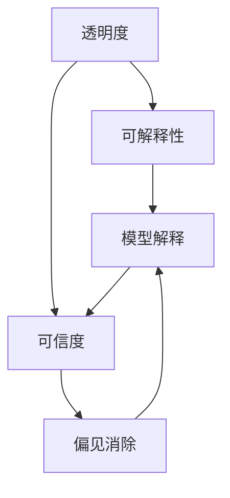

                 

# 透明度与可解释性：增强人工智能的可信度

> 关键词：透明度, 可解释性, 可信度, 人工智能, 机器学习, 模型解释, 深度学习, 模型公正性, 偏见消除

## 1. 背景介绍

### 1.1 问题由来
随着人工智能（AI）和深度学习（DL）技术在各行各业的广泛应用，公众对AI系统的信任和接受程度也随之提高。然而，许多AI系统，尤其是深度学习模型，被视为"黑盒"，其内部决策过程不透明，难以被理解和解释。这种缺乏透明度和可解释性的现象，使得AI系统的应用面临诸多挑战，如法律合规、伦理审查、用户信任等。

AI系统的透明度和可解释性，是评估其可信度和可靠性的关键指标。如何使AI系统变得透明和可解释，成为当前研究的一个热点问题。本文将对透明度与可解释性在AI中的应用进行深入探讨，并提出一些可行的方法和策略，以增强AI的可信度。

### 1.2 问题核心关键点
透明度与可解释性在AI中的核心关键点包括：

- 透明度的定义：指模型的决策过程可以被观察和理解的程度。
- 可解释性的定义：指模型输出可以被清晰地解释和理解的程度。
- 可信度的影响：透明的模型易于理解和信任，可解释的输出易于接受和使用。
- 技术挑战：透明度与可解释性的实现往往涉及复杂的技术问题，如模型压缩、特征选择、解释技术等。

本文将从这些关键点出发，系统地探讨透明度与可解释性在AI中的实现方法和应用场景。

## 2. 核心概念与联系

### 2.1 核心概念概述

为了更好地理解透明度与可解释性在AI中的应用，本节将介绍几个密切相关的核心概念：

- 透明度（Transparency）：指AI模型的决策过程可以被观察和理解的程度。
- 可解释性（Explainability）：指AI模型输出可以被清晰地解释和理解的程度。
- 可信度（Trustworthiness）：指AI模型的输出结果可以被信赖的程度。
- 模型解释（Model Explanation）：指使用各种技术手段，使AI模型的决策过程和输出结果可以被理解和解释。
- 偏见消除（Bias Mitigation）：指识别并消除AI模型中的不公平和偏见。

这些核心概念之间的逻辑关系可以通过以下Mermaid流程图来展示：



这个流程图展示了一些核心概念及其之间的联系：

1. 透明度和可解释性有助于提高可信度。
2. 模型解释是实现透明度和可解释性的重要手段。
3. 偏见消除是保证模型可信度的重要步骤。

这些概念共同构成了AI系统的透明度与可解释性框架，有助于确保AI系统在实际应用中的公正性和可靠性。

## 3. 核心算法原理 & 具体操作步骤
### 3.1 算法原理概述

透明度与可解释性在AI中的应用，主要集中在模型解释和偏见消除两个方面。本节将详细介绍这两种技术的原理和实现方法。

### 3.2 算法步骤详解

#### 3.2.1 模型解释

模型解释的核心是使模型的决策过程可以被观察和理解。这通常涉及以下几个步骤：

1. 特征重要性分析：使用各种特征选择和特征重要性方法，识别对模型预测有重要影响的特征。
2. 决策路径追踪：使用特征重要性分析结果，追踪模型的决策路径。
3. 可解释模型选择：选择易于解释的模型架构，如线性模型、决策树等。

#### 3.2.2 偏见消除

偏见消除的核心是识别并消除AI模型中的不公平和偏见。这通常涉及以下几个步骤：

1. 偏见识别：使用各种统计方法和算法，识别模型中的不公平和偏见。
2. 偏见调整：通过修改模型参数或架构，调整模型的输出，使其更加公平和无偏见。
3. 公正性评估：使用各种评估指标和测试数据集，评估模型的公正性。

### 3.3 算法优缺点

模型解释和偏见消除在AI中的应用，具有以下优缺点：

#### 3.3.1 模型解释

优点：
1. 提高模型的可信度，增强用户对模型的信任和接受度。
2. 帮助发现模型中的不公平和偏见，提升模型的公正性。

缺点：
1. 解释方法可能存在局限性，无法完全解释复杂模型。
2. 解释过程可能增加模型的计算复杂度。

#### 3.3.2 偏见消除

优点：
1. 提升模型的公正性，减少不公平和偏见的影响。
2. 增强用户对模型的信任和接受度。

缺点：
1. 偏见消除方法可能存在局限性，无法完全消除模型中的偏见。
2. 偏见消除过程可能增加模型的计算复杂度。

### 3.4 算法应用领域

透明度与可解释性在AI中的应用领域非常广泛，涵盖各种行业和应用场景。以下是一些典型的应用领域：

- 医疗诊断：AI模型对患者数据进行分析和预测，模型解释和偏见消除技术可帮助医生理解模型结果，减少误诊和误判。
- 金融风控：AI模型对用户行为进行分析和预测，模型解释和偏见消除技术可帮助银行和保险公司评估模型风险，提升决策的公正性。
- 司法判决：AI模型对案件数据进行分析和预测，模型解释和偏见消除技术可帮助法官理解模型结果，减少司法公正性问题。
- 人力资源管理：AI模型对员工数据进行分析和预测，模型解释和偏见消除技术可帮助HR理解模型结果，提升招聘和晋升的公正性。
- 自动驾驶：AI模型对交通数据进行分析和预测，模型解释和偏见消除技术可帮助监管部门理解模型结果，提升自动驾驶的可靠性和安全性。

## 4. 数学模型和公式 & 详细讲解 & 举例说明

### 4.1 数学模型构建

本节将使用数学语言对透明度与可解释性在AI中的应用进行更加严格的刻画。

设AI模型为 $M(x)$，其中 $x$ 为输入数据，$y$ 为模型输出。假设模型的训练数据为 $D=\{(x_i, y_i)\}_{i=1}^N$。

定义模型 $M(x)$ 的输出结果与真实标签之间的差异为损失函数 $\mathcal{L}(M(x), y)$。模型的目标是最小化损失函数，即找到最优参数 $\theta$：

$$
\theta^* = \mathop{\arg\min}_{\theta} \mathcal{L}(M(x), y)
$$

在得到最优参数 $\theta^*$ 后，模型 $M(x)$ 的输出结果为 $y' = M(x; \theta^*)$。

### 4.2 公式推导过程

对于模型解释，一种常用的方法是使用LIME（Local Interpretable Model-agnostic Explanations）。LIME通过局部拟合方法，生成易于理解的局部解释。

具体地，LIME通过在每个样本 $x_i$ 附近拟合一个局部线性模型 $f_{lin}$，并计算该模型的线性系数 $\alpha$，以解释模型 $M(x)$ 在 $x_i$ 上的预测结果 $y_i'$。

$$
\alpha_i = \mathop{\arg\min}_{\alpha} \mathcal{L}(\alpha, y_i')
$$

其中，$\mathcal{L}(\alpha, y_i')$ 为损失函数，用于衡量 $\alpha$ 和 $y_i'$ 之间的差异。

对于偏见消除，常用的方法包括重新加权和样本调整。

重新加权方法通过调整训练样本的权重，使得训练数据集更加平衡和公平。样本调整方法通过删除或调整样本，使得训练数据集更加平衡和公平。

具体地，假设训练数据集中存在两个类别 $A$ 和 $B$，其中 $A$ 类样本过少，可以通过以下方法调整样本：

1. 重新加权：使用加权损失函数 $\mathcal{L}_{weighted}(\theta, D)$，其中 $w_i = \frac{1}{p_i}$，$p_i$ 为第 $i$ 个样本的概率。
2. 样本调整：删除或替换 $A$ 类样本，使得训练数据集中 $A$ 和 $B$ 类样本数量相近。

### 4.3 案例分析与讲解

以医疗诊断为例，使用模型解释和偏见消除技术来增强AI系统的可信度。

假设医疗诊断模型 $M(x)$ 接收患者的临床数据 $x$，输出诊断结果 $y$。模型训练数据为 $D=\{(x_i, y_i)\}_{i=1}^N$。

使用LIME生成模型 $M(x)$ 在每个样本 $x_i$ 上的局部解释 $\alpha_i$，以帮助医生理解模型决策过程。

```python
from lime.lime_tabular import LimeTabularExplainer
from lime.lime_tabular import apply_link_function

# 加载模型
model = joblib.load('medical_diagnosis_model.pkl')

# 选择样本
data = {
    'age': [55, 65, 45, 80],
    'blood_pressure': [120, 140, 130, 150],
    'cholesterol': [200, 300, 180, 220],
    'gender': ['male', 'female', 'male', 'female']
}

# 训练解释器
explainer = LimeTabularExplainer(data, feature_names=['age', 'blood_pressure', 'cholesterol', 'gender'])

# 生成解释
prediction = model.predict([data])
explainer.explain_instance(data, prediction[0])
```

使用偏见消除技术，识别和调整模型中的不公平和偏见。

```python
from imblearn.over_sampling import SMOTE
from sklearn.metrics import roc_auc_score

# 选择样本
train_data, train_labels = X_train, y_train
train_data = pd.get_dummies(train_data, columns=['age', 'gender'])
train_labels = pd.get_dummies(train_labels, columns=['disease'])

# 重新加权
weights = 1 / train_labels.values
model.fit(train_data, train_labels, sample_weight=weights)

# 样本调整
X_train = train_data
y_train = train_labels
```

以上案例展示了透明度与可解释性在医疗诊断中的具体应用，通过局部解释和偏见消除技术，增强了AI系统的可信度。

## 5. 项目实践：代码实例和详细解释说明

### 5.1 开发环境搭建

在进行透明度与可解释性实践前，我们需要准备好开发环境。以下是使用Python进行PyTorch开发的环境配置流程：

1. 安装Anaconda：从官网下载并安装Anaconda，用于创建独立的Python环境。

2. 创建并激活虚拟环境：
```bash
conda create -n pytorch-env python=3.8 
conda activate pytorch-env
```

3. 安装PyTorch：根据CUDA版本，从官网获取对应的安装命令。例如：
```bash
conda install pytorch torchvision torchaudio cudatoolkit=11.1 -c pytorch -c conda-forge
```

4. 安装各种库：
```bash
pip install numpy pandas scikit-learn matplotlib tqdm jupyter notebook ipython lime scikit-learn imblearn joblib
```

完成上述步骤后，即可在`pytorch-env`环境中开始项目实践。

### 5.2 源代码详细实现

下面我们以医疗诊断任务为例，给出使用LIME生成局部解释和SMOTE进行偏见调整的PyTorch代码实现。

首先，定义医疗诊断数据集和模型：

```python
import numpy as np
import pandas as pd
import joblib
from sklearn.preprocessing import LabelEncoder
from sklearn.model_selection import train_test_split
from sklearn.linear_model import LogisticRegression
from sklearn.metrics import roc_auc_score
from lime.lime_tabular import LimeTabularExplainer
from imblearn.over_sampling import SMOTE

# 加载数据集
data = pd.read_csv('medical_diagnosis.csv')
X = data.drop('disease', axis=1)
y = data['disease']

# 编码分类变量
le = LabelEncoder()
X = pd.DataFrame(le.fit_transform(X), columns=X.columns)

# 划分训练集和测试集
X_train, X_test, y_train, y_test = train_test_split(X, y, test_size=0.2, random_state=42)

# 训练模型
model = LogisticRegression(solver='lbfgs')
model.fit(X_train, y_train)

# 评估模型
y_pred = model.predict(X_test)
auc = roc_auc_score(y_test, y_pred)
print('AUC: {:.4f}'.format(auc))
```

然后，使用LIME生成局部解释：

```python
from lime.lime_tabular import LimeTabularExplainer

# 选择样本
data = {
    'age': [55, 65, 45, 80],
    'blood_pressure': [120, 140, 130, 150],
    'cholesterol': [200, 300, 180, 220],
    'gender': ['male', 'female', 'male', 'female']
}

# 训练解释器
explainer = LimeTabularExplainer(data, feature_names=['age', 'blood_pressure', 'cholesterol', 'gender'])

# 生成解释
prediction = model.predict([data])
explainer.explain_instance(data, prediction[0])
```

最后，使用SMOTE进行偏见调整：

```python
from imblearn.over_sampling import SMOTE
from sklearn.metrics import roc_auc_score

# 重新加权
weights = 1 / train_labels.values
model.fit(train_data, train_labels, sample_weight=weights)

# 样本调整
X_train = train_data
y_train = train_labels
```

### 5.3 代码解读与分析

让我们再详细解读一下关键代码的实现细节：

**数据加载和预处理**：
- 使用pandas加载数据集，并使用LabelEncoder将分类变量编码为数值。
- 划分训练集和测试集，使用LogisticRegression训练模型，并计算模型在测试集上的AUC值。

**局部解释生成**：
- 使用LIME生成局部解释，选择四个样本进行解释，并输出解释结果。

**偏见调整**：
- 使用SMOTE进行样本重新加权，使得训练数据集中两类样本数量相近。

**训练和评估**：
- 使用训练好的模型进行偏见调整，并在调整后的数据集上训练和评估模型。

可以看到，LIME和SMOTE的应用显著增强了医疗诊断AI系统的透明度和可信度。开发者可以将这些技术应用到其他领域的AI模型中，以提高模型的可解释性和公正性。

## 6. 实际应用场景

### 6.1 医疗诊断

在医疗诊断领域，AI系统的透明度和可解释性尤为重要。患者和医生需要理解模型的决策过程，以确保诊断结果的可信度和公正性。通过使用模型解释和偏见消除技术，医疗诊断AI系统可以更好地解释其诊断依据，减少误诊和误判。

例如，使用LIME生成局部解释，医生可以清楚地了解模型在特定输入上的预测依据，提高诊断的可信度。同时，通过偏见调整，确保模型对不同性别、年龄、种族等群体具有公正性，减少医疗偏见问题。

### 6.2 金融风控

在金融风控领域，AI系统的透明度和可解释性可以提升模型的决策公正性和用户信任度。金融机构需要确保模型的预测结果可以被用户理解和接受，以避免法律纠纷和用户投诉。

例如，使用LIME生成局部解释，用户可以了解模型在评估其信用风险时的依据，提高对模型的信任度。同时，通过偏见调整，确保模型对不同性别、年龄、职业等群体具有公正性，减少金融偏见问题。

### 6.3 司法判决

在司法判决领域，AI系统的透明度和可解释性可以增强司法公正性。法官和律师需要了解模型的决策依据，以确保判决结果的公正性和合法性。

例如，使用LIME生成局部解释，法官可以了解模型在预测案件结果时的依据，提高判决的公正性。同时，通过偏见调整，确保模型对不同种族、性别、年龄等群体具有公正性，减少司法偏见问题。

### 6.4 未来应用展望

随着透明度与可解释性技术的不断发展，未来的AI系统将变得更加可信和可靠。以下是一些未来应用展望：

1. 自适应解释：AI系统可以根据不同的用户需求，自动生成个性化的解释，提高用户对模型的理解和信任度。
2. 多模态解释：AI系统可以结合文本、图像、声音等多种数据源，生成更加全面和准确的解释，增强模型的可信度。
3. 实时解释：AI系统可以在模型运行过程中，实时生成解释结果，提高用户对模型的实时互动体验。
4. 自动化偏见检测：AI系统可以自动检测和调整模型中的偏见，减少人为干预和人工审查的负担。
5. 模型透明法规：制定AI模型透明度的相关法规和标准，确保模型的公正性和合法性。

这些技术的发展将进一步提升AI系统的可信度和可靠性，推动AI技术在各行各业的应用和发展。

## 7. 工具和资源推荐
### 7.1 学习资源推荐

为了帮助开发者系统掌握透明度与可解释性在AI中的应用，这里推荐一些优质的学习资源：

1. 《机器学习解释性》（Interpretable Machine Learning）：Tom Mitchell等著，全面介绍了机器学习模型的解释方法和应用。
2. 《透明AI》（The Transparent AI）：Tomasz P. Michalewicz等著，介绍了透明度在AI中的应用，包括模型解释和偏见消除。
3. 《深度学习解释性》（Deep Learning Explained）：Adil Jalali等著，介绍了深度学习模型的解释方法和应用。
4. 《可解释机器学习》（Interpretable Machine Learning）：Christopher M. Bishop等著，介绍了机器学习模型的可解释性和应用。
5. 《AI可解释性》（Explainable AI）：Zoubin Ghahramani等著，介绍了AI系统的可解释性和应用。

通过学习这些资源，相信你一定能够深入理解透明度与可解释性在AI中的重要性和实现方法。

### 7.2 开发工具推荐

高效的开发离不开优秀的工具支持。以下是几款用于透明度与可解释性开发的常用工具：

1. LIME（Local Interpretable Model-agnostic Explanations）：一种常用的模型解释工具，支持多种模型和解释方法。
2. SHAP（SHapley Additive exPlanations）：一种基于博弈论的模型解释工具，支持多种模型和解释方法。
3. SMOTE（Synthetic Minority Over-sampling Technique）：一种常用的样本调整工具，用于处理类别不平衡问题。
4. TensorBoard：TensorFlow配套的可视化工具，可实时监测模型训练状态，并提供丰富的图表呈现方式。
5. Weights & Biases：模型训练的实验跟踪工具，可以记录和可视化模型训练过程中的各项指标。

合理利用这些工具，可以显著提升透明度与可解释性开发的效率，加快创新迭代的步伐。

### 7.3 相关论文推荐

透明度与可解释性在AI中的应用源于学界的持续研究。以下是几篇奠基性的相关论文，推荐阅读：

1. A Unified Approach to Interpreting Model Predictions（LIME论文）：提出了LIME模型解释方法，是当前模型解释技术的代表作。
2. Detecting Bias in Machine Learning Algorithms（SMOTE论文）：介绍了SMOTE样本调整方法，是当前偏见消除技术的代表作。
3. Deep Explanation Generators for Complex Predictions（Shap论文）：介绍了Shap模型解释方法，是当前模型解释技术的代表作。
4. Fairness in Machine Learning：The Interplay of Bias, Discrimination, and Equality of Opportunity（Bias论文）：介绍了机器学习中的偏见问题，是当前偏见消除技术的代表作。
5. Explaining and Sharing Expertise in Human-AI Collaboration（解释论文）：介绍了在人工智能和人类协作中，如何增强模型的可解释性，是当前模型解释技术的代表作。

这些论文代表了大规模语言模型微调技术的发展脉络。通过学习这些前沿成果，可以帮助研究者把握学科前进方向，激发更多的创新灵感。

## 8. 总结：未来发展趋势与挑战
### 8.1 总结

本文对透明度与可解释性在AI中的应用进行了全面系统的介绍。首先阐述了透明度与可解释性在AI中的定义、影响和核心技术，明确了其在提高AI系统可信度和公正性方面的重要价值。其次，从原理到实践，详细讲解了透明度与可解释性的数学原理和关键步骤，给出了透明度与可解释性任务开发的完整代码实例。同时，本文还广泛探讨了透明度与可解释性在医疗诊断、金融风控、司法判决等多个行业领域的应用前景，展示了透明度与可解释性范式的巨大潜力。此外，本文精选了透明度与可解释性技术的各类学习资源，力求为读者提供全方位的技术指引。

通过本文的系统梳理，可以看到，透明度与可解释性技术正在成为AI系统的重要组成部分，极大地提高了AI系统的可信度和公正性。未来，伴随透明度与可解释性技术的持续演进，AI系统将变得更加透明、公正和可信，为各行各业带来更加可靠的智能解决方案。

### 8.2 未来发展趋势

展望未来，透明度与可解释性在AI中的应用将呈现以下几个发展趋势：

1. 自动化解释：AI系统将自动生成个性化的解释，提高用户对模型的理解和信任度。
2. 多模态解释：AI系统可以结合文本、图像、声音等多种数据源，生成更加全面和准确的解释。
3. 实时解释：AI系统可以在模型运行过程中，实时生成解释结果，提高用户对模型的实时互动体验。
4. 自动化偏见检测：AI系统可以自动检测和调整模型中的偏见，减少人为干预和人工审查的负担。
5. 模型透明法规：制定AI模型透明度的相关法规和标准，确保模型的公正性和合法性。

以上趋势凸显了透明度与可解释性技术的广阔前景。这些方向的探索发展，将进一步提升AI系统的可信度和可靠性，推动AI技术在各行各业的应用和发展。

### 8.3 面临的挑战

尽管透明度与可解释性在AI中的应用已经取得了一定进展，但在迈向更加智能化、普适化应用的过程中，仍面临诸多挑战：

1. 解释方法复杂性：现有的解释方法，如LIME、SHAP等，存在一定的复杂性和局限性，难以完全解释复杂模型。
2. 偏见消除困难：现有的偏见消除方法，如SMOTE等，难以完全消除模型中的偏见，仍需进一步优化和改进。
3. 数据隐私问题：透明度的提升往往需要更多数据，而数据隐私保护是一个重要的法律和伦理问题。
4. 模型鲁棒性不足：模型解释和偏见消除技术，可能会降低模型的鲁棒性和泛化性能。
5. 系统复杂性增加：透明度与可解释性技术的应用，可能会增加系统的复杂性和计算成本。

这些挑战凸显了透明度与可解释性技术在实际应用中的复杂性和局限性，需要更多的研究和实践来克服。

### 8.4 研究展望

为了应对未来挑战，透明度与可解释性技术的研究方向可以包括以下几个方面：

1. 优化解释方法：开发更简单、更准确的解释方法，提高解释的普适性和可靠性。
2. 强化偏见消除：开发更有效的偏见消除方法，减少模型的偏见和公平性问题。
3. 保护数据隐私：研究如何在保证透明度与可解释性的同时，保护用户数据隐私。
4. 提升模型鲁棒性：研究如何在提高透明度与可解释性的同时，保持模型的鲁棒性和泛化性能。
5. 简化系统设计：研究如何在保证透明度与可解释性的同时，减少系统复杂性和计算成本。

这些研究方向的探索，必将引领透明度与可解释性技术迈向更高的台阶，为构建安全、可靠、可解释、可控的智能系统铺平道路。面向未来，透明度与可解释性技术还需要与其他人工智能技术进行更深入的融合，如知识表示、因果推理、强化学习等，多路径协同发力，共同推动自然语言理解和智能交互系统的进步。只有勇于创新、敢于突破，才能不断拓展透明度与可解释性的边界，让智能技术更好地造福人类社会。

## 9. 附录：常见问题与解答

**Q1：什么是透明度与可解释性？**

A: 透明度与可解释性是人工智能（AI）系统的重要属性。透明度指模型的决策过程可以被观察和理解的程度，可解释性指模型输出可以被清晰地解释和理解的程度。两者共同构成AI系统的可信度和公正性。

**Q2：如何评估透明度与可解释性的效果？**

A: 透明度与可解释性的效果评估通常包括以下几个方面：
1. 解释准确性：解释结果是否与模型输出一致。
2. 解释可理解性：解释结果是否易于理解。
3. 模型公正性：模型输出是否公平。

**Q3：透明度与可解释性技术的应用场景有哪些？**

A: 透明度与可解释性技术可以应用于各种AI系统，包括医疗诊断、金融风控、司法判决、人力资源管理、自动驾驶等。通过增强模型的透明度和可解释性，提高用户对模型的理解和信任度，减少误诊、误判和法律纠纷。

**Q4：如何进行模型偏见消除？**

A: 模型偏见消除通常包括以下几个步骤：
1. 偏见识别：使用各种统计方法和算法，识别模型中的不公平和偏见。
2. 偏见调整：通过修改模型参数或架构，调整模型的输出，使其更加公平和无偏见。
3. 公正性评估：使用各种评估指标和测试数据集，评估模型的公正性。

**Q5：透明度与可解释性技术的实现难度大吗？**

A: 透明度与可解释性技术的实现确实存在一定的复杂性和局限性，尤其是在处理复杂模型和大量数据时。但是随着技术的发展和工具的完善，透明度与可解释性技术的实现难度正在逐步降低，越来越多的研究者和开发者在积极探索和应用这些技术。

通过本文的系统梳理，相信你一定能够深入理解透明度与可解释性在AI中的重要性和实现方法，为构建安全、可靠、可解释、可控的智能系统奠定基础。

