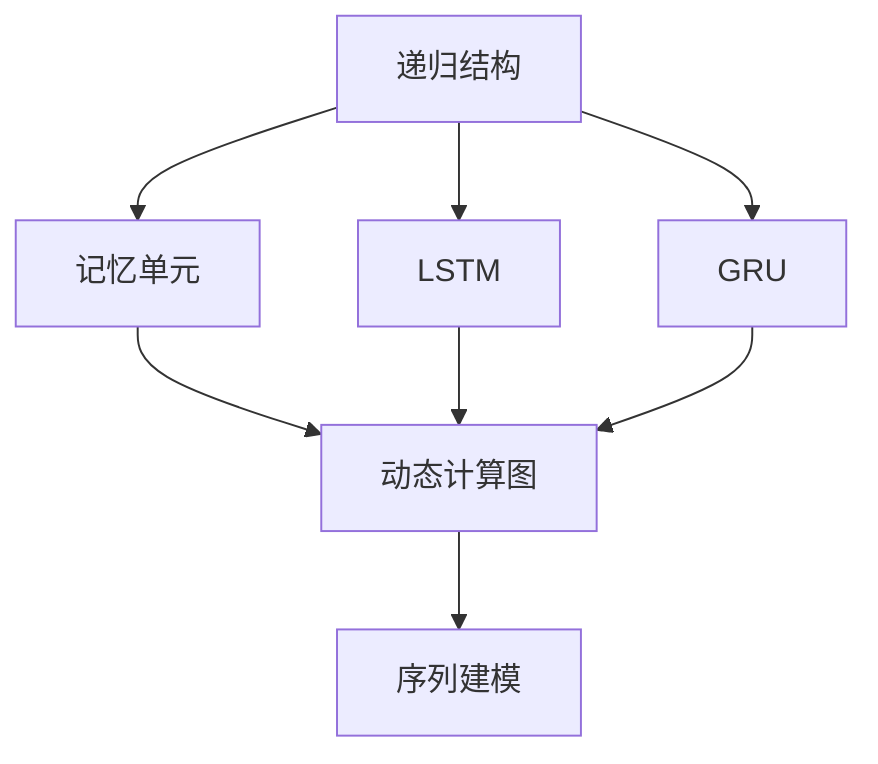

                 

# 递归神经网络 原理与代码实例讲解

## 1. 背景介绍

### 1.1 问题由来
在深度学习的发展历程中，传统的全连接神经网络（Fully Connected Neural Networks）因其强大的建模能力和易于优化性，成为了处理各种任务的主流模型。但全连接网络也存在一些难以避免的问题：

- **参数过多**：全连接网络需要大量的参数来表示网络结构，这在大规模数据集上可能导致过拟合。
- **局部性假定**：全连接网络对输入数据的局部性假定过于严格，难以处理非结构化数据（如文本、图像）的复杂关系。
- **无法建模递归结构**：无法直接处理递归数据结构（如树形结构、图结构），导致这类任务的建模能力有限。

递归神经网络（Recursive Neural Networks, RNNs）就是为了解决这些问题而设计的。RNNs可以自然地处理递归结构，并在序列数据（如时间序列、自然语言）上表现优异。RNNs的应用范围广泛，包括自然语言处理（NLP）、语音识别、图像描述等。

### 1.2 问题核心关键点
递归神经网络的主要核心概念包括：

- **递归结构**：利用递归定义和操作，可以自然地处理树形结构、图结构等非线性关系。
- **记忆单元**：RNNs的内部存在记忆单元（如LSTM、GRU），能够记录和更新长期依赖关系，解决长序列问题。
- **动态计算图**：RNNs使用动态计算图，能够根据输入序列实时调整计算图，处理变长序列。
- **序列建模**：RNNs能够直接对序列数据建模，有效利用数据的时序信息。

这些核心概念共同构成了RNNs的工作原理，使其能够高效地处理递归结构数据，并得到广泛应用。

## 2. 核心概念与联系

### 2.1 核心概念概述

为了更好地理解RNNs的原理，本节将介绍几个密切相关的核心概念：

- **递归结构（Recursive Structure）**：指数据内部存在的层次结构关系，如树形结构、图结构、序列结构等。这些结构可以通过递归方式自然地建模和处理。
- **记忆单元（Memory Unit）**：指能够记录和更新长期依赖信息的单元，如LSTM、GRU等。通过记忆单元，RNNs能够有效解决长序列建模问题。
- **动态计算图（Dynamic Computation Graph）**：指根据输入序列实时调整计算图，处理变长序列的结构。RNNs使用动态计算图，可以自然地处理变长输入。
- **序列建模（Sequence Modeling）**：指对序列数据进行建模，利用数据的时序信息。RNNs通过序列建模，能够直接对序列数据进行预测和生成。

这些核心概念之间的逻辑关系可以通过以下Mermaid流程图来展示：



这个流程图展示了一些核心概念及其之间的关系：

1. 递归结构是RNNs处理的数据特征。
2. 记忆单元是RNNs记录和更新长期依赖关系的关键部件。
3. 动态计算图使RNNs能够处理变长序列。
4. 序列建模使RNNs能够直接对序列数据进行建模和预测。

这些概念共同构成了RNNs的工作原理，使其能够高效地处理递归结构数据，并得到广泛应用。

## 3. 核心算法原理 & 具体操作步骤
### 3.1 算法原理概述

递归神经网络的核心算法原理主要包括以下几个方面：

1. **递归定义**：递归神经网络通过递归定义来建模序列数据，将序列数据看作递归结构的一部分。
2. **记忆单元**：使用记忆单元来记录和更新长期依赖关系，解决长序列建模问题。
3. **动态计算图**：使用动态计算图来处理变长序列，调整计算图以适应输入数据的变化。
4. **序列建模**：直接对序列数据进行建模，利用数据的时序信息。

形式化地，递归神经网络可以定义如下：

设 $(x_1, x_2, ..., x_T)$ 为输入序列，其中 $x_t \in \mathcal{X}, t = 1, ..., T$。$h_t$ 表示在时间步 $t$ 的隐藏状态，$o_t$ 表示时间步 $t$ 的输出。递归神经网络的递归定义如下：

$$
h_t = f(h_{t-1}, x_t)
$$

$$
o_t = g(h_t)
$$

其中 $f$ 和 $g$ 分别为隐藏状态和输出的映射函数，可以使用各种深度学习模块（如全连接层、卷积层、LSTM等）实现。

### 3.2 算法步骤详解

递归神经网络的实现过程主要包括以下几个关键步骤：

**Step 1: 定义网络结构**
- 确定网络的递归层数和每层隐藏单元数。
- 选择合适的记忆单元（如LSTM、GRU等）。
- 设计输入、隐藏状态和输出的映射函数。

**Step 2: 实现递归过程**
- 对输入序列进行遍历，计算每一步的隐藏状态。
- 根据当前时间步的输入和前一步的隐藏状态，使用递归定义计算当前时间步的隐藏状态。
- 将当前时间步的隐藏状态和记忆单元的内部状态更新。

**Step 3: 生成序列输出**
- 根据当前时间步的隐藏状态和输出映射函数，计算当前时间步的输出。
- 对所有时间步的输出进行整合，得到最终的序列输出。

**Step 4: 优化模型**
- 定义损失函数，如交叉熵损失、均方误差等。
- 使用梯度下降等优化算法更新模型参数。
- 周期性在验证集上评估模型性能，根据性能指标决定是否触发Early Stopping。
- 重复上述步骤直到满足预设的迭代轮数或Early Stopping条件。

### 3.3 算法优缺点

递归神经网络具有以下优点：

1. 自然地处理递归结构数据，能够处理树形结构、图结构、序列结构等。
2. 能够记录和更新长期依赖关系，解决长序列建模问题。
3. 使用动态计算图，能够处理变长序列，适应不同长度的输入数据。
4. 能够直接对序列数据进行建模，利用数据的时序信息。

同时，递归神经网络也存在一些局限性：

1. 训练复杂度高。递归神经网络的训练过程相对复杂，特别是在长序列数据上，计算量较大。
2. 难以并行化。由于递归过程的顺序性，难以进行高效的并行计算。
3. 参数较多。递归神经网络的参数较多，容易过拟合。

尽管存在这些局限性，但递归神经网络在处理序列数据和递归结构方面表现优异，仍然是深度学习中的重要模型之一。

### 3.4 算法应用领域

递归神经网络在多个领域中得到了广泛应用，包括：

1. **自然语言处理**：递归神经网络能够处理自然语言中的递归结构，如句法树、依存关系等。
2. **语音识别**：递归神经网络能够处理语音信号的递归结构，如时序变化、音节分割等。
3. **图像描述**：递归神经网络能够对图像进行描述，利用图像的递归结构进行语义理解。
4. **时间序列预测**：递归神经网络能够对时间序列数据进行建模和预测，如股票价格预测、天气预报等。

此外，递归神经网络还在数据挖掘、金融分析、生物信息学等领域中得到了应用。

## 4. 数学模型和公式 & 详细讲解
### 4.1 数学模型构建

递归神经网络的形式化数学模型可以表示为：

设 $(x_1, x_2, ..., x_T)$ 为输入序列，其中 $x_t \in \mathcal{X}, t = 1, ..., T$。$h_t$ 表示在时间步 $t$ 的隐藏状态，$o_t$ 表示时间步 $t$ 的输出。递归神经网络的递归定义如下：

$$
h_t = f(h_{t-1}, x_t)
$$

$$
o_t = g(h_t)
$$

其中 $f$ 和 $g$ 分别为隐藏状态和输出的映射函数，可以使用各种深度学习模块（如全连接层、卷积层、LSTM等）实现。

### 4.2 公式推导过程

以LSTM为例，递归神经网络的具体实现如下：

**输入门（Input Gate）**：

$$
i_t = \sigma(W_i x_t + U_i h_{t-1} + b_i)
$$

**遗忘门（Forget Gate）**：

$$
f_t = \sigma(W_f x_t + U_f h_{t-1} + b_f)
$$

**输出门（Output Gate）**：

$$
o_t = \sigma(W_o x_t + U_o h_{t-1} + b_o)
$$

**候选单元（Candidate Cell）**：

$$
c_t = \tanh(W_c x_t + U_c h_{t-1} + b_c)
$$

**新记忆单元（New Memory Cell）**：

$$
c'_t = f_t \odot c_{t-1} + i_t \odot c_t
$$

**输出**：

$$
h_t = o_t \odot \tanh(c'_t)
$$

其中，$\sigma$ 表示sigmoid函数，$\tanh$ 表示双曲正切函数，$\odot$ 表示逐元素相乘。

### 4.3 案例分析与讲解

以文本分类任务为例，展示如何使用LSTM实现递归神经网络进行微调：

**Step 1: 准备数据集**

假设我们有一个文本分类任务，数据集包含训练集和测试集。每条文本 $x_i$ 由若干个单词 $x_{i1}, x_{i2}, ..., x_{in}$ 组成，每个单词 $x_{ij}$ 表示为一个独热编码向量 $v_{ij} \in \mathbb{R}^d$。

**Step 2: 定义模型结构**

假设我们有一个3层的LSTM，每层包含50个隐藏单元。输入层使用全连接层，输出层使用全连接层，使用softmax函数进行分类。

**Step 3: 实现递归过程**

对输入序列进行遍历，计算每一步的隐藏状态。

```python
def lstm(x, h_prev, cell_prev):
    i = sigmoid(W_i @ x + U_i @ h_prev + b_i)
    f = sigmoid(W_f @ x + U_f @ h_prev + b_f)
    o = sigmoid(W_o @ x + U_o @ h_prev + b_o)
    c = tanh(W_c @ x + U_c @ h_prev + b_c)
    c_prime = f * cell_prev + i * c
    h = o * tanh(c_prime)
    return i, f, o, c, c_prime, h
```

**Step 4: 生成序列输出**

根据当前时间步的隐藏状态和输出映射函数，计算当前时间步的输出。

```python
def get_output(h_t):
    return softmax(W_out @ h_t + b_out)
```

**Step 5: 优化模型**

定义交叉熵损失函数，使用梯度下降等优化算法更新模型参数。

```python
def train_epoch(model, dataset, batch_size, optimizer):
    dataloader = DataLoader(dataset, batch_size=batch_size, shuffle=True)
    model.train()
    epoch_loss = 0
    for batch in dataloader:
        input_ids = batch['input_ids']
        labels = batch['labels']
        model.zero_grad()
        outputs = model(input_ids)
        loss = criterion(outputs, labels)
        loss.backward()
        optimizer.step()
        epoch_loss += loss.item()
    return epoch_loss / len(dataloader)
```

## 5. 项目实践：代码实例和详细解释说明
### 5.1 开发环境搭建

在进行递归神经网络开发前，我们需要准备好开发环境。以下是使用Python进行TensorFlow开发的环境配置流程：

1. 安装Anaconda：从官网下载并安装Anaconda，用于创建独立的Python环境。

2. 创建并激活虚拟环境：
```bash
conda create -n tf-env python=3.8 
conda activate tf-env
```

3. 安装TensorFlow：根据CUDA版本，从官网获取对应的安装命令。例如：
```bash
conda install tensorflow==2.7 -c tf
```

4. 安装Keras：
```bash
pip install keras
```

5. 安装各类工具包：
```bash
pip install numpy pandas scikit-learn matplotlib tqdm jupyter notebook ipython
```

完成上述步骤后，即可在`tf-env`环境中开始递归神经网络的实践。

### 5.2 源代码详细实现

下面我们以文本分类任务为例，给出使用TensorFlow实现递归神经网络的代码实现。

首先，定义文本分类任务的模型结构：

```python
from tensorflow.keras.layers import Input, LSTM, Dense, Embedding
from tensorflow.keras.models import Model
from tensorflow.keras.optimizers import Adam

class TextClassifier(Model):
    def __init__(self, vocab_size, embed_size, hidden_size, num_classes):
        super(TextClassifier, self).__init__()
        
        self.embedding = Embedding(vocab_size, embed_size)
        self.lstm = LSTM(hidden_size, return_sequences=True)
        self.fc = Dense(num_classes, activation='softmax')
        
        inputs = Input(shape=(max_len,), dtype='int32')
        x = self.embedding(inputs)
        x = self.lstm(x)
        x = self.fc(x)
        self.outputs = x
        
        self.compile(optimizer=Adam(), loss='categorical_crossentropy', metrics=['accuracy'])
        
    def call(self, inputs):
        return self.outputs(inputs)
```

然后，定义数据处理函数：

```python
def preprocess(texts, max_len, tokenizer):
    tokenized_texts = tokenizer.tokenize(texts)
    token_ids = tokenizer.convert_tokens_to_ids(tokenized_texts)
    padded_tokens = pad_sequences(token_ids, maxlen=max_len, padding='post')
    label_ids = tokenizer.convert_labels_to_ids(labels)
    return padded_tokens, label_ids
```

接着，定义训练和评估函数：

```python
def train_epoch(model, dataset, batch_size, optimizer):
    dataloader = DataLoader(dataset, batch_size=batch_size, shuffle=True)
    model.train()
    epoch_loss = 0
    for batch in dataloader:
        inputs = batch['inputs']
        labels = batch['labels']
        model.zero_grad()
        outputs = model(inputs)
        loss = model.loss(labels)
        epoch_loss += loss.item()
        loss.backward()
        optimizer.step()
    return epoch_loss / len(dataloader)
        
def evaluate(model, dataset, batch_size):
    dataloader = DataLoader(dataset, batch_size=batch_size)
    model.eval()
    preds, labels = [], []
    with torch.no_grad():
        for batch in dataloader:
            inputs = batch['inputs']
            batch_labels = batch['labels']
            outputs = model(inputs)
            batch_preds = outputs.argmax(dim=1).to('cpu').tolist()
            batch_labels = batch_labels.to('cpu').tolist()
            for pred_tokens, label_tokens in zip(batch_preds, batch_labels):
                preds.append(pred_tokens)
                labels.append(label_tokens)
                
    print(classification_report(labels, preds))
```

最后，启动训练流程并在测试集上评估：

```python
epochs = 5
batch_size = 16

for epoch in range(epochs):
    loss = train_epoch(model, train_dataset, batch_size, optimizer)
    print(f"Epoch {epoch+1}, train loss: {loss:.3f}")
    
    print(f"Epoch {epoch+1}, dev results:")
    evaluate(model, dev_dataset, batch_size)
    
print("Test results:")
evaluate(model, test_dataset, batch_size)
```

以上就是使用TensorFlow实现递归神经网络进行文本分类的完整代码实现。可以看到，TensorFlow提供了丰富的深度学习模块，使得递归神经网络的实现相对简洁。

### 5.3 代码解读与分析

让我们再详细解读一下关键代码的实现细节：

**TextClassifier类**：
- `__init__`方法：初始化模型结构，包括嵌入层、LSTM层、全连接层等。
- `compile`方法：编译模型，定义损失函数、优化器和评价指标。
- `call`方法：定义模型前向传播过程，从输入到输出的计算流程。

**preprocess函数**：
- 对输入文本进行分词和编码，使用Tokenizer将文本转换为token id，并对token进行padding。
- 对标签进行编码，使用Tokenizer将标签转换为id。

**train_epoch函数**：
- 使用DataLoader对数据进行批次化加载，供模型训练使用。
- 在每个批次上前向传播计算loss并反向传播更新模型参数，最后返回该epoch的平均loss。

**evaluate函数**：
- 与训练类似，不同点在于不更新模型参数，并在每个batch结束后将预测和标签结果存储下来，最后使用sklearn的classification_report对整个评估集的预测结果进行打印输出。

**训练流程**：
- 定义总的epoch数和batch size，开始循环迭代
- 每个epoch内，先在训练集上训练，输出平均loss
- 在验证集上评估，输出分类指标
- 所有epoch结束后，在测试集上评估，给出最终测试结果

可以看到，TensorFlow提供了强大的深度学习模块，使得递归神经网络的实现相对简洁。开发者可以将更多精力放在数据处理、模型改进等高层逻辑上，而不必过多关注底层的实现细节。

当然，工业级的系统实现还需考虑更多因素，如模型的保存和部署、超参数的自动搜索、更灵活的任务适配层等。但核心的递归神经网络范式基本与此类似。

## 6. 实际应用场景
### 6.1 智能客服系统

基于递归神经网络的对话技术，可以广泛应用于智能客服系统的构建。传统客服往往需要配备大量人力，高峰期响应缓慢，且一致性和专业性难以保证。而使用递归神经网络进行对话模型训练，可以7x24小时不间断服务，快速响应客户咨询，用自然流畅的语言解答各类常见问题。

在技术实现上，可以收集企业内部的历史客服对话记录，将问题和最佳答复构建成监督数据，在此基础上对递归神经网络进行训练。训练后的对话模型能够自动理解用户意图，匹配最合适的答案模板进行回复。对于客户提出的新问题，还可以接入检索系统实时搜索相关内容，动态组织生成回答。如此构建的智能客服系统，能大幅提升客户咨询体验和问题解决效率。

### 6.2 金融舆情监测

金融机构需要实时监测市场舆论动向，以便及时应对负面信息传播，规避金融风险。传统的人工监测方式成本高、效率低，难以应对网络时代海量信息爆发的挑战。基于递归神经网络的文本分类和情感分析技术，为金融舆情监测提供了新的解决方案。

具体而言，可以收集金融领域相关的新闻、报道、评论等文本数据，并对其进行主题标注和情感标注。在此基础上对递归神经网络进行训练，使其能够自动判断文本属于何种主题，情感倾向是正面、中性还是负面。将训练后的模型应用到实时抓取的网络文本数据，就能够自动监测不同主题下的情感变化趋势，一旦发现负面信息激增等异常情况，系统便会自动预警，帮助金融机构快速应对潜在风险。

### 6.3 个性化推荐系统

当前的推荐系统往往只依赖用户的历史行为数据进行物品推荐，无法深入理解用户的真实兴趣偏好。基于递归神经网络的序列建模技术，个性化推荐系统可以更好地挖掘用户行为背后的语义信息，从而提供更精准、多样的推荐内容。

在实践中，可以收集用户浏览、点击、评论、分享等行为数据，提取和用户交互的物品标题、描述、标签等文本内容。将文本内容作为模型输入，用户的后续行为（如是否点击、购买等）作为监督信号，在此基础上对递归神经网络进行训练。训练后的模型能够从文本内容中准确把握用户的兴趣点。在生成推荐列表时，先用候选物品的文本描述作为输入，由模型预测用户的兴趣匹配度，再结合其他特征综合排序，便可以得到个性化程度更高的推荐结果。

### 6.4 未来应用展望

随着递归神经网络技术的不断发展，其在处理序列数据和递归结构方面表现优异，将会在更多领域得到应用，为传统行业带来变革性影响。

在智慧医疗领域，基于递归神经网络的医学问答、病历分析、药物研发等应用将提升医疗服务的智能化水平，辅助医生诊疗，加速新药开发进程。

在智能教育领域，递归神经网络可应用于作业批改、学情分析、知识推荐等方面，因材施教，促进教育公平，提高教学质量。

在智慧城市治理中，递归神经网络可用于城市事件监测、舆情分析、应急指挥等环节，提高城市管理的自动化和智能化水平，构建更安全、高效的未来城市。

此外，在企业生产、社会治理、文娱传媒等众多领域，基于递归神经网络的智能应用也将不断涌现，为NLP技术带来了全新的突破。随着递归神经网络技术的持续演进，相信其在自然语言理解、图像描述、语音识别等领域将有更广阔的应用前景。

## 7. 工具和资源推荐
### 7.1 学习资源推荐

为了帮助开发者系统掌握递归神经网络的理论基础和实践技巧，这里推荐一些优质的学习资源：

1. **《深度学习》课程**：斯坦福大学开设的深度学习入门课程，涵盖神经网络、深度学习、递归神经网络等内容，适合初学者入门。

2. **《Python深度学习》书籍**：Franceschini等编写的深度学习经典教材，详细介绍了各种深度学习模型，包括递归神经网络。

3. **CS224N《自然语言处理》课程**：斯坦福大学开设的自然语言处理课程，介绍了递归神经网络在NLP中的应用，适合进阶学习。

4. **HuggingFace官方文档**：提供丰富的预训练模型和递归神经网络样例代码，是学习递归神经网络的重要资源。

5. **Kaggle平台**：提供各种NLP和递归神经网络竞赛，通过实践项目积累经验，提升实战能力。

通过对这些资源的学习实践，相信你一定能够快速掌握递归神经网络的核心技术，并用于解决实际的NLP问题。

### 7.2 开发工具推荐

高效的开发离不开优秀的工具支持。以下是几款用于递归神经网络开发的常用工具：

1. **TensorFlow**：基于Python的开源深度学习框架，提供了丰富的深度学习模块，方便进行递归神经网络开发。

2. **PyTorch**：基于Python的开源深度学习框架，灵活的计算图支持，适合进行递归神经网络研究。

3. **Keras**：基于Python的深度学习框架，提供了简洁的API，方便进行递归神经网络模型的构建和训练。

4. **MXNet**：基于Python的深度学习框架，支持多种编程语言，适合进行递归神经网络的研究和部署。

5. **JAX**：基于Python的自动微分库，可以高效地进行递归神经网络的前向传播和反向传播计算。

合理利用这些工具，可以显著提升递归神经网络开发的效率，加快创新迭代的步伐。

### 7.3 相关论文推荐

递归神经网络在自然语言处理等领域得到了广泛研究，以下是几篇奠基性的相关论文，推荐阅读：

1. **《Recurrent Neural Network》论文**：Hochreiter等在1997年提出的递归神经网络，奠定了递归神经网络的基础。

2. **《Long Short-Term Memory》论文**：Hochreiter等在1997年提出的长短期记忆网络（LSTM），进一步改进了递归神经网络的长期依赖建模能力。

3. **《Gated Recurrent Unit》论文**：Cho等在2014年提出的门控循环单元（GRU），简化了LSTM的结构，同时保持了其长期依赖建模能力。

4. **《Attention Mechanisms in Sequence-to-Sequence Models》论文**：Bahdanau等在2014年提出的注意力机制，进一步改进了递归神经网络的序列建模能力。

5. **《Sequence to Sequence Learning with Neural Networks》论文**：Sutskever等在2014年提出的序列到序列学习框架，使得递归神经网络能够进行端到端的文本生成和翻译。

这些论文代表了大语言模型微调技术的发展脉络。通过学习这些前沿成果，可以帮助研究者把握学科前进方向，激发更多的创新灵感。

## 8. 总结：未来发展趋势与挑战
### 8.1 总结

本文对递归神经网络的基本原理和代码实例进行了全面系统的介绍。首先阐述了递归神经网络的研发背景和核心概念，明确了其处理递归结构数据、长期依赖建模的独特优势。其次，从原理到实践，详细讲解了递归神经网络的数学模型和实现步骤，给出了递归神经网络进行文本分类的代码实例。同时，本文还广泛探讨了递归神经网络在智能客服、金融舆情、个性化推荐等多个行业领域的应用前景，展示了递归神经网络技术的多样性和广阔前景。

通过本文的系统梳理，可以看到，递归神经网络作为深度学习的重要模型之一，自然地处理递归结构数据，解决长序列建模问题，成为处理序列数据和递归结构的重要手段。在多个领域中，递归神经网络展示了强大的建模能力，为人工智能技术的产业化提供了重要支持。

### 8.2 未来发展趋势

展望未来，递归神经网络技术将呈现以下几个发展趋势：

1. **深度化与并行化**：随着硬件设备的进步，递归神经网络的深度和并行度将不断提高，从而进一步提升模型的精度和效率。

2. **融合多模态数据**：递归神经网络将与其他深度学习模型（如卷积神经网络、注意力机制等）进行更深入的融合，提升模型对复杂数据的建模能力。

3. **引入先验知识**：将符号化的先验知识（如知识图谱、逻辑规则等）与递归神经网络进行融合，提高模型的知识整合能力和泛化能力。

4. **引入因果关系**：引入因果推断和因果学习思想，提升模型的因果推理能力和鲁棒性。

5. **结合增强学习**：递归神经网络将与增强学习（Reinforcement Learning）进行结合，提升模型在复杂环境下的自适应能力和决策能力。

这些趋势将推动递归神经网络技术迈向更高的台阶，为人工智能技术带来新的突破。

### 8.3 面临的挑战

尽管递归神经网络技术在处理序列数据和递归结构方面表现优异，但在迈向更加智能化、普适化应用的过程中，它仍面临着诸多挑战：

1. **训练复杂度高**：递归神经网络训练过程相对复杂，特别是在长序列数据上，计算量较大，难以在大规模数据集上进行高效训练。

2. **参数较多**：递归神经网络的参数较多，容易过拟合，特别是在小型数据集上。

3. **并行化困难**：由于递归过程的顺序性，难以进行高效的并行计算，限制了模型在大规模数据集上的应用。

4. **泛化能力有限**：递归神经网络在处理新数据时，泛化能力有限，难以应对数据分布的变化。

5. **可解释性不足**：递归神经网络作为黑盒模型，难以解释其内部工作机制和决策逻辑，不利于模型的调试和优化。

6. **伦理与安全问题**：递归神经网络模型可能会学习到有害的偏见和信息，造成伦理和安全问题。

这些挑战凸显了递归神经网络技术在实际应用中的复杂性，需要在算法、数据、工程等多方面进行深入研究和改进。

### 8.4 研究展望

面对递归神经网络所面临的挑战，未来的研究需要在以下几个方面寻求新的突破：

1. **引入更高效的模型结构**：开发更高效的递归神经网络结构，如胶囊网络（Capsule Networks）、深度信念网络（Deep Belief Networks）等，提升模型的参数效率和计算效率。

2. **优化训练算法**：引入更高效的训练算法，如分布式训练、自适应学习率、梯度压缩等，提升模型的训练效率和泛化能力。

3. **结合多模态数据**：将递归神经网络与其他深度学习模型进行融合，提升模型对多模态数据的建模能力，如文本-图像、文本-语音等。

4. **引入因果关系**：将因果推断和因果学习引入递归神经网络，提升模型的因果推理能力和鲁棒性。

5. **融合增强学习**：将递归神经网络与增强学习进行结合，提升模型在复杂环境下的自适应能力和决策能力。

6. **增强可解释性**：引入可解释性模型和技术，如LIME（Local Interpretable Model-agnostic Explanations）、SHAP（SHapley Additive exPlanations）等，提升模型的可解释性和可调试性。

7. **关注伦理与安全问题**：在模型设计和训练过程中，引入伦理导向的评估指标和约束条件，避免有害信息的学习和传播。

这些研究方向将引领递归神经网络技术迈向更高的台阶，为人工智能技术带来新的突破。相信随着学界和产业界的共同努力，递归神经网络技术将能够在更多领域得到应用，为人类社会带来更多的价值。

## 9. 附录：常见问题与解答

**Q1: 递归神经网络相比于传统神经网络，有哪些优势？**

A: 递归神经网络相比传统神经网络，具有以下几个优势：

1. **自然处理递归结构**：递归神经网络可以自然地处理递归结构数据，如树形结构、图结构、序列结构等，适合处理自然语言、图像等数据。

2. **解决长序列问题**：递归神经网络使用记忆单元（如LSTM、GRU），能够记录和更新长期依赖关系，解决长序列建模问题。

3. **动态计算图**：递归神经网络使用动态计算图，能够处理变长序列，适应不同长度的输入数据。

4. **直接建模序列**：递归神经网络能够直接对序列数据进行建模，利用数据的时序信息。

5. **丰富的应用场景**：递归神经网络适用于自然语言处理、语音识别、图像描述、时间序列预测等多个领域，具有广泛的应用前景。

**Q2: 递归神经网络与循环神经网络（RNN）的区别是什么？**

A: 递归神经网络（Recursive Neural Network, RNN）与循环神经网络（Recurrent Neural Network, RNN）的主要区别在于：

1. **结构不同**：递归神经网络通过递归定义建模序列数据，而循环神经网络通过循环结构建模序列数据。

2. **计算图不同**：递归神经网络使用动态计算图，而循环神经网络使用静态计算图。

3. **模型复杂度不同**：递归神经网络的结构更加复杂，但能够自然地处理递归结构数据，适合处理树形结构、图结构等复杂数据。循环神经网络的结构相对简单，但难以处理递归结构数据。

**Q3: 递归神经网络在训练过程中需要注意哪些问题？**

A: 递归神经网络在训练过程中需要注意以下几个问题：

1. **梯度消失/爆炸**：由于递归神经网络结构复杂，容易在长序列上发生梯度消失或梯度爆炸的问题，需要引入梯度剪裁、梯度归一化等技术进行解决。

2. **计算效率**：递归神经网络计算复杂度高，训练时间长，需要合理选择模型结构和优化算法，提高训练效率。

3. **正则化**：递归神经网络参数较多，容易过拟合，需要引入正则化技术，如L2正则、Dropout等，防止过拟合。

4. **数据增强**：递归神经网络对数据依赖性强，需要采用数据增强技术，如回译、近义替换等，扩充训练集，提升泛化能力。

5. **超参数调整**：递归神经网络参数较多，需要合理调整超参数，如隐藏单元数、学习率、正则化系数等，优化模型性能。

**Q4: 递归神经网络在实际应用中需要注意哪些问题？**

A: 递归神经网络在实际应用中需要注意以下几个问题：

1. **数据质量**：递归神经网络对数据质量要求高，需要保证数据标注准确、数据平衡。

2. **模型结构**：选择合适的模型结构，避免结构过于复杂，难以训练和优化。

3. **参数调整**：合理调整模型参数，防止过拟合和欠拟合。

4. **推理效率**：优化推理过程，提高模型推理效率，减少计算时间和内存消耗。

5. **可解释性**：提升模型的可解释性，便于理解和调试。

6. **伦理与安全**：注意模型偏见和伦理问题，确保模型输出的公正性和安全性。

总之，递归神经网络在实际应用中需要注意数据、模型、训练、推理等多方面的问题，才能充分发挥其优势，提升应用效果。

---

作者：禅与计算机程序设计艺术 / Zen and the Art of Computer Programming

