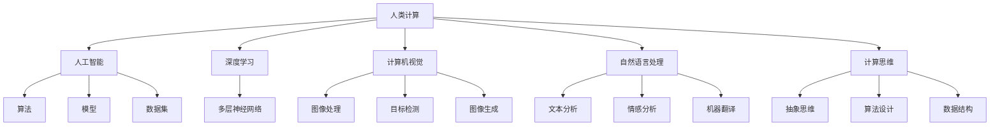
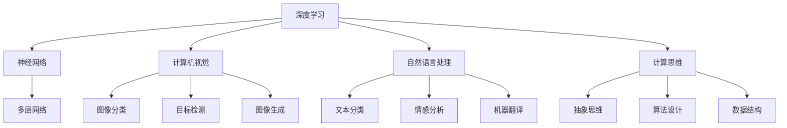

                 

# 释放人类创造力的无限潜力：人类计算的魅力

> 关键词：人类计算,人工智能,深度学习,计算机视觉,自然语言处理,计算思维,计算机科学

## 1. 背景介绍

### 1.1 问题由来

在数字时代，人类计算能力的飞速发展为各种领域的创新和进步提供了强大推动力。从深海探索到基因编辑，从药物研发到社交媒体，无处不在的计算技术正在不断推动人类社会的进步与变革。而这种创新背后，无论是数据分析、算法优化还是系统设计，都深深依托于计算机科学和人工智能(AI)技术的发展。人类计算的核心魅力不仅在于计算本身，更在于将这种能力转化为创造力的巨大潜力。

### 1.2 问题核心关键点

1. **人类计算**：指利用计算机和算法的强大计算能力，实现人类智慧与技术手段的深度融合，释放人类潜能的一种计算范式。
2. **人工智能**：使用算法、模型、数据集等手段，赋予计算机系统自主学习、判断、决策等智能行为的科学。
3. **深度学习**：一种通过多层神经网络进行模式识别和决策的机器学习技术，能够有效处理大规模数据集，提供高效的特征提取与分析。
4. **计算机视觉**：使计算机能够“看”和“理解”视觉内容的技术，涵盖图像分类、目标检测、图像生成等诸多方面。
5. **自然语言处理**：使计算机能够“理解”、“生成”自然语言，支持文本分类、情感分析、机器翻译等任务。
6. **计算思维**：一种基于抽象、算法、数据结构的思维方式，强调问题解决过程的系统性和创造性。

这些关键概念之间的关系可以通过以下Mermaid流程图进行展示：



这个流程图展示了一些核心概念及其相互关联的逻辑关系：

1. 人类计算利用人工智能技术，使计算机具备更强的自主学习能力和智能决策。
2. 人工智能通过深度学习、计算机视觉、自然语言处理等多种技术手段，实现各种复杂的任务和应用。
3. 计算思维是支撑人工智能发展的核心思维方式，强调问题解决的系统性和创造性。

## 2. 核心概念与联系

### 2.1 核心概念概述

要深入理解人类计算的魅力，首先需要掌握一些核心概念及其关联：

1. **人类计算与人工智能**：人类计算是人工智能的一种高级形式，将计算与人类智慧相结合，实现更为复杂的任务处理和智能决策。
2. **深度学习与计算机视觉**：深度学习是计算机视觉技术的核心算法，通过多层神经网络实现对视觉数据的深度分析和理解。
3. **自然语言处理与计算思维**：自然语言处理是计算机理解自然语言的关键技术，而计算思维是设计自然语言处理模型的重要原则。

### 2.2 核心概念原理和架构的 Mermaid 流程图



### 2.3 核心概念的联系与交互

核心概念间的联系主要体现在以下几个方面：

- 深度学习作为计算机视觉和自然语言处理的基础，通过多层神经网络实现数据的高级处理和特征提取。
- 计算机视觉和自然语言处理技术的进步，进一步推动了人类计算在图像识别、语音识别、自动翻译等领域的应用。
- 计算思维贯穿于人工智能和深度学习的各个环节，为模型的设计、训练、优化提供系统性和创造性的指导。

## 3. 核心算法原理 & 具体操作步骤
### 3.1 算法原理概述

人类计算的魅力主要体现在通过计算技术实现复杂问题的自动化和智能化。以下将详细介绍基于深度学习的核心算法原理：

- **深度学习算法**：通过多层次的神经网络模型，利用大量数据进行学习，提取数据的高级特征。
- **卷积神经网络(CNN)**：用于图像识别和处理的深度学习算法，通过卷积操作提取局部特征，解决图像分类、目标检测等问题。
- **循环神经网络(RNN)**：用于处理序列数据的深度学习算法，通过循环结构捕捉时间序列信息，支持文本生成、语音识别等任务。
- **自然语言处理(NLP)**：结合语言学和计算技术，使计算机能够处理和理解自然语言，包括文本分类、情感分析、机器翻译等。

### 3.2 算法步骤详解

深度学习算法的基本步骤如下：

1. **数据准备**：收集和预处理训练数据，包括图像、文本、音频等数据，进行标准化和归一化处理。
2. **模型设计**：选择合适的神经网络结构，设计多层网络、卷积层、循环层等模块。
3. **模型训练**：使用训练数据对模型进行训练，通过反向传播算法更新网络参数，最小化损失函数。
4. **模型评估**：使用验证数据对模型进行评估，检测过拟合和欠拟合问题。
5. **模型应用**：将训练好的模型应用于实际问题中，进行图像识别、文本分类、语音识别等任务。

### 3.3 算法优缺点

深度学习算法在处理大规模数据和复杂任务上具有显著优势，但也存在一些局限性：

- **优点**：
  - 能够有效处理非线性、高维数据，发现数据中的复杂模式和结构。
  - 模型的泛化能力强，可以应用于多种领域和任务。
  - 自动特征提取能力强，无需手工设计特征。

- **缺点**：
  - 计算资源需求大，训练时间长，对硬件要求高。
  - 模型复杂度较高，容易出现过拟合。
  - 模型可解释性差，难以理解模型内部的决策过程。

### 3.4 算法应用领域

深度学习算法已经广泛应用于各个领域，具体应用包括：

- **计算机视觉**：如图像分类、目标检测、人脸识别、自动驾驶等。
- **自然语言处理**：如文本分类、情感分析、机器翻译、智能客服等。
- **语音识别**：如语音转文本、语音命令识别、情感分析等。
- **医疗诊断**：如影像识别、病理分析、基因测序等。
- **智能制造**：如工业缺陷检测、机器人路径规划、自动化生产等。

## 4. 数学模型和公式 & 详细讲解 & 举例说明

### 4.1 数学模型构建

以深度学习模型为例，其基本数学模型可以表示为：

$$
y = f(x; \theta)
$$

其中，$y$表示模型的输出，$x$表示输入数据，$\theta$表示模型参数，$f$表示模型函数。在神经网络中，通常使用多层次的非线性函数组合来实现复杂的映射关系。

### 4.2 公式推导过程

以卷积神经网络(CNN)为例，其基本公式包括卷积操作和池化操作：

- **卷积操作**：
  $$
  f(x; \theta) = \sum_i \sum_j \theta_{ij} * g(x_{ij})
  $$
  其中，$g$表示卷积核，$x_{ij}$表示输入图像中的每个像素点，$\theta_{ij}$表示卷积核中的每个权重。

- **池化操作**：
  $$
  g(x; \theta) = max_{i,j} f(x; \theta)
  $$
  其中，$max$表示取最大值操作，用于降低特征维度，减少计算量。

### 4.3 案例分析与讲解

以图像分类为例，CNN的基本流程如下：

1. **卷积层**：提取图像的局部特征，使用多个卷积核进行多次卷积操作。
2. **池化层**：降低特征图的大小和维度，减少计算量。
3. **全连接层**：将特征图映射为类别概率，进行分类预测。

## 5. 项目实践：代码实例和详细解释说明

### 5.1 开发环境搭建

以下是使用Python和TensorFlow搭建卷积神经网络(CNN)进行图像分类的开发环境：

1. 安装Anaconda，创建Python虚拟环境。
2. 安装TensorFlow，选择与GPU兼容的版本。
3. 安装Keras作为高层次API，简化模型构建过程。
4. 收集和预处理图像数据集。

### 5.2 源代码详细实现

以下是一个简单的CNN图像分类模型的实现代码：

```python
import tensorflow as tf
from tensorflow.keras import layers, models

# 构建卷积神经网络模型
model = models.Sequential([
    layers.Conv2D(32, (3, 3), activation='relu', input_shape=(28, 28, 1)),
    layers.MaxPooling2D((2, 2)),
    layers.Conv2D(64, (3, 3), activation='relu'),
    layers.MaxPooling2D((2, 2)),
    layers.Conv2D(64, (3, 3), activation='relu'),
    layers.Flatten(),
    layers.Dense(64, activation='relu'),
    layers.Dense(10, activation='softmax')
])

# 编译模型
model.compile(optimizer='adam',
              loss='sparse_categorical_crossentropy',
              metrics=['accuracy'])

# 训练模型
model.fit(train_images, train_labels, epochs=10, batch_size=64, validation_data=(val_images, val_labels))

# 评估模型
test_loss, test_acc = model.evaluate(test_images, test_labels)
print('Test accuracy:', test_acc)
```

### 5.3 代码解读与分析

1. **模型构建**：使用Keras构建一个包含多个卷积层、池化层和全连接层的CNN模型。
2. **编译模型**：设置优化器、损失函数和评估指标。
3. **训练模型**：使用训练数据集对模型进行训练，迭代更新模型参数。
4. **评估模型**：使用测试数据集对模型进行评估，输出模型准确率。

## 6. 实际应用场景

### 6.1 医疗影像分析

深度学习在医疗影像分析中发挥了重要作用，能够帮助医生快速识别和诊断疾病。例如，通过训练深度神经网络模型，可以对X光片、CT扫描等医学影像进行自动分析，识别出肿瘤、骨折等病变。这些技术能够提高诊断效率，降低误诊率，为医疗系统的自动化和智能化提供重要支持。

### 6.2 智能客服系统

智能客服系统利用自然语言处理技术，可以自动回答客户咨询，提供高效便捷的服务体验。通过训练深度学习模型，系统可以理解自然语言输入，识别用户意图，并从知识库中提取相关信息进行回答。这些技术能够显著提升客户满意度，降低企业运营成本。

### 6.3 无人驾驶

深度学习在无人驾驶领域的应用也十分广泛，如目标检测、车道线识别、交通信号识别等。通过训练深度神经网络模型，系统可以实时感知周围环境，识别出车辆、行人等目标，进行路径规划和决策。这些技术能够提高无人驾驶的安全性和可靠性，推动智能交通的发展。

### 6.4 未来应用展望

未来，深度学习将在更多领域发挥重要作用，具体应用包括：

- **生物信息学**：如基因组学、蛋白质结构预测等。
- **环境监测**：如空气质量监测、气候变化预测等。
- **农业科技**：如作物识别、病虫害检测等。
- **金融科技**：如风险评估、股票预测等。
- **智能家居**：如智能音箱、智能家居控制等。

## 7. 工具和资源推荐

### 7.1 学习资源推荐

1. **Coursera《深度学习》课程**：由深度学习先驱Andrew Ng主讲，涵盖深度学习的基础知识和应用。
2. **Deep Learning Book**：Ian Goodfellow等人所著，系统讲解深度学习的理论和方法。
3. **PyTorch官方文档**：介绍PyTorch框架的使用和深度学习模型的构建。
4. **TensorFlow官方文档**：介绍TensorFlow框架的使用和深度学习模型的构建。
5. **Keras官方文档**：介绍Keras框架的使用和深度学习模型的构建。

### 7.2 开发工具推荐

1. **Anaconda**：Python的科学计算环境，支持多种Python版本和包管理。
2. **TensorFlow**：由Google开发的深度学习框架，支持GPU加速。
3. **Keras**：高层次API，简化深度学习模型的构建。
4. **PyTorch**：Facebook开发的深度学习框架，支持动态图和静态图。
5. **Jupyter Notebook**：交互式编程环境，支持Python和R等语言的代码编辑和运行。

### 7.3 相关论文推荐

1. **ImageNet Large Scale Visual Recognition Challenge**：AlexNet论文，介绍卷积神经网络的图像分类应用。
2. **Long Short-Term Memory**：RNN论文，介绍循环神经网络在文本处理中的应用。
3. **Attention Is All You Need**：Transformer论文，介绍自注意力机制在深度学习中的应用。
4. **BERT: Pre-training of Deep Bidirectional Transformers for Language Understanding**：BERT论文，介绍预训练语言模型在自然语言处理中的应用。
5. **GPT-3: Language Models are Unsupervised Multitask Learners**：GPT-3论文，介绍大规模预训练语言模型的零样本学习能力。

## 8. 总结：未来发展趋势与挑战

### 8.1 总结

本文深入探讨了基于深度学习的计算技术在各领域的应用，展示了人类计算的无限潜力。通过深度学习，我们能够高效处理大规模数据，实现复杂问题的自动化和智能化。同时，深度学习也面临一些挑战，如计算资源需求高、模型可解释性差等。解决这些问题将进一步推动人类计算的发展。

### 8.2 未来发展趋势

未来，人类计算将呈现以下几个趋势：

- **计算能力持续提升**：随着硬件技术的进步，计算能力将持续提升，支持更大规模的深度学习模型。
- **多模态计算兴起**：结合图像、文本、语音等多模态数据，实现更全面、深入的计算和分析。
- **跨领域融合加速**：计算技术与生物、医疗、农业等领域融合，推动各行业智能化发展。
- **智能系统普及**：智能客服、智能家居、智能交通等领域将进一步普及，提升人们的生活质量。

### 8.3 面临的挑战

尽管人类计算潜力巨大，但仍面临以下挑战：

- **计算资源瓶颈**：计算能力的需求增加，需要更多高性能硬件的支持。
- **数据隐私问题**：深度学习模型需要大量数据，数据隐私保护问题亟待解决。
- **模型可解释性**：深度学习模型复杂，难以解释其内部决策过程。
- **跨领域应用难题**：不同领域的计算技术尚未充分整合，难以实现跨领域的协同创新。

### 8.4 研究展望

未来研究需要关注以下方向：

- **跨领域知识融合**：推动计算技术与各行业的深度融合，实现跨领域的协同创新。
- **计算思维普及**：推广计算思维教育，提升公众的计算能力和创新意识。
- **模型可解释性增强**：通过简化模型结构、引入可解释性算法等手段，增强模型的可解释性。
- **数据隐私保护**：研究数据隐私保护技术，保障用户数据安全。

## 9. 附录：常见问题与解答

**Q1：深度学习与传统机器学习有什么区别？**

A: 深度学习与传统机器学习的区别主要在于：
- **模型复杂度**：深度学习模型通常包含多个隐藏层，能够处理更复杂的特征表示。
- **特征工程**：深度学习可以自动提取特征，减少人工设计特征的复杂度。
- **计算资源需求**：深度学习需要大量的计算资源进行模型训练。

**Q2：深度学习模型容易过拟合，如何缓解？**

A: 缓解过拟合的方法包括：
- **增加数据量**：使用更多的训练数据可以减少过拟合。
- **正则化**：如L2正则化、Dropout等方法，限制模型的复杂度。
- **早停法**：当验证集误差不再下降时停止训练，避免过拟合。
- **数据增强**：通过数据增强技术，生成更多的训练数据。

**Q3：深度学习模型的可解释性问题如何解决？**

A: 解决深度学习模型可解释性问题的方法包括：
- **可视化技术**：使用可视化技术，展示模型内部的特征和决策过程。
- **简化模型结构**：减少模型的深度和复杂度，增加模型的可解释性。
- **引入先验知识**：在模型中加入先验知识，引导模型学习更合理的表示。

**Q4：深度学习在医疗影像分析中的应用前景如何？**

A: 深度学习在医疗影像分析中的应用前景广阔，包括：
- **疾病诊断**：快速识别和诊断肿瘤、骨折等病变。
- **病理分析**：分析病理图像，提取病变特征。
- **治疗方案**：根据影像分析结果，提供个性化治疗方案。

**Q5：智能客服系统面临的主要挑战是什么？**

A: 智能客服系统面临的主要挑战包括：
- **多语言支持**：需要支持多语言输入和输出。
- **用户意图理解**：准确理解用户意图，提供精准回答。
- **知识库更新**：持续更新知识库，保持系统最新的业务知识。

---

作者：禅与计算机程序设计艺术 / Zen and the Art of Computer Programming

