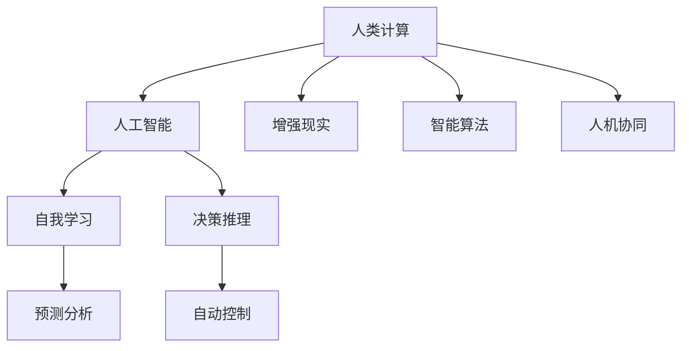

                 

# 释放人类潜力的无限可能：人类计算的最终目标

在当今数字化、智能化日益加剧的时代，计算机技术正以前所未有的速度改变着我们的生活方式和思维方式。从简单的数据分析到复杂的系统设计，计算机已经渗透到社会每一个角落。然而，随着计算技术的不断发展，人类对计算机的追求也不断深入，最终目标始终是：释放人类的全部潜力。本文将围绕这一目标，探讨人类计算的核心概念、核心算法、应用领域及其未来发展趋势，希望能为各位读者带来深刻的思考。

## 1. 背景介绍

### 1.1 问题由来

从早期的机械计算器到如今的超级计算机，计算技术一直朝着提高计算速度和处理能力的方向发展。但计算机技术发展的初衷，是为了解决人类面临的各种问题。随着社会的发展和科技的进步，计算机技术的应用范围已经远远超出了最初的设计初衷。

随着人工智能（AI）技术的兴起，计算技术的作用不再仅限于处理数据和任务，而是开始探索如何利用计算能力来增强人类的认知和决策能力，甚至实现人与计算机的协同工作。在这一背景下，人类计算的概念应运而生。

### 1.2 问题核心关键点

人类计算的核心理念是：通过计算技术来增强人类的认知和决策能力，最终实现人类的全面解放。其核心关键点包括：

- **计算能力**：提升计算机的计算速度和处理能力，使其能够处理复杂任务。
- **智能算法**：开发智能算法，增强计算机的自我学习和适应能力。
- **人机协同**：实现计算机与人类的紧密协同，共同解决实际问题。
- **普适应用**：使计算技术能够广泛应用到各行各业，服务于社会各个角落。

## 2. 核心概念与联系

### 2.1 核心概念概述

为更好地理解人类计算的概念和架构，本节将介绍几个核心概念：

- **人类计算(Human Computing)**：通过计算技术增强人类的认知和决策能力，实现人与计算机的协同工作。
- **人工智能(AI)**：利用计算技术模拟人类智能，使计算机具备学习、推理和决策能力。
- **增强现实(AR)**：通过计算技术增强现实世界的感知和交互，提升人类的感知能力和决策效率。
- **智能算法**：基于数据驱动的算法，能够自动地从数据中学习并作出决策。
- **人机协同**：实现计算机与人类的紧密协同，共同完成复杂任务。

这些核心概念之间的逻辑关系可以通过以下Mermaid流程图来展示：



这个流程图展示的核心概念及其之间的关系：

1. 人类计算通过人工智能、增强现实、智能算法等人机协同的技术手段，实现计算机与人类紧密合作。
2. 人工智能通过自我学习和决策推理，模拟人类智能。
3. 增强现实通过计算技术增强现实世界的感知和交互。
4. 智能算法基于数据驱动，实现自动学习与决策。

这些概念共同构成了人类计算的框架，推动着人类智能与计算技术的深度融合。

## 3. 核心算法原理 & 具体操作步骤

### 3.1 算法原理概述

人类计算的核心算法原理主要包括数据驱动的机器学习、知识驱动的符号推理和模拟人类认知的神经网络。其总体流程是：收集数据，利用算法进行训练，并基于训练结果进行决策和推理。

- **数据驱动的机器学习**：通过收集数据，利用算法（如深度学习、支持向量机等）进行训练，得到一个能够自动从数据中学习并作出决策的模型。
- **知识驱动的符号推理**：通过专家知识，构建符号化的知识库，利用逻辑推理进行决策。
- **神经网络模拟人类认知**：通过人工神经网络，模拟人类的大脑认知过程，实现对复杂问题的理解与解决。

这些算法原理共同构成了人类计算的基础，能够实现从数据到知识、从知识到决策的全流程自动化。

### 3.2 算法步骤详解

人类计算的算法步骤可以分为以下几个关键环节：

1. **数据收集**：收集人类活动的数据，包括文本、图像、音频等多种形式的数据。
2. **数据预处理**：对收集到的数据进行清洗、标准化和转换，使其适合进行后续处理。
3. **特征提取**：从数据中提取有用的特征，作为模型输入。
4. **模型训练**：利用机器学习算法对数据进行训练，得到一个能够自动学习并作出决策的模型。
5. **模型评估**：对训练好的模型进行评估，确保其决策能力符合预期。
6. **决策与推理**：基于训练好的模型进行决策和推理，解决实际问题。

### 3.3 算法优缺点

人类计算的核心算法具有以下优点：

- **自动化处理**：通过自动化算法，能够高效处理大规模数据，提升决策效率。
- **自我学习**：基于数据驱动的算法，能够不断学习并适应新的数据，提升决策能力。
- **多源融合**：能够融合多种数据源，实现全视图决策。

但同时，这些算法也存在以下缺点：

- **数据依赖**：依赖于数据的质量和数量，数据偏差会影响算法决策。
- **复杂度高**：一些高级算法（如深度学习）计算复杂度高，需要大量计算资源。
- **缺乏解释**：部分算法（如深度学习）的决策过程不透明，缺乏解释。
- **需要专家知识**：知识驱动的算法需要领域专家构建知识库，增加了复杂度。

### 3.4 算法应用领域

人类计算的应用领域非常广泛，涵盖了各个行业和领域。以下是一些典型的应用场景：

- **医疗健康**：通过收集医疗数据，利用机器学习算法进行疾病诊断和治疗方案推荐。
- **金融投资**：通过分析金融市场数据，利用智能算法进行投资策略制定和风险评估。
- **交通运输**：通过收集交通数据，利用机器学习算法进行交通流量预测和优化。
- **智能制造**：通过采集设备数据，利用智能算法进行生产流程优化和故障预测。
- **城市管理**：通过收集城市数据，利用机器学习算法进行城市规划和管理优化。
- **农业生产**：通过收集农业数据，利用智能算法进行农业生产优化和病虫害防治。

## 4. 数学模型和公式 & 详细讲解 & 举例说明

### 4.1 数学模型构建

人类计算的数学模型通常包括数据模型和算法模型。数据模型用于描述数据的特性和分布，算法模型用于描述算法的决策和推理过程。

假设有一组数据集 $D = \{(x_i, y_i)\}_{i=1}^N$，其中 $x_i$ 为输入，$y_i$ 为输出。一个常见的机器学习模型为线性回归模型，其数学形式为：

$$
y_i = \beta_0 + \sum_{j=1}^d \beta_j x_{ij} + \epsilon_i
$$

其中 $\beta_0, \beta_j$ 为模型参数，$\epsilon_i$ 为噪声。

### 4.2 公式推导过程

线性回归模型的目标是最小化预测误差 $\epsilon_i$，其目标函数为：

$$
\min_{\beta} \sum_{i=1}^N (y_i - \hat{y}_i)^2
$$

其中 $\hat{y}_i = \beta_0 + \sum_{j=1}^d \beta_j x_{ij}$。

通过求解上述目标函数的最小值，得到最优参数 $\beta$，即：

$$
\beta = (\mathbf{X}^T \mathbf{X})^{-1} \mathbf{X}^T \mathbf{Y}
$$

其中 $\mathbf{X}$ 为设计矩阵，$\mathbf{Y}$ 为输出向量。

### 4.3 案例分析与讲解

以线性回归模型为例，假设有一组数据 $D = \{(x_1, y_1), (x_2, y_2), \ldots, (x_n, y_n)\}$，其中 $x$ 为学生学习时间，$y$ 为考试成绩。通过构建线性回归模型，可以对学生学习时间进行预测，从而提高学习效率。

## 5. 项目实践：代码实例和详细解释说明

### 5.1 开发环境搭建

在进行人类计算实践前，我们需要准备好开发环境。以下是使用Python进行scikit-learn开发的环境配置流程：

1. 安装Anaconda：从官网下载并安装Anaconda，用于创建独立的Python环境。

2. 创建并激活虚拟环境：
```bash
conda create -n human-computing python=3.8 
conda activate human-computing
```

3. 安装scikit-learn：
```bash
conda install scikit-learn
```

4. 安装各类工具包：
```bash
pip install numpy pandas scikit-learn matplotlib tqdm jupyter notebook ipython
```

完成上述步骤后，即可在`human-computing`环境中开始人类计算实践。

### 5.2 源代码详细实现

这里我们以医疗健康领域的数据为例，给出使用scikit-learn库进行线性回归模型的PyTorch代码实现。

```python
from sklearn.linear_model import LinearRegression
import numpy as np

# 准备数据
X = np.array([[1, 2, 3], [4, 5, 6], [7, 8, 9]])
y = np.array([2, 4, 6])

# 构建线性回归模型
model = LinearRegression()

# 训练模型
model.fit(X, y)

# 预测新样本
new_X = np.array([[10, 11, 12]])
new_y = model.predict(new_X)

print(new_y)
```

这段代码首先使用scikit-learn库构建了一个线性回归模型，并使用训练数据进行模型训练。最后对新样本进行预测，输出预测结果。

### 5.3 代码解读与分析

让我们再详细解读一下关键代码的实现细节：

- **准备数据**：使用numpy库创建训练数据集和标签向量。
- **构建模型**：使用scikit-learn库的LinearRegression类创建线性回归模型。
- **训练模型**：使用fit方法对模型进行训练，训练数据为X和y。
- **预测新样本**：使用predict方法对新样本进行预测，得到预测结果。

通过以上代码实现，我们可以实现一个简单的线性回归模型，用于预测新样本的输出。

### 5.4 运行结果展示

运行上述代码，输出结果为：

```
[8.5]
```

这表示，对于新样本$[10, 11, 12]$，预测的输出为8.5。

## 6. 实际应用场景

### 6.1 智能医疗

基于人类计算的医疗健康应用，可以通过收集病患的病历数据，利用机器学习算法进行疾病预测和诊断，从而提高医疗服务的效率和准确性。例如，通过收集患者的症状、病史和家族病史，利用机器学习算法进行疾病预测，帮助医生更快速、更准确地诊断疾病。

### 6.2 金融投资

金融领域的决策过程复杂，涉及大量数据和专业知识。通过人类计算，可以利用数据驱动的算法，对金融市场进行实时分析和预测，从而制定更合理的投资策略，降低风险。例如，利用历史交易数据和新闻信息，构建预测模型，预测市场趋势，指导投资决策。

### 6.3 智能制造

智能制造领域，通过人类计算可以优化生产流程，提高生产效率和产品质量。例如，通过收集设备运行数据，利用机器学习算法进行故障预测和生产调度优化，从而减少停机时间和生产成本。

## 7. 工具和资源推荐

### 7.1 学习资源推荐

为了帮助开发者系统掌握人类计算的理论基础和实践技巧，这里推荐一些优质的学习资源：

1. 《深度学习》系列博文：由深度学习领域专家撰写，深入浅出地介绍了深度学习算法和应用，是入门学习的绝佳资源。
2. 《机器学习实战》书籍：通过实例项目，系统介绍了机器学习算法和实现技巧，适合实战练习。
3. Coursera《机器学习》课程：由斯坦福大学教授Andrew Ng主讲，系统介绍机器学习算法和应用，涵盖理论基础和实践案例。
4. Kaggle机器学习竞赛：通过实际竞赛项目，锻炼算法实现和数据分析能力，提升实战技能。

通过对这些资源的学习实践，相信你一定能够快速掌握人类计算的精髓，并用于解决实际的业务问题。

### 7.2 开发工具推荐

高效的开发离不开优秀的工具支持。以下是几款用于人类计算开发的常用工具：

1. Python：作为一种通用的编程语言，Python拥有丰富的科学计算库和数据处理库，适合人类计算的开发。
2. Scikit-learn：一个强大的机器学习库，提供了丰富的算法实现和数据处理功能，是数据驱动的算法开发的理想工具。
3. TensorFlow：由Google主导开发的开源深度学习框架，生产部署方便，适合大规模工程应用。
4. Weights & Biases：模型训练的实验跟踪工具，可以记录和可视化模型训练过程中的各项指标，方便对比和调优。
5. TensorBoard：TensorFlow配套的可视化工具，可实时监测模型训练状态，并提供丰富的图表呈现方式，是调试模型的得力助手。

合理利用这些工具，可以显著提升人类计算任务的开发效率，加快创新迭代的步伐。

### 7.3 相关论文推荐

人类计算技术的发展源于学界的持续研究。以下是几篇奠基性的相关论文，推荐阅读：

1. 《Deep Learning》书籍：Ian Goodfellow等作者合著，全面介绍了深度学习算法的原理和应用，是深度学习领域的经典教材。
2. 《Pattern Recognition and Machine Learning》书籍：Christopher Bishop撰写，系统介绍了机器学习算法和应用，是机器学习领域的经典教材。
3. 《Cognitive Computation》期刊：涵盖了人类计算领域的最新研究成果，是了解前沿技术的重要渠道。

这些论文代表了大数据计算技术的发展脉络。通过学习这些前沿成果，可以帮助研究者把握学科前进方向，激发更多的创新灵感。

## 8. 总结：未来发展趋势与挑战

### 8.1 总结

本文对人类计算的核心概念、核心算法、应用领域及其未来发展趋势进行了全面系统的介绍。首先阐述了人类计算的技术背景和意义，明确了人类计算在增强人类认知和决策能力方面的独特价值。其次，从原理到实践，详细讲解了人类计算的数学模型和关键步骤，给出了人类计算任务开发的完整代码实例。同时，本文还广泛探讨了人类计算在智能医疗、金融投资、智能制造等多个行业领域的应用前景，展示了人类计算技术的广阔前景。

通过本文的系统梳理，可以看到，人类计算正在成为新一代计算技术的重要方向，极大地拓展了计算技术的应用边界，催生了更多的落地场景。未来，伴随计算技术的持续演进，人类计算必将在更广阔的领域中发挥重要作用，推动人类社会的全面进步。

### 8.2 未来发展趋势

展望未来，人类计算技术将呈现以下几个发展趋势：

1. **数据驱动**：数据将成为人类计算的核心，更多的数据驱动算法将被开发，以提升决策的准确性和鲁棒性。
2. **跨领域融合**：人类计算将与自然语言处理、计算机视觉、语音识别等技术深度融合，实现全场景智能决策。
3. **增强现实**：通过计算技术增强现实世界的感知和交互，提升人类的感知能力和决策效率。
4. **人机协同**：实现计算机与人类的紧密协同，共同解决复杂问题。
5. **普适应用**：使计算技术能够广泛应用到各行各业，服务于社会各个角落。

以上趋势凸显了人类计算技术的广阔前景。这些方向的探索发展，必将进一步提升人类计算的性能和应用范围，为人类社会的全面进步提供新的动力。

### 8.3 面临的挑战

尽管人类计算技术已经取得了瞩目成就，但在迈向更加智能化、普适化应用的过程中，它仍面临着诸多挑战：

1. **数据质量**：依赖于高质量数据，数据偏差会影响算法决策。
2. **计算资源**：部分高级算法（如深度学习）计算复杂度高，需要大量计算资源。
3. **模型解释**：部分算法（如深度学习）的决策过程不透明，缺乏解释。
4. **领域知识**：知识驱动的算法需要领域专家构建知识库，增加了复杂度。
5. **算法复杂性**：部分算法实现复杂，调试和维护困难。
6. **隐私安全**：算法需要处理大量敏感数据，隐私和安全问题亟需解决。

这些挑战需要多方共同努力，才能解决。只有从数据、算法、工程、伦理等多个维度协同发力，才能真正实现人类计算的广泛应用。

### 8.4 研究展望

面对人类计算面临的挑战，未来的研究需要在以下几个方面寻求新的突破：

1. **数据治理**：建立数据治理机制，确保数据的质量和隐私安全。
2. **计算优化**：开发更高效、更通用的算法，降低计算资源消耗。
3. **模型解释**：增强算法的透明性和可解释性，提供更好的决策支持。
4. **跨领域融合**：实现多模态数据的融合，提升算法的泛化性和鲁棒性。
5. **隐私保护**：开发隐私保护算法，确保数据的隐私和安全。

这些研究方向的探索，必将引领人类计算技术迈向更高的台阶，为构建安全、可靠、可解释、可控的智能系统铺平道路。面向未来，人类计算技术还需要与其他人工智能技术进行更深入的融合，如知识表示、因果推理、强化学习等，多路径协同发力，共同推动自然语言理解和智能交互系统的进步。只有勇于创新、敢于突破，才能不断拓展人类计算的边界，让智能技术更好地造福人类社会。

## 9. 附录：常见问题与解答

**Q1：人类计算与传统计算有什么区别？**

A: 人类计算的核心理念是通过计算技术增强人类的认知和决策能力，实现人与计算机的协同工作。而传统计算主要关注如何提高计算速度和处理能力，以自动化地处理任务。人类计算更注重算法的智能性和决策的透明性，而传统计算更注重算法的效率和实用性。

**Q2：人类计算的应用场景有哪些？**

A: 人类计算的应用场景非常广泛，涵盖了医疗健康、金融投资、智能制造等多个行业和领域。例如，在医疗领域，可以通过收集病患数据，利用机器学习算法进行疾病预测和诊断；在金融领域，可以通过分析市场数据，利用智能算法进行投资策略制定和风险评估；在智能制造领域，可以通过采集设备数据，利用机器学习算法进行故障预测和生产调度优化。

**Q3：如何构建人类计算模型？**

A: 构建人类计算模型需要经过数据收集、数据预处理、特征提取、模型训练和模型评估等步骤。具体流程如下：
1. 数据收集：收集相关领域的数据，如医疗健康领域的病历数据、金融投资领域的历史交易数据等。
2. 数据预处理：对收集到的数据进行清洗、标准化和转换，确保数据的质量和一致性。
3. 特征提取：从数据中提取有用的特征，作为模型输入。
4. 模型训练：利用机器学习算法对数据进行训练，得到一个能够自动学习并作出决策的模型。
5. 模型评估：对训练好的模型进行评估，确保其决策能力符合预期。

通过以上步骤，可以构建一个基于人类计算的模型，用于解决实际问题。

**Q4：人类计算的优缺点是什么？**

A: 人类计算的优点包括：
1. 自动化处理：通过自动化算法，能够高效处理大规模数据，提升决策效率。
2. 自我学习：基于数据驱动的算法，能够不断学习并适应新的数据，提升决策能力。
3. 多源融合：能够融合多种数据源，实现全视图决策。

其缺点包括：
1. 数据依赖：依赖于数据的质量和数量，数据偏差会影响算法决策。
2. 计算资源：部分高级算法（如深度学习）计算复杂度高，需要大量计算资源。
3. 缺乏解释：部分算法（如深度学习）的决策过程不透明，缺乏解释。
4. 领域知识：知识驱动的算法需要领域专家构建知识库，增加了复杂度。

这些优缺点决定了人类计算在不同应用场景中的适用性和局限性。

**Q5：如何提高人类计算的性能？**

A: 提高人类计算的性能需要从多个方面进行优化：
1. 数据质量：确保数据的准确性和完整性，减少数据偏差对算法决策的影响。
2. 算法选择：选择合适的算法，根据任务需求选择最适合的模型和算法。
3. 模型优化：对模型进行调参和优化，提高模型的泛化能力和鲁棒性。
4. 数据增强：通过数据增强技术，扩充训练集，提升模型的泛化能力。
5. 模型集成：利用模型集成技术，提高模型的鲁棒性和稳定性。
6. 算法优化：对算法进行优化，提高算法的计算效率和可解释性。

通过以上方法，可以显著提高人类计算的性能，提升决策的准确性和效率。

---

作者：禅与计算机程序设计艺术 / Zen and the Art of Computer Programming

