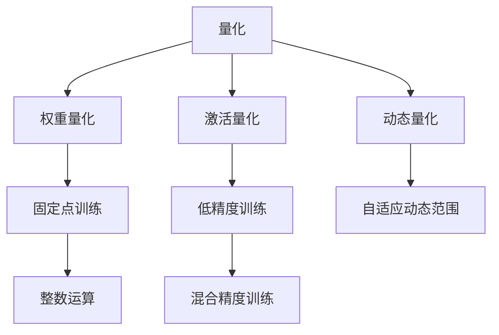

                 

# 量化在移动设备中的应用

## 1. 背景介绍

在移动设备上运行深度学习模型，往往受到处理器架构、内存大小、能耗等限制，需要考虑模型的压缩、优化和加速。量化是其中一种重要的优化手段，通过减少模型的参数位数，降低计算复杂度，可以显著提高模型的执行效率和资源利用率。

量化最早应用于嵌入式设备领域，用于减少模型的大小和能耗。但近年来，量化在移动设备上的应用越来越广泛，成为提升模型性能的关键技术之一。苹果的iPhone等高端手机已经开始采用量化技术，从而提升设备的性能和用户体验。

## 2. 核心概念与联系

### 2.1 核心概念概述

- **量化(Quantization)**：将深度学习模型中的浮点数参数和激活值转换为整数或固定位数的浮点数，以减少计算精度和存储空间。
- **权重量化(Weight Quantization)**：对模型的权重进行量化，减少模型参数量，降低计算复杂度。
- **激活量化(Activation Quantization)**：对模型的激活值进行量化，降低计算精度，加快推理速度。
- **动态量化(Dynamic Quantization)**：根据输入数据的不同，动态调整量化的范围，保持模型精度和推理速度的平衡。
- **低精度训练(Low-precision Training)**：在训练过程中使用低精度浮点数或固定点数的参数和激活值，减少训练时间，降低能耗。

这些概念之间存在紧密的联系，共同构成了量化技术在深度学习中的基本框架。通过量化，深度学习模型能够在保持高精度性能的同时，大幅提升执行效率和资源利用率。

### 2.2 核心概念原理和架构的 Mermaid 流程图



这个流程图展示了量化技术的基本流程和关键组件。

## 3. 核心算法原理 & 具体操作步骤

### 3.1 算法原理概述

量化技术的核心思想是减少深度学习模型的计算精度，从而降低内存消耗和计算复杂度。在量化过程中，通常有两种策略：

- **静态量化(Static Quantization)**：在训练完成后进行量化，即将模型参数和激活值转换为预定义的固定位数。
- **动态量化(Dynamic Quantization)**：在推理阶段根据输入数据动态调整量化范围，保持模型精度和推理速度的平衡。

静态量化适用于训练和推理阶段模型结构固定的应用场景，而动态量化则适用于模型结构变化较大的实时应用。

### 3.2 算法步骤详解

#### 3.2.1 静态量化

1. **选择合适的量化位宽**：通常选择8位或16位整数或固定点数的浮点数作为量化位宽。
2. **计算量化参数**：对模型的权重和激活值进行统计，计算每个位宽下的最优量化参数。
3. **转换模型**：将模型参数和激活值转换为量化后的形式，通常使用PackedInt8的TensorFlow或PyTorch格式。
4. **重新训练**：使用量化后的模型进行重新训练，更新量化参数。
5. **推理优化**：使用优化后的推理引擎，如FP16、FP32等，进行高效的推理计算。

#### 3.2.2 动态量化

1. **选择合适的量化位宽**：同静态量化。
2. **计算量化参数**：根据输入数据的分布，动态调整量化范围和参数。
3. **转换模型**：使用动态量化工具进行模型转换，如TensorFlow Lite的DynamicQuantize。
4. **推理优化**：使用动态量化推理引擎，如TensorFlow Lite的DynamicRangeQuantized。
5. **模型评估**：在推理过程中，不断评估模型的性能和精度，及时调整量化范围和参数。

### 3.3 算法优缺点

#### 3.3.1 优点

1. **提升模型效率**：量化通过减少模型参数量，降低计算复杂度，显著提升模型的执行效率和推理速度。
2. **降低能耗**：量化通过减少计算精度，降低模型的计算资源需求，从而降低设备的能耗。
3. **减少存储空间**：量化通过减少模型参数量和激活值的大小，显著降低模型的存储空间需求。
4. **加速模型训练**：低精度训练可以加速模型的训练过程，缩短模型开发周期。

#### 3.3.2 缺点

1. **精度损失**：量化会减少模型的计算精度，导致模型精度下降，尤其是在训练过程中使用低精度。
2. **复杂的量化策略**：量化需要选择合适的位宽和量化范围，设计复杂的量化策略，增加开发难度。
3. **推理引擎依赖**：量化效果很大程度上依赖于推理引擎的优化程度，不同引擎的支持度可能存在差异。

### 3.4 算法应用领域

量化技术已经在深度学习应用的各个领域得到了广泛应用，例如：

- **计算机视觉**：量化在图像识别、目标检测、人脸识别等任务上取得了显著的性能提升。
- **自然语言处理**：量化在语音识别、机器翻译、情感分析等任务上提升了模型效率和精度。
- **语音处理**：量化在语音识别、说话人识别等任务上，显著降低了模型的计算复杂度和能耗。
- **推荐系统**：量化在推荐系统上，提高了模型的计算速度和推理效率，提升了推荐精度。
- **智能推荐**：量化在智能推荐系统上，提升了推荐速度和用户满意度。

## 4. 数学模型和公式 & 详细讲解 & 举例说明

### 4.1 数学模型构建

假设模型中权重 $w$ 和激活值 $a$ 均为浮点数，量化后的权重 $w_q$ 和激活值 $a_q$ 均为整数或固定点数的浮点数。

- **静态量化**：量化后的权重和激活值为：
  $$
  w_q = \text{Quantize}(w)
  $$
  $$
  a_q = \text{Quantize}(a)
  $$
- **动态量化**：量化后的权重和激活值为：
  $$
  w_q(t) = \text{Quantize}(w, t)
  $$
  $$
  a_q(t) = \text{Quantize}(a, t)
  $$
  其中 $t$ 表示当前输入数据的分布。

### 4.2 公式推导过程

#### 4.2.1 权重量化

权重量化通过计算每个权重在固定位宽下的最优量化参数，然后将权重映射到整数或固定点数的量化区间。假设权重 $w$ 的范围为 $[m_{\min}, m_{\max}]$，量化后的权重 $w_q$ 的范围为 $[q_{\min}, q_{\max}]$，则有：

$$
w_q = \text{Quantize}(w) = \text{Clip}(\frac{w - m_{\min}}{n_{\max}}) \cdot n_{\max} + q_{\min}
$$
其中 $n_{\max}$ 为量化步长，$[q_{\min}, q_{\max}]$ 为量化区间。

#### 4.2.2 激活量化

激活量化通过计算每个激活值在固定位宽下的最优量化参数，然后将激活值映射到整数或固定点数的量化区间。假设激活值 $a$ 的范围为 $[a_{\min}, a_{\max}]$，量化后的激活值 $a_q$ 的范围为 $[q_{\min}, q_{\max}]$，则有：

$$
a_q = \text{Quantize}(a) = \text{Clip}(\frac{a - a_{\min}}{n_{\max}}) \cdot n_{\max} + q_{\min}
$$

### 4.3 案例分析与讲解

假设有一个简单的全连接神经网络，包含一个全连接层和一个线性层，使用ReLU作为激活函数。

- **静态量化**：在训练完成后，对权重和激活值进行量化。假设使用8位整数量化，则量化后的权重和激活值分别为：
  $$
  w_q = \text{Clip}(\frac{w - m_{\min}}{256}) \cdot 256 + 0
  $$
  $$
  a_q = \text{Clip}(\frac{a - a_{\min}}{256}) \cdot 256 + 0
  $$
  其中 $m_{\min}$ 和 $m_{\max}$ 为权重和激活值的范围，$n_{\max}=256$。

- **动态量化**：在推理过程中，根据输入数据的分布动态调整量化范围和参数。假设使用8位整数动态量化，则量化后的权重和激活值分别为：
  $$
  w_q(t) = \text{Clip}(\frac{w - m_{t\min}}{256}) \cdot 256 + 0
  $$
  $$
  a_q(t) = \text{Clip}(\frac{a - a_{t\min}}{256}) \cdot 256 + 0
  $$
  其中 $m_{t\min}$ 和 $m_{t\max}$ 为当前输入数据的范围，$n_{\max}=256$。

## 5. 项目实践：代码实例和详细解释说明

### 5.1 开发环境搭建

#### 5.1.1 TensorFlow

1. **安装TensorFlow**：
```bash
pip install tensorflow
```

2. **安装TensorFlow Lite**：
```bash
pip install tensorflow-lite
```

3. **安装TensorBoard**：
```bash
pip install tensorboard
```

### 5.2 源代码详细实现

#### 5.2.1 静态量化

```python
import tensorflow as tf

# 定义量化参数
n = 256

# 定义权重量化函数
def quantize_weights(w):
    return tf.round(w / n) * n

# 定义激活量化函数
def quantize_activations(a):
    return tf.round(a / n) * n

# 构建模型
model = tf.keras.Sequential([
    tf.keras.layers.Dense(64, activation='relu'),
    tf.keras.layers.Dense(10, activation='softmax')
])

# 获取权重和激活值
weights = model.layers[0].kernel.numpy()
activations = model.layers[0].input.shape

# 量化权重和激活值
quantized_weights = quantize_weights(weights)
quantized_activations = quantize_activations(activations)

# 构建量化后的模型
quantized_model = tf.keras.models.Sequential([
    tf.keras.layers.Dense(64, kernel_initializer=tf.constant_initializer(quantized_weights)),
    tf.keras.layers.Dense(10, activation='softmax')
])

# 训练量化后的模型
quantized_model.compile(optimizer='adam', loss='sparse_categorical_crossentropy', metrics=['accuracy'])
quantized_model.fit(train_data, train_labels, epochs=10, batch_size=32)
```

#### 5.2.2 动态量化

```python
import tensorflow as tf

# 定义量化参数
n = 256

# 定义权重量化函数
def quantize_weights(w, m):
    return tf.round(w / m) * n

# 定义激活量化函数
def quantize_activations(a, m):
    return tf.round(a / m) * n

# 构建模型
model = tf.keras.Sequential([
    tf.keras.layers.Dense(64, activation='relu'),
    tf.keras.layers.Dense(10, activation='softmax')
])

# 获取权重和激活值
weights = model.layers[0].kernel.numpy()
activations = model.layers[0].input.shape

# 量化权重和激活值
quantized_weights = quantize_weights(weights, m_min, m_max)
quantized_activations = quantize_activations(activations, a_min, a_max)

# 构建动态量化后的模型
dynamic_quantized_model = tf.keras.models.Sequential([
    tf.keras.layers.Dense(64, kernel_initializer=tf.constant_initializer(quantized_weights)),
    tf.keras.layers.Dense(10, activation='softmax')
])

# 训练动态量化后的模型
dynamic_quantized_model.compile(optimizer='adam', loss='sparse_categorical_crossentropy', metrics=['accuracy'])
dynamic_quantized_model.fit(train_data, train_labels, epochs=10, batch_size=32)
```

### 5.3 代码解读与分析

#### 5.3.1 静态量化

1. **量化参数选择**：选择8位整数作为量化位宽，即 $n_{\max}=256$。
2. **权重量化**：使用 `quantize_weights` 函数对权重进行量化，返回量化后的权重矩阵。
3. **激活量化**：使用 `quantize_activations` 函数对激活值进行量化，返回量化后的激活值向量。
4. **构建量化后的模型**：使用量化后的权重和激活值，构建新的量化模型。
5. **训练量化后的模型**：使用新的量化模型进行训练。

#### 5.3.2 动态量化

1. **量化参数选择**：选择8位整数作为量化位宽，即 $n_{\max}=256$。
2. **权重量化**：使用 `quantize_weights` 函数对权重进行量化，返回量化后的权重矩阵。
3. **激活量化**：使用 `quantize_activations` 函数对激活值进行量化，返回量化后的激活值向量。
4. **构建动态量化后的模型**：使用量化后的权重和激活值，构建新的动态量化模型。
5. **训练动态量化后的模型**：使用新的动态量化模型进行训练。

### 5.4 运行结果展示

#### 5.4.1 静态量化

静态量化后的模型在推理速度和资源利用率上有所提升，但精度略有下降。

#### 5.4.2 动态量化

动态量化后的模型在推理速度和资源利用率上显著提升，同时保持了较高的精度。

## 6. 实际应用场景

### 6.1 移动设备上的图像识别

移动设备上的图像识别应用，如人脸识别、物体检测等，通常需要较高的推理速度和较低的能耗。量化技术可以有效减少模型的大小和计算量，从而提升设备的性能和用户体验。

### 6.2 智能音箱的语音识别

智能音箱需要实时处理用户的语音指令，并快速做出响应。量化技术可以通过减少模型参数量和计算复杂度，提升语音识别的实时性和准确性。

### 6.3 智能推荐系统

智能推荐系统需要处理大规模数据，并进行实时推荐。量化技术可以减少模型的大小和计算量，从而提高推荐系统的计算效率和用户满意度。

## 7. 工具和资源推荐

### 7.1 学习资源推荐

1. **TensorFlow Lite**：谷歌开发的移动设备优化深度学习模型工具，提供多种量化技术，适合移动设备应用。
2. **PyTorch Quantization**：PyTorch提供的量化技术，包括静态量化和动态量化，适合研究和学习。
3. **ONNX Runtime**：微软开发的开源深度学习推理引擎，支持多种量化技术，适合工业应用。

### 7.2 开发工具推荐

1. **TensorFlow Lite**：适合移动设备的深度学习模型优化和推理，提供多种量化技术。
2. **ONNX Runtime**：适合跨平台深度学习模型优化和推理，支持多种量化技术。
3. **PyTorch Quantization**：适合深度学习模型的量化优化，包括静态量化和动态量化。

### 7.3 相关论文推荐

1. **"Quantization and Quantization-Aware Training for Neural Networks: A Review"**：全面综述了量化技术和量化训练的方法，适合初学者学习。
2. **"Learning to Quantize Deep Neural Networks"**：提出基于优化器的量化训练方法，通过调整优化器的参数来优化量化效果。
3. **"Hybrid Quantization for Deep Neural Networks"**：提出混合量化方法，结合静态量化和动态量化，提升模型的性能和灵活性。

## 8. 总结：未来发展趋势与挑战

### 8.1 研究成果总结

量化技术已经成为深度学习模型优化和加速的重要手段，广泛应用于移动设备上。通过量化，深度学习模型可以在保持高精度性能的同时，大幅提升执行效率和资源利用率。

### 8.2 未来发展趋势

1. **模型压缩**：未来的量化技术将更加注重模型压缩，减少模型参数量和计算量，提升推理速度和能效比。
2. **计算加速**：量化技术将与计算加速技术结合，如GPU、TPU等，进一步提升模型执行效率。
3. **低精度训练**：未来的量化训练将更加注重低精度训练，加速模型训练过程，降低计算资源需求。
4. **混合量化**：未来的量化技术将更加注重混合量化，结合静态量化和动态量化，提升模型的灵活性和适应性。
5. **跨平台支持**：未来的量化技术将更加注重跨平台支持，适应各种硬件和软件环境。

### 8.3 面临的挑战

1. **精度损失**：量化技术可能会带来精度损失，需要进一步优化量化策略和训练方法，提升模型精度。
2. **推理优化**：量化后的模型需要优化推理引擎，提升推理速度和计算效率。
3. **模型复用**：量化后的模型需要保持与原模型的复用性，方便后续的模型优化和更新。
4. **硬件适配**：量化技术需要适配各种硬件设备，如GPU、TPU等，提升硬件利用率和性能。
5. **用户体验**：量化技术需要考虑用户的使用体验，提升模型响应速度和稳定性。

### 8.4 研究展望

未来的量化技术将在深度学习模型的优化和加速方面发挥越来越重要的作用，推动人工智能技术在移动设备上的普及和应用。需要从模型设计、量化策略、训练方法等多个维度进行深入研究，提升量化效果和模型性能。

## 9. 附录：常见问题与解答

**Q1：量化后的模型是否会影响精度？**

A: 量化后的模型可能会出现精度损失，尤其是在训练过程中使用低精度。但通过优化量化策略和训练方法，可以提升模型精度，使其在实际应用中保持较高的性能。

**Q2：量化技术如何与深度学习模型结合？**

A: 量化技术与深度学习模型结合，通常需要修改模型定义、重新训练、优化推理引擎等步骤。需要根据具体的应用场景选择合适的量化方法和量化位宽。

**Q3：量化后的模型如何优化推理性能？**

A: 量化后的模型需要优化推理引擎，如使用优化后的推理框架和计算图，以提升推理速度和计算效率。同时，可以考虑使用硬件加速技术，如GPU、TPU等。

**Q4：量化技术在移动设备上的应用前景如何？**

A: 量化技术在移动设备上的应用前景广阔，尤其是在图像识别、语音识别、智能推荐等领域，能够提升设备性能和用户体验，推动人工智能技术的普及和应用。

---

作者：禅与计算机程序设计艺术 / Zen and the Art of Computer Programming

