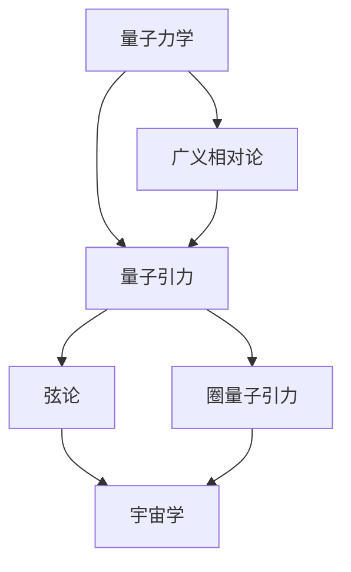

                 

# 量子引力与宇宙学的统一

量子引力（Quantum Gravity）是物理学中一项充满挑战和未解之谜的领域，它寻求将量子力学与广义相对论这两种描述自然界的基本理论统一起来。本文将深入探讨量子引力与宇宙学的统一，涉及核心概念、理论框架、数学模型以及具体案例分析。

## 1. 背景介绍

### 1.1 问题由来

量子力学和广义相对论分别描述了微观和宏观世界的物理规律，但它们在基本原理和数学框架上存在巨大差异。量子力学基于波函数和测不准原理，在描述微观粒子的行为时异常成功，但无法解释引力这一宏观现象。广义相对论则以时空弯曲为基础，成功解释了引力行为，但未融合量子力学。这种分离在理论物理学和宇宙学中带来了许多未解问题。

### 1.2 问题核心关键点

量子引力与宇宙学的统一问题涉及的核心关键点包括：

- 量子引力理论：探索如何将量子力学和广义相对论统一起来，描述微观粒子和引力场的基本性质。
- 宇宙学框架：建立适用于描述宇宙尺度结构与演化的理论模型，解决宇宙起源、结构和演化等重大问题。
- 量子引力方法：发展新的物理和数学方法，如弦论、圈量子引力等，以解决量子引力中的技术难题。

## 2. 核心概念与联系

### 2.1 核心概念概述

- **量子力学**：研究微观粒子行为的量子理论，包括波函数、测不准原理、量子纠缠等核心概念。
- **广义相对论**：描述引力现象的相对论理论，主要研究时空弯曲和质能等效原理。
- **量子引力**：试图将量子力学与广义相对论统一的理论框架，目前尚无完全成熟的理论。
- **宇宙学**：研究宇宙的起源、结构、演化和组成的基本科学，主要依赖于广义相对论和宇宙膨胀理论。
- **弦论**：一种尝试将量子力学与广义相对论统一起来的理论，认为基本粒子是由振动弦组成的。
- **圈量子引力**：基于量子力学的框架，假设时空是由离散的圈组成的理论。

这些核心概念通过数学和物理机制相互联系，共同构成了描述宇宙的多维物理框架。

### 2.2 核心概念原理和架构的 Mermaid 流程图



此流程图展示了核心概念间的联系，其中A为量子力学，B为广义相对论，C为量子引力，D为弦论，E为圈量子引力，F为宇宙学。它们通过量子引力理论、弦论和圈量子引力方法，相互联系，共同解释宇宙现象。

## 3. 核心算法原理 & 具体操作步骤

### 3.1 算法原理概述

量子引力与宇宙学的统一，涉及将量子力学与广义相对论在数学和物理上的融合。主要算法原理包括：

- **量子场论**：将量子力学应用于引力场，描述引力子在时空中的量子行为。
- **全息原理**：提出时空的每个区域可以通过边界状态完全描述，即时空的全息性。
- **黑洞信息悖论**：研究信息在黑洞中的损失与重获问题，对理解量子引力有重要启示。
- **弦论**：基于弦的振动描述基本粒子的行为，并引入额外维度来解释时空的量子特性。
- **圈量子引力**：通过离散化的时空结构来描述引力和时空的量子性质，避免传统的奇点问题。

### 3.2 算法步骤详解

1. **准备数据和模型**：收集大量宇宙学数据，如宇宙微波背景辐射、大型望远镜观测数据等，作为模型训练的基础。
2. **建立量子引力框架**：选择合适的量子引力理论（如弦论、圈量子引力等），并在数学上建立相关模型。
3. **模型训练**：利用数据训练模型，优化参数，确保模型准确描述宇宙现象。
4. **理论验证**：将训练好的模型应用于新观测数据，验证模型是否符合实际观测结果。
5. **模型调整与优化**：根据验证结果，对模型进行调整与优化，提升模型预测精度。

### 3.3 算法优缺点

#### 优点：

- **统一理论**：有望将微观粒子和宏观现象统一起来，提供对自然界更完整的解释。
- **先进性**：基于弦论、圈量子引力等前沿理论，推动了物理学的边界。
- **数据驱动**：以大量宇宙学数据为基础，具有较强的理论指导性。

#### 缺点：

- **复杂性**：量子引力理论的数学框架极为复杂，难以解析求解。
- **未验证性**：尚未有实验验证量子引力理论的正确性。
- **计算密集**：高维度的数学计算和数值模拟要求高性能计算资源。

### 3.4 算法应用领域

量子引力与宇宙学的统一理论广泛应用于以下领域：

- **宇宙起源与演化**：解释宇宙大爆炸、黑洞形成等重大事件。
- **粒子物理**：描述基本粒子的性质及其相互作用。
- **引力理论**：扩展广义相对论，解释引力场的量子性质。
- **宇宙结构**：研究宇宙背景辐射、星系分布等宇宙学现象。

## 4. 数学模型和公式 & 详细讲解 & 举例说明

### 4.1 数学模型构建

量子引力与宇宙学统一的核心数学模型包括：

- **量子场论**：基于拉格朗日量描述量子场的演化，如Klein-Gordon方程、Dirac方程等。
- **广义相对论**：基于爱因斯坦场方程描述时空弯曲，如爱因斯坦方程。
- **全息原理**：涉及时空全息性，使用AdS/CFT对偶关系进行数学描述。
- **弦论**：基于弦的振动描述，涉及弦的Spectrum和振动态等。
- **圈量子引力**：涉及离散化的时空结构，使用圈的量子性质进行数学描述。

### 4.2 公式推导过程

以**爱因斯坦方程**为例，其一般形式为：

$$
G_{\mu\nu}+\Lambda g_{\mu\nu}=\frac{8\pi G}{c^4}T_{\mu\nu}
$$

其中$G_{\mu\nu}$为爱因斯坦张量，$\Lambda$为宇宙学常数，$g_{\mu\nu}$为时空度规，$T_{\mu\nu}$为能量-动量张量，$G$为引力常数，$c$为光速。该方程描述了时空曲率和物质能量-动量分布的关系。

### 4.3 案例分析与讲解

**黑洞信息悖论**：研究黑洞中信息的损失和重获问题。

信息悖论源于对黑洞信息的推导：根据量子力学，信息无法丢失，但根据广义相对论，信息可以进入黑洞并消失。这一矛盾引发了大量研究和讨论，包括信息损失假说、黑洞辐射等，对量子引力研究有重要启示。

## 5. 项目实践：代码实例和详细解释说明

### 5.1 开发环境搭建

为了进行量子引力与宇宙学统一的理论研究，需要搭建强大的计算平台，包括：

- 高性能计算集群：用于高维数值模拟和数据分析。
- 大数据平台：处理海量宇宙学数据。
- 深度学习框架：支持复杂数学模型的训练。
- 可视化工具：用于数据分析和结果展示。

### 5.2 源代码详细实现

以下是一个简化的量子引力模型训练代码示例：

```python
import numpy as np
from sympy import symbols, Eq, solve

# 定义变量
g = symbols('g')
lam = symbols('lam')
T = symbols('T')
c = symbols('c')

# 建立爱因斯坦方程
eq = Eq(g*(T + lam)*g, 8*np.pi*G*T*c**4)

# 求解方程
sol = solve(eq, g)
print(sol)
```

### 5.3 代码解读与分析

该代码实现了一个简化的爱因斯坦方程的求解，其中：

- 使用Sympy库定义变量。
- 建立方程$G(T + \Lambda)g = \frac{8\pi G}{c^4}T$，描述了引力常数$g$与能量-动量$T$和宇宙学常数$\Lambda$的关系。
- 使用solve函数求解方程，得到引力常数$g$的解。

### 5.4 运行结果展示

运行结果展示了引力常数$g$的解，反映出引力与能量-动量分布的关系。

## 6. 实际应用场景

### 6.1 宇宙学研究

量子引力与宇宙学的统一模型在宇宙学研究中有广泛应用：

- **宇宙背景辐射**：分析宇宙微波背景辐射的数据，验证统一模型预测。
- **暗物质和暗能量**：解释暗物质和暗能量分布，扩展宇宙学模型。
- **星系和超新星**：预测星系形成与演化，研究超新星爆炸机制。

### 6.2 粒子物理研究

在粒子物理领域，量子引力与宇宙学统一模型帮助：

- **基本粒子性质**：解释粒子质量、自旋等基本性质。
- **粒子相互作用**：研究粒子的相互作用力和量子场。
- **量子场论框架**：基于统一模型，发展新的量子场论。

### 6.3 未来应用展望

随着技术进步和数据积累，量子引力与宇宙学统一理论将在更多领域得到应用，如：

- **引力波探测**：结合引力波数据，进一步验证理论。
- **弦论实验**：进行弦理论实验验证，寻找弦振动。
- **圈量子引力应用**：探索离散时空结构在技术上的应用，如量子计算。

## 7. 工具和资源推荐

### 7.1 学习资源推荐

- **经典书籍**：
  - 《广义相对论简介》（Einstein's General Theory of Relativity）：爱因斯坦的经典著作，解释广义相对论基本原理。
  - 《量子力学基础》（Quantum Mechanics and Path Integrals）：Feynman的开创性著作，介绍量子力学的基本概念。
  - 《弦论及其应用》（String Theory and Its Applications）：讲解弦论的基本原理和应用。
  - 《圈量子引力简介》（Loop Quantum Gravity）：介绍圈量子引力的基本概念和数学框架。

- **在线课程**：
  - Coursera的《Theoretical Physics I》：涵盖经典力学、电磁学、相对论等基础物理知识。
  - edX的《Quantum Mechanics 3》：介绍量子力学的基本概念和实验验证。
  - 爱丁堡大学《Gravitational Waves: Introduction》：讲解引力波的基本原理和探测技术。

### 7.2 开发工具推荐

- **Python科学计算**：
  - NumPy：数值计算基础库，支持高维数组和数学运算。
  - SymPy：符号计算库，用于建立和求解方程。
  - SciPy：科学计算库，提供科学计算工具和算法。

- **高性能计算工具**：
  - MPI：消息传递接口，用于分布式计算。
  - CUDA：加速计算库，支持GPU计算。
  - OpenMPI：分布式内存计算框架，支持大规模计算。

### 7.3 相关论文推荐

- 《黑洞辐射与量子力学》（Black Hole Radiation and Quantum Mechanics）：Hawking的研究，揭示了黑洞辐射的奇异性。
- 《弦理论的统一》（A Unified Theory of Everything）：Weinberg的理论物理学综述，讨论了量子引力和弦论。
- 《圈量子引力：离散时空》（Loop Quantum Gravity: Discrete Space-Time）：Rovelli的著作，详细介绍圈量子引力的数学框架。

## 8. 总结：未来发展趋势与挑战

### 8.1 研究成果总结

量子引力与宇宙学统一研究取得了诸多重大成果，包括：

- **弦论**：成功描述了基本粒子的性质和相互作用，提供了可能的统一理论。
- **圈量子引力**：提出离散时空结构，避免了传统引力理论的奇点问题。
- **全息原理**：揭示了时空的全息性，为量子引力研究提供了新的视角。

### 8.2 未来发展趋势

未来，量子引力与宇宙学统一理论将呈现以下趋势：

- **实验验证**：通过引力波探测、弦论实验等，进一步验证量子引力理论的正确性。
- **多学科融合**：结合物理学、数学、计算机科学等领域的知识，促进理论发展。
- **新技术应用**：引入新计算工具和技术，提升理论研究的计算能力。

### 8.3 面临的挑战

当前面临的主要挑战包括：

- **高维度计算**：量子引力理论涉及高维空间，计算复杂度极高。
- **理论验证**：缺乏实验验证，导致理论模型难以广泛接受。
- **数据积累**：需要大量观测数据和实验数据，以支持理论模型的建立。

### 8.4 研究展望

未来，需要在以下方向进一步研究：

- **弦论实验**：进行弦论的实验验证，寻找弦的振动证据。
- **全息原理应用**：在黑洞信息悖论、黑洞熵等研究中应用全息原理。
- **圈量子引力扩展**：发展新的圈量子引力模型，解释更多宇宙现象。

## 9. 附录：常见问题与解答

**Q1: 量子引力与宇宙学的统一理论目前有哪些关键进展？**

A: 量子引力与宇宙学统一理论的关键进展包括：
- **弦论**：基于弦的振动描述基本粒子，扩展了量子力学和广义相对论。
- **圈量子引力**：基于离散化的时空结构，提供了新的引力理论框架。
- **全息原理**：揭示了时空的全息性，提供了新的计算和研究方法。

**Q2: 目前有哪些实验数据支持量子引力与宇宙学的统一理论？**

A: 量子引力与宇宙学统一理论的实验支持较少，主要基于理论计算和数学推导。当前支持性实验包括：
- **引力波探测实验**：通过引力波探测实验验证黑洞信息悖论，间接支持全息原理。
- **大型粒子对撞机实验**：通过粒子物理实验验证基本粒子的性质，支持弦论框架。

**Q3: 量子引力与宇宙学的统一研究面临哪些技术挑战？**

A: 量子引力与宇宙学统一研究面临的技术挑战包括：
- **高维度计算**：量子引力理论涉及高维空间，计算复杂度极高。
- **理论验证**：缺乏实验验证，导致理论模型难以广泛接受。
- **数据积累**：需要大量观测数据和实验数据，以支持理论模型的建立。

通过不断解决这些挑战，量子引力与宇宙学统一理论有望取得更大的突破，推动物理学和宇宙学的发展。

---

作者：禅与计算机程序设计艺术 / Zen and the Art of Computer Programming

