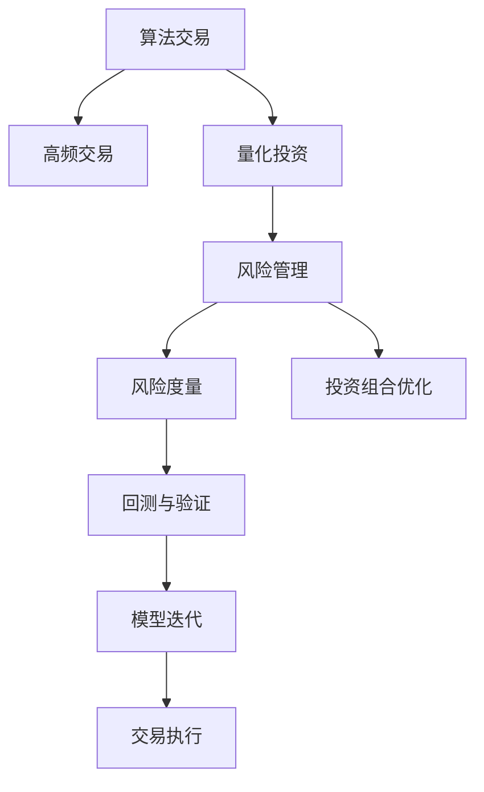

                 

## 1. 背景介绍

### 1.1 问题由来
金融科技(FinTech)是结合金融与科技的新兴领域，致力于通过创新的技术手段改善金融服务的效率和可及性。算法交易和风险管理作为金融科技的重要应用，通过自动化和智能化技术，大幅提升了金融市场的交易效率和风险管理能力。

算法交易利用先进的数学模型和机器学习算法，根据市场数据和历史交易数据，自动进行高频交易，以期获取市场套利机会，优化资产配置，提高投资回报率。风险管理则通过量化分析技术，评估和监控金融产品的风险水平，实施有效的风险控制策略，保障金融系统的稳健运行。

随着金融市场规模的扩大和金融产品的多样化，传统的基于人工经验的金融决策方式已难以满足日益复杂的金融需求。算法交易和风险管理通过数据驱动的自动化决策，克服了人类决策的主观性和局限性，成为金融科技的重要组成部分。

### 1.2 问题核心关键点
算法交易和风险管理的核心问题在于如何构建有效的量化模型，合理评估市场风险，实现投资收益的最大化和风险的最小化。具体而言：
1. **数据驱动**：算法交易和风险管理依赖于高质量的金融数据，包括历史交易数据、市场价格数据、财务报表数据等。
2. **模型选择**：选择合适的数学模型和算法，以准确捕捉市场特征，预测未来价格变化和风险水平。
3. **风险管理**：设计有效的风险评估和控制策略，合理分散投资风险，保障金融资产的安全性和稳定性。

## 2. 核心概念与联系

### 2.1 核心概念概述

为更好地理解算法交易和风险管理，本节将介绍几个密切相关的核心概念：

- 算法交易(Algorithmic Trading)：利用先进数学模型和机器学习算法，自动执行金融市场交易策略，以优化资产配置和投资回报的技术。
- 风险管理(Risk Management)：通过量化方法，评估金融资产的风险水平，设计风险控制策略，降低金融风险的潜在影响。
- 量化投资(Quantitative Investing)：基于数据分析和数学模型，进行投资决策和资产管理，追求长期稳定的收益。
- 高频交易(High-Frequency Trading, HFT)：利用高频算法和高速交易系统，在微秒级别上进行交易，获取市场套利机会。
- 风险度量(Risk Measurement)：通过数学方法，如VaR、ES等，量化金融资产的风险水平，供投资者和监管者参考。
- 投资组合优化(Portfolio Optimization)：通过数学优化技术，构建最优的投资组合，实现风险与收益的平衡。

这些核心概念之间的逻辑关系可以通过以下Mermaid流程图来展示：



这个流程图展示了几类核心概念的相互关系：

1. 算法交易通过高频交易策略提升交易效率。
2. 量化投资利用数学模型进行科学决策。
3. 风险管理通过风险度量评估金融资产的风险水平。
4. 投资组合优化通过模型优化实现最优配置。
5. 回测与验证保障模型的有效性。
6. 模型迭代持续优化策略。
7. 交易执行将决策转化为市场操作。

## 3. 核心算法原理 & 具体操作步骤
### 3.1 算法原理概述

算法交易和风险管理涉及的算法原理包括统计学、机器学习、优化理论等，具体内容如下：

- **统计学**：用于描述市场数据的概率分布和统计特性，建立预测模型。
- **机器学习**：通过训练模型，学习市场数据的内在关系，进行市场预测和风险评估。
- **优化理论**：用于构建和求解最优化问题，设计投资组合和风险控制策略。

算法交易的核心在于构建和优化交易策略，以获取市场套利机会。常见的交易策略包括均值回归、动量交易、套利交易等，这些策略通常基于时间序列分析、统计学原理和机器学习算法。

风险管理的核心在于量化风险并设计有效的风险控制策略。常用的风险评估方法包括VaR（Value at Risk）、ES（Expected Shortfall）、GARCH等，这些方法通过统计学和数学模型，对金融资产的风险水平进行度量。

### 3.2 算法步骤详解

#### 算法交易的步骤

1. **数据采集**：收集历史交易数据、市场价格数据、财务报表数据等。
2. **特征工程**：选择和构造对交易策略有帮助的特征，如股价变化、成交量、波动率等。
3. **模型训练**：选择或设计适合的机器学习模型，使用历史数据进行训练，优化模型参数。
4. **回测验证**：使用历史数据对训练好的模型进行回测，评估其性能。
5. **策略优化**：根据回测结果，对交易策略进行优化，提高投资回报率。
6. **交易执行**：根据优化后的交易策略，自动执行交易操作。

#### 风险管理的步骤

1. **数据准备**：收集金融资产的历史价格数据、波动率数据、市场数据等。
2. **风险度量**：选择合适的风险评估方法，对金融资产的风险水平进行量化。
3. **策略设计**：根据风险度量结果，设计有效的风险控制策略，如仓位管理、风险对冲等。
4. **模型优化**：优化风险控制策略，使其更符合市场实际情况。
5. **风险监控**：实时监控金融资产的风险水平，及时调整策略。

### 3.3 算法优缺点

算法交易和风险管理具有以下优点：

- **高效性**：利用先进技术和算法，大幅提高交易速度和决策效率，缩短市场反应时间。
- **客观性**：通过数据驱动的模型，避免人类主观偏见，提高决策的科学性和准确性。
- **可扩展性**：算法交易和风险管理可以大规模地应用于不同的金融市场和资产类别。

同时，这些方法也存在一些缺点：

- **复杂性**：算法和模型设计复杂，需要深入的数学和统计知识。
- **数据依赖**：模型的效果依赖于数据的质量和完整性，数据缺失或偏差可能导致模型失效。
- **风险集中**：算法交易可能加剧市场波动，存在市场冲击的风险。
- **监管问题**：部分自动化交易策略可能引发市场操纵和异常行为，需要严格的监管和合规要求。

### 3.4 算法应用领域

算法交易和风险管理在金融科技中的应用非常广泛，涵盖以下几个主要领域：

- **股票交易**：利用算法策略进行股票买入和卖出操作，优化投资回报。
- **外汇交易**：通过高频交易和套利策略，获取外汇市场中的套利机会。
- **期货交易**：结合趋势分析和期权定价模型，进行期货合约的交易。
- **量化基金**：基于数学模型和算法，管理大型投资基金，实现资产优化配置。
- **风险管理**：评估各类金融产品的风险水平，实施风险控制策略，保障金融系统的稳定。
- **金融监管**：通过数据分析和模型预测，辅助金融监管机构制定政策，预防系统性风险。

## 4. 数学模型和公式 & 详细讲解 & 举例说明

### 4.1 数学模型构建

#### 交易策略模型

常见的交易策略模型包括均值回归模型、动量交易模型、套利模型等，这里以均值回归模型为例进行介绍。

设股票价格为 $S_t$，其均值为 $\mu$，方差为 $\sigma^2$。均值回归模型假设价格围绕均值波动，当价格偏离均值时，价格将向均值回归。数学上，均值回归模型可以表示为：

$$
S_t = \mu + \sigma \epsilon_t
$$

其中 $\epsilon_t \sim \mathcal{N}(0,1)$ 为标准正态分布随机变量。

#### 风险度量模型

常用的风险度量方法包括VaR和ES。

**VaR（Value at Risk）**：在给定置信水平 $\alpha$ 下，金融资产的最大预期损失。假设某金融资产的收益率服从正态分布，VaR可以表示为：

$$
VaR_\alpha = \mu - \sigma \Phi^{-1}(\alpha)
$$

其中 $\Phi^{-1}$ 为标准正态分布的逆函数。

**ES（Expected Shortfall）**：在给定置信水平 $\alpha$ 下，金融资产的期望最大损失。假设某金融资产的收益率服从正态分布，ES可以表示为：

$$
ES_\alpha = \mu - \sigma \int_{-\infty}^{\Phi^{-1}(\alpha)} \Phi(z) dz
$$

### 4.2 公式推导过程

#### 均值回归模型的推导

均值回归模型基于随机漫步假定，假设价格 $S_t$ 围绕均值 $\mu$ 波动，其价格变化 $\Delta S_t$ 服从正态分布：

$$
\Delta S_t = \sigma \epsilon_t
$$

其中 $\epsilon_t \sim \mathcal{N}(0,1)$。

由上述式子可得：

$$
S_t = S_0 + \sum_{i=1}^t \Delta S_i = \mu + \sigma \sum_{i=1}^t \epsilon_i
$$

假设 $t$ 时刻价格 $S_t$ 与均值 $\mu$ 的偏差 $\Delta S_t$ 服从正态分布，则 $S_t$ 也服从正态分布：

$$
S_t \sim \mathcal{N}(\mu, \sigma^2 t)
$$

通过正态分布的性质，可以求得价格回归均值的概率密度函数：

$$
f(S_t) = \frac{1}{\sigma \sqrt{2\pi t}} e^{-\frac{(S_t - \mu)^2}{2\sigma^2 t}}
$$

由上述概率密度函数，可以得到价格回归均值的概率为：

$$
P(S_t = \mu) = \frac{1}{\sigma \sqrt{2\pi t}} \int_{-\infty}^{\infty} e^{-\frac{(S_t - \mu)^2}{2\sigma^2 t}} dS_t = \frac{1}{2}
$$

因此，价格回归均值的概率为 $0.5$，与均值回归模型的假设一致。

#### ES模型的推导

ES（Expected Shortfall）是VaR的扩展，用于度量金融资产在极端情况下的损失。假设某金融资产的收益率服从正态分布 $N(\mu, \sigma^2)$，则ES可以表示为：

$$
ES_\alpha = \mu - \sigma \int_{-\infty}^{\Phi^{-1}(\alpha)} \Phi(z) dz
$$

其中 $\Phi(z)$ 为标准正态分布的累积分布函数。

通过标准化变换，将正态分布 $N(\mu, \sigma^2)$ 转换为标准正态分布 $N(0,1)$，则：

$$
\frac{S_t - \mu}{\sigma} \sim N(0,1)
$$

由标准化变换的性质，可以得到：

$$
P(S_t \leq \mu - \sigma \Phi^{-1}(\alpha)) = \Phi(\Phi^{-1}(\alpha)) = \alpha
$$

因此，ES可以表示为：

$$
ES_\alpha = \mu - \sigma \int_{-\infty}^{\Phi^{-1}(\alpha)} \Phi(z) dz = \mu - \sigma \Phi^{-1}(\alpha)
$$

### 4.3 案例分析与讲解

#### 案例分析：股票价格预测

假设某股票价格 $S_t$ 服从均值回归模型，均值 $\mu$ 为 $100$，方差 $\sigma^2$ 为 $4$。已知当前价格 $S_t = 95$，求未来一个月内价格回归均值的概率。

通过均值回归模型的推导，可以得到：

$$
S_t \sim \mathcal{N}(100, 2)
$$

已知 $S_t = 95$，代入上式可得：

$$
\frac{S_t - \mu}{\sigma} = \frac{95 - 100}{2} = -2.5
$$

因此：

$$
P(S_t = \mu) = \frac{1}{2} = 0.5
$$

因此，未来一个月内价格回归均值的概率为 $0.5$。

#### 案例分析：期权定价

假设某欧式期权，执行价为 $100$，到期时间为 $T$，市场利率为 $r$，股票当前价格为 $S_0$，无风险利率为 $r_f$，波动率为 $\sigma$。利用BS模型对期权进行定价。

BS模型假设股票价格服从对数正态分布，期权价格可以表示为：

$$
C = S_0 N(d_1) - K e^{-rt} N(d_2)
$$

其中：

$$
d_1 = \frac{\ln \frac{S_0}{K} + \left(r - r_f + \frac{\sigma^2}{2}\right) t}{\sigma \sqrt{t}}
$$

$$
d_2 = d_1 - \sigma \sqrt{t}
$$

利用BS模型，可以计算出欧式期权的理论价格，辅助投资决策。

## 5. 项目实践：代码实例和详细解释说明

### 5.1 开发环境搭建

在进行算法交易和风险管理实践前，我们需要准备好开发环境。以下是使用Python进行Python进行金融工程开发的常见环境配置流程：

1. 安装Anaconda：从官网下载并安装Anaconda，用于创建独立的Python环境。

2. 创建并激活虚拟环境：
```bash
conda create -n pyfin-env python=3.8 
conda activate pyfin-env
```

3. 安装必要的包：
```bash
conda install pandas numpy matplotlib scikit-learn jupyter notebook 
pip install alphalens scipy statsmodels QuantLib pyfolio backtrader
```

完成上述步骤后，即可在`pyfin-env`环境中开始金融工程实践。

### 5.2 源代码详细实现

这里以构建基于统计学模型的股票交易策略为例，给出Python代码实现。

```python
import numpy as np
import pandas as pd
import matplotlib.pyplot as plt

# 假设股票价格为均值回归模型
# 均值 mu 和方差 sigma^2
mu = 100
sigma = 2

# 样本数据，假设为5天的历史数据
data = np.random.normal(mu, sigma, 5)

# 均值回归模型预测未来价格
def mean_reversion(data, mu, sigma, days):
    predictions = []
    for i in range(days):
        predicted_price = mu + sigma * np.mean(data[i:i+days])
        predictions.append(predicted_price)
    return predictions

# 测试均值回归模型预测效果
days = 3
predictions = mean_reversion(data, mu, sigma, days)
plt.plot(data, label='历史价格')
plt.plot(predictions, label='均值回归预测')
plt.legend()
plt.show()
```

以上代码实现了基于均值回归模型的股票价格预测功能。在实践中，可以根据实际需求调整模型参数和预测天数。

### 5.3 代码解读与分析

**均值回归模型的实现**：

1. **定义均值和方差**：均值 $\mu$ 和方差 $\sigma^2$ 是模型参数，通过历史数据进行估计。

2. **生成历史数据**：使用Numpy生成5天的历史数据，作为模型的输入。

3. **定义均值回归模型函数**：接收历史数据、均值、方差和预测天数，返回预测价格。

4. **进行预测并可视化**：对历史数据进行预测，并使用Matplotlib可视化预测结果。

**代码实现注意事项**：

1. **模型参数的选择**：均值和方差是模型的关键参数，需要通过历史数据进行估计。在实际应用中，可能需要进行模型选择和调参。

2. **数据生成方式**：历史数据可以采用真实市场数据，或通过随机数生成模拟数据。

3. **预测天数**：预测天数越长，模型的不确定性越高，但预测效果可能越好。需要根据实际情况进行调整。

## 6. 实际应用场景

### 6.1 智能投顾

智能投顾利用算法交易和风险管理技术，通过智能算法和数据分析，为客户提供个性化的投资建议和资产管理服务。智能投顾系统可以结合客户风险偏好、财务状况、市场环境等，自动构建和优化投资组合，提供动态调整建议。

智能投顾的核心在于构建先进的量化模型和优化算法，通过不断学习和迭代，适应市场变化，实现最优的投资回报。例如，可以使用机器学习算法分析客户历史交易数据，学习其投资风格和偏好，设计个性化的投资策略。

### 6.2 高频交易

高频交易利用算法交易技术，通过高速数据处理和交易执行系统，在微秒级别上进行高频交易，获取市场套利机会。高频交易系统通常使用复杂的数学模型和机器学习算法，如统计套利模型、动量交易模型等，实时捕捉市场波动，自动执行交易操作。

高频交易系统需要具备高计算能力和低延迟的网络传输，通常采用分布式架构和多机同步技术，确保交易速度和稳定性。例如，可以使用多线程和并行计算技术，加速数据处理和交易执行。

### 6.3 金融风险管理

金融风险管理通过量化方法，评估金融资产的风险水平，设计有效的风险控制策略，保障金融系统的稳健运行。风险管理系统的核心在于构建和优化风险评估模型，如VaR、ES等，实时监控金融资产的风险水平，实施有效的风险控制策略。

风险管理系统可以结合市场数据和内部数据，构建多层次的风险评估体系，动态调整仓位和交易策略。例如，可以使用VaR模型评估单个资产或组合的风险，使用ES模型评估极端情况下的损失，实时调整仓位以控制风险。

### 6.4 未来应用展望

未来，算法交易和风险管理将进一步向智能化、自动化和多样化方向发展，为金融科技带来更多创新应用。

1. **深度学习和大数据**：结合深度学习和大数据技术，构建更加精准的量化模型和风险评估方法，提高金融决策的科学性和准确性。

2. **智能合约**：结合区块链技术和智能合约，实现自动化、去中心化的金融交易和风险管理，提升金融系统的透明度和安全性。

3. **跨领域应用**：将金融科技与其他领域（如健康医疗、供应链管理等）进行结合，推动跨领域创新应用的发展，提升各行业的智能化水平。

4. **个性化金融服务**：结合大数据和人工智能技术，实现个性化的金融服务，提供定制化的投资建议和风险管理策略。

5. **实时交易**：结合5G等新兴技术，实现实时交易和监控，提升金融市场的高频交易效率和风险管理能力。

## 7. 工具和资源推荐

### 7.1 学习资源推荐

为了帮助开发者系统掌握算法交易和风险管理的相关知识，这里推荐一些优质的学习资源：

1. **《Python金融工程》**：该书深入浅出地介绍了金融工程中的Python编程技术和算法，涵盖股票交易、期权定价、风险管理等内容。

2. **Coursera金融工程课程**：Coursera提供的金融工程系列课程，涵盖金融工程基础、算法交易、风险管理等内容，适合各层次学习者。

3. **QuantLib**：一个开源的C++库，用于实现金融工程中的数学模型和算法，支持Python接口。

4. **Alphalens**：一个Python库，用于评估高频交易策略的性能，支持因子分析、回测等功能。

5. **QuantConnect**：一个在线量化交易平台，提供丰富的学习资源和代码示例，支持Python和C#接口。

通过对这些资源的学习实践，相信你一定能够快速掌握算法交易和风险管理的核心知识，并用于解决实际的金融问题。

### 7.2 开发工具推荐

高效的开发离不开优秀的工具支持。以下是几款用于金融工程开发的常用工具：

1. **Python**：Python语言具有丰富的第三方库和数据处理能力，是金融工程开发的首选语言。

2. **Pandas**：用于数据处理和分析，支持大规模数据处理和复杂的数据结构操作。

3. **NumPy**：用于数值计算和科学计算，支持高效的向量运算和矩阵运算。

4. **SciPy**：用于科学计算和数据分析，支持优化、统计、信号处理等功能。

5. **Matplotlib**：用于数据可视化，支持多种图表和动画效果。

6. **QuantLib**：用于实现金融工程中的数学模型和算法，支持C++接口和Python接口。

合理利用这些工具，可以显著提升金融工程开发效率，加快创新迭代的步伐。

### 7.3 相关论文推荐

算法交易和风险管理技术的发展源于学界的持续研究。以下是几篇奠基性的相关论文，推荐阅读：

1. **Algorithmic Trading and Statistical Arbitrage**：详细介绍了基于统计学模型的高频交易算法。

2. **Quantitative Analysis of Derivative Securities**：介绍了期权定价和量化分析方法，涵盖了Black-Scholes模型等经典方法。

3. **High-Frequency Trading: A Quantitative Analysis of an Evolutionary Market**：分析了高频交易对市场流动性的影响，提供了丰富的实证研究结果。

4. **Portfolio Selection**：介绍了投资组合优化理论，提供了多种优化方法，如马科维茨均值方差模型、风险平价模型等。

5. **Financial Risk Management: Models, Measure, Methods**：系统介绍了金融风险管理理论，包括VaR、ES、GARCH等风险评估方法。

这些论文代表了大金融工程的发展脉络。通过学习这些前沿成果，可以帮助研究者把握学科前进方向，激发更多的创新灵感。

## 8. 总结：未来发展趋势与挑战

### 8.1 总结

本文对算法交易和风险管理技术进行了全面系统的介绍。首先阐述了算法交易和风险管理在金融科技中的重要应用，明确了其核心问题及其重要性。其次，从原理到实践，详细讲解了算法交易和风险管理的数学模型和关键步骤，给出了实际应用中的代码实现。同时，本文还广泛探讨了算法交易和风险管理在智能投顾、高频交易、金融风险管理等多个领域的应用前景，展示了其巨大潜力。此外，本文精选了算法交易和风险管理的各类学习资源，力求为读者提供全方位的技术指引。

通过本文的系统梳理，可以看到，算法交易和风险管理技术通过数据驱动的科学决策，克服了人类决策的主观性和局限性，成为金融科技的重要组成部分。这些技术的发展，大幅提升了金融市场的交易效率和风险管理能力，为金融科技行业带来了深刻的变革。

### 8.2 未来发展趋势

展望未来，算法交易和风险管理技术将呈现以下几个发展趋势：

1. **智能化程度提升**：结合大数据和人工智能技术，构建更加精准的量化模型和风险评估方法，提高金融决策的科学性和准确性。

2. **自动化程度提高**：利用智能投顾和自动化交易系统，实现高效、智能的金融决策，降低人力成本，提升决策效率。

3. **跨领域应用扩展**：结合其他领域的技术（如区块链、大数据等），推动跨领域创新应用的发展，提升各行业的智能化水平。

4. **去中心化金融**：结合区块链和智能合约技术，实现去中心化的金融交易和风险管理，提升金融系统的透明度和安全性。

5. **实时交易与监控**：结合5G等新兴技术，实现实时交易和监控，提升金融市场的高频交易效率和风险管理能力。

### 8.3 面临的挑战

尽管算法交易和风险管理技术已经取得了显著成果，但在迈向更加智能化、普适化应用的过程中，仍面临诸多挑战：

1. **模型复杂性**：算法交易和风险管理模型通常较为复杂，需要深入的数学和统计知识，模型选择和调参难度大。

2. **数据依赖**：模型的效果依赖于高质量的数据，数据缺失或偏差可能导致模型失效，数据获取和处理成本高。

3. **市场波动**：高频交易策略可能加剧市场波动，存在市场冲击的风险，需要有效的风险控制和监管。

4. **监管要求**：部分自动化交易策略可能引发市场操纵和异常行为，需要严格的监管和合规要求，平衡创新与风险。

5. **模型解释性**：复杂模型缺乏可解释性，难以解释其内部工作机制和决策逻辑，不利于监管和审计。

6. **隐私保护**：金融数据涉及客户隐私，数据共享和处理需要严格的隐私保护措施，防止数据泄露。

### 8.4 研究展望

面对算法交易和风险管理所面临的挑战，未来的研究需要在以下几个方面寻求新的突破：

1. **模型简化与优化**：开发更加简单、高效的模型，提高模型可解释性和稳定性。

2. **数据增强与清洗**：利用数据增强和数据清洗技术，提高数据质量和数据处理的效率。

3. **去中心化金融**：结合区块链和智能合约技术，实现去中心化的金融交易和风险管理，提升金融系统的透明度和安全性。

4. **跨领域应用**：将金融科技与其他领域（如健康医疗、供应链管理等）进行结合，推动跨领域创新应用的发展，提升各行业的智能化水平。

5. **实时交易与监控**：结合5G等新兴技术，实现实时交易和监控，提升金融市场的高频交易效率和风险管理能力。

6. **隐私保护技术**：结合隐私保护技术，保障金融数据的隐私和安全，防止数据泄露和滥用。

这些研究方向将推动算法交易和风险管理技术的不断演进，为金融科技行业带来更广阔的应用前景。只有勇于创新、敢于突破，才能不断拓展金融科技的边界，为金融行业带来更高效、更智能、更安全的解决方案。

## 9. 附录：常见问题与解答

**Q1：算法交易是否适用于所有市场？**

A: 算法交易适用于大部分成熟的金融市场，如股票、期货、外汇等。但对于新兴市场或信息不透明的市场，算法交易的效果可能受到限制。

**Q2：如何评估算法交易策略的性能？**

A: 常用的评估方法包括回测、实盘测试、Alphalens等。回测是通过历史数据对策略进行模拟测试，评估策略的历史表现。实盘测试是将策略应用于真实市场，观察其长期效果。Alphalens是一个Python库，用于评估高频交易策略的性能，支持因子分析和回测等功能。

**Q3：风险管理模型的选择与应用？**

A: 常用的风险评估方法包括VaR、ES、GARCH等。VaR用于评估金融资产在给定置信水平下的最大预期损失。ES用于评估金融资产在极端情况下的最大损失。GARCH用于描述金融资产的波动性，建立自回归模型。根据具体需求选择合适的风险模型，并进行模型优化和应用。

**Q4：算法交易的风险控制？**

A: 风险控制策略包括仓位管理、对冲策略、止损机制等。仓位管理用于控制单个或组合资产的风险水平。对冲策略用于降低市场波动对投资组合的影响。止损机制用于在市场波动过大时及时退出，避免亏损。

**Q5：如何构建跨领域的高频交易系统？**

A: 跨领域的高频交易系统需要结合不同领域的技术和数据，如自然语言处理、计算机视觉等。可以开发通用的高频交易平台，支持多种数据源和交易策略，进行实时交易和监控。

通过本文的系统梳理，可以看到，算法交易和风险管理技术通过数据驱动的科学决策，克服了人类决策的主观性和局限性，成为金融科技的重要组成部分。这些技术的发展，大幅提升了金融市场的交易效率和风险管理能力，为金融科技行业带来了深刻的变革。未来，伴随技术的不断演进和应用的深入，算法交易和风险管理必将推动金融科技行业迈向更加智能化、普适化的新阶段。

