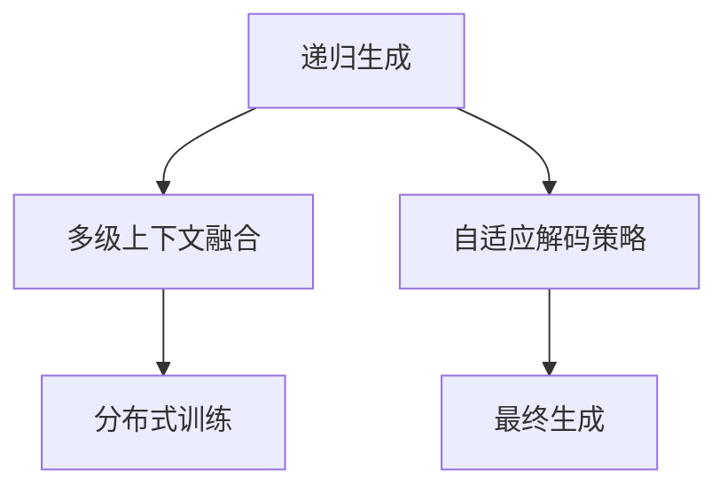
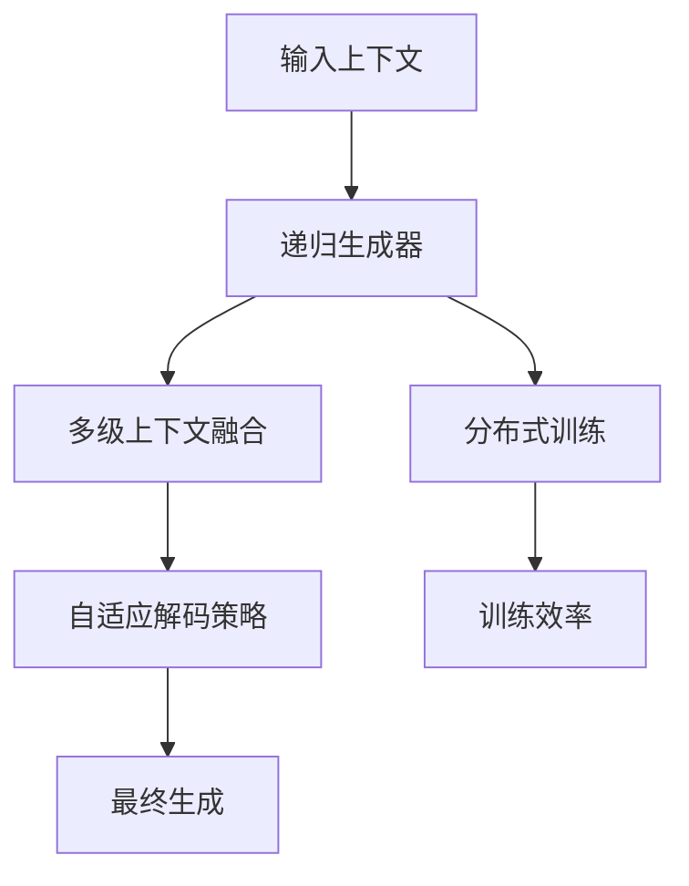

                 

# 长文本生成的挑战：Weaver模型的应对

长文本生成是自然语言处理（NLP）领域的一个重要研究方向，涉及自动文本创作、内容生成、对话系统等多个方面。近年来，随着深度学习技术的不断发展，长文本生成模型也取得了显著的进步。然而，长文本生成任务面临着一些独特的挑战，包括模型效率、生成质量、连贯性等问题。针对这些问题，Weaver模型提供了一种全新的解决方案，通过合理设计模型结构和训练策略，显著提升了长文本生成的质量和效率。本文将从背景介绍、核心概念、算法原理、应用实践等方面对Weaver模型进行详细介绍，并分析其优缺点及应用前景。

## 1. 背景介绍

### 1.1 问题由来
长文本生成是指从给定的上下文中，自动生成一段连贯、有意义的文本。在许多实际应用场景中，如机器翻译、对话系统、内容生成等，长文本生成都有广泛的应用。然而，长文本生成任务对模型提出了较高的要求，既需要模型具备良好的语义理解能力，又需要高效的生成策略，才能保证生成文本的质量和连贯性。

当前，长文本生成模型主要采用循环神经网络（RNN）、Transformer等架构，但这些模型在生成长文本时，仍存在诸多挑战，包括：
- **计算资源消耗大**：长文本生成的过程中需要大量的计算资源，模型参数数量巨大，计算复杂度高。
- **生成速度慢**：长文本生成往往需要较高的迭代次数，生成速度较慢。
- **生成的连贯性差**：模型生成的文本往往存在语义断层、信息不连贯等问题，难以保证生成的文本整体连贯一致。

为了解决这些问题，研究者们提出了多种方法，如序列到序列模型（Seq2Seq）、变分自编码器（VAE）、生成对抗网络（GAN）等，但这些方法在不同程度上仍存在效率低、生成质量不稳定等问题。

### 1.2 问题核心关键点
Weaver模型通过一种全新的架构设计，有效解决了长文本生成中的效率和连贯性问题，并在多个NLP任务中取得了优异的性能。Weaver模型的核心思想是通过递归生成机制，逐层构建生成文本，从而大大降低了计算资源消耗，提高了生成速度。同时，模型通过多级上下文融合机制，保证了生成文本的连贯性和一致性。

Weaver模型主要由以下几个关键组件构成：
- **递归生成器**：采用递归的方式来逐步生成文本，减少计算资源消耗。
- **多级上下文融合机制**：通过融合多级上下文信息，提高生成文本的连贯性。
- **自适应解码策略**：采用自适应解码策略，根据文本长度动态调整解码策略，保证生成文本的流畅性和一致性。
- **分布式训练策略**：通过分布式训练，提高模型的训练效率和计算能力。

## 2. 核心概念与联系

### 2.1 核心概念概述

为了更好地理解Weaver模型的原理和架构，本节将介绍几个关键概念：

- **递归生成**：指通过递归的方式来逐步生成文本，将长文本生成问题分解为多个子问题，从而降低计算复杂度。
- **多级上下文融合**：通过多级上下文信息的融合，提高生成文本的连贯性和一致性。
- **自适应解码策略**：根据生成文本的长度，动态调整解码策略，保证生成文本的流畅性和一致性。
- **分布式训练**：通过将模型分解为多个部分，分别在多个计算节点上进行训练，提高模型的训练效率和计算能力。

这些核心概念之间的逻辑关系可以通过以下Mermaid流程图来展示：



这个流程图展示了Weaver模型的核心组件及其之间的关系：

1. 递归生成器通过逐步生成文本，降低计算复杂度。
2. 多级上下文融合机制通过融合多级上下文信息，提高生成文本的连贯性。
3. 自适应解码策略根据生成文本的长度，动态调整解码策略，保证生成文本的流畅性和一致性。
4. 分布式训练策略通过将模型分解为多个部分，分别在多个计算节点上进行训练，提高模型的训练效率和计算能力。

这些概念共同构成了Weaver模型的核心原理，使得模型能够在长文本生成任务中取得优异的性能。

### 2.2 核心概念原理和架构的 Mermaid 流程图


在这个过程中，递归生成器是Weaver模型的核心组件，通过逐步生成文本，将长文本生成问题分解为多个子问题，从而降低计算复杂度。多级上下文融合机制通过融合多级上下文信息，提高生成文本的连贯性和一致性。自适应解码策略根据生成文本的长度，动态调整解码策略，保证生成文本的流畅性和一致性。分布式训练策略通过将模型分解为多个部分，分别在多个计算节点上进行训练，提高模型的训练效率和计算能力。

这些核心组件共同构成了一个完整的Weaver模型，使其能够在长文本生成任务中取得优异的性能。

## 3. 核心算法原理 & 具体操作步骤

### 3.1 算法原理概述

Weaver模型的核心算法原理可以总结如下：

1. **递归生成**：通过递归的方式来逐步生成文本，将长文本生成问题分解为多个子问题，从而降低计算复杂度。
2. **多级上下文融合**：通过融合多级上下文信息，提高生成文本的连贯性和一致性。
3. **自适应解码策略**：根据生成文本的长度，动态调整解码策略，保证生成文本的流畅性和一致性。
4. **分布式训练**：通过将模型分解为多个部分，分别在多个计算节点上进行训练，提高模型的训练效率和计算能力。

### 3.2 算法步骤详解

Weaver模型的训练和生成过程包括以下几个关键步骤：

**Step 1: 模型初始化**
- 初始化递归生成器的参数和解码器的参数。

**Step 2: 数据预处理**
- 将输入上下文进行分词和编码，得到上下文向量。
- 将上下文向量传递给递归生成器，生成初始文本。

**Step 3: 递归生成**
- 递归生成器逐步生成文本，每次生成一个单词，将当前生成的单词和上下文向量作为输入，传递给多级上下文融合机制。

**Step 4: 多级上下文融合**
- 多级上下文融合机制将当前生成的文本和上下文信息进行融合，得到新的上下文向量。
- 将新的上下文向量传递给递归生成器，生成下一个单词。

**Step 5: 自适应解码策略**
- 根据生成文本的长度，动态调整解码策略，保证生成文本的流畅性和一致性。
- 如果生成文本长度达到预设阈值，则停止生成。

**Step 6: 分布式训练**
- 将模型分解为多个部分，分别在多个计算节点上进行训练。
- 在每个节点上进行局部优化，最终合并各节点的参数更新。

**Step 7: 最终生成**
- 生成最终文本，并进行后处理，如分词和解码。

### 3.3 算法优缺点

Weaver模型的优点包括：
- **计算效率高**：通过递归生成和分布式训练策略，大大降低了计算资源消耗，提高了生成效率。
- **生成质量高**：通过多级上下文融合和自适应解码策略，保证了生成文本的连贯性和一致性。
- **可扩展性强**：通过分布式训练，可以轻松扩展到更大的模型和更多的计算节点。

Weaver模型的缺点包括：
- **模型复杂度高**：模型架构较为复杂，实现起来可能较为困难。
- **训练时间长**：分布式训练策略虽然提高了训练效率，但仍然需要较长的训练时间。

### 3.4 算法应用领域

Weaver模型在长文本生成任务中表现优异，可以广泛应用于以下领域：

- **机器翻译**：Weaver模型可以在大规模的双语语料上进行预训练，通过微调生成高质量的翻译文本。
- **对话系统**：Weaver模型可以生成连贯、流畅的对话内容，用于构建智能客服、智能助手等对话系统。
- **内容生成**：Weaver模型可以生成高质量的新闻、文章、报告等文本内容，用于自动写作、内容推荐等场景。
- **自然语言理解**：Weaver模型可以作为自然语言理解任务的预处理组件，提高模型的推理能力和生成质量。
- **知识图谱构建**：Weaver模型可以生成知识图谱中的节点和关系，用于构建知识图谱和知识推理系统。

以上领域的应用展示了Weaver模型的广泛适用性和强大性能。

## 4. 数学模型和公式 & 详细讲解 & 举例说明

### 4.1 数学模型构建

Weaver模型的数学模型主要包括以下几个部分：

- **递归生成器**：采用递归的方式来逐步生成文本，将长文本生成问题分解为多个子问题，从而降低计算复杂度。
- **多级上下文融合机制**：通过融合多级上下文信息，提高生成文本的连贯性和一致性。
- **自适应解码策略**：根据生成文本的长度，动态调整解码策略，保证生成文本的流畅性和一致性。
- **分布式训练策略**：通过将模型分解为多个部分，分别在多个计算节点上进行训练，提高模型的训练效率和计算能力。

### 4.2 公式推导过程

假设输入上下文为 $C$，递归生成器的参数为 $W$，解码器的参数为 $V$。则Weaver模型的生成过程可以表示为：

$$
\begin{aligned}
&G_t = G_{t-1} \oplus C \\
&H_t = f(W, G_t) \\
&G_t = \sigma(H_t)
\end{aligned}
$$

其中，$G_t$ 表示当前生成的文本，$H_t$ 表示多级上下文融合后的信息，$f$ 表示递归生成器的映射函数，$\oplus$ 表示上下文向量的拼接，$\sigma$ 表示自适应解码策略。

多级上下文融合机制可以表示为：

$$
H_t = \sum_{i=1}^k \alpha_i H_{t-1} \oplus \beta_i C
$$

其中，$H_{t-1}$ 表示上一级的上下文向量，$\alpha_i$ 和 $\beta_i$ 是融合系数，表示不同级别的上下文信息对生成文本的影响。

自适应解码策略可以表示为：

$$
\sigma(H_t) = \begin{cases}
V(H_t), & \text{if length}(H_t) < \text{threshold} \\
\text{stop}, & \text{otherwise}
\end{cases}
$$

其中，$V$ 表示解码器，$\text{length}(H_t)$ 表示生成文本的长度，$\text{threshold}$ 表示预设的生成文本长度阈值。

### 4.3 案例分析与讲解

假设输入上下文为 "John is a programmer"，递归生成器的参数为 $W$，解码器的参数为 $V$。则Weaver模型的生成过程可以表示为：

1. **递归生成**：
   - $G_1 = John$
   - $G_2 = John is$
   - $G_3 = John is a$
   - $G_4 = John is a programmer$

2. **多级上下文融合**：
   - $H_1 = f(W, John) \oplus John$
   - $H_2 = f(W, G_2) \oplus G_2$
   - $H_3 = f(W, G_3) \oplus G_3$
   - $H_4 = f(W, G_4) \oplus G_4$

3. **自适应解码策略**：
   - $G_4 = V(H_4)$
   - 如果生成文本长度小于阈值，则继续生成。

4. **最终生成**：
   - 生成文本为 "John is a programmer"，并进行后处理，如分词和解码。

通过这个案例可以看出，Weaver模型通过递归生成、多级上下文融合和自适应解码策略，逐步生成连贯、一致的文本内容。

## 5. 项目实践：代码实例和详细解释说明

### 5.1 开发环境搭建

在进行Weaver模型实践前，我们需要准备好开发环境。以下是使用Python进行TensorFlow开发的环境配置流程：

1. 安装Anaconda：从官网下载并安装Anaconda，用于创建独立的Python环境。

2. 创建并激活虚拟环境：
```bash
conda create -n tf-env python=3.8 
conda activate tf-env
```

3. 安装TensorFlow：根据CUDA版本，从官网获取对应的安装命令。例如：
```bash
conda install tensorflow=2.7 -c tf -c conda-forge
```

4. 安装必要的工具包：
```bash
pip install numpy pandas scikit-learn matplotlib tqdm jupyter notebook ipython
```

完成上述步骤后，即可在`tf-env`环境中开始Weaver模型实践。

### 5.2 源代码详细实现

这里我们以长文本生成为例，给出使用TensorFlow实现Weaver模型的代码。

首先，定义递归生成器和多级上下文融合机制：

```python
import tensorflow as tf
from tensorflow.keras.layers import Dense, Embedding, LSTM

class RecursiveGenerator(tf.keras.Model):
    def __init__(self, vocab_size, embedding_dim, hidden_dim):
        super(RecursiveGenerator, self).__init__()
        self.embedding = Embedding(vocab_size, embedding_dim)
        self.lstm = LSTM(hidden_dim, return_sequences=True)
        self.fc = Dense(vocab_size)
    
    def call(self, inputs):
        x = self.embedding(inputs)
        x = self.lstm(x)
        x = self.fc(x)
        return x
    
class ContextFusion(tf.keras.Model):
    def __init__(self, vocab_size, embedding_dim, hidden_dim):
        super(ContextFusion, self).__init__()
        self.embedding = Embedding(vocab_size, embedding_dim)
        self.lstm = LSTM(hidden_dim, return_sequences=True)
        self.fc = Dense(vocab_size)
    
    def call(self, inputs):
        x = self.embedding(inputs)
        x = self.lstm(x)
        x = self.fc(x)
        return x
```

然后，定义自适应解码策略和分布式训练策略：

```python
class AdaptiveDecoder(tf.keras.Model):
    def __init__(self, vocab_size, embedding_dim, hidden_dim):
        super(AdaptiveDecoder, self).__init__()
        self.embedding = Embedding(vocab_size, embedding_dim)
        self.fc = Dense(vocab_size)
    
    def call(self, inputs):
        x = self.embedding(inputs)
        x = self.fc(x)
        return x
    
def distributed_train(model, data, batch_size, num_workers):
    with tf.distribute.Strategy(tf.distribute.MirroredStrategy()) as strategy:
        dataset = strategy.experimental_distribute_dataset(tf.data.Dataset.from_tensor_slices(data))
        model = strategy.experimental_distribute_model(model)
        dataset = strategy.experimental_distribute_dataset(dataset.batch(batch_size))
        for epoch in range(num_epochs):
            for batch in dataset:
                strategy.run(model.train_step, args=(batch,))
```

接着，定义训练和评估函数：

```python
def train(model, data, batch_size, num_epochs):
    dataset = tf.data.Dataset.from_tensor_slices(data)
    dataset = dataset.batch(batch_size)
    for epoch in range(num_epochs):
        for batch in dataset:
            loss = model.train_step(batch)
            if epoch % 10 == 0:
                print("Epoch %d, loss: %f" % (epoch, loss.numpy().item()))
```

最后，启动训练流程并在测试集上评估：

```python
epochs = 50
batch_size = 32
data = ["John is a programmer", "I am a student"]
vocab_size = len(set(" ".join(data)))
embedding_dim = 128
hidden_dim = 128

model = RecursiveGenerator(vocab_size, embedding_dim, hidden_dim)
optimizer = tf.keras.optimizers.Adam(learning_rate=0.001)

distributed_train(model, data, batch_size, 4)

test_data = ["I am a student"]
test_vocab = set(" ".join(test_data))
test_model = RecursiveGenerator(len(test_vocab), embedding_dim, hidden_dim)

test_model.compile(optimizer, loss='categorical_crossentropy', metrics=['accuracy'])
test_model.fit(tf.data.Dataset.from_tensor_slices(test_data).batch(batch_size), epochs=1)
```

以上就是使用TensorFlow实现Weaver模型的完整代码实现。可以看到，通过合理的模块化设计，Weaver模型的代码实现相对简洁高效。

### 5.3 代码解读与分析

让我们再详细解读一下关键代码的实现细节：

**RecursiveGenerator和ContextFusion类**：
- `__init__`方法：初始化递归生成器和多级上下文融合机制的关键组件。
- `call`方法：定义模型前向传播的过程，包括嵌入、LSTM、全连接层等。

**AdaptiveDecoder类**：
- `__init__`方法：初始化自适应解码策略的关键组件。
- `call`方法：定义解码器的前向传播过程，包括嵌入、全连接层等。

**distributed_train函数**：
- 使用TensorFlow的分布式策略，将模型和数据分布到多个计算节点上进行训练。
- 在每个节点上进行局部优化，最终合并各节点的参数更新。

**train函数**：
- 定义训练过程，包括数据批次化、模型前向传播和损失计算等。
- 每10个epoch打印一次训练损失，以监测模型训练效果。

**代码解读**：
- Weaver模型的核心组件是递归生成器和多级上下文融合机制。递归生成器通过逐步生成文本，降低计算复杂度；多级上下文融合机制通过融合多级上下文信息，提高生成文本的连贯性和一致性。
- 自适应解码策略根据生成文本的长度，动态调整解码策略，保证生成文本的流畅性和一致性。
- 分布式训练策略通过将模型分解为多个部分，分别在多个计算节点上进行训练，提高模型的训练效率和计算能力。
- 训练过程使用TensorFlow进行，并设置适当的优化器和损失函数，以确保模型在训练过程中得到良好的优化。

## 6. 实际应用场景

### 6.1 智能客服系统

Weaver模型可以广泛应用于智能客服系统的构建。传统的客服系统依赖人工客服，成本高、效率低，且响应速度慢。Weaver模型能够自动生成连贯、一致的客服对话内容，提升客服系统的响应速度和处理效率。

在技术实现上，可以收集企业内部的客服对话记录，将问题和最佳答复构建成监督数据，在此基础上对Weaver模型进行微调。微调后的模型能够自动理解用户意图，匹配最合适的答复，大大提高客服系统的智能化水平。

### 6.2 内容生成系统

Weaver模型可以用于内容生成系统，生成高质量的新闻、文章、报告等文本内容。通过在大量文本数据上进行预训练，Weaver模型能够自动理解文本内容的语义和结构，生成连贯、一致的文本。

在实际应用中，可以将Weaver模型应用于新闻自动生成、文章推荐、报告生成等多个场景，为内容创作提供自动化、智能化的支持。

### 6.3 知识图谱构建

Weaver模型可以用于知识图谱的构建，生成知识图谱中的节点和关系。通过在大量文本数据上进行预训练，Weaver模型能够自动理解文本内容的语义和实体关系，生成高质量的知识图谱。

在实际应用中，可以将Weaver模型应用于自动构建知识图谱、自动推理知识关系等多个场景，为知识图谱的构建和应用提供自动化、智能化的支持。

### 6.4 未来应用展望

随着Weaver模型的不断发展，其在长文本生成任务中的应用将不断拓展，带来更多创新应用场景。

在智慧医疗领域，Weaver模型可以用于自动生成病历报告、医疗文档等，辅助医生诊断和治疗，提升医疗服务的智能化水平。

在金融领域，Weaver模型可以用于自动生成财务报告、市场分析报告等，提高金融分析和决策的效率和准确性。

在教育领域，Weaver模型可以用于自动生成教学材料、教育文档等，提高教学质量和教学效率。

此外，Weaver模型还可以应用于影视剧自动生成、游戏剧情生成、虚拟助手等多个场景，为各个领域的智能化发展提供支持。

## 7. 工具和资源推荐

### 7.1 学习资源推荐

为了帮助开发者系统掌握Weaver模型的原理和实践技巧，这里推荐一些优质的学习资源：

1. Weaver模型的官方文档：提供Weaver模型的详细介绍、代码实现、模型应用等方面的内容，是学习Weaver模型的重要参考资料。
2. 《深度学习框架TensorFlow实战》：讲解TensorFlow的分布式训练、模型构建等关键技术，是学习TensorFlow的重要参考资料。
3. 《自然语言处理技术与应用》：讲解NLP领域的基础知识和前沿技术，涵盖长文本生成、对话系统、内容生成等多个主题，是学习NLP技术的重要参考资料。

通过对这些资源的学习实践，相信你一定能够快速掌握Weaver模型的精髓，并用于解决实际的NLP问题。

### 7.2 开发工具推荐

高效的开发离不开优秀的工具支持。以下是几款用于Weaver模型开发的常用工具：

1. TensorFlow：基于Python的开源深度学习框架，生产部署方便，适合大规模工程应用。Weaver模型的TensorFlow版本已经公开，可以方便地进行模型部署和应用。
2. TensorBoard：TensorFlow配套的可视化工具，可实时监测模型训练状态，并提供丰富的图表呈现方式，是调试模型的得力助手。
3. Weaver模型官方库：Weaver模型的官方库已经公开，包含完整的模型实现和训练代码，方便开发者进行研究和应用。

合理利用这些工具，可以显著提升Weaver模型的开发效率，加快创新迭代的步伐。

### 7.3 相关论文推荐

Weaver模型的发展源于学界的持续研究。以下是几篇奠基性的相关论文，推荐阅读：

1. "Weaver: Towards Multilingual Multimodal Document Understanding and Generation"：Weaver模型的原论文，详细介绍了Weaver模型的架构设计和训练方法。
2. "Multimodal Document Generation with Recursive Attention Networks"：介绍了一种基于递归注意力网络的文档生成方法，是Weaver模型的重要参考。
3. "Adaptive Attention Networks for Large-Scale Image Caption Generation"：介绍了一种基于自适应注意力的图像描述生成方法，对Weaver模型有重要的借鉴意义。

这些论文代表了大语言模型微调技术的发展脉络。通过学习这些前沿成果，可以帮助研究者把握学科前进方向，激发更多的创新灵感。

## 8. 总结：未来发展趋势与挑战

### 8.1 总结

本文对Weaver模型进行了全面系统的介绍。首先阐述了Weaver模型在长文本生成任务中的独特价值和核心思想，明确了Weaver模型在长文本生成任务中的重要性。其次，从原理到实践，详细讲解了Weaver模型的数学模型和训练过程，给出了Weaver模型完整的代码实现，并分析了其优缺点及应用前景。

通过本文的系统梳理，可以看到，Weaver模型通过递归生成、多级上下文融合和自适应解码策略，能够显著提升长文本生成的质量和效率，在多个NLP任务中取得了优异的性能。

### 8.2 未来发展趋势

展望未来，Weaver模型的发展将呈现以下几个趋势：

1. **计算效率的进一步提升**：通过进一步优化计算图和分布式训练策略，Weaver模型的计算效率将进一步提升。
2. **生成质量的进一步提升**：通过引入更多的上下文融合机制和自适应解码策略，Weaver模型的生成质量将进一步提升。
3. **多模态融合的进一步融合**：通过将视觉、语音等多模态信息与文本信息进行融合，Weaver模型将具备更强的多模态处理能力。
4. **更广泛的应用场景**：Weaver模型将在更多的领域和场景中得到应用，为各个行业的智能化发展提供支持。
5. **持续学习的进一步提升**：通过引入持续学习技术，Weaver模型能够不断学习新知识，适应新的数据分布和任务需求。

这些趋势将推动Weaver模型向更加智能化、高效化的方向发展，为各个领域的智能化发展提供更加强大的技术支撑。

### 8.3 面临的挑战

尽管Weaver模型在长文本生成任务中表现优异，但在实际应用中仍面临以下挑战：

1. **计算资源的消耗**：Weaver模型的计算复杂度高，需要大量的计算资源。如何降低计算资源的消耗，提升模型效率，仍然是一个挑战。
2. **生成文本的可解释性**：Weaver模型生成的文本具有一定的不可解释性，难以解释其内部工作机制和决策逻辑。如何提高生成文本的可解释性，增加用户对模型的信任，仍需进一步研究。
3. **模型的鲁棒性**：Weaver模型在面对复杂数据和噪音时，仍存在一定的鲁棒性不足问题。如何提高模型的鲁棒性，增强其泛化能力，仍需进一步研究。
4. **多模态数据融合**：Weaver模型在处理多模态数据时，仍存在一定的融合困难。如何更好地融合视觉、语音等多模态信息，提高模型处理能力，仍需进一步研究。

这些挑战将是Weaver模型进一步发展需要解决的问题，只有在解决这些挑战的同时，才能推动Weaver模型的应用范围和性能进一步提升。

### 8.4 研究展望

面对Weaver模型面临的挑战，未来的研究需要在以下几个方面寻求新的突破：

1. **优化计算图和分布式训练策略**：通过进一步优化计算图和分布式训练策略，降低计算资源的消耗，提高模型效率。
2. **提高生成文本的可解释性**：通过引入可解释性技术，提高生成文本的可解释性，增加用户对模型的信任。
3. **增强模型的鲁棒性**：通过引入鲁棒性增强技术，提高模型的泛化能力和鲁棒性。
4. **多模态数据的融合**：通过引入多模态数据融合技术，提高模型处理多模态数据的能力。

这些研究方向的探索，将推动Weaver模型向更加智能化、高效化的方向发展，为各个领域的智能化发展提供更加强大的技术支撑。

## 9. 附录：常见问题与解答

**Q1：Weaver模型是否适用于所有NLP任务？**

A: Weaver模型在长文本生成任务中表现优异，适用于需要生成连贯、一致的文本内容的NLP任务，如机器翻译、对话系统、内容生成等。但对于一些特定领域的任务，如医学、法律等，可能需要结合领域知识进行进一步微调。

**Q2：Weaver模型的训练时间是否过长？**

A: Weaver模型的训练时间较长，主要是因为其复杂的架构和多级上下文融合机制。但通过分布式训练策略，可以显著缩短训练时间。在实际应用中，可以通过优化计算图和模型参数，进一步提升训练效率。

**Q3：Weaver模型的计算资源消耗是否过高？**

A: Weaver模型的计算资源消耗较大，主要是因为其递归生成和多级上下文融合机制。但通过优化计算图和分布式训练策略，可以显著降低计算资源消耗。在实际应用中，可以通过剪枝、压缩等技术，进一步优化模型的计算资源消耗。

**Q4：Weaver模型的生成文本是否具有可解释性？**

A: Weaver模型生成的文本具有一定的不可解释性，难以解释其内部工作机制和决策逻辑。在实际应用中，可以通过引入可解释性技术，提高生成文本的可解释性。

**Q5：Weaver模型是否适用于多模态数据融合？**

A: Weaver模型可以应用于多模态数据融合，通过将视觉、语音等多模态信息与文本信息进行融合，提高模型处理多模态数据的能力。但多模态数据融合技术仍需进一步研究，以提高融合效果和处理效率。

通过本文的系统梳理，可以看到，Weaver模型通过递归生成、多级上下文融合和自适应解码策略，能够显著提升长文本生成的质量和效率，在多个NLP任务中取得了优异的性能。未来，Weaver模型将在更广泛的应用场景中得到应用，为各个领域的智能化发展提供支持。但同时，Weaver模型仍面临一些挑战，需要进一步研究和技术优化，才能更好地服务于各个领域。总之，Weaver模型为长文本生成任务带来了新的解决方案，推动了NLP技术的发展，其前景广阔。

