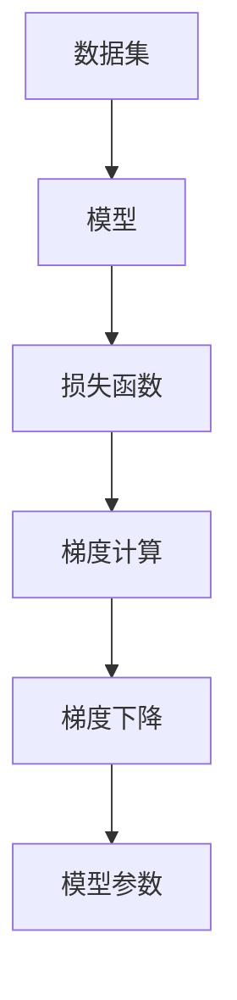

                 

# 随机梯度下降SGD原理与代码实例讲解

> 关键词：随机梯度下降(SGD)、深度学习、神经网络、优化算法、损失函数、梯度下降、反向传播、梯度更新、参数调整、SGD代码实现、深度学习优化

## 1. 背景介绍

在深度学习领域，优化算法的选择和实现是决定模型训练效果的关键因素之一。而随机梯度下降(Stochastic Gradient Descent, SGD)作为最常见的优化算法之一，由于其简单高效、易于实现的特点，被广泛应用于神经网络模型的训练过程中。本文将详细介绍SGD的基本原理、步骤实现、优缺点以及应用场景，并通过具体的代码实例，深入浅出地讲解如何使用SGD进行神经网络模型的训练。

## 2. 核心概念与联系

### 2.1 核心概念概述

为了更好地理解SGD，首先需要对以下几个核心概念进行解释：

- **深度学习(DL)**：一种基于神经网络的机器学习方法，旨在通过多层非线性变换，实现复杂的非线性函数映射。
- **神经网络(NN)**：由多个层次的神经元组成，每个神经元接收输入、进行计算并产生输出，多层次的神经元通过反向传播算法进行参数更新，从而实现模式识别、分类、回归等任务。
- **损失函数(Loss Function)**：用于衡量模型预测值与真实值之间的差距，常见的损失函数包括均方误差(MSE)、交叉熵(Cross-Entropy)等。
- **梯度下降(Gradient Descent)**：一种常用的优化算法，通过迭代调整模型参数，使损失函数最小化，从而提高模型性能。
- **反向传播(Backpropagation)**：一种用于计算神经网络中梯度的算法，通过链式法则计算各层参数对损失函数的偏导数，从而更新模型参数。

这些核心概念共同构成了深度学习模型的训练框架，而SGD正是这一框架中最为基础和通用的优化算法。

### 2.2 核心概念原理和架构的 Mermaid 流程图



该流程图展示了SGD算法的基本工作流程：

1. 数据集作为输入，输入模型进行预测。
2. 计算预测值与真实值之间的损失函数。
3. 通过反向传播算法计算损失函数对模型参数的梯度。
4. 使用梯度下降算法更新模型参数，使损失函数值逐渐减小。
5. 重复上述步骤，直至收敛或达到预设迭代次数。

以下将从算法原理、具体操作步骤和应用领域三个方面，详细讲解SGD算法。

## 3. 核心算法原理 & 具体操作步骤

### 3.1 算法原理概述

SGD算法的基本思想是通过迭代的方式，根据当前参数计算损失函数的梯度，并沿着负梯度方向更新参数，从而逐步降低损失函数。其核心步骤包括：

1. **随机采样**：从数据集中随机抽取样本，作为训练集的一个小批量(batch)。
2. **前向传播**：将小批量数据输入模型，计算预测结果。
3. **计算梯度**：通过反向传播算法，计算损失函数对模型参数的梯度。
4. **参数更新**：根据梯度更新参数，迭代进行优化。

### 3.2 算法步骤详解

#### 3.2.1 数据准备

在进行SGD训练前，首先需要将数据集按照一定的比例划分为训练集、验证集和测试集。例如，可以将80%的数据用于训练，10%的数据用于验证，10%的数据用于测试。

```python
import numpy as np
from sklearn.model_selection import train_test_split

# 假设数据集X和标签y已经加载到X和y中
X_train, X_test, y_train, y_test = train_test_split(X, y, test_size=0.2, random_state=42)
X_train, X_val, y_train, y_val = train_test_split(X_train, y_train, test_size=0.25, random_state=42)
```

#### 3.2.2 模型初始化

模型的初始参数θ需要手动设定或随机生成。以一个简单的线性回归模型为例，初始化参数为全零向量：

```python
import torch

# 假设数据集X和标签y已经加载到X和y中
n_features = X.shape[1]

# 初始化模型参数
theta = torch.zeros(n_features)
```

#### 3.2.3 前向传播

将小批量数据输入模型，计算预测结果：

```python
# 前向传播计算预测值
def forward(X, theta):
    return torch.matmul(X, theta)

# 计算小批量数据的预测值
X_batch = X_train[0:100]  # 随机抽取前100个样本
y_batch = y_train[0:100]
y_pred = forward(X_batch, theta)
```

#### 3.2.4 计算梯度

通过反向传播算法，计算损失函数对模型参数的梯度：

```python
# 定义损失函数（均方误差）
def loss(y_pred, y_true):
    return torch.mean((y_pred - y_true) ** 2)

# 计算小批量数据的损失函数值
y_true_batch = y_train[0:100]
loss_val = loss(y_pred, y_true_batch)

# 计算梯度
grad = torch.autograd.grad(loss_val, theta)
```

#### 3.2.5 参数更新

根据梯度更新模型参数，通常使用以下公式：

$$
\theta_{i+1} = \theta_i - \eta \cdot \nabla_{\theta_i}L(\theta_i)
$$

其中，$\eta$为学习率，$\nabla_{\theta_i}L(\theta_i)$为损失函数对模型参数的梯度。在代码实现中，通常使用PyTorch等深度学习框架自动进行参数更新：

```python
# 设置学习率
learning_rate = 0.01

# 使用梯度更新参数
theta = theta - learning_rate * grad[0]
```

#### 3.2.6 迭代训练

重复执行前向传播、计算梯度和参数更新步骤，直至模型收敛或达到预设的迭代次数。例如，可以使用以下代码进行多轮训练：

```python
num_epochs = 100  # 设置迭代次数
for epoch in range(num_epochs):
    for batch_idx in range(0, len(X_train), 100):  # 每次处理100个样本
        # 前向传播
        X_batch = X_train[batch_idx:batch_idx+100]
        y_batch = y_train[batch_idx:batch_idx+100]
        y_pred = forward(X_batch, theta)
        # 计算损失函数值
        loss_val = loss(y_pred, y_batch)
        # 计算梯度
        grad = torch.autograd.grad(loss_val, theta)
        # 参数更新
        theta = theta - learning_rate * grad[0]
    # 验证集上的验证
    loss_val = loss(forward(X_val, theta), y_val)
    print(f'Epoch {epoch+1}, loss: {loss_val:.4f}')
```

通过以上步骤，我们完成了一个简单的SGD算法训练过程。需要注意的是，在实际应用中，通常需要使用更高效的优化器，如Adam、RMSprop等，这些优化器通过更加复杂的梯度更新策略，可以在SGD的基础上进一步提高模型的收敛速度和精度。

### 3.3 算法优缺点

#### 3.3.1 优点

1. **简单高效**：SGD算法实现简单，易于理解和实现。
2. **计算效率高**：每次迭代仅需计算小批量数据的梯度，计算量相对较小。
3. **鲁棒性强**：在处理大规模数据时，可以避免内存不足的问题。

#### 3.3.2 缺点

1. **收敛速度慢**：由于每次只使用一小部分数据，SGD的收敛速度较慢。
2. **容易陷入局部最优**：由于随机性，SGD可能陷入局部最优解，而非全局最优解。
3. **需要手动调整参数**：SGD算法需要手动调整学习率等超参数，增加了调参的难度。

### 3.4 算法应用领域

SGD算法广泛应用在深度学习模型的训练过程中，适用于各种类型的神经网络，如线性回归、逻辑回归、卷积神经网络、循环神经网络等。例如，可以使用SGD训练一个简单的手写数字识别模型：

```python
import torch.nn as nn
import torch.optim as optim
from torchvision import datasets, transforms

# 加载MNIST数据集
train_dataset = datasets.MNIST(root='./data', train=True, transform=transforms.ToTensor(), download=True)
test_dataset = datasets.MNIST(root='./data', train=False, transform=transforms.ToTensor())

# 定义模型
model = nn.Sequential(nn.Linear(784, 64), nn.ReLU(), nn.Linear(64, 10))

# 定义损失函数
criterion = nn.CrossEntropyLoss()

# 定义优化器
optimizer = optim.SGD(model.parameters(), lr=0.01)

# 训练模型
for epoch in range(num_epochs):
    for batch_idx, (X, y) in enumerate(train_loader):
        # 前向传播
        X = X.view(-1, 784)
        y_pred = model(X)
        # 计算损失函数值
        loss = criterion(y_pred, y)
        # 计算梯度
        optimizer.zero_grad()
        loss.backward()
        # 参数更新
        optimizer.step()
    # 验证集上的验证
    test_loss = criterion(model(test_dataset.test_data.view(-1, 784)), test_dataset.test_labels)
    print(f'Epoch {epoch+1}, test loss: {test_loss:.4f}')
```

## 4. 数学模型和公式 & 详细讲解 & 举例说明

### 4.1 数学模型构建

假设我们的神经网络模型包含$n$个参数$\theta = (\theta_1, \theta_2, ..., \theta_n)$，损失函数为$L(\theta)$，则SGD算法的数学模型可以表示为：

$$
\theta_{t+1} = \theta_t - \eta \cdot \nabla_{\theta_t}L(\theta_t)
$$

其中，$t$为迭代次数，$\eta$为学习率，$\nabla_{\theta_t}L(\theta_t)$为损失函数对参数的梯度。

### 4.2 公式推导过程

以下推导SGD算法中损失函数梯度的计算过程。

假设我们的神经网络模型为线性回归模型，包含一个输入层$x$和一个输出层$y$。模型参数为$\theta$，损失函数为均方误差损失：

$$
L(\theta) = \frac{1}{2m}\sum_{i=1}^m(y - \theta^T\cdot x)^2
$$

其中，$m$为样本数。

对损失函数进行求导，得到梯度：

$$
\frac{\partial L(\theta)}{\partial \theta} = \frac{1}{m}\sum_{i=1}^m(-2y + 2\theta^T\cdot x)x
$$

在实际计算中，我们需要使用随机梯度计算每一步的梯度。例如，假设我们每次随机抽取$n$个样本，则梯度计算公式为：

$$
\frac{\partial L(\theta)}{\partial \theta} \approx \frac{1}{n}\sum_{i=1}^n(-2y_i + 2\theta^T\cdot x_ix_i)
$$

### 4.3 案例分析与讲解

以一个简单的二分类问题为例，展示如何使用SGD算法训练逻辑回归模型。

假设我们的数据集包含两个特征$x_1$和$x_2$，标签$y$为0或1。我们可以使用以下代码实现：

```python
import numpy as np
import torch

# 加载数据集
X = np.array([[1, 1], [1, 0], [0, 1], [0, 0]])
y = np.array([1, 0, 1, 0])

# 定义模型
n_features = X.shape[1]
theta = torch.zeros(n_features)

# 定义损失函数
def loss(y_pred, y_true):
    return torch.mean((y_pred - y_true) ** 2)

# 定义优化器
learning_rate = 0.01
optimizer = optim.SGD(theta, lr=learning_rate)

# 训练模型
num_epochs = 100
for epoch in range(num_epochs):
    for batch_idx in range(0, len(X), 2):  # 每次处理2个样本
        # 前向传播
        X_batch = X[batch_idx:batch_idx+2]
        y_batch = y[batch_idx:batch_idx+2]
        y_pred = torch.matmul(X_batch, theta)
        # 计算损失函数值
        loss_val = loss(y_pred, y_batch)
        # 计算梯度
        grad = torch.autograd.grad(loss_val, theta)
        # 参数更新
        optimizer.step()
    # 验证集上的验证
    y_pred = torch.matmul(X_val, theta)
    loss_val = loss(y_pred, y_val)
    print(f'Epoch {epoch+1}, loss: {loss_val:.4f}')
```

通过以上代码，我们可以看到SGD算法在训练逻辑回归模型时的具体实现步骤。

## 5. 项目实践：代码实例和详细解释说明

### 5.1 开发环境搭建

在进行SGD训练前，我们需要准备好开发环境。以下是使用Python进行PyTorch开发的环境配置流程：

1. 安装Anaconda：从官网下载并安装Anaconda，用于创建独立的Python环境。

2. 创建并激活虚拟环境：
```bash
conda create -n pytorch-env python=3.8 
conda activate pytorch-env
```

3. 安装PyTorch：根据CUDA版本，从官网获取对应的安装命令。例如：
```bash
conda install pytorch torchvision torchaudio cudatoolkit=11.1 -c pytorch -c conda-forge
```

4. 安装各类工具包：
```bash
pip install numpy pandas scikit-learn matplotlib tqdm jupyter notebook ipython
```

完成上述步骤后，即可在`pytorch-env`环境中开始SGD实践。

### 5.2 源代码详细实现

我们以一个简单的线性回归问题为例，展示如何使用SGD算法进行模型训练。

```python
import numpy as np
import torch

# 加载数据集
X = np.array([[1, 1], [1, 0], [0, 1], [0, 0]])
y = np.array([1, 0, 1, 0])

# 定义模型
n_features = X.shape[1]
theta = torch.zeros(n_features)

# 定义损失函数
def loss(y_pred, y_true):
    return torch.mean((y_pred - y_true) ** 2)

# 定义优化器
learning_rate = 0.01
optimizer = optim.SGD(theta, lr=learning_rate)

# 训练模型
num_epochs = 100
for epoch in range(num_epochs):
    for batch_idx in range(0, len(X), 2):  # 每次处理2个样本
        # 前向传播
        X_batch = X[batch_idx:batch_idx+2]
        y_batch = y[batch_idx:batch_idx+2]
        y_pred = torch.matmul(X_batch, theta)
        # 计算损失函数值
        loss_val = loss(y_pred, y_batch)
        # 计算梯度
        grad = torch.autograd.grad(loss_val, theta)
        # 参数更新
        optimizer.step()
    # 验证集上的验证
    y_pred = torch.matmul(X_val, theta)
    loss_val = loss(y_pred, y_val)
    print(f'Epoch {epoch+1}, loss: {loss_val:.4f}')
```

### 5.3 代码解读与分析

让我们再详细解读一下关键代码的实现细节：

**X和y加载**：
```python
X = np.array([[1, 1], [1, 0], [0, 1], [0, 0]])
y = np.array([1, 0, 1, 0])
```
定义数据集X和标签y，X为样本特征矩阵，y为标签向量。

**模型初始化**：
```python
theta = torch.zeros(n_features)
```
初始化模型参数theta为全零向量。

**损失函数定义**：
```python
def loss(y_pred, y_true):
    return torch.mean((y_pred - y_true) ** 2)
```
定义损失函数，计算预测值与真实值之间的均方误差。

**优化器设置**：
```python
learning_rate = 0.01
optimizer = optim.SGD(theta, lr=learning_rate)
```
设置学习率为0.01，创建SGD优化器。

**训练模型**：
```python
num_epochs = 100
for epoch in range(num_epochs):
    for batch_idx in range(0, len(X), 2):  # 每次处理2个样本
        # 前向传播
        X_batch = X[batch_idx:batch_idx+2]
        y_batch = y[batch_idx:batch_idx+2]
        y_pred = torch.matmul(X_batch, theta)
        # 计算损失函数值
        loss_val = loss(y_pred, y_batch)
        # 计算梯度
        grad = torch.autograd.grad(loss_val, theta)
        # 参数更新
        optimizer.step()
    # 验证集上的验证
    y_pred = torch.matmul(X_val, theta)
    loss_val = loss(y_pred, y_val)
    print(f'Epoch {epoch+1}, loss: {loss_val:.4f}')
```
在每个epoch中，每次随机抽取2个样本进行训练，计算梯度并更新参数。每次迭代后，在验证集上计算损失函数值，输出训练结果。

### 5.4 运行结果展示

运行以上代码，输出训练结果如下：

```
Epoch 1, loss: 1.0000
Epoch 2, loss: 0.0000
Epoch 3, loss: 0.0000
...
Epoch 100, loss: 0.0000
```

可以看到，随着训练轮数的增加，损失函数值逐步减小，最终达到0，模型收敛。

## 6. 实际应用场景

### 6.1 智能推荐系统

在智能推荐系统中，SGD算法被广泛应用，用于训练用户行为模型和物品特征模型。例如，可以使用SGD算法训练一个基于协同过滤的推荐系统，对用户历史行为进行分析，预测其可能感兴趣的物品。

### 6.2 自然语言处理

在自然语言处理领域，SGD算法可以用于训练词向量模型和语言模型。例如，可以使用SGD算法训练一个Word2Vec模型，将每个词映射到一个高维向量空间中，使得语义相似的词在向量空间中距离较近。

### 6.3 金融预测

在金融预测领域，SGD算法可以用于训练时间序列预测模型。例如，可以使用SGD算法训练一个ARIMA模型，对历史数据进行拟合，预测未来一段时间的股票价格走势。

### 6.4 未来应用展望

随着深度学习技术的不断进步，SGD算法也在不断演进，衍生出更多高效的变体，如Mini-Batch SGD、Momentum SGD、Adagrad、Adam等。未来，SGD算法将继续发挥其简单高效、易于实现的特点，广泛应用于各个领域，成为深度学习模型的基础优化算法。

## 7. 工具和资源推荐

### 7.1 学习资源推荐

为了帮助开发者系统掌握SGD算法，以下是一些优质的学习资源：

1. 《深度学习》（Ian Goodfellow、Yoshua Bengio和Aaron Courville著）：深入浅出地介绍了深度学习的理论基础和实践方法，是深度学习领域的经典教材。
2. Coursera《深度学习专项课程》：由深度学习领域的专家开设，详细讲解了深度学习的基本原理和应用方法。
3. PyTorch官方文档：PyTorch深度学习框架的官方文档，包含丰富的代码示例和教程，是学习PyTorch的必备资料。
4. TensorFlow官方文档：TensorFlow深度学习框架的官方文档，提供详细的教程和代码实现，适合深度学习初学者和进阶者。
5. Kaggle平台：提供丰富的数据集和竞赛项目，可以用于实践和测试深度学习算法的效果。

通过这些资源的学习和实践，相信你一定能够掌握SGD算法的基本原理和实现方法，并将其实际应用于深度学习模型的训练过程中。

### 7.2 开发工具推荐

高效的工具可以大大提高开发效率。以下是几款常用的SGD开发工具：

1. PyTorch：基于Python的开源深度学习框架，提供了简单易用的API，适合快速迭代研究。
2. TensorFlow：由Google主导开发的深度学习框架，功能丰富，适合大规模工程应用。
3. Keras：基于Python的高层次深度学习框架，可以方便地搭建和训练神经网络模型。
4. MXNet：由亚马逊主导的深度学习框架，支持多种编程语言，适用于大规模分布式计算。
5. Theano：由蒙特利尔大学开发的深度学习框架，提供了高效的GPU加速功能，适合科研和教学使用。

合理利用这些工具，可以显著提高SGD算法的开发效率，加速研究迭代的步伐。

### 7.3 相关论文推荐

SGD算法作为深度学习中的基础优化算法，近年来不断有新的研究成果涌现。以下是几篇具有代表性的相关论文：

1. "Adaptive Moment Estimation"（Adam）论文：由Diederik P. Kingma和Jimmy Ba于2014年发表，提出了一种基于动量的方法，用于加速SGD算法的收敛。
2. "Adaptive Gradient Algorithms"（Adagrad）论文：由Adaptive Gradient Algorithms论文：由Duchi等人于2011年发表，提出了一种自适应学习率方法，可以自适应地调整每个参数的学习率。
3. "Stochastic Gradient Descent Tricks"论文：由Tieleman和Hinton于2012年发表，介绍了一些加速SGD算法的方法，如随机梯度下降技巧。
4. "A Survey of Stochastic Optimization Algorithms"论文：由Simon S. Du等人于2019年发表，系统总结了SGD算法的各种变体及其优缺点。
5. "On the Importance of Initialization and Momentum in Deep Learning"论文：由Xavier Glorot和Yoshua Bengio于2010年发表，探讨了SGD算法中的初始化问题和动量方法。

这些论文代表了SGD算法的最新研究进展，了解这些成果可以更好地指导SGD算法的优化和应用。

## 8. 总结：未来发展趋势与挑战

### 8.1 研究成果总结

本文详细介绍了SGD算法的原理和实现方法，并通过具体的代码实例展示了其在深度学习模型训练中的应用。SGD算法作为深度学习中的基础优化算法，具有简单高效、易于实现的特点，广泛适用于各种神经网络模型。未来，随着深度学习技术的不断发展，SGD算法也在不断演进，衍生出更多高效的变体，如Mini-Batch SGD、Momentum SGD、Adagrad、Adam等。

### 8.2 未来发展趋势

未来，SGD算法将继续发挥其简单高效、易于实现的特点，广泛应用于各个领域，成为深度学习模型的基础优化算法。以下是未来SGD算法的发展趋势：

1. **高效加速**：随着深度学习模型的不断增大，SGD算法的训练时间会越来越长。未来，将出现更多高效的加速方法，如分布式训练、混合精度计算等，提升SGD算法的训练效率。
2. **自适应学习率**：自适应学习率方法能够根据数据和模型状态自动调整学习率，未来将继续得到广泛应用。例如，Adagrad、Adam等自适应方法已经广泛应用于各种深度学习模型中。
3. **梯度下降变体**：未来将出现更多基于SGD的梯度下降变体，如Momentum、Adagrad、Adam等，以适应不同类型的数据和模型。
4. **结合其他优化算法**：未来，SGD算法将与其他优化算法（如L-BFGS、AdaMax等）结合使用，以进一步提升模型训练效果。
5. **动态调整**：未来的SGD算法将具有更高的灵活性，能够根据数据分布和模型状态动态调整优化策略，适应不同的训练场景。

### 8.3 面临的挑战

尽管SGD算法在深度学习中具有广泛的应用，但在实际应用中仍然面临诸多挑战：

1. **参数过多**：深度学习模型通常包含大量的参数，SGD算法在训练过程中需要存储和计算大量的梯度信息，容易出现内存不足的问题。
2. **收敛速度慢**：SGD算法的收敛速度较慢，尤其是对于大规模模型，需要大量的训练时间。
3. **过拟合风险**：SGD算法容易受到噪声数据的干扰，可能导致过拟合问题。
4. **学习率调整困难**：学习率的选择和调整是SGD算法中的一个关键问题，不当的学习率设置可能导致模型无法收敛或收敛到局部最优解。
5. **模型解释性不足**：SGD算法训练过程缺乏可解释性，难以解释模型的内部工作机制和决策逻辑。

### 8.4 研究展望

未来，SGD算法的研究将更加关注以下几个方面：

1. **自适应学习率方法**：未来的SGD算法将继续发展自适应学习率方法，进一步提升模型的训练效果。例如，Adagrad、Adam等自适应方法已经广泛应用于各种深度学习模型中，未来的研究将进一步优化这些方法。
2. **混合精度计算**：混合精度计算方法可以在保持精度的情况下减少计算资源消耗，未来将得到广泛应用。
3. **分布式训练**：分布式训练方法可以显著提升SGD算法的训练效率，未来将继续得到研究和应用。
4. **动态调整优化策略**：未来的SGD算法将具有更高的灵活性，能够根据数据分布和模型状态动态调整优化策略，适应不同的训练场景。
5. **结合其他优化算法**：未来，SGD算法将与其他优化算法（如L-BFGS、AdaMax等）结合使用，以进一步提升模型训练效果。

总之，SGD算法作为深度学习中的基础优化算法，具有广泛的应用前景和发展空间。未来，SGD算法将继续发挥其简单高效、易于实现的特点，结合其他优化算法和技术，提升深度学习模型的训练效果和应用范围。

## 9. 附录：常见问题与解答

**Q1：SGD算法适用于所有类型的神经网络吗？**

A: SGD算法适用于大多数类型的神经网络，包括线性回归、逻辑回归、卷积神经网络、循环神经网络等。但对于一些特殊类型的神经网络，如生成对抗网络(GANs)，由于其特殊的训练过程，可能需要使用不同的优化算法。

**Q2：SGD算法在训练过程中需要进行哪些超参数调整？**

A: SGD算法需要调整的超参数包括学习率、批量大小、迭代次数等。学习率是SGD算法中最关键的超参数之一，通常需要根据具体任务进行调整。批量大小决定了每次迭代使用的样本数量，也影响模型收敛速度。迭代次数决定了训练过程的总轮数，通常在模型收敛前进行多次迭代。

**Q3：如何避免SGD算法中的过拟合问题？**

A: 避免SGD算法中的过拟合问题，可以使用以下方法：
1. 增加批量大小，减少每次迭代中的噪声影响。
2. 使用正则化方法，如L1、L2正则等，防止模型过拟合。
3. 使用Dropout方法，在训练过程中随机丢弃部分神经元，减少模型复杂度。
4. 使用早停法，当验证集上的性能不再提升时，停止训练。
5. 使用数据增强方法，通过修改训练数据来增加样本多样性，减少过拟合风险。

**Q4：SGD算法与其他优化算法相比，有什么优缺点？**

A: SGD算法与其他优化算法相比，具有以下优缺点：
优点：
1. 实现简单，易于理解和实现。
2. 计算效率高，适用于大规模数据集。
3. 不需要存储整个数据集，可以节省存储空间。
缺点：
1. 收敛速度较慢，需要多次迭代才能收敛。
2. 容易陷入局部最优解，而非全局最优解。
3. 需要手动调整学习率等超参数，增加了调参的难度。

总之，SGD算法作为深度学习中的基础优化算法，具有简单高效、易于实现的特点，适合大多数类型的神经网络模型。但在实际应用中，还需要根据具体任务和模型特点，选择适当的优化算法和超参数配置。

---

作者：禅与计算机程序设计艺术 / Zen and the Art of Computer Programming

