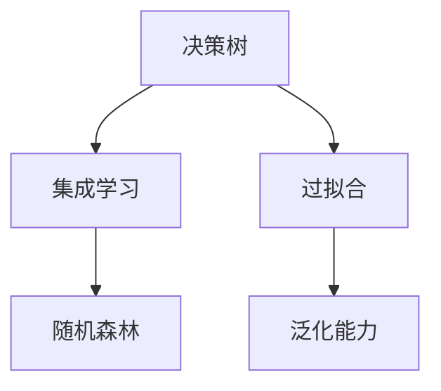

                 

# 随机森林 (Random Forest)

> 关键词：随机森林,决策树,集成学习,特征重要性,模型融合,特征选择,过拟合,泛化能力

## 1. 背景介绍

### 1.1 问题由来

在机器学习领域，决策树因其易于理解和解释，而被广泛应用在分类和回归任务中。然而，决策树模型存在过拟合和泛化能力不足的问题，尤其在处理高维数据时，容易陷入局部最优。为解决这些问题，研究人员提出了集成学习的思想，通过组合多个基模型（如决策树），来提升整体模型的泛化能力和稳定性。

随机森林（Random Forest, RF）就是在这样的背景下提出的。作为一种经典的集成学习方法，随机森林在许多实际应用中表现优异，如金融风险评估、医疗诊断、市场分析等。本文将系统介绍随机森林的原理、算法步骤和应用场景，并结合代码实例进行详细讲解。

## 2. 核心概念与联系

### 2.1 核心概念概述

为更好地理解随机森林，首先需要掌握以下核心概念：

- **决策树（Decision Tree）**：一种基于树结构的分类和回归模型。决策树通过对数据集进行递归二分，构建出一颗决策树，以实现从输入到输出的映射。
- **集成学习（Ensemble Learning）**：将多个基模型组合起来，形成一个更强大的复合模型。集成方法可以通过投票、平均等方式综合各个基模型的结果。
- **过拟合（Overfitting）**：模型在训练集上表现优秀，但在测试集或新数据上表现不佳的现象。过拟合通常是因为模型过于复杂，过于关注训练集的细节。
- **泛化能力（Generalization Capability）**：模型在未见过的数据上表现优秀的能力。泛化能力是评估模型性能的重要指标。

### 2.2 核心概念联系

随机森林将决策树和集成学习的思想相结合，通过对多个决策树进行组合和融合，构建出一个随机且并行的决策森林。以下是对这些概念的逻辑关系展示：



- 决策树：作为随机森林的基模型，通过递归二分数据集，学习数据的内在结构和规律。
- 集成学习：通过组合多个决策树，随机森林能够更好地泛化，提升模型的稳定性和性能。
- 过拟合：单个决策树容易过拟合训练数据，随机森林通过随机采样和随机特征选择，减少过拟合风险。
- 泛化能力：随机森林通过集成多个决策树，从统计上减小了过拟合的概率，提升了模型的泛化能力。

这些概念构成了随机森林的框架和基础，帮助我们更好地理解其工作原理和应用价值。

## 3. 核心算法原理 & 具体操作步骤

### 3.1 算法原理概述

随机森林是一种基于决策树的集成学习方法。其核心思想是通过随机采样和随机特征选择，构建多个决策树，并通过投票或平均方式综合各个决策树的结果，以提升模型的泛化能力和稳定性。

随机森林的算法原理主要包括以下几个步骤：

1. 随机采样：从原始数据集中随机抽取样本，构建多个决策树的训练集。
2. 随机特征选择：对于每个决策树的节点，随机选取一部分特征，用于构建节点划分。
3. 决策树训练：对每个决策树进行递归二分，构建决策树结构。
4. 投票或平均：将多个决策树的预测结果进行投票或平均，得到最终的预测结果。

### 3.2 算法步骤详解

下面将详细介绍随机森林的算法步骤。

**Step 1: 准备数据集**
- 准备训练集 $D=\{(x_i,y_i)\}_{i=1}^N$，其中 $x_i$ 为输入特征向量，$y_i$ 为标签。
- 将数据集分为训练集和验证集。

**Step 2: 随机采样**
- 从训练集中随机抽取 $B$ 个样本，构成一个决策树的训练集。

**Step 3: 随机特征选择**
- 对于每个决策树的节点，随机选取 $M$ 个特征，用于构建节点划分。

**Step 4: 决策树训练**
- 对每个决策树进行递归二分，构建决策树结构。

**Step 5: 预测**
- 对于一个新的输入 $x$，通过所有决策树的预测结果，计算投票或平均的预测结果。

**Step 6: 模型融合**
- 对多个决策树的预测结果进行融合，得到最终的预测结果。

### 3.3 算法优缺点

随机森林具有以下优点：

1. 易于实现。随机森林的算法原理相对简单，易于理解和实现。
2. 泛化能力强。通过随机采样和随机特征选择，随机森林能够有效避免过拟合，提升模型的泛化能力。
3. 并行计算。随机森林的多个决策树可以并行计算，提升训练效率。
4. 可解释性强。决策树的结构易于解释，通过可视化决策树，可以直观理解模型的决策过程。

同时，随机森林也存在以下缺点：

1. 计算开销大。随机森林需要构建和训练多个决策树，计算开销较大。
2. 容易过拟合。在随机采样和随机特征选择中，随机性可能导致过拟合。
3. 不适用于高维数据。在高维数据上，随机森林的效果可能不如基于深度学习的模型。
4. 难以处理缺失值。随机森林对数据中的缺失值敏感，需要额外的处理手段。

### 3.4 算法应用领域

随机森林被广泛应用于数据挖掘、金融风险评估、医疗诊断、市场分析等多个领域。以下是一些典型应用场景：

- **金融风险评估**：通过分析客户的信用记录、消费行为等数据，预测客户的信用风险。
- **医疗诊断**：利用病人的病历数据，预测疾病诊断结果，提高诊断准确性。
- **市场分析**：通过分析股票价格、交易量等数据，预测股票市场趋势。
- **用户行为分析**：通过分析用户的行为数据，预测用户的购买意愿，提升营销效果。
- **信用评分**：通过分析客户的收入、负债等数据，预测客户的信用评分。

## 4. 数学模型和公式 & 详细讲解 & 举例说明

### 4.1 数学模型构建

随机森林的数学模型可以表示为：

$$
T = \{ T_1, T_2, \dots, T_B \}
$$

其中 $T_i$ 为第 $i$ 棵决策树，$B$ 为决策树的总数。对于输入 $x$，随机森林的预测结果为：

$$
\hat{y}(x) = \frac{1}{B} \sum_{i=1}^B f_i(x)
$$

其中 $f_i(x)$ 为第 $i$ 棵决策树的预测结果。

### 4.2 公式推导过程

以二分类任务为例，随机森林的训练过程如下：

1. 从训练集中随机抽取 $B$ 个样本，构成决策树的训练集 $D^{(i)}$。
2. 对于每个决策树的节点，随机选取 $M$ 个特征，构建节点的划分条件 $h^{(i)}$。
3. 对每个决策树 $T_i$ 进行递归二分，构建决策树结构。
4. 对于新的输入 $x$，通过所有决策树的预测结果，计算投票或平均的预测结果。

具体公式推导如下：

设决策树的叶子节点数为 $L$，每个叶子节点的标签数为 $n_i$，则随机森林的预测结果为：

$$
\hat{y}(x) = \frac{1}{B} \sum_{i=1}^B \frac{1}{L_i} \sum_{j=1}^{L_i} n_j
$$

其中 $L_i$ 为第 $i$ 棵决策树的叶子节点数，$n_j$ 为第 $j$ 个叶子节点的标签数。

### 4.3 案例分析与讲解

假设有一组数据集 $D=\{(x_i,y_i)\}_{i=1}^N$，其中 $x_i$ 为输入特征向量，$y_i$ 为标签。我们的目标是构建一个随机森林模型，用于预测新输入 $x$ 的标签。

**Step 1: 准备数据集**
- 准备训练集 $D$，划分为训练集和验证集。

**Step 2: 随机采样**
- 从训练集中随机抽取 $B$ 个样本，构成决策树的训练集 $D^{(i)}$。

**Step 3: 随机特征选择**
- 对于每个决策树的节点，随机选取 $M$ 个特征，用于构建节点划分。

**Step 4: 决策树训练**
- 对每个决策树进行递归二分，构建决策树结构。

**Step 5: 预测**
- 对于新的输入 $x$，通过所有决策树的预测结果，计算投票或平均的预测结果。

## 5. 项目实践：代码实例和详细解释说明

### 5.1 开发环境搭建

在进行随机森林实践前，我们需要准备好开发环境。以下是使用Python进行scikit-learn库开发的环境配置流程：

1. 安装Anaconda：从官网下载并安装Anaconda，用于创建独立的Python环境。

2. 创建并激活虚拟环境：
```bash
conda create -n sklearn-env python=3.8 
conda activate sklearn-env
```

3. 安装scikit-learn库：
```bash
pip install scikit-learn
```

4. 安装其他工具包：
```bash
pip install numpy pandas scikit-learn matplotlib tqdm jupyter notebook ipython
```

完成上述步骤后，即可在`sklearn-env`环境中开始随机森林的实践。

### 5.2 源代码详细实现

下面我们以二分类任务为例，给出使用scikit-learn库对随机森林进行训练的代码实现。

```python
from sklearn.ensemble import RandomForestClassifier
from sklearn.datasets import make_classification
from sklearn.model_selection import train_test_split
from sklearn.metrics import accuracy_score

# 生成数据集
X, y = make_classification(n_samples=1000, n_features=10, n_informative=5, random_state=42)

# 划分数据集
X_train, X_test, y_train, y_test = train_test_split(X, y, test_size=0.2, random_state=42)

# 创建随机森林模型
model = RandomForestClassifier(n_estimators=100, max_depth=5, random_state=42)

# 训练模型
model.fit(X_train, y_train)

# 预测测试集
y_pred = model.predict(X_test)

# 计算准确率
accuracy = accuracy_score(y_test, y_pred)
print("Accuracy:", accuracy)
```

在这个例子中，我们首先生成了一个包含10个特征的二分类数据集，并进行了数据集的划分。然后，我们创建了一个随机森林模型，并通过训练集进行了模型训练。最后，我们使用测试集对模型进行了预测，并计算了模型的准确率。

### 5.3 代码解读与分析

让我们再详细解读一下关键代码的实现细节：

**make_classification函数**：
- 用于生成一个二分类数据集。`n_samples`指定样本数，`n_features`指定特征数，`n_informative`指定有信息特征数，`random_state`指定随机种子。

**train_test_split函数**：
- 用于划分训练集和测试集。`test_size`指定测试集大小，`random_state`指定随机种子。

**RandomForestClassifier类**：
- 用于创建随机森林模型。`n_estimators`指定决策树的总数，`max_depth`指定决策树的最大深度，`random_state`指定随机种子。

**fit函数**：
- 用于模型训练。将训练集输入模型，学习模型参数。

**predict函数**：
- 用于模型预测。将测试集输入模型，得到预测结果。

**accuracy_score函数**：
- 用于计算模型的准确率。将预测结果和真实标签进行比较，得到准确率。

通过上述代码，我们可以看到，使用scikit-learn库实现随机森林非常简单，只需要几行代码即可实现训练和预测。

## 6. 实际应用场景

### 6.1 金融风险评估

金融风险评估是随机森林的重要应用场景之一。通过分析客户的信用记录、消费行为等数据，随机森林可以预测客户的信用风险。

在实际应用中，随机森林可以结合金融领域的专业知识，选择有意义的特征进行建模。例如，可以选择客户的收入、负债、还款记录、贷款用途等特征，构建随机森林模型，预测客户的信用评分或违约概率。

### 6.2 医疗诊断

医疗诊断也是随机森林的重要应用领域之一。通过分析病人的病历数据，随机森林可以预测疾病的诊断结果，提高诊断准确性。

在实际应用中，随机森林可以结合医学领域的专业知识，选择有意义的特征进行建模。例如，可以选择病人的年龄、性别、症状、病史等特征，构建随机森林模型，预测疾病的诊断结果，辅助医生进行诊断。

### 6.3 市场分析

市场分析是随机森林的另一个重要应用场景。通过分析股票价格、交易量等数据，随机森林可以预测股票市场趋势。

在实际应用中，随机森林可以结合市场领域的专业知识，选择有意义的特征进行建模。例如，可以选择股票的开盘价、收盘价、成交量、市盈率等特征，构建随机森林模型，预测股票价格的涨跌趋势。

## 7. 工具和资源推荐

### 7.1 学习资源推荐

为了帮助开发者系统掌握随机森林的理论基础和实践技巧，这里推荐一些优质的学习资源：

1. 《Python机器学习》（原书第二版）：由机器学习专家Sebastian Raschka和Vahid Mirjalili所著，详细介绍了随机森林的原理和应用。
2. 《统计学习方法》（原书第二版）：由李航所著，系统介绍了机器学习的基本概念和算法，包括随机森林的数学原理。
3. Kaggle随机森林比赛：通过实际数据集进行比赛，积累随机森林的应用经验。
4. scikit-learn官方文档：scikit-learn库的官方文档，提供了详细的使用说明和案例分析。
5. Coursera机器学习课程：由斯坦福大学Andrew Ng教授讲授的机器学习课程，详细介绍了随机森林的原理和应用。

通过对这些资源的学习实践，相信你一定能够快速掌握随机森林的精髓，并用于解决实际的机器学习问题。

### 7.2 开发工具推荐

高效的开发离不开优秀的工具支持。以下是几款用于随机森林开发的常用工具：

1. scikit-learn：Python开源机器学习库，提供了丰富的随机森林实现和算法支持。
2. TensorFlow：由Google主导开发的深度学习框架，支持随机森林等集成学习算法的实现。
3. XGBoost：一种高效的梯度提升算法，可以与随机森林结合使用，提升模型的性能。
4. Weights & Biases：模型训练的实验跟踪工具，可以记录和可视化模型训练过程中的各项指标，方便对比和调优。
5. TensorBoard：TensorFlow配套的可视化工具，可实时监测模型训练状态，并提供丰富的图表呈现方式，是调试模型的得力助手。

合理利用这些工具，可以显著提升随机森林的开发效率，加快创新迭代的步伐。

### 7.3 相关论文推荐

随机森林的发展源于学界的持续研究。以下是几篇奠基性的相关论文，推荐阅读：

1. “Random Forests” by T. Breiman（2001）：随机森林的奠基论文，详细介绍了随机森林的算法原理和实现方法。
2. “A Tutorial on Random Forests” by T. Hastie et al.（2009）：详细介绍了随机森林的算法原理和实现方法，提供了丰富的案例分析。
3. “XGBoost: A Scalable Tree Boosting System” by Tianqi Chen et al.（2016）：介绍了XGBoost算法，与随机森林结合使用，提升模型的性能。
4. “Extremely randomized trees” by G. Dror et al.（2009）：介绍了随机森林的改进版本Extremely Randomized Trees（ ExtraTrees），提升了模型的泛化能力。
5. “Adaptive Boosting” by Y. Freund et al.（1997）：介绍了AdaBoost算法，与随机森林结合使用，提升模型的性能。

这些论文代表了许多随机森林的发展脉络，通过学习这些前沿成果，可以帮助研究者把握学科前进方向，激发更多的创新灵感。

## 8. 总结：未来发展趋势与挑战

### 8.1 总结

本文对随机森林的原理、算法步骤和应用场景进行了全面系统的介绍。首先阐述了随机森林的算法原理和应用价值，明确了其在金融风险评估、医疗诊断、市场分析等领域的独特优势。其次，从原理到实践，详细讲解了随机森林的数学模型和算法步骤，给出了随机森林任务开发的完整代码实例。同时，本文还广泛探讨了随机森林方法在金融、医疗、市场等多个行业领域的应用前景，展示了其广泛的适用性。

通过本文的系统梳理，可以看到，随机森林作为一种经典的集成学习算法，具有强大的泛化能力和稳定性，已在众多实际应用中取得了优异的效果。未来，伴随随机森林的持续演进，必将为机器学习领域带来更多突破和创新。

### 8.2 未来发展趋势

展望未来，随机森林的发展趋势主要体现在以下几个方面：

1. **算法优化**：随机森林算法本身还有很大的优化空间。未来的研究将更多关注算法的效率、稳定性和可解释性，如剪枝、特征选择等技术的改进。
2. **多模态融合**：随着数据的多样化，未来的随机森林模型将更多地结合多模态信息，提升模型的综合表现。
3. **大规模分布式计算**：在数据量不断增大的背景下，未来的随机森林模型将更多地采用分布式计算技术，提升模型的训练效率和泛化能力。
4. **自动化调参**：未来的随机森林模型将更多地采用自动化调参技术，自动寻找最优的模型参数，减少人工干预。
5. **领域自适应**：未来的随机森林模型将更多地结合领域知识，构建领域自适应的模型，提升模型的针对性。

### 8.3 面临的挑战

尽管随机森林已取得了诸多成功，但在迈向更加智能化、普适化应用的过程中，仍面临诸多挑战：

1. **计算开销大**：随机森林需要构建和训练多个决策树，计算开销较大，需要采用分布式计算等手段进行优化。
2. **过拟合风险**：在随机采样和随机特征选择中，随机性可能导致过拟合。未来需要在算法上进一步优化，提升模型的泛化能力。
3. **数据处理复杂**：随机森林对数据中的缺失值、噪声等敏感，需要额外的处理手段。未来需要更多探索数据预处理技术，提升模型鲁棒性。
4. **模型可解释性不足**：随机森林模型虽然易于实现，但其内部机制复杂，难以解释。未来需要在可解释性方面进一步突破，提升模型的透明度。
5. **应用领域限制**：虽然随机森林在金融、医疗、市场等领域表现优异，但对于某些高维数据、复杂场景，可能难以取得理想效果。未来需要更多探索随机森林的局限性，寻找更好的应用场景。

### 8.4 研究展望

面对随机森林面临的种种挑战，未来的研究需要在以下几个方面寻求新的突破：

1. **算法优化**：开发更加高效的随机森林算法，提升模型训练和推理速度，减少计算开销。
2. **模型融合**：结合深度学习、神经网络等技术，构建更加强大的集成学习模型，提升模型的性能。
3. **多模态融合**：结合视觉、语音、文本等多种模态信息，构建多模态随机森林模型，提升模型的综合表现。
4. **领域自适应**：结合领域知识，构建领域自适应的随机森林模型，提升模型的针对性。
5. **自动化调参**：开发自动化调参技术，自动寻找最优的模型参数，减少人工干预。
6. **模型可解释性**：开发模型可解释性技术，提升模型的透明度，便于理解和调试。

这些研究方向将为随机森林的进一步发展提供新的方向和动力，推动其在更多应用领域实现突破。

## 9. 附录：常见问题与解答

**Q1：随机森林的计算开销大，如何优化？**

A: 随机森林的计算开销主要来源于构建和训练多个决策树。为了降低计算开销，可以采用以下方法：
1. 分布式计算：将数据并行分布在多个计算节点上进行训练，提升训练效率。
2. 剪枝技术：在构建决策树时，采用剪枝技术，减少树的复杂度。
3. 特征选择：选择有意义的特征，减少特征数，降低模型复杂度。
4. 样本采样：采用随机采样技术，减少样本数，提升训练效率。

**Q2：随机森林容易过拟合，如何缓解？**

A: 随机森林容易过拟合的原因在于随机采样和随机特征选择。为了缓解过拟合，可以采用以下方法：
1. 增加随机样本数：通过增加随机样本数，减少过拟合风险。
2. 增加随机特征数：通过增加随机特征数，减少过拟合风险。
3. 特征选择：选择有意义的特征，减少特征数，降低模型复杂度。
4. 正则化：通过引入正则化项，抑制过拟合风险。

**Q3：随机森林的预测速度慢，如何优化？**

A: 随机森林的预测速度主要取决于决策树的深度和复杂度。为了提升预测速度，可以采用以下方法：
1. 剪枝技术：在构建决策树时，采用剪枝技术，减少树的复杂度。
2. 特征选择：选择有意义的特征，减少特征数，降低模型复杂度。
3. 并行计算：将预测任务并行化，提升预测速度。
4. 模型压缩：通过模型压缩技术，减小模型大小，提升预测速度。

通过上述方法，可以在保证模型性能的同时，提升随机森林的计算效率和预测速度。

**Q4：随机森林的模型可解释性不足，如何解决？**

A: 随机森林的模型可解释性不足的原因在于其内部机制复杂。为了提升模型可解释性，可以采用以下方法：
1. 可视化技术：通过可视化决策树，展示模型的决策过程，提升模型的透明度。
2. 特征重要性：通过计算特征重要性，了解每个特征对模型输出的影响。
3. 模型剪枝：通过剪枝技术，简化模型结构，提升模型的可解释性。
4. 特征选择：选择有意义的特征，减少特征数，降低模型复杂度。

通过上述方法，可以提升随机森林的模型可解释性，便于理解和调试模型。

**Q5：随机森林在处理高维数据时效果不佳，如何改进？**

A: 随机森林在处理高维数据时效果不佳的原因在于高维数据的稀疏性。为了改进随机森林在高维数据上的表现，可以采用以下方法：
1. 降维技术：通过降维技术，减少特征数，降低模型复杂度。
2. 特征选择：选择有意义的特征，减少特征数，降低模型复杂度。
3. 特征转换：通过特征转换技术，提升特征的相关性。
4. 模型融合：结合多个随机森林模型，提升模型的综合表现。

通过上述方法，可以改进随机森林在处理高维数据上的表现，提升模型的泛化能力和稳定性。

---

作者：禅与计算机程序设计艺术 / Zen and the Art of Computer Programming

