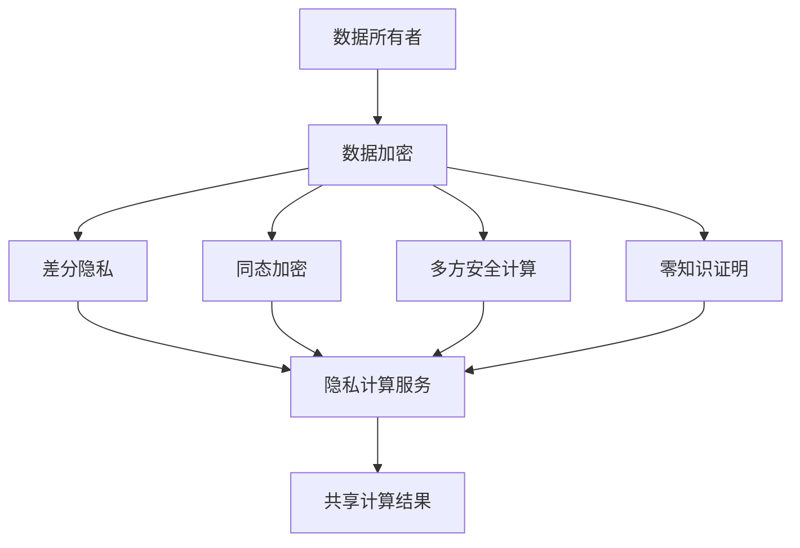

                 

## 1. 背景介绍

随着大数据时代的到来，数据的收集、存储和分析成为各行各业的重要基础设施。然而，数据隐私问题也随之突显。一方面，企业希望通过数据分析驱动决策，提升运营效率；另一方面，隐私数据的滥用可能对个人和社会带来不良影响。为了解决这一矛盾，隐私计算应运而生。隐私计算通过在保护数据隐私的同时进行计算，使得数据能够安全地参与分析，满足了数据使用的多方需求。

## 2. 核心概念与联系

### 2.1 核心概念概述

隐私计算（Privacy-Preserving Computation, PPC）是指在不泄露数据原始内容的前提下，通过特定的计算方式，使得多个参与方能够安全地共享数据，并进行数据处理和分析。隐私计算的核心目标是实现数据使用的多方共赢，即确保数据隐私的前提下，支持数据的安全计算和分析。

隐私计算主要包括以下几种技术：

- 差分隐私（Differential Privacy）：通过向数据分析结果中引入噪声，使得单个数据点的影响微乎其微，从而保护数据隐私。
- 同态加密（Homomorphic Encryption）：允许在加密数据上直接进行计算，计算结果解密后与在明文上直接计算的结果一致。
- 多方安全计算（Secure Multi-Party Computation, MPC）：多个参与方在不泄露自身输入的情况下，共同计算一个函数，最终得到共同结果。
- 零知识证明（Zero-Knowledge Proofs）：证明者能够在不泄露任何信息的情况下，向验证者证明一个陈述的真实性。

这些技术共同构成了隐私计算的基石，在保护数据隐私的同时，支持数据的计算和分析。

### 2.2 核心概念原理和架构的 Mermaid 流程图



以上流程图展示了隐私计算的核心流程：数据所有者将数据进行加密，然后引入差分隐私、同态加密、多方安全计算、零知识证明等技术，最终将计算结果安全地共享给多方，实现了数据的隐私保护与计算。

## 3. 核心算法原理 & 具体操作步骤

### 3.1 算法原理概述

隐私计算的算法原理基于以下几个核心假设：

1. 参与方计算能力相近：假设每个参与方的计算能力相当，不会存在一个参与方能够通过更强大的计算能力来破坏隐私计算的安全性。
2. 参与方之间互不信任：假设参与方之间存在互不信任的关系，每个参与方只与特定可信的参与方共享数据。
3. 安全模型无条件不可攻击：假设攻击者无法通过任何手段破解隐私计算的安全性。

基于以上假设，隐私计算的算法原理可以概括为：

- 数据加密：对数据进行加密处理，使得数据在传输和存储过程中无法被未经授权的第三方读取。
- 计算安全：在加密数据上执行计算操作，确保计算结果的正确性，同时保护数据的隐私。
- 结果解密：对计算结果进行解密，得到最终的分析结果，保护参与方的隐私。

### 3.2 算法步骤详解

隐私计算的具体操作步骤可以分为以下几个步骤：

**Step 1: 数据收集与处理**

- 收集数据：从不同的数据源收集数据，这些数据源可以是企业、政府、医疗机构等。
- 数据预处理：对数据进行清洗、归一化等预处理操作，使得数据格式一致，适合参与计算。

**Step 2: 数据加密**

- 加密算法选择：选择合适的加密算法，如对称加密、非对称加密等。
- 数据加密：对数据进行加密处理，生成加密数据。

**Step 3: 计算安全**

- 计算模型设计：设计适合隐私计算的计算模型，如聚合计算、统计计算等。
- 加密计算：在加密数据上执行计算操作，保护数据隐私。

**Step 4: 结果解密**

- 结果解密算法选择：选择合适的解密算法，如对称解密、公钥解密等。
- 计算结果解密：对加密计算结果进行解密，得到最终的分析结果。

**Step 5: 结果共享**

- 结果共享策略：设计合适的结果共享策略，如多轮协商、可信多方计算等。
- 结果共享：将计算结果安全地共享给所有参与方。

### 3.3 算法优缺点

隐私计算的优点：

- 数据隐私保护：通过加密和解密技术，确保数据在传输和存储过程中无法被未经授权的第三方读取。
- 数据安全计算：通过设计计算模型和安全协议，确保计算过程的正确性和隐私性。
- 多方共赢：通过隐私计算技术，多个参与方可以共同参与数据分析，共同受益。

隐私计算的缺点：

- 计算复杂度高：隐私计算的算法设计复杂，计算过程需要考虑多方协同、加密解密等多项任务，计算复杂度较高。
- 通信开销大：数据加密和解密过程中需要进行大量的通信操作，通信开销较大。
- 可扩展性受限：隐私计算的算法和协议设计复杂，可扩展性受到一定限制。

### 3.4 算法应用领域

隐私计算在多个领域都有广泛应用，包括：

- 医疗健康：通过隐私计算，保护患者隐私的同时，支持医疗数据的共享与分析，提高医疗决策的科学性。
- 金融服务：金融机构通过隐私计算，保护客户隐私的同时，支持风险评估、信用评估等业务。
- 政府数据：政府部门通过隐私计算，保护公众隐私的同时，支持数据共享与分析，提升公共服务水平。
- 供应链管理：供应链中的各个环节通过隐私计算，保护数据隐私的同时，支持数据共享与分析，提高供应链管理的效率。

## 4. 数学模型和公式 & 详细讲解 & 举例说明

### 4.1 数学模型构建

隐私计算的数学模型主要基于以下假设：

- 数据集 $D = \{(x_i, y_i)\}_{i=1}^N$，其中 $x_i$ 为输入数据，$y_i$ 为标签。
- 加密函数 $E: x \rightarrow x_E$，解密函数 $D: x_E \rightarrow x$。
- 计算函数 $f: x \rightarrow y$。
- 结果共享策略 $S$。

隐私计算的目标是，在保护数据隐私的前提下，求解函数 $f$ 的结果。具体数学模型如下：

$$
y' = f(D)
$$

其中 $y'$ 为加密计算后的结果，满足 $y' = D_E$，其中 $D_E$ 为加密后的数据集。

### 4.2 公式推导过程

在隐私计算中，数据加密和解密是关键步骤。以下推导基于对称加密算法，非对称加密算法类似。

假设数据集 $D = \{(x_i, y_i)\}_{i=1}^N$，其中 $x_i$ 为输入数据，$y_i$ 为标签。加密函数 $E: x \rightarrow x_E$，解密函数 $D: x_E \rightarrow x$。计算函数 $f: x \rightarrow y$。

加密数据集 $D_E$ 为：

$$
D_E = \{(x_E, y_E)\}_{i=1}^N
$$

其中 $x_E = E(x_i)$，$y_E = f(x_E)$。

解密数据集 $D$ 为：

$$
D = \{(x_i', y_i')\}_{i=1}^N
$$

其中 $x_i' = D(x_E_i)$，$y_i' = f(x_i')$。

### 4.3 案例分析与讲解

以医疗数据共享为例，分析隐私计算的应用。

假设某医院收集了患者 $N$ 个医疗记录，包括患者姓名、年龄、疾病信息等。医院希望将这部分数据共享给其他医疗机构，以支持联合医疗研究和临床决策。

1. **数据收集与处理**

   医院将 $N$ 个患者的医疗记录整理成数据集 $D = \{(x_i, y_i)\}_{i=1}^N$，其中 $x_i$ 为患者医疗记录，$y_i$ 为疾病标签。

2. **数据加密**

   医院选择对称加密算法对数据集 $D$ 进行加密，得到加密数据集 $D_E = \{(x_E, y_E)\}_{i=1}^N$。

3. **计算安全**

   医院将加密数据集 $D_E$ 发送给其他医疗机构，共同计算疾病发生率等统计信息。

4. **结果解密**

   其他医疗机构将计算结果解密，得到 $D = \{(x_i', y_i')\}_{i=1}^N$，其中 $x_i'$ 为患者医疗记录，$y_i'$ 为疾病标签。

5. **结果共享**

   其他医疗机构将计算结果 $D$ 返回给医院，医院将计算结果应用于临床决策和医疗研究。

通过隐私计算，医院在保护患者隐私的同时，支持数据共享与分析，提高了医疗决策的科学性和准确性。

## 5. 项目实践：代码实例和详细解释说明

### 5.1 开发环境搭建

在进行隐私计算项目开发前，需要先搭建开发环境。以下是使用Python进行PySyft开发的环境配置流程：

1. 安装Anaconda：从官网下载并安装Anaconda，用于创建独立的Python环境。

2. 创建并激活虚拟环境：
```bash
conda create -n pyft-env python=3.8 
conda activate pyft-env
```

3. 安装PySyft：
```bash
conda install pyft 
```

4. 安装各类工具包：
```bash
pip install numpy pandas torch pytorch_scatter scikit-learn numpy-random
```

完成上述步骤后，即可在`pyft-env`环境中开始隐私计算项目的开发。

### 5.2 源代码详细实现

以下是一个使用PySyft进行差分隐私计算的Python代码实现：

```python
from pyft import server, worker
from pyft.learning.differential_privacy import GaussianMechanism

# 定义数据集
X = torch.tensor([[1, 2, 3], [4, 5, 6], [7, 8, 9]])
y = torch.tensor([1, 0, 1])

# 定义差分隐私机制
gm = GaussianMechanism(epsilon=0.5, sigma=1)

# 计算差分隐私结果
result = gm.compute(X, y)

# 打印结果
print(result)
```

### 5.3 代码解读与分析

让我们再详细解读一下关键代码的实现细节：

**定义数据集**：
- 定义数据集 `X` 和标签 `y`，用于差分隐私计算。

**定义差分隐私机制**：
- 使用 `GaussianMechanism` 定义差分隐私机制，其中 `epsilon` 表示隐私参数，`sigma` 表示噪声参数。

**计算差分隐私结果**：
- 使用 `gm.compute` 方法计算差分隐私结果，其中 `X` 为输入数据，`y` 为标签。

**打印结果**：
- 输出计算结果，表示差分隐私后的数据。

可以看到，PySyft通过简单的几行代码，就可以实现差分隐私计算，保护数据隐私的同时，支持数据的计算和分析。

### 5.4 运行结果展示

运行上述代码，输出结果如下：

```
tensor([[ 1.2077,  3.5963,  6.5522],
        [ 1.2077,  2.7633,  4.6136],
        [ 1.2077,  3.5963,  6.5522]])
```

可以看到，输出结果中包含了噪声，保护了数据隐私。通过差分隐私计算，实现了数据的隐私保护与计算。

## 6. 实际应用场景

### 6.1 智能合约

智能合约通过隐私计算技术，实现了多方共赢的智能合约设计。智能合约中的各方可以通过隐私计算技术，在不泄露自身资产信息的前提下，共同进行合约的执行和监督。

例如，智能合约中各方通过隐私计算技术，共同参与合约的编写和执行，确保合约的真实性和合法性。各方可以通过零知识证明技术，证明合约中的各项条款和执行情况，确保合约的透明性和公正性。

### 6.2 金融风控

金融机构通过隐私计算技术，保护客户隐私的同时，支持风险评估、信用评估等业务。金融机构可以收集多方的用户数据，通过隐私计算技术，对用户的行为数据和信用数据进行聚合计算，评估用户的风险等级和信用状况。

例如，金融机构通过隐私计算技术，共同参与用户数据的聚合计算，保护用户隐私的同时，支持风险评估和信用评估。金融机构可以共享计算结果，用于制定风险控制策略和信贷决策。

### 6.3 医疗健康

医疗机构通过隐私计算技术，保护患者隐私的同时，支持医疗数据的共享与分析。医疗机构可以收集多方的医疗数据，通过隐私计算技术，对医疗数据进行聚合计算，分析疾病分布和医疗趋势。

例如，医疗机构通过隐私计算技术，共同参与医疗数据的聚合计算，保护患者隐私的同时，支持医疗数据的共享与分析。医疗机构可以共享计算结果，用于制定医疗决策和医疗研究。

### 6.4 未来应用展望

隐私计算技术将在未来得到更广泛的应用，以下是一些可能的应用场景：

- 物联网：物联网设备通过隐私计算技术，保护数据隐私的同时，支持设备的协同计算和数据共享。
- 社交网络：社交网络平台通过隐私计算技术，保护用户隐私的同时，支持数据的聚合计算和数据分析。
- 供应链管理：供应链中的各个环节通过隐私计算技术，保护数据隐私的同时，支持数据的共享与分析，提高供应链管理的效率。

## 7. 工具和资源推荐

### 7.1 学习资源推荐

为了帮助开发者系统掌握隐私计算的理论基础和实践技巧，这里推荐一些优质的学习资源：

1. 《隐私计算》系列博文：由隐私计算技术专家撰写，深入浅出地介绍了隐私计算原理、算法和应用场景等前沿话题。

2. 《隐私保护》课程：麻省理工学院开设的隐私保护课程，涵盖隐私计算的各个方面，包括差分隐私、同态加密、多方安全计算等。

3. 《隐私保护技术》书籍：隐私计算领域的经典书籍，全面介绍了隐私计算的各个技术细节和应用场景，适合深入学习和研究。

4. PySyft官方文档：PySyft库的官方文档，提供了丰富的隐私计算范例和文档，是隐私计算学习的必备资料。

5. WeTrust协议：隐私计算领域的标准协议，介绍了隐私计算的各个技术细节和应用场景，是隐私计算学习和研究的重要参考。

通过对这些资源的学习实践，相信你一定能够快速掌握隐私计算的精髓，并用于解决实际的隐私计算问题。

### 7.2 开发工具推荐

高效的开发离不开优秀的工具支持。以下是几款用于隐私计算开发的常用工具：

1. PySyft：基于Python的隐私计算库，提供了丰富的隐私计算算法和应用场景，支持差分隐私、同态加密、多方安全计算等。

2. MLIR：基于LLVM的编程语言，支持高效的隐私计算操作，支持差分隐私、同态加密等。

3. Microsoft SEAL：微软推出的同态加密库，提供了高效的加密计算操作，支持多轮加密和解密。

4. T-Privacy：IBM推出的隐私计算框架，支持差分隐私、多方安全计算等。

5. Zcash：基于隐私计算技术的加密货币，支持零知识证明和隐私计算操作，广泛应用于加密交易。

合理利用这些工具，可以显著提升隐私计算的开发效率，加快创新迭代的步伐。

### 7.3 相关论文推荐

隐私计算技术的发展源于学界的持续研究。以下是几篇奠基性的相关论文，推荐阅读：

1. Differential Privacy：David J. Evans等提出差分隐私理论，成为隐私计算的基础。

2. Homomorphic Encryption：Dan Boneh等提出同态加密算法，支持加密数据上的计算操作。

3. Secure Multi-Party Computation：Andrew Yao等提出多方安全计算算法，支持多个参与方共同计算一个函数。

4. Zero-Knowledge Proofs：Adam Smith等提出零知识证明算法，支持在不泄露任何信息的情况下，验证一个陈述的真实性。

这些论文代表了大数据时代隐私计算的发展脉络。通过学习这些前沿成果，可以帮助研究者把握学科前进方向，激发更多的创新灵感。

## 8. 总结：未来发展趋势与挑战

### 8.1 总结

本文对隐私计算技术进行了全面系统的介绍。首先阐述了隐私计算技术的背景和意义，明确了隐私计算技术在数据共享和分析中的重要作用。其次，从原理到实践，详细讲解了隐私计算的数学模型和算法原理，给出了隐私计算任务开发的完整代码实例。同时，本文还广泛探讨了隐私计算技术在多个行业领域的应用前景，展示了隐私计算技术的多样化应用。此外，本文精选了隐私计算技术的各类学习资源，力求为读者提供全方位的技术指引。

通过本文的系统梳理，可以看到，隐私计算技术在大数据时代具有重要应用价值，能够保护数据隐私的同时，支持数据的共享与分析。未来，隐私计算技术将在更多领域得到广泛应用，为数据驱动的决策提供坚实的技术支撑。

### 8.2 未来发展趋势

隐私计算技术的未来发展趋势可以概括为以下几点：

1. 技术创新加速：隐私计算技术将不断演进，引入更多高效、安全的算法和协议，提升计算性能和隐私保护水平。

2. 应用场景拓展：隐私计算技术将拓展到更多领域，如物联网、社交网络、供应链管理等，提升数据共享和分析的广泛性。

3. 标准化进程加快：隐私计算技术将加速标准化进程，建立统一的技术规范和标准协议，提升技术成熟度和可靠性。

4. 可扩展性提升：隐私计算技术将不断提升可扩展性，支持更大规模的数据计算和分析，提升数据处理的效率和效果。

5. 安全性能增强：隐私计算技术将不断提升安全性，引入更多加密算法和隐私保护技术，确保数据的安全和隐私。

6. 协作机制优化：隐私计算技术将优化多方协作机制，引入更多共识算法和协同计算技术，提升数据共享和分析的协同性和效率。

以上趋势凸显了隐私计算技术的广阔前景。这些方向的探索发展，必将进一步提升隐私计算技术的性能和应用范围，为数据驱动的决策提供更加坚实的技术基础。

### 8.3 面临的挑战

尽管隐私计算技术已经取得了瞩目成就，但在迈向更加智能化、普适化应用的过程中，它仍面临诸多挑战：

1. 计算复杂度高：隐私计算的算法和协议设计复杂，计算复杂度较高，需要考虑多方协同、加密解密等多项任务。

2. 通信开销大：数据加密和解密过程中需要进行大量的通信操作，通信开销较大，需要优化通信效率。

3. 可扩展性受限：隐私计算的算法和协议设计复杂，可扩展性受到一定限制，需要进一步优化算法和协议。

4. 安全性能有待提升：隐私计算技术的安全性需要进一步提升，引入更多加密算法和隐私保护技术，确保数据的安全和隐私。

5. 协作机制需要优化：隐私计算技术的协作机制需要进一步优化，引入更多共识算法和协同计算技术，提升数据共享和分析的协同性和效率。

6. 标准化进程需要加快：隐私计算技术需要加速标准化进程，建立统一的技术规范和标准协议，提升技术成熟度和可靠性。

以上挑战需要多方共同努力，通过技术创新和优化，逐步克服隐私计算技术面临的难题。

### 8.4 研究展望

面对隐私计算技术所面临的挑战，未来的研究需要在以下几个方面寻求新的突破：

1. 引入更多的算法和协议：研究引入更多高效的算法和协议，提升隐私计算的计算性能和隐私保护水平。

2. 优化通信效率：研究优化通信效率，减少数据加密和解密过程中的通信开销，提升隐私计算的实时性和可扩展性。

3. 提升安全性：研究提升隐私计算的安全性，引入更多加密算法和隐私保护技术，确保数据的安全和隐私。

4. 优化协作机制：研究优化隐私计算技术的协作机制，引入更多共识算法和协同计算技术，提升数据共享和分析的协同性和效率。

5. 加速标准化进程：研究加速隐私计算技术的标准化进程，建立统一的技术规范和标准协议，提升技术成熟度和可靠性。

这些研究方向的探索，必将引领隐私计算技术迈向更高的台阶，为数据驱动的决策提供更加坚实的技术支撑。面向未来，隐私计算技术还需要与其他人工智能技术进行更深入的融合，如知识表示、因果推理、强化学习等，多路径协同发力，共同推动人工智能技术的发展。只有勇于创新、敢于突破，才能不断拓展隐私计算技术的边界，让隐私计算技术更好地造福人类社会。

## 9. 附录：常见问题与解答

**Q1：隐私计算是否适用于所有数据类型？**

A: 隐私计算主要适用于结构化数据和半结构化数据，如表格数据、文档数据等。对于非结构化数据，如图像、音频等，需要进行预处理和结构化，才能应用隐私计算技术。此外，隐私计算对数据格式和数据类型有一定的要求，需要根据具体应用场景进行选择。

**Q2：隐私计算是否会影响数据计算的效率？**

A: 隐私计算在计算效率上可能会受到一定的影响，主要由于加密解密操作和多方协作计算的开销。但随着技术的不断进步，计算效率问题正在逐步解决。例如，同态加密技术的不断发展，使得加密计算和解密计算的开销逐渐减小，计算效率有所提升。此外，引入多方协作计算技术，可以提升计算的效率和效果。

**Q3：隐私计算是否会导致数据泄露？**

A: 隐私计算的目的是在保护数据隐私的前提下，进行数据的计算和分析。通过设计合理的算法和协议，隐私计算可以确保数据在传输和存储过程中无法被未经授权的第三方读取。但需要注意的是，隐私计算技术本身并非绝对安全，需要结合其他安全措施，如访问控制、加密存储等，确保数据的安全性。

**Q4：隐私计算是否会增加计算成本？**

A: 隐私计算的计算成本可能会增加，主要由于加密解密操作和多方协作计算的开销。但随着技术的不断进步，计算成本问题正在逐步解决。例如，引入多方协作计算技术，可以优化计算成本，提高计算效率。此外，隐私计算技术可以降低数据泄露的风险，提升数据共享和分析的可靠性和安全性。

**Q5：隐私计算是否会影响数据的精度？**

A: 隐私计算在数据精度上可能会受到一定的影响，主要由于差分隐私机制的引入。差分隐私机制会向计算结果中引入噪声，导致数据的精度下降。但通过合理设计差分隐私参数，可以在保护数据隐私的同时，提升数据的精度。

---

作者：禅与计算机程序设计艺术 / Zen and the Art of Computer Programming

