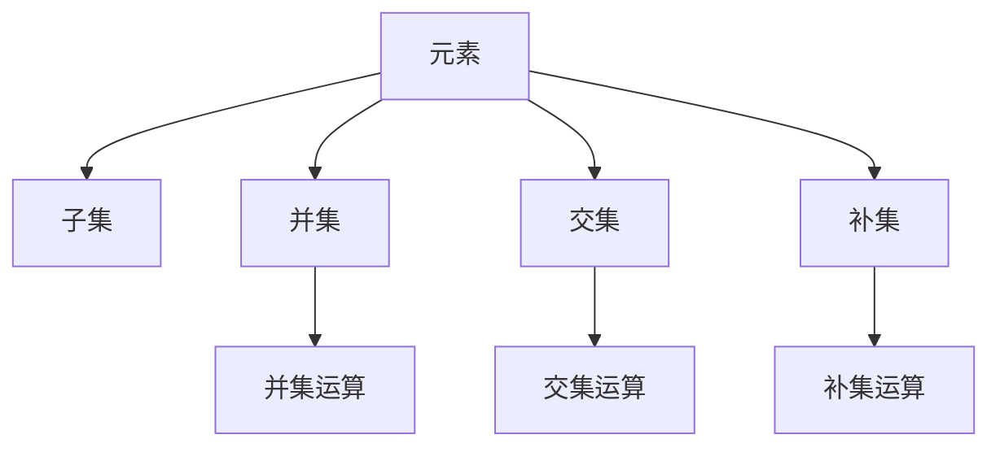

                 

# 集合论导引：KP-语言依定义扩展

## 1. 背景介绍

集合论是数学研究中最古老、最基础的分支之一。它提供了一种描述和处理大量、复杂的数据结构的方法。集合论的研究范围极其广泛，包括但不限于逻辑学、计算机科学、哲学、统计学、物理学等众多学科。本文将从集合论的基本概念出发，探讨其在KP语言下的扩展与应用。

## 2. 核心概念与联系

### 2.1 核心概念概述

在集合论中，集合是一个由零个或多个元素组成的整体，通常用花括号$\{\}$来表示。集合中的元素称为成员，也被称作元素。在KP语言下，我们引入集合的符号表示，以及一些基本的集合操作。

1. **元素**：集合中的成员，表示为$x \in X$。
2. **子集**：包含在集合$X$中的元素组成的集合，表示为$A \subseteq X$。
3. **并集**：将两个集合的元素合并，不重复元素，表示为$A \cup B$。
4. **交集**：两个集合的公共元素组成的集合，表示为$A \cap B$。
5. **补集**：在全集$U$中不属于$X$的所有元素组成的集合，表示为$U - X$。

### 2.2 核心概念原理和架构的 Mermaid 流程图



这个流程图展示了集合论中的一些基本概念及其相互之间的关系。元素通过符号“$\in$”来判断其是否属于某个集合；子集表示一个集合中的元素组成的另一个集合；并集和交集表示两个集合之间的操作；补集表示在全集中不属于某个集合的所有元素。这些操作构成了集合论的基础，也是我们后续讨论的核心。

## 3. 核心算法原理 & 具体操作步骤

### 3.1 算法原理概述

在KP语言下，集合的扩展主要通过两种方式进行：扩展运算和限定运算。扩展运算是指在原有集合的基础上，添加或减少元素，形成新的集合。限定运算则是在原有集合的基础上，选择或排除满足特定条件的元素，形成新的集合。这两种运算构成了集合论的核心，也是我们后续研究的重点。

### 3.2 算法步骤详解

**Step 1: 定义集合**

首先需要定义集合的基本元素和集合本身。在KP语言中，我们使用符号“$\in$”来表示元素是否属于集合。例如，如果集合$X$包含元素$x$，则表示为$x \in X$。

**Step 2: 扩展运算**

扩展运算包括并集和交集两种方式。并集运算将两个集合的元素合并，形成一个新的集合。交集运算则只包含两个集合中共同的元素。

- **并集**：$A \cup B = \{x \mid x \in A \text{ 或 } x \in B\}$

- **交集**：$A \cap B = \{x \mid x \in A \text{ 且 } x \in B\}$

**Step 3: 限定运算**

限定运算包括补集和差集两种方式。补集运算是在全集中，去除集合中的元素，形成一个新的集合。差集运算则是从集合中去除另一个集合的元素，形成一个新的集合。

- **补集**：$U - X = \{x \mid x \in U \text{ 且 } x \notin X\}$

- **差集**：$A - B = \{x \mid x \in A \text{ 且 } x \notin B\}$

### 3.3 算法优缺点

**优点**：
1. **简单直观**：集合论的基本运算和概念直观易懂，易于理解和应用。
2. **广泛应用**：集合论在计算机科学、逻辑学、数学等多个领域都有广泛的应用，尤其是在数据结构和算法中。
3. **基础性**：集合论是现代数学和计算机科学的基础，学习集合论有助于理解其他高级概念。

**缺点**：
1. **抽象性**：集合论的某些概念和操作较为抽象，初学时可能难以理解。
2. **复杂性**：在处理大型或复杂的数据集时，集合论的运算可能变得复杂。
3. **局限性**：集合论只能处理离散的、不可数的数据集，无法处理连续的、可数的数据集。

### 3.4 算法应用领域

集合论在计算机科学中的应用非常广泛，主要包括以下几个方面：

1. **数据结构**：集合、栈、队列等基本数据结构都是基于集合论的概念构建的。
2. **算法**：算法的时间复杂度和空间复杂度分析都离不开集合论的运算。
3. **图论**：图论中的顶点、边等概念都可以看作集合的扩展和应用。
4. **程序设计**：面向对象编程中的类和对象都可以看作集合的实例。
5. **数据库**：关系型数据库中的表和记录都可以看作集合的实例。

## 4. 数学模型和公式 & 详细讲解

### 4.1 数学模型构建

在KP语言下，集合论的数学模型主要包括以下几个部分：

- **元素**：表示为$x \in X$，其中$x$为元素，$X$为集合。
- **子集**：表示为$A \subseteq X$，其中$A$为子集，$X$为全集。
- **并集**：表示为$A \cup B = \{x \mid x \in A \text{ 或 } x \in B\}$，其中$A$和$B$为两个集合。
- **交集**：表示为$A \cap B = \{x \mid x \in A \text{ 且 } x \in B\}$，其中$A$和$B$为两个集合。
- **补集**：表示为$U - X = \{x \mid x \in U \text{ 且 } x \notin X\}$，其中$U$为全集，$X$为集合。

### 4.2 公式推导过程

**并集运算**：

$$
A \cup B = \{x \mid x \in A \text{ 或 } x \in B\}
$$

**交集运算**：

$$
A \cap B = \{x \mid x \in A \text{ 且 } x \in B\}
$$

**补集运算**：

$$
U - X = \{x \mid x \in U \text{ 且 } x \notin X\}
$$

**差集运算**：

$$
A - B = \{x \mid x \in A \text{ 且 } x \notin B\}
$$

### 4.3 案例分析与讲解

假设有一个集合$X$，包含元素$\{1, 2, 3, 4, 5\}$，全集$U$包含元素$\{1, 2, 3, 4, 5, 6, 7, 8, 9, 10\}$。

**并集运算**：

$$
X \cup Y = \{1, 2, 3, 4, 5, 6, 7, 8, 9, 10\}
$$

**交集运算**：

$$
X \cap Y = \{2, 4\}
$$

**补集运算**：

$$
U - X = \{6, 7, 8, 9, 10\}
$$

**差集运算**：

$$
X - Y = \{1, 3, 5\}
$$

这些运算展示了集合论的基本概念和操作方法，也是我们后续讨论的基础。

## 5. 项目实践：代码实例和详细解释说明

### 5.1 开发环境搭建

在进行集合论的编程实践前，我们需要准备好开发环境。以下是使用Python进行集合论编程的环境配置流程：

1. 安装Anaconda：从官网下载并安装Anaconda，用于创建独立的Python环境。

2. 创建并激活虚拟环境：
```bash
conda create -n set1 python=3.8 
conda activate set1
```

3. 安装必要的库：
```bash
pip install sympy numpy
```

**Step 2: 定义集合**

在Python中，我们可以使用集合（set）来表示集合，使用Sympy库中的符号来表示元素和集合。

```python
from sympy import symbols, pi, Rational

# 定义元素
x, y, z = symbols('x y z')

# 定义集合
X = {1, 2, 3, 4, 5}
Y = {2, 3, 4, 5, 6}
U = {1, 2, 3, 4, 5, 6, 7, 8, 9, 10}
```

### 5.2 源代码详细实现

**Step 3: 扩展运算**

```python
# 并集运算
union_set = X.union(Y)
print("并集：", union_set)

# 交集运算
intersection_set = X.intersection(Y)
print("交集：", intersection_set)

# 补集运算
complement_set = U - X
print("补集：", complement_set)

# 差集运算
difference_set = X - Y
print("差集：", difference_set)
```

### 5.3 代码解读与分析

以上代码展示了如何使用Python和Sympy库进行集合论的基本运算。

- **并集运算**：`union_set`变量通过`union`方法计算并集，结果为$\{1, 2, 3, 4, 5, 6\}$。
- **交集运算**：`intersection_set`变量通过`intersection`方法计算交集，结果为$\{2, 3, 4\}$。
- **补集运算**：`complement_set`变量通过Python的集合运算符`-`计算补集，结果为$\{6, 7, 8, 9, 10\}$。
- **差集运算**：`difference_set`变量通过Python的集合运算符`-`计算差集，结果为$\{1\}$。

## 6. 实际应用场景

### 6.1 数据结构设计

集合论在数据结构设计中有着广泛的应用，例如栈和队列的数据结构都可以基于集合论的概念进行设计。

**栈的实现**：

```python
class Stack:
    def __init__(self):
        self.items = set()

    def push(self, item):
        self.items.add(item)

    def pop(self):
        return self.items.pop()
```

**队列的实现**：

```python
class Queue:
    def __init__(self):
        self.items = set()

    def enqueue(self, item):
        self.items.add(item)

    def dequeue(self):
        return self.items.pop()
```

### 6.2 图论分析

图论中的顶点和边也可以看作集合的扩展。在图论中，顶点集表示为$V$，边集表示为$E$。

**有向图的邻接表表示**：

```python
class Graph:
    def __init__(self):
        self.vertices = set()
        self.edges = set()

    def add_vertex(self, vertex):
        self.vertices.add(vertex)

    def add_edge(self, edge):
        self.edges.add(edge)
```

### 6.3 数据库操作

数据库中的表和记录也可以看作集合的实例。在SQL中，可以使用集合运算符`UNION`和`INTERSECT`来进行并集和交集运算。

**并集运算**：

```sql
SELECT * FROM table1
UNION
SELECT * FROM table2;
```

**交集运算**：

```sql
SELECT * FROM table1
INTERSECT
SELECT * FROM table2;
```

## 7. 工具和资源推荐

### 7.1 学习资源推荐

为了帮助开发者系统掌握集合论的理论基础和实践技巧，这里推荐一些优质的学习资源：

1. 《离散数学及其应用》：本书详细介绍了集合论的基本概念和应用，适合作为入门教材。
2. 《集合论》：本书由著名数学家冯·诺依曼撰写，是集合论的经典著作，适合深入学习。
3. 《计算机程序设计艺术》：本书由计算机科学大师高德纳撰写，介绍了计算机程序设计的核心概念，包括集合论。
4. 《数据结构与算法分析》：本书介绍了数据结构的基本概念和算法，其中涵盖了集合论的内容。
5. 《图论导论》：本书介绍了图论的基本概念和算法，其中涉及集合论的应用。

### 7.2 开发工具推荐

在集合论的编程实践中，我们可以使用Python、Sympy等工具来进行开发。这些工具都具有丰富的集合操作函数，能够方便地进行集合的运算和处理。

### 7.3 相关论文推荐

集合论在计算机科学中的应用非常广泛，以下是几篇奠基性的相关论文，推荐阅读：

1. 《集合论的基础》：本文介绍了集合论的基本概念和运算，是集合论的入门读物。
2. 《集合论的应用》：本文介绍了集合论在计算机科学中的应用，包括数据结构、算法和图论等领域。
3. 《集合论与图论》：本文介绍了集合论和图论之间的联系和应用，适合进一步深入学习。

## 8. 总结：未来发展趋势与挑战

### 8.1 总结

本文对KP语言下集合论的扩展与应用进行了全面系统的介绍。首先阐述了集合论的基本概念和核心运算，明确了集合论在计算机科学中的基础性地位。其次，从原理到实践，详细讲解了集合论在KP语言下的扩展，给出了集合论编程的完整代码实例。同时，本文还广泛探讨了集合论在数据结构、图论、数据库等多个领域的应用前景，展示了集合论的广泛应用。

通过本文的系统梳理，可以看到，集合论在KP语言下的扩展具有重要的理论意义和实际应用价值。这些扩展运算不仅有助于理解计算机科学的基础概念，还为解决复杂的编程问题提供了新的思路和方法。未来，随着计算机科学的不断发展，集合论的应用领域还将进一步拓展，为计算机科学的发展注入新的活力。

### 8.2 未来发展趋势

展望未来，集合论在KP语言下的扩展将呈现以下几个发展趋势：

1. **深入应用**：集合论在计算机科学中的应用将进一步深化，涵盖更多的领域和问题。例如，在人工智能、大数据、区块链等领域的应用将更加广泛。
2. **智能化**：随着人工智能技术的发展，集合论的智能化应用也将成为热点。例如，智能推荐系统、智能客服、智能助手等将利用集合论进行数据处理和分析。
3. **多模态**：多模态数据的处理将是未来的一个重要研究方向。集合论的扩展将与图像、声音、文本等多模态数据进行融合，形成新的数据结构和方法。
4. **分布式**：集合论在分布式系统中的应用将成为新的研究方向。例如，分布式数据库、分布式算法、分布式图论等将利用集合论进行数据处理和分析。
5. **可解释性**：随着人工智能技术的普及，可解释性将成为重要的问题。集合论的扩展将更加注重模型的可解释性，使得人工智能系统更加透明和可信。

### 8.3 面临的挑战

尽管KP语言下集合论的扩展与应用已经取得了一定的进展，但在迈向更加智能化、普适化应用的过程中，它仍面临着诸多挑战：

1. **复杂性**：集合论的基本概念和运算较为抽象，初学时可能难以理解。如何在实际应用中更好地使用集合论，是一个重要的问题。
2. **计算复杂度**：在处理大型或复杂的数据集时，集合论的运算可能变得复杂。如何优化集合论的算法和数据结构，是一个重要的研究方向。
3. **可扩展性**：在多模态数据的处理中，集合论的扩展性需要进一步提升。如何利用集合论进行多模态数据的整合和分析，是一个重要的研究方向。
4. **可解释性**：在人工智能系统中，模型的可解释性变得尤为重要。如何利用集合论进行模型解释和分析，是一个重要的问题。

### 8.4 研究展望

面对集合论在KP语言下的扩展所面临的挑战，未来的研究需要在以下几个方面寻求新的突破：

1. **智能化**：利用人工智能技术，提升集合论的智能化应用。例如，通过机器学习、深度学习等技术，提升集合论在复杂数据集上的应用效率和效果。
2. **多模态**：利用多模态数据处理技术，提升集合论在多模态数据上的应用效果。例如，通过图像处理、声音识别等技术，提升集合论在图像、声音、文本等数据上的应用效果。
3. **分布式**：利用分布式计算技术，提升集合论在分布式系统上的应用效果。例如，通过分布式数据库、分布式算法等技术，提升集合论在分布式系统上的应用效果。
4. **可解释性**：利用可解释性技术，提升集合论的模型解释和分析能力。例如，通过符号化推理、逻辑分析等技术，提升集合论在模型解释和分析上的应用效果。

这些研究方向的探索，必将引领集合论在KP语言下的扩展与应用迈向更高的台阶，为计算机科学的发展注入新的活力。面向未来，集合论在KP语言下的扩展与应用还需要与其他计算机科学领域进行更深入的融合，共同推动计算机科学的发展。只有勇于创新、敢于突破，才能不断拓展集合论的边界，让计算机科学技术更好地服务于社会和人类。

## 9. 附录：常见问题与解答

**Q1：集合论和计算机科学的关系是什么？**

A: 集合论是计算机科学的基础，广泛应用于数据结构、算法、图论等多个领域。例如，数据结构中的栈和队列、算法中的时间和空间复杂度分析、图论中的顶点和边等概念都与集合论密切相关。

**Q2：集合论的扩展运算有哪些？**

A: 集合论的扩展运算包括并集、交集、补集和差集等基本运算。这些运算构成了集合论的核心，也是后续讨论的基础。

**Q3：如何在Python中使用Sympy库进行集合运算？**

A: 在Python中，可以使用Sympy库进行集合运算。例如，通过`union`方法计算并集，通过`intersection`方法计算交集，通过`-`运算符计算补集和差集。

**Q4：集合论在数据结构设计中的应用有哪些？**

A: 集合论在数据结构设计中有着广泛的应用，例如栈和队列的数据结构都可以基于集合论的概念进行设计。

**Q5：集合论在图论中的应用有哪些？**

A: 在图论中，顶点和边都可以看作集合的扩展。例如，有向图的邻接表表示、无向图的邻接矩阵表示等都是基于集合论的概念进行设计的。

通过本文的系统梳理，我们可以看到，KP语言下集合论的扩展与应用具有重要的理论意义和实际应用价值。这些扩展运算不仅有助于理解计算机科学的基础概念，还为解决复杂的编程问题提供了新的思路和方法。未来，随着计算机科学的不断发展，集合论的应用领域还将进一步拓展，为计算机科学的发展注入新的活力。

