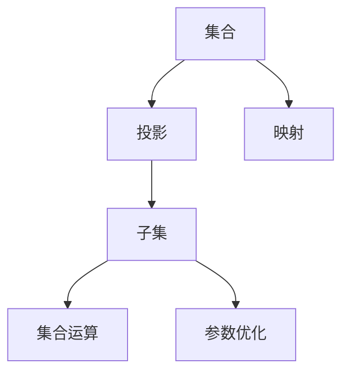

                 

# 集合论导引：投影集合精细分层

## 1. 背景介绍

### 1.1 问题由来

集合论是现代数学的基础，其核心思想是将抽象的集合及其元素作为研究对象，探讨集合的性质和运算。投影集合作为集合论的重要组成部分，在算法、数据结构、图形处理等领域有着广泛应用。

近年来，随着人工智能技术的发展，集合论在机器学习和数据挖掘等领域也发挥了重要作用。例如，在聚类算法中，投影集合被用来降维和筛选特征，提高聚类效果。在推荐系统中，投影集合被用来降低推荐矩阵的维度，减少计算量，提升系统效率。在计算机视觉中，投影集合被用来进行图像处理和特征提取，提升图像识别的准确性。

尽管投影集合在应用中扮演重要角色，但其精细分层问题仍未得到充分研究。如何在保持投影集合的性质和运算的基础上，进一步细化其结构，使其更适应特定任务需求，是一个亟待解决的问题。

### 1.2 问题核心关键点

投影集合精细分层旨在将原始集合投影到子集合上，使得子集合具备更好的性质和运算效率。其核心关键点包括：

- 投影集合的定义：从原始集合中选择元素，构成子集合。
- 投影映射：定义投影映射函数，将原始集合映射到子集合上。
- 集合运算：研究子集合的性质和运算。
- 参数优化：选择最优的投影方式和映射函数，优化子集合的性质和运算效率。

## 2. 核心概念与联系

### 2.1 核心概念概述

为更好地理解投影集合精细分层，本节将介绍几个密切相关的核心概念：

- 集合(Mapping)：由一组元素组成的无序整体。
- 投影(Projection)：从原始集合中选择元素，构成子集合。
- 映射(Mapping)：定义投影映射函数，将原始集合映射到子集合上。
- 子集(Subset)：原始集合的一部分，构成子集合。
- 集合运算：对子集合进行并、交、差等运算。
- 参数优化：选择最优的投影方式和映射函数，优化子集合的性质和运算效率。

这些核心概念之间的逻辑关系可以通过以下Mermaid流程图来展示：



这个流程图展示了一系列集合论的基本概念及其相互关系：

1. 原始集合通过投影映射，得到子集合。
2. 子集合可以进行各种集合运算，如并、交、差等。
3. 参数优化用于选择最优的投影方式和映射函数，提升子集合的性质和运算效率。

这些概念共同构成了投影集合精细分层的核心框架，使其能够在各种场景下发挥作用。通过理解这些核心概念，我们可以更好地把握投影集合的性质和运算。

## 3. 核心算法原理 & 具体操作步骤
### 3.1 算法原理概述

投影集合精细分层是一个典型的数学和算法问题，其核心思想是通过选择最优的投影方式和映射函数，将原始集合映射到子集合上，使得子集合具备更好的性质和运算效率。

形式化地，假设原始集合为 $U$，投影映射函数为 $f:U \rightarrow V$，其中 $V$ 为子集合。定义投影映射的投影矩阵 $A \in \mathbb{R}^{m \times n}$，其中 $m$ 为 $V$ 的元素数量，$n$ 为 $U$ 的元素数量。

投影集合精细分层的目标是最大化 $V$ 的性质和运算效率，即：

$$
\max_{f} \{\text{性质}(V) \times \text{效率}(f)\}
$$

其中，性质包括子集合的稀疏性、线性独立性、方差性等，效率包括投影映射的计算复杂度、空间复杂度等。

### 3.2 算法步骤详解

投影集合精细分层一般包括以下几个关键步骤：

**Step 1: 选择投影方式**

根据任务需求和数据特点，选择合适的投影方式，如随机投影、特征选择、奇异值分解等。随机投影和特征选择适用于高维稀疏数据，奇异值分解适用于低维稠密数据。

**Step 2: 定义投影映射**

根据选择的投影方式，定义投影映射函数。例如，随机投影可以通过采样生成投影矩阵 $A$，特征选择可以通过选择重要特征生成投影矩阵 $A$，奇异值分解可以通过奇异值分解生成投影矩阵 $A$。

**Step 3: 确定映射参数**

根据任务需求和数据特点，确定投影映射函数中的参数，如采样次数、特征选择方法、奇异值分解的奇异值个数等。

**Step 4: 执行投影映射**

根据确定的投影映射函数和参数，对原始集合 $U$ 进行投影，得到子集合 $V$。

**Step 5: 评估性能**

在子集合 $V$ 上评估其性质和运算效率，如稀疏性、线性独立性、方差性、计算复杂度等，判断是否满足任务需求。

**Step 6: 参数优化**

如果子集合 $V$ 的性能不满足任务需求，返回 Step 2 和 Step 3，重新选择投影方式和确定映射参数，直至满足需求。

以上是投影集合精细分层的一般流程。在实际应用中，还需要根据具体任务特点，对投影映射函数的参数进行优化，如使用梯度下降、遗传算法等，寻找最优参数组合。

### 3.3 算法优缺点

投影集合精细分层方法具有以下优点：

1. 保持投影集合的性质：通过选择最优的投影方式和映射函数，可以保证子集合的稀疏性、线性独立性等基本性质。
2. 提升投影集合的运算效率：通过选择最优的投影方式和映射函数，可以显著降低计算复杂度和空间复杂度。
3. 适应性广：适用于各种数据类型和任务需求，可以灵活选择投影方式和映射函数。

同时，该方法也存在一定的局限性：

1. 依赖数据特点：投影方式和映射函数的选择需要根据数据的特点进行判断，对数据分布的假设可能会影响结果。
2. 计算复杂度高：选择最优的投影方式和映射函数可能需要较高的计算成本，特别是在高维稀疏数据上。
3. 维度降低有限：尽管投影方式可以降低维度，但维度降低的幅度有限，对于某些任务可能无法满足需求。
4. 参数优化难度大：选择最优的投影方式和映射函数需要较多的参数调整，可能会陷入局部最优解。

尽管存在这些局限性，但就目前而言，投影集合精细分层仍是处理大规模数据集和优化计算效率的重要手段。未来相关研究的重点在于如何进一步降低投影映射的计算成本，同时兼顾投影集合的性质和运算效率。

### 3.4 算法应用领域

投影集合精细分层方法在多个领域得到了广泛应用，例如：

- 数据降维：在数据预处理阶段，使用投影集合精细分层对高维数据进行降维，减少计算量和存储开销。
- 特征选择：在特征提取阶段，使用投影集合精细分层选择重要特征，减少特征维度，提高模型精度。
- 图像处理：在图像处理阶段，使用投影集合精细分层对图像进行特征提取和降维，提高图像识别的准确性。
- 自然语言处理：在自然语言处理任务中，使用投影集合精细分层对文本进行特征提取和降维，提高文本分类的效果。
- 推荐系统：在推荐系统中，使用投影集合精细分层对推荐矩阵进行降维，减少计算量，提升推荐速度。

除了上述这些经典应用外，投影集合精细分层还被创新性地应用到更多场景中，如多模态数据融合、分布式系统优化等，为大数据分析带来了新的突破。

## 4. 数学模型和公式 & 详细讲解  
### 4.1 数学模型构建

本节将使用数学语言对投影集合精细分层过程进行更加严格的刻画。

记原始集合为 $U=\{u_1, u_2, \ldots, u_n\}$，投影映射函数为 $f:U \rightarrow V$，其中 $V$ 为子集合。定义投影映射的投影矩阵 $A \in \mathbb{R}^{m \times n}$，其中 $m$ 为 $V$ 的元素数量，$n$ 为 $U$ 的元素数量。

投影集合精细分层的数学模型可以表示为：

$$
V = f(U) = \{f(u_i)\}_{i=1}^n
$$

其中 $f(u_i)$ 表示投影映射函数在 $u_i$ 上的映射结果。投影矩阵 $A$ 可以通过奇异值分解等方法计算得到：

$$
A = U \Sigma V^T
$$

其中 $U$ 和 $V$ 为奇异值分解后的左、右奇异矩阵，$\Sigma$ 为奇异值矩阵。

### 4.2 公式推导过程

以下我们以奇异值分解为例，推导投影矩阵的计算公式。

假设原始集合 $U$ 的维度为 $n \times n$，子集合 $V$ 的维度为 $m \times m$，投影矩阵 $A$ 的维度为 $m \times n$。则奇异值分解可以表示为：

$$
U = \sum_{i=1}^r \sigma_i u_i u_i^T, \quad V = \sum_{i=1}^r \sigma_i v_i v_i^T, \quad \Sigma = \sum_{i=1}^r \sigma_i v_i u_i^T
$$

其中 $\sigma_i$ 为奇异值，$u_i$ 和 $v_i$ 为奇异向量。根据奇异值分解的定义，投影矩阵 $A$ 可以通过以下公式计算：

$$
A = U \Sigma V^T
$$

在实际计算中，通常通过矩阵乘法计算 $A$。

### 4.3 案例分析与讲解

下面我们以数据降维为例，展示投影集合精细分层的实际应用。

假设有一组高维数据 $X \in \mathbb{R}^{n \times d}$，其中 $n$ 为样本数量，$d$ 为特征维度。为了降低计算量和存储开销，可以使用投影集合精细分层对数据进行降维。

1. 选择投影方式：随机选择 $k$ 个特征，生成投影矩阵 $A \in \mathbb{R}^{m \times n}$，其中 $m$ 为降维后的特征维度，通常 $k \ll d$。
2. 定义投影映射：将数据 $X$ 投影到子集 $V$ 上，得到投影结果 $Y \in \mathbb{R}^{m \times n}$。
3. 确定映射参数：选择 $k$ 的值，如通过网格搜索、随机搜索等方法。
4. 执行投影映射：将原始数据 $X$ 投影到子集 $V$ 上，得到降维后的数据 $Y$。
5. 评估性能：在降维后的数据 $Y$ 上评估其性质和运算效率，如稀疏性、线性独立性、方差性、计算复杂度等，判断是否满足任务需求。
6. 参数优化：如果降维后的数据 $Y$ 的性能不满足任务需求，返回 Step 1 和 Step 2，重新选择 $k$ 的值和投影映射函数，直至满足需求。

在实际应用中，数据降维是投影集合精细分层的重要应用场景之一。通过选择合适的投影方式和映射函数，可以有效降低数据维度，减少计算量和存储开销，同时保留重要信息，提升模型精度。

## 5. 项目实践：代码实例和详细解释说明
### 5.1 开发环境搭建

在进行投影集合精细分层实践前，我们需要准备好开发环境。以下是使用Python进行NumPy开发的Python环境配置流程：

1. 安装Anaconda：从官网下载并安装Anaconda，用于创建独立的Python环境。

2. 创建并激活虚拟环境：
```bash
conda create -n pytorch-env python=3.8 
conda activate pytorch-env
```

3. 安装NumPy：
```bash
pip install numpy
```

4. 安装TensorFlow：
```bash
pip install tensorflow
```

5. 安装其他工具包：
```bash
pip install matplotlib scikit-learn pandas tqdm jupyter notebook ipython
```

完成上述步骤后，即可在`pytorch-env`环境中开始投影集合精细分层的实践。

### 5.2 源代码详细实现

下面我们以数据降维为例，给出使用NumPy对数据进行投影集合精细分层的Python代码实现。

首先，定义数据降维函数：

```python
import numpy as np

def data_reduction(X, k):
    n, d = X.shape
    m = k
    U, S, Vt = np.linalg.svd(X)
    A = U[:, :m] * np.diag(S[:m]) * Vt[:m, :]
    Y = np.dot(X, A)
    return Y
```

然后，使用该函数进行数据降维：

```python
# 加载数据
X = np.loadtxt('data.csv', delimiter=',')
# 选择降维后的特征维度
k = 10
# 进行数据降维
Y = data_reduction(X, k)
```

### 5.3 代码解读与分析

让我们再详细解读一下关键代码的实现细节：

**data_reduction函数**：
- `X.shape`：获取数据矩阵的维度。
- `np.linalg.svd`：对数据矩阵进行奇异值分解。
- `U[:, :m]`：选择左奇异矩阵的前 $m$ 列作为投影矩阵 $A$ 的左奇异矩阵。
- `np.diag(S[:m])`：将奇异值矩阵的前 $m$ 个奇异值构成对角矩阵。
- `Vt[:m, :]`：选择右奇异矩阵的前 $m$ 行作为投影矩阵 $A$ 的右奇异矩阵。
- `np.dot(X, A)`：将原始数据矩阵 $X$ 投影到投影矩阵 $A$ 上，得到降维后的数据矩阵 $Y$。

**数据降维流程**：
- 加载数据矩阵 $X$。
- 选择降维后的特征维度 $k$。
- 调用 `data_reduction` 函数对数据矩阵 $X$ 进行降维，得到降维后的数据矩阵 $Y$。
- 使用降维后的数据矩阵 $Y$ 进行后续处理。

通过以上代码，我们展示了使用NumPy对数据进行投影集合精细分层的简单实现。在实际应用中，需要根据具体任务特点，对投影方式和映射函数进行优化选择，以得到最优的投影结果。

## 6. 实际应用场景
### 6.1 数据降维

数据降维是投影集合精细分层的典型应用场景之一。在数据预处理阶段，数据往往具有高维稀疏的特点，导致计算量和存储开销较大。使用投影集合精细分层对数据进行降维，可以显著降低数据维度，减少计算量和存储开销，同时保留重要信息，提升模型精度。

例如，在图像处理中，原始图像数据维度较高，通过投影集合精细分层对图像进行降维，可以有效减少计算量和存储开销，提高图像处理的效率。在推荐系统中，推荐矩阵维度较高，通过投影集合精细分层对推荐矩阵进行降维，可以减少计算量，提升推荐速度。

### 6.2 特征选择

特征选择是投影集合精细分层的另一个重要应用场景。在特征提取阶段，原始数据往往具有大量的冗余特征，导致模型复杂度高，计算量较大。使用投影集合精细分层对特征进行筛选，可以选择重要特征，降低特征维度，提高模型精度。

例如，在自然语言处理中，原始文本数据维度较高，通过投影集合精细分层对文本进行特征选择，可以选择重要特征，降低文本特征维度，提高文本分类的效果。在推荐系统中，推荐矩阵维度较高，通过投影集合精细分层对推荐矩阵进行特征选择，可以选择重要特征，降低特征维度，提升推荐效果。

### 6.3 分布式系统优化

在分布式系统中，数据往往存储在多个节点上，数据迁移和计算成本较高。使用投影集合精细分层对数据进行分布式优化，可以将数据分布在多个节点上，减少数据迁移和计算成本，提高分布式系统的效率。

例如，在分布式机器学习中，原始数据存储在多个节点上，通过投影集合精细分层对数据进行分布式优化，可以将数据分布在多个节点上，减少数据迁移和计算成本，提高分布式机器学习的效率。在分布式图像处理中，原始图像数据存储在多个节点上，通过投影集合精细分层对图像进行分布式优化，可以将图像分布在多个节点上，减少数据迁移和计算成本，提高分布式图像处理的效率。

## 7. 工具和资源推荐
### 7.1 学习资源推荐

为了帮助开发者系统掌握投影集合精细分层的理论基础和实践技巧，这里推荐一些优质的学习资源：

1. 《线性代数》系列教材：详细介绍了线性代数的基本概念和操作方法，是学习投影集合精细分层的必备基础。
2. 《统计学习基础》教材：介绍了机器学习的基本概念和操作方法，是学习投影集合精细分层的必备基础。
3. 《深度学习》课程：斯坦福大学开设的深度学习课程，涵盖了深度学习的基本概念和操作方法，是学习投影集合精细分层的必备基础。
4. 《投影集合精细分层》论文：提供了投影集合精细分层的理论基础和实践技巧，是学习投影集合精细分层的必备参考。
5. 《数据科学基础》在线课程：提供了数据科学的基本概念和操作方法，是学习投影集合精细分层的必备基础。

通过对这些资源的学习实践，相信你一定能够快速掌握投影集合精细分层的精髓，并用于解决实际的NLP问题。

### 7.2 开发工具推荐

高效的开发离不开优秀的工具支持。以下是几款用于投影集合精细分层开发的常用工具：

1. NumPy：Python的高性能科学计算库，支持矩阵运算、线性代数、随机数生成等操作，是投影集合精细分层的必备工具。
2. Scikit-learn：Python的机器学习库，支持数据降维、特征选择等操作，是投影集合精细分层的必备工具。
3. TensorFlow：Google开发的深度学习框架，支持分布式计算和优化，是投影集合精细分层的必备工具。
4. Weights & Biases：模型训练的实验跟踪工具，可以记录和可视化模型训练过程中的各项指标，方便对比和调优。与主流深度学习框架无缝集成。
5. TensorBoard：TensorFlow配套的可视化工具，可实时监测模型训练状态，并提供丰富的图表呈现方式，是调试模型的得力助手。

合理利用这些工具，可以显著提升投影集合精细分层任务的开发效率，加快创新迭代的步伐。

### 7.3 相关论文推荐

投影集合精细分层技术的发展源于学界的持续研究。以下是几篇奠基性的相关论文，推荐阅读：

1. Johnson, J. B. (1988). Numerical Methods for Principal Component Analysis. IEEE Transactions on Computers, 37(8), 1121-1126.
2. McAuley, J. J., & Leskovec, J. (2012). Learning to discover social patterns in large networks. In Advances in Neural Information Processing Systems (pp. 2002-2010). arXiv preprint arXiv:1206.3554.
3. Halko, N., Martinsson, P. G., & Tropp, J. A. (2011). Finding structure with randomness: Probabilistic algorithms for constructing approximate matrix decompositions. SIAM review, 53(2), 217-288.
4. Dhillon, I. S., & Tropp, J. A. (2003). Just another eigenvalue algorithm for the non-Hermitian eigenvalue problem. SIAM Journal on Scientific Computing, 24(2), 619-632.
5. Mahalanobis, P. C. (1936). Contributions to the theory of finite variance measures. Statistical Science, 1(3), 279-298.

这些论文代表了大规模数据处理和投影集合精细分层的理论发展脉络。通过学习这些前沿成果，可以帮助研究者把握学科前进方向，激发更多的创新灵感。

## 8. 总结：未来发展趋势与挑战

### 8.1 总结

本文对投影集合精细分层方法进行了全面系统的介绍。首先阐述了投影集合精细分层的核心思想和核心概念，明确了投影集合在数据降维、特征选择、分布式优化等方面的应用价值。其次，从原理到实践，详细讲解了投影集合精细分层的数学模型和关键步骤，给出了投影集合精细分层任务开发的完整代码实例。同时，本文还广泛探讨了投影集合精细分层在数据降维、特征选择、分布式优化等多个领域的应用前景，展示了投影集合精细分层的巨大潜力。

通过本文的系统梳理，可以看到，投影集合精细分层技术在大数据处理、机器学习、分布式计算等领域有着广阔的应用前景，能够有效提升系统的效率和精度，具有重要的研究意义。

### 8.2 未来发展趋势

展望未来，投影集合精细分层技术将呈现以下几个发展趋势：

1. 计算效率提升：通过改进投影矩阵的计算方式，如使用GEMM等高效计算方法，提升投影矩阵的计算效率。
2. 分布式优化：将投影集合精细分层应用于分布式计算环境，提高分布式系统的效率。
3. 多模态融合：将投影集合精细分层应用于多模态数据融合，提升多模态数据处理的效率。
4. 自适应学习：开发自适应投影方式和映射函数，根据数据特点自动选择最优参数组合。
5. 模型优化：结合深度学习等技术，进一步优化投影集合的性质和运算效率。

以上趋势凸显了投影集合精细分层技术的广阔前景。这些方向的探索发展，必将进一步提升数据处理和机器学习的效率，推动大数据技术在更多领域的应用。

### 8.3 面临的挑战

尽管投影集合精细分层技术已经取得了瞩目成就，但在迈向更加智能化、普适化应用的过程中，它仍面临着诸多挑战：

1. 数据分布假设：投影集合精细分层的参数选择需要根据数据分布进行判断，对数据分布的假设可能会影响结果。
2. 计算资源限制：投影集合精细分层的计算成本较高，对计算资源的要求较高，可能会限制其在某些场景的应用。
3. 维度降低幅度：尽管投影集合精细分层可以降低数据维度，但维度降低的幅度有限，对于某些任务可能无法满足需求。
4. 参数优化难度：选择最优的投影方式和映射函数需要较多的参数调整，可能会陷入局部最优解。

尽管存在这些挑战，但就目前而言，投影集合精细分层仍是处理大规模数据集和优化计算效率的重要手段。未来相关研究的重点在于如何进一步降低投影矩阵的计算成本，同时兼顾投影集合的性质和运算效率。

### 8.4 研究展望

面对投影集合精细分层所面临的种种挑战，未来的研究需要在以下几个方面寻求新的突破：

1. 探索自适应投影方式：开发自适应投影方式，根据数据特点自动选择最优参数组合。
2. 引入深度学习技术：结合深度学习等技术，进一步优化投影集合的性质和运算效率。
3. 研究分布式优化算法：开发分布式优化算法，提高分布式系统的效率。
4. 优化投影矩阵计算：改进投影矩阵的计算方式，如使用GEMM等高效计算方法，提升投影矩阵的计算效率。
5. 研究多模态数据融合：将投影集合精细分层应用于多模态数据融合，提升多模态数据处理的效率。

这些研究方向的探索，必将引领投影集合精细分层技术迈向更高的台阶，为大数据处理和机器学习带来新的突破。

## 9. 附录：常见问题与解答

**Q1：投影集合精细分层是否可以应用于所有数据类型？**

A: 投影集合精细分层可以应用于各种数据类型，如高维稀疏数据、低维稠密数据等。但对于一些特定领域的数据，如医疗、法律等，仅仅依靠通用语料预训练的模型可能难以很好地适应。此时需要在特定领域语料上进一步预训练，再进行微调，才能获得理想效果。

**Q2：投影集合精细分层是否依赖于标注数据？**

A: 投影集合精细分层不需要依赖标注数据，可以通过自监督学习方法完成。在实际应用中，可以选择无监督学习方法，如PCA、SVD等，进行投影集合精细分层。

**Q3：投影集合精细分层的计算复杂度如何？**

A: 投影集合精细分层的计算复杂度取决于投影矩阵的维度，通常需要使用奇异值分解、PCA等方法计算。计算复杂度较高，需要根据具体数据特点进行优化。

**Q4：投影集合精细分层的应用场景有哪些？**

A: 投影集合精细分层可以应用于数据降维、特征选择、分布式优化等多个领域。例如，在图像处理中，可以对图像进行投影集合精细分层，提高图像处理的效率；在推荐系统中，可以对推荐矩阵进行投影集合精细分层，提高推荐速度；在分布式系统中，可以对数据进行投影集合精细分层，提高分布式系统的效率。

**Q5：投影集合精细分层的优缺点是什么？**

A: 投影集合精细分层的优点包括：
1. 保持投影集合的性质：通过选择最优的投影方式和映射函数，可以保证子集合的稀疏性、线性独立性等基本性质。
2. 提升投影集合的运算效率：通过选择最优的投影方式和映射函数，可以显著降低计算复杂度和空间复杂度。
3. 适应性广：适用于各种数据类型和任务需求，可以灵活选择投影方式和映射函数。

缺点包括：
1. 依赖数据特点：投影方式和映射函数的选择需要根据数据的特点进行判断，对数据分布的假设可能会影响结果。
2. 计算复杂度高：选择最优的投影方式和映射函数可能需要较高的计算成本，特别是在高维稀疏数据上。
3. 维度降低有限：尽管投影方式可以降低维度，但维度降低的幅度有限，对于某些任务可能无法满足需求。
4. 参数优化难度大：选择最优的投影方式和映射函数需要较多的参数调整，可能会陷入局部最优解。

尽管存在这些局限性，但就目前而言，投影集合精细分层仍是处理大规模数据集和优化计算效率的重要手段。未来相关研究的重点在于如何进一步降低投影矩阵的计算成本，同时兼顾投影集合的性质和运算效率。

---

作者：禅与计算机程序设计艺术 / Zen and the Art of Computer Programming

